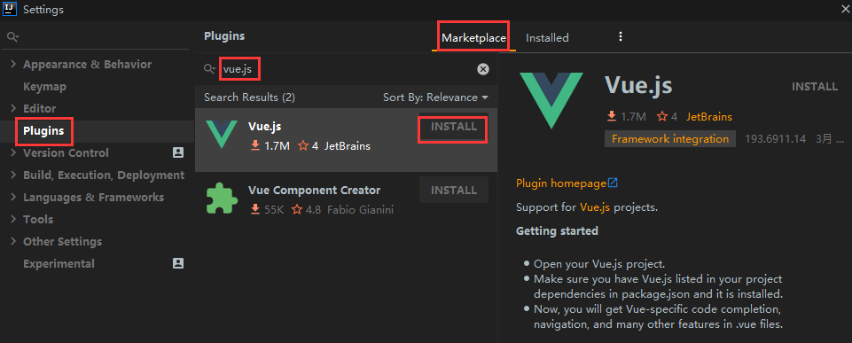
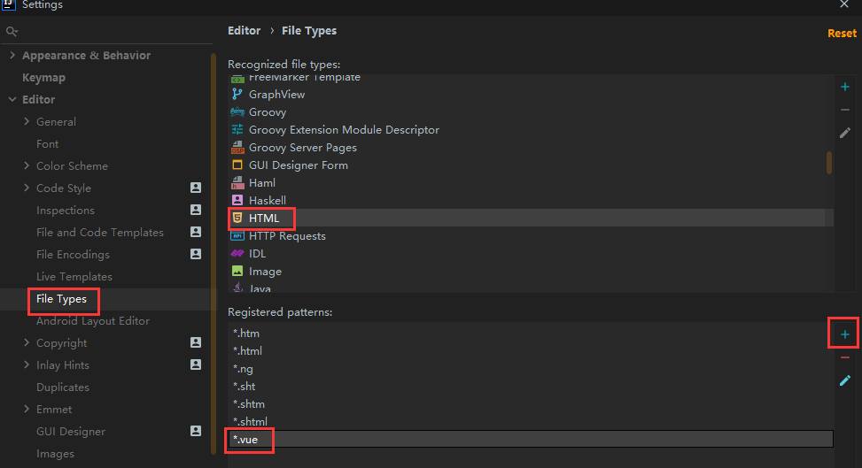
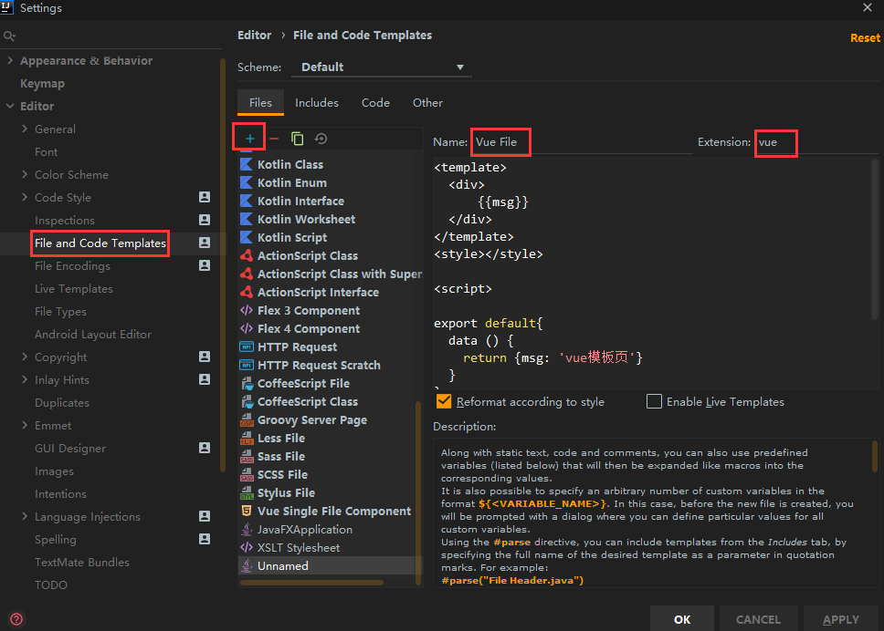

## 环境准备

### 安装 node.js 的nvm管理器

- **链接** [https://github.com/coreybutler/nvm-windows/releases](https://links.jianshu.com/go?to=https%3A%2F%2Fgithub.com%2Fcoreybutler%2Fnvm-windows%2Freleases)

- **可下载以下版本：**
  
  - [nvm-noinstall.zip](https://github.com/coreybutler/nvm-windows/releases/download/1.1.10/nvm-noinstall.zip)：绿色免安装版，但使用时需要进行配置。
  - [nvm-setup.zip](https://github.com/coreybutler/nvm-windows/releases/download/1.1.10/nvm-setup.exe)：安装版，推荐使用
  
 - 安装版会有两个目录，一个是nvm，另一个是node

 - 在nvm目录下修改`settings.txt`,增加下面镜像加速

> node_mirror: https://npm.taobao.org/mirrors/node/ 
> 
>npm_mirror: https://npm.taobao.org/mirrors/npm/

- 必须是管理员运行黑窗口

- 命令

  | 命令 | 功能 |
  | --- | --- |
  | nvm list | 显示已安装的版本（同 nvm list installed）|
  | nvm list installed | 显示已安装的版本|
  | nvm list available | 显示所有可以下载的版本|
  | nvm install 14.5.0 | 安装14.5.0版本node|
  | nvm install latest | 安装最新版本node|
  | nvm use 14.5.0 | 使用14.5.0版本node|
  | nvm uninstall 14.5.0 | 卸载14.5.0版本node|


### 安装 vue-li

> 全局安装 vue-cli，在命令行中执行：npm install -g @vue/cli-init

- 命令

- ```
  # 查看版本
  vue --version
    
  # 升级
  npm update -g @vue/cli
    
  # 创建项目
  vue create 项目名
  ```

### 安装 vue.js

* 打开 IDEA，File --> Settings --> Plugins 中搜索 vue.js 进行安装

  

  

## 配置 IDEA

### HTML 添加 *.vue类型

* File --> Settings --> Editor --> File Types --> HTML 选中  点下方的 + 添加 *.vue 后缀

  

### 设置 js

* File --> Settings --> Language & Frameworks --> JavaScript 选择 ECMAScript 6  和勾选 Prefer Strict mode(如果有的话。没有就算了)

### 设置 vue 模版

* 可添可不添
* File --> Settings --> Editor --> File and Code Templates --> +



Vue File：

```vue
<template>
  <div>
      {{msg}}
  </div>
</template>
<style></style>

<script>

export default{
  data () {
    return {msg: 'vue模板页'}
  }
}
</script>
```

## 创建 vue 项目 Demo

- 开始前 解决下载依赖错误 `npm config set strict-ssl false`
- 结束完 `npm config set strict-ssl true`

<!---------------------------- tabs:start ---------------------------->

<!------------- npm init vue@latest [推荐] ------------->

### 1. 创建项目 

- npm init vue@latest

```sh
#需要安装以下软件包： y
Need to install the following packages:
  create-vue@3.5.0
Ok to proceed? (y) y

#Vue.js-渐进式JavaScript框架
Vue.js - The Progressive JavaScript Framework

#项目名称
√ Project name: ... vue-project
#添加TypeScript y
√ Add TypeScript? ... No / Yes
#添加JSX支持 y
√ Add JSX Support? ... No / Yes
#为单页应用程序开发添加Vue路由器 y
√ Add Vue Router for Single Page Application development? ... No / Yes
#管理添加Pinia
√ Add Pinia for state management? ... No / Yes
#为单元测试添加Vitest n
√ Add Vitest for Unit Testing? ... No / Yes
#添加端到端测试解决方案 n
√ Add an End-to-End Testing Solution? » No
#为代码质量添加ESLint
√ Add ESLint for code quality? ... No / Yes

Scaffolding project in E:\lixiaotao\Desktop\vue-project...

Done. Now run:

  cd vue-project
  npm install
  npm run dev

npm notice
npm notice New major version of npm available! 8.19.3 -> 9.4.2
npm notice Changelog: https://github.com/npm/cli/releases/tag/v9.4.2
npm notice Run npm install -g npm@9.4.2 to update!
npm notice
PS E:\lixiaotao\Desktop> cd .\vue-project\
PS E:\lixiaotao\Desktop\vue-project> npm install
npm WARN deprecated sourcemap-codec@1.4.8: Please use @jridgewell/sourcemap-codec instead

added 36 packages in 32s
```


<!------------- vue create  project-name  ------------->

### 1. 创建项目 

- vue create  project-name

>  study-vue ([Vue 2] dart-sass, babel, typescript, router, vuex, eslint)
>  as ([Vue 2] dart-sass, babel, router, vuex, eslint)
>  Default ([Vue 3] babel, eslint)
>  Default ([Vue 2] babel, eslint)
>  Manually select features  \# 手动选择功能

### 2.选择 Manually select features创建

```sh
Vue CLI v5.0.8
? Please pick a preset: Manually select features
# 检查项目所需的功能：（按<space>选择，<a>切换全部，<i>反转选择）
? Check the features needed for your project: (Press <space> to select, <a> to toggle all, <i> to invert selection, and
<enter> to proceed)
>(*) Babel
 ( ) TypeScript
 ( ) Progressive Web App (PWA) Support
 ( ) Router
 ( ) Vuex
 ( ) CSS Pre-processors
 (*) Linter / Formatter
 ( ) Unit Testing
 ( ) E2E Testing
```


| 序号 |               选项                |                             描述                             | 选择 |
| :--: | :-------------------------------: | :----------------------------------------------------------: | :--: |
|  1   |               Babel               | vue项目中普遍使用es6语法，但有时我们的项目需要兼容低版本浏览器，这时就需要引入babel插件，将es6转成es5 |  Y   |
|  2   |            TypeScript             | TypeScript通过添加类型来扩展JavaScript。通过了解JavaScript，TypeScript可以节省您捕获错误的时间并在运行代码之前提供修复。任何浏览器，任何操作系统，任何运行JavaScript的地方。 完全开源 |      |
|  3   | Progressive Web App (PWA) Support |                 渐进式Web应用程序（PWA）支持                 |      |
|  4   |              Router               |                             路由                             |  Y   |
|  5   |               Vuex                | Vuex 是一个专为 Vue.js 应用程序开发的状态管理模式。它采用集中式存储管理应用的所有组件的状态，并以相应的规则保证状态以一种可预测的方式发生变化 |      |
|  6   |        CSS Pre-processors         | CSS预处理器，预处理器：比如要用sass或者cssNext就要按照人家规定的语法形式，就是用人家的语法去编写，然后人家把你编写的代码转成css。 |      |
|  7   |        Linter / Formatter         |                          格式化程序                          |  Y   |
|  8   |           Unit Testing            |                           单元测试                           |      |
|  9   |            E2E Testing            |                     端到端（end-to-end）                     |      |


### 3.选择VUE版本

```sh
Vue CLI v5.0.8
? Please pick a preset: Manually select features
? Check the features needed for your project: Babel, Router, Linter
? Choose a version of Vue.js that you want to start the project with (Use arrow keys)
> 3.x
  2.x
```

### 4.选择路由记录

```sh
Use history mode for router? (Requires proper server setup for index fallback in production) (Y/n)   y
```

### 5.选择代码格式

```
? Pick a linter / formatter config: (Use arrow keys) 【建议选这个】
> ESLint with error prevention only
  ESLint + Airbnb config
  ESLint + Standard config
  ESLint + Prettier
```

> ESLint with error prevention only 只配置使用 ESLint 官网的推荐规则 这些规则在这里添加链接描述
> ESLint + Airbnb config 使用 ESLint 官网推荐的规则 + Airbnb 第三方的配置 Airbnb
> 的规则在这里添加链接描述 ESLint + Standard config 使用 ESLint 官网推荐的规则 + Standard
> 第三方的配置 Standard 的规则在这里 添加链接描述 ESLint + Prettier 使用 ESLint 官网推荐的规则 +
> Prettier 第三方的配置 Prettier 主要是做风格统一。代码格式化工具

### 6.代码规范

```sh
? Pick additional lint features: (Press <space> to select, <a> to toggle all, <i> to invert selection, and <enter> to
proceed)
# 代码文件中有代码不符合 lint 规则时，会在 compile 阶段提示 warning。如果出现了语法错误，会直接在页面上显示 error
>(*) Lint on save
# 代码除了语法错误导致的 error 外不会提示 warning。而是在当前项目进行 git commit 操作的时候，通过 githook，在 pre-commit 阶段执行 lint 和 fix 操作，自动帮我们把有语法错误的地方修改为符合规范。
 ( ) Lint and fix on commit
```

### 7.  Babel、ESLint等的配置放在哪里？

```sh
? Where do you prefer placing config for Babel, ESLint, etc.? (Use arrow keys)

> In dedicated config files
  In package.json

```

> Babel、ESLint 等工具会有一些额外的配置文件，这里的意思是问你将这些工具相关的配置文件写到哪里：
> In dedicated config files：分别保存到单独的配置文件
> In package.json：保存到 package.json 文件中
> 这里建议选择第 1 个，保存到单独的配置文件，这样方便我们做自定义配置。

### 8.配置记录

```sh
Save this as a preset for future projects? (y/N)
```

> 这里里是问你是否需要将刚才选择的一系列配置保存起来，然后它可以帮你记住上面的一系列选择，以便下次直接重用。
> 这里根据自己需要输入 y 或者 n

<!---------------------------- tabs:end ---------------------------->


## 安装ElementUI

- Vue2  npm i element-ui -S
- Vue3 npm install element-plus --save

```html
import ElementPlus from 'element-plus'
import 'element-plus/dist/index.css'


createApp(App).use(router,ElementPlus).mount('#app')
```

## 安装`axios`

```sh
npm install axios
```