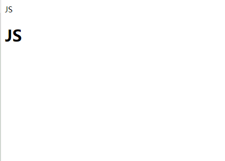
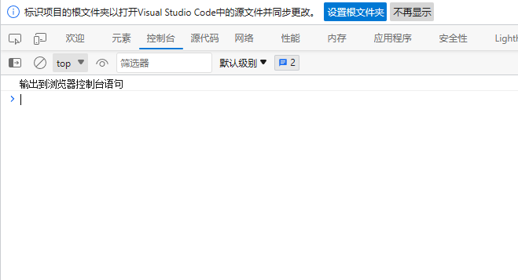
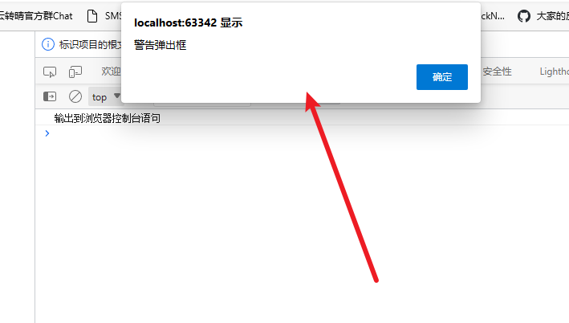
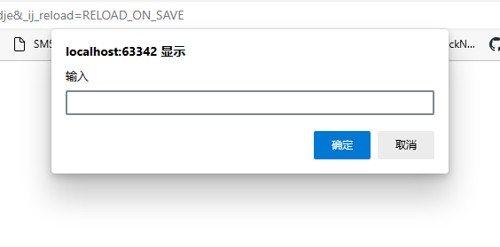

# 03-输入输出
 
## 输出到页面
```html
<!DOCTYPE html>
<html lang="zh-CN">
<head>
    <meta charset="UTF-8">
    <meta http-equiv="X-UA-Compatible" content="IE=edge">
    <meta name="viewport" content="width=device-width, initial-scale=1.0">
    <title>Day01</title>
</head>
<body>
<script >
    // 输出到 页面数据
    document.write("JS")
    document.write("<h1>JS</h1>")
</script>
</body>
</html>
```



## 输出到控制台
```html
<!DOCTYPE html>
<html lang="zh-CN">
<head>
    <meta charset="UTF-8">
    <meta http-equiv="X-UA-Compatible" content="IE=edge">
    <meta name="viewport" content="width=device-width, initial-scale=1.0">
    <title>Day01</title>
</head>
<body>
<script >
    // 输出到浏览器控制台语句
    console.log("输出到浏览器控制台语句")
</script>
</body>
</html>
```



## 警告弹窗
```html
<!DOCTYPE html>
<html lang="zh-CN">
<head>
    <meta charset="UTF-8">
    <meta http-equiv="X-UA-Compatible" content="IE=edge">
    <meta name="viewport" content="width=device-width, initial-scale=1.0">
    <title>Day01</title>
</head>
<body>
<script >
    //警告弹出框
    alert("警告弹出框")
</script>
</body>
</html>
```


## 输入弹窗
```html
<!DOCTYPE html>
<html lang="zh-CN">
<head>
    <meta charset="UTF-8">
    <meta http-equiv="X-UA-Compatible" content="IE=edge">
    <meta name="viewport" content="width=device-width, initial-scale=1.0">
    <title>Day01</title>
</head>
<body>
<script >
    // 输入
    prompt("输入")
</script>
</body>
</html>
```
