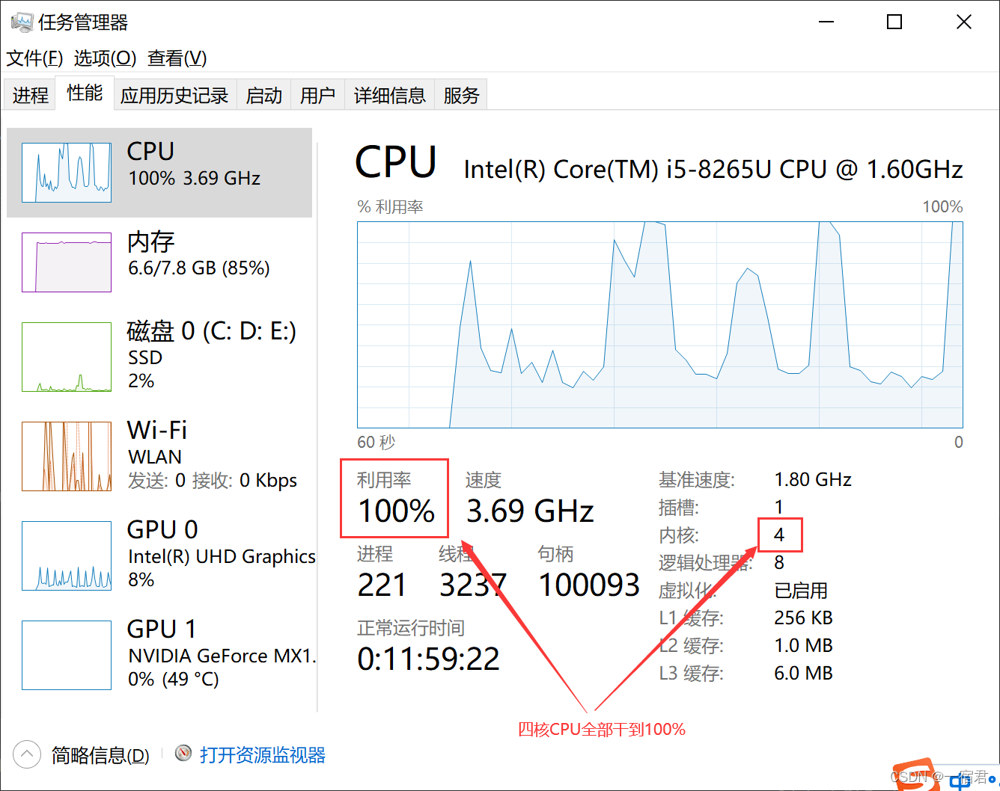

## Java8 新特性：

- Lambda 表达式、方法和构造器引用、Stream API、新时间与日期API、注解

**简介：** Java 8 (又称为 jdk 1.8) 是 Java 语言开发的一个主要版本。 Oracle 公司于 2014 年 3 月 18 日发布 Java 8 ，它支持函数式编程，新的 JavaScript 引擎，新的日期 API，新的Stream API 等等。
 - 本文转自 [一宿君的博客](https://developer.aliyun.com/article/837734?spm=a2c6h.12873639.article-detail.73.3c4f7ae0t7qMYy)

### 1、Java8新特性

 - Java 8 (又称为 jdk 1.8) 是 Java 语言开发的一个主要版本。 Oracle 公司于 2014 年 3 月 18 日发布 Java 8 ，它支持函数式编程，新的 JavaScript 引擎，新的日期 API，新的Stream API 等等。

#### 1.1、主要的新特性：

- Java8 新增了非常多的特性，最主要的有以下几个：

*   **Lambda 表达式** − Lambda 允许把函数作为一个方法的参数（函数作为参数传递到方法中）。
*   **方法引用** − 方法引用提供了非常有用的语法，可以直接引用已有Java类或对象（实例）的方法或构造器。与lambda联合使用，方法引用可以使语言的构造更紧凑简洁，减少冗余代码。
*   **默认方法** − 默认方法就是一个在接口里面有了一个实现的方法。
*   **新工具** − 新的编译工具，如：Nashorn引擎 jjs、 类依赖分析器jdeps。
*   **Stream API** −新添加的Stream API（java.util.stream） 把真正的函数式编程风格引入到Java中。
*   **Date Time API** − 加强对日期与时间的处理。
*   **Optional 类** − Optional 类已经成为 Java 8 类库的一部分，用来解决空指针异常。
*   **Nashorn, JavaScript 引擎** − Java 8提供了一个新的Nashorn javascript引擎，它允许我们在JVM上运行特定的javascript应用。

**将新特性 着重点简化一下：**

*   速度更快，改革hashmap及其相关数据结构（[HashMap的底层原理和线程安全的替代方案）](https://blog.csdn.net/qq_52596258/article/details/120471348?spm=1001.2014.3001.5501)（重要）
*   代码更少，增加了新的语法**Lambda**表达式（重要）
*   强大的**Stream API**（重要）
*   便于**并行**
*   最大化减少空指针异常 **Optional**（重要）

> 更多的新特性可以参阅官网：[What's New in JDK 8](http://www.oracle.com/technetwork/java/javase/8-whats-new-2157071.html)

#### 1.2、编程风格

Java 8 希望有自己的编程风格，并与 Java 7 区别开，以下实例展示了 Java 7 和 Java 8 的编程格式：  
  
**运行结果：**  
  
**我想从上述编码风格上一眼就可以看出，哪个更简洁更直观吧！**

### 2、Lambda 表达式


#### 2.1、Lambda 基础语法

基础语法入门推荐二哥的这篇：[Lambda 表达式入门。](https://blog.csdn.net/qing_gee/article/details/104231239?ops_request_misc=%257B%2522request%255Fid%2522%253A%2522163961955916780255252415%2522%252C%2522scm%2522%253A%252220140713.130102334.pc%255Fblog.%2522%257D&request_id=163961955916780255252415&biz_id=0&utm_medium=distribute.pc_search_result.none-task-blog-2~blog~first_rank_v2~rank_v29-1-104231239.pc_v2_rank_blog_default&utm_term=lambda&spm=1018.2226.3001.4450)

Java8中引入了一个新的操作符“`->`”，该操作符称为`箭头操作符`或者`Lambda操作符`，箭头操作符将Lambda表达式分成两部分：

*   左侧：**Lambda表达式的参数列表**
*   右侧：**Lambda表达式中所要执行的功能，即Lambda体**

**语法格式1：无参数，无返回值**

```
() -> System.out.println("Hello Lambda！");
```


**语法格式2：有一个参数，无返回值**

```
(x) -> System.out.println(x);

//若只有一个参数，小括号可以不写
x -> System.out.println(x)
```

  
**语法格式三：有两个及以上的参数，有返回值，并且Lambda体中有多条语句时，参数列表需必须带小括号，Lambda体必须带{}**  


**语法格式四：有两个及以上的参数，只需要返回值时，return和大括号都可以省略不写**

```
(x,y) -> Integer.compare(x,y);
```


**语法格式五：Lambda表达式的参数列表的数据类型可以省略不写，因为JVM编译器通过上下文推断出，数据类型，即类型推断**

```
        (Integer x,Integer y) -> Integer.compare(x,y);
        //可以省略不写：
        (x,y) -> Integer.compare(x,y);

        /**
         * 正常初始化赋值，可以上下文推断
         */
        String[] str = {"aaa","bbb","ccc"};

        /**
         * 赋值报错，无法根据上下文推断
         */
        String[] str2;
        str2 = {"aaa","bbb","ccc"};

        /**
         * new ArrayList<>()中的<>无需指定类型，上下文可以推断
         */
        List<String> stringList = new ArrayList<>();
        
        //定义一个方法，参数为Map集合    
        public void show(Map<String,Integer> map){}
        /**
         * 引用的时候new HashMap<>()中<>无需指定类型，根据上下文可以指定
         */
        show(new HashMap<>());
```

#### 2.2、Lambda 表达式需要“函数式接口”的支持

函数式接口：接口中只有一个抽象方法的接口，称为函数式接口。可以使用注解`@FunctionalInterface`修饰  
可以检查是否是函数式接口。

该注解的源码中，有一句英文描述：

```
Note that instances of functional interfaces can be created with lambda expressions,
method references, or constructor references.

//大致意思如下：
通过 @FunctionalInterface 标记的接口可以使用 Lambda 表达式创建实例。
```

细心的伙子应该发现了上述JDK默认内置的两个接口 `Comparator`、`Consumer`和`Runnable`，都是由注解`@FunctionalInterface`标注的，这就是标识这三个接口都是函数式接口。

```
@FunctionalInterface
public interface Comparator<T> {
    int compare(T o1,T o2);
}

@FunctionalInterface
public interface Consumer<T>{
    void accept(T t);
}    

@FunctionalInterface
public interface Runnable {
    public abstract void run();
}
```

当然我们自己也可以自定义函数式接口，只要由注解`@FunctionalInterface`标注了，就只能有一个抽象方法：

```
/**
 * 只能有一个抽象方法，有多个方法就会直接报错
 */
@FunctionalInterface
public interface People<T> {
    void chinese();

    //void american();
}
```

**具体怎么表现呢？**

原来我们创建一个线程并启动它是这样的：

```
new Thread(new Runnable() {
     @Override
     public void run() {
        System.out.println("一宿君！");
     }
}).start();
```

通过 Lambda 表达式只需要下面这样：

```
new Thread(() -> System.out.println("一宿君！")).start();
```

**效果一模模一样！比起匿名内部类，Lambda 表达式不仅易于理解，更大大简化了必须编写的代码数量。**

#### 2.3、Lambda 表达式的作用域范围

示例：

```
    @Test
    public void test5(){
        int limit = 10;
        Runnable r = () -> {
            //这一步会编译报错
            int limit = 5;
            for (int i = 0; i < limit; i++)
                System.out.println(i);
        };
    }
```

  
**上面这段代码在编译的时候会提示错误：变量 limit 已经定义过了。**  
  
**和匿名内部类一样，不要在 Lambda 表达式主体内对方法内的局部变量进行修改，否则编译也不会通过：`Lambda 表达式中使用的变量必须是 final 的`。**

这个问题发生的原因是因为 [Java 规范（§4.12.4）](http://docs.oracle.com/javase/specs/jls/se8/html/jls-4.html#jls-4.12.4)中是这样规定的：

```
Any local variable, formal parameter, or exception parameter used but not declared in a lambda
expression must either be declared final or be effectively final (§4.12.4),
or a compile-time error occurs where the use is attempted.


//大致的意思就是说，
Lambda 表达式中要用到的，但又未在 Lambda 表达式中声明的变量，
必须声明为 final 或者是 effectively final，否则就会出现编译错误。
```

**关于 `final` 和 `effectively final` 的区别：**

```
final int a;
a = 1; //初始化赋值不会报错
// a = 2;
// 由于 a 是 final 的，所以不能被重新赋值

int b;
b = 1;
// b 之后不再更改，b 就是 effectively final 常量

int c;
c = 1; // c 先被赋值为 1
c = 2; // 随后又被重新赋值为 2，此时c 就不是 effectively final
```

明白了 `final` 和 `effectively final` 的区别后，我们了解到，如果把变量 `limit` 定义为 `final`，那就无法在 Lambda 表达式中修改变量的值。那有什么好的解决办法呢？既能让编译器不发出警告，又能修改变量的值。

**有三个解决方案：**

*   1）把 limit 变量声明为 `static`。
*   2）把 limit 变量声明为 `AtomicInteger`。
*   3）使用`数组`。

**方案1：把 limit 变量声明为 `static`**

> 要想把 limit 变量声明为 static，无论是`静态方法`，还是`普通方法`，都必须将 `limit 变量放在方法外部`，完整的代码示例如下所示。

```
    static int limit = 10;

    @Test
    public void test6(){
        new Thread(() -> {
            limit = 5;
            for (int i = 0; i < limit; i++) {
                System.out.println(i);
            }
        }).start();
    }
//控制台
    0
    1
    2
    3
    4
```

**方案2：把 limit 变量声明为 `AtomicInteger`**

```
    /**
     * limit.set()：赋值
     * limit.get()：获取值
     */
    @Test
    public void test7(){
        final AtomicInteger limit = new AtomicInteger(10);
        new Thread(() -> {
            limit.set(5);
            for (int i = 0; i < limit.get(); i++) {
                System.out.println(i);
            }
        }).start();
    }
//控制台
    0
    1
    2
    3
    4
```

**方案3：使用`数组`**

> 使用数组的方式略带一些欺骗的性质，在声明数组的时候设置为 final，但更改时，只是修改了数组中的一个元素，并不是整个数组。

```
    /**
     * 使用数组
     */
    @Test
    public void test8(){
        final int [] limits = {10};
        new Thread(() -> {
            limits[0] = 5;
            for (int i = 0; i < limits[0]; i++) {
                System.out.println(i);
            }
        }).start();
    }
    
//控制台
    0
    1
    2
    3
    4
```

#### 2.4、Lambda 和 this 关键字

Lambda表达式并不会引入新的作用域，这一点和匿名内部类是不同的，也就是说，`Lambda表达式主体内使用的this关键字和其所在的类实例相同`。

看实例说话：

```
public class TestLambda2 {
    public static void main(String[] args) {
        new TestLambda2().lambda();
    }
    
    public void lambda(){
        System.out.printf("this = %s%n", this);

        new Thread(new Runnable() {
            @Override
            public void run() {
                System.out.printf("this = %s%n", this);
            }
        }).start();


        new Thread(() -> System.out.printf("this = %s%n", this)).start();
    }
}

```

**解释一下：**

*   `printf（参数以逗号隔开）`不是`println（参数拼接）`
*   `%s` 代表当前位置输出字符串（占位符）
*   `%n` 代表换行符，也可以使用 \\n 代替，但 %n 是跨平台的。

**上述案例包含三部分：**

*   **第一部分：单独的this关键字**
    
    ```
    //其中 this 为 main() 方法中通过 new 关键字创建的 TestLambda2 对象——new TestLambda2 ()。
    System.out.printf("this = %s%n", this);
    ```
    
*   **第二部分：匿名内部类中的 this 关键字**
    
    ```
    //其中 this 为 lambda() 方法中通过 new 关键字创建的 Runnable 对象——new Runnable(){...}。
    new Thread(new Runnable() {
        @Override
        public void run() {
           System.out.printf("this = %s%n", this);
        }
    }).start();
    ```
    
*   **第三部分：Lambda 表达式中的 this 关键字**
    
    ```
    //其中 this 关键字和 第一部分中的相同，都是指new TestLambda2()
    new Thread(() -> System.out.printf("this = %s%n", this)).start();
    ```
    

**看下最终的输出结果：**

```
this = cn.wbs.lambda.TestLambda2@448139f0
this = cn.wbs.lambda.TestLambda2$1@6690e42a
this = cn.wbs.lambda.TestLambda2@448139f0
```

**和预想的没毛病吧！**

#### 2.5、来几个小题练练手

> 1、调用Collections.sort()方法，通过定制排序比较两个Employee(先按年龄比，年龄相同按姓名比)，使用Lambda 作为参数传递。

```
@Data
@AllArgsConstructor
@NoArgsConstructor
public class Employee {
    private int id;
    private String name;
    private int age;
}


    /**
     * 1. 调用Collections.sort()方法，通过定制排序比较两个Employee(先按年龄比，年龄相同按姓名比)，使用Lambda 作为参数传递。
     */
    List<Employee> employees = Arrays.asList(
            new Employee(1,"张三",28),
            new Employee(2,"李四",8),
            new Employee(3,"王五",38),
            new Employee(4,"赵六",58),
            new Employee(5,"田七",38)
    );


    @Test
    public void test1(){
        System.out.println("排序之前：" + employees.toString());

        Collections.sort(employees,(e1,e2) ->{
            if(e1.getAge() == e2.getAge()){
                return e1.getName().compareTo(e2.getName());
            }else {
                return Integer.compare(e1.getAge(),e2.getAge());
            }
        });

        System.out.println("排序之后：" + employees.toString());

    }

//输出结果
排序之前：[Employee(id=1, name=张三, age=28), Employee(id=2, name=李四, age=8), Employee(id=3, name=王五, age=38), Employee(id=4, name=赵六, age=58), Employee(id=5, name=田七, age=38)]
排序之后：[Employee(id=2, name=李四, age=8), Employee(id=1, name=张三, age=28), Employee(id=3, name=王五, age=38), Employee(id=5, name=田七, age=38), Employee(id=4, name=赵六, age=58)]
```

> 2、①声明函数式接口，接口中声明抽象方法，public String getValue(String str);

```
 ②声明类TestLambda ，类中编写方法使用接口作为参数，将一个字符串转换成大写，并作为方法的返回值；
 ③再将一个字符串的第﹖个和第4个索引位置进行截取子串。
```
```
@FunctionalInterface
public interface MyLambdaFuntion {
    public String getValue(String str);
}

    /**
     * 2、①声明函数式接口，接口中声明抽象方法，public String getValue(String str);
     *      ②编写一个方法使用上述函数式接口作为参数，将一个字符串转换成大写，并作为方法的返回值；
     *      ③再将一个字符串的第﹖个和第4个索引位置进行截取子串。
     */
    public String opration(String str, MyLambdaFuntion mlf){
        return mlf.getValue(str);
    }

    @Test
    public void test2(){
        System.out.println(opration("abcdef", x -> x.toUpperCase()));
        System.out.println(opration("abcdef", x -> x.substring(2,5)));
    }

//输出结果：
ABCDEF
cde
```

> 3、①声明一个带两个泛型的函数式接口，泛型类型为<T,R> T为参数类型，R为返回值类型；

```
②接口中声明对应抽象方法；
③声明一个方法，使用上述函数式接口作为参数，计算两个 long 型参数的和；
④再计算两个 long 型参数的乘积。

```
```
@FunctionalInterface
public interface MyDoubleFuntion<T,R> {
    public R getValue(T t1,T t2);
}


    /**
     * 3、①声明一个带两个泛型的函数式接口，泛型类型为<T,R> T为参数类型，R为返回值类型；
     *     ②接口中声明对应抽象方法；
     *     ③声明一个方法，使用上述函数式接口作为参数，计算两个 long 型参数的和；
     *     ④再计算两个 long 型参数的乘积。
     */
    public Long calc(Long l1, Long l2, MyDoubleFuntion<Long,Long> mdf){
        return mdf.getValue(l1,l2);
    }

    @Test
    public void test3(){
        System.out.println("x + y = " + calc(100L, 200L, (x, y) -> x + y));
        System.out.println("x * y = " + calc(100L, 200L, (x, y) -> x * y));
    }


//输出结果
x + y = 300
x * y = 20000
```

### 3、内置函数式接口

#### 3.1、四大核心函数式接口


| 函数式接口 | 参数类型 | 返回类型 | 用途 |
| --- | --- | --- | --- |
| `Consumer<T>` 消费型接口 | T | void | 对类型为T的对象应用操作，包含方法：`void accept(T t)` |
| `Supplier<T>` 供给型接口 | 无 | T | 返回类型为T的对象，包含方法：`T get()` |
| `Function<T,R>` 函数型接口 | T | R | 对类型为T的对象应用操作，并返回类型为R的结果。包含方法：`R apply(T t)` |
| `Predicate<T>` 断定(言)型接口 | T | boolean | 确定类型为T的对象是否满足某约束，并返回boolean类型值。包含方法：`boolean test(T t)` |

#### 3.2、其他函数是接口


| 函数式接口 | 参数类型 | 返回类型 | 用途 |
| --- | --- | --- | --- |
| `BiFunction<T，U，R>` | T，U | R | 对类型为T，U参数应用操作,返回R类型的结果。包含方法为`R apply(T t, U u)` |
| `UnaryOperator<T>` (Function子接口) | T | T | 对类型为T的对象进行一元运算,并返回T类型的结果。包含方法为`T apply(T t)` |
| `BinaryOperator<T>` (BiFuntion子接口) | T，T | T | 对类型为T的对象进行二元运算,并返回T类型的结果。包含方法为`T apply(T t1,T t2)` |
| `BiConsumer<T，U>` | T，U | void | 对类型为T，U参数应用操作。包含方法为`void accept(T t, u u)` |
| `ToIntFunction<T>`、`ToLongFunction<T>` 、`ToDoubleFunction<T>` | T | int 、long、double | 分别计算 `int 、long、double`值的函数 |
| `IntFunction<R>`、`LongFunction<R>`、`DoubleFunction<R>` | int 、long、double | R | 参数分别为`int 、long、double`类型的函数 |

#### 3.3、实例操作演示


**1、`Consumer<T>` 消费型接口**

```
    /**
     * 自定义消费方法：花钱
     * @param money
     * @param consumer
     */
    public void happy(double money, Consumer<Double> consumer){
        consumer.accept(money);
    }
    @Test
    public void test1(){
        happy(10000,(m) -> System.out.println("一宿君花了：" + m + "元！"));
    }
    
    //输出结果
    一宿君花了：10000.0元！
```

  
**2、`Supplier<T>` 供给型接口**

```
    /**
     * 随机产生指定个数的整数,并放入集合中
     */
    public List<Integer> getNumList(Integer num, Supplier<Integer> supplier){
        List<Integer> numList = new ArrayList<>();
        for (int i = 0; i < num; i++) {
            numList.add(supplier.get());
        }
        return numList;
    }

    @Test
    public void test2(){
        /**
         * 随机产生1-100之间的随机整数，并添加至集合中
         */
        List<Integer> numList = getNumList(10, () -> (int) (Math.random() * 100 + 1));
        for (Integer num : numList) {
            System.out.println(num);
        }
    }
```

**3、`Function<T,R>` 函数型接口**

```
    /**
     * 对字符串进行处理，并返回
     */
    public String strHandler(String str, Function<String,String> fun){
        return fun.apply(str);
    }

    @Test
    public void test3(){
        System.out.println(strHandler("abcdef", (str) -> str.toUpperCase()));
        System.out.println(strHandler("abcdef", (str) -> str.substring(2,5)));
    }
    
    //输出结果
    ABCDEF
    cde
```

**4、`Predicate<T>` 断定(言)型接口**

```
     /**
     * 字符串长度大于3的添加至集合中
     */
    public List<String> getStrList(List<String> stringList, Predicate<String> predicate){
        List<String> stringList1 = new ArrayList<>();
        for (String s : stringList) {
            if(predicate.test(s)){
                stringList1.add(s);
            }
        }
        return stringList1;
    }

    @Test
    public void test4(){
        List<String> stringList = Arrays.asList("Hello","World","Lambda","String","一宿君","OK");
        List<String> strList = getStrList(stringList, (x) -> x.length() > 3);
        for (String s : strList) {
            System.out.println(s);
        }
    }
    
    //输出结果
    Hello
    World
    Lambda
    String
```

### 4、方法引用与构造器引用

#### 4.1、方法引用


**方法引用：**

*   若Lambda体中的内容有方法已经实现了，我们可以使用“方法引用”
*   可以理解为方法引用是Lambda表达式另外一种表现形式
*   `注意：要引用的方法和函数式接口中调用的方法，返回值和参数类型个数必须要一致！！！`

**方法引用有三种语法格式：**

*   对象::实例方法名
    
    ```
    Object::method
    ```
    
*   类::静态方法名
    
    ```
    ClassName::static method
    ```
    
*   类::实例方法名
    
    ```
    ClassName::method
    ```
    

第一种：**`对象::实例方法名`**

```
    /**
     * 对象::实例方法名
     */
    @Test
    public void test1(){
        PrintStream ps1 = System.out;

        Consumer<String> consumer1 = (x) -> System.out.println(x);
        Consumer<String> consumer2 = (x) -> ps1.println(x);
        /**
         * println()方法和Consummer函数式接口中accept()方法，返回值和参数个数一致，才可使用方法引用形式
         */
        Consumer<String> consumer3 = ps1::println;
        consumer1.accept("一宿君");
        consumer2.accept("一宿君");
        consumer3.accept("一宿君");
    }
    //输出结果
    一宿君
    一宿君
    一宿君
    
    @Test
    public void test2(){
        Employee emp = new Employee(1,"张三",21);

        Supplier<String> sup1 = () -> emp.getName();
        Supplier<String> sup11 = emp::getName;
        Supplier<Integer> sup2 = () -> emp.getAge();
        Supplier<Integer> sup22 = emp::getAge;
        System.out.println(sup1.get());
        System.out.println(sup11.get());
        System.out.println(sup2.get());
        System.out.println(sup22.get());
    }
    //输出结果
    张三
    张三
    21
    21
```

第二种：**`类::静态方法名`**

> **特别注意：**  
> 要调用的静态方法和函数式接口中要引用的方法参数列表和返回值类型，必须保持一直，才可以使用 **`类::静态方法名`** 的形式。
> 
> 如下示例中，就是`Integer.compare(x,y)`和`Comparator接口中的compare(x,y)`参数列表和返回值类型要保持一致！

```
    /**
     * 类::静态方法名
     */
    @Test
    public void test3(){
        Comparator<Integer> comparator1 = (x,y) -> Integer.compare(x,y);
        Comparator<Integer> comparator2 = Integer::compare;
        System.out.println(comparator1.compare(2, 3));
        System.out.println(comparator2.compare(2, 3));
    }
    
    //输出结果
    -1
    -1
```

第三种：**`类::实例方法名`**

> **特别注意：**  
> 当`第一个参数x`是实例方法的调用者，`第二个参数y`是实例方法的参数时，才可以使用 **`类::实例方法名`** 的形式！
> 
> 如下示例中，x是equals方法的调用者，y是equals方法的参数，所以可以使用！  
> 此种情况下，`equals`和`test`两个方法参数列表可以不同，但是参数类型和方法返回值类型必须保持一致！

```
    /**
     * 类::实例方法名
     */
    @Test
    public void test4(){
        BiPredicate<String,String> biPredicate1 = (x, y) -> x.equals(y);
        BiPredicate<String,String> biPredicate2 = String::equals;
        System.out.println(biPredicate1.test("abc", "abc"));
        System.out.println(biPredicate2.test("abc", "abc"));
    }
    
    //输出结果
    true
    true
```

**方法引用注意事项：**

*   `Object::method` 的形式，Lambda 体中调用方法的参数列表与返回值类型，要与函数式接口中的抽象方法参数列表与返回值类型保持一致！
*   `ClassName::static method` 的形式，Lambda 体中调用方法的参数列表与返回值类型，要与函数式接口中的抽象方法参数列表与返回值类型保持一致！
*   `ClassName::method` 的形式，Lambda 体中调用方法和函数式接口中的抽象方法`参数列表个数可以不同`，但是`参数类型和方法返回值类型必须相同`，并且第一个参数是实例方法的调用者，第二个参数是实例方法的参数时，才可以使用此中形式！

#### 4.2、构造器引用


语法格式：

```
ClassName::new
```

实例演示：

```
    /**
     * 构造器引用 ClassName::new
     */
    @Test
    public void test5(){
        Function<Integer,Employee> emp1 = (x) -> new Employee(x);
        Function<Integer,Employee> emp2 = Employee::new;
        System.out.println(emp1.apply(1));
        System.out.println(emp2.apply(2));
        
        //输出结果
        //Employee(id=1, name=null, age=0)
        //Employee(id=2, name=null, age=0)


        BiFunction<Integer,String,Employee> emp3 = (x,y) -> new Employee(x,y);
        BiFunction<Integer,String,Employee> emp4 = Employee::new;
        System.out.println(emp3.apply(3, "张三"));
        System.out.println(emp3.apply(4, "李四"));
        
        //输出结果
        //Employee(id=3, name=张三, age=0)
        //Employee(id=4, name=李四, age=0)
    }
```


**构造器引用注意事项：**

*   你传入几个参数，返回值类型中就要对应 `相应参数个数` 的`构造函数`。

#### 4.3、数组引用


语法格式：

```
Type[]::new
```

实例演示：

```
    /**
     * 数组引用 Type[]::new
     */
    @Test
    public void test6(){
        //传入参数为初始化数组长度
        Function<Integer,String[]> fun1 = (x) -> new String[x];
        Function<Integer,String[]> fun2 = String[]::new;
        System.out.println(fun1.apply(5).length);
        System.out.println(fun2.apply(10).length);
    }
    //输出结果
    5
    10
```

**数组引用注意事项：**

*   和构造器引用类型相似！

### 5、强大的Stream API


Java8中有两大最为重要的改变。

*   **第一个是 Lambda表达式**
*   **另外一个则是 Stream API（java.util.stream.\*）**

#### 5.1、什么是Stream流？


Stream 是 Java8中处理集合的关键抽象概念，它可以指定你希望对集合进行的操作，可以执行非常复杂的查找、过滤和映射数据等操作使用Stream API对集合数据进行操作，就类似于使用SQL执行的数据库查询。也可以使用Stream API来并行执行操作。简而言之，Stream API提供了一种高效且易于使用的处理数据的方式。

*   `是数据渠道，用于操作数据源（集合、数组等）所生成的元素序列。`
*   `“集合讲的是数据，流讲的是计算!”`

**注意：**

*   Stream自己不会存储元素。
*   Stream不会改变源对象。相反，他们会返回一个持有结果的新Stream。
*   Stream操作是延迟执行的。这意味着他们会等到需要结果的时候才执行。

**Stream的操作三个步骤：**

*   创建 Stream
    
    > 一个数据源（集合、数组等），获取一个流，也就是将数据源转换成流。
    
*   中间操作
    
    > 一个中间操作链，对数据源转换成的流数据进行处理。
    
*   终止操作（终端操作）
    
    > 一个终止操作，执行中间操作链，并产生结果。
    


#### 5.2、创建 Stream流


**1、可以通过Collection系列集合提供的两个方法获取流**

```
        /**
         * 1、可以通过Collection系列集合提供的两个方法获取流
         *   - stream() ：返回一个串行流（也叫做顺序流） ->常用
         *   - parallelStream()：返回一个并行流
         */
        List<String> list = new ArrayList<>();
        list.add("aaa");
        list.add("bbb");
        list.add("ccc");
        Stream<String> stream1 = list.stream();
        Stream<String> stream2 = list.parallelStream();
        //遍历输出
        stream1.forEach(System.out::println);
        stream2.forEach(System.out::println);
```

**2、通过Arrays 中的静态方法stream()获取流**

```
        /**
         * 2、通过Arrays 中的静态方法stream()获取流
         */
        Employee[] emp = new Employee[3];
        emp[0] = new Employee(1,"张三",21);
        emp[1] = new Employee(2,"李四",22);
        emp[2] = new Employee(3,"王五",23);
        Stream<Employee> stream3 = Arrays.stream(emp);
        stream3.forEach(System.out::println);

```

**3、通过Stream 类中的of()方法获取流**

```
        /**
         * 3、通过Stream 类中的of()方法获取流
         * - of(T... values) 可以传入多个参数，支持泛型
         */
        Stream<String> stream4 = Stream.of("AAA", "BBB", "CCC");
        stream4.forEach(System.out::println);
```

**4、通过Stream 类中的iterate()方法创建无限流**

```
        /**
         * 4、通过Stream 类中的iterate()方法创建无限流
         * - 迭代
         * - iterate(final T seed, final UnaryOperator<T> f)
         * - seed 种子的意思，也就是穿件的流数据从此处开始
         * - UnaryOperator<T> 对seed参数进行一元运算
         * - limit(5) 意思是只取前5个数据
         */
        Stream<Integer> stream5 = Stream.iterate(0, (x) -> x + 2);
        stream5.limit(5).forEach(System.out::println);
```

**5、通过Stream 类中的generate()方法生成无限流**

```
        /**
         * 5、通过Stream 类中的generate()方法生成无限流
         * - generate(Supplier<T> s) 供给型接口参数
         * - 就需要对该接口进行无限产生数据
         * - limit(10) 意思是只取前十个数据
         */
        Stream<Double> stream6 = Stream.generate(() -> Math.random());
        stream6.limit(10).forEach(System.out::println);
```

#### 5.3、Stream 筛选与切片


*   **筛选与切片**
    
    *   `filter()`：接收Lambda ,从流中排除某些元亲-limit——戴断流,使其元素不超过给定数罩。
    *   `limit()`：截断元素，返回一个包含前nge元素的流。若流中元素不足n个，则有多少返回多少。
    *   `skip(n)`：跳过元素，返回一个扔掉了前n个元素的流。若流中元素不足n个，则返回一个空液。与limit(n)互补
    *   `distinct()`：筛选，通过流所生成元素的`hashCode()` 和`equals()`去除重复元素

**实例演示：**

```
//数据源
List<Employee> employees = Arrays.asList(
            new Employee(1,"张三",28),
            new Employee(2,"李四",8),
            new Employee(3,"王五",38),
            new Employee(4,"赵六",58),
            new Employee(5,"田七",38)
    );
```

**1、过滤出年龄大于28的**

```
    /**
     * 过滤出年龄大于28的
     */
    @Test
    public void test1(){
        employees.stream()
                 .filter((e) -> e.getAge() > 28)
                 .forEach(System.out::println);
    }

    //输出结果
    Employee(id=3, name=王五, age=38)
    Employee(id=4, name=赵六, age=58)
    Employee(id=5, name=田七, age=38)
```

**2、Stream 流中间操作，不会产生任何结果，也不会执行任何操作，只有执行终止操作，才会产生相应过滤结果**

```
    /**
     * 使其能在Lambda体中改变值
     */
    static int i = 1;

    @Test
    public void test2(){
        //此时是获取到流执行中间操作，并未终止
        Stream<Employee> stream1 = employees.stream()
                                            .filter((e) -> {
                                                System.out.println("Stream API 中间" + i++ + "次操作！");
                                                return e.getAge() > 28;
                                            });
    }
```

  
  
**3、limit（n）截取元素**  
  
**4、distinct（）去重**  
  
  
有一个前提，实体类中必须要对hashCode()和equals()方法进行重写，才能实现去重：

```
@Data
@AllArgsConstructor
@NoArgsConstructor
public class Employee {
    private int id;
    private String name;
    private int age;
    
    @Override
    public boolean equals(Object o) {
        if (this == o) return true;
        if (o == null || getClass() != o.getClass()) return false;
        Employee employee = (Employee) o;
        return id == employee.id &&
                age == employee.age &&
                Objects.equals(name, employee.name);
    }

    @Override
    public int hashCode() {
        return Objects.hash(id, name, age);
    }
}

```
**5、按对象属性去重** 
```java
package com.niwodai.devops;

import lombok.AllArgsConstructor;
import lombok.Builder;
import lombok.Data;
import lombok.NoArgsConstructor;

import java.util.ArrayList;
import java.util.Comparator;
import java.util.List;
import java.util.Map;
import java.util.TreeSet;
import java.util.concurrent.ConcurrentHashMap;
import java.util.function.Function;
import java.util.function.Predicate;
import java.util.stream.Collectors;

public class ListStreamDistinct {
    public static void main(String[] args) {
        // 一个集合中放入4个学生对象
        List<Student> list = new ArrayList<>();
        list.add(new Student(10002L, "ZhangSan", 18, 175.2));
        list.add(new Student(10001L, "LiSi", 19, 175.2));
        list.add(new Student(10004L, "Peter", 19, 170.8));
        list.add(new Student(10004L, "Peter", 19, 170.8));

        // 按整个个对象去重
        System.out.println("整个对象去重：");
        list.stream().distinct().forEach(System.out::println);

        // 方法一：指定某个字段去重
        System.out.println("指定age属性去重（方法一）：");
        list.stream().filter(distinctByKey(Student::getId)).forEach(System.out::println);

        // 方法二：（用循环)
        System.out.println("指定age属性去重（方法二）：");
        TreeSet<Student> students = new TreeSet<>(Comparator.comparing(Student::getId));
        students.addAll(list);
        new ArrayList<>(students).forEach(System.out::println);

        // 方法三：（是方法二的变形），此方法来源于：https://blog.csdn.net/qq_28988969/article/details/81119587
        System.out.println("指定age属性去重（方法三）：");
        list.stream().collect(Collectors.collectingAndThen(Collectors.toCollection(() -> new TreeSet<>(Comparator.comparing(Student::getAge))), ArrayList::new)).forEach(System.out::println);

    }

    // 次方法来源于：https://blog.csdn.net/haiyoung/article/details/80934467
    static <T> Predicate<T> distinctByKey(Function<? super T, ?> keyExtractor) {
        Map<Object, Boolean> seen = new ConcurrentHashMap<>();
        return t -> seen.putIfAbsent(keyExtractor.apply(t), Boolean.TRUE) == null;
    }

    @Data
    @Builder
    @AllArgsConstructor
    @NoArgsConstructor
    public static class Student {
        private Long id;
        private String name;
        private Integer age;
        private double height;
    }

}

```

#### 5.4、Stream 映射


有两种映射方式：

*   `map`：接收Lambda ，将元素转换成其他形式或提取信息。接收一个函数作为参数，该函数会被应用到每个元素上，并将其映射成一个新的元素。
*   `flatMap`：接收―个函数作为参数，将流中的每个值都换成另一个流，然后把所有流连接成一个流。

其实这两个方法和集合中的两个方法类似！

*   `add（Object o）`：将参数集合看作一个对象，添加到集合中。
*   `addAll（Collection c）`：将参数集合中的元素，逐个添加到集合中，这样就达到了一种`平铺`的效果。

**1、将map函数应用到每一个元素上**

```
    @Test
    public void test1(){
        List<String> stringList = Arrays.asList("aaa","bbb","ccc","ddd","eee");
        stringList.stream()
                  .map((str) -> str.toUpperCase())
                  .forEach(System.out::println);

        //输出结果
        AAA
        BBB
        CCC
        DDD
        EEE
    }


    List<Employee> employees = Arrays.asList(
            new Employee(1,"张三",28),
            new Employee(2,"李四",8),
            new Employee(3,"王五",38),
            new Employee(4,"赵六",58),
            new Employee(5,"田七",38)
    );

    @Test
    public void test2(){
        employees.stream()
                 .map((emp) -> emp.getName())
                 .forEach(System.out::println);

        System.out.println("-----------------------------");

        /**
         * 此处虽然getName实例方法和Function接口的apply方法参数列表不同，
         * 但是返回值类型相同，并且employees集合中每一个元素又是getName的调用者，
         * 所以可以使用ClassName::method的形式
         */
        employees.stream()
                 .map(Employee::getName)
                 .forEach(System.out::println);
    }
    //输出结果
    张三
    李四
    王五
    赵六
    田七
    -----------------------------
    张三
    李四
    王五
    赵六
    田七
```

**2、map映射，将每个流添加到一个流中**

```
@Test
    public void test3(){
        List<String> stringList = Arrays.asList("aaa","bbb","ccc","ddd","eee");
        /**
         * stringList集合中的每一个元素经过filterCharacter()处理之后，都会返回成一个Stream流，
         * 然后通过map映射，放入到一个Stream大流中
         * 俗称：流中流
         */
        Stream<Stream<Character>> streamStream = stringList.stream()
                                                           .map(TestMapping::filterCharacter);

        //单层遍历
        streamStream.forEach(System.out::println);
        //输出结果,每一个都是一个流对象
        //java.util.stream.ReferencePipeline$Head@1c53fd30
        //java.util.stream.ReferencePipeline$Head@50cbc42f
        //java.util.stream.ReferencePipeline$Head@75412c2f
        //java.util.stream.ReferencePipeline$Head@282ba1e
        //java.util.stream.ReferencePipeline$Head@13b6d03
        
        //双层遍历
        streamStream.forEach((ss) -> ss.forEach(System.out::println));
        
        //输出结果
        //a
        //a
        //a
        //b
        //b
        //b
        //c
        //c
        //c
        //d
        //d
        //d
        //e
        //e
        //e
    }
```

**3、flatMap映射，直接将每个流中的元素都平铺到最外层的流中**

```
    @Test
    public void test4(){
        List<String> stringList = Arrays.asList("aaa","bbb","ccc","ddd","eee");
        /**
         * stringList集合中的每一个元素经过filterCharacter()处理之后，都会返回成一个Stream流，
         * 然后通过flatMap映射，将流中元素都放入到一个Stream大流中
         * 俗称：平铺流
         */
        Stream<Character> streamStream = stringList.stream()
                                                   .flatMap(TestMapping::filterCharacter);

        //单层遍历
        streamStream.forEach(System.out::println);

        //输出结果
        //a
        //a
        //a
        //b
        //b
        //b
        //c
        //c
        //c
        //d
        //d
        //d
        //e
        //e
        //e
    }
```

**再回头看下上述两个类似的方法，是不是就懂了！**

*   `add（Object o）`：将参数集合看作一个对象，添加到集合中。
*   `addAll（Collection c）`：将参数集合中的元素，逐个添加到集合中，这样就达到了一种`平铺`的效果。

#### 5.5、Stream 排序


**排序：**

*   `sorted()`：自然排序(Comparable)
*   `sorted(Comparator com)`：定制排序(Comparator)，根据自定义的方式去排序

**1、自然排序（内置定义好的）**

```
    /**
     * sorted()：自然排序(Comparable)
     * 内置好的排序方式
     */
    @Test
    public void test1(){
        List<String> stringList = Arrays.asList("bbb","aaa","ddd","ccc","eee");
        stringList.stream()
                .sorted()
                .forEach(System.out::println);
    }
    
    //输出结果
    aaa
    bbb
    ccc
    ddd
    eee
```

**2、定制排序**

```
    List<Employee> employees = Arrays.asList(
            new Employee(1,"张三",28),
            new Employee(2,"李四",8),
            new Employee(3,"王五",38),
            new Employee(4,"赵六",58),
            new Employee(5,"田七",38)
    );

    /**
     * sorted(Comparator com)：定制排序(Comparator)
     * 自定义排序方式：如果年龄相同，按照名字排序，否则按照年龄排序
     */
    @Test
    public void test2(){
        employees.stream()
                 .sorted((e1,e2) -> {
                     if(e1.getAge() == e2.getAge()){
                         return e1.getName().compareTo(e2.getName());
                     }else {
                         return Integer.compare(e1.getAge(),e2.getAge());
                     }
                 })
                 .forEach(System.out::println);
    }

   //输出结果
    Employee(id=2, name=李四, age=8)
    Employee(id=1, name=张三, age=28)
    Employee(id=3, name=王五, age=38)
    Employee(id=5, name=田七, age=38)
    Employee(id=4, name=赵六, age=58)
```

5.6、Stream 查找与匹配（终止操作）


| 方法 | 描述 |
| --- | --- |
| `allMatch(Predicate p)` | 检查是否匹配所有元素 |
| `anyMatch (Predicate p)` | 检查是否至少匹配一个元素 |
| `noneMatch(Predicate p)` | 检查是否没有匹配所有元素 |
| `findFirst()` | 返回第一个元素 |
| `findAny()` | 返回当前流中的任意元素 |
| `count()` | 返回流中元素总数 |
| `max (Comparator c)` | 返回流中最大值 |
| `min(Comparator c)` | 返回流中最小值 |
| `forEach(Consumer c)` | `内部迭代`(使用 Collection接口需要用户去做迭代，称为`外部迭代`。相反，Stream API使用内部迭代——它帮你把迭代做了) |

**数据源：**

```
@Data
@AllArgsConstructor
@NoArgsConstructor
public class Employee {
    private int id;
    private String name;
    private int age;
    private Double salary;
    private Status status;

    public enum Status{
        FREE,
        BUSY,
        HAPPY,
        VOCATION
    }
}

```
```
    List<Employee> employees = Arrays.asList(
            new Employee(1,"张三",28,8888.88, Status.BUSY),
            new Employee(2,"李四",8,6666.66,Status.FREE),
            new Employee(3,"王五",38,3333.33,Status.VOCATION),
            new Employee(4,"赵六",58,7777.77,Status.HAPPY),
            new Employee(5,"田七",38,9999.99,Status.BUSY)
    );
```

**实例测试：**

```
    /**
     * allMatch—检查是否匹配所有元素，只要有一个不匹配条件返回false，否则true
     */
    @Test
    public void test1(){
        boolean b1 = employees.stream()
                .allMatch((e) -> e.getStatus().equals(Status.FREE));
        System.out.println(b1);//false
    }

    /**
     * anyMatch——检查是否至少匹配一个元素,有一个匹配条件则返回true，否则false
     */
    @Test
    public void test2(){
        boolean b2 = employees.stream()
                .anyMatch((e) -> e.getStatus().equals(Status.FREE));
        System.out.println(b2);//true
    }


    /**
     * noneMatch——检查是否没有匹配所有元素,只要有一个匹配条件返回false，否则true
     */
    @Test
    public void test3(){
        boolean b3 = employees.stream()
                .noneMatch((e) -> e.getStatus().equals(Status.FREE));
        System.out.println(b3);//false
    }


    /**
     * findFirst——返回第一个元素
     */
    @Test
    public void test4(){
        Optional<Employee> op = employees.stream()
                .sorted((e1, e2) -> Double.compare(e1.getSalary(), e2.getSalary()))
                .findFirst();

        //如果返回这个对象为空，则可以替换为其他不为空的对象（自定义）,就是为了最大化避免空指针
        op.orElse(new Employee(1111,"二狗子",21,9999.999,Status.BUSY));

        //上述为升序排序，返回是薪资最低的
        System.out.println(op.get());//Employee(id=3, name=王五, age=38, salary=3333.33, status=VOCATION)
    }


    /**
     * findAny—返回当前流中的任意一个元素
     */
    @Test
    public void test5(){
        /*Optional<Employee> op = employees.Stream()
                .filter((e) -> e.getStatus().equals(Status.BUSY))
                .findAny();*/

        Optional<Employee> op = employees.parallelStream()
                .filter((e) -> e.getStatus().equals(Status.BUSY))
                .findAny();

        /**
         * 查找到状态为BUSY的数据（数据中有两个符合状态为BUSY的数据）
         * - 如果是Stream流按顺序直接返回到第一个符合条件的数据
         * - 如果是parallelStream，会多线程并行去查找匹配数据，先找到谁就先返回谁
         */
        System.out.println(op.get());
        //使用并行流的话,两个数据随机输出
        //Employee(id=1, name=张三, age=28, salary=8888.88, status=BUSY)
        //Employee(id=5, name=田七, age=38, salary=9999.99, status=BUSY)
    }


    /**
     * count——返回流中元素的总个数
     */
    @Test
    public void test6(){
        long count = employees.stream()
                .count();

        System.out.println(count);//就是employees.size = 5
    }


    /**
     * min——返回流中最小值
     * 找出工资最低的货
     */
    @Test
    public void test7(){
        Optional<Employee> min = employees.stream()
                                          .min((e1,e2) -> Double.compare(e1.getSalary(),e2.getSalary()));

        System.out.println(min.get());//Employee(id=3, name=王五, age=38, salary=3333.33, status=VOCATION)
    }


    /**
     * max——返回流中最大值
     * 找出工资最高的货
     */
    @Test
    public void test8(){
        Optional<Employee> max1 = employees.stream()
                .max((e1, e2) -> Double.compare(e1.getSalary(), e2.getSalary()));

        System.out.println(max1);//Optional[Employee(id=5, name=田七, age=38, salary=9999.99, status=BUSY)]


        //也可以将每个人的工资单独映射出来
        Optional<Double> max2 = employees.stream()
                .map(Employee::getSalary)
                .max(Double::compare);

        System.out.println(max2.get());//9999.99
    }
```

#### 5.6、Stream 归约与收集


**1、归约**

| 方法 | 描述 |
| --- | --- |
| `reduce(T iden,BinaryOperator b)` | 可以将流中元素反复结合起来，得到一个值。返回T |
| `reduce(BinaryOperator b)` | 可以将流中元素反复结合起来，得到一个值。返回Optional |

> 备注: map和reduce的连接通常称为map-reduce模式，因Google用它来进行网络搜索而出名。

```
    @Test
    public void test1(){
        List<Integer> list = Arrays.asList(1,2,3,4,5,6,7,8,9,10);

        /**
         * T reduce(T identity, BinaryOperator<T> accumulator);
         * identity可以看作是初始开始值，对集合中的元素进行一元运算
         * 此处不会为空，所以直接返回最终值
         */
        Integer reduceNum = list.stream()
                .reduce(0, (x, y) -> x + y);

        System.out.println("总和：" + reduceNum);

        System.out.println("---------------------------------");

        List<Employee> employees = Arrays.asList(
                new Employee(1,"张三",28,8888.88, Status.BUSY),
                new Employee(2,"李四",8,6666.66,Status.FREE),
                new Employee(3,"王五",38,3333.33,Status.VOCATION),
                new Employee(4,"赵六",58,7777.77,Status.HAPPY),
                new Employee(5,"田七",38,9999.99,Status.BUSY)
        );

        /**
         * 此处返回值为Optional<Double>，是因为每个工资可能为空，所以是为了避免空指针
         */
        Optional<Double> op = employees.stream()
                .map(Employee::getSalary)
                .reduce(Double::sum);

        System.out.println("总工资：" + op.get());
    }


    //输出结果
    总和：55
    ---------------------------
    总工资：36666.63
```

**2、收集**

| 方法 | 描述 |
| --- | --- |
| `collect (Collector c)` | 将流转换为其他形式。接收一个Collector接口的实现，用于给Stream中元素做汇总的方法 |

Collector接口中方法的实现决定了如何对流数据执行收集操作(如：将流数据收集到List、Set、Map等集合中)。但是Collectors实用类提供了很多静态方法，可以方便地创建常见收集器实例，具体实现如下:

**1、将流数据收集到常见的集合中**

```
    /**
     * 收集collect
     */
    @Test
    public void test2(){
        List<Employee> employees = Arrays.asList(
                new Employee(1,"张三",28,8888.88, Status.BUSY),
                new Employee(2,"李四",8,6666.66,Status.FREE),
                new Employee(3,"王五",38,3333.33,Status.VOCATION),
                new Employee(4,"赵六",58,7777.77,Status.HAPPY),
                new Employee(5,"田七",38,9999.99,Status.BUSY)
        );

        /**
         * 将名字收集到list集合中
         */
        List<String> list = employees.stream()
                .map(Employee::getName)
                .collect(Collectors.toList());
        list.forEach(System.out::println);

        System.out.println("-----------------------------");

        /**
         * 将年龄收集到set集合中
         */
        Set<Integer> set = employees.stream()
                .map(Employee::getAge)
                .collect(Collectors.toSet());
        set.forEach(System.out::println);

        System.out.println("-----------------------------");

        /**
         * 将名字收集到HashSet中（数据不会重复）
         */
        HashSet<String> hashset = employees.stream()
                .map(Employee::getName)
                .collect(Collectors.toCollection(HashSet::new));
        hashset.forEach(System.out::println);

        System.out.println("-----------------------------");

        /**
         * 将名字收集到LinkedHashSet中（数据不会重复）
         */
        LinkedHashSet<String> linkedHashSet = employees.stream()
                .map(Employee::getName)
                .collect(Collectors.toCollection(LinkedHashSet::new));
        linkedHashSet.forEach(System.out::println);
    }
```

**2、计算流中数据总数、平均值、总和、最大值、最小值**

```
    /**
     * 将流数据收集到常见的集合中list、set、hashset、linkedhashset
     */
    @Test
    public void test2(){

        /**
         * 将名字收集到list集合中
         */
        List<String> list = employees.stream()
                .map(Employee::getName)
                .collect(Collectors.toList());
        list.forEach(System.out::println);

        System.out.println("-----------------------------");

        /**
         * 将年龄收集到set集合中
         */
        Set<Integer> set = employees.stream()
                .map(Employee::getAge)
                .collect(Collectors.toSet());
        set.forEach(System.out::println);

        System.out.println("-----------------------------");

        /**
         * 将名字收集到HashSet中（数据不会重复）
         */
        HashSet<String> hashset = employees.stream()
                .map(Employee::getName)
                .collect(Collectors.toCollection(HashSet::new));
        hashset.forEach(System.out::println);

        System.out.println("-----------------------------");

        /**
         * 将名字收集到LinkedHashSet中（数据不会重复）
         */
        LinkedHashSet<String> linkedHashSet = employees.stream()
                .map(Employee::getName)
                .collect(Collectors.toCollection(LinkedHashSet::new));
        linkedHashSet.forEach(System.out::println);
    }

    /**
     * 计算流中数据总数、平均值、总和、最大值、最小值
     */
    @Test
    public void test3(){
        //总数
        Long empSum = employees.stream()
                .collect(Collectors.counting());
        System.out.println(empSum);//5

        System.out.println("-------------------------");

        //工资平均值
        Double avgSal = employees.stream()
                .collect(Collectors.averagingDouble(Employee::getSalary));
        System.out.println(avgSal);//7333.325999999999

        //薪资总和
        Double salSum = employees.stream()
                .collect(Collectors.summingDouble(Employee::getSalary));
        System.out.println(salSum);//36666.63

        //薪资最多的货
        Optional<Employee> maxSalEmp = employees.stream()
                .collect(Collectors.maxBy((e1, e2) -> Double.compare(e1.getSalary(), e2.getSalary())));
        System.out.println(maxSalEmp.get());//Employee(id=5, name=田七, age=38, salary=9999.99, status=BUSY)

        //最大薪资
        Optional<Double> maxSal = employees.stream()
                .map(Employee::getSalary)
                .collect(Collectors.maxBy(Double::compare));
        System.out.println(maxSal.get());//9999.99

        //薪资最少的货
        Optional<Employee> minSalEmp = employees.stream()
                .collect(Collectors.minBy((e1, e2) -> Double.compare(e1.getSalary(), e2.getSalary())));
        System.out.println(minSalEmp.get());//Employee(id=3, name=王五, age=38, salary=3333.33, status=VOCATION)


        //最少薪资
        Optional<Double> minSal = employees.stream()
                .map(Employee::getSalary)
                .collect(Collectors.minBy(Double::compare));
        System.out.println(minSal.get());//3333.33
    }
```

**3、分组收集**

```
    /**
     * 分组收集数据
     */
    @Test
    public void test4(){
        /**
         * 按照状态分组
         * - key：status
         * - value：List<Employee>
         */
        Map<Status, List<Employee>> empByStatus = employees.stream()
                .collect(Collectors.groupingBy(Employee::getStatus));

        for (Status status : empByStatus.keySet()) {
            System.out.println(status + "组:" + empByStatus.get(status));
        }
        //HAPPY组:[Employee(id=4, name=赵六, age=58, salary=7777.77, status=HAPPY)]
        //FREE组:[Employee(id=2, name=李四, age=8, salary=6666.66, status=FREE)]
        //VOCATION组:[Employee(id=3, name=王五, age=38, salary=3333.33, status=VOCATION)]
        //BUSY组:[Employee(id=1, name=张三, age=28, salary=8888.88, status=BUSY), Employee(id=5, name=田七, age=38, salary=9999.99, status=BUSY)]

        /**
         * 多级分组
         * - 先按Status分组
         * - 再按age段分组 青年、中年、老年
         */
        Map<Status, Map<String, List<Employee>>> map = employees.stream()
                .collect(Collectors.groupingBy(Employee::getStatus, Collectors.groupingBy((Employee e) -> {
                    if (e.getAge() < 30) {
                        return "青年";
                    } else if (e.getAge() < 40) {
                        return "中年";
                    } else {
                        return "老年";
                    }
                })));

        //现获取到状态键集合,然后遍历每个状态组中的年龄段人
        for (Status status : map.keySet()) {
            System.out.println(status + "组：" + map.get(status));
        }
        
        //HAPPY组：{老年=[Employee(id=4, name=赵六, age=58, salary=7777.77, status=HAPPY)]}
        //FREE组：{青年=[Employee(id=2, name=李四, age=8, salary=6666.66, status=FREE)]}
        //VOCATION组：{中年=[Employee(id=3, name=王五, age=38, salary=3333.33, status=VOCATION)]}
        //BUSY组：{青年=[Employee(id=1, name=张三, age=28, salary=8888.88, status=BUSY)], 中年=[Employee(id=5, name=田七, age=38, salary=9999.99, status=BUSY)]}
    }
```

**4、分区（也称为分片）**

```
    /**
     * 分区
     * - true：分为一个区
     * - false：分为一个区
     */
    @Test
    public void test5(){
        Map<Boolean, List<Employee>> collect = employees.stream()
                .collect(Collectors.partitioningBy((e) -> e.getSalary() > 7000));

        for (Boolean aBoolean : collect.keySet()) {
            System.out.println(aBoolean + "：" + collect.get(aBoolean));
        }

        //false：[Employee(id=2, name=李四, age=8, salary=6666.66, status=FREE), Employee(id=3, name=王五, age=38, salary=3333.33, status=VOCATION)]
        //true：[Employee(id=1, name=张三, age=28, salary=8888.88, status=BUSY), Employee(id=4, name=赵六, age=58, salary=7777.77, status=HAPPY), Employee(id=5, name=田七, age=38, salary=9999.99, status=BUSY)]
    }
```

**5、统计**

```
/**
     * 统计
     */
    @Test
    public void test6(){
        DoubleSummaryStatistics collect = employees.stream()
                .collect(Collectors.summarizingDouble(Employee::getSalary));
        System.out.println("薪资最大值：" + collect.getMax());
        System.out.println("薪资最小值：" + collect.getMin());
        System.out.println("薪资平均值：" + collect.getAverage());
        System.out.println("薪资个数：" + collect.getCount());
        System.out.println("薪资总和：" + collect.getSum());

        //薪资最大值：9999.99
        //薪资最小值：3333.33
        //薪资平均值：7333.325999999999
        //薪资个数：5
        //薪资总和：36666.63
    }
```

**6、拼接**

```
    /**
     * 拼接join
     * - 以[开头
     * - 以逗号隔开
     * - 以]结尾
     */
    @Test
    public void test7(){
        String strName = employees.stream()
                .map(Employee::getName)
                .collect(Collectors.joining(",", "[", "]"));
        System.out.println(strName);

        //[张三,李四,王五,赵六,田七]
    }
```

### 6、并行流与串行流


并行流就是把一个内容分成多个数据块，并用不同的线程分别处理每个数据块的流。

Java 8中将并行进行了优化，我们可以很容易的对数据进行并行操作。Stream API可以声明性地通过`parallel()` 与 `sequential()`在并行流与顺序流之间进行切换。

#### 6.1、Fork/Join 框架


> Fork/Join框架：就是在必要的情况下，将一个大任务，进行拆分(fork)成若干个小任务（拆到不可再拆时），再将一个个的小任务运算的结果进行 join汇总。


**传统线程池会有一个弊端，CPU利用率极低。当一个线程队列中的某个线程任务陷入阻塞，整个线程队列都会处于等待状态，而如果恰好此时另一个线程队列中没有线程任务可执行，就会处于空闲状态，可想而知，有的线程队列处于忙碌等待状态，有的线程队列处于空闲状态，从而就降低了CPU利用率。**  
  
**对传统线程池改进，线程窃取**  


#### 6.2、手写Fork/Join框架（模拟）

**1、创建ForkJoinCalculate 类，实现RecursiveTask< T >接口**

```
@Data
@AllArgsConstructor
@NoArgsConstructor
public class ForkJoinCalculate extends RecursiveTask<Long> {

    private long start;
    private long end;
    final static private long THRESHOLD = 10000;//临界值

    @Override
    protected Long compute() {
        long length = end - start;
        //未达到临界点，单线程操作累加
        if(length <= THRESHOLD){
            long sum = 0;
            for (long i = start; i <= end; i++) {
                sum += i;
            }
            return sum;
        }else {
            //数据量达到临界点，则进行Fork/Join拆分
            long middle = (start + end)/2;
            ForkJoinCalculate left = new ForkJoinCalculate(start,middle);
            left.fork();//拆分子任务，同时压入到线程队列
            ForkJoinCalculate right = new ForkJoinCalculate(middle + 1,end);
            right.fork();//拆分子任务，同时压入到线程队列
            return left.join() + right.join();
        }
    }
}
```

**2、创建线程池执行累加任务**

```
    @Test
    public void test1(){
        Instant startTime = Instant.now();
        //创建线程池
        ForkJoinPool pool = new ForkJoinPool();
        //创建任务(0-100000000L)超过了临界值，会进行拆分
        ForkJoinCalculate task = new ForkJoinCalculate(0,100000000L);
        //执行任务
        Long sum = pool.invoke(task);
        Instant endTime = Instant.now();
        System.out.println("结果：" + sum);
        System.out.println("耗费时间：" + Duration.between(startTime,endTime).toMillis() + "ms");
    }
    
    //输出结果
    结果：5000000050000000
    耗费时间：51ms
```

  
**3、直接for循环执行累加任务**

```
    @Test
    public void test2(){
        Instant startTime = Instant.now();
        long sum = 0;
        for (long i = 0; i <= 100000000L; i++) {
            sum += i;
        }
        Instant endTime = Instant.now();
        System.out.println("结果：" + sum);
        System.out.println("耗费时间：" + Duration.between(startTime,endTime).toMillis() + "ms");
        
        //输出结果
        //结果：5000000050000000
        //耗费时间：43ms
    }
```


从上述结果可以看出，使用Fork/Join框架对累加计算任务进行了拆分计算时间消耗：51ms，而直接for循环累加计算时间消耗：43ms。

为啥使用了Fork/Join框架反而速度慢了呢？

其实是因为，数据量`100000000L`太小了，单线程下执行完全没有太大压力，烦热使用Fork/Join框架进行拆分的过程中消耗了很多时间，所以最终结果才会没有达到我们的预期。

**4、将数据量增大一千倍`500000000000L`，再次测试**

```
//Fork/Join框架
结果：-4378596987249509888
耗费时间：15969ms

//直接for循环
结果：-4378596987249509888
耗费时间：17946ms
```

从上述结果可以看出，在数据量很大的极大的情况下，Fork/Join框架还是很有优势的。

6.3、Java8 并行流


```
    @Test
    public void test3(){
        Instant startTime = Instant.now();
        long sum = LongStream.range(0, 50000000000L)
                             .parallel()//转换为并行流
                             .reduce(0, Long::sum);
        Instant endTime = Instant.now();

        System.out.println("结果：" + sum);
        System.out.println("耗费时间：" + Duration.between(startTime,endTime).toMillis() + "ms");
    }

//输出结果
结果：-4378597037249509888
耗费时间：8316ms
```

**可以看到输出结果耗时：8316ms，瞬间提比手写的Fork/Join框架升了一倍，比直接for循环提升了一倍多，这就是Java8 并行流的效率。**

**注意！**

*   `sequential()`：切换为串行流（顺序流）
*   `parallel()`：切换为并行流

上述测试中，如果不加`parallel()`，默认就是串行流，时间效率会很低。
