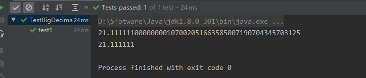
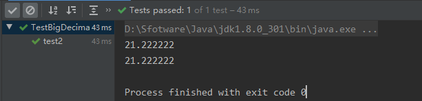
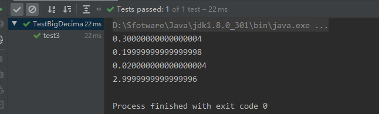
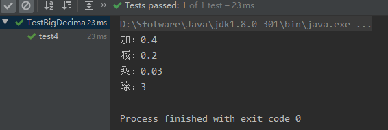
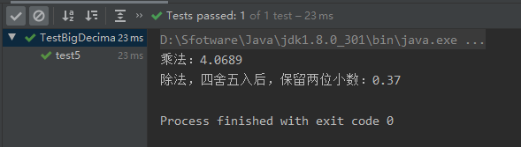
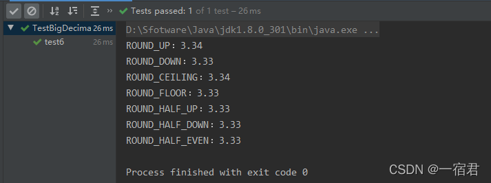
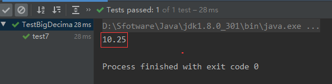

# Java中BigDecimal详解及应用
- 本文转自 [一宿君博客](https://developer.aliyun.com/article/830593?spm=a2c6h.13262185.profile.13.7f6e4a00zkB0B8)

**简介：** BigDecimal用来对超过16位有效位的数进行精确的运算。双精度浮点型变量double可以处理16位有效数，但在实际应用中，可能需要对更大或者更小的数进行运算和处理。一般情况下，对于那些不需要准确计算精度的数字，我们可以直接使用Float和Double处理，但是Double.valueOf(String) 和Float.valueOf(String)会丢失精度。所以在开发中，如果你所做的业务跟财务相关需要精确计算的结果，那必须使用BigDecimal类来操作啦！

1、BigDecimal简介
==============

借用《Effactive Java》书中的一句话，float和double类型设计的主要目标是为了科学计算和工程计算。它们主要用于执行二进制浮点运算，这是为了在广域数值范围上提供较为精确的快速近似计算而精心设计的。

罢特，它们没有提供完全精确的计算结果，所以不应该被用于要求精确结果的场合。但是，在商业计算中往往要求结果精确，这时候BigDecimal就派上大用场啦。

**Java在java.math包中提供的API类BigDecimal 由`任意精度的整数非标度值` 和`32 位的整数标度 (scale)` 组成。如果为零或正数，则标度是小数点后的位数。如果为负数，则将该数的非标度值乘以 10 的负scale 次幂。因此，BigDecimal表示的数值是(unscaledValue × 10 -scale)。**

**BigDecimal用来对超过16位有效位的数进行精确的运算。双精度浮点型变量double可以处理16位有效数，但在实际应用中，可能需要对更大或者更小的数进行运算和处理。一般情况下，对于那些不需要准确计算精度的数字，我们可以直接使用Float和Double处理，但是Double.valueOf(String) 和Float.valueOf(String)会丢失精度。所以在开发中，如果你所做的业务跟财务相关需要精确计算的结果，那必须使用BigDecimal类来操作啦！**

**`BigDecimal`所创建的是`对象`，我们不能使用传统的`+、-、*、/`等算术运算符直接对其对象进行数学运算，而必须调用其相对应的方法。方法中的参数也必须是BigDecimal的对象。构造器是类的特殊方法，专门用来创建对象，特别是带有参数的对象。**

2、构造器及方法描述
==========

2.1、常用构造器
---------

*   **BigDecimal(int)** 创建一个具有参数所指定整数值的对象。
*   **BigDecimal(double)** 创建一个具有参数所指定双精度值的对象。 【不推荐使用】
*   **BigDecimal(long)** 创建一个具有参数所指定长整数值的对象。
*   **BigDecimal(String)** 创建一个具有参数所指定以字符串表示的数值的对象。【推荐使用】

2.1、常用方法
--------

*   **add(BigDecimal)** BigDecimal对象中的值相加，然后返回这个对象。
*   **subtract(BigDecimal)** BigDecimal对象中的值相减，然后返回这个对象。
*   **multiply(BigDecimal)** BigDecimal对象中的值相乘，然后返回这个对象。
*   **divide(BigDecimal)** BigDecimal对象中的值相除，然后返回这个对象。
*   **toString()** 将BigDecimal对象的数值转换成字符串。
*   **doubleValue()** 将BigDecimal对象中的值以双精度数返回。
*   **floatValue()** 将BigDecimal对象中的值以单精度数返回。
*   **longValue()** 将BigDecimal对象中的值以长整数返回。
*   **intValue()** 将BigDecimal对象中的值以整数返回。

2.3、解释不推荐使用的构造器
---------------

**1、为什么不推荐使用BigDecimal(double)，而推荐使用BigDecimal(String)？**

```
    @Test
    public void test1(){
        //BigDecimal(Double)
        BigDecimal doubleStr = new BigDecimal(21.111111);
        //BigDecimal(String)
        BigDecimal intStr = new BigDecimal("21.111111");

        System.out.println(doubleStr);
        System.out.println(intStr);
    }
```



`从上述运行结果就可以看出，使用double类型作为构造源，会有计算问题！！！`

**JDK的描述原因：**

*   参数类型为double的构造方法的结果有一定的不可预知性。有人可能认为在Java中写入newBigDecimal(0.1)所创建的BigDecimal正好等于 0.1（非标度值 1，其标度为 1），但是它实际上等于0.1000000000000000055511151231257827021181583404541015625。这是因为0.1无法准确地表示为 double（或者说对于该情况，不能表示为任何有限长度的二进制小数）。这样的话，传入到构造方法的值不会正好等于 0.1（虽然表面上等于该值，但是在JDK内部参与运算的时候不是0.1，这样就造成了一定的计算误差）。
*   另一方面，String 构造方法是完全可预知的：写入 newBigDecimal("0.1") 将创建一个 BigDecimal，它正好等于预期的 0.1。因此，比较而言，`通常建议优先使用String构造方法`。

**2、当double必须用作BigDecimal的构造源时，可以使用`Double.toString(double)转成String`，然后使用String构造方法，或使用`BigDecimal的静态方法valueOf()`，如下:**

```
    @Test
    public void test2(){
        BigDecimal doubleStr = new BigDecimal(Double.toString(21.222222));
        BigDecimal intStr = BigDecimal.valueOf(21.222222);

        System.out.println(doubleStr);
        System.out.println(intStr);
    }
```



3、BigDecimal的加减乘除应用
===================

3.1、普通的+、-、\*、/
---------------

```
    @Test
    public void test3(){
        System.out.println(0.2 + 0.1);
        System.out.println(0.3 - 0.1);
        System.out.println(0.2 * 0.1);
        System.out.println(0.3 / 0.1);
    }
```

  
**出现上述结果刺激吧！那为什么会出现上述请款呢？**

*   因为不论是float 还是double都是浮点数，计算机只认识二进制，浮点数会失去一定的精确度。
*   详解：十进制值通常没有完全相同的二进制表示形式；十进制数的二进制表示形式可能不精确，只能无限接近于精确值。

**在真正的开发项目中，我们不可能让这种情况出现，特别是`金融财务项目`，因为涉及金额的计算都必须十分精确，你想想，如果你的支付宝账户余额显示0.99999999999998，那是一种怎么样的体验？反正我是难受的扒不出来！！！**

3.2、BigDecimal的+、-、\*、/
-----------------------

```
     @Test
    public void test4(){
        BigDecimal num1 = new BigDecimal("0.3");
        BigDecimal num2 = new BigDecimal("0.1");

        System.out.println("加：" + num1.add(num2));
        System.out.println("减：" + num1.subtract(num2));
        System.out.println("乘：" + num1.multiply(num2));
        System.out.println("除：" + num1.divide(num2));
    }
```



3.3、特别注意BigDecimal的除法不能整除的情况（需要进行四舍五入）
--------------------------------------

**如果出现以下异常错误：**

```
java.lang.ArithmeticException: Non-terminating decimal expansion; no exact representable decimal result.
```

**原因：**

> 如果进行除法运算的时候，`结果不能整除，带有有余数`，这个时候就会报java.lang.ArithmeticException: ，这边我们要避免这个错误产生，在进行除法运算的时候，针对可能出现的小数产生的计算，在divide方法中除数后面必须要多传两个参数：**divide(`除数`，`保留小数点后几位小数`，`舍入模式`)。**

**舍入模式：**

*   **ROUND\_UP** ：向远离0的方向舍入
*   **ROUND\_DOWN** ：向零方向舍入
*   **ROUND\_CEILING** ：向正无穷方向舍入
*   **ROUND\_FLOOR** ：向负无穷方向舍入
*   **ROUND\_HALF\_UP** ：向（距离）最近的一边舍入，如果两边（的距离）是相等时，向上舍入, 1.55保留一位小数结果为1.6,也就是我们常说的“`四舍五入`”
*   **ROUND\_HALF\_DOWN** ：向（距离）最近的一边舍入，如果两边（的距离）是相等时，向下舍入, 例如1.55 保留一位小数结果为1.5
*   **ROUND\_HALF\_EVEN** ：向（距离）最近的一边舍入，如果两边（的距离）是相等时，如果保留位数是奇数，使用ROUND\_HALF\_UP，如果是偶数，使用ROUND\_HALF\_DOWN
*   **ROUND\_UNNECESSARY** ：计算结果是精确的，不需要舍入模式

**案例1：**

```
    @Test
    public void test5(){
        double aDouble = 1.233;
        float aFloat = 3.3f;

        BigDecimal num3 = new BigDecimal(Double.toString(aDouble));
        BigDecimal num4 = new BigDecimal(Float.toString(aFloat));

        System.out.println("乘法：" + num3.multiply(num4));

        //System.out.println("除法:" + num3.divide(num4)); //会报错
        System.out.println("除法，四舍五入后，保留两位小数：" + num3.divide(num4,2,BigDecimal.ROUND_HALF_UP));
    }
```

  
**案例2：**

```
    @Test
    public void test6(){

        BigDecimal intStr = BigDecimal.valueOf(10);
        BigDecimal doubleStr = new BigDecimal(Double.toString(3));

        //后面代表的是舍入模式的值
        System.out.println("ROUND_UP：" + intStr.divide(doubleStr,2,BigDecimal.ROUND_UP));//0
        System.out.println("ROUND_DOWN：" + intStr.divide(doubleStr,2,BigDecimal.ROUND_DOWN));//1
        System.out.println("ROUND_CEILING：" + intStr.divide(doubleStr,2,BigDecimal.ROUND_CEILING)); //2
        System.out.println("ROUND_FLOOR：" + intStr.divide(doubleStr,2,BigDecimal.ROUND_FLOOR));//3
        System.out.println("ROUND_HALF_UP：" + intStr.divide(doubleStr,2,BigDecimal.ROUND_HALF_UP));//4
        System.out.println("ROUND_HALF_DOWN：" + intStr.divide(doubleStr,2,BigDecimal.ROUND_HALF_DOWN));//5
        System.out.println("ROUND_HALF_EVEN：" + intStr.divide(doubleStr,2,BigDecimal.ROUND_HALF_EVEN));//6
    }
```

**运行结果：**  
  
**注意：这个divide方法有两个重载的方法，一个是传`两个参数的`，一个是传`三个参数`的。**

```
//两个参数的(只需传入舍入模式值，但是保留位数按舍入模式的默认位数)
public BigDecimal divide(BigDecimal divisor, int roundingMode) {
        return this.divide(divisor, scale, roundingMode);
}


//三个参数的
public BigDecimal divide(BigDecimal divisor, int scale, int roundingMode) {
        if (roundingMode < ROUND_UP || roundingMode > ROUND_UNNECESSARY)
            throw new IllegalArgumentException("Invalid rounding mode");
        if (this.intCompact != INFLATED) {
            if ((divisor.intCompact != INFLATED)) {
                return divide(this.intCompact, this.scale, divisor.intCompact, divisor.scale, scale, roundingMode);
            } else {
                return divide(this.intCompact, this.scale, divisor.intVal, divisor.scale, scale, roundingMode);
            }
        } else {
            if ((divisor.intCompact != INFLATED)) {
                return divide(this.intVal, this.scale, divisor.intCompact, divisor.scale, scale, roundingMode);
            } else {
                return divide(this.intVal, this.scale, divisor.intVal, divisor.scale, scale, roundingMode);
            }
        }
    }
```

**需要对BigDecimal进行截断和四舍五入可用setScale方法，例如：**

```
    @Test
    public void test7(){
        BigDecimal num = new BigDecimal("10.254");
        System.out.println(num.setScale(2,BigDecimal.ROUND_HALF_UP ));//保四舍五入，留两位小数
    }
```

