## 0 并发、多线程

* 背景
* Java多线程应用
* JMM内存模型
* 并发编程三大特性
* 线程通信的相关知识
* 理解java中的锁
* JUC-同步工具类使用
* 理解线程池的原理

# 1 背景

在计算机早期，在没有线程的年代，在同一个进程中，程序的处理流程都是顺序的，下一个流程的开始必须等待上一个流程的结束，如果其中某一个流程非常耗时，那么会影响整个流程的处理时间

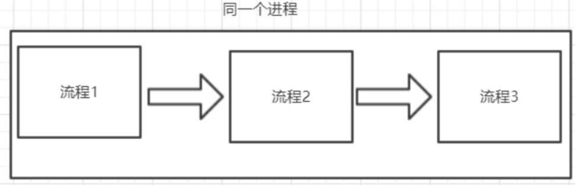

思考：怎么优化呢

将耗时的部分改成异步处理

## 1.1 线程的出现 

有了进程以后，为什么还要发明线程呢？ 

1. 在多核CPU中，利用多线程可以实现并行 执行 
2. 同步处理的流程容易发生阻塞，可以用线程来实现异步处理，提高程序处理实时性
3. 线程可以认为是轻量级的进程，所以线程的创建、销毁 比进程更快 （性能开销更小）

# 2 多线程应用

## 2.1 Java中如何应用多线程

### 2.1.1 继承Thread

	第一种继承Thread类 重写run方法

```java
public class Demo1CreateThread extends Thread {

    public static void main(String[] args) throws InterruptedException {

        System.out.println("-----多线程创建开始-----");
        // 1.创建一个线程
        CreateThread createThread1 = new CreateThread();
        CreateThread createThread2 = new CreateThread();
        // 2.开始执行线程 注意 开启线程不是调用run方法，而是start方法
        System.out.println("-----多线程创建启动-----");
        createThread1.start();
        createThread2.start();
        System.out.println("-----多线程创建结束-----");
    }

    static class CreateThread extends Thread {
        public void run() {
            String name = Thread.currentThread().getName();
            for (int i = 0; i < 5; i++) {
                System.out.println(name + "打印内容是:" + i);
            }
        }
    }
}
```

### 2.1.2 实现Runnable接口

实现Runnable接口,重写run方法。实际上所有的多线程代码都是通过运行Thread的start()方法来运行的。因此，不管是继承Thread类还是实现Runnable接口来实现多线程，最终还是通过Thread的对象的API来控制线程的。

```java
public class Demo2CreateRunnable {

    public static void main(String[] args) {
        System.out.println("-----多线程创建开始-----");
        // 1.创建线程
        CreateRunnable createRunnable = new CreateRunnable();
        Thread thread1 = new Thread(createRunnable);
        Thread thread2 = new Thread(createRunnable);
        // 2.开始执行线程 注意 开启线程不是调用run方法，而是start方法
        System.out.println("-----多线程创建启动-----");
        thread1.start();
        thread2.start();
        System.out.println("-----多线程创建结束-----");
    }

    static class CreateRunnable implements Runnable {

        public void run() {
            String name = Thread.currentThread().getName();
            for (int i = 0; i < 5; i++) {
                System.out.println(name + "的内容:" + i);
            }
        }
    }
}
```

> **Thread和Runnable区别？**
>
> 1、java是单继承，如果一个类已经继承了父类，那么无法继承Thread,所以需要实现Runnable
>
> 2、Thread实现了Runnable接口
>
> 3、实现Runnable资源可以共享
>
> **实现Runnable接口比继承Thread类所具有的优势：**
>
> 1. 适合多个相同的程序代码的线程去共享同一个资源。
> 2. 可以避免java中的单继承的局限性。
> 3. 增加程序的健壮性，实现解耦操作，代码可以被多个线程共享，代码和数据独立。
> 4. 线程池只能放入实现Runable或callable类线程，不能直接放入继承Thread的类

### 2.1.3 实现Callable

```java
public class MyCallable implements Callable<String> {

    @Override
    public String call() throws Exception {
        System.out.println(Thread.currentThread().getName());
        return "11";
    }

    public static void main(String[] args) throws ExecutionException, InterruptedException {
        MyCallable myCallable = new MyCallable();
        //线程池后面会详细的说明，先知道有这么一个东西即可
        ExecutorService executorService = Executors.newFixedThreadPool(1);
        Future<String> future = executorService.submit(myCallable);
        
        System.out.println(future.get());
    }
}
```

> Callable跟其它两种线程的区别？
>
> 说白了：Callable有返回值

## 2.2 线程的状态

### 2.2.1 Java中Thread源码

查看Thread源码，能够看到java的线程有六种状态：

```java
public enum State {
  NEW,
  RUNNABLE,
  BLOCKED,
  WAITING,
  TIMED_WAITING,
  TERMINATED;
}
```

* **NEW(新建) **
  线程刚被创建，但是并未启动。
* **RUNNABLE(可运行)**
  线程可以在java虚拟机中运行的状态，可能正在运行自己代码，也可能没有，这取决于操作系统处理器。
* **BLOCKED(锁阻塞)**
  当一个线程试图获取一个对象锁，而该对象锁被其他的线程持有，则该线程进入Blocked状态；当该线程持有锁时，该线程将变成Runnable状态。
* **WAITING(无限等待)**
  一个线程在等待另一个线程执行一个（唤醒）动作时，该线程进入Waiting状态。进入这个状态后是不能自动唤醒的，必须等待另一个线程调用notify或者notifyAll方法才能够唤醒。
* **TIMED_WAITING(计时等待)**
  同waiting状态，有几个方法有超时参数，调用他们将进入Timed Waiting状态。这一状态将一直保持到超时期满或者接收到唤醒通知。带有超时参数的常用方法有Thread.sleep 、Object.wait。
* **TERMINATED(被终止)**
  因为run方法正常退出而死亡，或者因为没有捕获的异常终止了run方法而死亡。

### 2.2.2 线程的状态

线程一共有 6 种状态（NEW、RUNNABLE、BLOCKED、 WAITING、TIME_WAITING、TERMINATED）

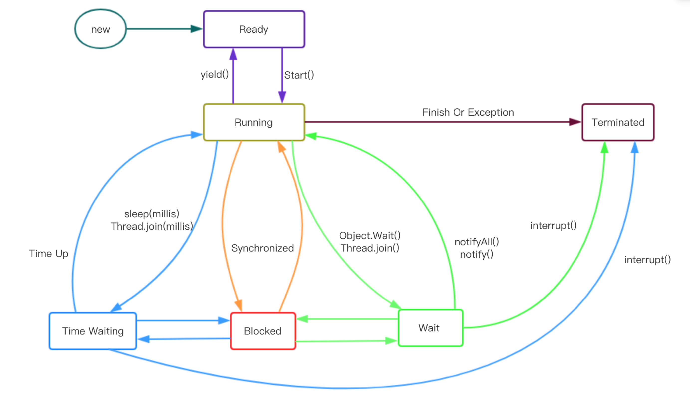

NEW：初始状态，线程被创建，但是还没有调用start方法 

RUNNABLED：运行状态，调用start方式让线程处于“运行中” 

BLOCKED：阻塞状态，表示线程进入等待状态,也就是线程 因为某种原因放弃了CPU使用权，阻塞也分为几种情况 

➢ 同步阻塞：运行的线程在获取锁时，若该锁被其他线程占用了，那么当前线程会阻塞

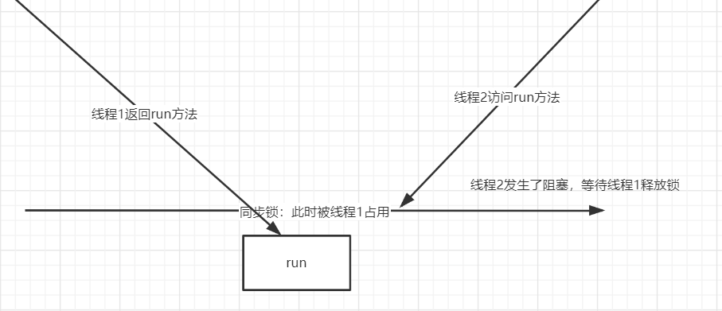

➢ 其他阻塞：运行的线程执行Thread.sleep或者t.join方法时，称为其他阻塞

> Thread.sleep(1000)

WAITING:调用wait等方法等待,等待唤醒(notify或notifyAll)

> wait();

TIME_WAITING：超时等待状态，等待另一个线程在指定的时间访问唤醒,超时以后线程状态就是TIME_WAITING

> wait(2000)

TERMINATED：终止状态，表示当前线程执行完毕 

> run方法执行完毕

* 线程的启动

  前面我们通过一些案例演示了线程的启动，也就是调用 start()方法去启动一个线程。

  我们看到调用 start 方法实际上是调用一个 native 方法 start0()来启动一个线程。

* 线程的中断

  要优雅的去中断一个线程，在线程中提供了一个 interrupt 方法

  ```java
  public class InterrupDemo {
  
      static int i;
  
      public static void main(String[] args) throws InterruptedException {
  
          Thread t = new Thread(()->{
              //isInterrupted()默认是false,如果当前线程调用了interrupt()之后，isInterrupted()变成true
              //说白了，就是判断有没有调用线程中断方法
              while(! Thread.currentThread().isInterrupted()){
                  i++;
              }
              System.out.println("while之外的输出:"+i);
          },"InterrupDemo");
  
          t.start();
  
          Thread.sleep(100);
  
          t.interrupt();
      }
  }
  ```

* Thread.sleep

  Thread.sleep（）：让当前的流程睡眠多少毫秒

  ```java
  public class ThreadSleepDemo {
  
      public static void main(String[] args) throws InterruptedException {
          System.out.println("开始:"+new Date());
  
          Thread.sleep(2000);// 2 秒
  
          System.out.println("结束:"+new Date());
      }
  }
  ```

* Thread.join

  Thread.join:等待某一个线程执行结束

  ```java
  public class ThreadJoinDemo {
  
      public static void main(String[] args) throws InterruptedException {
          Thread t1 = new Thread(()->{
              try {
                  Thread.sleep(2000);
              } catch (InterruptedException e) {
                  e.printStackTrace();
              }
              System.out.println("t1");
          });
  
          t1.start();
          //需求：让第二线程必须等到第一个线程执行完之后再执行
          t1.join();//阻塞，等到t1线程执行完毕
  
          Thread t2 = new Thread(()->{
              System.out.println("t2");
          });
          t2.start();
          //期望结果：t1永远都在t2前面打印
      }
  }
  ```

## 2.3 多线程安全问题

### 2.3.1 卖票案例

如果有多个线程在同时运行，而这些线程可能会同时运行这段代码。程序每次运行结果和单线程运行的结果是一样的，而且其他的变量的值也和预期的是一样的，就是线程安全的，反之则是线程不安全的。

```java
public class Demo5Ticket {

    public static void main(String[] args) {
        //创建线程任务对象
        Ticket ticket = new Ticket();
        //创建三个窗口对象
        Thread t1 = new Thread(ticket, "窗口1");
        Thread t2 = new Thread(ticket, "窗口2");
        Thread t3 = new Thread(ticket, "窗口3");

        //卖票
        t1.start();
        t2.start();
        t3.start();
    }

    static class Ticket implements Runnable {

        //Object lock = new Object();
        ReentrantLock lock = new ReentrantLock();
        private int ticket = 10;

        public void run() {
            String name = Thread.currentThread().getName();
            while (true) {
                sell(name);
                if (ticket <= 0) {
                    break;
                }
            }
        }

        private void sell(String name) {
            try {
                Thread.sleep(10);
            } catch (InterruptedException e) {
                e.printStackTrace();
            }
            if (ticket > 0) {
                System.out.println(name + "卖票：" + ticket);
                ticket--;
            }
        }
    }
}
```

线程安全问题都是由全局变量及静态变量引起的。若每个线程中对全局变量、静态变量只有读操作，而无写操作，一般来说，这个全局变量是线程安全的；若有多个线程同时执行写操作，一般都需要考虑线程同步，否则的话就可能影响线程安全。

> 判断当前程序中是否存在线程安全问题？
>
> 1. 是否存在多线程环境
> 2. 在多线程环境下是否存在共享变量
> 3. 在多线程环境下是否存在对共享变量 **“写”** 操作

### 2.3.2 线程同步

当我们使用多个线程访问同一资源的时候，且多个线程中对资源有写的操作，就容易出现线程安全问题。
		要解决上述多线程并发访问一个资源的安全问题，Java中提供了同步机制(synchronized)来解决。

**同步代码块**

```java
Object lock = new Object(); //创建锁
synchronized(lock){
     //可能会产生线程安全问题的代码
}
```

**同步方法**

```java
//同步方法
public synchronized void method(){
   //可能会产生线程安全问题的代码 
}
```

同步方法使用的是this锁

证明方式: 一个线程使用同步代码块(this明锁),另一个线程使用同步函数。如果两个线程抢票不能实现同步，那么会出现数据错误。

```java
//使用this锁的同步代码块
synchronized(this){
     //需要同步操作的代码
}
```

**Lock锁**

```java
Lock lock = new ReentrantLock();
lock.lock();
	//需要同步操作的代码
lock.unlock();
```

### 2.3.3 死锁

死锁是指两个或两个以上的线程在执行过程中，因为争夺资源造成的互相等待的现象。

死锁需要满足的四大条件如下：

1. 互斥条件：一个资源每次只能被一个线程使用。
2. 请求与保持条件：一个线程因请求资源而阻塞时，对已获得的资源保持不放。
3. 不剥夺条件：线程已获得的资源，在末使用完之前，不能强行剥夺。
4. 循环等待条件：若干线程之间形成一种头尾相接的循环等待资源关系。

产生死锁的主要原因有：

1. 系统资源不足
2. 进程运行推进顺序不当
3. 资源分配不当

多线程死锁：同步中嵌套同步,导致锁无法释放。

避免死锁最简单的方法就是阻止循环等待条件，将系统中所有的资源设置标志位、排序，规定所有的进程申请资源必须以一定的顺序（升序或降序）做操作来避免死锁。

```java
public class Demo6DeadLock {

    public static void main(String[] args) {
        //创建线程任务对象
        Ticket ticket = new Ticket();
        //创建三个窗口对象
        Thread t1 = new Thread(ticket, "窗口1");
        Thread t2 = new Thread(ticket, "窗口2");
        Thread t3 = new Thread(ticket, "窗口3");

        //卖票
        t1.start();
        t2.start();
        t3.start();
    }

    static class Ticket implements Runnable {

        Object lock = new Object();
        private int ticket = 100;

        public void run() {
            String name = Thread.currentThread().getName();
            while (true) {
                if ("窗口1".equals(name)) {
                    synchronized (lock) {
                        sell(name);
                    }
                } else {
                    sell(name);
                }
                if (ticket <= 0) {
                    break;
                }
            }
        }

        private synchronized void sell(String name) {
            synchronized (lock) {
                if (ticket > 0) {
                    System.out.println(name + "卖票：" + ticket);
                    ticket--;
                }
            }
        }
    }
}
```

## 2.4 线程池执行流程

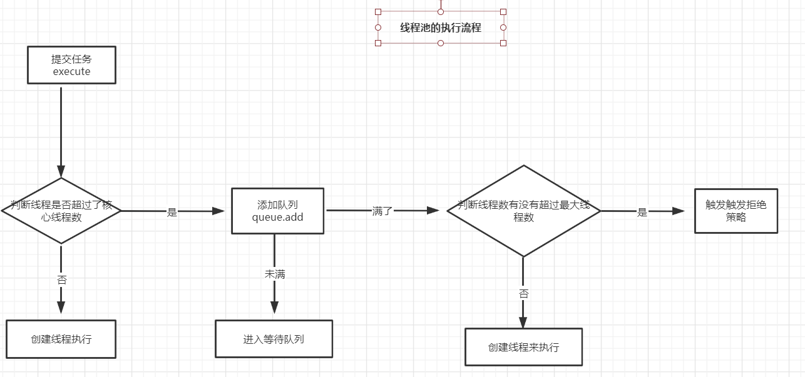


# 3 JMM内存模型

1. Java内存模型（简称：JMM）定义了共享内存中多线程程序读写操作 的行为规范，通过这些规则来规范对内存的读写操作从而保证指令的正 确性，它解决了 CPU 多级缓存、处理器优化、指令重排序 导致的内存访问问题

   总结：JMM让java程序与硬件指令进行了隔离

2. 由于JVM运行程序的实体是线程，而每个线程创建时JVM都会为其创建一个工作内存，用于存储线程私有的数据。而Java内存模型中规定所有变量都存储在主内存，主内存是共享内存区域，所有线程都可以访问。

   总结：JMM把内存分为两块，一块是私有线程的工作区域（工作内存），一块是所有线程的共享区域（主内存）

3. 线程对变量的操作(读取赋值等)必须在工作内存中进行，首先要将变量从主内存拷贝的自己的工作内存空间，然后对变量进行操作，操作完成后再将变量写回主内存，不能直接操作主内存中的变量，工作内存中存储着主内存中的变量副本，前面说过，工作内存是每个线程的私有数据区域，因此不同的线程无法访问其它线程的工作内存，线程间的通信(传值)必须通过主内存来完成，

   总结：线程跟线程之间是相互隔离，线程跟线程交互需要通过主内存

其简要访问过程如下图：

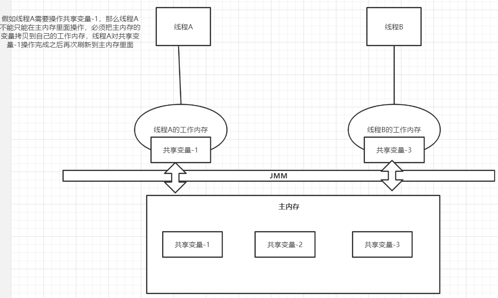

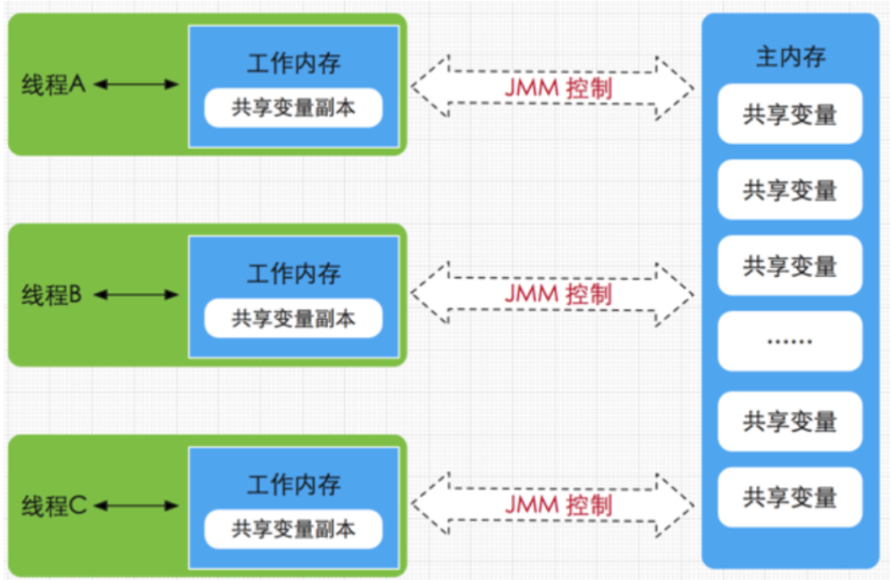

关于JMM中的主内存和工作内存说明

- 主内存
  主要存储的是Java实例对象，所有线程创建的实例对象都存放在主内存中，不管该实例对象是成员变量还是方法中的本地变量，也包括了共享的类信息、常量、静态变量。由于是共享数据区域，多条线程对同一个变量进行访问可能会发现线程安全问题。
- 工作内存
  每个线程只能访问自己的工作内存，即线程中的本地变量对其它线程是不可见的，就算是两个线程执行的是同一段代码，它们也会在自己的工作内存中创建属于当前线程的本地变量。注意由于工作内存是每个线程的私有数据，线程之间的工作内存无法相互访问，因此存储在工作内存的数据不存在线程安全问题。

* JMM 内存指令同步的流程

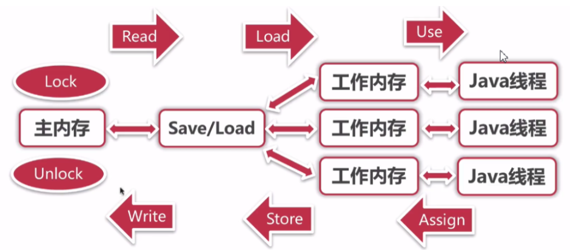

> 举例：线程操作一个变量分两步
>
> 1.主内存变量到工作内存到线程使用：Lock-->Read-->Load-->use-->线程使用
>
> 2.线程操作变量完成同步到工作内存，工作内存刷新到主内存过程：：Assign-->Store-->Write--->Unlock

```
1. lock(锁定)：作用于主内存的变量，把一个变量标记为一条线程独占状态

2. unlock(解锁)：作用于主内存的变量，把一个处于锁定状态的变量释放出来，释放后的变量才可以被其他线程锁定

3. read(读取)：作用于主内存的变量，把一个变量值从主内存传输到线程的工作内存中，以便随后的load动作使用

4. load(载入)：作用于工作内存的变量，它把read操作从主内存中得到的变量值放入工作内存的变量副本中

5. use(使用)：作用于工作内存的变量，use指令表示的是线程去加载工作内存的变量，从而进行变量操作

6. assign(赋值)：作用于工作内存的变量，私有线程运行结束之后需要把运行完最新的数据重新赋值给工作内存变量

7. store(存储)：作用于工作内存的变量，把工作内存中的一个变量的值传送到主内存中，以便随后的write操作

8. write(写入)：作用于工作内存的变量，它把store操作从工作内存中的一个变量的值传送到主内存的变量中
```

# 4 Java并发编程三大特性

## 4.1 原子性

一个线程在CPU中操作不可暂定，也不可中断，要不执行完成，要不不执行

```java
public class TicketDemo {

    int ticketNum = 10;

    public synchronized void getTicket(){

        if(ticketNum <= 0){
            return ;
        }
        System.out.println(Thread.currentThread().getName()+"抢到一张票,剩余:"+ticketNum);
         // 非原子性操作
        ticketNum--;
    }

    public static void main(String[] args) {
        TicketDemo demo = new TicketDemo();
        for(int i=0;i<20;i++){
            new Thread(demo::getTicket).start();
        }
        //结论：不是原子操作，怎么保证原子操作呢？
    }

}
```

>不是原子操作，怎么保证原子操作呢？
>
>JMM对原子性的保证：
>
>1.synchronized：同步加锁
>
>2.JUC里面的lock：加锁
>
>

## 4.2 内存可见性

多个线程访问同一个变量是，一个线程修改这个变量的值，其它线程能够看到修改之后的值，默认JMM对工作内存中的变量是不可见的。

```java
public class VolatileDemo {

    private volatile static boolean flag = false;

    public static void main(String[] args) throws InterruptedException {

        new Thread(()->{
            while(!flag){

            }
            System.out.println("第一个线程执行完毕...");
        }).start();

        Thread.sleep(100);

        new Thread(()->{
            flag = true;//思考：第一个线程会不会跳槽while循环，输出System.out.println("第一个线程执行完毕...");
            System.out.println("第二线程执行完毕...");
        }).start();

    }

}
```

> JMM对可见性的保证：
>
> 加Volatile关键字
>
> 对Volatile变量进行**写操作**的时候，会在写操作之后加一个屏障指令（store）,会将数据强制刷新到主内存中
>
> 对Volatile变量进行**读操作**的时候，会在读操作之前加一个指令（load），强制每次都去主内存拉取最新的变量值

## 4.3 有序性

程序执行的顺序按照代码的先后顺序执行。
一般来说处理器为了提高程序运行效率，可能会对输入代码进行优化，它不保证程序中各个语句的执行先后顺序同代码中的顺序一致，但是它会保证程序最终执行结果和代码顺序执行的结果是一致的。如下：

```java
int a=2; //1 
int b=3; //2 
int rs=a*b; //3
```

则因为**指令重排序**，他还可能执行顺序为 1-2-3,2-1-3
 但是绝对不会是3-1-2/3-2-1这种顺序,因为这打破了依赖关系。

显然重排序对单线程运行是不会有任何问题，而多线程就不一定了，所以我们在多线程编程时就得考虑这个问题了。 

# 5 Volatile

通过前面内容我们了解了synchronized，虽然JVM对它做了很多优化，但是它还是一个重量级的锁。而接下来要介绍的volatile则是轻量级的synchronized。如果一个变量使用volatile，则它比使用synchronized的成本更加低，因为它不会引起线程上下文的切换和调度。

Java语言规范对volatile的定义如下：

Java允许线程访问共享变量，为了确保共享变量能被准确和一致地更新，线程应该确保通过排他锁单独获得这个变量。

通俗点讲就是说一个变量如果用volatile修饰了，则Java可以确保所有线程看到这个变量的值是一致的，如果某个线程对volatile修饰的共享变量进行更新，那么其他线程可以立马看到这个更新，这就是内存可见性。

volatile虽然看起来比较简单，使用起来无非就是在一个变量前面加上volatile即可，但是要用好并不容易。

## 5.1 解决内存可见性问题

在可见性问题案例中进行如下修改，添加volatile关键词：

```java
 private volatile boolean flag = true;
```

Volatile实现内存可见性的过程

线程写Volatile变量的过程：

1. 改变线程本地内存中Volatile变量副本的值；
2. 将改变后的副本的值从本地内存刷新到主内存

线程读Volatile变量的过程：

1. 从主内存中读取Volatile变量的最新值到线程的本地内存中
2. 从本地内存中读取Volatile变量的副本

Volatile实现内存可见性原理：

写操作时，通过在写操作指令后加入一条store屏障指令，让本地内存中变量的值能够刷新到主内存中

读操作时，通过在读操作前加入一条load屏障指令，及时读取到变量在主内存的值

> 内存屏障（Memory Barrier）是一种CPU指令，用于控制特定条件下的重排序和内存可见性问题。Java编译器也会根据内存屏障的规则禁止重排序

volatile的底层实现是通过插入内存屏障，但是对于编译器来说，发现一个最优布置来最小化插入内存屏障的总数几乎是不可能的，所以，JMM采用了保守策略。如下：

- StoreStore屏障可以保证在volatile写之前，其前面的所有普通写操作都已经刷新到主内存中。

- StoreLoad屏障的作用是避免volatile写与后面可能有的volatile读/写操作重排序。

- LoadLoad屏障用来禁止处理器把上面的volatile读与下面的普通读重排序。

- LoadStore屏障用来禁止处理器把上面的volatile读与下面的普通写重排序。


## 5.2 原子性的问题

虽然Volatile 关键字可以让变量在多个线程之间可见，但是Volatile不具备原子性。

```java
public class Demo3Volatile {

    public static void main(String[] args) throws InterruptedException {
        VolatileDemo demo = new VolatileDemo();

        for (int i = 0; i < 5; i++) {
            Thread t = new Thread(demo);
            t.start();
        }

        Thread.sleep(1000);
        System.out.println(demo.count);
    }

    static class VolatileDemo implements Runnable {
        //public volatile int count;
        public volatile AtomicInteger count = new AtomicInteger(0);

        public void run() {
            addCount();
        }

        public void addCount() {
            for (int i = 0; i < 10000; i++) {
                count++;
            }
        }
    }
}
```

**原因分析：**

count = 5 开始，流程分析：

1. 线程1读取count的值为5
2. 线程2读取count的值为5
3. 线程2加1操作
4. 线程2最新count的值为6
5. 线程2写入值到主内存的最新值为6

这个时候，线程1的count为5，线程2的count为6

如果切换到线程1执行，那么线程1得到的结果是6，写入到主内存的值还是6

现在的情况是对count进行了两次加1操作，但是主内存实际上只是加1一次

**解决方案：**

1. 使用synchronized
2. 使用ReentrantLock（可重入锁）
3. 使用AtomicInteger（原子操作）

使用synchronized

```java
public synchronized void addCount() {
    for (int i = 0; i < 10000; i++) {
        count++;
    }
}
```

使用ReentrantLock（可重入锁）

```java
//可重入锁
private Lock lock = new ReentrantLock();

public void addCount() {
    for (int i = 0; i < 10000; i++) {
        lock.lock();
        count++;
        lock.unlock();
    }
}
```

使用AtomicInteger（原子操作）

```java
public static AtomicInteger count = new AtomicInteger(0);
public void addCount() {
    for (int i = 0; i < 10000; i++) {
        //count++;
        count.incrementAndGet();
    }
}
```

**总结：Volatile可以解决内存可见性和有序性，但是不能解决原子性。**

## 5.3 Volatile 适用场景

a）对变量的写入操作不依赖其当前值

    	不满足：number++、count=count*5等
    
    	满足：boolean变量、直接赋值的变量等

b）该变量没有包含在具有其他变量的不变式中

	不满足：不变式 low<up

总结：变量真正独立于其他变量和自己以前的值，在单独使用的时候，适合用volatile 

## 5.4 synchronized和volatile比较

a）volatile不需要加锁，比synchronized更轻便，不会阻塞线程

b）synchronized既能保证可见性，又能保证原子性，而volatile只能保证可见性，无法保证原子性

与锁相比，Volatile 变量是一种非常简单但同时又非常脆弱的同步机制，它在某些情况下将提供优于锁的性能和伸缩性。如果严格遵循 volatile 的使用条件（**变量真正独立于其他变量和自己以前的值** ） 在某些情况下可以使用 volatile 代替 synchronized 来优化代码提升效率。

# 6 理解线程间通信

wait：表示持有对象锁的线程 释放对象锁权限，并且释 放 cpu 资源并进入阻塞状态。

notify: 唤醒一个阻塞状态的线程

notifyAll: 唤醒全部阻塞状态的线程

**等待唤醒机制—生产者消费者模型**

* ThreadA

```java
public class ThreadA extends Thread {

    private Object obj;

    public ThreadA(Object obj){
        this.obj = obj;
    }

    @Override
    public void run(){
        synchronized (obj){
            System.out.println(Thread.currentThread().getName()+"ThreadA开始了....");
            try {
                obj.wait();//阻塞，等待唤醒
            } catch (InterruptedException e) {
                e.printStackTrace();
            }
            System.out.println(Thread.currentThread().getName()+"ThreadA结束了....");
        }
    }

}
```

* ThreadB

```java
public class ThreadB extends Thread {

    private Object obj;

    public ThreadB(Object obj){
        this.obj = obj;
    }

    @Override
    public void run(){
        synchronized (obj){
            System.out.println(Thread.currentThread().getName()+"ThreadB开始了....");
            obj.notify();//唤醒
            System.out.println(Thread.currentThread().getName()+"ThreadB结束了....");
        }
    }

}
```

* NotifyWaitDemo

```java
public class NotifyWaitDemo {

    public static void main(String[] args) throws InterruptedException {
        Object obj = new Object();
        new ThreadA(obj).start();

        Thread.sleep(10);

        new ThreadB(obj).start();
    }

}
```

# 7 理解Java中各种锁

## 7.1 synchronized

**synchronized 的基本认识**

在多线程并发编程中synchronized一直是元老级角色，很 多人都会称呼它为重量级锁

- synchronize使用方式

1、修饰在实例方法：作用当前实例加锁

```java
public class TicketDemo{

	public synchronized void getTicket(){
        try {
            ...
        }
```

2、修饰在静态方法:作用当前类加锁

```java
public class TicketDemo1 {

    static int ticketNum = 10;

    public synchronized static void getTicket() {
          ....
    }

}
```

3、修饰在代码块:进入同 步块加锁

```java
public class TicketDemo1 {

    static int ticketNum = 10;

    public  void getTicket() {
        synchronized (TicketDemo1.class) {
           ....
        }
    }

}
```

- **工作原理**

JVM 是通过进入、退出对象监视器( Monitor )来实现对方法、同步块的同步的。

> 通过javap -c TickerDemo.class 反编译指令查看

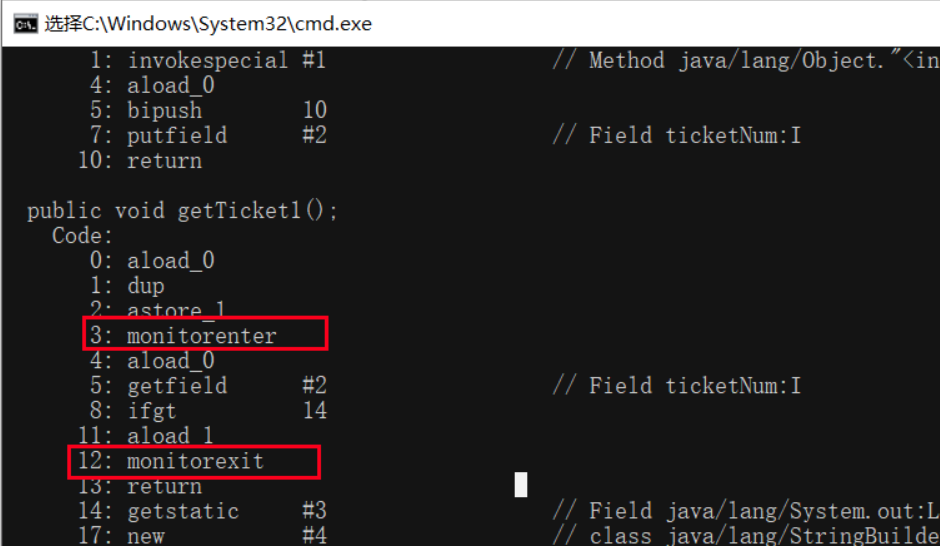

## 7.2 Lock锁

| 修饰符和类型 | 方法                                       | 描述                                                         |
| ------------ | ------------------------------------------ | ------------------------------------------------------------ |
| void         | lock（）                                   | 获得锁。                                                     |
| void         | lockInterruptibly()                        | 获得锁，可中断。举个例子，当两个线程同时通过lock.lockInterruptibly()想获取某个锁时，假若此时线程A获取到了锁，而线程B只有在等待，那么对线程B调用threadB.interrupt()方法能够中断线程B的等待过程。 |
| boolean      | tryLock()                                  | 锁在空闲的才能获取锁（未获得锁不会等待）。举个例子：当两个线程同时通过lock.trylock()想获取某个锁时，假若此时线程A获取到了锁，而线程B不会等待，直接放弃获取锁。 |
| boolean      | tryLock(long time, TimeUnit unit)	<br/> | 如果锁定可用，则此方法立即返回值true。<br/><br/>如果锁不可用，则当前线程将被禁用以进行线程调度，并且在发生以下三种情况之一之前处于休眠状态：<br/><br/>当前线程获取锁。<br/>其他一些线程中断当前线程。<br/>等待时间过去了，返回false |
| void         | unlock()                                   | 释放锁。  

**可重入锁ReentrantLock**

重入锁: 表示支持重新进入的锁，调用 lock 方 法获取了锁之后，再次调用 lock，是不会再阻塞，内部直接增加重入次数 就行了，标识这个线程已经重复获取一把锁而不需要等待锁的释放，比如递归调用

- #### lock锁用法

    ```java
    public class LockDemo {
        public static void main(String[] args) {
            Lock lock  = new ReentrantLock();
            try{
                lock.lock();
                //可能会出现线程安全的操作
            }finally{
                //尽量在finally中释放锁
                lock.unlock();
            }
        }
    }
    ```

  

- **API方法**

  - lock()用来获取锁
  - unlock()释放锁，最好在finally块中释放

  代码改进

  ```java
    public class TicketSeller {
        private static final ReentrantLock lock = new ReentrantLock(true);
        private static int tickets = 10;

        public static void main(String[] args) {
            ThreadPoolExecutor executor = new ThreadPoolExecutor(5, 5, 60, TimeUnit.DAYS,
                    new ArrayBlockingQueue<>(4), Executors.defaultThreadFactory(), new ThreadPoolExecutor.AbortPolicy());

            for (int i = 0; i < executor.getMaximumPoolSize(); i++) {
                executor.execute(() -> {
                    while (true) {
                        try {
                            lock.lock();
                            if (tickets > 0) {
                                System.out.println(Thread.currentThread().getName() + "卖出票：" + tickets--);
                            }else {
                                break;
                            }
                        } finally {
                            lock.unlock();
                        }
                    }
                });
            }
            executor.shutdown();
        }
    }
  ```

- Lock锁与Synchronized比较（面试题）

  1. 原始构成
     - Synchronized 是关键字，属于JVM层面，底层是通过 monitorenter 和 monitorexit 完成，依赖于 monitor 对象来完成。由于 wait/notify 方法也依赖于 monitor 对象，因此只有在同步块或方法中才能调用这些方法。
     - Lock 是 java.util.concurrent.locks.lock 包下的，是 api层面的锁。
  2. 使用方法
     - Synchronized 不需要用户手动释放锁，代码完成之后系统自动让线程释放锁
     - ReentrantLock 需要用户手动释放锁，没有手动释放可能导致死锁。
  3. 等待是否可以中断
     - Synchronized 不可中断，除非抛出异常或者正常运行完成
     - ReentrantLock 可以中断。一种是通过 `tryLock(long timeout, TimeUnit unit)`，另一种是`lockInterruptibly()`放代码块中，调用`interrupt()`方法进行中断。
  4. 加锁是否公平
     - synchronized 是非公平锁
     - ReentrantLock 默认非公平锁，可以在构造方法传入 boolean 值，true 代表公平锁，false 代表非公平锁。
  5. 锁绑定多个 Condition
     - Synchronized 只有一个阻塞队列，只能随机唤醒一个线程或者唤醒全部线程。
     - ReentrantLock 用来实现分组唤醒，可以精确唤醒。

  

## 7.3 其它锁

synchronized是重量级锁，效率不高。但在jdk 1.6中对synchronize的实现进行了各种优化，使得它显得不是那么重了。jdk1.6对锁的实现引入了大量的优化，如自旋锁、适应性自旋锁、锁消除、锁粗化、偏向锁、轻量级锁等技术来减少锁操作的开销。

锁主要存在四中状态，依次是：无锁状态、偏向锁状态、轻量级锁状态、重量级锁状态，他们会随着竞争的激烈而逐渐升级。

**注意：锁可以升级不可降级，这种策略是为了提高获得锁和释放锁的效率。**

### 7.3.1 自旋锁

线程的阻塞和唤醒需要CPU从用户态转为核心态，频繁的阻塞和唤醒对CPU来说是一件负担很重的工作，势必会给系统的并发性能带来很大的压力。同时我们发现在许多应用上面，对象锁的锁状态只会持续很短一段时间，为了这一段很短的时间频繁地阻塞和唤醒线程是非常不值得的。所以引入自旋锁。

**所谓自旋锁，就是让该线程等待一段时间，不会被立即挂起，看持有锁的线程是否会很快释放锁。怎么等待呢？执行一段无意义的循环即可（自旋）。**

自旋等待不能替代阻塞，虽然它可以避免线程切换带来的开销，但是它占用了处理器的时间。如果持有锁的线程很快就释放了锁，那么自旋的效率就非常好，反之，自旋的线程就会白白消耗掉处理的资源，它不会做任何有意义的工作，典型的占着茅坑不拉屎，这样反而会带来性能上的浪费。所以说，自旋等待的时间（自旋的次数）必须要有一个限度，如果自旋超过了定义的时间仍然没有获取到锁，则应该被挂起。

自旋锁在JDK 1.4.2中引入，默认关闭，但是可以使用-XX:+UseSpinning开开启，在JDK1.6中默认开启。同时自旋的默认次数为10次，可以通过参数-XX:PreBlockSpin来调整；

如果通过参数-XX:preBlockSpin来调整自旋锁的自旋次数，会带来诸多不便。假如我将参数调整为10，但是系统很多线程都是等你刚刚退出的时候就释放了锁（假如你多自旋一两次就可以获取锁），你是不是很尴尬。于是JDK1.6引入自适应的自旋锁，让虚拟机会变得越来越聪明。

### 7.3.2 适应自旋锁

JDK 1.6引入了更加聪明的自旋锁，即自适应自旋锁。所谓自适应就意味着自旋的次数不再是固定的，它是由前一次在同一个锁上的自旋时间及锁的拥有者的状态来决定。它怎么做呢？线程如果自旋成功了，那么下次自旋的次数会更加多，因为虚拟机认为既然上次成功了，那么此次自旋也很有可能会再次成功，那么它就会允许自旋等待持续的次数更多。反之，如果对于某个锁，很少有自旋能够成功的，那么在以后要或者这个锁的时候自旋的次数会减少甚至省略掉自旋过程，以免浪费处理器资源。

有了自适应自旋锁，随着程序运行和性能监控信息的不断完善，虚拟机对程序锁的状况预测会越来越准确，虚拟机会变得越来越聪明。

### 7.3.3 锁消除

为了保证数据的完整性，我们在进行操作时需要对这部分操作进行同步控制，但是在有些情况下，JVM检测到不可能存在共享数据竞争，这是JVM会对这些同步锁进行锁消除。锁消除的依据是逃逸分析的数据支持。

如果不存在竞争，为什么还需要加锁呢？所以锁消除可以节省毫无意义的请求锁的时间。变量是否逃逸，对于虚拟机来说需要使用数据流分析来确定，但是对于我们程序员来说这还不清楚么？我们会在明明知道不存在数据竞争的代码块前加上同步吗？但是有时候程序并不是我们所想的那样？我们虽然没有显示使用锁，但是我们在使用一些JDK的内置API时，如StringBuffer、Vector、HashTable等，这个时候会存在隐形的加锁操作。比如StringBuffer的append()方法，Vector的add()方法：

```java
public void test(){
    Vector<Integer> vector = new Vector<Integer>();
    for(int i = 0 ; i < 10 ; i++){
        vector.add(i);
    }
    System.out.println(vector);
}
```

在运行这段代码时，JVM可以明显检测到变量vector没有逃逸出方法vectorTest()之外，所以JVM可以大胆地将vector内部的加锁操作消除。

### 7.3.4 锁粗化

在使用同步锁的时候，需要让同步块的作用范围尽可能小，仅在共享数据的实际作用域中才进行同步，这样做的目的是为了使需要同步的操作量尽可能缩小，如果存在锁竞争，那么等待锁的线程也能尽快拿到锁。

在大多数的情况下，上述观点是正确的。但是如果一系列的连续加锁解锁操作，可能会导致不必要的性能损耗，所以引入锁粗化的概念。

锁粗话概念比较好理解，就是将多个连续的加锁、解锁操作连接在一起，扩展成一个范围更大的锁。如上面实例：vector每次add的时候都需要加锁操作，JVM检测到对同一个对象（vector）连续加锁、解锁操作，会合并一个更大范围的加锁、解锁操作，即加锁解锁操作会移到for循环之外。

### 7.3.5 偏向锁

轻量级锁的加锁解锁操作是需要依赖多次CAS原子指令的。而偏向锁只需要检查是否为偏向锁、锁标识为以及ThreadID即可，可以减少不必要的CAS操作。

### 7.3.6 轻量级锁

引入轻量级锁的主要目的是在没有多线程竞争的前提下，减少传统的重量级锁使用操作系统互斥量产生的性能消耗。当关闭偏向锁功能或者多个线程竞争偏向锁导致偏向锁升级为轻量级锁，则会尝试获取轻量级锁。轻量级锁主要使用CAS进行原子操作。

但是对于轻量级锁，其性能提升的依据是“对于绝大部分的锁，在整个生命周期内都是不会存在竞争的”，如果打破这个依据则除了互斥的开销外，还有额外的CAS操作，因此在有多线程竞争的情况下，轻量级锁比重量级锁更慢。


### 7.3.7 重量锁

重量级锁通过对象内部的监视器（monitor）实现，其中monitor的本质是依赖于底层操作系统的Mutex Lock（互斥锁）实现，操作系统实现线程之间的切换需要从用户态到内核态的切换，切换成本非常高。


# 8 J.U.C之CAS

J.U.C 即 java.util.concurrent，是 JSR 166 标准规范的一个实现； JSR 166 以及 J.U.C 包的作者是 Doug Lea 。

J.U.C 框架是 Java 5 中引入的，而我们最熟悉的线程池机制就在这个包，J.U.C 框架包含的内容有：

- AbstractQueuedSynchronizer（AQS框架），J.U.C 中实现锁和同步机制的基础；
- Locks & Condition（锁和条件变量），比 synchronized、wait、notify 更细粒度的锁机制；
- Executor 框架（线程池、Callable、Future），任务的执行和调度框架；
- Synchronizers（同步器），主要用于协助线程同步，有 CountDownLatch、CyclicBarrier、Semaphore、Exchanger；
- Atomic Variables（原子变量），方便程序员在多线程环境下，无锁的进行原子操作，核心操作是 CAS 原子操作，所谓的 CAS 操作，即 compare and swap，指的是将预期值与当前变量的值比较(compare)，如果相等则使用新值替换(swap)当前变量，否则不作操作；
- BlockingQueue（阻塞队列），阻塞队列提供了可阻塞的入队和出对操作，如果队列满了，入队操作将阻塞直到有空间可用，如果队列空了，出队操作将阻塞直到有元素可用；
- Concurrent Collections（并发容器），说到并发容器，不得不提同步容器。在 JDK1.5 之前，为了线程安全，我们一般都是使用同步容器，同步容器主要的缺点是：对所有容器状态的访问都串行化，严重降低了并发性；某些复合操作，仍然需要加锁来保护；迭代期间，若其它线程并发修改该容器，会抛出 ConcurrentModificationException 异常，即快速失败机制；
- Fork/Join 并行计算框架，这块内容是在 JDK1.7 中引入的，可以方便利用多核平台的计算能力，简化并行程序的编写，开发人员仅需关注如何划分任务和组合中间结果；
- TimeUnit 枚举，TimeUnit 是 java.util.concurrent 包下面的一个枚举类，TimeUnit 提供了可读性更好的线程暂停操作，以及方便的时间单位转换方法；

## 8.1 CAS介绍

CAS，Compare And Swap，即比较并交换。同步组件中大量使用CAS技术实现了Java多线程的并发操作。整个AQS同步组件、Atomic原子类操作等等都是以CAS实现的，甚至ConcurrentHashMap在1.8的版本中也调整为了CAS+Synchronized。可以说CAS是整个JUC的基石。

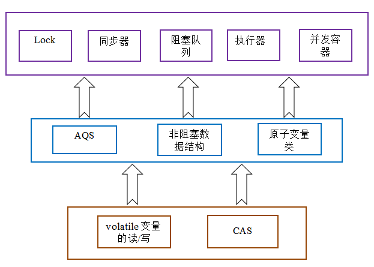


## 8.2 CAS原理剖析

再次测试之前Volatile的例子，把循环的次数调整为一亿（保证在一秒之内不能遍历完成，从而测试三种原子操作的性能），我们发现，AtomicInteger原子操作性能最高，他是用的就是CAS。

### 8.2.1 synchronized同步分析

注意，本小节是解释synchronized性能低效的原因，只要能理解synchronized同步过程其实还需要做很多事，这些逻辑的执行都需要占用资源，从而导致性能较低，是为了对比CAS的高效。这部分分析过于深入JMM底层原理，不适合初级甚至中级程序员学习。

我们之前讲过，synchronized的同步操作主要是monitorenter和monitorexit这两个jvm指令实现的，我们先写一段简单的代码：

```java
public class Demo2Synchronized {
    public void test2() {
        synchronized (this) {
        }
    }
}
```

在cmd命令行执行javac编译和javap -c Java 字节码的指令

```
javac Demo2Synchronized.java
javap -c Demo2Synchronized.class
```

从结果可以看出，同步代码块是使用monitorenter和monitorexit这两个jvm指令实现的：

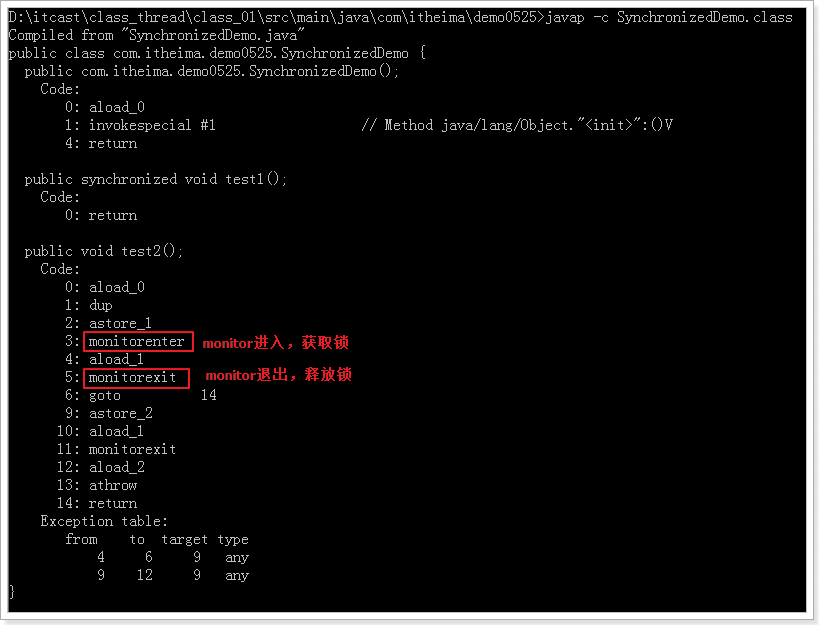

monitorenter和monitorexit这两个jvm指令实现锁的使用，主要是基于 Mark Word和、monitor。

  **Mark Word**

Hotspot虚拟机的对象头主要包括两部分数据：Mark Word（标记字段）、Klass Pointer（类型指针）。其中Klass Point是是对象指向它的类元数据的指针，虚拟机通过这个指针来确定这个对象是哪个类的实例，Mark Word用于存储对象自身的运行时数据，它是synchronized实现轻量级锁和偏向锁的关键。

Mark Word用于存储对象自身的运行时数据，如哈希码（HashCode）、GC分代年龄、锁状态标志、线程持有的锁、偏向线程 ID、偏向时间戳等等。Java对象头一般占有两个机器码（在32位虚拟机中，1个机器码等于4字节，也就是32bit），但是如果对象是数组类型，则需要三个机器码，因为JVM虚拟机可以通过Java对象的元数据信息确定Java对象的大小，但是无法从数组的元数据来确认数组的大小，所以用一块来记录数组长度。下图是Java对象头的存储结构（32位虚拟机）：


  	对象头信息是与对象自身定义的数据无关的额外存储成本，但是考虑到虚拟机的空间效率，Mark Word被设计成一个非固定的数据结构以便在极小的空间内存存储尽量多的数据，它会根据对象的状态复用自己的存储空间，也就是说，Mark Word会随着程序的运行发生变化，变化状态如下（32位虚拟机）：


* **monitor**

  什么是Monitor？我们可以把它理解为一个同步工具，也可以描述为一种同步机制，它通常被描述为一个对象。与一切皆对象一样，所有的Java对象是天生的Monitor，每一个Java对象都有成为Monitor的潜质，因为在Java的设计中 ，每一个Java对象都带了一把看不见的锁，它叫做内部锁或者Monitor锁。

    	Monitor 是线程私有的数据结构，每一个线程都有一个可用monitor record列表，同时还有一个全局的可用列表。每一个被锁住的对象都会和一个monitor关联（对象头的MarkWord中的LockWord指向monitor的起始地址），同时monitor中有一个Owner字段存放拥有该锁的线程的唯一标识，表示该锁被这个线程占用。其结构如下：

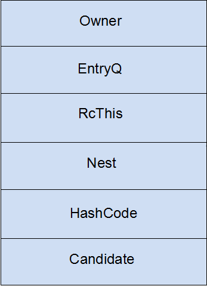

- **Owner**：初始时为NULL表示当前没有任何线程拥有该monitor record，当线程成功拥有该锁后保存线程唯一标识，当锁被释放时又设置为NULL；
- **EntryQ**:关联一个系统互斥锁（semaphore），阻塞所有试图锁住monitor record失败的线程。
- **RcThis**:表示blocked或waiting在该monitor record上的所有线程的个数。
- **Nest**:用来实现重入锁的计数。
- **HashCode**:保存从对象头拷贝过来的HashCode值（可能还包含GC age）。
- **Candidate**:用来避免不必要的阻塞或等待线程唤醒，因为每一次只有一个线程能够成功拥有锁，如果每次前一个释放锁的线程唤醒所有正在阻塞或等待的线程，会引起不必要的上下文切换（从阻塞到就绪然后因为竞争锁失败又被阻塞）从而导致性能严重下降。Candidate只有两种可能的值0表示没有需要唤醒的线程1表示要唤醒一个继任线程来竞争锁。

### 8.2.2 CAS原理

在上一部分，我们介绍了synchronized底层做了大量的工作，才实现同步，而同步保证了原子操作。但是不可避免的是性能较低。CAS是如何提高性能的呢？

**CAS的思想很简单：三个参数，一个当前内存值V、旧的预期值A、即将更新的值B，当且仅当旧的预期值A和内存值V相同时，将内存值修改为B并返回true，否则什么都不做，并返回false。如果CAS操作失败，通过自旋的方式等待并再次尝试，直到成功。**

CAS在  **先比较后修改**  这个CAS过程中，根本没有获取锁，释放锁的操作，是硬件层面的原子操作，跟JMM内存模型没有关系。大家可以理解为直接使用其他的语言，在JVM虚拟机之外直接操作计算机硬件，正因为如此，对比synchronized的同步，少了很多的逻辑步骤，使得性能大为提高。

JUC下的atomic类都是通过CAS来实现的，下面就是一个AtomicInteger原子操作类的例子，在其中使用了Unsafe unsafe = Unsafe.getUnsafe()。Unsafe 是CAS的核心类，它提供了硬件级别的原子操作。

```java
private static final Unsafe unsafe = Unsafe.getUnsafe();
private static final long valueOffset;

static {
    try {
        valueOffset = unsafe.objectFieldOffset
            (AtomicInteger.class.getDeclaredField("value"));
    } catch (Exception ex) { throw new Error(ex); }
}
//操作的值也进行了volatile修饰，保证内存可见性
private volatile int value;
```

继续查看AtomicInteger的addAndGet()方法：

```java
public final int addAndGet(int delta) {
    return unsafe.getAndAddInt(this, valueOffset, delta) + delta;
}

public final int getAndAddInt(Object var1, long var2, int var4) {
    int var5;
    do {
        var5 = this.getIntVolatile(var1, var2);
    } while(!this.compareAndSwapInt(var1, var2, var5, var5 + var4));

    return var5;
}
```

其内部调用unsafe的getAndAddInt方法，查看看compareAndSwapInt方法，该方法为native方法，有四个参数，分别代表：对象、对象的地址、预期值、修改值。：

```java
public final native boolean compareAndSwapInt(Object var1, long var2, int var4, int var5);
```

Unsafe 是一个比较危险的类，主要是用于执行低级别、不安全的方法集合。尽管这个类和所有的方法都是公开的（public），但是这个类的使用仍然受限，你无法在自己的java程序中直接使用该类，因为只有授信的代码才能获得该类的实例。可是为什么Unsafe的native方法就可以保证是原子操作呢？

### 8.2.3 多CPU的CAS处理

CAS可以保证一次的读-改-写操作是原子操作，在单处理器上该操作容易实现，但是在多处理器上实现就有点儿复杂了。CPU提供了两种方法来实现多处理器的原子操作：

总线加锁或者缓存加锁。

- **总线加锁**：总线加锁就是就是使用处理器提供的一个LOCK#信号，当一个处理器在总线上输出此信号时，其他处理器的请求将被阻塞住,那么该处理器可以独占使用共享内存。但是这种处理方式显得有点儿霸道，不厚道，他把CPU和内存之间的通信锁住了，在锁定期间，其他处理器都不能其他内存地址的数据，其开销有点儿大。
- **缓存加锁**：其实针对于上面那种情况我们只需要保证在同一时刻对某个内存地址的操作是原子性的即可。缓存加锁就是缓存在内存区域的数据如果在加锁期间，当它执行锁操作写回内存时，处理器不在输出LOCK#信号，而是修改内部的内存地址，利用缓存一致性协议来保证原子性。缓存一致性机制可以保证**同一个内存区域的数据仅能被一个处理器修改**，也就是说当CPU1修改缓存行中的i时使用缓存锁定，那么CPU2就不能同时缓存了i的缓存行。

### 8.2.4 CAS缺陷

	CAS虽然高效地解决了原子操作，但是还是存在一些缺陷的，主要表现在三个方法：循环时间太长、只能保证一个共享变量原子操作、ABA问题。

- **循环时间太长**

  如果CAS一直不成功呢？这种情况绝对有可能发生，如果自旋CAS长时间地不成功，则会给CPU带来非常大的开销。在JUC中有些地方就限制了CAS自旋的次数，例如BlockingQueue的SynchronousQueue。

- **只能保证一个共享变量原子操作**

  看了CAS的实现就知道这只能针对一个共享变量，如果是多个共享变量就只能使用锁了。

- **ABA问题**

  CAS需要检查操作值有没有发生改变，如果没有发生改变则更新。但是存在这样一种情况：如果一个值原来是A，变成了B，然后又变成了A，那么在CAS检查的时候会发现没有改变，但是实质上它已经发生了改变，这就是所谓的ABA问题。对于ABA问题其解决方案是加上版本号，即在每个变量都加上一个版本号，每次改变时加1，即A —> B —> A，变成1A —> 2B —> 3A。

  	CAS的ABA隐患问题，Java提供了AtomicStampedReference来解决。AtomicStampedReference通过包装[E,Integer]的元组来对对象标记版本戳stamp，从而避免ABA问题。对于上面的案例应该线程1会失败。

下面我们将通过一个例子可以可以看到AtomicStampedReference和AtomicInteger的区别。我们定义两个线程，线程1负责将100 —> 110 —> 100，线程2执行 100 —>120，看两者之间的区别。

```java
public class Demo4ABA {

    private static AtomicInteger ai = new AtomicInteger(100);
    private static AtomicStampedReference air = new AtomicStampedReference(100, 1);

    //ABA问题演示：
    //1. 线程1先对数据进行修改 A-B-A过程
    //2. 线程2也对数据进行修改 A-C的过程
    public static void main(String[] args) throws InterruptedException {

        // AtomicInteger可以看到不会有任何限制随便改
        // 线程2修改的时候也不可能知道要A-C 的时候，A是原来的A还是修改之后的A
        Thread at1 = new Thread(new Runnable() {
            public void run() {
                ai.compareAndSet(100, 110);
                ai.compareAndSet(110, 100);
            }
        });

        Thread at2 = new Thread(new Runnable() {
            public void run() {
                try {
                    //为了让线程1先执行完，等一会
                    TimeUnit.MILLISECONDS.sleep(100);
                } catch (InterruptedException e) {
                    e.printStackTrace();
                }
                System.out.println("AtomicInteger:" + ai.compareAndSet(100, 120));
                System.out.println("执行结果：" + ai.get());
            }
        });

        at1.start();
        at2.start();

        //顺序执行，AtomicInteger案例先执行
        at1.join();
        at2.join();

        //AtomicStampedReference可以看到每次修改都需要设置标识Stamp，相当于进行了1A-2B-3A的操作
        //线程2进行操作的时候，虽然数值都一样，但是可以根据标识很容易的知道A是以前的1A，还是现在的3A
        Thread tsf1 = new Thread(new Runnable() {
            public void run() {
                try {
                    TimeUnit.MILLISECONDS.sleep(100);
                } catch (InterruptedException e) {
                    e.printStackTrace();
                }
                // 预期引用：100，更新后的引用：110，预期标识getStamp() 更新后的标识getStamp() + 1
                air.compareAndSet(100, 110, air.getStamp(), air.getStamp() + 1);
                air.compareAndSet(110, 100, air.getStamp(), air.getStamp() + 1);
            }
        });

        Thread tsf2 = new Thread(new Runnable() {
            public void run() {

                //tsf2先获取stamp，导致预期时间戳不一致
                int stamp = air.getStamp();

                try {
                    TimeUnit.MILLISECONDS.sleep(100);     //线程tsf1执行完
                } catch (InterruptedException e) {
                    e.printStackTrace();
                }
                System.out.println("AtomicStampedReference:" + air.compareAndSet(100, 120, stamp, stamp + 1));
                int[] stampArr = {stamp + 1};
                System.out.println("执行结果：" + air.get(stampArr));
            }
        });

        tsf1.start();
        tsf2.start();
    }
}
```

运行结果充分展示了AtomicInteger的ABA问题和AtomicStampedReference解决ABA问题。

## 8.3 native关键词

前面提到了sun.misc.Unsafe这个类，里面的方法使用native关键词声明本地方法，为什么要用native？

Java无法直接访问底层操作系统，但有能力调用其他语言编写的函数or方法，是通过JNI(Java Native Interfface)实现。使用时，通过native关键字告诉JVM这个方法是在外部定义的。但JVM也不知道去哪找这个原生方法，此时需要通过javah命令生成.h文件。

示例步骤(c语言为例)：

1. javac生成.class文件，比如javac NativePeer.java

2. javah生成.h文件，比如javah NativePeer

3. 编写c语言文件，在其中include进上一步生成的.h文件，然后实现其中声明而未实现的函数

4. 生成dll共享库，然后Java程序load库，调用即可

   native可以和任何除abstract外的关键字连用，这也说明了这些方法是有实体的，并且能够和其他Java方法一样，拥有各种Java的特性。

   	native方法有效地扩充了jvm，实际上我们所用的很多代码已经涉及到这种方法了，通过非常简洁的接口帮我们实现Java以外的工作。

native优势：

1. 很多层次上用Java去实现是很麻烦的，而且Java解释执行的效率也差了c语言啥的很多，纯Java实现可能会导致效率不达标，或者可读性奇差。
2. Java毕竟不是一个完整的系统，它经常需要一些底层的支持，通过JNI和native method我们就可以实现jre与底层的交互，得到强大的底层操作系统的支持，使用一些Java本身没有封装的操作系统的特性。

# 9 J.U.C之Atomic包

## 9.1 Atomic包介绍

通过前面CAS的学习，我们了解到AtomicInteger的工作原理，它们的内部都维护者一个对应的基本类型的成员变量value，这个变量是被volatile关键字修饰的，保证多线程环境下看见的是同一个（可见性）。

AtomicInteger在进行一些原子操作的时候，依赖Unsafe类里面的CAS方法，原子操作就是通过自旋方式，不断地使用CAS函数进行尝试直到达到自己的目的。

除了AtomicInteger类以外还有很多其他的类也有类似的功能，在JUC中有一个包java.util.concurrent.atomic存放原子操作的类，atomic里的类主要包括：

- 基本类型
  使用原子的方式更新基本类型

  > AtomicInteger：整形原子类
  >
  > AtomicLong：长整型原子类
>
  > AtomicBoolean ：布尔型原子类

- 引用类型

  > AtomicReference：引用类型原子类
  >
  > AtomicStampedReference：原子更新引用类型里的字段原子类
  > AtomicMarkableReference ：原子更新带有标记位的引用类型

- 数组类型
  使用原子的方式更新数组里的某个元素

  > AtomicIntegerArray：整形数组原子类
  >
  > AtomicLongArray：长整形数组原子类
  >
  > AtomicReferenceArray ：引用类型数组原子类


- 对象的属性修改类型

  > AtomicIntegerFieldUpdater:原子更新整形字段的更新器
  > AtomicLongFieldUpdater：原子更新长整形字段的更新器
  > AtomicReferenceFieldUpdater ：原子更新引用类形字段的更新器

- JDK1.8新增类

  > DoubleAdder：双浮点型原子类
  >
  > LongAdder：长整型原子类
  >
  > DoubleAccumulator：类似DoubleAdder，但要更加灵活(要传入一个函数式接口)
  > LongAccumulator：类似LongAdder，但要更加灵活(要传入一个函数式接口)

		虽然涉及到的类很多，但是原理和AtomicInteger都是一样，使用CAS进行的原子操作，其方法和使用都是大同小异的。

## 9.2 基本类型

使用原子的方式更新基本类型

> AtomicInteger：整形原子类
>
> AtomicLong：长整型原子类
>
> AtomicBoolean ：布尔型原子类


**AtomicInteger主要API如下：**

```java
get()				//直接返回值
getAndAdd(int)		//增加指定的数据，返回变化前的数据
getAndDecrement()	//减少1，返回减少前的数据
getAndIncrement()	//增加1，返回增加前的数据
getAndSet(int)		//设置指定的数据，返回设置前的数据

addAndGet(int)		//增加指定的数据后返回增加后的数据
decrementAndGet()	//减少1，返回减少后的值
incrementAndGet()	//增加1，返回增加后的值
lazySet(int)		//仅仅当get时才会set

compareAndSet(int, int)//尝试新增后对比，若增加成功则返回true否则返回false
```

**AtomicLong主要API和AtomicInteger，只是类型不是int，而是long**


**AtomicBoolean主要API如下：**

```java
compareAndSet(boolean, boolean) //参数1为原始值，参数2为修改的新值，若修改成功返回true，否则返回false
getAndSet(boolean)// 尝试设置新的boolean值，直到成功为止，返回设置前的数据
```


## 9.3 引用类型

> AtomicReference：引用类型原子类
> AtomicStampedRefrence：原子更新引用类型里的字段原子类
> AtomicMarkableReference ：原子更新带有标记位的引用类型

	AtomicReference引用类型和基本类型的作用基本一样，例子如下：

```java
public class Demo5AtomicReference {

    public static void main(String[] args) throws InterruptedException {
        User u1 = new User("张三", 22);
        User u2 = new User("李四", 33);

        AtomicReference ar = new AtomicReference(u1);
        ar.compareAndSet(u1, u2);

        System.out.println(ar.get());

    }

    static class User {
        private String name;
        public volatile int age;

        public User(String name, int age) {
            super();
            this.name = name;
            this.age = age;
        }

        public String getName() {
            return name;
        }

        public void setName(String name) {
            this.name = name;
        }

        public int getAge() {
            return age;
        }

        public void setAge(int age) {
            this.age = age;
        }

        @Override
        public String toString() {
            return "User{" +
                    "name='" + name + '\'' +
                    ", age=" + age +
                    '}';
        }
    }
}
```


	AtomicStampedReference其实它仅仅是在AtomicReference类的再一次包装，里面增加了一层引用和计数器，其实是否为计数器完全由自己控制，大多数我们是让他自增的，你也可以按照自己的方式来标示版本号。案例参考前面的ABA例子


	AtomicMarkableReference和AtomicStampedReference功能差不多，区别的是：它描述更加简单的是与否的关系。通常ABA问题只有两种状态，而AtomicStampedReference是多种状态。

```java
public class Demo6AtomicMrkableReference {

    public static void main(String[] args) throws InterruptedException {
        User u1 = new User("张三", 22);
        User u2 = new User("李四", 33);

        //和AtomicStampedReference效果一样，用于解决ABA的
        //区别是表示不是用的版本号，而只有true和false两种状态。相当于未修改和已修改
        AtomicMarkableReference<User> amr = new AtomicMarkableReference(u1, true);
        amr.compareAndSet(u1, u2, false, true);

        System.out.println(amr.getReference());

    }

    static class User {
        private String name;
        public volatile int age;

        public User(String name, int age) {
            super();
            this.name = name;
            this.age = age;
        }

        public String getName() {
            return name;
        }

        public void setName(String name) {
            this.name = name;
        }

        public int getAge() {
            return age;
        }

        public void setAge(int age) {
            this.age = age;
        }

        @Override
        public String toString() {
            return "User{" +
                    "name='" + name + '\'' +
                    ", age=" + age +
                    '}';
        }
    }
}
```


## 9.5 数组类型

使用原子的方式更新数组里的某个元素

> AtomicIntegerArray：整形数组原子类
> AtomicLongArray：长整形数组原子类
> AtomicReferenceArray ：引用类型数组原子类

**AtomicIntegerArray主要API如下：**

```java
addAndGet(int, int)//执行加法，第一个参数为数组的下标，第二个参数为增加的数量，返回增加后的结果
compareAndSet(int, int, int)// 对比修改，参1数组下标，参2原始值，参3修改目标值，成功返回true否则false
decrementAndGet(int)// 参数为数组下标，将数组对应数字减少1，返回减少后的数据
incrementAndGet(int)// 参数为数组下标，将数组对应数字增加1，返回增加后的数据

getAndAdd(int, int)// 和addAndGet类似，区别是返回值是变化前的数据
getAndDecrement(int)// 和decrementAndGet类似，区别是返回变化前的数据
getAndIncrement(int)// 和incrementAndGet类似，区别是返回变化前的数据
getAndSet(int, int)// 将对应下标的数字设置为指定值，第二个参数为设置的值，返回是变化前的数据
```

**AtomicIntegerArray主要API和AtomicLongArray，只是类型不是int，而是long**

AtomicIntegerArray案例：

```java
public class Demo7AtomicIntegerArray {

    public static void main(String[] args) throws InterruptedException {
        int[] arr = {1, 2, 3, 4, 5};
        AtomicIntegerArray aia = new AtomicIntegerArray(arr);

        aia.compareAndSet(1, 2, 200);

        System.out.println(aia.toString());
    }
}
```


**AtomicReferenceArray 主要API：**

```java
//参数1：数组下标；
//参数2：修改原始值对比；
//参数3：修改目标值 
//修改成功返回true，否则返回false
compareAndSet(int, Object, Object) 

//参数1：数组下标
//参数2：修改的目标
//修改成功为止，返回修改前的数据
getAndSet(int, Object) 

```

AtomicReferenceArray 案例：

```java
public class Demo8AtomicReferenceArray {

    public static void main(String[] args) throws InterruptedException {
        User u1 = new User("张三", 22);
        User u2 = new User("李四", 33);
        User[] arr = {u1, u2};

        AtomicReferenceArray<User> ara = new AtomicReferenceArray<User>(arr);
        System.out.println(ara.toString());

        User u3 = new User("王五", 44);
        ara.compareAndSet(0, u1, u3);
        System.out.println(ara.toString());
    }

    static class User {
        private String name;
        public volatile int age;

        public User(String name, int age) {
            super();
            this.name = name;
            this.age = age;
        }

        public String getName() {
            return name;
        }

        public void setName(String name) {
            this.name = name;
        }

        public int getAge() {
            return age;
        }

        public void setAge(int age) {
            this.age = age;
        }

        @Override
        public String toString() {
            return "User{" +
                    "name='" + name + '\'' +
                    ", age=" + age +
                    '}';
        }
    }
}
```


## 9.6 对象的属性修改类型

如果需要原子更新某个类里的某个字段时，需要用到对象的属性修改类型原子类。

> AtomicIntegerFieldUpdater:原子更新整形字段的更新器
> AtomicLongFieldUpdater：原子更新长整形字段的更新器
> AtomicReferenceFieldUpdater ：原子更新引用类形字段的更新器

但是他们的使用通常有以下几个限制：

- 限制1：操作的目标不能是static类型，前面说到的unsafe提取的是非static类型的属性偏移量，如果是static类型在获取时如果没有使用对应的方法是会报错的，而这个Updater并没有使用对应的方法。
- 限制2：操作的目标不能是final类型的，因为final根本没法修改。
- 限制3：必须是volatile类型的数据，也就是数据本身是读一致的。
- 限制4：属性必须对当前的Updater所在的区域是可见的，也就是private如果不是当前类肯定是不可见的，protected如果不存在父子关系也是不可见的，default如果不是在同一个package下也是不可见的。

实现方式：通过反射找到属性，对属性进行操作。

例子：

```java
public class AtomicIntegerFieldUpdaterTest {
    public static void main(String[] args) {
        AtomicIntegerFieldUpdater<User> a = AtomicIntegerFieldUpdater.newUpdater(User.class, "age");

        User user = new User("Java", 22);
        System.out.println(a.get(user));
        System.out.println(a.getAndAdd(user,10));
        System.out.println(a.get(user));
    }
}

class User {
    private String name;
    public volatile int age;

    public User(String name, int age) {
        super();
        this.name = name;
        this.age = age;
    }

    public String getName() {
        return name;
    }

    public void setName(String name) {
        this.name = name;
    }

    public int getAge() {
        return age;
    }

    public void setAge(int age) {
        this.age = age;
    }

}
```


## 9.7 JDK1.8新增类

> LongAdder：长整型原子类
> DoubleAdder：双浮点型原子类
> LongAccumulator：类似LongAdder，但要更加灵活(要传入一个函数式接口)
> DoubleAccumulator：类似DoubleAdder，但要更加灵活(要传入一个函数式接口)

	LongAdder是jdk1.8提供的累加器，基于Striped64实现，所提供的API基本上可以替换原先的AtomicLong。
	
	LongAdder类似于AtomicLong是原子性递增或者递减类，AtomicLong已经通过CAS提供了非阻塞的原子性操作，相比使用阻塞算法的同步器来说性能已经很好了，但是JDK开发组并不满足，因为在非常高的并发请求下AtomicLong的性能不能让他们接受，虽然AtomicLong使用CAS但是CAS失败后还是通过无限循环的自旋锁不断尝试。

```java
public final long incrementAndGet() {
    for (;;) {
        long current = get();
        long next = current + 1;
        if (compareAndSet(current, next))
            return next;
    }
}
```


	在高并发下N多线程同时去操作一个变量会造成大量线程CAS失败然后处于自旋状态，这大大浪费了cpu资源，降低了并发性。那么既然AtomicLong性能由于过多线程同时去竞争一个变量的更新而降低的，那么如果把一个变量分解为多个变量，让同样多的线程去竞争多个资源那么性能问题不就解决了？是的，JDK8提供的LongAdder就是这个思路。下面通过图形来标示两者不同。


AtomicLong和LongAdder对比：


	一段LongAdder和Atomic的对比测试代码：

```java
public class Demo9Compare {

    public static void main(String[] args) {
        AtomicLong atomicLong = new AtomicLong(0L);
        LongAdder longAdder = new LongAdder();

        long start = System.currentTimeMillis();
        for (int i = 0; i < 50; i++) {
            new Thread(new Runnable() {
                @Override
                public void run() {
                    for (int j = 0; j < 1000000; j++) {
                        //atomicLong.incrementAndGet();
                        longAdder.increment();
                    }
                }
            }).start();
        }

        while (Thread.activeCount() > 2) {
        }

        System.out.println(atomicLong.get());
        System.out.println(longAdder.longValue());

        System.out.println("耗时：" + (System.currentTimeMillis() - start));

    }
}
```


不同计算机因为CPU、内存等硬件不一样，所以测试的数值也不一样，但是得到的结论都是一样的

测试结果：


从上结果图可以看出，在并发比较低的时候，LongAdder和AtomicLong的效果非常接近。但是当并发较高时，两者的差距会越来越大。上图中在线程数为1000，每个线程循环数为100000时，LongAdder的效率是AtomicLong的6倍左右。


# 10 J.U.C之AQS

## 10.1 AQS简介

	AQS(AbstractQueuedSynchronizer），即队列同步器。它是构建锁或者其他同步组件的基础框架（如ReentrantLock、ReentrantReadWriteLock、Semaphore等），JUC并发包的作者（Doug Lea）期望它能够成为实现大部分同步需求的基础。它是JUC并发包中的核心基础组件。
	
	在这里我们只是对AQS进行了解，它只是一个抽象类，但是JUC中的很多组件都是基于这个抽象类，也可以说这个AQS是多数JUC组件的基础。

### 10.1.1 AQS的作用

	Java的内置锁一直都是备受争议的，在JDK 1.6之前，synchronized这个重量级锁其性能一直都是较为低下，虽然在1.6后，进行大量的锁优化策略，但是与Lock相比synchronized还是存在一些缺陷的：它缺少了获取锁与释放锁的可操作性，可中断、超时获取锁，而且独占式在高并发场景下性能大打折扣。
	
	AQS解决了实现同步器时涉及到的大量细节问题，例如获取同步状态、FIFO同步队列。基于AQS来构建同步器可以带来很多好处。它不仅能够极大地减少实现工作，而且也不必处理在多个位置上发生的竞争问题。

### 10.1.2 state状态

	AQS维护了一个volatile int类型的变量state表示当前同步状态。当state>0时表示已经获取了锁，当state = 0时表示释放了锁。

它提供了三个方法来对同步状态state进行操作：

> getState()：返回同步状态的当前值
> setState()：设置当前同步状态
> compareAndSetState()：使用CAS设置当前状态，该方法能够保证状态设置的原子性

这三种操作均是CAS原子操作，其中compareAndSetState的实现依赖于Unsafe的compareAndSwapInt()方法


### 10.1.3 资源共享方式

	AQS定义两种资源共享方式：

* Exclusive（独占，只有一个线程能执行，如ReentrantLock）
* Share（共享，多个线程可同时执行，如Semaphore/CountDownLatch）

		不同的自定义同步器争用共享资源的方式也不同。自定义同步器在实现时只需要实现共享资源state的获取与释放方式即可，至于具体线程等待队列的维护（如获取资源失败入队/唤醒出队等），AQS已经在顶层实现好了。自定义同步器实现时主要实现以下几种方法：

> - isHeldExclusively()：当前同步器是否在独占式模式下被线程占用，一般该方法表示是否被当前线程所独占。只有用到condition才需要去实现它。
> - tryAcquire(int)：独占方式。尝试获取同步状态，成功则返回true，失败则返回false。其他线程需要等待该线程释放同步状态才能获取同步状态。
> - tryRelease(int)：独占方式。尝试释放同步状态，成功则返回true，失败则返回false。
> - tryAcquireShared(int)：共享方式。尝试获取同步状态。负数表示失败；0表示成功，但没有剩余可用资源；正数表示成功，且有剩余资源。
> - tryReleaseShared(int)：共享方式。尝试释放同步状态，如果释放后允许唤醒后续等待结点，返回true，否则返回false。


## 10.2 CLH同步队列

	AQS内部维护着一个FIFO队列，该队列就是CLH同步队列，遵循FIFO原则（ First Input First Output先进先出）。CLH同步队列是一个FIFO双向队列，AQS依赖它来完成同步状态的管理。

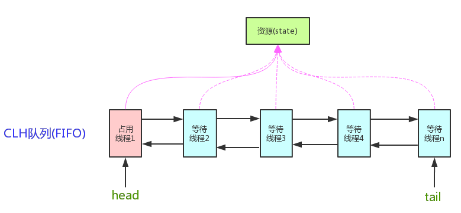

	当前线程如果获取同步状态失败时，AQS则会将当前线程已经等待状态等信息构造成一个节点（Node）并将其加入到CLH同步队列，同时会阻塞当前线程，当同步状态释放时，会把首节点唤醒（公平锁），使其再次尝试获取同步状态。


### 10.2.3 入列

	CLH队列入列非常简单，就是tail指向新节点、新节点的prev指向当前最后的节点，当前最后一个节点的next指向当前节点。

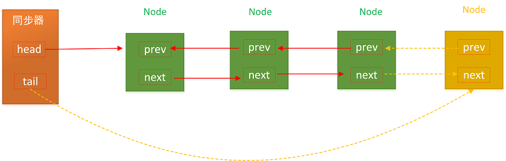


代码我们可以看看addWaiter(Node node)方法：

```java
private Node addWaiter(Node mode) {
    //新建Node
    Node node = new Node(Thread.currentThread(), mode);
    //快速尝试添加尾节点
    Node pred = tail;
    if (pred != null) {
        node.prev = pred;
        //CAS设置尾节点
        if (compareAndSetTail(pred, node)) {
            pred.next = node;
            return node;
        }
    }
    //多次尝试
    enq(node);
    return node;
}
```

	在上面代码中，两个方法都是通过一个CAS方法compareAndSetTail(Node expect, Node update)来设置尾节点，该方法可以确保节点是线程安全添加的。在enq(Node node)方法中，AQS通过“死循环”的方式来保证节点可以正确添加，只有成功添加后，当前线程才会从该方法返回，否则会一直执行下去。

### 10.2.4 出列

	CLH同步队列遵循FIFO，首节点的线程释放同步状态后，将会唤醒它的后继节点（next），而后继节点将会在获取同步状态成功时将自己设置为首节点。head执行该节点并断开原首节点的next和当前节点的prev即可，注意在这个过程是不需要使用CAS来保证的，因为只有一个线程能够成功获取到同步状态。过程图如下：

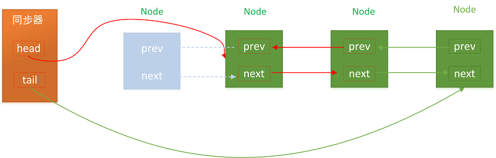


# 11 J.U.C之锁

## 11.1 锁的基本概念

虽然在前面锁优化的部分已经提到过一些锁的概念，但不完全，这里是对锁的概念补充。

### 11.1.1 互斥锁

	在编程中，引入了对象互斥锁的概念，来保证共享数据操作的完整性。每个对象都对应于一个可称为" 互斥锁" 的标记，这个标记用来保证在任一时刻，只能有一个线程访问该对象。


### 11.1.2 阻塞锁

	阻塞锁，可以说是让线程进入阻塞状态进行等待，当获得相应的信号（唤醒，时间） 时，才可以进入线程的准备就绪状态，准备就绪状态的所有线程，通过竞争，进入运行状态。


### 11.1.3 自旋锁

自旋锁是采用让当前线程不停地的在循环体内执行实现的，当循环的条件被其他线程改变时，才能进入临界区。

	由于自旋锁只是将当前线程不停地执行循环体，不进行线程状态的改变，所以响应速度更快。但当线程数不停增加时，性能下降明显，因为每个线程都需要执行，占用CPU时间。如果线程竞争不激烈，并且保持锁的时间段。适合使用自旋锁。


### 11.1.4 读写锁 

	读写锁实际是一种特殊的自旋锁，它把对共享资源的访问者划分成读者和写者，读者只对共享资源进行读访问，写者则需要对共享资源进行写操作。
	
	读写锁相对于自旋锁而言，能提高并发性，因为在多处理器系统中，它允许同时有多个读者来访问共享资源，最大可能的读者数为实际的逻辑CPU数。写者是排他性的，一个读写锁同时只能有一个写者或多个读者（与CPU数相关），但不能同时既有读者又有写者。


### 11.1.5 公平锁

公平锁（Fair）：加锁前检查是否有排队等待的线程，优先排队等待的线程，先来先得 

非公平锁（Nonfair）：加锁时不考虑排队等待问题，直接尝试获取锁，获取不到自动到队尾等待

非公平锁性能比公平锁高，因为公平锁需要在多核的情况下维护一个队列。

## 11.2 ReentrantLock可重入锁

	ReentrantLock，可重入锁，是一种递归无阻塞的同步机制。它可以等同于synchronized的使用，但是ReentrantLock提供了比synchronized更强大、灵活的锁机制，可以减少死锁发生的概率。
	
	ReentrantLock还提供了公平锁和非公平锁的选择，构造方法接受一个可选的公平参数（默认非公平锁），当设置为true时，表示公平锁，否则为非公平锁。公平锁的效率往往没有非公平锁的效率高，在许多线程访问的情况下，公平锁表现出较低的吞吐量。

查看ReentrantLock源码中的构造方法：

```java
public ReentrantLock() {
    //非公平锁
    sync = new NonfairSync();
}

public ReentrantLock(boolean fair) {
    //公平锁
    sync = fair ? new FairSync() : new NonfairSync();
}
```

	Sync为ReentrantLock里面的一个内部类，它继承AQS（AbstractQueuedSynchronizer），它有两个子类：公平锁FairSync和非公平锁NonfairSync。


### 11.2.1 获取锁

一般都是这么使用ReentrantLock获取锁的：（默认非公平锁）

```java
//非公平锁
ReentrantLock lock = new ReentrantLock();
lock.lock();
```


lock方法：

```java
public void lock() {
    sync.lock();
}
```


加锁最终可以看到会调用方法：

```java
public final void acquire(int arg) {
    if (!tryAcquire(arg) &&
        acquireQueued(addWaiter(Node.EXCLUSIVE), arg))
        selfInterrupt();
}
```

其实底层就是使用AQS同步队列。


### 11.2.2 释放锁

获取同步锁后，使用完毕则需要释放锁，ReentrantLock提供了unlock释放锁：

```java
public void unlock() {
    sync.release(1);
}
```

unlock内部使用Sync的release()释放锁，release()是在AQS中定义的：

```java
public final boolean release(int arg) {
    if (tryRelease(arg)) {
        Node h = head;
        if (h != null && h.waitStatus != 0)
            unparkSuccessor(h);
        return true;
    }
    return false;
}
```


释放同步状态的tryRelease()是同步组件自己实现：

```java
protected final boolean tryRelease(int releases) {
    //减掉releases
    int c = getState() - releases;
    //如果释放的不是持有锁的线程，抛出异常
    if (Thread.currentThread() != getExclusiveOwnerThread())
        throw new IllegalMonitorStateException();
    boolean free = false;
    //state == 0 表示已经释放完全了，其他线程可以获取同步状态了
    if (c == 0) {
        free = true;
        setExclusiveOwnerThread(null);
    }
    setState(c);
    return free;
}
```

	只有当同步状态彻底释放后该方法才会返回true。当同步队列的状态state == 0 时，则将锁持有线程设置为null，free= true，表示释放成功。


### 11.2.3 公平锁与非公平锁原理

	公平锁与非公平锁的区别在于获取锁的时候是否按照FIFO的顺序来。释放锁不存在公平性和非公平性，比较非公平锁和公平锁获取同步状态的过程，会发现两者唯一的区别就在于公平锁在获取同步状态时多了一个限制条件：hasQueuedPredecessors()，定义如下：

```java
public final boolean hasQueuedPredecessors() {
    Node t = tail;  //尾节点
    Node h = head;  //头节点
    Node s;

    //头节点 != 尾节点
    //同步队列第一个节点不为null
    //当前线程是同步队列第一个节点
    return h != t &&
        ((s = h.next) == null || s.thread != Thread.currentThread());
}
```

	该方法主要做一件事情：主要是判断当前线程是否位于CLH同步队列中的第一个。如果是则返回true，否则返回false。

### 11.2.4 ReentrantLock与synchronized的区别

	前面提到ReentrantLock提供了比synchronized更加灵活和强大的锁机制，那么它的灵活和强大之处在哪里呢？他们之间又有什么相异之处呢？

1. 与synchronized相比，ReentrantLock提供了更多，更加全面的功能，具备更强的扩展性。例如：时间锁等候，可中断锁等候，锁投票。
2. ReentrantLock还提供了条件Condition，对线程的等待、唤醒操作更加详细和灵活，所以在多个条件变量和高度竞争锁的地方，ReentrantLock更加适合（以后会阐述Condition）。
3. ReentrantLock提供了可轮询的锁请求。它会尝试着去获取锁，如果成功则继续，否则可以等到下次运行时处理，而synchronized则一旦进入锁请求要么成功要么阻塞，所以相比synchronized而言，ReentrantLock会不容易产生死锁些。
4. ReentrantLock支持更加灵活的同步代码块，但是使用synchronized时，只能在同一个synchronized块结构中获取和释放。注：ReentrantLock的锁释放一定要在finally中处理，否则可能会产生严重的后果。
5. ReentrantLock支持中断处理，且性能较synchronized会好些。


## 11.3 读写锁ReentrantReadWriteLock

	可重入锁ReentrantLock是互斥锁，互斥锁在同一时刻仅有一个线程可以进行访问，但是在大多数场景下，大部分时间都是提供读服务，而写服务占有的时间较少。然而读服务不存在数据竞争问题，如果一个线程在读时禁止其他线程读势必会导致性能降低。所以就提供了读写锁。
	
	读写锁维护着一对锁，一个读锁和一个写锁。通过分离读锁和写锁，使得并发性比一般的互斥锁有了较大的提升：在同一时间可以允许多个读线程同时访问，但是在写线程访问时，所有读线程和写线程都会被阻塞。

读写锁的主要特性：

1. 公平性：支持公平性和非公平性。
2. 重入性：支持重入。读写锁最多支持65535个递归写入锁和65535个递归读取锁。
3. 锁降级：写锁能够降级成为读锁，遵循获取写锁、获取读锁在释放写锁的次序。读锁不能升级为写锁。


	读写锁ReentrantReadWriteLock实现接口ReadWriteLock，该接口维护了一对相关的锁，一个用于只读操作，另一个用于写入操作。只要没有 writer，读取锁可以由多个 reader 线程同时保持。写入锁是独占的。

```java
public interface ReadWriteLock {
    Lock readLock();
    Lock writeLock();
}
```

ReadWriteLock定义了两个方法。readLock()返回用于读操作的锁，writeLock()返回用于写操作的锁。ReentrantReadWriteLock定义如下：

```java
/** 内部类  读锁 */
private final ReentrantReadWriteLock.ReadLock readerLock;
/** 内部类  写锁 */
private final ReentrantReadWriteLock.WriteLock writerLock;

final Sync sync;

/** 使用默认（非公平）的排序属性创建一个新的 ReentrantReadWriteLock */
public ReentrantReadWriteLock() {
    this(false);
}

/** 使用给定的公平策略创建一个新的 ReentrantReadWriteLock */
public ReentrantReadWriteLock(boolean fair) {
    sync = fair ? new FairSync() : new NonfairSync();
    readerLock = new ReadLock(this);
    writerLock = new WriteLock(this);
}

/** 返回用于写入操作的锁 */
public ReentrantReadWriteLock.WriteLock writeLock() { return writerLock; }
/** 返回用于读取操作的锁 */
public ReentrantReadWriteLock.ReadLock  readLock()  { return readerLock; }

abstract static class Sync extends AbstractQueuedSynchronizer {
    //省略其余源代码
}
public static class WriteLock implements Lock, java.io.Serializable{
    //省略其余源代码
}

public static class ReadLock implements Lock, java.io.Serializable {
    //省略其余源代码
}
```


	ReentrantReadWriteLock与ReentrantLock一样，其锁主体依然是Sync，它的读锁、写锁都是依靠Sync来实现的。所以ReentrantReadWriteLock实际上只有一个锁，只是在获取读取锁和写入锁的方式上不一样而已，它的读写锁其实就是两个类：ReadLock、writeLock，这两个类都是lock实现。


	在ReentrantLock中使用一个int类型的state来表示同步状态，该值表示锁被一个线程重复获取的次数。但是读写锁ReentrantReadWriteLock内部维护着一对锁，需要用一个变量维护多种状态。所以读写锁采用“按位切割使用”的方式来维护这个变量，将其切分为两部分，高16为表示读，低16为表示写。分割之后，读写锁是如何迅速确定读锁和写锁的状态呢？通过位运算。假如当前同步状态为S，那么写状态等于 S & 0x0000FFFF（将高16位全部抹去），读状态等于S >>> 16(无符号补0右移16位)。代码如下：

```java
static final int SHARED_SHIFT   = 16;
static final int SHARED_UNIT    = (1 << SHARED_SHIFT);
static final int MAX_COUNT      = (1 << SHARED_SHIFT) - 1;
static final int EXCLUSIVE_MASK = (1 << SHARED_SHIFT) - 1;

static int sharedCount(int c)    { return c >>> SHARED_SHIFT; }
static int exclusiveCount(int c) { return c & EXCLUSIVE_MASK; }
```


### 11.3.1 写锁的获取

写锁就是一个支持可重入的互斥锁。

写锁的获取最终会调用tryAcquire(int arg)，该方法在内部类Sync中实现：

```java
    protected final boolean tryAcquire(int acquires) {
        Thread current = Thread.currentThread();
        //当前锁个数
        int c = getState();
        //写锁
        int w = exclusiveCount(c);
        if (c != 0) {
            //c != 0 && w == 0 表示存在读锁
            //当前线程不是已经获取写锁的线程
            if (w == 0 || current != getExclusiveOwnerThread())
                return false;
            //超出最大范围
            if (w + exclusiveCount(acquires) > MAX_COUNT)
                throw new Error("Maximum lock count exceeded");
            setState(c + acquires);
            return true;
        }
        //是否需要阻塞
        if (writerShouldBlock() ||
                !compareAndSetState(c, c + acquires))
            return false;
        //设置获取锁的线程为当前线程
        setExclusiveOwnerThread(current);
        return true;
    }
```

	该方法和ReentrantLock的tryAcquire(int arg)大致一样，在判断重入时增加了一项条件：读锁是否存在。因为要确保写锁的操作对读锁是可见的，如果在存在读锁的情况下允许获取写锁，那么那些已经获取读锁的其他线程可能就无法感知当前写线程的操作。因此只有等读锁完全释放后，写锁才能够被当前线程所获取，一旦写锁开始获取了，所有其他读、写线程均会被阻塞。


### 11.3.2 写锁的释放

获取了写锁用完了则需要释放，WriteLock提供了unlock()方法释放写锁：

```java
    public void unlock() {
        sync.release(1);
    }

    public final boolean release(int arg) {
        if (tryRelease(arg)) {
            Node h = head;
            if (h != null && h.waitStatus != 0)
                unparkSuccessor(h);
            return true;
        }
        return false;
    }
```

	写锁的释放最终还是会调用AQS的模板方法release(int arg)方法，该方法首先调用tryRelease(int arg)方法尝试释放锁，tryRelease(int arg)方法为读写锁内部类Sync中定义了，如下：

```java
    protected final boolean tryRelease(int releases) {
        //释放的线程不为锁的持有者
        if (!isHeldExclusively())
            throw new IllegalMonitorStateException();
        int nextc = getState() - releases;
        //若写锁的新线程数为0，则将锁的持有者设置为null
        boolean free = exclusiveCount(nextc) == 0;
        if (free)
            setExclusiveOwnerThread(null);
        setState(nextc);
        return free;
    }
```

	写锁释放锁的整个过程和互斥锁ReentrantLock相似，每次释放均是减少写状态，当写状态为0时表示 写锁已经完全释放了，从而等待的其他线程可以继续访问读写锁，获取同步状态，同时此次写线程的修改对后续的线程可见。


### 11.3.3 读锁的获取

读锁为一个可重入的共享锁，它能够被多个线程同时持有，在没有其他写线程访问时，读锁总是获取成功。

读锁的获取可以通过ReadLock的lock()方法：

```java
public void lock() {
    sync.acquireShared(1);
}
```

	Sync的acquireShared(int arg)定义在AQS中：

```java
public final void acquireShared(int arg) {
    if (tryAcquireShared(arg) < 0)
        doAcquireShared(arg);
}
```


### 11.3.4 读锁的释放

与写锁相同，读锁也提供了unlock()释放读锁：

```java
public void unlock() {
    sync.releaseShared(1);
}
```

unlcok()方法内部使用Sync的releaseShared(int arg)方法，该方法也定义AQS中：

```java
public final boolean releaseShared(int arg) {
    if (tryReleaseShared(arg)) {
        doReleaseShared();
        return true;
    }
    return false;
}
```


### 11.3.5 锁降级

读写锁有一个特性就是锁降级，锁降级就意味着写锁是可以降级为读锁的。锁降级需要遵循以下顺序：

`获取写锁=>获取读锁=>释放写锁`


### 11.3.6 读写锁例子

```java
public class Demo10ReentrantReadWriteLock {
    private static volatile int count = 0;

    public static void main(String[] args) {
        ReentrantReadWriteLock lock = new ReentrantReadWriteLock();
        WriteDemo writeDemo = new WriteDemo(lock);
        ReadDemo readDemo = new ReadDemo(lock);

        for (int i = 0; i < 3; i++) {
            new Thread(writeDemo).start();
        }
        for (int i = 0; i < 5; i++) {
            new Thread(readDemo).start();
        }
    }

    static class WriteDemo implements Runnable {
        ReentrantReadWriteLock lock;
        public WriteDemo(ReentrantReadWriteLock lock) {
            this.lock = lock;
        }

        @Override
        public void run() {
            for (int i = 0; i < 5; i++) {
                try {
                    TimeUnit.MILLISECONDS.sleep(1);
                } catch (InterruptedException e) {
                    e.printStackTrace();
                }

                lock.writeLock().lock();
                count++;
                System.out.println("写锁："+count);
                lock.writeLock().unlock();
            }
        }
    }

    static class ReadDemo implements Runnable {
        ReentrantReadWriteLock lock;
        public ReadDemo(ReentrantReadWriteLock lock) {
            this.lock = lock;
        }

        @Override
        public void run() {
            for (int i = 0; i < 5; i++) {
                try {
                    TimeUnit.MILLISECONDS.sleep(1);
                } catch (InterruptedException e) {
                    e.printStackTrace();
                }

                lock.readLock().lock();
                System.out.println("读锁："+count);
                lock.readLock().unlock();
            }
        }
    }
}
```


# 12 J.U.C之Condition

## 12.1 Condition介绍

	在没有Lock之前，我们使用synchronized来控制同步，配合Object的wait()、notify()系列方法可以实现等待/通知模式。在JDK5后，Java提供了Lock接口，相对于Synchronized而言，Lock提供了条件Condition，对线程的等待、唤醒操作更加详细和灵活。

下图是Condition与Object的监视器方法的对比：

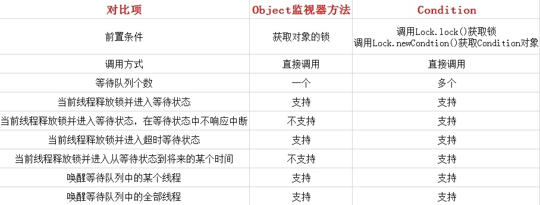

Condition提供了一系列的方法来对阻塞和唤醒线程：

1. **await()** ：造成当前线程在接到信号或被中断之前一直处于等待状态。

2. **await(long time, TimeUnit unit)** ：造成当前线程在接到信号、被中断或到达指定等待时间之前一直处于等待状态。

3. **awaitNanos(long nanosTimeout)** ：造成当前线程在接到信号、被中断或到达指定等待时间之前一直处于等待状态。返回值表示剩余时间，如果在nanosTimesout之前唤醒，那么返回值 = nanosTimeout – 消耗时间，如果返回值 <= 0 ,则可以认定它已经超时了。

4. **awaitUninterruptibly()** ：造成当前线程在接到信号之前一直处于等待状态。【注意：该方法对中断不敏感】。

5. **awaitUntil(Date deadline)** ：造成当前线程在接到信号、被中断或到达指定最后期限之前一直处于等待状态。如果没有到指定时间就被通知，则返回true，否则表示到了指定时间，返回返回false。

6. **signal()** ：唤醒一个等待线程。该线程从等待方法返回前必须获得与Condition相关的锁。

7. **signalAll()** ：唤醒所有等待线程。能够从等待方法返回的线程必须获得与Condition相关的锁。

   Condition是一种广义上的条件队列（等待队列）。他为线程提供了一种更为灵活的等待/通知模式，线程在调用await方法后执行挂起操作，直到线程等待的某个条件为真时才会被唤醒。Condition必须要配合锁一起使用，因为对共享状态变量的访问发生在多线程环境下。一个Condition的实例必须与一个Lock绑定，因此Condition一般都是作为Lock的内部实现。


案例：

```java
public class Demo11Condition {

    private Lock reentrantLock = new ReentrantLock();
    private Condition condition1 = reentrantLock.newCondition();
    private Condition condition2 = reentrantLock.newCondition();

    public void m1() {
        reentrantLock.lock();
        try {
            System.out.println("线程 " + Thread.currentThread().getName() + " 已经进入执行等待。。。");
            condition1.await();
            System.out.println("线程 " + Thread.currentThread().getName() + " 已被唤醒，继续执行。。。");
        } catch (Exception e) {
            e.printStackTrace();
        } finally {
            reentrantLock.unlock();
        }
    }

    public void m2() {
        reentrantLock.lock();
        try {
            System.out.println("线程 " + Thread.currentThread().getName() + " 已经进入执行等待。。。");
            condition1.await();
            System.out.println("线程 " + Thread.currentThread().getName() + " 已被唤醒，继续执行。。。");
        } catch (Exception e) {
            e.printStackTrace();
        } finally {
            reentrantLock.unlock();
        }
    }

    public void m3() {
        reentrantLock.lock();
        try {
            System.out.println("线程 " + Thread.currentThread().getName() + " 已经进入执行等待。。。");
            condition2.await();
            System.out.println("线程 " + Thread.currentThread().getName() + " 已被唤醒，继续执行。。。");
        } catch (Exception e) {
            e.printStackTrace();
        } finally {
            reentrantLock.unlock();
        }
    }

    public void m4() {
        reentrantLock.lock();
        try {
            System.out.println("线程 " + Thread.currentThread().getName() + " 已经进入发出condition1唤醒信号。。。");
            condition1.signalAll();
        } catch (Exception e) {
            e.printStackTrace();
        } finally {
            reentrantLock.unlock();
        }
    }

    public void m5() {
        reentrantLock.lock();
        try {
            System.out.println("线程 " + Thread.currentThread().getName() + " 已经进入发出condition2唤醒信号。。。");
            condition2.signalAll();
        } catch (Exception e) {
            e.printStackTrace();
        } finally {
            reentrantLock.unlock();
        }
    }

    public static void main(String[] args) throws Exception {
        final Demo11Condition useCondition = new Demo11Condition();
        Thread t1 = new Thread(new Runnable() {
            public void run() {
                useCondition.m1();
            }
        }, "t1");
        Thread t2 = new Thread(new Runnable() {
            public void run() {
                useCondition.m2();
            }
        }, "t2");
        Thread t3 = new Thread(new Runnable() {
            public void run() {
                useCondition.m3();
            }
        }, "t3");
        Thread t4 = new Thread(new Runnable() {
            public void run() {
                useCondition.m4();
            }
        }, "t4");
        Thread t5 = new Thread(new Runnable() {
            public void run() {
                useCondition.m5();
            }
        }, "t5");

        t1.start();
        t2.start();
        t3.start();

        Thread.sleep(2000);
        t4.start();


        Thread.sleep(2000);
        t5.start();
    }
}
```


## 12.2 Condition的实现

	获取一个Condition必须通过Lock的newCondition()方法。该方法定义在接口Lock下面，返回的结果是绑定到此 Lock 实例的新 Condition 实例。Condition为一个接口，其下仅有一个实现类ConditionObject，由于Condition的操作需要获取相关的锁，而AQS则是同步锁的实现基础，所以ConditionObject则定义为AQS的内部类。定义如下：

```java
public class ConditionObject implements Condition, java.io.Serializable {
}
```

### 12.2.1 等待队列

	每个Condition对象都包含着一个FIFO队列，该队列是Condition对象通知/等待功能的关键。在队列中每一个节点都包含着一个线程引用，该线程就是在该Condition对象上等待的线程。源码如下：

```java
public class ConditionObject implements Condition, java.io.Serializable {
    private static final long serialVersionUID = 1173984872572414699L;

    //头节点
    private transient Node firstWaiter;
    //尾节点
    private transient Node lastWaiter;

    public ConditionObject() {
    }

    /** 省略方法 **/
}
```

从上面代码可以看出Condition拥有首节点（firstWaiter），尾节点（lastWaiter）。当前线程调用await()方法，将会以当前线程构造成一个节点（Node），并将节点加入到该队列的尾部。结构如下：

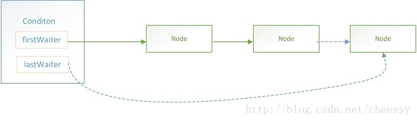
Node里面包含了当前线程的引用。Node定义与AQS的CLH同步队列的节点使用的都是同一个类（AbstractQueuedSynchronized.Node静态内部类）。

Condition的队列结构比CLH同步队列的结构简单些，新增过程较为简单只需要将原尾节点的nextWaiter指向新增节点，然后更新lastWaiter即可。


### 12.2.2 等待状态

	调用Condition的await()方法会使当前线程进入等待状态，同时会加入到Condition等待队列同时释放锁。当从await()方法返回时，当前线程一定是获取了Condition相关连的锁。

```java
public final void await() throws InterruptedException {
    // 当前线程中断
    if (Thread.interrupted())
        throw new InterruptedException();
    //当前线程加入等待队列
    Node node = addConditionWaiter();
    //释放锁
    long savedState = fullyRelease(node);
    int interruptMode = 0;
    /**
         * 检测此节点的线程是否在同步队上，如果不在，则说明该线程还不具备竞争锁的资格，则继续等待
         * 直到检测到此节点在同步队列上
         */
    while (!isOnSyncQueue(node)) {
        //线程挂起
        LockSupport.park(this);
        //如果已经中断了，则退出
        if ((interruptMode = checkInterruptWhileWaiting(node)) != 0)
            break;
    }
    //竞争同步状态
    if (acquireQueued(node, savedState) && interruptMode != THROW_IE)
        interruptMode = REINTERRUPT;
    //清理下条件队列中的不是在等待条件的节点
    if (node.nextWaiter != null) // clean up if cancelled
        unlinkCancelledWaiters();
    if (interruptMode != 0)
        reportInterruptAfterWait(interruptMode);
}
```

	此段代码的逻辑是：首先将当前线程新建一个节点同时加入到条件队列中，然后释放当前线程持有的同步状态。然后则是不断检测该节点代表的线程释放出现在CLH同步队列中（收到signal信号之后就会在AQS队列中检测到），如果不存在则一直挂起，否则参与竞争同步状态。

### 12.2.3 通知

	调用Condition的signal()方法，将会唤醒在等待队列中等待最长时间的节点（条件队列里的首节点），在唤醒节点前，会将节点移到CLH同步队列中。

```java
public final void signal() {
    //检测当前线程是否为拥有锁的独
    if (!isHeldExclusively())
        throw new IllegalMonitorStateException();
    //头节点，唤醒条件队列中的第一个节点
    Node first = firstWaiter;
    if (first != null)
        doSignal(first);    //唤醒
}
```

该方法首先会判断当前线程是否已经获得了锁，这是前置条件。然后唤醒等待队列中的头节点。

doSignal(Node first)：唤醒头节点

```java
private void doSignal(Node first) {
    do {
        //修改头结点，完成旧头结点的移出工作
        if ( (firstWaiter = first.nextWaiter) == null)
            lastWaiter = null;
        first.nextWaiter = null;
    } while (!transferForSignal(first) &&
             (first = firstWaiter) != null);
}
```

doSignal(Node first)主要是做两件事：

1.修改头节点，

2.调用transferForSignal(Node first) 方法将节点移动到CLH同步队列中。