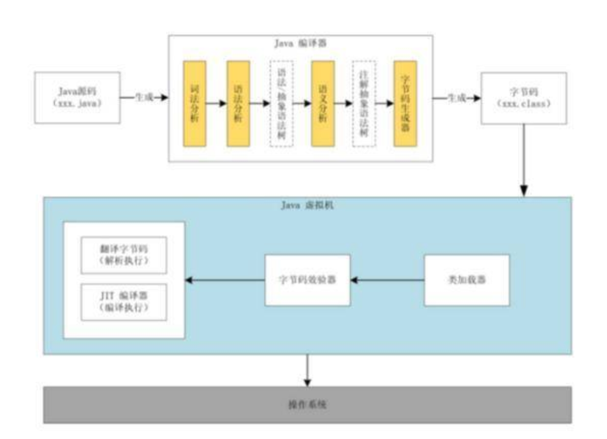

# 高频多线程相关面试题

# 1、Java中实现多线程有几种方法

（1）继承Thread类；

（2）实现Runnable接口；

（3）实现Callable接口通过FutureTask包装器来创建Thread线程；

（4）使用ExecutorService、Callable、Future实现有返回结果的多线程（也就是使用了ExecutorService来管理前面的三种方式）。

#  2、如何停止一个正在运行的线程

1. 调用 Thread 类的 stop() 方法：该方法会立即终止线程，但可能导致数据不一致和死锁等问题，因此已被废弃。
2. 使用标志位（Flag）停止线程：在 run() 方法中加入一个 boolean 类型的标志位，当标志位为 true 时线程继续运行，当标志位为 false 时线程停止运行。这种方法比较安全，但需要在线程中不断检查标志位，可能会影响程序的性能。
3. 调用 Interrupt() 方法中断线程：该方法会向目标线程发送中断信号，线程可以根据自己的情况决定是否停止运行。在目标线程中可以使用 isInterrupted() 方法来判断中断状态，并进行相应的处理。
4. 使用 Thread.interrupt() 和 InterruptedException 异常：在执行阻塞操作时，可以调用 interrupt() 方法打一个中断标记，被阻塞的线程会抛出 InterruptedException 异常，通过捕获异常可以实现线程的停止。

- 不同的方法适用于不同的场景，其中第二种和第三种方法比较常用。第一种方法已经废弃，不建议使用。第四种方法主要用于停止正在执行阻塞操作的线程。

## 2.1、调用 Thread 类的 stop() 方法

- 该方法会立即终止线程，但可能导致数据不一致和死锁等问题，因此已被废弃。

## 2.2、使用标志位（Flag）停止线程

- 1.在 Thread 类的子类中定义一个 boolean 类型的成员变量，作为标志位。
  - 并且需要`volatile`修饰让所有线程的知道这个值修改

- 2.在 run() 方法中使用循环结构不断检查标志位。

- 3.在需要停止线程时，将标志位设置为 false。

```java
public class MyThread extends Thread {
    private volatile boolean flag = true; // 定义标志位

    public void run() {
        while (flag) { // 循环检查标志位
            // 线程执行的代码
        }
    }

    public void stopThread() { // 停止线程的方法
        flag = false; // 设置标志位为 false
    }
}
```

- **在需要停止线程的地方，可以调用 stopThread() 方法，将标志位设置为 false。线程会在下一次循环检查标志位时退出循环并停止运行。需要注意的是，要保证对 flag 变量的修改能够被所有线程可见，可以使用 volatile 关键字来实现。**

## 2.3、使用interrupt方法中断线程。

- 调用 Interrupt() 方法中断线程：该方法会向目标线程发送中断信号，线程可以根据自己的情况决定是否停止运行。在目标线程中可以使用 isInterrupted() 方法来判断中断状态，并进行相应的处理。
- 在 Thread 类的子类中重写 run() 方法。
- 在 run() 方法中使用 isInterrupted() 方法检查中断状态，并在适当的时候退出循环和方法。
- 在需要停止线程的地方，调用 interrupt() 方法向线程发送中断信号。

```java
public class MyThread extends Thread {

    public void run() {
        while (!isInterrupted()) { // 循环检查中断状态
            // 线程执行的代码
        }
    }

    public void stopThread() { // 停止线程的方法
        interrupt(); // 发送中断信号
    }
}

```

- 在需要停止线程的地方，可以调用 stopThread() 方法，向线程发送中断信号。线程会在下一次循环检查中断状态时抛出 InterruptedException 异常并退出循环和方法。需要注意的是，在捕获 InterruptedException 异常后，需要手动结束线程的执行过程。

## 2.4、使用 interrupt() 方法和 InterruptedException 异常来停止线程

- 在执行阻塞操作的地方，在可能抛出 InterruptedException 异常的代码前调用 interrupt() 方法。
- 在捕获 InterruptedException 异常时，判断中断状态并适当处理。
- 在需要停止线程的地方，调用 interrupt() 方法向线程发送中断信号。

```java
public class MyThread extends Thread {

    public void run() {
        while (!isInterrupted()) { // 循环检查中断状态
            try {
                // 执行阻塞操作
                Thread.sleep(1000);
            } catch (InterruptedException e) {
                // 捕获 InterruptedException 异常
                if (isInterrupted()) { // 判断中断状态
                    // 处理中断信号
                    break; // 退出循环
                }
            }
        }
    }

    public void stopThread() { // 停止线程的方法
        interrupt(); // 发送中断信号
    }
}

```

- 在执行阻塞操作的地方，可以调用 interrupt() 方法打一个中断标记。在捕获 InterruptedException 异常时，判断中断状态并适当处理。在需要停止线程的地方，可以调用 stopThread() 方法，向线程发送中断信号。线程会在下一次循环检查中断状态时抛出 InterruptedException 异常并退出循环和方法。需要注意的是，在捕获 InterruptedException 异常后，需要手动结束线程的执行过程。

# 3、notify()和notifyAll()有什么区别？

- notify() 方法只会唤醒在该对象上等待的一个线程，选择哪个线程被唤醒是不确定的，通常是由 JVM 实现的调度算法决定的。
- notifyAll() 方法会唤醒在该对象上等待的所有线程，让它们都有机会去争抢锁。
- notify() 和 notifyAll() 均需要在 synchronized 块中使用，否则会抛出 IllegalMonitorStateException 异常。
- 使用 notify() 或 notifyAll() 唤醒线程时，被唤醒的线程需要重新争抢该对象的锁才能继续执行。如果此时有多个线程都在等待该锁，则争抢锁的顺序取决于 JVM 实现的调度算法。

因为 notifyAll() 方法会唤醒所有等待线程，所以在多数情况下，优先使用 notifyAll() 方法。但在一些特殊的场景下，可能只需要唤醒其中一个线程，这时可以使用 notify() 方法。

# 4、sleep()和wait() 有什么区别？

对于sleep()方法，我们首先要知道该方法是属于Thread类中的。而wait()方法，则是属于Object类中的。

|  方法   |  归属  |               区别               |                           使用场景                           |
| :-----: | :----: | :------------------------------: | :----------------------------------------------------------: |
| sleep() | Thread |   暂停的是这个线程，单位为秒s    | 线程进入阻塞状态，并且不会执行任何操作，直到休眠时间结束。一般用于模拟线程执行过程中的延迟等待。 |
| wait()  | Object | 它放弃了对象的锁，并进入等待状态 | 用于在线程之间进行通信。当一个线程调用一个对象的`wait()`方法时，它放弃了对象的锁，并进入等待状态，直到其他线程调用该对象的`notify()`或`notifyAll()`方法来唤醒它。`wait()`方法必须在同步块中使用，并且只能被持有该对象锁的线程调用。 |

- 因此，`sleep()`和`wait()`方法的区别在于它们的用途和作用对象。`sleep()`方法用于线程的暂时休眠，而`wait()`方法用于线程之间的通信和同步。此外，`wait()`方法必须在同步块中使用，而`sleep()`方法则不需要。

# 5、volatile 是什么?可以保证有序性吗?

## 5.1 、volatile 是什么?

- `volatile`是Java中的一种关键字，用于修饰变量。被`volatile`修饰的变量具有可见性和禁止指令重排的特性。

一旦一个共享变量（类的成员变量、类的静态成员变量）被volatile修饰之后，那么就具备了两层语义：

（1）保证了不同线程对这个变量进行操作时的可见性，即一个线程修改了某个变量的值，这新值对其他线程来说是立即可见的,volatile关键字会强制将修改的值立即写入主存。

（2）禁止进行指令重排序。

## 5.2、可以保证有序性吗?

- volatile 不是原子性操作

- 什么叫保证部分有序性?

当程序执行到volatile变量的读操作或者写操作时，在其前面的操作的更改肯定全部已经进行，且结果已经对后面的操作可见；在其后面的操作肯定还没有进行；

```java
x = 2;//语句1
y = 0;//语句2
flag = true;//语句3
x = 4;//语句4
y = -1;//语句5
```

由于flag变量为volatile变量，那么在进行指令重排序的过程的时候，不会将语句3放到语句1、语句2前面，也不会讲语句3放到语句4、语句5后面。但是要注意语句1和语句2的顺序、语句4和语句5的顺序是不作任何保证的。

使用 Volatile 一般用于 状态标记量 和 单例模式的双检锁

# 6、Thread 类中的start() 和 run() 方法有什么区别？

| 方法      | 描述                                                         |
| --------- | ------------------------------------------------------------ |
| `start()` | 创建新线程并使该线程进入就绪状态，等待系统调度执行。在新线程开始执行之前，会先执行该线程对象的`run()`方法。 |
| `run()`   | 线程对象的普通方法，如果直接调用该方法，则该方法将在当前线程中执行，而不会创建新线程。 |

# 7、为什么wait, notify 和 notifyAll这些方法不在thread类里面？

- 1、java提供的锁是对象级别，不是线程级别
- 2、`wait()`、`notify()`和`notifyAll()`的作用于线程间的协作和互斥机制

> `wait()`、`notify()`和`notifyAll()`方法不在`Thread`类中，而是在`Object`类中。这是因为这些方法实际上是用于线程之间的协作和互斥机制的，而不像`Thread`类中的`start()`和`run()`方法是用于控制线程的生命周期和执行流程。
>
> 具体来说，`wait()`、`notify()`和`notifyAll()`方法被定义在`Object`类中，是因为它们是基于监视器（monitor）的概念实现的。每个Java对象都有一个关联的监视器（也称为内置锁或同步锁），可以使用`synchronized`关键字对它进行访问控制。`wait()`、`notify()`和`notifyAll()`方法就是基于这个监视器来实现线程之间的协作和互斥机制的。
>
> 因此，将`wait()`、`notify()`和`notifyAll()`方法定义在`Object`类中有助于统一所有Java对象的监视器的行为和语义。另外，由于这些方法是基于监视器实现的，所以它们必须在同步块中使用，并且只能被持有该对象锁的线程调用，否则会抛出`IllegalMonitorStateException`异常。


# 8、为什么wait和notify方法要在同步块中调用？

- `wait()`方法和`notify()`方法需要在同步块中调用，是因为它们基于Java对象的监视器（monitor）实现线程之间的协作和互斥机制。每个Java对象都有一个关联的监视器（也称为内置锁或同步锁），可以使用`synchronized`关键字对它进行访问控制。

- 具体来说，当一个线程调用一个对象的`wait()`方法时，它会释放该对象的锁，并进入等待状态，直到其他线程调用该对象的`notify()`或`notifyAll()`方法来唤醒它。而`notify()`和`notifyAll()`方法则是用于通知等待的线程可以继续执行了。

- 要确保这种协作和互斥机制的正确性和可靠性，必须将`wait()`、`notify()`和`notifyAll()`方法放在同步块中调用，以便确保它们只能由持有该对象锁的线程来调用，否则就会抛出`IllegalMonitorStateException`异常。

- 此外，在同步块中调用`wait()`方法还可以避免死锁问题的发生。如果一个线程在没有获得锁的情况下调用了`wait()`方法，那么该线程就会一直处于等待状态，从而导致死锁的产生。

- 因此，将`wait()`、`notify()`和`notifyAll()`方法放在同步块中调用是保证线程之间协作和互斥机制正确性的重要手段。

```java
class MyThread extends Thread {
    private Object lock;

    public MyThread(Object lock) {
        this.lock = lock;
    }

    @Override
    public void run() {
        synchronized (lock) {
            try {
                // 等待通知
                System.out.println("线程开始等待...");
                lock.wait();
                System.out.println("线程被唤醒");
            } catch (InterruptedException e) {
                e.printStackTrace();
            }
        }
    }
}

public class TestWaitNotify {
    public static void main(String[] args) throws InterruptedException {
        Object lock = new Object();
        MyThread thread = new MyThread(lock);
        thread.start();

        // 主线程休眠1秒钟，确保子线程已经进入等待状态
        Thread.sleep(1000);

        synchronized (lock) {
            System.out.println("主线程开始唤醒子线程...");
            lock.notify();  // 唤醒等待的线程
        }
    }
}

```

# 9、Java中interrupted 和 isInterruptedd方法的区别？

| 方法名称          | 描述                                                         | 是否静态方法 | 是否清除中断状态标志 |
| ----------------- | ------------------------------------------------------------ | ------------ | -------------------- |
| `interrupted()`   | 检查当前线程是否被中断，并清除中断状态标志。如果当前线程被中断，则返回 `true`；否则返回 `false`。该方法可用于检查当前线程和其他线程的状态。 | 是           | 是                   |
| `isInterrupted()` | 检查线程对象的中断状态。如果调用该方法的线程已经被中断，则返回 `true`；否则返回 `false`。该方法只能用于检查当前线程的状态，不能用于检查其他线程的状态。 | 否           | 否                   |

# 10、Java中synchronized 和 ReentrantLock 有什么不同？

## 10.1、synchronized和ReentrantLock的相似点和区别

| 特性         | `synchronized`                                         | `ReentrantLock`                                              |
| ------------ | ------------------------------------------------------ | ------------------------------------------------------------ |
| 锁的获取方式 | 隐式锁，JVM 自动管理获取和释放锁                       | 显式锁，需要手动获取和释放锁                                 |
| 锁的灵活性   | 不够灵活，只能实现基本的同步功能                       | 更加灵活，可以实现公平锁、非公平锁、可中断的锁、可重入的锁等 |
| 线程阻塞     | 当一个线程持有该锁时，其他线程会被阻塞直到该线程释放锁 | 当一个线程持有该锁时，其他线程可以选择继续等待获取锁或者中断退出 |
| 可重入性     | 支持可重入，同一个线程可以多次获取同一把锁而不会死锁   | 支持可重入，同一个线程可以多次获取同一把锁而不会死锁         |
| 代码语法     | 是一个关键字，直接用在方法或代码块中                   | 是一个类，需要创建对象并调用其方法来使用                     |

- 它们都可以用于实现线程同步，但是`ReentrantLock`比`synchronized`更加灵活，并且提供了更多的特性（例如公平锁、非公平锁、可中断的锁等）。另外，两者的语法也有所不同。

## 10.2、ReentrantLock高级功能

| 高级功能         | 描述                                                         |
| ---------------- | ------------------------------------------------------------ |
| 公平锁和非公平锁 | `ReentrantLock` 可以实现公平锁或非公平锁，公平锁会按照请求的顺序获取锁，而非公平锁则允许当前线程优先获取锁。 |
| 可重入性         | 同一个线程可以多次获取同一把锁而不会死锁。                   |
| 中断响应         | `ReentrantLock` 提供了可中断的锁机制，即支持在等待获取锁的过程中响应中断信号，避免线程无限期地被阻塞。 |
| 条件变量         | `ReentrantLock` 支持多个条件变量，使得线程可以更加精细地控制并发执行的顺序和条件。 |
| 锁超时           | `ReentrantLock` 可以指定尝试获取锁的最长等待时间，避免线程无限期地被阻塞。 |

- 这些高级功能包括公平锁和非公平锁、可重入性、中断响应、条件变量以及锁超时等，使得线程同步的管理更加灵活和高效。

# 11、有三个线程T1,T2,T3,如何保证顺序执行？

可以使用线程同步的机制来保证三个线程的顺序执行，比如可以使用信号量或互斥锁等方式，具体实现方法如下：

1. 初始化三个信号量S1、S2、S3，初始值分别为0。
2. 线程T1先执行，执行完之后释放S1信号量。
3. 线程T2等待S1信号量，获取到信号量后执行，执行完之后释放S2信号量。
4. 线程T3等待S2信号量，获取到信号量后执行。

这样就能保证线程T1先执行，T2在T1执行完之后再执行，T3在T2执行完之后再执行。

```java
import java.util.concurrent.Semaphore;

public class ThreadOrdering {
    // 定义三个计数器为0的信号量
    private static Semaphore sem1 = new Semaphore(0);
    private static Semaphore sem2 = new Semaphore(0);
    private static Semaphore sem3 = new Semaphore(0);

    public static void main(String[] args) throws InterruptedException {
        // 创建并启动三个线程
        Thread t1 = new Thread(() -> {
            System.out.println("Thread 1");
            // 释放sem1信号量，使得T2可以执行
            sem1.release();
        });
        Thread t2 = new Thread(() -> {
            try {
                // 等待sem1信号量，保证T1先执行
                sem1.acquire();
                System.out.println("Thread 2");
                // 释放sem2信号量，使得T3可以执行
                sem2.release();
            } catch (InterruptedException e) {
                e.printStackTrace();
            }
        });
        Thread t3 = new Thread(() -> {
            try {
                // 等待sem2信号量，保证T2先执行
                sem2.acquire();
                System.out.println("Thread 3");
                // 释放sem3信号量，标志所有线程执行完毕
                sem3.release();
            } catch (InterruptedException e) {
                e.printStackTrace();
            }
        });

        // 启动三个线程
        t1.start();
        t2.start();
        t3.start();

        // 等待所有线程执行完毕
        sem3.acquire();
    }
}
```

# 12、SynchronizedMap和ConcurrentHashMap有什么区别？

| 功能     | `SynchronizedMap`                                     | `ConcurrentHashMap`                                     |
| -------- | ----------------------------------------------------- | ------------------------------------------------------- |
| 同步机制 | 使用`synchronized`关键字实现互斥性                    | 使用分段锁（Segment）实现并发访问                       |
| 并发性能 | 在同一时刻只能有一个线程对 Map 进行操作，效率相对较低 | 可以支持多个线程同时对 Map 进行操作，具有更好的性能表现 |
| 内存开销 | 需要将整个 Map 对象锁住，导致内存开销较大             | 只需要锁住当前正在操作的 Segment，减小内存开销          |

# 13、什么是线程安全

线程安全就是说多线程访问同一代码，不会产生不确定的结果。

在多线程环境中，当各线程不共享数据的时候，即都是私有（private）成员，那么一定是线程安全的。但这种情况并不多见，在多数情况下需要共享数据，这时就需要进行适当的同步控制了。

线程安全一般都涉及到synchronized， 就是一段代码同时只能有一个线程来操作 不然中间过程可能会产生不可预制的结果。

如果你的代码所在的进程中有多个线程在同时运行，而这些线程可能会同时运行这段代码。如果每次运行的ArrayList不是线程安全的。

# 14、Thread类中的yield方法有什么作用？

- `Thread` 类中的 `yield()` 方法用于让当前线程暂停一下，让出 CPU 时间片给其他线程执行。具体来说，调用 `yield()` 方法后，当前线程会让出自己的 CPU 时间片，然后重新进入就绪状态，等待系统重新调度它。

- `yield()` 方法并不会释放锁或者资源，只是使当前线程从运行状态转为就绪状态，因此在某些情况下，使用 `yield()` 方法可能会导致性能降低。通常情况下，只有在需要调整线程优先级或者希望让其他线程更快地执行时，才需要使用 `yield()` 方法。

- 需要注意的是，`yield()` 方法只是向调度程序建议当前线程愿意让出 CPU 时间片，并不能保证其他线程一定会获得 CPU 时间片。另外，在单核 CPU 上调用 `yield()` 方法也不会产生任何效果，因为当前线程是唯一的活动线程，CPU 时间片无法分配给其他线程。

# 15、Java线程池中submit() 和 execute()方法有什么区别？

| 特性         | `execute()` 方法                     | `submit()` 方法                                        |
| ------------ | ------------------------------------ | ------------------------------------------------------ |
| 返回值类型   | `void`                               | `Future`                                               |
| 支持任务类型 | 实现了 `Runnable` 接口的任务         | 实现了 `Runnable` 或 `Callable` 接口的任务             |
| 异常处理方式 | 捕获并记录到日志中，程序不会抛出异常 | 通过 `Future` 对象获取任务执行过程中可能发生的异常信息 |

- 因此，在使用线程池提交任务时，通常建议使用 `submit()` 方法，因为它更加灵活、更容易处理任务的执行结果和异常信息。而 `execute()` 方法则更适合一些简单的、不需要关注执行结果和异常处理的任务。

# 16、说一说自己对于 synchronized 关键字的了解

`synchronized` 是 Java 中实现线程同步的关键字，它可以用来修饰方法或代码块，确保在多个线程访问共享资源时的安全性。具体来说，当一个线程进入被 `synchronized` 修饰的代码块或方法时，会先尝试获取对象的锁，如果该锁已经被其他线程占用，则该线程会被阻塞，直到获取到锁为止，然后才能继续执行。

`synchronized` 关键字可以实现对代码块、方法和类等不同粒度的锁定，其中：

- 对于代码块，可以将需要同步的代码放在一对花括号 `{}` 中，并在前面加上 `synchronized(object)`，其中 `object` 表示需要锁定的对象；
- 对于方法，可以在方法声明中加上 `synchronized` 关键字，表示整个方法都是需要同步的；
- 对于类，可以使用 `static synchronized` 将整个静态方法锁住，也可以使用 `synchronized(Class.class)` 来锁定整个类。

需要注意的是，`synchronized` 关键字虽然能够保证线程安全，但是在高并发场景下，由于需要竞争锁，可能会导致性能问题。因此，在一些高并发的应用场景中，可以使用更加轻量级的锁机制，比如使用 `Lock` 接口提供的锁，或者使用 Java 5 中引入的 `java.util.concurrent` 工具包中的并发容器和工具类来实现线程间的同步。

# 17、说说自己是怎么使用 synchronized 关键字，在项目中用到了吗

synchronized关键字最主要的三种使用方式：

（1）修饰实例方法: 作用于当前对象实例加锁，进入同步代码前要获得当前对象实例的锁

（2）修饰静态方法: 也就是给当前类加锁，会作用于类的所有对象实例，因为静态成员不属于任何一个实例对象，是类成员（ static 表明这是该类的一个静态资源，不管new了多少个对象，只有一份）。所以如果一个线程A调用一个实例对象的非静态 synchronized 方法，而线程B需要调用这个实例对象所属类的静态 synchronized 方法，是允许的，不会发生互斥现象，因为访问静态 synchronized 方法占用的锁是当前类的锁，而访问非静态 synchronized 方法占用的锁是当前实例对象锁。

（3）修饰代码块: 指定加锁对象，对给定对象加锁，进入同步代码库前要获得给定对象的锁。

总结： synchronized 关键字加到 static 静态方法和 synchronized(class)代码块上都是是给 Class 类上锁。synchronized 关键字加到实例方法上是给对象实例上锁。尽量不要使用 synchronized(String a) 因为JVM中，字符串常量池具有缓存功能！

# 18、什么是线程安全？Vector是一个线程安全类吗？

线程安全是指在多线程环境下，能够保证程序正确地处理共享数据的访问和操作，而不会发生意外的后果或破坏程序的正确性。当多个线程同时对共享数据进行访问和修改时，线程安全的程序能够确保数据的一致性和正确性，避免了竞态条件、死锁等并发问题的发生。

`Vector` 是 Java 中的一个线程安全类，它继承自 `AbstractList` 类，使用数组实现动态增长的容器，支持在任意位置插入和删除元素，并提供了诸如 `size()`, `isEmpty()`, `elementAt(int index)` 等方法。由于 `Vector` 的所有方法都是同步方法（即加了 `synchronized` 关键字），因此在多线程环境下，对于 `Vector` 实例的读写操作是线程安全的。

需要注意的是，虽然 `Vector` 类可以保证在多线程环境下的线程安全性，但是由于其内部使用了锁机制，因此可能会影响程序的性能。如果只是在单线程环境下使用，建议使用非线程安全的容器类，比如 `ArrayList`，可以获得更好的性能表现。

# 19、 volatile关键字的作用？

`volatile` 是 Java 中用来修饰变量的关键字之一，它的主要作用是保证变量的可见性和有序性，具体的特点如下：

| 特点   | 描述                                                         |
| ------ | ------------------------------------------------------------ |
| 可见性 | 当一个线程修改一个被 `volatile` 修饰的变量时，其他线程可以立即看到最新值，而不是使用本地缓存中的旧值。 |
| 有序性 | 在多线程环境下，JVM 会对指令进行重排序，从而提高程序执行效率。但是在某些情况下，这会导致线程间的数据竞争问题。使用 `volatile` 关键字可以防止编译器和处理器对代码进行过多优化，从而保证程序的正确性。 |
| 原子性 | `volatile` 并不能保证原子性，只能保证常规读/写的原子性。如果需要保证原子性，需要使用同步机制，比如 `synchronized` 或者 `Lock`。 |

需要注意的是，虽然 `volatile` 关键字可以保证变量的可见性和有序性，但是并不能完全解决多线程环境下的安全问题。如果需要对共享数据进行复杂的操作或者控制访问顺序等需求，需要使用更强大的同步机制，如使用 `synchronized` 或者 `Lock`。

# 20、常用的线程池有哪些？

（1）ThreadPoolTaskExecutor

# 21、简述一下你对线程池的理解

（如果问到了这样的问题，可以展开的说一下线程池如何用、线程池的好处、线程池的启动策略）合理利用线程池能够带来三个好处。

线程池是一种用来管理和重复利用线程的机制，它可以提高程序性能和稳定性，避免了频繁创建和销毁线程的开销，同时也能够控制线程数量、缓存队列、拒绝策略等参数，从而更好地满足不同场景下的需求。

通常情况下，使用线程池需要经过以下步骤：

1. 创建线程池对象：通过 `Executors` 工具类中的静态方法来创建不同类型的线程池，比如 `newFixedThreadPool(int nThreads)`、`newCachedThreadPool()` 等。

2. 提交任务：通过调用线程池对象的 `execute(Runnable task)` 或 `submit(Callable task)` 方法来提交任务，任务会被加入到线程池的执行队列中，等待空闲线程来执行。

3. 关闭线程池：在不再需要使用线程池时，需要调用线程池对象的 `shutdown()` 方法来关闭线程池，确保所有任务都已完成，并释放相关资源。

使用线程池的好处包括：

- 提高程序效率和响应速度：能够减少线程的创建和销毁开销，避免线程频繁竞争 CPU 资源，提高程序的并发性和吞吐量。

- 优化系统资源占用：能够限制线程数量、缓存队列大小等参数，避免因线程数量过多而导致系统资源瓶颈。

- 提高程序稳定性：能够控制线程数量和任务队列，避免出现线程堆积

# 22、Java程序是如何执行的

我们日常的工作中都使用开发工具（IntelliJ IDEA 或 Eclipse 等）可以很方便的调试程序，或者是通过打包工具把项目打包成 jar 包或者 war 包，放入 Tomcat 等 Web 容器中就可以正常运行了

（1）先把 Java 代码编译成字节码，也就是把 .java 类型的文件编译成 .class 类型的文件。这个过程的大致执行流程：Java 源代码 -> 词法分析器 -> 语法分析器 -> 语义分析器 -> 字符码生成器 -> 最终生成字节码，其中任何一个节点执行失败就会造成编译失败；

（2）把 class 文件放置到 Java 虚拟机，这个虚拟机通常指的是 Oracle 官方自带的 Hotspot JVM；

（3）Java 虚拟机使用类加载器（Class Loader）装载 class 文件；

（4）类加载完成之后，会进行字节码效验，字节码效验通过之后 JVM 解释器会把字节码翻译成机器码交由操作系统执行。但不是所有代码都是解释执行的，JVM 对此做了优化，比如，以 Hotspot 虚拟机来说，它本身提供了 JIT（Just In Time）也就是我们通常所说的动态编译器，它能够在运行时将热点代码编译为机器码，这个时候字节码就变成了编译执行。Java 程序执行流程图如下：

