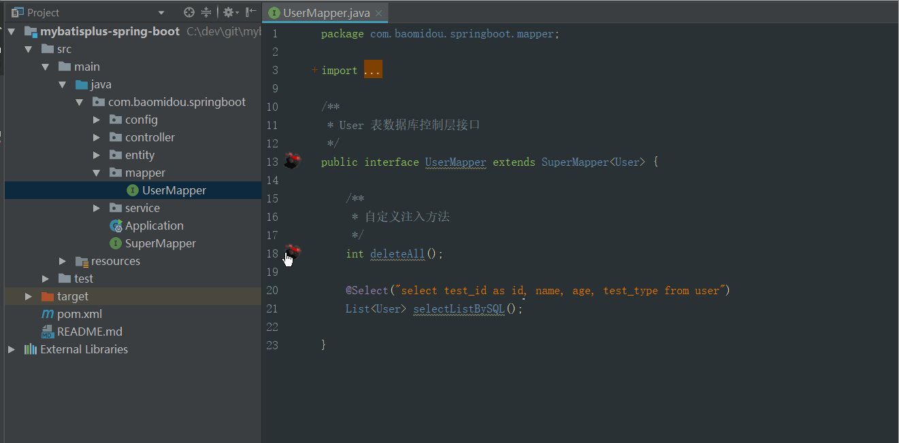

# Mybatis Plus

今日目标：

- 了解mybatisplus的特点
- 能够掌握mybatisplus快速入门
- 能够掌握mybatisplus常用注解
- 能够掌握mybatisplus常用的增删改查
- 能够掌握mybatisplus自动代码生成

# 01-MybatisPlus简介

## 【1】MybatisPlus概述

MyBatis-Plus（简称 MP）是一个 MyBatis 的增强工具，在 MyBatis 的基础上只做**增强不做改变**，为简化开发、提高效率而生（提供了快速使用mybatis的方式）。

官网：https://mybatis.plus/ 或 https://mp.baomidou.com/ 

## 【2】MP愿景

```tex
MP愿景是成为 MyBatis 最好的搭档，就像 魂斗罗 中的 1P、2P，基友搭配，效率翻倍。
```


## 【3】MP特性

- **无侵入**：只做增强不做改变，引入它不会对现有工程产生影响，如丝般顺滑
- **损耗小**：启动即会自动注入基本 CURD，性能基本无损耗，直接面向对象操作
- **强大的 CRUD 操作**：内置通用 Mapper、通用 Service，仅仅通过少量配置即可实现单表大部分 CRUD 操作，更有强大的条件构造器，满足各类使用需求
- **支持 Lambda 形式调用**：通过 Lambda 表达式，方便的编写各类查询条件，无需再担心字段写错
- **支持主键自动生成**：支持多达 4 种主键策略（内含分布式唯一 ID 生成器 - Sequence），可自由配置，完美解决主键问题
- **支持 ActiveRecord 模式**：支持 ActiveRecord 形式调用，实体类只需继承 Model 类即可进行强大的 CRUD 操作
- **支持自定义全局通用操作**：支持全局通用方法注入（ Write once, use anywhere ）
- **内置代码生成器**：采用代码或者 Maven 插件可快速生成 Mapper 、 Model 、 Service 、 Controller 层代码，支持模板引擎，更有超多自定义配置等您来使用
- **内置分页插件**：基于 MyBatis 物理分页，开发者无需关心具体操作，配置好插件之后，写分页等同于普通 List 查询
- **分页插件支持多种数据库**：支持 MySQL、MariaDB、Oracle、DB2、H2、HSQL、SQLite、Postgre、SQLServer 等多种数据库
- **内置性能分析插件**：可输出 Sql 语句以及其执行时间，建议开发测试时启用该功能，能快速揪出慢查询
- **内置全局拦截插件**：提供全表 delete 、 update 操作智能分析阻断，也可自定义拦截规则，预防误操作

## 【4】开发MP版本

```xml
<dependency>
    <groupId>com.baomidou</groupId>
    <artifactId>mybatis-plus</artifactId>
    <version>3.4.2</version>
</dependency>
```

# 02-MP快速入门

## 【1】MP入门流程分析 

		SpringBoot 整合 MyBatis-Plus，并==实现根据Id查询功能==。

```
1、数据库环境准备
2、创建SpringBoot工程，引入MyBatisPlus场景依赖
3、在yml中编写DataSource相关配置
4、编写mapper
5、测试
```

## 【2】数据库环境准备

```sql
SET NAMES utf8mb4;
SET FOREIGN_KEY_CHECKS = 0;

-- ----------------------------
-- Table structure for tb_user  没有给自增
-- ----------------------------
DROP TABLE IF EXISTS `tb_user`;
CREATE TABLE `tb_user` (
  `id` bigint(20) NOT NULL AUTO_INCREMENT,
  `user_name` varchar(255) DEFAULT NULL,
  `password` varchar(255) DEFAULT NULL,
  `name` varchar(255) DEFAULT NULL,
  `age` int(11) DEFAULT NULL,
  `email` varchar(255) DEFAULT NULL,
  PRIMARY KEY (`id`)
) ENGINE=InnoDB DEFAULT CHARSET=utf8mb4;

-- ----------------------------
-- Records of tb_user
-- ----------------------------
BEGIN;
INSERT INTO `tb_user` VALUES (1, '赵一伤', '123456', 'zys', 19, 'zys@itcast.cn');
INSERT INTO `tb_user` VALUES (2, '钱二败', '123456', 'qes', 18, 'qes@itcast.cn');
INSERT INTO `tb_user` VALUES (3, '孙三毁', '123456', 'ssh', 20, 'ssh@itcast.cn');
INSERT INTO `tb_user` VALUES (4, '李四摧', '123456', 'lsc', 20, 'lsc@itcast.cn');
INSERT INTO `tb_user` VALUES (5, '周五输', '123456', 'zws', 20, 'zws@itcast.cn');
INSERT INTO `tb_user` VALUES (6, '吴六破', '123456', 'wlp', 21, 'wlp@itcast.cn');
INSERT INTO `tb_user` VALUES (7, '郑七灭', '123456', 'zqm', 22, 'zqm@itcast.cn');
INSERT INTO `tb_user` VALUES (8, '王八衰', '123456', 'wbs', 22, 'wbs@itcast.cn');
INSERT INTO `tb_user` VALUES (9, '张无忌', '123456', 'zwj', 25, 'zwj@itcast.cn');
INSERT INTO `tb_user` VALUES (10, '赵敏', '123456', 'zm', 26, 'zm@itcast.cn');
INSERT INTO `tb_user` VALUES (11, '赵二伤', '123456', 'zes', 25, 'zes@itcast.cn');
INSERT INTO `tb_user` VALUES (12, '赵三伤', '123456', 'zss1', 28, 'zss1@itcast.cn');
INSERT INTO `tb_user` VALUES (13, '赵四伤', '123456', 'zss2', 29, 'zss2@itcast.cn');
INSERT INTO `tb_user` VALUES (14, '赵五伤', '123456', 'zws', 39, 'zws@itcast.cn');
INSERT INTO `tb_user` VALUES (15, '赵六伤', '123456', 'zls', 29, 'zls@itcast.cn');
INSERT INTO `tb_user` VALUES (16, '赵七伤', '123456', 'zqs', 39, 'zqs@itcast.cn');
COMMIT;

SET FOREIGN_KEY_CHECKS = 1;
```

## 【3】创建工程，引入场景依赖

```xml
<parent>
  <groupId>org.springframework.boot</groupId>
  <artifactId>spring-boot-starter-parent</artifactId>
  <version>2.3.10.RELEASE</version>
  <relativePath/> <!-- lookup parent from repository -->
</parent>

<properties>
  <java.version>1.8</java.version>
</properties>

<dependencies>
  <!-- mysql  驱动-->
  <dependency>
    <groupId>mysql</groupId>
    <artifactId>mysql-connector-java</artifactId>
    <version>5.1.26</version>
  </dependency>
  <!-- lombok  ,自动生成get,Set 方法-->
  <dependency>
    <groupId>org.projectlombok</groupId>
    <artifactId>lombok</artifactId>
    <optional>true</optional>
  </dependency>

  <dependency>
    <groupId>org.springframework.boot</groupId>
    <artifactId>spring-boot-starter-test</artifactId>
    <scope>test</scope>
  </dependency>
  <!--mybatisplus起步依赖-->
  <dependency>
    <groupId>com.baomidou</groupId>
    <artifactId>mybatis-plus-boot-starter</artifactId>
    <version>3.4.2</version>
  </dependency>
</dependencies>
```

## 【4】编写DataSource相关配置

```yml
# datasource
spring:
  datasource:
    url: jdbc:mysql://192.168.200.150:3306/mp?useUnicode=true&characterEncoding=UTF-8&serverTimezone=UTC
    username: root
    password: root
    driver-class-name: com.mysql.jdbc.Driver
```

		说明：如果想在mybatis-plus自行是看打印的sql，可配置：

```yml
#mybatis-plus配置控制台打印完整带参数SQL语句
mybatis-plus:
  configuration:
    log-impl: org.apache.ibatis.logging.stdout.StdOutImpl
```

## 【5】编码

		实体类：

```java
package com.pp.sh.pojo;

import com.baomidou.mybatisplus.annotation.TableName;
import lombok.Data;

/**
 * @Description:
 * @Version: V1.0
 */
@TableName("tb_user") // 指定表名
@Data
@NoArgsConstructor
@AllArgsConstructor
@Builder
public class User {
    private Long id;
    private String userName;
    private String password;
    private String name;
    private Integer age;
    private String email;
}
```

 @TableName("tb_user”) : 如果数据库的表名和实体类一致时可以省略

 编写mapper：

```java
package com.pp.sh.mapper;

import com.baomidou.mybatisplus.core.mapper.BaseMapper;
import com.pp.sh.pojo.User;
/**
 * 使用mp定义Mapper，需要让Mapper接口继承 BaseMapper接口。
 */
public interface UserMapper extends BaseMapper<User> {
    
}
```

	  启动类增加  @MapperScan 注解

```java
package com.pp.sh;

import org.mybatis.spring.annotation.MapperScan;
import org.springframework.boot.SpringApplication;
import org.springframework.boot.autoconfigure.SpringBootApplication;

@SpringBootApplication
@MapperScan("com.pp.sh.mapper")
public class MpApplication {
    public static void main(String[] args) {
        SpringApplication.run(MpApplication.class, args);
    }
}
```

## 	【6】测试

```java
package com.pp.sh;

import com.pp.sh.mapper.UserMapper;
import com.pp.sh.pojo.User;
import org.junit.jupiter.api.Test;
import org.springframework.beans.factory.annotation.Autowired;
import org.springframework.boot.test.context.SpringBootTest;

@SpringBootTest
public class UserMapperTest {

    @Autowired
    private UserMapper userMapper;
    /**
     * 根据id查询
     */
    @Test
    public void testSelectById() { 
        User user = userMapper.selectById(1L);
        System.out.println(user);
    }
}
```

# 03-MP实现常规增删改操作

通过查看BaseMapper源码，我们发现该接口几乎定义了所有常规的增删改查操作：


## 03-1-MP实现插入操作

### 【1】BaseMapper定义操作方法


注意事项：

```tex
1.如果主键对应的实体类属性中没有设置主键的生成策略，那么MP自动为主键生成值，且回填到实体对象下；
2.如果未指定主键生成策略，即使表的主键是主键自增，也不会使用主键自增；
```

### 【2】代码测试

```java
@Test
public void testInsert() {
  User user =
    User.builder() 
    .userName("pp")
    .name("itcast")
    .age(15)
    .email("itcast@itcast.cn")
    .password("111111")
    .build();
  int insert = userMapper.insert(user);
  System.out.println(insert);
}
```

## 03-2-MP主键生成策略-@TableId

在测试插入操作时，我们发现数据库表中主键id设置了自增，但是却生成了一段很长的数字(没有使用数据库自带的主键自增)，这是什么原因呢？

### 【1】注解@TableId介绍

```tex
@TableId注解作用：
	1.标识实体类中主键对应属性；
	2.定义主键生成策略；
@TableId使用：
	添加在实体类的主键对应的成员属性上即可；
```

### 【2】主键生成策略介绍

```tex
主键生成策略:
	是指为数据库生成主键的方式，我们前面学的数据库主键自增也是一种生成主键的策略，当然除了数据库服务端帮助我们维护主键之外，客户端也可以对主键值进行生成维护。
```

		MP主键生成策略示例：

```java
//指定主键自增的生成策略
@TableId(value = "user_id",type = IdType.AUTO)
private Integet userId;
```

### 【3】MP常用主键生成策略

MP提供的常用主键生成策略如下：

| 生成策略           | 应用场景                                           | 特点                                                         |
| ------------------ | -------------------------------------------------- | ------------------------------------------------------------ |
| IdType.AUTO        | 数据库主键自增(确保数据库设置了 主键自增 否则无效) | 1.使用数据库自带的主键自增值；2.数据库自增的主键值会回填到实体类中；3.数据库服务端生成的； |
| IdType.ASSIGN_ID   | 主键类型为number类型或数字类型String               | 1.MP客户端生成的主键值；2.生成的主键值是数字形式的字符串3.主键对应的类型可以是数字类型或者数字类型的字符串4.底层基于雪花算法，让数据库的唯一标识也参与id的生成运算，保证id在分布式环境下，全局唯一（避免id的主键冲突问题）； |
| IdType.ASSIGN_UUID | 主键类型为 string（包含数字和字母组成）            | 1.生成的主键值包含数字和字母组成的字符串；2.注意事项：如果数据库中主键值是number类型的，可不可用 |

### 【4】雪花算法(了解)

通过翻阅源码，我们发现IdType.ASSIGN_ID底层基于雪花算法保证主键ID的唯一性：


说明：生成ID的过程让时间戳、数据库服务器标识、序列化号等参与运算，保证分布式环境下ID的唯一性，避免主键冲突；

## 03-3-普通列注解-@TableField

### 【1】注解@TableField作用

	 1.通过@TableField("表列名") 指定映射关系

			以下情况可以省略：

* 名称一样
* 数据库字段使用_分割，实体类属性名使用驼峰名称（自动开启驼峰映射）

     2.忽略某个字段的查询和插入 ` @TableField(exist = false) `

### 【2】代码示例

```java
/**
 * 实体类的属性名和数据库的字段名自动映射：
 *  1. 名称一样
 *  2. 数据库字段使用_分割，实体类属性名使用驼峰名称
 */

@TableName("tb_user")
@Data
public class User {
    //设置id生成策略:AUTO 数据库自增
    @TableId(type = IdType.AUTO)
    private Long id;
    //@TableField("user_name")
    private String userName;

    private String password;
  
    @TableField("t_name")
    private String name;
    private Integer age;
    private String email;
    //增删改查操作时，忽略该属性
    @TableField(exist = false)
    private String address;
}
```

## 03-4-MP实现删除操作

BaseMaper定义的常用删除方法：


### 【1】根据id删除

```java
 int count = userMapper.deleteById(8L);
```

### 【2】根据id集合批量删除

```java
 List ids = new ArrayList();
        ids.add(6);
        ids.add(7);
userMapper.deleteBatchIds(ids);
```

### 【3】根据map构造条件，删除

```java
Map<String, Object> map = new HashMap<>();

//delete from tb_user where user_name = ? and age = ?
map.put("user_name","itcast");
map.put("age","18");

userMapper.deleteByMap(map);
```

## 03-5-MP实现更新操作


根据实体对象中的id更新数据

注意事项：只更新实体类中存在的数据，如果对应的属性为null，不更新；

```java
@Test
public void testUpdateById() {
  User user = new User();
  user.setId(2L);
  user.setPassword("1111111");
  int count = userMapper.updateById(user);
}
```

# 04-MP实现查询操作

MP查询API概览：


## 04-1-MP实现分页查询

### 【1】配置分页拦截器

```java
package com.pp.sh.config;
import com.baomidou.mybatisplus.annotation.DbType;
import com.baomidou.mybatisplus.extension.plugins.MybatisPlusInterceptor;
import com.baomidou.mybatisplus.extension.plugins.inner.PaginationInnerInterceptor;
import org.springframework.context.annotation.Bean;
import org.springframework.context.annotation.Configuration;

/**
 * @Description:
 * @Version: V1.0
 */
@Configuration
public class MybatisPlusConfig {
    @Bean
    public MybatisPlusInterceptor mybatisPlusInterceptor() {
        MybatisPlusInterceptor interceptor = new MybatisPlusInterceptor();

        PaginationInnerInterceptor paginationInterceptor = new PaginationInnerInterceptor(DbType.MYSQL);
        // 设置请求的页面大于最大页后操作， true调回到首页，false 继续请求  默认false
        // paginationInterceptor.setOverflow(false);
        // 设置最大单页限制数量，-1不受限制
        paginationInterceptor.setMaxLimit(-1L);
        interceptor.addInnerInterceptor(paginationInterceptor);
        return interceptor;
    }
}
```

### 【2】查询测试

```java
/**
  * 分页查询：
  *  1. 当前页码：currentPage
  *  2. 每页显示条数：size
  *
  *  注意：使用mp的分页要设置一个拦截器！！！
*/
@Test
public void testSelectPage() {
  int current = 1;//当前页码
  int size = 2;//每页显示条数
  IPage<User> page = new Page(current,size);
  userMapper.selectPage(page,null);
  List<User> records = page.getRecords();//当前页的数据
  long pages = page.getPages();//总页数 2
  long total = page.getTotal();//总记录数 4
  System.out.println(records);
  System.out.println(pages);
  System.out.println(total);
}
```

## 04-2-QueryWrapper实现基础查询

```tex
/**
 * 基础比较查询
 *
 * Wrapper接口:
 *  1.QueryWrapper
 *    LambdaQueryWrapper
 *  2.UpdateWrapper
 *    LambdaUpdateWrapper
 */
```

### 【1】QueryWrapper常用API

```sh
eq( ) :  等于 =
ne( ) :  不等于 <>
gt( ) :  大于 >
ge( ) :  大于等于  >=
lt( ) :  小于 <
le( ) :  小于等于 <=
between ( ) :  BETWEEN 值1 AND 值2 
notBetween ( ) :  NOT BETWEEN 值1 AND 值2 
in( ) :  in
notIn( ) ：not in
```

		sql中反向查询eg:not like  != 等等，查询时是不会走索引的；

### 【2】查询实现

		要求：查询用户中姓名包含"伤"，密码为"123456",且年龄为19或者25或者29，查询结果按照年龄降序排序；

```java
@Test
public void testWrapper1() throws Exception{
  QueryWrapper<User> wrapper = new QueryWrapper<>();

  // 封装查询条件
  wrapper.like("user_name", "伤")
    .eq("password","123456")
    .in("age",19,25,29)
    .orderByDesc("age","id");   // 降序   升序：asc

  List<User> users = userMapper.selectList(wrapper);
  System.out.println(users);
}
```

##  04-3-QueryWrapper逻辑查询or

### 【1】OR查询说明

```
1.通过QueryWrapper多条件查询时，默认使用and关键字拼接SQL;
2.通过QueryWrapper调用or()方法时，底层会使用or关键字拼接方法左右的查询条件;
```

### 【2】代码示例

		业务要求：查询用户名为"lisi"或者年龄大于23的用户信息；

```java
@Test
public void testWrapper2(){
    //1.创建查询条件构建器
    QueryWrapper<User> wrapper = new QueryWrapper<>();
    //2.设置条件
    wrapper.eq("user_name","lisi")
        .or()
        .lt("age",23)
        .in("name","李四","王五");
    /*
            select * from tb_user where user_name = ? or age < ? and name in (?,?)
         */
    List<User> users = userMapper.selectList(wrapper);
    System.out.println(users);
}
```

## 04-4-QueryWrapper模糊查询like

### 【1】模糊查询常用方法

```java
like("表列名","条件值");     作用：查询包含关键字的信息，底层会自动添加匹配关键字，比如:%条件值%
likeLeft("表列名","条件值"); 作用：左侧模糊搜索，也就是查询以指定条件值结尾的数据，比如:%条件值
likeRight("表列名","条件值");作用：右侧模糊搜索，也就是查询以指定条件值开头的数据，比如:条件值%
```

### 【2】代码演示

```java
	/**
     * 模糊查询
     */
    @Test
    public void testWrapper3(){
        //1.创建查询条件构建器
        QueryWrapper<User> wrapper = new QueryWrapper<>();
        //2.设置条件
        wrapper.likeLeft("user_name","zhang");
        /*
            SELECT id,user_name,password,name,age,email
             from tb_user
             where user_name like ?
             %zhang
         */
        List<User> users = userMapper.selectList(wrapper);
        System.out.println(users);
    }
```

## 04-5-QueryWrapper排序查询

### 【1】核心方法

```java
orderByAsc  	升序排序
orderByDesc 	降序排序
```

### 【2】代码实现

	需求：先根据age升序排序，如果年龄相同则按照id降序排序；

```java
@Test
    public void testWrapper4(){
        //1.创建查询条件构建器
        QueryWrapper<User> wrapper = new QueryWrapper<>();
        //2.设置条件
        wrapper.eq("user_name","lisi")
                .or()
                .lt("age",23)
                .in("name","李四","王五")
                //.orderBy(true,true,"age")
                .orderByDesc("age");
        /*
            select * from tb_user where user_name = ? or age < ? and name in (?,?) order by age asc
         */
        List<User> users = userMapper.selectList(wrapper);
        System.out.println(users);
    }
```

## 04-6-QueryWrapper限定字段查询

### 【1】select方法说明

MP查询时，默认将表中所有字段数据映射查询，但是有时我们仅仅需要查询部分字段信息，这是可以使用select()方法限定返回的字段信息，避免I/O资源的浪费；

示例：

```java
wrapper.select("字段1","字段2",......)
```

### 【2】代码示例

```java
@Test
    public void testWrapper5(){
        //1.创建查询条件构建器
        QueryWrapper<User> wrapper = new QueryWrapper<>();
        //2.设置条件
        wrapper.eq("user_name","lisi")
                .or()
                .lt("age",23)
                .in("name","李四","王五")
                //.orderBy(true,true,"age")
                .orderByDesc("age")
                .select("id","user_name");
        /*
            select id,user_name from tb_user where user_name = ? or age < ? and name in (?,?) order by age asc
         */
        List<User> users = userMapper.selectList(wrapper);
        System.out.println(users);
    }
```

## 04-7-QueryWrapper实现分页条件查询

### 【1】方法说明

```java
//参数1：分页对象
//参数2：查询条件
mapper.selectPage(page,wrapper);
```

### 【2】代码实现

		需求：查询年龄大于23的用户信息，并显示第2页，每页大小为3；

```java
	@Test
    public void testWrapper6(){
        int current = 1;//当前页码
        int size = 2;//每页显示条数
        //1. 构建分页对象
        Page<User> page = new Page<>(current,size);
        //2. 构建条件对象
        QueryWrapper<User> wrapper = new QueryWrapper();
        wrapper.lt("age",23);
        userMapper.selectPage(page,wrapper);
        List<User> records = page.getRecords();
        long total = page.getTotal();
        long pages = page.getPages();
        System.out.println(records);
        System.out.println(total);//2
        System.out.println(pages);//1
    }
```

## 04-8-LambdaQueryWrapper查询

### 【1】使用QueryWrapper开发存在的问题

```tex
1.使用QueryWrapper查询数据时需要手写对应表的列名信息，及其容易写错，开发体验不好；
2.使用QueryWrapper查询数据时，表的列名硬编码书写，后期一旦表结构更改，则会带来很大的修改工作量，维护性较差；
```

		LambdaQueryWrapper可以解决上述出现问题，开发推荐使用；

###  【2】代码实现

```java
@Test
public void testWrapper4() throws Exception{
  // LambdaQueryWrapper<User> wrapper = new LambdaQueryWrapper<>();
  LambdaQueryWrapper<User> wrapper = Wrappers.<User>lambdaQuery();

  //        wrapper.like("user_name", "%伤%")
  //                .eq("password","123456")
  //                .ge("age", 28)
  //                .between("age",29 , 39);  // 包含边界值

  wrapper.like(User::getUserName, "%伤%")
    .eq(User::getPassword, "123456")
    .ge(User::getAge, 28)
    .between(User::getAge, 29, 39)
    .orderByDesc(User::getAge)
    .select(User::getId, User::getUserName);


  List<User> users = userMapper.selectList(wrapper);
  System.out.println(users);
}
```

## 04-9-LambdaQueryWrapper实现删除和更新操作

### 【1】条件删除


```java
/**
     * 条件删除
     * @throws Exception
*/
@Test
public void testWrapper5() throws Exception{

  LambdaQueryWrapper<User> wrapper = Wrappers.<User>lambdaQuery().eq(User::getUserName, "武大郎");
  int i = userMapper.delete(wrapper);
  System.out.println(i);
}
```

### 【2】条件更新


```java
/**
     * 条件更新
     * @throws Exception
*/
@Test
public void testWrapper6() throws Exception{

  /**
     * UPDATE tb_user SET t_name=? WHERE (id = ?)
     */
  // 参数1： 最新的值
  User user = new User();
  user.setUserName("张三丰");

  // 参数2：更新时条件
  LambdaQueryWrapper<User> wrapper = Wrappers.<User>lambdaQuery();
  wrapper.eq(User::getId, 15);

  int update = userMapper.update(user, wrapper);
  System.out.println(update);
}


/**
     * 条件更新
     * @throws Exception
     */
@Test
public void testWrapper7() throws Exception{
  /**
         * UPDATE tb_user SET t_name=?, user_name=? WHERE (id = ?)
         */
  // 参数1： 最新的值
  // 参数2：更新时条件
  LambdaUpdateWrapper<User> wrapper = Wrappers.<User>lambdaUpdate();
  wrapper.eq(User::getId, 15)
    .set(User::getUserName, "张三丰666")
    .set(User::getName,"zsf666");

  int update = userMapper.update(null, wrapper);
  System.out.println(update);
}
```

## 04-10-自定义查询接口实现分页查询(扩展)

### 【1】说明

	目前我们使用MP自带的分页插件可以很友好的实现分页查询操作，但是如果一些查询需要我们自定义SQL,那该如何实现分页查询操作呢？

### 【2】实现流程

	1）自定义接口中直接传入Page分页对象即可；

```java
package com.pp.mapper;

import com.baomidou.mybatisplus.core.mapper.BaseMapper;
import com.baomidou.mybatisplus.core.metadata.IPage;
import com.pp.pojo.User;
import org.apache.ibatis.annotations.Param;

import java.util.List;

/**
 * @Description 定义mapper接口
 * @Created by pp
 */
//@Mapper
public interface UserMapper extends BaseMapper<User> {
    /**
     * 查询大于指定id的用户信息，并分页查询实现
     * @param page
     * @param id
     * @return
     */
    IPage<User> findGtIdByPage(IPage<User> page, @Param("id") Long id);
}
```

	2)定义xml映射文件


```xml
<?xml version="1.0" encoding="UTF-8" ?>
<!DOCTYPE mapper
        PUBLIC "-//mybatis.org//DTD Mapper 3.0//EN"
        "http://mybatis.org/dtd/mybatis-3-mapper.dtd">
<mapper namespace="com.pp.mapper.UserMapper">

    <select id="findGtIdByPage" resultType="com.pp.pojo.User">
        select * from tb_user where id > #{id}
    </select>
</mapper>
```

3)测试

```java
/**
     * @Description 自定义sql分页查询实现
     */
@Test
public void test19(){
    IPage<User> page=new Page<>(2,3);
    IPage<User> users = userMapper.findGtIdByPage(page, 3l);
    System.out.println(users.getRecords());
    System.out.println(user.getPages());
    System.out.println(user.getTotal());
}
```

# 05-MP实现Service封装

## 05-1-MP封装Service介绍

### 【1】说明

```tex
MybatisPlus为了开发更加快捷，对业务层也进行了封装，直接提供了相关的接口和实现类;
我们在进行业务层开发时，可以继承它提供的接口和实现类，使得编码更加高效;
```

### 【2】实现流程

```
1.定义一个服务扩展接口,该接口继承公共接口IService;
2.定义一个服务实现类，该类继承ServiceImpl`<Mapper，Entity>`,并实现自定义的扩展接口;
```

      思考：

```tex
注意事项：
      1.ServiceImpl父类已经注入了UserMapper对象，名称叫做baseMapper，所以当前实现类直接可以使用baseMapper完成操作
      2.因为ServiceImpl已经实现了IService下的方法，所以当前服务类没有必要再次实现
思想：共性的业务代码交给框架封装维护，非共性的业务，在接口UserService定义，然后在当前的服务类下实现；
```

### 【3】核心API介绍


## 05-2-MP封装Service实现

代码实现：

### 【1】定义服务扩展接口

```java
//在公共接口的基础上扩展
public interface UserService extends IService<User> {
}
```

### 【2】定义服务实现

```java
@Service
public class UserServiceImpl extends ServiceImpl<UserMapper, User> implements UserService {}
```

### 【3】测试测试

```java
package com.pp;

import com.baomidou.mybatisplus.core.conditions.query.LambdaQueryWrapper;
import com.baomidou.mybatisplus.core.conditions.query.QueryWrapper;
import com.baomidou.mybatisplus.core.conditions.update.LambdaUpdateWrapper;
import com.baomidou.mybatisplus.core.metadata.IPage;
import com.baomidou.mybatisplus.core.toolkit.Wrappers;
import com.baomidou.mybatisplus.extension.plugins.pagination.Page;
import com.pp.mapper.UserMapper;
import com.pp.pojo.User;
import com.pp.service.UserService;
import org.junit.jupiter.api.Assertions;
import org.junit.jupiter.api.Test;
import org.omg.PortableInterceptor.USER_EXCEPTION;
import org.springframework.beans.factory.annotation.Autowired;
import org.springframework.boot.test.context.SpringBootTest;

import java.util.Arrays;
import java.util.HashMap;
import java.util.List;

/**
 * @Description
 * @Created by pp
 */
@SpringBootTest
public class MpTestService {
    @Autowired
    private UserService userService;

    /**
     * @Description 测试查询操作 根据id查询
     */
    @Test
    public void test1(){
        User user = userService.getById(3l);
        System.out.println(user);
    }

    /**
     * @Description 测试条件查询，且仅返回一个
     * getOne:sql查询的结果必须为1条或者没有，否则报错 ！！！！
     */
    @Test
    public void test2(){
        LambdaQueryWrapper<User> wrapper = Wrappers.lambdaQuery(User.class);
        wrapper.gt(User::getAge,20);
        User one = userService.getOne(wrapper);
        System.out.println(one);
    }

    /**
     * @Description 根据条件批量查询
     */
    @Test
    public void test3(){
        LambdaQueryWrapper<User> wrapper = Wrappers.lambdaQuery(User.class);
        wrapper.gt(User::getAge,20);
        List<User> list = userService.list(wrapper);
        System.out.println(list);
    }

    /**
     * @Description 根据条件批量查询并分页
     */
    @Test
    public void test4(){
        LambdaQueryWrapper<User> wrapper = Wrappers.lambdaQuery(User.class);
        wrapper.gt(User::getAge,20);
        //构建分页对象
        IPage<User> page=new Page<>(2,3);
        userService.page(page,wrapper);
        System.out.println(page.getRecords());
        System.out.println(page.getPages());
        System.out.println(page.getTotal());
    }

    /**
     * @Description 测试服务层save保存单条操作
     */
    @Test
    public void test5(){
        User user1 = User.builder().name("wangwu").userName("laowang4").
                email("444@163.com").age(20).password("333").build();
        boolean isSuccess = userService.save(user1);
        System.out.println(isSuccess?"保存成功":"保存失败");
    }

    /**
     * @Description 测试服务层批量保存
     */
    @Test
    public void test6(){
        User user2 = User.builder().name("wangwu2").userName("laowang2").
                email("444@163.com").age(20).password("333").build();
        User user3 = User.builder().name("wangwu3").userName("laowang3").
                email("444@163.com").age(20).password("333").build();
        boolean isSuccess = userService.saveBatch(Arrays.asList(user2, user3));
        System.out.println(isSuccess?"保存成功":"保存失败");
    }
    
    /**
     * @Description 根据id删除操作
     */
    @Test
    public void test7(){
        boolean isSuccess = userService.removeById(17l);
        System.out.println(isSuccess?"保存成功":"保存失败");
    }

    /**
     * @Description 根据条件批量删除
     */
    @Test
    public void test8(){
        LambdaQueryWrapper<User> wrapper = Wrappers.lambdaQuery(User.class);
        wrapper.gt(User::getId,12)
                .gt(User::getAge,20);
        boolean remove = userService.remove(wrapper);
        System.out.println(remove);
    }

    /**
     * @Description 测试根据id更新数据
     */
    @Test
    public void test9(){
        //UPDATE tb_user SET password=?, t_name=? WHERE id=?
        User user2 = User.builder().name("wangwu2").password("333").id(3l).build();
        boolean success = userService.updateById(user2);
        System.out.println(success);

    }

    /**
     * @Description 测试根据条件批量更新
     */
    @Test
    public void test10(){
        LambdaUpdateWrapper<User> wrapper = Wrappers.lambdaUpdate(User.class);
        //UPDATE tb_user SET age=? WHERE (id IN (?,?,?))
        wrapper.in(User::getId,Arrays.asList(1l,3l,5l)).set(User::getAge,40);
        boolean update = userService.update(wrapper);
        System.out.println(userService);

    }
}
```

# 06-MP代码生成器

## 【1】开发现状

			开发中当有一个新的业务要实现时，通常我们需要构建一下信息：

- 定义PO类

  数据库表和实体类的映射 Java Bean。

- 定义DAO层

  需要编写接口 Mapper ，接口 Mapper 需要去继承 MP 中的 BaseMapper 接口。

- 定义Service层

  编写 Service 层接口和实现类。

  业务接口需要去继承 MP 中的 IService，业务实现类需要继承 MP 中的 ServiceImpl 和 实现业务接口。

- 定义Controller层

  编写 Controller 并标注 Spring MVC 中的相关注解。      
  
  显然上述存在固定的流程，且存在大量重复操作，you  now 代码价值低且没效率!

## 【2】MP逆向工程介绍

针对目前开发的现状，MP的代码生成器就可以一展身手了;

通过MP代码生成器可以生成模板性的代码，减少手工操作的繁琐，使开发人员聚焦于业务开发之上，提升开发效率;

AutoGenerator 类是MyBatis-Plus 的核心代码生成器类，通过 AutoGenerator 可以快速生成 Mapper接口、Entity实体类、Mapper XML、Service、Controller 等各个模块的代码，极大的提升了开发效率。

## 【3】代码生成

参考代码：资料\mp_generator

或者是gitee开源链接：https://gitee.com/jpp/mp_generator.git

完整代码：

	

说明：

以后在项目中使用时，先在本工程生成，然后就可以把代码拷贝到对应的项目目录中使用了;

# 07-MybatisX插件

## 【1】MybatisX插件介绍

MybatisX 是一款基于 IDEA 的快速开发插件，为效率而生。

安装方法：打开 IDEA，进入 File -> Settings -> Plugins -> Browse Repositories，输入 `mybatisx` 搜索并安装。

功能：

- Java 与 XML 调回跳转
- Mapper 方法自动生成 XML 



## 【2】基于MybatisX实现逆向工程


