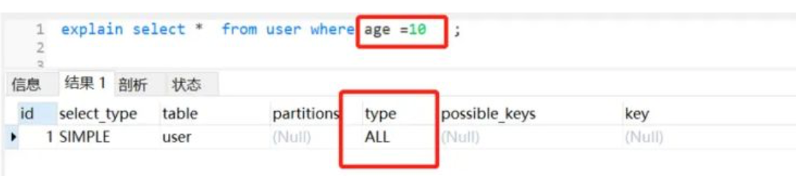

# SQL优化企业实战

### 1、查询SQL尽量不要使用select *，而是select具体字段。

反例子：

```sql
select * from employee;
```

正例子：

```sql
select id，name from employee;
```

理由：

- 只取需要的字段，节省资源、减少网络开销。
- select * 进行查询时，很可能就不会使用到覆盖索引了，就会造成回表查询。

### 2、如果知道查询结果只有一条或者只要最大/最小一条记录，建议用limit 1

假设现在有employee员工表，要找出一个名字叫jay的人.

```sql
CREATE TABLE `employee` (  `id` int(11) NOT NULL,  `name` varchar(255) DEFAULT NULL,  `age` int(11) DEFAULT NULL,  `date` datetime DEFAULT NULL,  `sex` int(1) DEFAULT NULL,  PRIMARY KEY (`id`)) ENGINE=InnoDB DEFAULT CHARSET=utf8;
```

反例：

```sql
select id，name from employee where name='jay'
```

正例

```sql
select id，name from employee where name='jay' limit 1;
```

理由：

- 加上limit 1后,只要找到了对应的一条记录,就不会继续向下扫描了,效率将会大大提高。
- 当然，如果name是唯一索引的话，是不必要加上limit 1了，因为limit的存在主要就是为了防止全表扫描，从而提高性能,如果一个语句本身可以预知不用全表扫描，有没有limit ，性能的差别并不大。

### 3、应尽量避免在where子句中使用or来连接条件

新建一个user表，它有一个普通索引userId，表结构如下：

```sql
CREATE TABLE `user` (  `id` int(11) NOT NULL AUTO_INCREMENT,  `userId` int(11) NOT NULL,  `age` int(11) NOT NULL,  `name` varchar(255) NOT NULL,  PRIMARY KEY (`id`),  KEY `idx_userId` (`userId`)) ENGINE=InnoDB DEFAULT CHARSET=utf8;
```

假设现在需要查询userid为1或者年龄为18岁的用户，很容易有以下SQL

反例:

```sql
select * from user where userid=1 or age =18
```

正例：

```sql
//使用union allselect * from user where userid=1 union allselect * from user where age = 18
//或者分开两条sql写：select * from user where userid=1select * from user where age = 18
```

理由：

- 使用or可能会使索引失效，从而全表扫描。

> 对于or+没有索引的age这种情况，假设它走了userId的索引，但是走到age查询条件时，它还得全表扫描，也就是需要三步过程：全表扫描+索引扫描+合并如果它一开始就走全表扫描，直接一遍扫描就完事。mysql是有优化器的，处于效率与成本考虑，遇到or条件，索引可能失效，看起来也合情合理。

### 4、优化limit分页

我们日常做分页需求时，一般会用 limit 实现，但是当偏移量特别大的时候，查询效率就变得低下。

反例：

```sql
select id，name，age from employee limit 10000，10
```

正例：

```sql
//方案一 ：返回上次查询的最大记录(偏移量)select id，name from employee where id>10000 limit 10.
//方案二：order by + 索引select id，name from employee order by id  limit 10000，10
//方案三：在业务允许的情况下限制页数：
```

理由：

- 当偏移量最大的时候，查询效率就会越低，因为Mysql并非是跳过偏移量直接去取后面的数据，而是先把偏移量+要取的条数，然后再把前面偏移量这一段的数据抛弃掉再返回的。
- 如果使用优化方案一，返回上次最大查询记录（偏移量），这样可以跳过偏移量，效率提升不少。
- 方案二使用order by+索引，也是可以提高查询效率的。
- 方案三的话，建议跟业务讨论，有没有必要查这么后的分页啦。因为绝大多数用户都不会往后翻太多页。

### 5、优化你的like语句

日常开发中，如果用到模糊关键字查询，很容易想到like，但是like很可能让你的索引失效。

反例：

```sql
select userId，name from user where userId like '%123';
```

正例：

```sql
select userId，name from user where userId like '123%';
```

理由：

- 把%放前面，并不走索引，如下： 

  

- 把% 放关键字后面，还是会走索引的。如下 :

  

### 6、使用where条件限定要查询的数据，避免返回多余的行

假设业务场景是这样：查询某个用户是否是会员。

Java 代码

反例：

```sql
List<Long> userIds = sqlMap.queryList("select userId from user where isVip=1");
boolean isVip = userIds.contains(userId);
```

正例：

```sql
Long userId = sqlMap.queryObject("select userId from user where userId='userId' and isVip='1' ")

boolean isVip = userId！=null;
```

理由：

- 需要什么数据，就去查什么数据，避免返回不必要的数据，节省开销。

### 7、尽量避免在索引列上使用mysql的内置函数

业务需求：查询最近七天内登陆过的用户(假设loginTime加了索引)

反例：

```sql
select userId,loginTime from loginuser where Date_ADD(loginTime,Interval 7 DAY) >=now();
```

正例：

```sql
explain  select userId,loginTime from loginuser where  loginTime >= Date_ADD(NOW(),INTERVAL - 7 DAY);
```

理由：

- 索引列上使用mysql的内置函数，索引失效


- 如果索引列不加内置函数，索引还是会走的。 

  

### 8、应尽量避免在where子句中对字段进行表达式操作，这将导致系统放弃使用索引而进行全表扫

反例：

```sql
select * from user where age-1 =10；
```

正例：

```sql
select * from user where age =11；
```

理由：

- 虽然age加了索引，但是因为对它进行运算，索引直接迷路了。。 

  

### 9、Inner join 、left join、right join，优先使用Inner join，如果是left join，左边表结果尽量小

> - Inner join 内连接，在两张表进行连接查询时，只保留两张表中完全匹配的结果集
> - left join 在两张表进行连接查询时，会返回左表所有的行，即使在右表中没有匹配的记录。
> - right join 在两张表进行连接查询时，会返回右表所有的行，即使在左表中没有匹配的记录。

都满足SQL需求的前提下，推荐优先使用Inner join（内连接），如果要使用left join，左边表数据结果尽量小，如果有条件的尽量放到左边处理。

反例:

```sql
select * from tab1 t1 left join tab2 t2  on t1.size = t2.size where t1.id>2;
```

正例：

```sql
select * from (select * from tab1 where id >2) t1 left join tab2 t2 on t1.size = t2.size;
```

理由：

- 如果inner join是等值连接，或许返回的行数比较少，所以性能相对会好一点。
- 同理，使用了左连接，左边表数据结果尽量小，条件尽量放到左边处理，意味着返回的行数可能比较少。

### 10、应尽量避免在where子句中使用!=或<>操作符，否则将引擎放弃使用索引而进行全表扫描。

反例：

```sql
select age,name  from user where age <>18;
```

正例：

```sql
//可以考虑分开两条sql写select age,name  from user where age <18;select age,name  from user where age >18;
```

理由：

- 使用!=和<>很可能会让索引失效


### 11、使用联合索引时，注意索引列的顺序，一般遵循最左匹配原则。

表结构：（有一个联合索引idxuseridage，userId在前，age在后）

```sql
CREATE TABLE `user` (  `id` int(11) NOT NULL AUTO_INCREMENT,  `userId` int(11) NOT NULL,  `age` int(11) DEFAULT NULL,  `name` varchar(255) NOT NULL,  PRIMARY KEY (`id`),  KEY `idx_userid_age` (`userId`,`age`) USING BTREE) ENGINE=InnoDB AUTO_INCREMENT=2 DEFAULT CHARSET=utf8;
```

反例：

```sql
select * from user where age = 10;
```



正例：

```sql
//符合最左匹配原则select * from user where userid=10 and age =10；//符合最左匹配原则select * from user where userid =10;
```


理由：

- 当我们创建一个联合索引的时候，如(k1,k2,k3)，相当于创建了（k1）、(k1,k2)和(k1,k2,k3)三个索引，这就是最左匹配原则。
- 联合索引不满足最左原则，索引一般会失效，但是这个还跟Mysql优化器有关的。

### 12、对查询进行优化，应考虑在where及order by涉及的列上建立索引，尽量避免全表扫描。

反例：

```sql
select * from user where address ='深圳' order by age ;
```

正例：

```sql
添加索引alter table user add index idx_address_age (address,age)
```


### 13、如果插入数据过多，考虑批量插入。

反例：

```sh
for(User u :list){ INSERT into user(name,age) values(#name#,#age#)}
```

正例：

```sql
//一次500批量插入，分批进行
insert into user(name,age) values
<foreach collection="list" item="user" index="index" separator=",">  
(#{user.name},#{user.age})
</foreach>

insert into user(name,age) values("zs",20),("ls",21)
```

理由：

- 批量插入性能好，更加省时间

> 打个比喻:假如你需要搬一万块砖到楼顶,你有一个电梯,电梯一次可以放适量的砖（最多放500）,你可以选择一次运送一块砖,也可以一次运送500块砖,你觉得哪个时间消耗大?

### 14、在适当的时候，使用覆盖索引。

覆盖索引能够使得你的SQL语句不需要回表，仅仅访问索引就能够得到所有需要的数据，大大提高了查询效率。

反例：

```sql
// like模糊查询，不走索引了select * from user where userid like '%123%'
```


正例：

```sql
//id为主键，那么为普通索引，即覆盖索引登场了。select id,name from user where userid like '%123%';
```


### 15、慎用distinct关键字

distinct 关键字一般用来过滤重复记录，以返回不重复的记录。在查询一个字段或者很少字段的情况下使用时，给查询带来优化效果。但是在字段很多的时候使用，却会大大降低查询效率。

反例：

```sql
SELECT DISTINCT * from  user;
```

正例：

```sql
select DISTINCT name from user;
```

理由：

- 带distinct的语句cpu时间和占用时间都高于不带distinct的语句。因为当查询很多字段时，如果使用distinct，数据库引擎就会对数据进行比较，过滤掉重复数据，然而这个比较、过滤的过程会占用系统资源，cpu时间。

### 16、删除冗余和重复索引

反例：

```sql
  KEY `idx_userId` (`userId`)    KEY `idx_userId_age` (`userId`,`age`)
```

正例:

```sql
  //删除userId索引，因为组合索引（A，B）相当于创建了（A）和（A，B）索引  KEY `idx_userId_age` (`userId`,`age`)
```

理由：

- 重复的索引需要维护，并且优化器在优化查询的时候也需要逐个地进行考虑，这会影响性能的。

### 17、如果数据量较大，优化你的修改/删除语句。

避免同时修改或删除过多数据，因为会造成cpu利用率过高，从而影响别人对数据库的访问。

反例：

```sql
//一次删除10万或者100万+？delete from user where id <100000;//或者采用单一循环操作，效率低，时间漫长for（User user：list）{   delete from user； }
```

正例：

```sql
//分批进行删除,如每次500delete user where id<500delete product where id>=500 and id<1000；
```

理由：

- 一次性删除太多数据，可能会有lock wait timeout exceed的错误，所以建议分批操作。

### 18、where子句中考虑使用默认值代替null。

反例：

```sql
select * from user where age is not null;
```


正例：

```sql
//设置0为默认值select * from user where age>0;
```


理由：

- 并不是说使用了is null 或者 is not null 就会不走索引了，这个跟mysql版本以及查询成本都有关。

> 如果mysql优化器发现，走索引比不走索引成本还要高，肯定会放弃索引，这些条件 `！=，>isnull，isnotnull`经常被认为让索引失效，其实是因为一般情况下，查询的成本高，优化器自动放弃索引的。

* 如果把null值，换成默认值，很多时候让走索引成为可能，同时，表达意思会相对清晰一点。

### 19、不要有超过5个以上的表连接

- 连表越多，编译的时间和开销也就越大。
- 把连接表拆开成较小的几个执行，可读性更高。
- 如果一定需要连接很多表才能得到数据，那么意味着糟糕的设计了。

### 20、exist&in的合理利用

假设表A表示某企业的员工表，表B表示部门表，查询所有部门的所有员工，很容易有以下SQL:

```sql
select * from A where deptId in (select deptId from B);
```

这样写等价于：

> 先查询部门表B
>
> select deptId from B
>
> 再由部门deptId，查询A的员工
>
> select * from A where A.deptId = B.deptId

可以抽象成这样的一个循环：

```java
   List<> resultSet ;   
for(int i=0;i<B.length;i++) {        
  for(int j=0;j<A.length;j++) {      
    if(A[i].id==B[j].id) {           
      resultSet.add(A[i]);            
      break;         
    }      
  }    
}
```

显然，除了使用in，我们也可以用exists实现一样的查询功能，如下：

```sql
select * from A where exists (select 1 from B where A.deptId = B.deptId);
```

因为exists查询的理解就是，先执行主查询，获得数据后，再放到子查询中做条件验证，根据验证结果（true或者false），来决定主查询的数据结果是否得意保留。

那么，这样写就等价于：

> select * from A,先从A表做循环
>
> select * from B where A.deptId = B.deptId,再从B表做循环.

同理，可以抽象成这样一个循环：

```java
List<> resultSet ;    
for(int i=0;i<A.length;i++) {          
  for(int j=0;j<B.length;j++) {          
    if(A[i].deptId==B[j].deptId) {             
      resultSet.add(A[i]);             
      break;          
    }      
  }    
}
```

数据库最费劲的就是跟程序链接释放。假设链接了两次，每次做上百万次的数据集查询，查完就走，这样就只做了两次；相反建立了上百万次链接，申请链接释放反复重复，这样系统就受不了了。即mysql优化原则，就是小表驱动大表，小的数据集驱动大的数据集，从而让性能更优。

因此，我们要选择最外层循环小的，也就是，如果**B的数据量小于A，适合使用in，如果B的数据量大于A，即适合选择exist**。

### 21、尽量用union all替换 union

如果检索结果中不会有重复的记录，推荐union all 替换 union。

反例：

```sql
select * from user where userid=1 union  select * from user where age = 10
```

正例：

```sql
select * from user where userid=1 union all select * from user where age = 10
```

理由：

- 如果使用union，不管检索结果有没有重复，都会尝试进行合并，然后在输出最终结果前进行排序。如果已知检索结果没有重复记录，使用union all 代替union，这样会提高效率。

### 22、索引不宜太多，一般5个以内。

- 索引并不是越多越好，索引虽然提高了查询的效率，但是也降低了插入和更新的效率。
- insert或update时有可能会重建索引，所以建索引需要慎重考虑，视具体情况来定。
- 一个表的索引数最好不要超过5个，若太多需要考虑一些索引是否没有存在的必要。

### 23、尽量使用数字型字段，若只含数值信息的字段尽量不要设计为字符型

反例：

```sql
`king_id` varchar（20） NOT NULL COMMENT '守护者Id'
```

正例：

```sql
 `king_id` int(11) NOT NULL COMMENT '守护者Id'
```

理由：

- 相对于数字型字段，字符型会降低查询和连接的性能，并会增加存储开销。

### 24、索引不适合建在有大量重复数据的字段上，如性别这类型数据库字段。

因为SQL优化器是根据表中数据量来进行查询优化的，如果索引列有大量重复数据，Mysql查询优化器推算发现不走索引的成本更低，很可能就放弃索引了。

### 25、尽量避免向客户端返回过多数据量。

假设业务需求是，用户请求查看自己最近一年观看过的直播数据。

反例：

```sql
//一次性查询所有数据回来select * from LivingInfo where watchId =useId and watchTime >= Date_sub(now(),Interval 1 Y)
```

正例：

```sql
//分页查询select * from LivingInfo where watchId =useId and watchTime>= Date_sub(now(),Interval 1 Y) limit offset，pageSize
//如果是前端分页，可以先查询前两百条记录，因为一般用户应该也不会往下翻太多页，select * from LivingInfo where watchId =useId and watchTime>= Date_sub(now(),Interval 1 Y) limit 200 ;
```

### 26、当在SQL语句中连接多个表时,请使用表的别名，并把别名前缀于每一列上，这样语义更加清晰。

反例：

```sql
select  * from A innerjoin B on A.deptId = B.deptId;
```

正例：

```sql
select  memeber.name,deptment.deptName from A member innerjoin B deptment on member.deptId = deptment.deptId;
```

### 27、尽可能使用varchar/nvarchar 代替 char/nchar。

反例：

```sql
  `deptName` char(100) DEFAULT NULL COMMENT '部门名称'
```

正例：

```sql
  `deptName` varchar(100) DEFAULT NULL COMMENT '部门名称'
```

理由：

- 因为首先变长字段存储空间小，可以节省存储空间。
- 其次对于查询来说，在一个相对较小的字段内搜索，效率更高。

### 28、为了提高group by 语句的效率，可以在执行到该语句前，把不需要的记录过滤掉。

反例：

```sql
select job，avg（salary） from employee  group by job having job ='president' or job = 'managent'
```

正例：

```sql
select job，avg（salary） from employee where job ='president' or job = 'managent' group by job；
```

### 29、如果字段类型是字符串，where时一定用引号括起来，否则索引失效

反例：

```sql
select * from user where userid =123;
```


正例：

```sql
select * from user where userid ='123';
```

理由：

- 为什么第一条语句未加单引号就不走索引了呢？这是因为不加单引号时，是字符串跟数字的比较，它们类型不匹配，MySQL会做隐式的类型转换，把它们转换为浮点数再做比较。

### 30、使用explain 分析你SQL的计划

日常开发写SQL的时候，尽量养成一个习惯吧。用explain分析一下你写的SQL，尤其是走不走索引这一块。

```sql
explain select * from user where userid =10086 or age =18;
```


# SQL优化

### 1 大批量插入数据

环境准备 ：

当使用load 命令导入数据的时候，适当的设置可以提高导入的效率。

```
Handler_read_first：索引中第一条被读的次数。如果较高，表示服务器正执行大量全索引扫描（这个值越低
越好）。
```
```
Handler_read_key：如果索引正在工作，这个值代表一个行被索引值读的次数，如果值越低，表示索引得到的
性能改善不高，因为索引不经常使用（这个值越高越好）。
```
```
Handler_read_next ：按照键顺序读下一行的请求数。如果你用范围约束或如果执行索引扫描来查询索引列，
该值增加。
```
```
Handler_read_prev：按照键顺序读前一行的请求数。该读方法主要用于优化ORDER BY ... DESC。
```
```
Handler_read_rnd ：根据固定位置读一行的请求数。如果你正执行大量查询并需要对结果进行排序该值较高。
你可能使用了大量需要MySQL扫描整个表的查询或你的连接没有正确使用键。这个值较高，意味着运行效率低，应
该建立索引来补救。
```
```
Handler_read_rnd_next：在数据文件中读下一行的请求数。如果你正进行大量的表扫描，该值较高。通常说
明你的表索引不正确或写入的查询没有利用索引。
```
```
CREATE TABLE `tb_user_ 2 ` (
`id` int( 11 ) NOT NULL AUTO_INCREMENT,
`username` varchar( 45 ) NOT NULL,
`password` varchar( 96 ) NOT NULL,
`name` varchar( 45 ) NOT NULL,
`birthday` datetime DEFAULT NULL,
`sex` char( 1 ) DEFAULT NULL,
`email` varchar( 45 ) DEFAULT NULL,
`phone` varchar( 45 ) DEFAULT NULL,
`qq` varchar( 32 ) DEFAULT NULL,
`status` varchar( 32 ) NOT NULL COMMENT '用户状态',
`create_time` datetime NOT NULL,
`update_time` datetime DEFAULT NULL,
PRIMARY KEY (`id`),
UNIQUE KEY `unique_user_username` (`username`)
) ENGINE=InnoDB DEFAULT CHARSET=utf 8 ;
```

对于 InnoDB 类型的表，有以下几种方式可以提高导入的效率：

1 ） 主键顺序插入

因为InnoDB类型的表是按照主键的顺序保存的，所以将导入的数据按照主键的顺序排列，可以有效的提高导入数

据的效率。如果InnoDB表没有主键，那么系统会自动默认创建一个内部列作为主键，所以如果可以给表创建一个

主键，将可以利用这点，来提高导入数据的效率。

插入ID顺序排列数据：

插入ID无序排列数据：

2 ） 关闭唯一性校验

在导入数据前执行 SET UNIQUE_CHECKS=0，关闭唯一性校验，在导入结束后执行SET UNIQUE_CHECKS=1，恢

复唯一性校验，可以提高导入的效率。

脚本文件介绍 :

```
sql 1 .log - ---> 主键有序
sql 2 .log - ---> 主键无序
```

3 ） 手动提交事务

如果应用使用自动提交的方式，建议在导入前执行 SET AUTOCOMMIT=0，关闭自动提交，导入结束后再执行 SET

AUTOCOMMIT=1，打开自动提交，也可以提高导入的效率。

### 2 优化insert语句

当进行数据的insert操作的时候，可以考虑采用以下几种优化方案。

如果需要同时对一张表插入很多行数据时，应该尽量使用多个值表的insert语句，这种方式将大大的缩减客户

端与数据库之间的连接、关闭等消耗。使得效率比分开执行的单个insert语句快。

示例， 原始方式为：

优化后的方案为 ：

在事务中进行数据插入。

数据有序插入

优化后

```
insert into tb_test values( 1 ,'Tom');
insert into tb_test values( 2 ,'Cat');
insert into tb_test values( 3 ,'Jerry');
```
```
1 insert into tb_test values( 1 ,'Tom'),( 2 ,'Cat')，( 3 ,'Jerry');
```
```
start transaction;
insert into tb_test values( 1 ,'Tom');
insert into tb_test values( 2 ,'Cat');
insert into tb_test values( 3 ,'Jerry');
commit;
```
```
insert into tb_test values( 4 ,'Tim');
insert into tb_test values( 1 ,'Tom');
insert into tb_test values( 3 ,'Jerry');
insert into tb_test values( 5 ,'Rose');
insert into tb_test values( 2 ,'Cat');
```
### 3 优化order by语句

5.3.1 环境准备

5.3.2 两种排序方式

1). 第一种是通过对返回数据进行排序，也就是通常说的 filesort 排序，所有不是通过索引直接返回排序结果的排序

都叫 FileSort 排序。

2). 第二种通过有序索引顺序扫描直接返回有序数据，这种情况即为 using index，不需要额外排序，操作效率高。

```
insert into tb_test values( 1 ,'Tom');
insert into tb_test values( 2 ,'Cat');
insert into tb_test values( 3 ,'Jerry');
insert into tb_test values( 4 ,'Tim');
insert into tb_test values( 5 ,'Rose');
```
```
CREATE TABLE `emp` (
`id` int( 11 ) NOT NULL AUTO_INCREMENT,
`name` varchar( 100 ) NOT NULL,
`age` int( 3 ) NOT NULL,
`salary` int( 11 ) DEFAULT NULL,
PRIMARY KEY (`id`)
) ENGINE=InnoDB DEFAULT CHARSET=utf 8 mb 4 ;
```
```
insert into `emp` (`id`, `name`, `age`, `salary`) values(' 1 ','Tom',' 25 ',' 2300 ');
insert into `emp` (`id`, `name`, `age`, `salary`) values(' 2 ','Jerry',' 30 ',' 3500 ');
insert into `emp` (`id`, `name`, `age`, `salary`) values(' 3 ','Luci',' 25 ',' 2800 ');
insert into `emp` (`id`, `name`, `age`, `salary`) values(' 4 ','Jay',' 36 ',' 3500 ');
insert into `emp` (`id`, `name`, `age`, `salary`) values(' 5 ','Tom 2 ',' 21 ',' 2200 ');
insert into `emp` (`id`, `name`, `age`, `salary`) values(' 6 ','Jerry 2 ',' 31 ',' 3300 ');
insert into `emp` (`id`, `name`, `age`, `salary`) values(' 7 ','Luci 2 ',' 26 ',' 2700 ');
insert into `emp` (`id`, `name`, `age`, `salary`) values(' 8 ','Jay 2 ',' 33 ',' 3500 ');
insert into `emp` (`id`, `name`, `age`, `salary`) values(' 9 ','Tom 3 ',' 23 ',' 2400 ');
insert into `emp` (`id`, `name`, `age`, `salary`)
values(' 10 ','Jerry 3 ',' 32 ',' 3100 ');
insert into `emp` (`id`, `name`, `age`, `salary`) values(' 11 ','Luci 3 ',' 26 ',' 2900 ');
insert into `emp` (`id`, `name`, `age`, `salary`) values(' 12 ','Jay 3 ',' 37 ',' 4500 ');
```
```
create index idx_emp_age_salary on emp(age,salary);
```

多字段排序

了解了MySQL的排序方式，优化目标就清晰了：尽量减少额外的排序，通过索引直接返回有序数据。where 条件

和Order by 使用相同的索引，并且Order By 的顺序和索引顺序相同， 并且Order by 的字段都是升序，或者都是

降序。否则肯定需要额外的操作，这样就会出现FileSort。

5.3.3 Filesort 的优化

通过创建合适的索引，能够减少 Filesort 的出现，但是在某些情况下，条件限制不能让Filesort消失，那就需要加

快 Filesort的排序操作。对于Filesort ， MySQL 有两种排序算法：

1 ） 两次扫描算法 ：MySQL4.1 之前，使用该方式排序。首先根据条件取出排序字段和行指针信息，然后在排序区

sort buffer 中排序，如果sort buffer不够，则在临时表 temporary table 中存储排序结果。完成排序之后，再根据

行指针回表读取记录，该操作可能会导致大量随机I/O操作。


2 ）一次扫描算法：一次性取出满足条件的所有字段，然后在排序区 sort buffer 中排序后直接输出结果集。排序时

内存开销较大，但是排序效率比两次扫描算法要高。

MySQL 通过比较系统变量 max_length_for_sort_data 的大小和Query语句取出的字段总大小， 来判定是否那种排

序算法，如果max_length_for_sort_data 更大，那么使用第二种优化之后的算法；否则使用第一种。

可以适当提高 sort_buffer_size 和 max_length_for_sort_data 系统变量，来增大排序区的大小，提高排序的效

率。

### 4 优化group by 语句

由于GROUP BY 实际上也同样会进行排序操作，而且与ORDER BY 相比，GROUP BY 主要只是多了排序之后的分

组操作。当然，如果在分组的时候还使用了其他的一些聚合函数，那么还需要一些聚合函数的计算。所以，在

GROUP BY 的实现过程中，与 ORDER BY 一样也可以利用到索引。

如果查询包含 group by 但是用户想要避免排序结果的消耗， 则可以执行order by null 禁止排序。如下 ：

优化后

从上面的例子可以看出，第一个SQL语句需要进行"filesort"，而第二个SQL由于order by null 不需要进行

"filesort"， 而上文提过Filesort往往非常耗费时间。

```
drop index idx_emp_age_salary on emp;
```
```
explain select age,count(*) from emp group by age;
```
```
1 explain select age,count(*) from emp group by age order by null;
```

创建索引 ：

### 5 优化嵌套查询

Mysql4.1版本之后，开始支持SQL的子查询。这个技术可以使用SELECT语句来创建一个单列的查询结果，然后把

这个结果作为过滤条件用在另一个查询中。使用子查询可以一次性的完成很多逻辑上需要多个步骤才能完成的SQL

操作，同时也可以避免事务或者表锁死，并且写起来也很容易。但是，有些情况下，子查询是可以被更高效的连接

（JOIN）替代。

示例 ，查找有角色的所有的用户信息 :

执行计划为 :

优化后 :

连接(Join)查询之所以更有效率一些 ，是因为MySQL不需要在内存中创建临时表来完成这个逻辑上需要两个步骤的

查询工作。

### 6 优化OR条件

```
1 create index idx_emp_age_salary on emp(age,salary)；
```
```
1 explain select * from t_user where id in (select user_id from user_role );
```
```
1 explain select * from t_user u , user_role ur where u.id = ur.user_id;
```

对于包含OR的查询子句，如果要利用索引，则OR之间的每个条件列都必须用到索引 ， 而且不能使用到复合索

引； 如果没有索引，则应该考虑增加索引。

获取 emp 表中的所有的索引 ：

示例 ：

建议使用 union 替换 or ：

我们来比较下重要指标，发现主要差别是 type 和 ref 这两项

type 显示的是访问类型，是较为重要的一个指标，结果值从好到坏依次是：

UNION 语句的 type 值为 ref，OR 语句的 type 值为 range，可以看到这是一个很明显的差距

UNION 语句的 ref 值为 const，OR 语句的 type 值为 null，const 表示是常量值引用，非常快

这两项的差距就说明了 UNION 要优于 OR 。

(^1) explain select * from emp where id = 1 or age = 30 ;
system > const > eq_ref > ref > fulltext > ref_or_null > index_merge >
unique_subquery > index_subquery > range > index > ALL

1


### 7 优化分页查询

一般分页查询时，通过创建覆盖索引能够比较好地提高性能。一个常见又非常头疼的问题就是 limit 2000000,10 ，

此时需要MySQL排序前 2000010 记录，仅仅返回2000000 - 2000010 的记录，其他记录丢弃，查询排序的代价非

常大 。

5.7.1 优化思路一

在索引上完成排序分页操作，最后根据主键关联回原表查询所需要的其他列内容。

5.7.2 优化思路二

该方案适用于主键自增的表，可以把Limit 查询转换成某个位置的查询 。

### 8 使用SQL提示

SQL提示，是优化数据库的一个重要手段，简单来说，就是在SQL语句中加入一些人为的提示来达到优化操作的目

的。

5.8.1 USE INDEX

在查询语句中表名的后面，添加 use index 来提供希望MySQL去参考的索引列表，就可以让MySQL不再考虑其他

可用的索引。

```
1 create index idx_seller_name on tb_seller(name);
```

5.8.2 IGNORE INDEX

如果用户只是单纯的想让MySQL忽略一个或者多个索引，则可以使用 ignore index 作为 hint 。

5.8.3 FORCE INDEX

为强制MySQL使用一个特定的索引，可在查询中使用 force index 作为hint 。

```
explain select * from tb_seller ignore index(idx_seller_name) where name = '小米科
技';
```
```
1 create index idx_seller_address on tb_seller(address);
```
