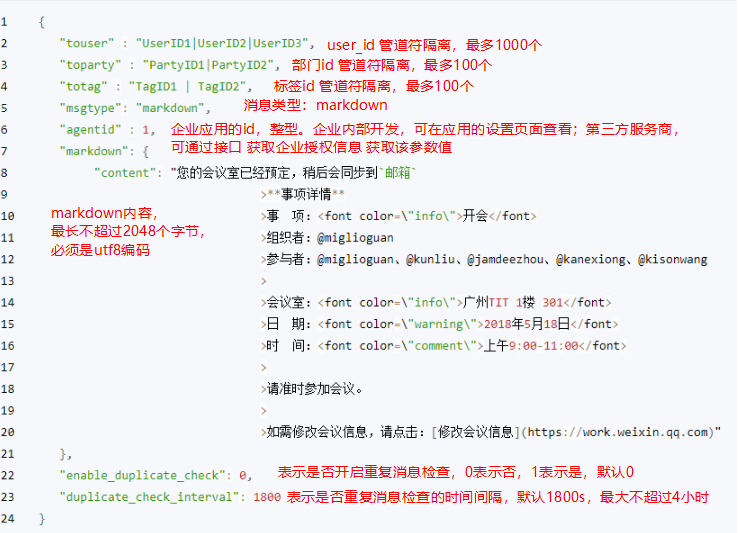

[发送应用消息 - 文档 - 企业微信开发者中心 (qq.com)](https://developer.work.weixin.qq.com/document/path/90236)

注：**"msgtype"**:**"text"**,  <a></a> 标签不要加 target=\"_blank\" 安卓会打不开链接，苹果可以

```java
"&tab=1\"\ttarget=\"_blank\">"
```



目前应用消息中支持的markdown语法是如下的子集：

1. 标题 （支持1至6级标题，注意#与文字中间要有空格）

```xml
# 标题一
## 标题二

### 标题三

#### 标题四

##### 标题五

###### 标题六
```

2.加粗

```sh
**bold**
```

3.链接

```sh
[这是一个链接](http://work.weixin.qq.com/api/doc)
```

4. 行内代码段（暂不支持跨行）

```sh
`code`
```

5. 引用

```sh
> 引用文字
```

6. 字体颜色(只支持3种内置颜色)

```sh
<font color="info">绿色</font>
<font color="comment">灰色</font>
<font color="warning">橙红色</font>
```