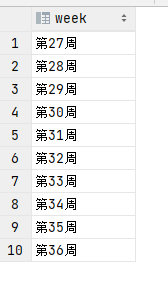

# PostgreSQL

- 时间类
- 算法
- 其他函数

# 时间类

## PostgreSQL 两个日期的时间差（小时）

```sql
select round(cast(date_part('epoch', '2022-10-10 10:00:00'::timestamp - '2022-10-10 09:00:00'::timestamp)/60/60 as numeric ),1) as h;
```

## PostgreSQL 两个日期的时间差（天、小时、分钟）
```sql
select
    interval_value,
    date_part( 'day', interval_value ) as 总天,
    date_part( 'day', interval_value ) * 24 + date_part( 'hour', interval_value ) as 总小时,
    date_part( 'day', interval_value ) * 24 * 60 + date_part( 'hour', interval_value ) * 60 + date_part( 'minute', interval_value ) as 总分钟
from
    ( select ('2023-02-13 11:31'::timestamp - '2022-02-12 10:30'::timestamp) as interval_value ) s;
```

## PostgreSQL 两个日期的时间差（除去周六、周日）

### 小时
```sql
SELECT hour 小时, stdays 周六,sundays as 周天, hour - (stdays+sundays)*24 AS days_without_sundays
FROM  (
          SELECT date_part('epoch', z - a + '1 day') / 60 / 60 AS hour
               , ((z::date - a::date) + EXTRACT(isodow FROM a::date)::int - 1 ) / 7 AS sundays
               , ((z::date - a::date) + EXTRACT(isodow FROM a::date)::int - 1 ) / 7 AS stdays
          FROM  (SELECT timestamp '2023-03-24 12:00:00' AS a       -- your interval here
                      , timestamp '2023-03-28 13:00:00' AS z) tbl
      ) sub
```

| 总小时 | 几个周六 | 几个周日 | 去除周六日实际时间 |
| :----: | :------: | :------: | :----------------: |
|  121   |    1     |    1     |         73         |


### 天

```sql
SELECT days 总天数, stdays 几个周六,sundays as 几个周天, days - (stdays+sundays) AS 去除周六日实际时间
FROM  (
          SELECT z - a +1 AS days
               , ((z - a) + EXTRACT(isodow FROM a)::int - 1 ) / 7 AS sundays
               , ((z - a) + EXTRACT(isodow FROM a)::int - 1 ) / 7 AS stdays
          FROM  (SELECT date '2023-03-24' AS a       -- your interval here
                      , date '2023-03-28' AS z) tbl
      ) sub
```

| 总天数 | 几个周六 | 几个周日 | 去除周六日实际时间 |
| :----: | :------: | :------: | :----------------: |
|  5   |    1     |    1     |         3         |


## postgresql中日期本月、本周、本季度、昨天、近几个月等

### 本月一号

```sql
select date_trunc('month',now());
-- 2022-10-01 00:00:00.000000 +00:00
```

### 下个月一号

```sql
select date_trunc('month',now()+ interval '1 month');
-- 2022-11-01 00:00:00.000000 +00:00s
```

### 本季度一号

```sql
select date_trunc('quarter','2023-06-15'::timestamp)
-- 2023-04-01 00:00:00.000000
```
### 上季度一号

```sql
select date_trunc('quarter','2023-06-15'::timestamp + interval '-3 month');
-- 2022-10-01 00:00:00.000000 +00:00
```

## 从某某月到某某月

### 前12月的月初

```sql
SELECT
    to_char(now() - series.n * '1 month'::interval, 'month') AS "month",
    tstzrange(
                date_trunc('month', now()) - series.n * '1 month'::interval,
                date_trunc('month', now()) - (series.n - 1) * '1 month'::interval,
                '[]'
        ) AS range_dates
FROM (
         SELECT generate_series(0, 11) AS n
     ) AS series
```

```sql
october  ,"[""2022-10-01 00:00:00+00"",""2022-11-01 00:00:00+00""]"
september,"[""2022-09-01 00:00:00+00"",""2022-10-01 00:00:00+00""]"
august   ,"[""2022-08-01 00:00:00+00"",""2022-09-01 00:00:00+00""]"
july     ,"[""2022-07-01 00:00:00+00"",""2022-08-01 00:00:00+00""]"
june     ,"[""2022-06-01 00:00:00+00"",""2022-07-01 00:00:00+00""]"
may      ,"[""2022-05-01 00:00:00+00"",""2022-06-01 00:00:00+00""]"
april    ,"[""2022-04-01 00:00:00+00"",""2022-05-01 00:00:00+00""]"
march    ,"[""2022-03-01 00:00:00+00"",""2022-04-01 00:00:00+00""]"
february ,"[""2022-02-01 00:00:00+00"",""2022-03-01 00:00:00+00""]"
january  ,"[""2022-01-01 00:00:00+00"",""2022-02-01 00:00:00+00""]"
december ,"[""2021-12-01 00:00:00+00"",""2022-01-01 00:00:00+00""]"
november ,"[""2021-11-01 00:00:00+00"",""2021-12-01 00:00:00+00""]"
```
### 前12个月 年-月-日
```sql
select
    date_trunc('month', now()) - series.n * '1 month'::interval as time
from (select generate_series(0, 11) as n) as series;
```

```sql
2022-10-01 00:00:00.000000 +00:00
2022-09-01 00:00:00.000000 +00:00
2022-08-01 00:00:00.000000 +00:00
2022-07-01 00:00:00.000000 +00:00
2022-06-01 00:00:00.000000 +00:00
2022-05-01 00:00:00.000000 +00:00
2022-04-01 00:00:00.000000 +00:00
2022-03-01 00:00:00.000000 +00:00
2022-02-01 00:00:00.000000 +00:00
2022-01-01 00:00:00.000000 +00:00
2021-12-01 00:00:00.000000 +00:00
2021-11-01 00:00:00.000000 +00:00
```

### 前12个月 年-月

```sh
select
    to_char(date_trunc('month', now()) - series.n * '1 month'::interval,'yyyy-mm') as time
from (select generate_series(0, 11) as n) as series;
```

```sql
2022-10
2022-09
2022-08
2022-07
2022-06
2022-05
2022-04
2022-03
2022-02
2022-01
2021-12
2021-11

```

### 从某某月到某某月

```sql
select to_char(m, 'yyyy-mm') as month from generate_series(to_date('2022-01-01', 'yyyy-mm-dd'),
                     to_date('2023-03-31', 'yyyy-mm-dd'), '1 month') m;
```

```sql
2022-01
2022-02
2022-03
2022-04
2022-05
2022-06
2022-07
2022-08
2022-09
2022-10
2022-11
2022-12
2023-01
2023-02
2023-03
```


## pgsql获取两个日期之间的所有日期

```sql
select daytime::date from generate_series(

                                  to_date('2018-04-03','yyyy-mm-dd'), --开始日期
                                  to_date('2018-04-10','yyyy-mm-dd'), --结束日期

                                  '1 day' –间隔（可根据需求调整）

                              ) s(daytime);

select to_char(daytime::date, 'yyyy-mm-dd') from generate_series(

                                                      to_date('2018-04-03','yyyy-mm-dd'),
                                                      to_date('2018-04-10','yyyy-mm-dd'),

                                                      '1 day'

                                                  ) s (daytime);
```

```sql
2018-04-03
2018-04-04
2018-04-05
2018-04-06
2018-04-07
2018-04-08
2018-04-09
2018-04-10
```

### 获取周一~周日

```java
--从周日开始，且周日为1，
SELECT to_char('2022-09-03'::timestamp + interval '-1 d', 'D');
SELECT to_char('2022-09-04'::timestamp + interval '-1 d', 'D');
SELECT to_char('2022-09-05'::timestamp + interval '-1 d', 'D');
SELECT to_char('2022-09-06'::timestamp + interval '-1 d', 'D');
SELECT to_char('2022-09-07'::timestamp + interval '-1 d', 'D');
SELECT to_char('2022-09-08'::timestamp + interval '-1 d', 'D');
SELECT to_char('2022-09-09'::timestamp + interval '-1 d', 'D');
SELECT to_char('2022-09-22'::timestamp + interval '-1 day', 'D');
--从周日开始，且周日为0，06
SELECT extract(DOW FROM '2022-09-15'::timestamp + interval '-1 d');
SELECT extract(DOW FROM '2022-09-16'::timestamp);
SELECT extract(DOW FROM '2022-09-17'::timestamp);
SELECT extract(DOW FROM '2022-09-18'::timestamp);
SELECT extract(DOW FROM '2022-09-19'::timestamp);
SELECT extract(DOW FROM '2022-09-20'::timestamp);
SELECT extract(DOW FROM '2022-09-21'::timestamp);
SELECT extract(DOW FROM '2022-09-22'::timestamp);
```

### 判断是星期几

```sql
select extract(DOW FROM '2022-03-13 00:00:00'::date) in (4,5)
```

### 前几个月

```sql
select '第' || generate_series(
        extract(month from '2023-12-01'::timestamp - interval '11 month')::integer, -- 起始月
        extract(month from '2023-12-01'::timestamp)::integer, -- 起始月
        1) || '月' as week; -- 递增step
```

```sql
第1月
第2月
第3月
第4月
第5月
第6月
第7月
第8月
第9月
第10月
第11月
第12月
```


### 最近几周

```
-- 获取第一个日期的周数，然后递增1，直到与最后一个日期的周数相同
select '第'|| generate_series(
              extract (week from now()-interval '9 week')::integer,  -- 起始周
              extract (week from now())::integer,  -- 结束周
              1) || '周' as week; -- 递增step
```

```sql
第2周
第3周
第4周
第5周
第6周
第7周
第8周
第9周
第10周
第11周
```

# 算法

## 语法-除法

注：加了 ::numeric 才有小数点后面 2 位数

```sql
select  (round((2::numeric/17::numeric),2));
```

# 其他函数

## 字符串拆分列

```sql
select regexp_split_to_table('1,2,3,4',',')
```

```sql
1
2
3
4
```


## union all 联合

- union all全部

- union 去重

```
select a.repair_date,
       COALESCE(b.count, 0) as count
from(
        SELECT TO_CHAR(NOW(), 'YYYY-MM') as repair_date
        union all
        SELECT TO_CHAR(NOW() - INTERVAL '1 MONTH', 'YYYY-MM') as repair_date
        union all
        SELECT TO_CHAR(NOW() - INTERVAL '2 MONTH', 'YYYY-MM') as repair_date
        union all
        SELECT TO_CHAR(NOW() - INTERVAL '3 MONTH', 'YYYY-MM') as repair_date
        union all
        SELECT TO_CHAR(NOW() - INTERVAL '4 MONTH', 'YYYY-MM') as repair_date
        union all
        SELECT TO_CHAR(NOW() - INTERVAL '5 MONTH', 'YYYY-MM') as repair_date
        union all
        SELECT TO_CHAR(NOW() - INTERVAL '6 MONTH', 'YYYY-MM') as repair_date
        union all
        SELECT TO_CHAR(NOW() - INTERVAL '7 MONTH', 'YYYY-MM') as repair_date
        union all
        SELECT TO_CHAR(NOW() - INTERVAL '8 MONTH', 'YYYY-MM') as repair_date
        union all
        SELECT TO_CHAR(NOW() - INTERVAL '9 MONTH', 'YYYY-MM') as repair_date
        union all
        SELECT TO_CHAR(NOW() - INTERVAL '10 MONTH', 'YYYY-MM') as repair_date
        union all
        SELECT TO_CHAR(NOW() - INTERVAL '11 MONTH', 'YYYY-MM') as repair_date) a
        left join(
    select d1.main_teamid,to_char(create_time::DATE, 'YYYY-MM') as month,
           cast(date_part('epoch',(avg(d1.online_time - d2.opt_time))/60/60) as decimal (18,2)) as timecha
    from dps_demand d1 inner join dps_demand_record d2 on d1.id =d2.opt_id
    where  d2.demand_status = 7
      and d1.is_deleted = 0 and d1.create_time >= (select to_char(now() + interval '-5 month','YYYY-MM-01') as month group by month order by month)::TIMESTAMP
    group by month,main_teamid order by month

                               ) b on a.repair_date= b.month
order by a.repair_date;
```

```
select departid as teamid from dps_user where id = 2 union select teamid from dps_team_user where userid = 2
```

把同字段整合一起


## 数组集合

### 生成数组

```sql
select array[1, 2, 3];
```

```sql
{1,2,3}
```

### 分解数组

```sql
select unnest(array[1, 2, 3]) as team_id;
```

```sql
1
2
3
```

### 分解数组- 字符串

```
select unnest(regexp_split_to_array(('1,2,3'),','))
```

```sql
1
2
3
```

### 逗号拆分返回行或者数组

- 1.regexp_split_to_array：它根据[正则表达式](https://so.csdn.net/so/search?q=正则表达式&spm=1001.2101.3001.7020)拆分字符串并将其部分返回到数组中。

- 2.regexp_split_to_table：它根据正则表达式将字符串拆分为多个部分，并将其部分返回到表的行中

```sql
select distinct regexp_split_to_array((select array_to_string(array_agg(distinct executer_id),',')  from  dps_demand where is_deleted = 0 and executer_id is not null),',');


select distinct regexp_split_to_table((select array_to_string(array_agg(distinct executer_id),',')  from  dps_demand where is_deleted = 0 and executer_id is not null),',');
```

### 一列以逗号拼接合并

```sql
select array_to_string(array_agg(distinct executer_id), ',')
from dps_demand
where is_deleted = 0
  and executer_id is not null 
```


### row_number() over (partition by 分组排序

```sql
row_number() over (partition by opt_id order by opt_time desc ) idx
```

```sql
    select *, row_number() over (partition by opt_id order by opt_time desc ) idx
    from (select main_teamid, id from dps_demand where status = 7 group by main_teamid, id) d
             inner join
         dps_demand_record d1 on d.id = d1.opt_id and d1.opt_id is not null and d1.demand_status = 7
```




### pgsql时间差

```sql
日期之差

  --**获取秒差**
SELECT round(date_part('epoch', TIMESTAMP '2019-05-05 12:11:20' - TIMESTAMP '2019-05-05 10:10:10'));

  --**获取分钟差**
SELECT round(date_part('epoch', TIMESTAMP '2019-05-05 12:11:20' - TIMESTAMP '2019-05-05 10:10:10')/60);

  --**获取小时差**
SELECT round(date_part('epoch', TIMESTAMP '2019-05-05 12:11:20' - TIMESTAMP '2019-05-05 10:10:10')/60/60);

  --**获取天数差**
SELECT Date('2019-06-05') - Date('2019-05-03');
  --**获取月份差**
select extract(year from age(TIMESTAMP '2018-04-05',TIMESTAMP '2017-02-04')) * 12  + extract(MONTH from age(TIMESTAMP '2019-04-05',TIMESTAMP '2017-02-04'));
  --**获取年份差**
SELECT extract(year from age(TIMESTAMP '2018-04-05',TIMESTAMP '2017-02-04'));
```

```sql
cast(date_part('epoch', ((sum(happen_time - create_time))/count(id)) / 60 / 60 ) as decimal(18, 2)) as
```

### 给字段重新赋值

```sql

CASE
    WHEN 条件1 THEN 结果1
    WHEN 条件2 THEN 结果2
    WHEN 条件3 THEN 结果3
    WHEN 条件4 THEN 结果4
.........
    WHEN 条件N THEN 结果N
    ELSE 结果X
END
Case具有两种格式。简单Case函数和Case搜索函数。
--简单Case函数
CASE sex
         WHEN '1' THEN '男'
         WHEN '2' THEN '女'
ELSE '其他' END
--Case搜索函数
CASE WHEN sex = '1' THEN '男'
         WHEN sex = '2' THEN '女'
ELSE '其他' END
例如：
select id,
       name,
       cj,
       (case when cj < 60 then '不及格' when cj between 60 and 90 then '良好' when cj > 90 then '优秀' end) as 状态
from stud
 
这两种方式，可以实现相同的功能。简单Case函数的写法相对比较简洁，但是和Case搜索函数相比，功能方面会有些限制，比如写判断式。
还有一个需要注意的问题，Case函数只返回第一个符合条件的值，剩下的Case部分将会被自动忽略。
--比如说，下面这段SQL，你永远无法得到“第二类”这个结果
CASE WHEN col_1 IN ( 'a', 'b') THEN '第一类'
         WHEN col_1 IN ('a')       THEN '第二类'
ELSE'其他' END
下面我们来看一下，使用Case函数都能做些什么事情。
一，已知数据按照另外一种方式进行分组，分析。
有如下数据:(为了看得更清楚，我并没有使用国家代码，而是直接用国家名作为Primary Key)
国家（country） 人口（population）
中国 600
美国 100
加拿大 100
英国 200
法国 300
日本 250
德国 200
墨西哥 50
印度 250
根据这个国家人口数据，统计亚洲和北美洲的人口数量。应该得到下面这个结果。
洲 人口
亚洲 1100
北美洲 250
其他 700
想要解决这个问题，你会怎么做？生成一个带有洲Code的View，是一个解决方法，但是这样很难动态的改变统计的方式。
如果使用Case函数，SQL代码如下:
SELECT  SUM(population),
        CASE country
                WHEN '中国'     THEN '亚洲'
                WHEN '印度'     THEN '亚洲'
                WHEN '日本'     THEN '亚洲'
                WHEN '美国'     THEN '北美洲'
                WHEN '加拿大'  THEN '北美洲'
                WHEN '墨西哥'  THEN '北美洲'
        ELSE '其他' END
FROM    Table_A
GROUP BY CASE country
                WHEN '中国'     THEN '亚洲'
                WHEN '印度'     THEN '亚洲'
                WHEN '日本'     THEN '亚洲'
                WHEN '美国'     THEN '北美洲'
                WHEN '加拿大'  THEN '北美洲'
                WHEN '墨西哥'  THEN '北美洲'
        ELSE '其他' END;
同样的，我们也可以用这个方法来判断工资的等级，并统计每一等级的人数。SQL代码如下；
SELECT
        CASE WHEN salary <= 500 THEN '1'
             WHEN salary > 500 AND salary <= 600  THEN '2'
             WHEN salary > 600 AND salary <= 800  THEN '3'
             WHEN salary > 800 AND salary <= 1000 THEN '4'
        ELSE NULL END salary_class,
        COUNT(*)
FROM    Table_A
GROUP BY
        CASE WHEN salary <= 500 THEN '1'
             WHEN salary > 500 AND salary <= 600  THEN '2'
             WHEN salary > 600 AND salary <= 800  THEN '3'
             WHEN salary > 800 AND salary <= 1000 THEN '4'
        ELSE NULL END;
二，用一个SQL语句完成不同条件的分组。
有如下数据
国家（country） 性别（sex） 人口（population）
中国 1 340
中国 2 260
美国 1 45
美国 2 55
加拿大 1 51
加拿大 2 49
英国 1 40
英国 2 60
按照国家和性别进行分组，得出结果如下
国家 男 女
中国 340 260
美国 45 55
加拿大 51 49
英国 40 60
普通情况下，用UNION也可以实现用一条语句进行查询。但是那样增加消耗(两个Select部分)，而且SQL语句会比较长。
下面是一个是用Case函数来完成这个功能的例子
SELECT country,
       SUM( CASE WHEN sex = '1' THEN
                      population ELSE 0 END),  --男性人口
       SUM( CASE WHEN sex = '2' THEN
                      population ELSE 0 END)   --女性人口
FROM  Table_A
GROUP BY country;
这样我们使用Select，完成对二维表的输出形式，充分显示了Case函数的强大。
三，在Check中使用Case函数。
在Check中使用Case函数在很多情况下都是非常不错的解决方法。可能有很多人根本就不用Check，那么我建议你在看过下面的例子之后也尝试一下在SQL中使用Check。
下面我们来举个例子
公司A，这个公司有个规定，女职员的工资必须高于1000块。如果用Check和Case来表现的话，如下所示
CONSTRAINT check_salary CHECK
           ( CASE WHEN sex = '2'
                  THEN CASE WHEN salary > 1000
                        THEN 1 ELSE 0 END
                  ELSE 1 END = 1 )
如果单纯使用Check，如下所示
CONSTRAINT check_salary CHECK
           ( sex = '2' AND salary > 1000 )
女职员的条件倒是符合了，男职员就无法输入了。
 
Select top 100 State,JoinState, 
(case when State=1 and Joinstate=0 then 2 when State=1 and JoinState=1 then 1 else 0 end) as usestate from UserInfo
(2)
select      ID,Username,namer=(case when(score<='50')    then '实习'
                                    when(score>'50'  and  score<='500' )   then '赤脚医生'    
                                    when(score>'500'  and score<='1000' )   then '村卫生员' 
                                    when(score>'1000'  and score<='1500' )   then '乡卫生员' 
                                    when(score>'1500'  and score<='2000' )   then '镇卫生员'
                                    when(score>'2000'  and score<='3000' )   then '医师'
                                    when(score>'3000'  and score<='5000' )   then '主治医师'
                                    when(score>'5000'  and score<='10000' )   then '副主任医师'
                                    when(score>'10000'  and score<='20000' )   then '主任医师'
                                    when(score>'20000'  and score<='50000' )   then '健康大使'
                                    else   '健康大使'  end ), (SELECT count(id)
         FROM  jk01_YiWen_Question 
         WHERE  UserID =  dbo.jk01_Member.ID)  as  questionnum 
   from  jk01_Member
```

### 字段以 ， 隔开

```sql
select count(*) from dps_demand_assess where (string_to_array(#{userId,jdbcType=VARCHAR}, ',') && string_to_array(assess_ids, ',')) and status = 0;
```
