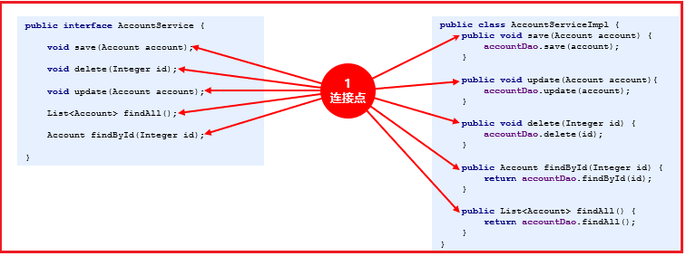
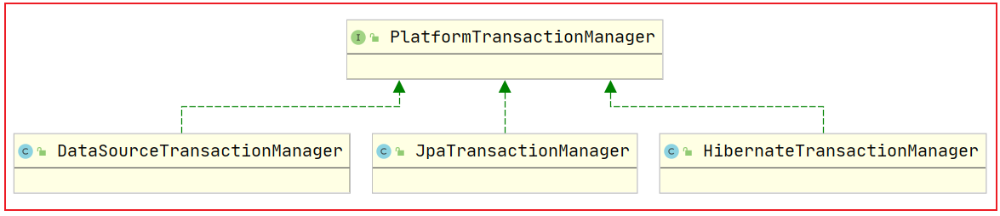
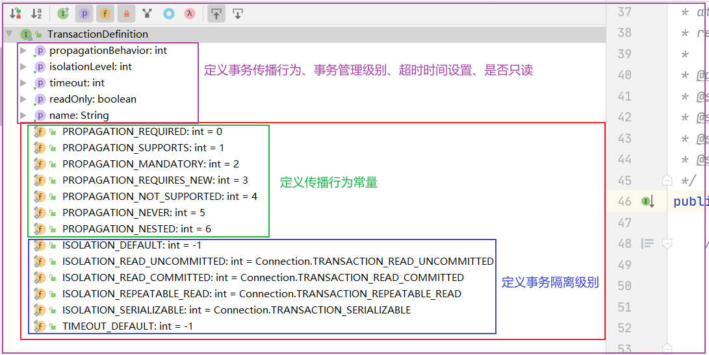
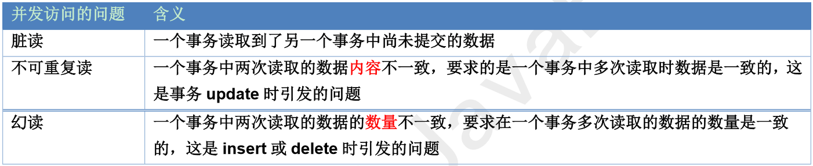
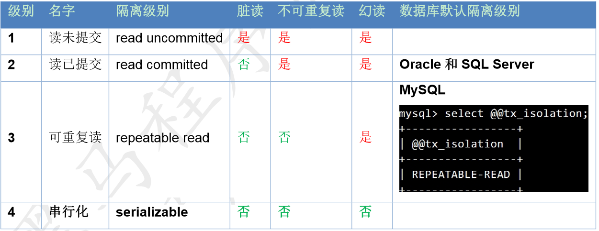

# 1.Spring-AOP介绍

## 01-Spring AOP概述

【1】AOP介绍

> AOP:全称Aspect Oriented Programming
> 即:面向切面编程，是一种【编程范式】，（抽取共性的代码，然后哪里需要，就插入哪里）。
> 作用:在程序【运行期间】,不修改源码的基础上对已有方法进行增强;
> 优势：
> 减少重复代码（将重复的共性代码抽取出来，给需要的类动态织入）
> 提高开发效率
> 维护方便（增强类与目标类低耦合）

【2】Spring AOP 2种实现方案

> Spring AOP的实现方式: 动态代理
> 依赖jdk的Proxy；
> 依赖cglib的Enhancer；
> 在满足条件的前提下，默认优先使用JDK动态代理的方式；

## 02-AOP相关术语（面试）

【1】AOP相关术语如下：

- Target（目标对象）:   要增强的对象(被代理的类对象)【接口或者类都可以作为目标对象】

- Proxy（代理对象） :  对目标对象的增强的对象 (生成的代理类对象)

- Joinpoint（连接点）:  目标对象中的所有方法(被代理类中的所有方法)--【可以被增强的方法，不一定被增强】



- Pointcut（切入点）:   目标对象下要被增强的方法(被代理类中要增强的方法)

- Advice（<span id="t10">通知</span>/增强）:  增强的那段【代码方法】以及代码切入的位置

  通知包含了2个维度内容：**在增强方法的什么位置，切入什么代码；**

  > 前置通知：在方法之前进行增强
  > 后置通知 ：在方法之后进行增强
  > 异常通知：在方法异常进行增强
  > 最终通知 ：最终执行的方法进行增强【无论是否出现异常，一定被执行的增强代码】
  > 环绕通知:  单独使用（以上所有通知）

- **Aspect(切面):** 切入点+通知=切面

  > 目标方法和增强方法合到在一起 叫做切面
  > 说白了切面描述了在什么样的目标方法下(切入点)的什么位置（通知类型）切入了什么样的(增强代码）

- Weaving（织入）：

  将增强的代码（方法）合并到目标方法的过程 叫织入过程;

小结：

| 术语    | 说明                                                    |
|-------|-------------------------------------------------------|
| 目标对象  | 被代理的对象                                                |
| 代理对象  | 对目标对象进行增强的对象                                          |
| 连接点   | 目标对象下一切可被代理的方法，都可以称为连接点                               |
| 切入点   | 要被增强的方法                                               |
| 通知/增强 | 包含增强的代码以及织入的位置=》5种类型：前置通知、后置通知、异常通知、环绕通知、最终通知         |
| 切面    | 切入点和通知的结合（3个维度信息：在什么样的方法下（切入点）的什么位置（通知类型）织入什么的代码（增强）） |
| 织入    | 将增强的代码（方法）合并到目标方法的过程 叫织入过程                            |

# 2.Spring实现AOP

Spring AOP开发方式

- XML方式

- XML+注解方式 ★

- 注解方式

## 03-XML实现AOP配置（最繁琐）

### 03-1-AOP基于XML配置快速入门

#### ①入门案例制作流程分析

```java
案例:
        以前置通知为例，对服务实现层impl包下的所有类方法进行增强;
        步骤如下：
        1.导入相关jar坐标依赖;
        2.定义目标类，并将增强代码封装到某个专用类下【切面类/通知类/增强类】
        3.将所有进行AOP操作的资源【切面类+目标对象】加载到IOC容器中；
        4.编写配置文件，配置AOP切面信息
        告诉spring【切面类中的增强方法】在哪个对象的哪个方法上增强使用（配置切面）；
```

#### ②具体步骤

以前置通知作为快速入门案例，然后扩展其他通知类型实现；

**1.导入jar包坐标**

```xml

<dependencies>
    <!-- spring核心jar包,已经依赖的AOP的jar -->
    <dependency>
        <groupId>org.springframework</groupId>
        <artifactId>spring-context</artifactId>
        <version>5.0.2.RELEASE</version>
    </dependency>
    <!-- spring整合单元测试的jar -->
    <dependency>
        <groupId>org.springframework</groupId>
        <artifactId>spring-test</artifactId>
        <version>5.0.2.RELEASE</version>
    </dependency>
    <!-- 单元测试的jar -->
    <dependency>
        <groupId>junit</groupId>
        <artifactId>junit</artifactId>
        <version>4.12</version>
    </dependency>
    <!-- 切入点表达式 -->
    <dependency>
        <groupId>org.aspectj</groupId>
        <artifactId>aspectjweaver</artifactId>
        <version>1.6.8</version>
    </dependency>
</dependencies>
```

**2.搭建目标对象**

定义AccountService接口及其实现类：

```java
/**
 * 定义目标接口
 */
public interface AccountService {
    void add();

    void update();

    String getName(String name);
}
--------------------------------------------------------------------------------------------
        package com.pp.service.impl;

        import com.pp.service.AccountService;

/**
 * 定义实现接口的目标类
 */
public class AccountServiceImpl implements AccountService {
    @Override
    public void add() {
        // int i=10/0;//模拟业务异常
        System.out.println("add run....");
    }

    @Override
    public void update() {
        System.out.println("update run....");
    }

    @Override
    public String getName(String name) {
        //int i=10/0;//模拟业务异常
        System.out.println("getName run....");
        return name;
    }
}
```

**3.编写通知类(切面类)**

```java
package com.pp.aop;

import org.aspectj.lang.ProceedingJoinPoint;

import java.util.Arrays;

/**
 * 定义切面类 ==》存放增强代码的类
 */
public class MyAspect {
    //定义前置通知增强方法
    public void beforeAdvice() {
        System.out.println("beforeAdvice run....");
    }
}
```

**4.applicationContext.xml配置**

```xml
<?xml version="1.0" encoding="UTF-8"?>
<beans xmlns="http://www.springframework.org/schema/beans"
       xmlns:xsi="http://www.w3.org/2001/XMLSchema-instance"
       xmlns:context="http://www.springframework.org/schema/context"
       xmlns:aop="http://www.springframework.org/schema/aop"
       xsi:schemaLocation="http://www.springframework.org/schema/beans
        http://www.springframework.org/schema/beans/spring-beans.xsd
        http://www.springframework.org/schema/context
        http://www.springframework.org/schema/context/spring-context.xsd
        http://www.springframework.org/schema/aop
        http://www.springframework.org/schema/aop/spring-aop.xsd">

    <!--目标对象 被ioc容器管理-->
    <bean id="accountService" class="com.pp.service.impl.AccountServiceImpl"/>

    <!--切面类对象被ioc容器管理-->
    <bean id="myAspect" class="com.pp.aop.MyAspect"/>

    <!--配置aop-->
    <aop:config>
        <!-- 配置AOP切面 ref="myAspect"表示引用myAspect切面类 -->
        <aop:aspect ref="myAspect">
            <!--
             前置通知： 
                <aop:before>标签属性：
					method="beforeAdvice" 指定切面类中增强的方法
                    pointcut：指定切入点，通过切入点表达式可以指定需要增强那些目标对象下的方法
            -->
            <aop:before method="beforeAdvice" pointcut="execution(public * com.pp.service.impl.*.*(..))"/>
        </aop:aspect>
    </aop:config>
</beans>
```

**5.编写测试类**

```java
package com.pp;

import com.pp.service.AccountService;
import org.junit.Test;
import org.junit.runner.RunWith;
import org.springframework.beans.factory.annotation.Autowired;
import org.springframework.test.context.ContextConfiguration;
import org.springframework.test.context.junit4.SpringJUnit4ClassRunner;

@RunWith(SpringJUnit4ClassRunner.class)
@ContextConfiguration(locations = "classpath:applicationContext.xml")
public class TestAop {
    @Autowired
    private AccountService accountService;

    /**
     * 测试前置通知
     */
    @Test
    public void test1() {
        accountService.add();
    }
}
```

### 03-2-AOP基于XML配置快速入门

【1】为MyAspect切面类逐次添加**后置通知、异常通知、最终通知和环绕通知增强方法**,最终代码如下：

```java
package com.pp.aop;

import org.aspectj.lang.ProceedingJoinPoint;

import java.util.Arrays;

/**
 * 定义切面类 ==》存放增强代码的类
 */
public class MyAspect {
    //前置通知增强方法
    public void beforeAdvice() {
        System.out.println("beforeAdvice run....");
    }

    //后置通知增强
    public void afterReturning() {
        System.out.println("afterReturning run....");
    }

    //异常通知增强
    public void afterThrowing() {
        System.out.println("afterThrowing run....");
    }

    //最终通知增强
    public void afterAdvice() {
        System.out.println("afterAdvice run....");
    }

    /**
     * 定义环绕通知
     * 需要引入目标方法的包装对象 ProceedingJoinPoint
     * @param pjp
     */
    public Object aroundAdvice(ProceedingJoinPoint pjp) {
        //获取方法的入参
        Object[] args = pjp.getArgs();
        System.out.println(Arrays.toString(args));
        //方法的入参可以不传入proceed()放下下，底层自动传入
        //Object result = pjp.proceed();
        //如果对入参做了修改，也可以proceed(args)执行
        Object result = null;
        try {
            System.out.println("before advice .....");
            //调用被增强方法
            result = pjp.proceed(args);
            System.out.println("after returning advice .....");
        } catch (Throwable throwable) {
            throwable.printStackTrace();
            System.out.println("after Throwing.....");
        } finally {
            System.out.println("after advice ....");
        }
        return result;
    }
}
```

【2】applicationContext.xml配置

```xml
<?xml version="1.0" encoding="UTF-8"?>
<beans xmlns="http://www.springframework.org/schema/beans"
       xmlns:xsi="http://www.w3.org/2001/XMLSchema-instance"
       xmlns:context="http://www.springframework.org/schema/context"
       xmlns:aop="http://www.springframework.org/schema/aop"
       xsi:schemaLocation="http://www.springframework.org/schema/beans
        http://www.springframework.org/schema/beans/spring-beans.xsd
        http://www.springframework.org/schema/context
        http://www.springframework.org/schema/context/spring-context.xsd
        http://www.springframework.org/schema/aop
        http://www.springframework.org/schema/aop/spring-aop.xsd">

    <!--目标对象 被ioc容器管理-->
    <bean id="accountService" class="com.pp.service.impl.AccountServiceImpl"/>

    <!--切面类被ioc容器管理-->
    <bean id="myAspect" class="com.pp.aop.MyAspect"/>

    <!--配置aop-->
    <aop:config>
        <!-- 配置AOP切面 ref="myAspect"表示引用myAspect切面类 -->
        <aop:aspect ref="myAspect">
            <!--统一定义切入点表达式-->
            <aop:pointcut id="mypt" expression="execution(public * com.pp.service.impl.*.*(..))"/>

            <!--
             前置通知： 
                <aop:before>标签属性：
					method="beforeAdvice" 指定切面类中增强的方法
                    pointcut：指定切入点，通过切入点表达式可以指定需要增强那些目标对象下的方法
            -->
            <!-- <aop:before method="beforeAdvice" pointcut="execution(public * com.pp.service.impl.*.*(..))"/>-->

            <!--后置增强-->
            <!-- <aop:after-returning method="afterReturning" pointcut-ref="mypt"/>-->

            <!--异常通知-->
            <!--<aop:after-throwing method="afterThrowing" pointcut-ref="mypt"/>-->

            <!--最终异常:增强的方法无论是否出现异常，增强代码都会执行-->
            <!-- <aop:after method="afterAdvice" pointcut-ref="mypt"/>-->

            <!--环绕通知：实际开发中，一般环绕通知与其他通知独立配置-->
            <aop:around method="aroundAdvice" pointcut-ref="mypt"/>
        </aop:aspect>
    </aop:config>

</beans>
```

【3】测试代码

```java
package com.pp;

import com.pp.service.AccountService;
import org.junit.Test;
import org.junit.runner.RunWith;
import org.springframework.beans.factory.annotation.Autowired;
import org.springframework.test.context.ContextConfiguration;
import org.springframework.test.context.junit4.SpringJUnit4ClassRunner;

@RunWith(SpringJUnit4ClassRunner.class)
@ContextConfiguration(locations = "classpath:applicationContext.xml")
public class TestAop {
    @Autowired
    private AccountService accountService;

    /**
     * 测试前置通知 后置 异常 最终
     */
    @Test
    public void test1() {
        accountService.add();
    }

    /**
     * 测试环绕通知
     */
    @Test
    public void test2() {
        accountService.getName("杨幂");
    }
}
```

## 04-切入点表达式

````java
作用:切入点表达式可以匹配被增强的方法,类似正则表达式；
        格式:
        修饰符 返回值 方法的全限定名(参数列表)
public void com.pp.service.impl.AccountServiceImpl.delete(..)
        说明：修饰符可省略不写，默认public
        支持通配符的写法：
        *   ： 表示任意字符串
        ..  ： 匹配多个包或者多个方法参数
````

	   阅读练习：

```java
execution(**(..)) //说明：第一个*表示任意返回值类型，第一个*匹配任意类，..匹配任意参数，该表达式表示匹配任意类的任意方法（简化书写方式，很少用到）
        execution(**..*(..))//同上
        execution(**..*.*(..))//同上，更符合书写习惯，第一个*表示匹配任意返回值类型，*..表示匹配任意包名称及其任意子包，第三个*匹配任意类，第四个匹配任意方法
        execution(public **..*.*(..))//表示匹配任意public修饰符的方法
        execution(public int*..*.*(..))//表示陪陪任意返回值是int类型且修饰符是public的方法
        execution(public void*..*.*(..))//匹配任意返回值是void且修饰符是public的方法
        execution(public void com..*.*(..))//匹配com包及其任意子包下的被pulic修饰的返回值是void的方法
        execution(public void com..service.*.*(..))//匹配com包下任意子包下存在service包下的任意类的任意方法，且方法为void 被public修饰
        execution(public void com.pp.service.*.*(..))
        execution(public void com.pp.service.User*.*(..))//侧重点：任意一User开头的类下的任意void且被public修饰的方法
        execution(public void com.pp.service.*Service.*(..))//侧重点：任意一Service结尾的类下的任意方法
        execution(public void com.pp.service.UserService.*(..))//匹配UserService类下的任意方法...
        execution(public User com.pp.service.UserService.find*(..))//侧重点：匹配UserService类下的任意以find开头的任意方法...
        execution(public User com.pp.service.UserService.*Id(..))//侧点：匹配UserService类下的任意以id结尾的任意方法...
        execution(public User com.pp.service.UserService.findById(..))//侧重点：匹配UserService类下方法名为findById的任意参数的方法....
        execution(public User com.pp.service.UserService.findById(int))//精准匹配，方法入参只有一个int类型
        execution(public User com.pp.service.UserService.findById(int,int))//精准匹配，方法入参包含2个int类型
        execution(public User com.pp.service.UserService.findById(int,*))//2个入参，第一个必须int，第二个任意类型
        execution(public User com.pp.service.UserService.findById(*,int))//2个入参，第一个任意类型，第二个必须int类型
        execution(public User com.pp.service.UserService.findById())//精准匹配无参
        execution(List com.pp.service.*Service+.findAll(..))//匹配任意以Service结尾的类及其子类下方法名为findAll的任意入参方法
```

## 05-XML基于AOP开发小结

【1】Spring AOP有哪些通知类型，有什么区别？

			[提示](#t10)

【2】常用配置标签速记

| 标签名称                         | 作用                                                             |
|------------------------------|----------------------------------------------------------------|
| \<aop:config>                | 配置aop根标签                                                       |
| \<aop:aspect ref="myAspect"> | \<aop:config>子标签，用于指定切面类，配置切面                                  |
| \<aop:pointcut>              | \<aop:config>子标签，定义公共切入点<br>属性：id 指定切入点名称  expression：指定切入点表达式 |
| \<aop:before>                | 前置通知<br>属性：method指定切面类增强的方法，pointcut/pointcut-ref指定切入点表达式      |
| \<aop:after-returning>       | 后置通知,属性同上                                                      |
| \<aop:after-throwing>        | 异常通知，属性同上                                                      |
| \<aop:after>                 | 最终通知，属性同上                                                      |
| <aop:around >                | 环绕 通知，属性同上                                                     |

## 06-基于xml和注解实现AOP

说明：

```java
【1】我们自己编写的类使用IOC和AOP相关注解
        比如：AccountServiceImpl、MyAspect类

        【2】第三方引用类使用xml配置；
```

<div style='background-color:orange;'>1.改造applicationContex.xml配置</div>

```xml
<!-- 开启需要扫描的包 -->
<context:component-scan base-package="com.pp"/>
        <!-- 开启SpringAOP注解支持 -->
<aop:aspectj-autoproxy/>
```

<div style='background-color:orange;'>2.在切面类中添加相关注解</div>	

```java
注解：
@Aspect ： 声明切面类
@PonitCut：注解配置到空方法上，定义公共的切入点，通过属性value引入切入点表达式
        配置通知类型：
@Before() :前置通知
@AfterReturning() ： 后置通知
@AfterThrowing()  ： 异常通知
@After()			：最终通知
@Around()			：环绕通知
```

**1.导入jar包坐标**(保持不变)

```xml

<dependencies>
    <!-- spring核心jar包,已经依赖的AOP的jar -->
    <dependency>
        <groupId>org.springframework</groupId>
        <artifactId>spring-context</artifactId>
        <version>5.0.2.RELEASE</version>
    </dependency>
    <!-- spring整合单元测试的jar -->
    <dependency>
        <groupId>org.springframework</groupId>
        <artifactId>spring-test</artifactId>
        <version>5.0.2.RELEASE</version>
    </dependency>
    <!-- 单元测试的jar -->
    <dependency>
        <groupId>junit</groupId>
        <artifactId>junit</artifactId>
        <version>4.12</version>
    </dependency>
    <!-- 切入点表达式 -->
    <dependency>
        <groupId>org.aspectj</groupId>
        <artifactId>aspectjweaver</artifactId>
        <version>1.6.8</version>
    </dependency>
</dependencies>
```

**2.创建目标对象（保持不变）**

```java
package com.pp.service.impl;

import com.pp.service.AccountService;
import org.springframework.stereotype.Service;

@Service("accountService")
public class AccountServiceImpl implements AccountService {
    @Override
    public void add() {
        //int i=10/0;
        System.out.println("add run....");
    }

    @Override
    public void update() {
        System.out.println("update run....");
    }

    @Override
    public String getName(String name) {
        int i = 10 / 0;
        System.out.println("getName run....");
        return name;
    }
}
```

**3.编写通知类(切面类)**

```java
package com.pp.aop;

import org.aspectj.lang.ProceedingJoinPoint;
import org.aspectj.lang.annotation.*;
import org.springframework.stereotype.Component;

import java.util.Arrays;

/**
 * 定义切面类 ==》存放增强代码的类
 */
@Component("myAspect")
@Aspect//定义当前类为切面类，等价于<aop:aspect ref="myAspect">
public class MyAspect {

    //提取切入点
    @Pointcut("execution(public * com.pp.service.impl.*.*(..))")
    public void myPt() {
    }

    /**
     * 前置通知
     */
    // @Before("execution(public * com.pp.service.impl.*.*(..))")
    public void beforeAdvice() {
        System.out.println("beforeAdvice run....");
    }

    /**
     * 后置通知 引用myPt方法上的表达式
     */
    // @AfterReturning("myPt()")
    public void afterReturning() {
        System.out.println("afterReturning run....");
    }

    /**
     * 异常通知
     */
    //  @AfterThrowing("myPt()")
    public void afterThrowing() {
        System.out.println("afterThrowing run....");
    }

    /**
     * 最终通知
     * 后置通知 异常通知 或者 最终通知 基于注解开发的话 执行顺序与方法名称有关
     */
    //@After("myPt()")
    public void afterAdvice() {
        System.out.println("afterAdvice run....");
    }

    /**
     * 定义环绕通知
     * 需要引入目标方法的包装对象 ProceedingJoinPoint
     * @param pjp
     */
    @Around("myPt()")
    public Object aroundAdvice(ProceedingJoinPoint pjp) {
        //获取方法的入参
        Object[] args = pjp.getArgs();
        System.out.println(Arrays.toString(args));
        //方法的入参可以不传入proceed()放下下，底层自动传入
        //Object result = pjp.proceed();
        //如果对入参做了修改，也可以proceed(args)执行
        Object result = null;
        try {
            System.out.println("before advice .....");
            result = pjp.proceed(args);
            System.out.println("after returning advice .....");
        } catch (Throwable throwable) {
            throwable.printStackTrace();
            System.out.println("after Throwing.....");
        } finally {
            System.out.println("after advice ....");
        }
        return result;
    }
}
```

**4.配置applicationContext.xml**

```xml
<?xml version="1.0" encoding="UTF-8"?>
<beans xmlns="http://www.springframework.org/schema/beans"
       xmlns:xsi="http://www.w3.org/2001/XMLSchema-instance"
       xmlns:aop="http://www.springframework.org/schema/aop"
       xmlns:context="http://www.springframework.org/schema/context"
       xsi:schemaLocation="http://www.springframework.org/schema/beans
       http://www.springframework.org/schema/beans/spring-beans.xsd
       http://www.springframework.org/schema/aop
       http://www.springframework.org/schema/aop/spring-aop.xsd
       http://www.springframework.org/schema/context
       http://www.springframework.org/schema/context/spring-context.xsd">
    <!-- 开启组件扫描 -->
    <context:component-scan base-package="com.pp"/>
    <!-- 开启对Spring-AOP注解的支持 -->
    <aop:aspectj-autoproxy/>
</beans>
```

**5.编写测试类**

```java
package com.pp;

import com.pp.service.AccountService;
import org.junit.Test;
import org.junit.runner.RunWith;
import org.springframework.beans.factory.annotation.Autowired;
import org.springframework.test.context.ContextConfiguration;
import org.springframework.test.context.junit4.SpringJUnit4ClassRunner;

@RunWith(SpringJUnit4ClassRunner.class)
@ContextConfiguration(locations = "classpath:applicationContext.xml")
public class TestAop {
    @Autowired
    private AccountService accountService;

    /**
     * 测试前置通知 后置 异常 最终
     */
    @Test
    public void test1() {
        accountService.add();
    }

    /**
     * 测试环绕通知
     */
    @Test
    public void test2() {
        accountService.getName("杨幂");
    }
}
```

## 07-全注解实现AOP

**配置类代码**

```java
package com.pp.config;

import org.springframework.context.annotation.ComponentScan;
import org.springframework.context.annotation.Configuration;
import org.springframework.context.annotation.EnableAspectJAutoProxy;

@Configuration
@ComponentScan(basePackages = "com.pp")
//在spring中开启什么功能，一般以@Enable开头
@EnableAspectJAutoProxy//开启对AspectJ 对AOP注解的支持，等价于<aop:aspectj-autoproxy/>
public class SpringConfig {
}
```

**切面类代码（保持不变）**

```java
package com.pp.aop;

import org.aspectj.lang.ProceedingJoinPoint;
import org.aspectj.lang.annotation.*;
import org.springframework.stereotype.Component;

import java.util.Arrays;

/**
 * 定义切面类 ==》存放增强代码的类
 */
@Component("myAspect")
@Aspect//定义当前类为切面类，等价于<aop:aspect ref="myAspect">
public class MyAspect {

    //提取切入点
    @Pointcut("execution(public * com.pp.service.impl.*.*(..))")
    public void myPt() {
    }

    /**
     * 前置通知
     */
    // @Before("execution(public * com.pp.service.impl.*.*(..))")
    public void beforeAdvice() {
        System.out.println("beforeAdvice run....");
    }

    /**
     * 后置通知
     */
    // @AfterReturning("myPt()")
    public void afterReturning() {
        System.out.println("afterReturning run....");
    }

    /**
     * 异常通知
     */
    //  @AfterThrowing("myPt()")
    public void afterThrowing() {
        System.out.println("afterThrowing run....");
    }

    /**
     * 最终通知
     * 后置通知 异常通知 或者 最终通知 基于注解开发的话 执行顺序与方法名称有关
     */
    //@After("myPt()")
    public void afterAdvice() {
        System.out.println("afterAdvice run....");
    }

    /**
     * 定义环绕通知
     * 需要引入目标方法的包装对象 ProceedingJoinPoint
     * @param pjp
     */
    @Around("myPt()")
    public Object aroundAdvice(ProceedingJoinPoint pjp) {
        //获取方法的入参
        Object[] args = pjp.getArgs();
        System.out.println(Arrays.toString(args));
        //方法的入参可以不传入proceed()放下下，底层自动传入
//        Object result = pjp.proceed();
        //如果对入参做了修改，也可以proceed(args)执行
        Object result = null;
        try {
            System.out.println("before advice .....");
            result = pjp.proceed(args);
            System.out.println("after returning advice .....");
        } catch (Throwable throwable) {
            throwable.printStackTrace();
            System.out.println("after Throwing.....");
        } finally {
            System.out.println("after advice ....");
        }
        return result;
    }
}
```

## 08-AOP注解开发小结

【1】Aop常用注解有哪些，各是什么作用？

| 注解                      | 作用                                      | 配置位置        |
|-------------------------|-----------------------------------------|-------------|
| @EnableAspectJAutoProxy | 开启AOP注解的支持，等价于\<aop:aspectj-autoproxy/> | 配置类之上       |
| @Aspect                 | 配置切面类                                   | 切面类之上       |
| @PonitCut               | 配置公共切入点,等价于：<aop:pointcut>              | 切面类中无参空方法之上 |
| @Before                 | 前置通知                                    | 切面类中方法下     |
| @AfterReturning()       | 后置通知                                    | 同上          |
| @AfterThrowing()        | 异常通知                                    | 同上          |
| @After                  | 最终通知                                    | 同上          |
| @Around                 | 环绕通知                                    | 同上          |

# 3.Spring声明式事务

## 09-事务前置知识须知

【1】事务相关知识点回顾

1）什么是事务？

        事务是逻辑上的一组操作要么同时成功，要么同时失败；

2）事务4大特性？

		原子性、一致性、持久性、隔离性；

3）在javaEE分层开发中，事务一般作用于那一层？

		业务逻辑层（服务层）；

【2】什么是编程式事务？

以Mybatis为例，如果项目中没有使用Spring，那么开发中使用事务的场景需要自己维护：

```java
try{
        sqlSessionFactory.openSession(false);//开启手动提交事务【前置通知】
        //复杂的业务场景，内含各种增删改查操作，执行过程保证事务一致性
        accountDao.update();
        accountDao.find();
        accountDao.delete();
        sqlSession.commit();//提交事务【后置通知】
        }catch(Exception e){
        sqlSession.rollback();//回滚事务【异常通知】
        }finally{
        sqlsession.close;//释放资源或者归还资源【最终通知】 
        }
```

	 显然这种开发模式存在大量的冗余代码，开发效率不高；

【3】什么是声明式事务?

```java
在Spring中我们可以使用xml或者注解的方式，在事务相关的方法上声明一下就可以了
```

      以注解开发为例：

```java

@Service("accountService")
public class AccountServiceImpl implements AccountService {
    @Transactional
    public void changeInfo(Account account) {......}
}    
```

      这样spring容器就会自动的扫描声明过的类方法，自动为事务方法提供事务的开启 、提交、 回滚 、资源释放等操作，这样我们可以更加专注于我们的业务逻辑；

## 10-转账环境搭建

功能说明：

转账信息包含转款人ID,收款人ID,还有转账金额；

简化实现流程：

```tex
1）Dao层提供【根据账户ID查询账户信息的功能】、【入账功能】、【出账功能】；
2）Service层根据传入的转款人ID,收款人ID、转账金额信息调用Dao完成【转账功能】；
3）Dao和Service对象资源被IOC容器管理
```

### 1.引入工程pom依赖

```xml
<?xml version="1.0" encoding="UTF-8"?>
<project xmlns="http://maven.apache.org/POM/4.0.0"
         xmlns:xsi="http://www.w3.org/2001/XMLSchema-instance"
         xsi:schemaLocation="http://maven.apache.org/POM/4.0.0 http://maven.apache.org/xsd/maven-4.0.0.xsd">
    <modelVersion>4.0.0</modelVersion>

    <groupId>com.pp</groupId>
    <artifactId>day03_4_spring_aop_transaction_xml</artifactId>
    <version>1.0-SNAPSHOT</version>

    <dependencies>
        <!-- spring核心jar包,已经依赖的AOP的jar -->
        <dependency>
            <groupId>org.springframework</groupId>
            <artifactId>spring-context</artifactId>
            <version>5.0.2.RELEASE</version>
        </dependency>
        <!-- jdbcTemplate -->
        <dependency>
            <groupId>org.springframework</groupId>
            <artifactId>spring-jdbc</artifactId>
            <version>5.0.2.RELEASE</version>
        </dependency>
        <dependency>
            <groupId>mysql</groupId>
            <artifactId>mysql-connector-java</artifactId>
            <version>8.0.25</version>
        </dependency>
        <dependency>
            <groupId>c3p0</groupId>
            <artifactId>c3p0</artifactId>
            <version>0.9.1.2</version>
        </dependency>
        <dependency>
            <groupId>com.alibaba</groupId>
            <artifactId>druid</artifactId>
            <version>1.0.14</version>
        </dependency>
        <!-- spring整合单元测试的jar -->
        <dependency>
            <groupId>org.springframework</groupId>
            <artifactId>spring-test</artifactId>
            <version>5.0.2.RELEASE</version>
        </dependency>
        <!-- 单元测试的jar -->
        <dependency>
            <groupId>junit</groupId>
            <artifactId>junit</artifactId>
            <version>4.12</version>
            <scope>test</scope>
        </dependency>
        <!-- 切入点表达式 -->
        <dependency>
            <groupId>org.aspectj</groupId>
            <artifactId>aspectjweaver</artifactId>
            <version>1.6.8</version>
        </dependency>
    </dependencies>
</project>
```

### 2.定义代码实现

		定义pojo：

```java
/**
 * 定义acount表对应的实体类
 */
public class Account {
    private Integer id;
    private String name;
    private Float money;
    //setter and getter and toString
}    
```

		定义dao接口：

```java
package com.pp.dao;

import com.pp.pojo.Account;

public interface AccountDao {
    /**
     * 根据用户id查询用户信息
     * @param id
     * @return
     */
    Account findById(Integer id);

    /**
     * 转出金额
     * @param accountId
     * @param money
     * @return
     */
    Integer transferOut(Integer accountId, Float money);

    /**
     * 转入金额
     * @param accountId
     * @param money
     * @return
     */
    Integer transferIn(Integer accountId, Float money);
}
```

	定义dao接口实现：

```java
package com.pp.dao.impl;

import com.pp.dao.AccountDao;
import com.pp.pojo.Account;
import org.springframework.jdbc.core.BeanPropertyRowMapper;
import org.springframework.jdbc.core.JdbcTemplate;

public class AccountDaoImpl implements AccountDao {
    //注入jdbcTemplate
    private JdbcTemplate jdbcTemplate;

    /**
     * setter注入
     * @param jdbcTemplate
     */
    public void setJdbcTemplate(JdbcTemplate jdbcTemplate) {
        this.jdbcTemplate = jdbcTemplate;
    }

    //根据用户id查询用户信息
    @Override
    public Account findById(Integer id) {
        String sql = "select * from account where id=?";
        Account account = jdbcTemplate.queryForObject(sql, new BeanPropertyRowMapper<>(Account.class), id);
        return account;
    }

    //转出金额
    @Override
    public Integer transferOut(Integer accountId, Float money) {
        String sql = "update account set money=money-? where id=?";
        int count = this.jdbcTemplate.update(sql, money, accountId);
        return count;
    }

    //准入金额
    @Override
    public Integer transferIn(Integer accountId, Float money) {
        String sql = "update account set money=money+? where id=?";
        int count = this.jdbcTemplate.update(sql, money, accountId);
        return count;
    }
}
```

	定义service接口：

```java
package com.pp.service;

public interface AccountService {
    /**
     * 转账
     * @param fromId 转账人ID
     * @param toId 收款人ID
     * @param money 转出金额
     * @return
     */
    Boolean transferMoney(Integer fromId, Integer toId, Float money);
}
```

		定义service接口实现：

```java
package com.pp.service.impl;

import com.pp.dao.AccountDao;
import com.pp.pojo.Account;
import com.pp.service.AccountService;

public class AccountServiceImpl implements AccountService {

    private AccountDao accountDao;

    //setter注入accountDao bean对象
    public void setAccountDao(AccountDao accountDao) {
        this.accountDao = accountDao;
    }

    //实现转账功能
    @Override
    public Boolean transferMoney(Integer fromId, Integer toId, Float money) {
        //1.查询转账人和收账人的信息
        Account fromAccount = this.accountDao.findById(fromId);
        System.out.println(fromAccount);
        Account toAccount = this.accountDao.findById(toId);
        System.out.println(toAccount);
        //2.转出
        Integer outCount = this.accountDao.transferOut(fromId, money);
        //int i=10/0;//模拟业务异常
        Integer inCount = this.accountDao.transferIn(toId, money);
        return (outCount > 0) && (inCount > 0);
    }
}
```

### 3.配置applicationContext.xml配置文件

```xml
<?xml version="1.0" encoding="UTF-8"?>
<beans xmlns="http://www.springframework.org/schema/beans"
       xmlns:xsi="http://www.w3.org/2001/XMLSchema-instance"
       xmlns:context="http://www.springframework.org/schema/context" xmlns:tx="http://www.springframework.org/schema/tx"
       xmlns:aop="http://www.springframework.org/schema/aop"
       xsi:schemaLocation="http://www.springframework.org/schema/beans
        http://www.springframework.org/schema/beans/spring-beans.xsd
        http://www.springframework.org/schema/context
        http://www.springframework.org/schema/context/spring-context.xsd http://www.springframework.org/schema/tx http://www.springframework.org/schema/tx/spring-tx.xsd http://www.springframework.org/schema/aop http://www.springframework.org/schema/aop/spring-aop.xsd">
    <!--配置加载外部的properties文件-->
    <context:property-placeholder location="classpath:jdbc.properties" file-encoding="UTF-8"/>

    <!--配置数据源-->
    <bean id="dataSource" class="org.springframework.jdbc.datasource.DriverManagerDataSource">
        <property name="username" value="${jdbc.userName}"/>
        <property name="password" value="${jdbc.password}"/>
        <property name="driverClassName" value="${jdbc.driverClass}"/>
        <property name="url" value="${jdbc.url}"/>
    </bean>

    <!--配置jdbcTemplate-->
    <bean id="jdbcTemplate" class="org.springframework.jdbc.core.JdbcTemplate">
        <property name="dataSource" ref="dataSource"/>
    </bean>

    <!--配置dao-->
    <bean id="accountDao" class="com.pp.dao.impl.AccountDaoImpl">
        <property name="jdbcTemplate" ref="jdbcTemplate"/>
    </bean>

    <!--配置service-->
    <bean id="accountService" class="com.pp.service.impl.AccountServiceImpl">
        <property name="accountDao" ref="accountDao"/>
    </bean>
</beans>
```

### 4.定义jdbc.properties

```properties
jdbc.driverClass=com.mysql.jdbc.Driver
jdbc.userName=root
jdbc.password=123456
jdbc.url=jdbc:mysql:///ssm?serverTimezone=UTC
```

### 5.测试

```java
package com.pp;

import com.pp.service.AccountService;
import org.junit.Test;
import org.junit.runner.RunWith;
import org.springframework.beans.factory.annotation.Autowired;
import org.springframework.test.context.ContextConfiguration;
import org.springframework.test.context.junit4.SpringJUnit4ClassRunner;

@RunWith(SpringJUnit4ClassRunner.class)
@ContextConfiguration(locations = "classpath:applicationContext.xml")
public class TestAop {
    @Autowired
    private AccountService accountService;

    @Test
    public void testTransfer() {
        Integer fromId = 1;
        Integer toId = 2;
        Float money = 200F;
        this.accountService.transferMoney(fromId, toId, money);
    }
}
```

## 11-Spring事务相关API介绍

### 11-1-事务相关接口介绍（了解）

#### 【1】平台事务管理器

       PlatformTransactionManager接口是 spring 的事务管理器接口，它里面提供了我们常用的操作事务的方法:

```java
package org.springframework.transaction;

import org.springframework.lang.Nullable;

//事务管理器接口
public interface PlatformTransactionManager {
    //获取事务的状态
    TransactionStatus getTransaction(TransactionDefinition definition) throws TransactionException;

    //提交事务
    void commit(TransactionStatus status) throws TransactionException;

    //回滚事务
    void rollback(TransactionStatus status) throws TransactionException;
}
```



PlatformTransactionManager常见实现：

| 实现类                                                                       | 说明                                                 |
|---------------------------------------------------------------------------|----------------------------------------------------|
| <span style="background-color:yellow">DatasourceTransactionManager</span> | 对JDBC操作的事务管理器<br>Mybatis、JdbcTemplate默认采用该实现管理事务★★ |
| HibernateTransactionManager                                               | 对hibernate操作的事务管理器                                 |
| JPATransactionManager                                                     | 对JPA操作的事务管理器                                       |

#### 【2】事务定义接口介绍(了解)

TransactionDefinition接口定义了事务的基本信息：



```java
public interface TransactionDefinition {
    //获取事务的传播行为
    int getPropagationBehavior();

    //获取事务隔离级别
    int getIsolationLevel();

    //获取事务超时时间
    int getTimeout();

    //获取事务是否是只读事务
    boolean isReadOnly();

    //获取事务名称
    String getName();
    //.......
}
```

### 11-2-事务属性介绍-1

#### 【1】回顾事务4大隔离级别



可通过设置事务的隔离级别，避免事务并发问题：



注意：事务的隔离级别越高，性能越差，安全性越高。

#### 【2】事务超时时间

单位是秒，默认值为-1,意思为,什么时候执行完,什么时候提交或回滚事务；

#### 【3】是否是只读事务

Spring的readOnly事务是对java中jdbc的封装，JDBC相关的API如下:

```java
package java.sql;

import java.util.Properties;
import java.util.concurrent.Executor;

public interface Connection extends Wrapper, AutoCloseable {
    //......  
    //设置事务是否是只读事务
    void setReadOnly(boolean readOnly) throws SQLException;
//......
}    
```

说明：

```tex
	设置事务readOnly=true会提示数据库当前的事务并不包含更新数据的操作，不必对数据库加锁等操作，可以减轻数据库的压力.
	Puts this connection in read-only mode as a hint to the driver to enable database optimizations. 
```

| 设置       | 值     | 说明             |
|----------|-------|----------------|
| readOnly | true  | 只读事务，适用于查询操作   |
| readOnly | false | 非只读事务，适用于增删改操作 |

### 11-3-事务传播行为属性介绍-2

	1）事务传播行为是<span style="background-color:yellow;">Spring框架独有的事务增强特性</span>，它不属于数据库事务规范的内容；
	
	 2）事务传播行为用来描述被某一个事务传播行为修饰的方法被嵌套进另一个方法时事务如何传播;
	
	比如：methodB方法被某种事务传播行为修饰，但是该方法被methodA修饰，那么methodA以怎样的事务方式运行呢？

```java
public void methodA(){
        methodB();
        //doSomething
        }

@Transaction(Propagation = 指定事务传播属性)
public void methodB(){
        //doSomething
        }
```

说明：

```tex
1.methodB传播行为是：PROPAGATION_REQUIRED
	如果methodA有事务，则methodB加入事务，如果methodA没有事务，则新建一个事务，methodB再加入；
2.methodB传播行为是：PROPAGATION_SUPPORTS
	如果methodA有事务，则methodB加入事务，如果methodA没有事务，methodB则以非事务状态运行；
```

| 事务传播行为类型                                                           | 说明                                                             |
|--------------------------------------------------------------------|----------------------------------------------------------------|
| <span style="background-color:yellow;">PROPAGATION_REQUIRED</span> | 如果当前没有事务，就新建一个事务，如果已经存在一个事务中，加入到这个事务中。这是最常见的选择。【适用于增删改需要事务的场景】 |
| <span style="background-color:yellow;">PROPAGATION_SUPPORTS</span> | 支持当前事务，如果当前没有事务，就以非事务方式执行。【适用于查询场景】                            |
| PROPAGATION_MANDATORY                                              | 使用当前的事务，如果当前没有事务，就抛出异常。                                        |
| PROPAGATION_REQUIRES_NEW                                           | 新建事务，如果当前存在事务，把当前事务挂起。                                         |
| PROPAGATION_NOT_SUPPORTED                                          | 以非事务方式执行操作，如果当前存在事务，就把当前事务挂起。                                  |
| PROPAGATION_NEVER                                                  | 以非事务方式执行，如果当前存在事务，则抛出异常。                                       |
| PROPAGATION_NESTED                                                 | 如果当前存在事务，则在嵌套事务内执行。如果当前没有事务，则执行与PROPAGATION_REQUIRED类似的操作。     |

小结：

| 场景      | 传播特性                 | 是否只读           |
|---------|----------------------|----------------|
| 增删改业务场景 | PROPAGATION_REQUIRED | readOnly=false |
| 查询业务场景  | PROPAGATION_SUPPORTS | readOnly=true  |

# 4.声明式事务实现

## 12-Spring基于xml配置事务实现

      配置步骤说明：

```java
1.在xml中配置事务管理器对象:DatasourceTransactionManager（相当于我们自己写的切面类）
        2.在xml中配置【事务通知】，设置事务的操作策略（设置不同的方法对事务的支持情况）
        在执行 增删改 时必须要有事务控制
        传播行为：REQUIRED
        是否只读：false
        在执行 查询 时可有可无事务
        传播行为：SUPPORTS
        是否只读：true
        3.在xml中配置事务AOP切面（事务通知+切入点）
```

【1】在原有配置之上，添加事务支持配置

```xml
<?xml version="1.0" encoding="UTF-8"?>
<beans xmlns="http://www.springframework.org/schema/beans"
       xmlns:xsi="http://www.w3.org/2001/XMLSchema-instance"
       xmlns:context="http://www.springframework.org/schema/context" xmlns:tx="http://www.springframework.org/schema/tx"
       xmlns:aop="http://www.springframework.org/schema/aop"
       xsi:schemaLocation="http://www.springframework.org/schema/beans
        http://www.springframework.org/schema/beans/spring-beans.xsd
        http://www.springframework.org/schema/context
        http://www.springframework.org/schema/context/spring-context.xsd http://www.springframework.org/schema/tx http://www.springframework.org/schema/tx/spring-tx.xsd http://www.springframework.org/schema/aop http://www.springframework.org/schema/aop/spring-aop.xsd">
    <!--配置加载外部的properties文件-->
    <context:property-placeholder location="classpath:jdbc.properties" file-encoding="UTF-8"/>

    <!--配置数据源-->
    <bean id="dataSource" class="org.springframework.jdbc.datasource.DriverManagerDataSource">
        <property name="username" value="${jdbc.userName}"/>
        <property name="password" value="${jdbc.password}"/>
        <property name="driverClassName" value="${jdbc.driverClass}"/>
        <property name="url" value="${jdbc.url}"/>
    </bean>

    <!--配置jdbcTemplate-->
    <bean id="jdbcTemplate" class="org.springframework.jdbc.core.JdbcTemplate">
        <property name="dataSource" ref="dataSource"/>
    </bean>

    <!--配置dao-->
    <bean id="accountDao" class="com.pp.dao.impl.AccountDaoImpl">
        <property name="jdbcTemplate" ref="jdbcTemplate"/>
    </bean>

    <!--配置service-->
    <bean id="accountService" class="com.pp.service.impl.AccountServiceImpl">
        <property name="accountDao" ref="accountDao"/>
    </bean>
    <!--配置事务管理器，用于管理事务，内含事务的开启，提交，回滚，资源释放等操作-->
    <bean id="transactionManager" class="org.springframework.jdbc.datasource.DataSourceTransactionManager">
        <property name="dataSource" ref="dataSource"/>
    </bean>
    <!--配置事务通知：告诉事务管理器以什么样的策略管理事务-->
    <tx:advice id="myAdvice" transaction-manager="transactionManager">
        <!--配置事务属性-->
        <tx:attributes>
            <!--匹配越精准，优先级越高-->
            <tx:method name="*" propagation="REQUIRED" read-only="false"/>
            <!--比如项目约定，查询以find或者get开头的都是查询方法-->
            <tx:method name="find*" propagation="SUPPORTS" read-only="true"/>
            <tx:method name="get*" propagation="SUPPORTS" read-only="true"/>
        </tx:attributes>
    </tx:advice>
    <!--切入点+通知=切面-->
    <!--配置aop-->
    <aop:config>
        <!--配置切面-->
        <aop:advisor advice-ref="myAdvice" pointcut="execution(* com.pp.service.impl.*.*(..))"/>
    </aop:config>
</beans>
```

【2】测试

```java
package com.pp;

import com.pp.service.AccountService;
import org.junit.Test;
import org.junit.runner.RunWith;
import org.springframework.beans.factory.annotation.Autowired;
import org.springframework.test.context.ContextConfiguration;
import org.springframework.test.context.junit4.SpringJUnit4ClassRunner;

@RunWith(SpringJUnit4ClassRunner.class)
@ContextConfiguration(locations = "classpath:applicationContext.xml")
public class TestAop {
    @Autowired
    private AccountService accountService;

    //测试基于事务的转账业务
    @Test
    public void testTransfer() {
        Integer fromId = 1;
        Integer toId = 2;
        Float money = 200F;
        this.accountService.transferMoney(fromId, toId, money);
    }
}
```

## 13-Spring基于半xml和半注解配置事务实现

	核心操作：

```xml
自定定义的类之上使用注解开发，第三方提供类使用xml配置：
        1.在xml中开启AOP和事务的注解支持
        <!--开启spring注解扫描-->
<context:component-scan base-package="com.pp"/>
        <!--开启aop的支持-->
<aop:aspectj-autoproxy/>
        <!--开启事务的注解支持-->
<tx:annotation-driven/>
        2.在服务类或者方法上使用事务注解
        @Transactional
        public class AccountServiceImpl implements AccountService {
        .......
        }
```

【1】配置文件代码

```xml
<?xml version="1.0" encoding="UTF-8"?>
<beans xmlns="http://www.springframework.org/schema/beans"
       xmlns:xsi="http://www.w3.org/2001/XMLSchema-instance"
       xmlns:context="http://www.springframework.org/schema/context" xmlns:tx="http://www.springframework.org/schema/tx"
       xmlns:aop="http://www.springframework.org/schema/aop"
       xsi:schemaLocation="http://www.springframework.org/schema/beans
        http://www.springframework.org/schema/beans/spring-beans.xsd
        http://www.springframework.org/schema/context
        http://www.springframework.org/schema/context/spring-context.xsd http://www.springframework.org/schema/tx http://www.springframework.org/schema/tx/spring-tx.xsd http://www.springframework.org/schema/aop http://www.springframework.org/schema/aop/spring-aop.xsd">
    <!--配置加载外部的properties文件-->
    <context:property-placeholder location="classpath:jdbc.properties" file-encoding="UTF-8"/>

    <!--配置数据源-->
    <bean id="dataSource" class="org.springframework.jdbc.datasource.DriverManagerDataSource">
        <property name="username" value="${jdbc.userName}"/>
        <property name="password" value="${jdbc.password}"/>
        <property name="driverClassName" value="${jdbc.driverClass}"/>
        <property name="url" value="${jdbc.url}"/>
    </bean>

    <!--配置jdbcTemplate-->
    <bean id="jdbcTemplate" class="org.springframework.jdbc.core.JdbcTemplate">
        <property name="dataSource" ref="dataSource"/>
    </bean>

    <!--配置dao-->
    <!-- <bean id="accountDao" class="com.pp.dao.impl.AccountDaoImpl">
         <property name="jdbcTemplate" ref="jdbcTemplate"/>
     </bean>-->

    <!--配置service-->
    <!--<bean id="accountService" class="com.pp.service.impl.AccountServiceImpl">
        <property name="accountDao" ref="accountDao"/>
    </bean>-->

    <!--开启spring注解扫描-->
    <context:component-scan base-package="com.pp"/>
    <!--配置事务管理器，用于管理事务，内含事务的开启，提交，回滚，资源释放等操作-->
    <bean id="transactionManager" class="org.springframework.jdbc.datasource.DataSourceTransactionManager">
        <property name="dataSource" ref="dataSource"/>
    </bean>
    <!--    &lt;!&ndash;配置事务通知：告诉事务管理器以什么样的策略管理事务&ndash;&gt;-->
    <!--    <tx:advice id="myAdvice" transaction-manager="transactionManager">-->
    <!--        &lt;!&ndash;配置事务属性&ndash;&gt;-->
    <!--        <tx:attributes>-->
    <!--            &lt;!&ndash;匹配越精准，优先级越高&ndash;&gt;-->
    <!--            <tx:method name="*" propagation="REQUIRED" read-only="false"/>-->
    <!--            &lt;!&ndash;比如项目约定，查询以find或者get开头的都是查询方法&ndash;&gt;-->
    <!--            <tx:method name="find*" propagation="SUPPORTS" read-only="true"/>-->
    <!--            <tx:method name="get*" propagation="SUPPORTS" read-only="true"/>-->
    <!--        </tx:attributes>-->
    <!--    </tx:advice>-->
    <!--    &lt;!&ndash;切入点+通知=切面&ndash;&gt;-->
    <!--    &lt;!&ndash;配置aop&ndash;&gt;-->
    <!--    <aop:config>-->
    <!--        &lt;!&ndash;配置切面&ndash;&gt;-->
    <!--        <aop:advisor advice-ref="myAdvice" pointcut="execution(* com.pp.service.impl.*.*(..))"/>-->
    <!--    </aop:config>-->
    <!--开启aop的支持-->
    <aop:aspectj-autoproxy/>
    <!--开启事务的注解支持-->
    <tx:annotation-driven/>
</beans>
```

【2】service层代码修改：

```java
package com.pp.service.impl;

import com.pp.dao.AccountDao;
import com.pp.pojo.Account;
import com.pp.service.AccountService;
import org.springframework.beans.factory.annotation.Autowired;
import org.springframework.stereotype.Service;
import org.springframework.transaction.annotation.Propagation;
import org.springframework.transaction.annotation.Transactional;

@Service("accountService")
//事务注解 @Transactional作用于类上，表示当前类下的所有方法都以指定事务管理的策略运行
@Transactional(propagation = Propagation.REQUIRED, readOnly = false)
public class AccountServiceImpl implements AccountService {
    @Autowired
    private AccountDao accountDao;

    @Override
    public Boolean transferMoney(Integer fromId, Integer toId, Float money) {
        //1.查询转账人和收账人的信息
        Account fromAccount = this.accountDao.findById(fromId);
        System.out.println(fromAccount);
        Account toAccount = this.accountDao.findById(toId);
        System.out.println(toAccount);
        //2.转出
        Integer outCount = this.accountDao.transferOut(fromId, money);
        int i = 10 / 0;//模拟业务异常
        Integer inCount = this.accountDao.transferIn(toId, money);
        return (outCount > 0) && (inCount > 0);
    }

    /**
     * 举例说明：
     * 就近原则，如果事务的属性配置到指定方法下，那么会优先执行方法下指定的事务策略
     * @param id
     * @return
     */
    @Transactional(propagation = Propagation.SUPPORTS, readOnly = true)
    public String getAccountName(Integer id) {
        return "zhangsan";
    }
}
```

【3】测试类

```java
package com.pp;

import com.pp.service.AccountService;
import org.junit.Test;
import org.junit.runner.RunWith;
import org.springframework.beans.factory.annotation.Autowired;
import org.springframework.test.context.ContextConfiguration;
import org.springframework.test.context.junit4.SpringJUnit4ClassRunner;

@RunWith(SpringJUnit4ClassRunner.class)
@ContextConfiguration(locations = "classpath:applicationContext.xml")
public class TestAop {
    @Autowired
    private AccountService accountService;

    @Test
    public void testTransfer() {
        Integer fromId = 1;
        Integer toId = 2;
        Float money = 200F;
        this.accountService.transferMoney(fromId, toId, money);
    }
}
```

## 14-Spring全注解配置事务实现

		核心设置：

```java
需要用到的相关注解:
@Configuration // 声明此类为Spring的核心配置类
@ComponentScan("com.pp") // 开启包扫描
@PropertySource("classpath:jdbc.properties") // 加载properties配置文件
@EnableTransactionManagement // 开启事务注解支持
//设置哪些方法需要事务增强
@Transactional(propagation = Propagation.REQUIRED, readOnly = false)
```

【1】添加配置类

```java
package com.pp.config;

import com.mchange.v2.c3p0.DriverManagerDataSource;
import org.springframework.beans.factory.annotation.Value;
import org.springframework.context.annotation.*;
import org.springframework.jdbc.core.JdbcTemplate;
import org.springframework.jdbc.datasource.DataSourceTransactionManager;
import org.springframework.transaction.PlatformTransactionManager;
import org.springframework.transaction.annotation.EnableTransactionManagement;

import javax.sql.DataSource;

@Configuration
@PropertySource(value = "classpath:jdbc.properties", encoding = "UTF-8")
@ComponentScan(basePackages = "com.pp")
@EnableAspectJAutoProxy//因为事务底层依赖aop，所以开启aop的支持
@EnableTransactionManagement//开启事务注解支持，等价于<tx:annotation-driven/>
public class SpringConfig {
    @Value("${jdbc.url}")
    private String url;
    @Value("${jdbc.userName}")
    private String userName;
    @Value("${jdbc.password}")
    private String password;
    @Value("${jdbc.driverClass}")
    private String driverClass;

    /**
     * 定义数据源bean对象
     * @return
     */
    @Bean
    public DataSource dataSource() {
        DriverManagerDataSource dataSource = new DriverManagerDataSource();
        dataSource.setJdbcUrl(url);
        dataSource.setUser(userName);
        dataSource.setPassword(password);
        dataSource.setDriverClass(driverClass);
        return dataSource;
    }

    /**
     * 定义jdbcTemplate bean对象
     * @return
     */
    @Bean
    public JdbcTemplate jdbcTemplate(DataSource dataSource) {
        JdbcTemplate jdbcTemplate = new JdbcTemplate();
        jdbcTemplate.setDataSource(dataSource);
        return jdbcTemplate;
    }

    /**
     * 定义事务管理器的bean对象
     * 事务管理器的名称最好叫transactionManager，否则，需要在
     * @Transactional内指定对应的事务管理器的bean的名称
     * @Tran
     * @param dataSource
     * @return
     */
    @Bean
    public PlatformTransactionManager transactionManager(DataSource dataSource) {
        DataSourceTransactionManager transactionManager = new DataSourceTransactionManager();
        transactionManager.setDataSource(dataSource);
        return transactionManager;
    }
}
```

【2】service层的代码

```java
package com.pp.service.impl;

import com.pp.dao.AccountDao;
import com.pp.pojo.Account;
import com.pp.service.AccountService;
import org.springframework.beans.factory.annotation.Autowired;
import org.springframework.stereotype.Service;
import org.springframework.transaction.annotation.Propagation;
import org.springframework.transaction.annotation.Transactional;

@Service("accountService")
//事务注解 @Transactional作用于类上，表示当前类下的所有方法都以指定事务管理的策略运行
@Transactional(propagation = Propagation.REQUIRED, readOnly = false)
public class AccountServiceImpl implements AccountService {
    @Autowired
    private AccountDao accountDao;

    @Override
    public Boolean transferMoney(Integer fromId, Integer toId, Float money) {
        //1.查询转账人和收账人的信息
        Account fromAccount = this.accountDao.findById(fromId);
        System.out.println(fromAccount);
        Account toAccount = this.accountDao.findById(toId);
        System.out.println(toAccount);
        //2.转出
        Integer outCount = this.accountDao.transferOut(fromId, money);
//        int i=10/0;//模拟业务异常
        Integer inCount = this.accountDao.transferIn(toId, money);
        return (outCount > 0) && (inCount > 0);
    }

    /**
     * 就近原则，如果事务的策略配置到指定方法下，那么会优先执行方法下指定的事务策略
     * @param id
     * @return
     */
    @Transactional(propagation = Propagation.SUPPORTS, readOnly = true)
    public String getAccountName(Integer id) {
        return "zhangsan";
    }
}
```

【3】测试

```java
package com.pp;

import com.pp.config.SpringConfig;
import com.pp.service.AccountService;
import org.junit.Test;
import org.junit.runner.RunWith;
import org.springframework.beans.factory.annotation.Autowired;
import org.springframework.test.context.ContextConfiguration;
import org.springframework.test.context.junit4.SpringJUnit4ClassRunner;

@RunWith(SpringJUnit4ClassRunner.class)
//@ContextConfiguration(locations = "classpath:applicationContext.xml.bak")
@ContextConfiguration(classes = SpringConfig.class)
public class TestAop {
    @Autowired
    private AccountService accountService;

    @Test
    public void testTransfer() {
        Integer fromId = 1;
        Integer toId = 2;
        Float money = 200F;
        this.accountService.transferMoney(fromId, toId, money);
    }
}
```

# 总结

## 15-重点知识回顾

【1】解释什么是AOP?

 	概念：面向切面编程，作用：不改变目标对象源码的基础上，实现方法的增强；

【2】AOP相关术语解释？

| 术语           | 解释                                                                                                                                                                                               |
|--------------|--------------------------------------------------------------------------------------------------------------------------------------------------------------------------------------------------|
| 目标对象         | 需要被代理增强的对象                                                                                                                                                                                       |
| 代理对象         | 代理目标对象的对象                                                                                                                                                                                        |
| 连接点JoinPoint | 目标对象中的所有方法 都可以作为连接点【可被增强的方法】                                                                                                                                                                     |
| 切入点PointCut  | 目标对象中要被增强的方法，切入点来自于连接点；                                                                                                                                                                          |
| 通知/增强Advice  | 前置 \<aop:before/>     @Before<br>后置 \<aop:after-retruning/>  @AfterReturning <br/>异常 \<aop:after-throwing/>  @AfterThrowing <br/>最终 \<aop:after/>  @After <br/>环绕  \<aop:around/>  @Around <br/> |
| 切面           | Aspect: 切面是切入点+增强的接口<br>在什么的目标对象的方法下【切入点】的什么位置【通知类型】插入什么的代码【增强的代码】                                                                                                                               |
| 织入 Weaving   | 将增强的代码动态插入目标方法的过程                                                                                                                                                                                |
|              |                                                                                                                                                                                                  |

【3】以前置通知为例说明AOP开发的3种模式？

全XML:

```XML
1.目标对象和切面类放入ioc容器
        2.配置aop
<aop:config>
    <!--配置切面-->
    <aop:aspect reg="指向切面类的bean名称">
        <aop:before method="切面类下的方法名称" pointcut="切入点表达式"/>
    </aop:aspect/>
</aop:config> 
```

半XML半注解:

```XML
1.在面类中打aop相关的注解：
        切面类下的注解：
        @Aspect//指定切面类
        @Before //在切面类的方法下打注解
        @PointCut//在切面类下某个没有返回值和空参的方法下；
        在XML下：
<aop:aspectj-autoproxy/> 
```

全注解:

```JAVA
 1.在面类中打aop相关的注解：
        切面类下的注解：
@Aspect//指定切面类
@Before //在切面类的方法下打注解 
@PointCut//在切面类下某个没有返回值和空参的方法下；  
//在配置类下开启注解驱动
@EnableAspectjAutoProxy
```

【4】事务常见传播特性

Spring事务提供了7大传播行为，场景的有2种：Required+Supports;

```xml
       4大隔离机被
        7大传播特性
        Required:一般应用于修改的操作，特点：有事务就加入，没有就自己创建；
        Supports:一般应用于查询的操作，特点：有事务就加入，没有则以非事务状态运行
        事务作用于service层：
        增删改查： Required  readOnly=false
        查询：Supports readOnly=true
        XML配置：
        1.配置事务管理器
<bean class="xxx.DataSourceTransaction"></bean>
        2.配置通知
<tx:advice id="xxx" transaction-manager="事务管理器的bean名称">
<tx:attributes>
    <tx:attribute name="方法正则" propagation="指定事务传播行为">

</tx:attributes>
</tx:advice>
        3.配置aop切面
<aop:config>
<aop:advisor advice-ref="xxx" pointcut="切入点表达式"/>
</aop:config>
        半xml半注解
        1.在服务层的类后者方法上打注解：
        @Transactional(propagnation="xxx",readOnly=xxx)
        2.xml配置
        2.1 开启aop支持：<aop:aspectj-autoProxy/>
        2.2 开启事务注解支持： <tx:annotation-driver/>
        全注解：
        1.在服务层的类后者方法上打注解：
        @Transactional(propagnation="xxx",readOnly=xxx)
        2.在配置类中添加注解支持
        @EnableAspectjProxy
        @EnableTansactionManager
```

# 作业

```java
问答题:
        1.动态代理的作用是什么?
        2.动态代理实现方式有哪些?有什么区别?
        3.AOP是什么?
        4.AOP相关名词?
        5.声明式事务管理器的API有哪些?
        6.事务定义信息对象中都能定义哪些内容?
        7.简述事务传播行为和常用的配置?
        编程题:
        使用声明式事务完成转账业务控制 ★
        纯XML
        半XML半注解
        纯注解
        使用AOP完成方法增强,自定义增强信息(选做)
        纯XML
        半XML半注解
        纯注解
        2种动态代理代码(选做)

        作业：使用AOP实现对目标方法执行时间的统计around；        
```

