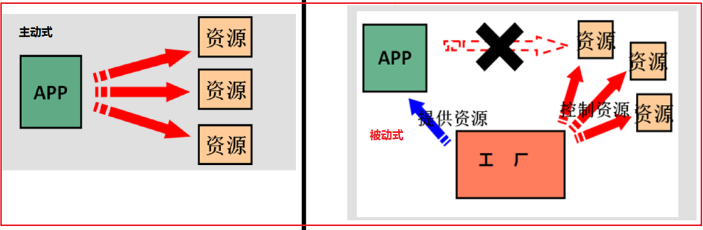

# 01-Spring框架介绍

Spring是分层的JavaSE/EE应用full-stack(全栈)轻量级开源框架;


①Spring框架是J2EE企业级应用的轻量级开源框架,提供了表现层springmvc和持久springJDBC(JDBCTemplate)，以及业务层的事务管理等企业级应用解决方案；

②Spring还能将开源世界中众多优秀的第三方框架进行集成(比如mybatis,junit,aspectj等)，成为了越来越受欢迎的J2EE企业级应用框架；

③Spring是以IOC（Inversion Of Control）控制反转和AOP（Aspect Oriented Programming）面向切面编程为核心;

# 02-Spring体系


# 2.优质程序代码的书写原则

## 03-程序的耦合与内聚

【1】耦合与内聚介绍

- 耦合（Coupling）：代码书写过程中模块间的结合紧密度(程序之间的依赖程度)，用于衡量软件中各个模块之间的互联程度；

- 内聚（Cohesion）：代码书写过程中单个模块内部各组成部分间的联系，用于衡量软件中各个功能模块内部的功能联系；

- 程序书写的目标：高内聚，低耦合

  就是同一个模块内的各个元素之间要高度紧密，但是各个模块之间的相互依存度却不要那么紧密

耦合和内聚代码示例

【2】内聚示例代码

内聚：说白了就是一个方法只做一件事情，或者一个模块只做一个业务方向；

```java
//反例: 一个方法内实现了太多的计算功能，不符合高内聚思想 弊端：不方便维护，扩展性差
public int compute(int i,int j,String label){
    if("+".equals(label)){
        return i+j;
    }else if("-".equals(label)){
        return i-j;
    }else{
        //do something....
    }  
}

//高内聚例子: 好处：扩展性好 开闭原则：向扩展开发，向修改闭合
public int add(int i,int j){
    return i+j;
}
public int sub(int i,int j){
    return i-j;
}
```

【2】耦合示例代码

以**三层架构服务调用为例**讲解：

定义dao实现：

```java
/**
 * @description 定义dao接口
 */
public interface UserDao {
    void add();
    void update();
}

/**
 * @description 定义dao接口实现
 */
public class UserDaoImpl implements UserDao {
    @Override
    public void add() {
        System.out.println("add run...");
    }

    @Override
    public void update() {
        System.out.println("update run...");
    }
}
```

- 定义服务层接口：

```java
/**
 * 定义服务层接口
 */
public interface UserService {
    public void add();
    public void update();
}

/**
 * @description 定义服务接口实现
 */
public class UserServiceImpl implements UserService {
    /**
     * UserServiceImpl下的add()必须引用UserDaoImpl对象，才能实现功能，我们就说
     * update这个方法与UserDaoImpl存在耦合
    */
    @Override
    public void add() {
        UserDao userDao=new UserDaoImpl();
        userDao.add();
    }

    @Override
    public void update() throws Exception {
        UserDao userDao=DaoFactory.getInstance();
        userDao.update();
    }
}
```

## 04-耦合的弊端

| 耦合弊端     | 说明                                                         |
| ------------ | ------------------------------------------------------------ |
| 维护成本高   | 以UserService调用UserDao为例，如果DAO实现方案修改，则需要做硬编码调整，维护性差； |
| 独立性差     | 以UserService调用UserDao为例，UserService下功能脱离UserDao无法独立实现功能； |
| 可复用性不高 | 因为模块间存在耦合，导致很难被有效引用；比如：B与C耦合，而A仅仅想引用B，但实际情况是A间接与C也耦合了，说明B的复用性较差； |

## 05-工厂模式降低耦合

【1】原始方案

- 服务层与持久层存在耦合，一旦替换持久层实现方案，则需要硬编码修改代码，维护性很差；


【2】工厂模式降低耦合

- 思考：服务层与持久层存在耦合，说白了就是在服务层直接创建持久层对象，存在强引用，也就是紧耦合，如何解决？

- 我们可以把创建持久层对象的功能封装到一个工具类下，也就是说这个工具类专门用来创建持久层对象，将来方案修改，也仅仅修改工具类即可，这也就是工厂模式的雏形；


- 示例代码:

- 构建持久层和服务层工厂类：

```java
/**
 * @description 构建持久层工厂类
 */
public class DaoFactory {
	public static UserDao getInstance(){
        //虽然解决了引用方的耦合问题：userService引用userDao，
        //但是引入了新的耦合：工厂与创建的对象的耦合
        return new UserDaoImpl();
    }
}
```

- 引用工厂类降低解耦示例代码：

```java
/**
 * @description 服务层调用持久层工厂类实现功能
 */
public class UserServiceImpl implements UserService {

    @Override
    public void add() {
        UserDao userDao= DaoFactory.getInstance();
        userDao.add();
    }

    @Override
    public void update() throws Exception {
        UserDao userDao=DaoFactory.getInstance();
        userDao.update();
    }
}
```

- 思考：

- 1.引入工厂模式的好处与弊端？

  - 好处：当持久层或者服务层方案修改时，仅仅修改工厂类即可完成实现方案的切换，维护性相对较好；

  - 弊端：加入工厂模式后，服务层与持久层完成解耦，但是又引入的新的耦合，即工厂类与持久层存在紧耦合；

## 06-基于工厂模式模拟Spring雏形

### 【1】工厂模式的思考

- 如何将工厂类与工厂生产的对象之间实现解耦？

  - 1）将工厂生产的对象类信息配置到静态文件中；

  - 2）工厂类通过I/O加载静态资源，获取配置信息，然后通过反射创建对象；

- 好处：将工厂创建的对象静态配置化，这样即使对象实现方案进行了切换，也仅仅修改静态文件，无需修改工厂代码；			


 - 最终方案 ：**工厂+配置文件+反射**实现解耦

 - 示例代码:
- 在Spring中工厂维护的对象称为Bean；

### 【2】工厂模式Bean多实例实现

- 使用bean.properties配置对象信息：

```properties
userDao=com.pp.dao.impl.UserDaoImpl
userService=com.pp.service.impl.UserServiceImpl
```

- Bean多实例-工厂类代码

```java
package com.pp.factory;

import java.util.Enumeration;
import java.util.HashMap;
import java.util.Map;
import java.util.ResourceBundle;

/**
 * 工厂+静态配置文件+反射
 * @description 定义创建对象的工厂，实现bean多实例创建
 */
public class BeanFactory {
    //专门存放bena的定义信息的
    private static Map<String,String> beanDefination=new HashMap<>();

    //使用静态代码块，实现bean.properties文件资源走io只加载一次即可
    static {
        //加载配置文件
        ResourceBundle bundle = ResourceBundle.getBundle("bean");
        Enumeration<String> keys = bundle.getKeys();
        while (keys.hasMoreElements()) {
            String key = keys.nextElement();
            String className=bundle.getString(key);
            beanDefination.put(key,className);
        }
    }

    //获取bean对象
    public static Object getBean(String beanName) throws Exception {
            //通过传入的beanName获取ClassName===》反射创建对象
            String className = beanDefination.get(beanName);
            Class<?> aClass = Class.forName(className);
            Object bean = aClass.newInstance();
        return bean;
    }
}
```

调用代码示例：

```java
package com.pp.service.impl;

import com.pp.dao.UserDao;
import com.pp.factory.BeanFactory;
import com.pp.factory.DaoFactory;
import com.pp.service.UserService;

/**
 * @description 调用bean工厂
 */
public class UserServiceImpl implements UserService {
    @Override
    public void add() {
		//UserDao userDao=new UserDaoImpl();
        UserDao userDao= (UserDao) BeanFactory.getBean("userDao");
        userDao.add();
    }

    @Override
    public void update() throws Exception {
		//UserDao userDao=DaoFactory.getInstance();
        UserDao userDao= (UserDao) BeanFactory.getBean("userDao");
        userDao.update();
    }
}
```

### 【3】工厂模式Bean单实例实现

```java
package com.pp.factory;

import java.util.Enumeration;
import java.util.HashMap;
import java.util.Map;
import java.util.ResourceBundle;

/**
 * 工厂+静态配置文件+反射
 * @description 实现一个key（bean名称）只能对应一个bean对象
 */
public class BeanFactory {
    //专门存放bena的定义信息的
    private static Map<String,String> beanDefination=new HashMap<>();

    //定义存储创建好的对象的map容器
    private static Map<String,Object> singletonObjects=new HashMap<>();

    //使用静态代码块，实现bean.properties文件资源走io只加载一次即可
    static {
        //加载配置文件
        ResourceBundle bundle = ResourceBundle.getBundle("bean");
        Enumeration<String> keys = bundle.getKeys();
        while (keys.hasMoreElements()) {
            String key = keys.nextElement();
            String className=bundle.getString(key);
            beanDefination.put(key,className);
        }
    }

    //获取bean对象
    public static Object getBean(String beanName) throws Exception {
        //当应用调用getBean方法时，先从对象缓存中获取，如果没有则反射创建，否则直接返回
        Object bean = singletonObjects.get(beanName);
        if (null==bean) {
            //通过传入的beanName获取ClassName===》反射创建对象
            String className = beanDefination.get(beanName);
            Class<?> aClass = Class.forName(className);
           bean = aClass.newInstance();
           //存储容器
            singletonObjects.put(beanName,bean);
        }
        return bean;
    }
}
```

作业：

		如何在bean单实例模式下，实现bean对象的恶汉加载？

## 07-Spring发展历程


程序间的耦合是无法彻底消除的，只能尽可能的降低耦合；

# 3.Spring IOC 入门

## 08-IOC概念介绍



| 概念                                     | 说明                                                         |
| ---------------------------------------- | ------------------------------------------------------------ |
| **控制翻转-IOC(Inversion Of Control)**   | 翻转的是对象的创建权，最终**对象由程序本身交给Spring工厂去创建**； |
| ---------------------------------------- | ------------------------------------------------------------------------- |
| **IOC容器**                              | 容器是存储对象的地方，底层就是一个Map容器；Spring控制的资源全部放置在容器中，该容器称为IoC容器； |
| ---------------------------------------- | -------------------------------------------------------------------------- |
| **Bean对象**                             | Spring容器中存储的对象称为bean；                             |
| ---------------------------------------- | --------------------------------------------------------------------------- |


小结：

IOC是什么？

		**控制翻转:说白了就是对象创建的权限由程序本身交给spring IOC容器去创建维护；**

## 09-基于XML搭建Spring IOC环境

开发流程：

```tex
1.引入Spring核心依赖；
2.定义好需要被IOC容器管理的类(包括自定义类和引入第三方的类)；
3.在xml中配置bean对象信息；
4.使用Spring提供的工厂类加载xml文件，初始化IOC容器
6.从容器中获取bean对象，完成业务功能；
```

- 1.导入Spring的核心jar包的坐标: 
```xml
<dependencies>
    <!--引入Spring核心-->
    <dependency>
        <groupId>org.springframework</groupId>
        <artifactId>spring-context</artifactId>
        <version>5.0.2.RELEASE</version>
    </dependency>
	<!--引入单元测试-->
    <dependency>
        <groupId>junit</groupId>
        <artifactId>junit</artifactId>
        <version>4.13.2</version>
        <scope>test</scope>
    </dependency>
</dependencies>
```

- 2.定义Bean相关的接口和实现类 

```java
/**
 * @description 定义接口
 */
public interface UserService {
    void  add();
    String getName(String data);
}

/**
 * @description 定义接口实现
 */
public class UserServiceImpl implements UserService {

    @Override
    public void add() {
        System.out.println("add run....");
    }

    @Override
    public String getName(String data) {
        System.out.println("getName:"+data);
        return data;
    }
}
```

- 3.创建applicationContext.xml,并导入约束

```xml
<?xml version="1.0" encoding="UTF-8"?>
<beans xmlns="http://www.springframework.org/schema/beans"
       xmlns:xsi="http://www.w3.org/2001/XMLSchema-instance"
       xsi:schemaLocation="http://www.springframework.org/schema/beans
        http://www.springframework.org/schema/beans/spring-beans.xsd">
    <!--配置bean
        bean标签：配置bean对象
            属性：
                id:定义bean的名称，在当前的ioc容器中全局唯一
                class:资源的全限定名称
    -->
    <bean id="userService" class="com.pp.service.impl.UserServiceImpl"/>
</beans>
```

- 4.构建IOC容器并获取容器中Bean对象

```java
/**
 * @description 测试IOC容器并获取bean对象
 */
public class TestDemo {

    /**
     * 测试使用绝对路径加载xml文件
     */
    @Test
    public void test1()  {
        //1.创建ioc容器，并加载xml文件
        ApplicationContext ctx = new ClassPathXmlApplicationContext("applicationContext.xml");
        //2.获取bean对象
        //方式1：根据bean名称获取bean对象 弊端：需要类型强转
        //UserService userService = (UserService) ctx.getBean("userService");
        //方式2：根据bean名称和类型获取，无需类型强转
        UserService userService =  ctx.getBean("userService",UserService.class);
        String name = userService.getName("张三");
        System.out.println(name);
    }
}    
```


扩展：

单元测试可能出现无法加载junit类的问题，如何解决？


# 4.Bean工厂类核心体系结构

## 10-应用上下文接口-ApplicationContext

ApplicationContext接口特点：

- 它是IOC容器接口,可通过该接口根据bean的id来获取想要的bean对象；
- 容器中的bean默认在容器启动时立即加载；

ApplicationContext接口常见实现类：

| 类名                               | 特点                                                         | 等级 |
| ---------------------------------- | ------------------------------------------------------------ | ---- |
| ClassPathXmlApplicationContext     | 读取类路径下的xml配置文件初始化IOC容器，不在类路径下则读取不到 | 掌握 |
| FileSystemXmlApplicationContext    | 读取文件系统中的配置文件，只要有访问权限，在文件系统中都能读取到 | 了解 |
| AnnotationConfigApplicationContext | 用于根据注解配置，创建IOC容器 【第二天内容】                 | 掌握 |

**总之，ApplicationContext接口下的实现默认在容器启动时就立即创建所有的bean对象；**


示例代码：

```java
    /**
     * 测试使用绝对路径加载xml文件
     */
    @Test
    public void test1()  {
        //1.通过xml的绝对路径加载ioc容器 【了解】
        ApplicationContext ctx = new FileSystemXmlApplicationContext("E:\\day01_2_spring_xml_ioc\\src\\main\\resources\\applicationContext.xml");
        UserService userService = ctx.getBean("userService", UserService.class);
        userService.add();
    }
```

## 11-IOC根接口-BeanFactory

BeanFactory接口特点：

- 它是Spring中IOC容器根接口，ApplicationContext也只是它的子接口；
- 它默认使用延迟加载(懒加载)的思想创建容器中的bean对象；
- 它每次在调用getBean方法时才真正的创建对象；


示例代码：

```java
/**
  * 测试BeanFactory接口下的直接实现===》懒汉加载模式
  */
@Test
public void test2()  {
    ClassPathResource resource = new ClassPathResource("applicationContext.xml");
    XmlBeanFactory beanFactory = new XmlBeanFactory(resource);
    UserService userService = (UserService) beanFactory.getBean("userService");
    userService.add();
}
```

## 12-Bean工厂类核心体系结构小结

【1】 BeanFactory与ApplicationContext接口的区别？ 


| 特点              | 说明                                                         |
| ----------------- | ------------------------------------------------------------ |
| 父子关系          | ApplicationContext是BeanFactory的一个子接口；                |
| ----------------- | --- |
| bean的加载时机    | ApplicationContext立即加载，也就是说容器一初始化，就创建bean对象；BeanFactory：延迟加载，当调用getBean方法时，才会加载； |
| ----------------- | --- |
| 常见实现          | BeanFactory常见实现类：XmlBeanFactoryApplicationContext常见实现类：ClassPathXmlApplicationContextFileSystemXmlApplicationContextAnnotationConfigApplicationContext |
| ----------------- | ---- |

# 5.Spring IOC XML配置

## 13-IOC创建Bean的三种方式

IOC创建bean对象有3中方式：

```tex
1.构造器创建；
2.静态工厂创建；
3.非静态工厂创建；
```

物料准备：

		定义服务接口：

```java
/**
 * 定义接口
 */
public interface UserService {
    void  add();
    String getName(String data);
}
-----
/**
 * @description 定义服务接口实现
 */
public class UserServiceImpl implements UserService {
    @Override
    public void add() {
        System.out.println("add run....");
    }
    @Override
    public String getName(String data) {
        System.out.println("getName:"+data);
        return data;
    }
}
```

【1】通过默认构造函数创建

- xml配置：

```xml
<!--配置bean
        bean标签：配置bean对象
            属性：
                id:定义bean的名称，在当前的ioc容器中全局唯一
                class:资源的全限定名称
         方式1：创建方式：构造器 【主流】
    -->
<bean id="userService" class="com.pp.service.impl.UserServiceImpl"/>
```

【2】通过静态工厂创建bean

创建静态工厂类：

```java
/**
 * @description 定义静态工厂
 */
public class UserFactory {
    public static UserService getInstance(){
        return new com.pp.service.impl.UserServiceImpl();
    }
}
```

xml配置：

```xml
    <!--方式2：使用静态工厂创建bean-->
    <!--
        通过class属性指定工厂bean，然后调用工厂下factory-method属性指定的方法执行，返回的结果被ioc容器管理，同时通过
        id属性指定bean的名称
    -->
    <bean id="userService2" class="com.pp.service.factory.UserFactory" factory-method="getInstance"/>
```

说明：工厂静态方法创建的bean对象被IOC容器维护管理；

【3】通过非静态工厂创建bean

定义非静态工厂类：

```java
/**
 * @description 非静态工厂
 */
public class UserFactory2 {
    public  UserService getInstance(){
        return new com.pp.service.impl.UserServiceImpl();
    }
}
```

xml配置：

```xml
<!--方式3:非静态工厂创建bean-->
<bean id="myFactory" class="com.pp.service.factory.UserFactory2"/>
<bean id="userService3" factory-bean="myFactory" factory-method="getInstance"/>
```

<div style="background-color:orange">测试代码:</div>

```java
    @Test
    public void test3()  {
        //1.通过xml的绝对路径加载ioc容器 【了解】
        ApplicationContext ctx = new ClassPathXmlApplicationContext("applicationContext.xml");
//        UserService userService = ctx.getBean("userService2", UserService.class);
        UserService userService = ctx.getBean("userService3", UserService.class);
        userService.add();
    }
```

小结：

Spring IOC构建bean对象有几种方式？

## 14-Bean对象的作用域

Spring中bean共有5种 作用范围： 

| 名称               | 作用                                                         | 等级 |
| ------------------ | ------------------------------------------------------------ | ---- |
| **单例-singleton** | 在spring IoC容器中指定的bean名称仅存在一个Bean实例与之对应，Bean以单例方式存在，且是Spring默认作用域。 | 掌握 |
| **多例-prototype** | 每次从容器中调用getBean方法时，都会返回一个新的实例对象。    | 掌握 |
| -------------      | ----------- | ---- |
| 请求域-request     | 请求域可共享相同的bean                                       | 了解 |
| 会话域-session     | 会话域域内可共享相同的bean                                   | 了解 |
| global-session     | 全局会话范围，当非集群环境下，它就是session                  | 了解 |

<div style="background-color:orange">示例代码:</div>
作用域配置XML:

```xml
<?xml version="1.0" encoding="UTF-8"?>
<beans xmlns="http://www.springframework.org/schema/beans"
       xmlns:xsi="http://www.w3.org/2001/XMLSchema-instance"
       xsi:schemaLocation="http://www.springframework.org/schema/beans
        http://www.springframework.org/schema/beans/spring-beans.xsd">

    <!--配置单例:单例是指某个名称对应的bean只能有一个bean对象
        加载方式：饿汉模式 singleton===>bean
    -->
    <bean id="userService1"  class="com.pp.service.impl.UserServiceImpl"/>
    <bean id="userService2" scope="singleton" class="com.pp.service.impl.UserServiceImpl"/>
    <!--设置bena作用于为多例
            getBean（）方法调用一次，就创建一次，此时ioc容器只负责对象的创建，不负责对象的维护
            对象用完后，被gc回收
            加载范式：懒汉加载模式
    -->
    <bean id="userService3" scope="prototype" class="com.pp.service.impl.UserServiceImpl"/>
</beans>
```

测试代码：

```java
public class TestDemo {
    private ApplicationContext ctx;
    @Before
    public void init(){
        ctx=new ClassPathXmlApplicationContext("applicationContext.xml");
    }

    /**
     * 测试作用域
     */
    @Test
    public void test1()  {
        UserService userService1 = ctx.getBean("userService1", UserService.class);
        UserService userService2 = ctx.getBean("userService2", UserService.class);
        UserService userService3 = ctx.getBean("userService2", UserService.class);
        UserService userService4 = ctx.getBean("userService3", UserService.class);
        UserService userService5 = ctx.getBean("userService3", UserService.class);
        System.out.println(userService1==userService2);//true
        System.out.println(userService2==userService3);//true
        System.out.println(userService4==userService5);//false
    }
}
```

## 15-1-Bean对象<span id="17">生命周期</span>

【1】java对象生命周期概述

| 过程     | 说明                             |
| -------- | -------------------------------- |
| 对象出生 | 当对象被加载到内存时             |
| 对象活着 | 对象未被销毁（未被垃圾回收）     |
| 对象死亡 | 对象被从内存中移除（被垃圾回收） |

Spring 创建的Bean对象的生命周期大致也分为这3步骤，但是对于Spring创建的Bean对象，因其**作用域不同，会产生不同过程的生命周期**；

【2】单例对象生命周期概述

| 过程         | 说明                                            |
| ------------ | ----------------------------------------------- |
| Bean对象出生 | **当容器创建时对象出生**,并回调init初始化方法； |
| Bean对象活着 | **只要容器存在，对象一直活着**；                |
| Bean对象死亡 | **容器销毁，对象消亡**，并回调destroy销毁方法； |

测试代码：

		1）给UserServiceImpl类添加无参构造，并断点测试发现，容器在未调用getBean方法之前就将对象创建完毕：

```java
package com.pp.service.impl;

import com.pp.service.UserService;

/**
 * @description 添加构造器
 */
public class UserServiceImpl implements UserService {
    /**
     * @description 添加构造器，这样对象一被创建则触发信息打印
     */
    public UserServiceImpl() {
        System.out.println("userService init....");
    }

    @Override
    public void add() {
        System.out.println("add run....");
    }

    @Override
    public String getName(String data) {
        System.out.println("getName:"+data);
        return data;
}
    //先构造器方法执行，再init方法执行
    public void initUser(){
        System.out.println("initUser run......");
    }
	//定义对象销毁方法
    public void destroyUser(){
        System.out.println("destroyUser run......");
    }

```

		2）applicationContext-liftcycle.xml配置

```xml
<?xml version="1.0" encoding="UTF-8"?>
<beans xmlns="http://www.springframework.org/schema/beans"
       xmlns:xsi="http://www.w3.org/2001/XMLSchema-instance"
       xsi:schemaLocation="http://www.springframework.org/schema/beans
        http://www.springframework.org/schema/beans/spring-beans.xsd">
    <!--测试单例模式下的生命周期
        出生：容器被创建时创建
        活着：容器在，我在
        死亡：容器销毁，对象销毁
        init方法执行时机：bean对象被创建后再执行
        销毁时机：容器关闭销毁后执行
    -->
    <bean id="userService"
          scope="singleton"
          init-method="initUser"
          destroy-method="destroyUser"
          class="com.pp.service.impl.UserServiceImpl"/>
</beans>    
```

	3)测试

```java
/**
 * @description 测试对象生命周期
 */
public class TestBeanLifecycle {

    private ClassPathXmlApplicationContext ctx;
    @Before
    public void init(){
        ctx=new ClassPathXmlApplicationContext("applicationContext-liftcycle.xml");
    }

    /**
     * 测试单例
     */
    @Test
    public void test1()  {
        UserService userService = ctx.getBean("userService", UserService.class);
        userService.add();
        //显式关闭ioc容器
        //关闭容器，对象的destroy方法触发执行
        ctx.close();
    }
}    
```

【2】多例对象生命周期概述

| 过程         | 说明                                                         |
| ------------ | ------------------------------------------------------------ |
| Bean对象出生 | **当程序调用getBean方法时对象出生**,并回调init初始化方法；   |
| Bean对象活着 | **容器只负责创建对象，不负责维护（只要对象未被垃圾回收，则活着）**； |
| Bean对象死亡 | 对象被垃圾回收（不会调用destroy销毁方法）；                  |

1）xml配置示例：

```xml
<!--
        多例模式下:
        出生：懒加载模式，当调用一次getBean方法时对象被创建，同时执行init方法
        活着：对象被使用，未被垃圾回收
        死亡：gc回收，destroy方法不会被执行的
    -->
<bean id="userService2"
      scope="prototype"
      init-method="initUser"
      destroy-method="destroyUser"
      class="com.pp.service.impl.UserServiceImpl"/>
```

2）测试代码

```java
/**
  * 测试多例
  */
@Test
public void test2()  {
    //容器未调用getBean方法时，未被创建
    UserService userService = ctx.getBean("userService2", UserService.class);
    //调用getBean方法时，对象被创建，并执行init方法
    UserService userService2 = ctx.getBean("userService2", UserService.class);
    userService.add();
    //显式关闭ioc容器
    //关闭容器，对象的destroy方法不会被执行
    ctx.close();
}
```

扩展：


解决：


## 15-2 Bean对象生命周期小结

面试问题：

Spring对象生命周期介绍？

| 维度                | 单例作用域           | 多例作用域                |
| ------------------- | -------------------- | ------------------------- |
| 声明关键字          | singleton            | prototype                 |
| 默认对象创建时机    | 容器创建时，被创建   | 调用getBean方法时被创建   |
| 容器是否维护bean    | 是，singletonobjects | 否                        |
| init方法是否执行    | 容器创建后，执行     | 调用getBean方法时触发执行 |
| 对象存活            | 容器在，则对象在     | 只要被使用，则存活        |
| 对象死亡            | 容器销毁，则对象销毁 | 不被使用，                |
| destroy方法是否执行 | 容器销毁，则执行     | 容器销毁不会被执行（gc）  |


# 6.Spring中的DI-依赖注入

## 16-依赖注入概述

【1】依赖注入名词解释


> 依赖注入：Dependency Injection简称DI;
> 通俗来讲: 程序缺什么资源，Spring IOC容器就提供什么资源；
> 举例:
> 在三层架构中一般UserService的bean对象要依赖UserDao对象来实现功能，那么Spring就会将UserDao资源提供给UserService对象；


【2】注入数据的方式


> Spring注入的方式有三种：
>     第一种：使用构造方法注入
>     	要求：必须有对应参数列表的构造函数
>     第二种：使用setter方法注入（XML开发主流）
>     	要求：提供被注入对象的set方法（不需要get方法）
>     第三种：使用注解注入（第二天会学）


【3】注入数据类型


> 注入的数据类型有三类：
>     第一类：基本类型和String【单值类型】
>     第二类：其他bean类型
>     要求：其他bean指的是在spring的配置文件中定义过的bean，或者是用注解注释过的类。
>     第三类：复杂类型（集合类型）
>    		Array
>         List 
>         Map
>         Properties
>         set


## 17-Spring 3种注入数据的方式

### 【1】有参构造注入

1)给测试的bean提供 构造方法：

```java
package com.pp.service.impl;

import com.pp.service.UserService;
import com.pp.pojo.User;
public class UserServiceImpl2 implements UserService {

    private String userName;
    private Integer age;
 	//添加构造方法
    public UserServiceImpl2(String userName, Integer age) {
        this.userName = userName;
        this.age = age;
        System.out.println(userName+"---"+age);
    }
    @Override
    public String toString() {
        return "UserServiceImpl2{" +
                "userName='" + userName + '\'' +
                ", age=" + age +
                ", user=" + user +
                '}';
    }
}
```

2）配置xml:

```xml
    <!--方式1：有参构造器注入 [适合小数据的注入]
        constructor-arg:构造器标签
            常用属性：
               name指定构造器中形参的名称
               value：形参实际传入的值
    -->
    <bean id="userService1" class="com.pp.service.impl.UserServiceImpl2">
        <constructor-arg name="userName" value="张三"/>
        <constructor-arg name="age" value="10"/>
    </bean>
```

3）测试

```java
public class TestBeanDI {

    private ApplicationContext ctx;
    @Before
    public void init(){
        ctx=new ClassPathXmlApplicationContext("applicationContext-di.xml");
    }
    
    /**
     * 测试有参构造器注入
     */
    @Test
    public void test1()  {
        UserService userService = ctx.getBean("userService1", UserService.class);
        //打印了userName和age等属性信息
        System.out.println(userService);
    }
}    
```

### 【2】setter注入

1）给对象属性条件setter方法

```java
public void setUserName(String userName) {
    System.out.println("setUserName run....");
    this.userName = userName;
}

public void setAge(Integer age) {
    System.out.println("setAge run....");
    this.age = age;
}
```

2)xml配置

```xml
<!--方式2：setter注入 必须给类中属性提供setter方法-->
<bean id="userService2" class="com.pp.service.impl.UserServiceImpl2">
    <!--age==>setAge setAge-->
    <property name="age" value="18"/>
    <property name="userName" value="张三"/>
</bean>    
```

3)测试

```java
public class TestBeanDI {

    private ApplicationContext ctx;
    @Before
    public void init(){
        ctx=new ClassPathXmlApplicationContext("applicationContext-di.xml");
    }
    
    /**
     * 测试有参构造器注入
     */
    @Test
    public void test1()  {
        UserService userService = ctx.getBean("userService1", UserService.class);
        //打印了userName和age等属性信息
        System.out.println(userService);
    }
}    
```

### 【3】注解注入（第二天知识点）

- 小结:


| 注入方式   | 要求                   | xml标签关键词       |
| ---------- | ---------------------- | ------------------- |
| 构造器注入 | 必须要有对应的构造函数 | constructor-arg标签 |
| Setter注入 | 必须要有setter方法     | property标签        |
| 注解注入   | 略                     | 略                  |

## 18-Setter注入Bean对象

- 因为在上一小结我们已经演示了基本类型和String的setter注入操作，所以接下来我们实现bean'对象的setter注入；

在Java中，Setter注入是一种依赖注入（Dependency Injection）方式。通常情况下，Java类需要依赖其他类的实例才能完成一些功能，Setter注入就是将依赖的对象通过Setter方法注入到类中。

例如，假设我们有一个`UserService`类，需要依赖一个`UserDao`对象才能完成用户信息的查询和保存。我们可以通过Setter注入方式将`UserDao`对象注入到`UserService`中：

```java
public class UserService {
    private UserDao userDao;

    public void setUserDao(UserDao userDao) {
        this.userDao = userDao;
    }
}
```

在上面的例子中，`UserService`类定义了一个`UserDao`对象，并且提供了一个名为`setUserDao`的Setter方法。
当使用`UserService`时，我们可以调用`setUserDao`方法将一个`UserDao`对象注入到`UserService`中，
从而让`UserService`类能够使用`UserDao`对象完成一些功能。

例如，假设我们有一个`UserController`类，需要使用`UserService`对象来查询和保存用户信息。
我们可以将一个`UserService`对象注入到`UserController`中：

```sh
public class UserController {
    private UserService userService;

    public void setUserService(UserService userService) {
        this.userService = userService;
    }
}
```

在上面的例子中，`UserController`类定义了一个`UserService`对象，并且提供了一个名为`setUserService`的Setter方法。
当使用`UserController`时，我们可以调用`setUserService`方法将一个`UserService`对象注入到`UserController`中，
从而让`UserController`类能够使用`UserService`对象完成一些功能。同时，由于`UserService`类依赖`UserDao`对象，
我们还需要将一个`UserDao`对象注入到`UserService`中，以完成`UserService`类的初始化。


## 19-Setter注入复杂类型

### 【1】注入数组

1）UserServiceImpl2添加数组属性，并设置setter方法

```sh
private String[] addresses;
public void setAddresses(String[] addresses) {
    this.addresses = addresses;
}
```

2)XML配置

```xml
    <bean id="userService2" class="com.pp.service.impl.UserServiceImpl2">
        <!--注入数组-->
        <property name="addresses">
            <array>
                <value>北京</value>
                <value>上海</value>
                <value>广州</value>
                <value>深圳</value>
            </array>
        </property>
	</bean>        
```

### 【2】注入list集合

1）UserServiceImpl2添加`List<User>`属性，并设置setter方法

```sh
private List<User> userList;
public void setUserList(List<User> userList) {
    this.userList = userList;
}
```

2)XML配置

```xml
<bean id="userService2" class="com.pp.service.impl.UserServiceImpl2">
    <!--注入list集合-->
    <property name="userList">
        <list>
            <bean class="com.pp.pojo.User">
                <constructor-arg name="name" value="王五"/>
                <constructor-arg name="address" value="香港"/>
            </bean>
            <bean class="com.pp.pojo.User">
                <constructor-arg name="name" value="王五2"/>
                <constructor-arg name="address" value="香港"/>
            </bean>
        </list>
    </property>
</bean>    
```

### 【3】注入Map集合

1）UserServiceImpl2添加Map属性，并设置setter方法

```sh
private Map<String,Object> maps;    
public void setMaps(Map<String, Object> maps) {
    this.maps = maps;
}
```

2）XML配置

```xml
<bean id="userService2" class="com.pp.service.impl.UserServiceImpl2">    
    <!--注入map集合-->
    <property name="maps">
        <map>
            <entry key="name" value="赵六"/>
            <entry key="age" value="18"/>
        </map>
    </property>
</bean>   
```

### 【4】注入Properties对象

1）UserServiceImpl2添加Properties属性，并设置setter方法

```sh
private Properties propes;
public void setPropes(Properties propes) {
    this.propes = propes;
}
```

2)XML配置

```xml
<bean id="userService2" class="com.pp.service.impl.UserServiceImpl2">    
        <!--注入properties对象-->
        <property name="propes">
            <props>
                <prop key="music">rock</prop>
                <prop key="play">football</prop>
            </props>
        </property>
</bean>   
```

### 【5】注入Set类型

1）UserServiceImpl2添加Set属性，并设置setter方法

```java
private Set houses;    
public void setHouses(Set houses) {
    this.houses = houses;
}
```

2）XML配置

```xml
<bean id="userService2" class="com.pp.service.impl.UserServiceImpl2">    
        <!--注入set-->
        <property name="houses">
           <set>
               <value>一环</value>
               <value>二环</value>
               <value>三环</value>
               <value>三环</value>
           </set>
        </property>
</bean>   
```

注意：set类型注入自动完成去重操作；

## 20-Spring 依赖注入小结

```
问答题:
	Spring的两大核心是什么?
	   IOC和AOP
    简述Spring的IOC?
    	IOC:控制翻转，程序创建对象的权限由程序本身交给Spring IOC容器去创建；
    简述IOC的作用?
    	解耦
    简述解耦的方式?
    	工厂模式+静态配置文件+反射
    简述Spring的核心API,并描述其功能?
    	顶层接口：BeanFactory 特点：Bean创建模式延迟加载；
    	子接口：ApplicationContext 特点：Bean对象在Ioc容器创建时加载；
    	常见实现：ClassPathXmlApplicationContext、FileSystemXmlApplicationContext、AnnotationConfigApplicationContext;
    简述bean对象的多种创建方式?
    	1)构造器创建 前提：要有对应的构造函数 【主流】
    	2）静态工厂 标签示例：<bean id="xxx" class="工厂类的全限定名称" factory-method="工厂静态方法"/>
    	3)非静态工厂 标签示例：<bean id="xxx" factory-bean="工厂类bean的id" factory-method="工厂静态方法"/>
    简述bean对象的作用范围?
    	scope属性指定：
    	单例：singleton----》bean的名称对应的bean对象在ioc容器中只有一个
    	多例：prototype----》IOC容器只负责对象的创建，不负责维护；
    	----------------------
    	request域
    	session域
    	global-session域
    简述bean对象的生命周期?
    	单例模式：出生：IOC容器创建，则创建，回调init-method属性指定的方法
    			活着：容器存在，则活着
    			销毁：容器销毁，则销毁，同时回调destroy-method属性指定的方法
    	多例模式：出生：调用getBean方法则创建，回调init-method属性指定的方法
    			活着：被使用，则活着
    			销毁：不使用，则被jvm垃圾回收，不会回调destroy-method属性指定的方法    			
         			
    什么是DI?
    	依赖注入，说白了，程序（应用方）需要什么，IOC容器就提供什么资源；
    依赖注入的方式?
        构造器注入 <constructor-arg>、setter注入 <property>、注解注入；
  	依赖注入的数据类型?	
  	    1.基本类型和String 标签属性：value
  	    2.bean对象 标签属性：ref reference
  	    3.复杂类型
  	    	数组 array
  	    	List list
  	    	Map  map===>entry
  	    	Set  set
  	    	Properties props===>prop
```
