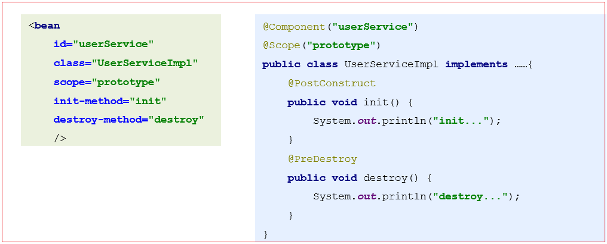
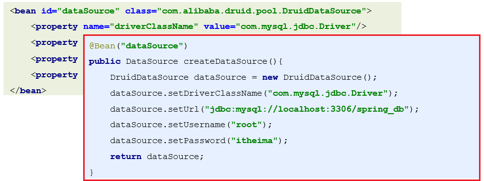
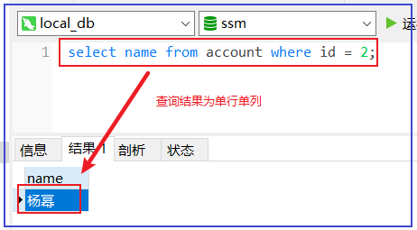
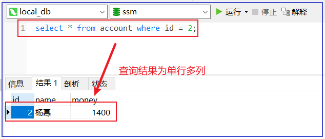
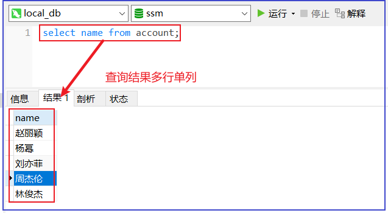
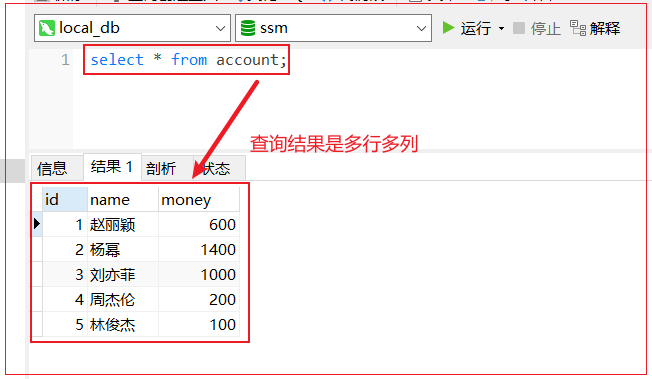
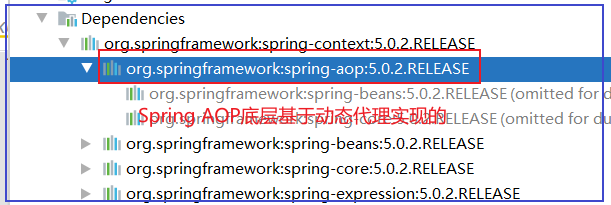

# 第一章 IOC相关注解

## 01-注解驱动介绍

#### 1）什么是注解驱动

注解驱动原意是注解驱动开发，在Spring工程中使用注解的形式替代xml配置，**将繁杂的spring配置文件从工程中彻底消除掉**，简化书写：



#### 2）注解驱动的弊端

- 为了达成注解驱动的目的，可能会将原先很简单的书写，变的更加复杂；

- **比如：XML中配置第三方开发的资源是很方便**的，但使用注解驱动无法在第三方开发的资源中进行编辑，因此会增大开发工作量；



注意：

【1】实际开发中如果我们自己定义的类想要被IOC容器管理，那么一般使用注解开发；

【2】如果是第三方提供的类，比如Druid连接池对象，那么建议使用xml配置；

## 02-IOC注解配合xml开发流程说明

### 【1】开启注解扫描功能

- 在spring XML配置文件中<font color='red'>启动注解扫描</font>，加载类中配置的注解项

  ```xml
  <!--
  	扫描com.heima下的一切资源（包路径无限递归扫描），满足spring注解，那么就通过发射创建bena对象，然后加入ioc容器
  -->
  <context:component-scan base-package="com.heima"/>
  ```

- xml约束注意事项

```xml
<?xml version="1.0" encoding="UTF-8"?>
<beans xmlns="http://www.springframework.org/schema/beans"
       xmlns:xsi="http://www.w3.org/2001/XMLSchema-instance"
       xmlns:context="http://www.springframework.org/schema/context"
       xsi:schemaLocation="http://www.springframework.org/schema/beans
        http://www.springframework.org/schema/beans/spring-beans.xsd
        http://www.springframework.org/schema/context
        http://www.springframework.org/schema/context/spring-context.xsd">
    <context:component-scan base-package="your package path"/>
</beans>
```

### 【2】使用Bean常用注解

- 名称：@Component    @Controller    @Service    @Repository   @Configuration

- 类型：**类注解**

- 位置：**类的定义上方**

- 作用：设置该类为spring管理的bean

- 范例：

  ```java
  @Component("userService")
  public class AccountServiceImpl{
      //contain something
  }
  ```

  相当于：

  ```xml
  <bean id="userService" class="com.pp.service.impl.UserServiceImpl"/>
  ```

  说明：

  - @Controller、@Service 、@Repository、@Configuration都是@Component的衍生注解，功能同@Component一致的；
  - @Controller(控制层注解)、@Service（服务层注解） 、@Repository（持久层注解）、@Configuration（配置类注解）只是提供了更加明确的语义化(见名知意)，精确指出是哪一层的对象,但不是强制要求的；
  - 以上注解都有value属性，用于定义bean的id;
  - 以上注解相当于xml 中的bean标签：


  补：注解太多记不住，肿么办？

  you konw ，没有什么单词是有道翻译解决不了的，如果记不住，就多翻译几遍！

## 03-IOC注解配置xml开发实践

核心3步：

```tex
1）引入Spirng核心依赖；
2）xml配置文件开启注解扫描；
3）资源类上打IOC相关注解;
```

【1】工程环境引入Spring核心依赖

```xml
<dependency>
    <groupId>org.springframework</groupId>
    <artifactId>spring-context</artifactId>
    <version>5.0.2.RELEASE</version>
</dependency>
```

【2】XML配置开启注解扫描

```xml
<?xml version="1.0" encoding="UTF-8"?>
<beans xmlns="http://www.springframework.org/schema/beans"
       xmlns:xsi="http://www.w3.org/2001/XMLSchema-instance"
       xmlns:context="http://www.springframework.org/schema/context"
       xsi:schemaLocation="http://www.springframework.org/schema/beans
        http://www.springframework.org/schema/beans/spring-beans.xsd
        http://www.springframework.org/schema/context
        http://www.springframework.org/schema/context/spring-context.xsd">
    <!--开启spring的注解扫描-->
    <context:component-scan base-package="com.pp"/>
</beans>
```

【3】定义服务接口

```java
public interface UserService { 
    void  add();
    String getName(String data);
}
```

【4】定义服务接口实现，并使用Spring相关注解

```java
package com.pp.service.impl;

import com.pp.dao.UserDao;
import com.pp.service.UserService;
import org.springframework.beans.factory.annotation.Autowired;
import org.springframework.beans.factory.annotation.Qualifier;
import org.springframework.beans.factory.annotation.Value;
import org.springframework.context.annotation.Configuration;

import javax.annotation.Resource;

/**
 * 说明：
 * 如果注解中没有指定bean的名称，默认类名首字母小写作为bean的名称
 */
//@Component(value = "userService")
//@Component("userService")//特点：仅仅标识当前类可以作为一个bean被ioc容器管理
//@Controller("userService")//特点：作用同上，额外语义：标识当前类是web层的bean
@Service("userService")//特点：作用同上，额外语义：标识当前类是service层的bean
//@Repository("userService")//特点：作用同上，额外语义：标识当前类是持久层的bean
//@Configuration("userService")//特点：作用同上，额外语义：标识当前类是配置类作用等价于xml
public class UserServiceImpl implements UserService {
    public UserServiceImpl() {
        System.out.println("userService init....");
    }

    @Override
    public void add() {
        System.out.println("add run....");
    }

    @Override
    public String getName(String data) {
        System.out.println("getName:"+data);
        return data;
    }
}
```

【5】测试代码

```java
package com.pp;

import com.pp.service.UserService;
import org.junit.Before;
import org.junit.Test;
import org.springframework.context.ApplicationContext;
import org.springframework.context.support.ClassPathXmlApplicationContext;

public class TestIocAnnotation {
    private ApplicationContext ctx;
    @Before
    public void init(){
        ctx=new ClassPathXmlApplicationContext("applicationContext.xml");
    }
    @Test
    public void test1()  {
        UserService bean = ctx.getBean("userService", UserService.class);
        bean.add();
    }
}
```

## 04-Spring依赖注入DI常用注解

       我们根据bean中要注入的数据类型，大致分为

- 基本类型和String
- 对象引用类型

### 04-1-基本类型和String属性注入

	一般基本类型数据都来自properties静态配置文件，开发步骤如下：

    1）配置XML加载静态资源:

```XML
<!--示例-->
<context:property-placeholder location="classpath:yourFile.properties">
```

    2）使用Spring EL表达式获指定key对应值

		在Bean对象中使用@Value("${key}")配合spirng el表达式完成注入；

```java
@Service("userService")
public class UserServiceImpl implements UserService {
    @Value("${jdbc.userName}")
    private String userName;
    //......
}    
```

	注意：使用注解注入是可以不写setter方法的；

	【2】代码实践

	1）定义jdbc.properties配置文件

```properties
jdbc.userName=root
jdbc.password=1234
```

	2)XML配置

```xml
<?xml version="1.0" encoding="UTF-8"?>
<beans xmlns="http://www.springframework.org/schema/beans"
       xmlns:xsi="http://www.w3.org/2001/XMLSchema-instance"
       xmlns:context="http://www.springframework.org/schema/context"
       xsi:schemaLocation="http://www.springframework.org/schema/beans
        http://www.springframework.org/schema/beans/spring-beans.xsd
        http://www.springframework.org/schema/context
        http://www.springframework.org/schema/context/spring-context.xsd">

    <!--开启spring的注解扫描:扫描范围越精准，那么启动的效率越高-->
    <context:component-scan base-package="com.pp"/>
    <!--加载类路径下的properties文件-->
    <context:property-placeholder location="classpath:bean.properties" file-encoding="UTF-8"/>
</beans>
```

	【3】注解配置Bean资源

```java
@Service("userService")
public class UserServiceImpl implements UserService {

    /**
     * 基本类型+string的数据的注入，使用@Value注解，等价于<bean>标签下的<properties>下的value属性
     */
    @Value("${jdbc.userName}")
    private String userName;

    @Value("${jdbc.password}")
    private String password;

    @Override
    public void add() {
        System.out.println("add run...."+userName+"----"+password);
        dao.add();
    }

    @Override
    public String getName(String data) {
        System.out.println("getName:"+data);
        return data;
    }
}
```

【4】测试代码

```java
package com.pp;

import com.pp.service.UserService;
import org.junit.Before;
import org.junit.Test;
import org.springframework.context.ApplicationContext;
import org.springframework.context.support.ClassPathXmlApplicationContext;

public class TestIocAnnotation {
    private ApplicationContext ctx;

    @Before
    public void init(){
        ctx=new ClassPathXmlApplicationContext("applicationContext.xml");
    }

    @Test
    public void test1()  {
        //测试返现以获取基本数据类型信息
        UserService bean = ctx.getBean("userService", UserService.class);
        bean.add();
    }
}    
```

### 04-2-对象引用类型属性注入

- <span style="background-color:green;">@Autowired</span>

  (1)Spring提供的注解，默认优先根据类型装配，如果IOC容器出现多个相同类型的bean，则根据注解作用下的变量名称匹配；

  (2)注解包含属性required

  ```properties
  true:此对象必须注入成功,若不成功则报错. 默认值；
  false:当容器中没有指定类型的bena注入时，不报错；
  ```

- <span style="background-color:green;">@Qualifier</span>

  (1)Spring提供注解，可配合@Autowired注解，如果IOC容器中有多个相同类型的bean，则可通过@Qualifier注解指定bean名称完成注入；

  (2)注解有属性value，可指定bean的名称；

  <hr><hr>

- <span style="background-color:green;">@Resource</span>

  (1)jdk提供的注解，可根据bean名称或者类型装配   

  (2)常用属性name和type

  ```properties
  name:指定bean的名称；
  type:指定bean的字节码对象类型；
  ```

  <hr>

       说明：上述注解相当于：

```xml
<property name="userDao" ref="userDao" 或 value="基本类型数据或String"/>
```

<div style="background-color:orange;">示例代码:</div>

【1】定义Dao bean对象：

```java
package com.pp.dao.impl;

import com.pp.dao.UserDao;
import org.springframework.context.annotation.Scope;
import org.springframework.stereotype.Repository;

import javax.annotation.PostConstruct;
import javax.annotation.PreDestroy;
//定义dao bean对象
@Repository("userDao")
public class UserDaoImpl implements UserDao {
    @Override
    public void add() {
        System.out.println("dao add run....");
    }

    @Override
    public String getName(String data) {
        System.out.println("dao getName run...");
        return data;
    }
}
```

【2】Dao对象注入Service：

```java
package com.pp.service.impl;

import com.pp.dao.UserDao;
import com.pp.service.UserService;
import org.springframework.beans.factory.annotation.Autowired;
import org.springframework.beans.factory.annotation.Qualifier;
import org.springframework.beans.factory.annotation.Value;
import org.springframework.context.annotation.Configuration;
import javax.annotation.Resource;

@Service("userService")
public class UserServiceImpl implements UserService {
    /**
     *  方式1：注入bean
     *  @Autowired
     *      1.默认根据bean的类型进行装配
     *          eg:当前bean的类型是UserDao，那么就从ioc容器中根据这个类型找对应的bean
     *          如果容器中存在相同类型的bean存在多个，那么报错：
     *          NoUniqueBeanDefinitionException: No qualifying bean of type 'com.pp.dao.UserDao'
     *          available: expected single matching bean but found 2: userDao,userDao2
     *      2.属性介绍
     *          required：
     *              配置@Qualifier一块使用
     *              默认值true，表示必须注入成功，否则报错
     *              设置为false，注入失败，也不报错，但是要注意空指针异常
     *      如何解决：
     *          1.1 将变量的名称改为对应的bean的名称 [不推荐，维护性差]
     *          1.2 配置@Qualifier使用，确定使用的bean的名称
     *              eg：@Qualifier("userDao")：表示显式指定使用具体bean的名称
     *
     *   方案2：如果容器中相同类型的bean出现多个，推荐使用@Resource注解
     * @Resource
     *      name:指定bean的名称
     *      type:指定bean的类型
     */
//    @Autowired//反射获取Field对象，然后调用set(userService,值)
//    @Autowired(required = false)
//    @Qualifier("userDao")
    @Resource(name = "userDao")
    private UserDao dao;

    @Override
    public void add() {
        dao.add();
    }

    @Override
    public String getName(String data) {
        System.out.println("getName:"+data);
        return data;
    }
}
```

测试类

```java
package com.pp;

import com.pp.service.UserService;
import org.junit.Before;
import org.junit.Test;
import org.springframework.context.ApplicationContext;
import org.springframework.context.support.ClassPathXmlApplicationContext;

/**
 * @description 测试
 */
public class TestIocAnnotation {
    private ApplicationContext ctx;

    @Before
    public void init(){
        ctx=new ClassPathXmlApplicationContext("applicationContext.xml");
    }

    @Test
    public void test1()  {
        UserService bean = ctx.getBean("userService", UserService.class);
        bean.add();
    }
}
```

### 04-3-Spring依赖注入<span id="t4">注解小结</span>

【1】基本类型和String注入注解？

			@Value("${key}")

【2】@Autowired注解与@Resource区别？

|          | @Autowired                                                   | @Resource                                 |
| -------- | ------------------------------------------------------------ | ----------------------------------------- |
| 来源     | Spring提供                                                   | JDK提供                                   |
| 作用     | 优先根据类型装配，如果容器中注入的bean有多个，则配合@Qualifier使用 | 可根据类型和bean的名称装配                |
| 使用场景 | IOC容器注入的bean只有一个，则推荐使用                        | IOC容器出现多个相同类型的bean，则推荐使用 |
|          |                                                              |                                           |

## 05-作用范围和生命周期相关注解

```java
@Scope: 
	作用：用于设置bean的作用范围，相当于bean标签的scope属性；
	使用位置: 被创建的类上；
	属性：
		value：指定作用范围的取值。取值是固定的5个，和XML的配置取值是一样的。
            singleton: 单实例 默认值
            prototype: 多实例
-------------------------------------------------------------------------------------------- @PostConstruct: 
	使用位置: 初始化的方法上；
	作用：指定初始化方法，相当于init-method
@PreDestroy: 
	作用：指定销毁方法，相当于destroy-method
```

<div style="background-color:orange;">示例代码:</div>

【2】配置服务Bean

```java
package com.pp.service.impl;

import com.pp.dao.UserDao;
import com.pp.service.UserService;
import org.springframework.beans.factory.annotation.Autowired;
import org.springframework.beans.factory.annotation.Qualifier;
import org.springframework.beans.factory.annotation.Value;
import org.springframework.context.annotation.Configuration;

import javax.annotation.Resource;

/**
 * 测试作用范围
 * @Scope:
 *      singleton: 单实例
 *      prototype: 多实例
 * 生命周期:
 *      @PostConstruct: 设置初始化调用的方法
 *      @PreDestroy: 设置销毁前调用的方法
 */
@Service("userService2")
@Scope("singleton")
public class UserServiceImpl implements UserService {
    public UserServiceImpl() {
        System.out.println("userService2 init....");
    }

    @Override
    public void add() {
        System.out.println("add run....");
    }

    @Override
    public String getName(String data) {
        System.out.println("getName:"+data);
        return data;
    }
    
    //先构造器方法执行，再init方法执行
    @PostConstruct//指定bean对象的初始化方法
    public void initUser(){
        System.out.println("initUser run......");
    }
    @PreDestroy//指定销毁方法
    public void destroyUser(){
        System.out.println("destroyUser run......");
    }
}
```

【2】测试

```java
@Test
public void test2()  {
    UserService bean = ctx.getBean("userService2", UserService.class);
    bean.add();
}
```

## 06-Spring纯注解开发

【1】要完全消除XML配置，则需要使用注解替换xml配置的功能：

- @Configuration
  - 作用于类之上；
  - 声明注解作用下的类为为Spring的配置文件类，作用等同于XML；
- @ComponentScan(basePackages = "com.pp") 
   	- 作用于被@Configuration修饰的配置类之上
   	- 指定要扫描的包，作用等同于<context:component-scan base-package="com.pp"/>
- @PropertySource(value = "classpath:jdbc.properties") 
   - 作用于被@Configuration修饰的配置类之上；
   - 加载文件资源到IOC，作用等同<context:property-placeholder location="classpath:bean.properties"/>
- @Bean
   - 作用于被@Configuration修饰的配置类下的方法之上，将方法返回的对象存放到IOC容器中；
   - 开发中一般将【第三方提供的类，比如Druid连接池对象】通过该注解加载到IOC容器；

【2】代码实践

 1）定义配置类

```java
package com.pp.config;

import com.pp.pojo.User;
import org.springframework.context.annotation.Bean;
import org.springframework.context.annotation.ComponentScan;
import org.springframework.context.annotation.Configuration;
import org.springframework.context.annotation.PropertySource;

/**
 * @description 纯注解定义bean
 */
@Configuration//等价于xml配置文件
@ComponentScan(basePackages = "com.pp")//等价于<context:component-scan base-package="com.pp"/>
@PropertySource(value = "classpath:bean.properties",encoding = "UTF-8")//等价于<context:property-placeholder location="classpath:bean.properties" file-encoding="UTF-8"/>
public class SpringConfig {

    /**
     * @Bean作用：
     *  将方法下返回的对象作为一个bean被ioc容器管理
     *      默认bean的名称为方法的名称
     * @return
     */
    @Bean("user")
    public User myUser(){
        User user = new User();
        user.setAge(18);
        user.setUserName("赵丽颖");
        return user;
    }
}
```

2）定义服务层注入属性

```java
@Service("userService")
public class UserServiceImpl implements UserService {

    /**
     * 基本类型+string的数据的注入，使用@Value注解，等价于<bean>标签下的<properties>下的value属性
     */
    @Value("${jdbc.userName}")
    private String userName;

    @Value("${jdbc.password}")
    private String password;
    
    @Autowired
    private User user;

    public UserServiceImpl() {
        System.out.println("userService init....");
    }

    @Override
    public void add() {
        System.out.println("add run...."+userName+"----"+password);
        System.out.println(user);
        dao.add();
    }
    //......
}    
```

3)测试

```java
package com.pp;

import com.pp.config.SpringConfig;
import com.pp.service.UserService;
import org.junit.Before;
import org.junit.Test;
import org.springframework.context.ApplicationContext;
import org.springframework.context.annotation.AnnotationConfigApplicationContext;
import org.springframework.context.support.ClassPathXmlApplicationContext;

public class TestIocAnnotation {
    private ApplicationContext ctx;

    @Before
    public void init(){
       // ctx=new ClassPathXmlApplicationContext("applicationContext.xml.bak");
        //使用基于注解的IOC容器对象
        ctx=new AnnotationConfigApplicationContext(SpringConfig.class);
    }

    @Test
    public void test1()  {
        UserService bean = ctx.getBean("userService", UserService.class);
        bean.add();
    }
    @Test
    public void test2()  {
        User bean = ctx.getBean(User.class);
        System.out.println(bean);
    }
}
```

## 07-Spring 注解开发小结

【1】Spring常用的<span id="t1">IOC注解</span>有哪些？

| 注解名称        | 注解语义                |
| --------------- | ----------------------- |
| @Component      | 声明Spring 普通Bean组件 |
| @Repository     | 声明持久层Bean组件      |
| @Service        | 声明服务层Bean注解      |
| @Controller     | 声明Web层Bean注解       |
| @Configuratioin | 声明配置类Bean注解      |

【2】Spring依赖注入常用注解有哪些？

			[提示](#t4)

【2】Spring声明作用域和生命周期相关的<span id="t2">注解</span>有哪些？

| 注解名称       | 注解语义               |
| -------------- | ---------------------- |
| @Scope         | 声明Bean作用域注解     |
| @PostConstruct | 声明Bean初始化方法注解 |
| @PreDestroy    | 声明Bean对象销毁注解   |

【3】配置类关联的注解有哪些？

| 注解名称                                                     | 注解语义                           |
| ------------------------------------------------------------ | ---------------------------------- |
| @Bean                                                        | 配置第三方提供的类实例化为Bean对象 |
| @PropertySource(value = "classpath:XXX.properties",encoding="UTF-8") | 加载类路径下properties文件         |
| @ComponentScan(basePackages = "your package path")           | 开启注解扫描                       |

# 第二章 JdbcTemplate(了解)

## 08-回顾JDBC开发流程

以根据ID查询账户信息为例回顾JDBC开发流程：

```tex
1.注册驱动
2.获取连接对象
3.通过Connection连接对象获取预编译对象
4.预编译对象注入参数，执行查询
5.解析结果集，获取查询数据
6.释放资源关闭连接
```

【1】数据库导入数据

```sql
create table account(
	id int primary key auto_increment,
	name varchar(40),
	money float
)character set utf8 collate utf8_general_ci;
# 插入数据
insert into account(name,money) values('aaa',1000);
insert into account(name,money) values('bbb',1000);
insert into account(name,money) values('ccc',1000);
```

【2】工程引入jdbc相关依赖

```xml
<!--引入mysql驱动包-->
<dependency>
    <groupId>mysql</groupId>
    <artifactId>mysql-connector-java</artifactId>
    <version>8.0.25</version>
</dependency>
<!--引入单元测试-->
<dependency>
    <groupId>junit</groupId>
    <artifactId>junit</artifactId>
    <version>4.13.2</version>
    <scope>test</scope>
</dependency>
```

【2】代码实现

```java
package com.pp;

import org.junit.Test;

import java.sql.*;

/**
 * @description 回顾原生jdbc api
 */
public class NativeJdbcTest {
    @Test
    public void test1() throws ClassNotFoundException, SQLException {
        //1.注册驱动
        Class.forName("com.mysql.jdbc.Driver");
        //2获取连接对象
        String url="jdbc:mysql:///ssm?serverTimezone=UTC";
        String userName="root";
        String password="123456";
        Connection conn = DriverManager.getConnection(url, userName, password);
        //3.获取预编译对象xx
        String sql="select * from account where id=?";
        PreparedStatement pstm = conn.prepareStatement(sql);
        //4.注入参数，执行查询
        pstm.setInt(1,2);
        ResultSet rs = pstm.executeQuery();
        while (rs.next()) {
            int id = rs.getInt(1);
            String name = rs.getString("name");
            float money = rs.getFloat("money");
            System.out.println(id+"---"+name+"---"+money);
        }
        //5.释放资源，关闭连接
        rs.close();
        pstm.close();
        conn.close();
    }
}
```

## 09-JdbcTemplate快速入门（非Spring环境）

JdbcTemplate是Spring对JDBC的封装;

【1】JdbcTemplate查询场景概述

```java
增删改（update）:
	当执行增删改操作时,会对数据库原有数据产生影响,返回的是影响的行数
查询（query）: 
	单行单列: 基本数据类型+string
		需求: 查询id为1的账户名称;
	单行多列: map  java实体
		需求: 查询id为1的账户详情;
	多行单列: List
		需求: 查询账户表所有用户名称;
	多行多列: List<Map>  List<java实体>
		需求: 查找账户表的所有信息;
```

【2】使用步骤

核心步骤：

```tex
1.引入spring,jdbc,spring整合jdbc相关依赖；
2.构建数据源对象；
3.构建JdbcTemplate对象；
4.调用API完成相关功能；
```

	以添加账户信息为例：

		1.导入jar包坐标

```xml
<dependency>
    <groupId>org.springframework</groupId>
    <artifactId>spring-context</artifactId>
    <version>5.0.2.RELEASE</version>
</dependency>
<!--引入Spring整合jdbc依赖包-->
<dependency>
    <groupId>org.springframework</groupId>
    <artifactId>spring-jdbc</artifactId>
    <version>5.0.2.RELEASE</version>
</dependency>
<!--引入mysql驱动包-->
<dependency>
    <groupId>mysql</groupId>
    <artifactId>mysql-connector-java</artifactId>
    <version>8.0.25</version>
</dependency>
<!--引入单元测试-->
<dependency>
    <groupId>junit</groupId>
    <artifactId>junit</artifactId>
    <version>4.13.2</version>
    <scope>test</scope>
</dependency>
```

		2.创建JdbcTemplate对象 

```java
//创建JdbcTemplate，构造器传入数据源对象
public JdbcTemplate(DataSource dataSource)
```

		3.编写sql

```sql
String sql = "insert into 表名 values(null,?,?) ";
```


		4.执行update方法并返回结果

<div style="background-color:orange;">入门案例代码:</div>

```java
package com.pp;


import com.pp.pojo.Account;
import org.junit.Before;
import org.junit.Test;
import org.springframework.jdbc.core.BeanPropertyRowMapper;
import org.springframework.jdbc.core.JdbcTemplate;
import org.springframework.jdbc.datasource.DriverManagerDataSource;

import java.util.List;
import java.util.Map;

/**
 * @descriptionOO
 */
public class JdbcTemplateTest {
    /**
     * 完成insert操作
     */
    @Test
    public void test1()  {
        //1.创建数据源
        DriverManagerDataSource dataSource=new DriverManagerDataSource();
        dataSource.setDriverClassName("com.mysql.jdbc.Driver");
        dataSource.setUsername("root");
        dataSource.setPassword("1234");
        dataSource.setUrl("jdbc:mysql:///ssm");
        //2.创建jdbcTemplate模板对象
        JdbcTemplate jdbcTemplate = new JdbcTemplate();
        jdbcTemplate.setDataSource(dataSource);
        //3.完成insert操作
        String sql="insert into account values(null,?,?)";
        //sql的参数与update方法中参数的顺序要保证一致
        int count = jdbcTemplate.update(sql, "杨幂", 1000f);
        System.out.println(count);
    }
}    
```

## 10-JdbcTemplate实现增删改操作

增删改相关API:

```java
/**用于执行INSERT、UPDATE、DELETE操作
  *  	参数1 sql: 要执行的sql语句
  * 	参数2 args: sql执行时需要的参数
*/    	
public int update(final String sql,Object... args)
```

<div style="background-color:orange;">增删改相关代码:</div>

```java
/**
 * @description 实现增删改操作
 */
public class JdbcTemplateTest {
    private JdbcTemplate jdbcTemplate;

    @Before
    public void init(){
        //1.创建数据源
        DriverManagerDataSource dataSource=new DriverManagerDataSource();
        dataSource.setDriverClassName("com.mysql.jdbc.Driver");
        dataSource.setUsername("root");
        dataSource.setPassword("1234");
        dataSource.setUrl("jdbc:mysql:///ssm");
        //2.创建jdbcTemplate模板对象
        jdbcTemplate = new JdbcTemplate();
        jdbcTemplate.setDataSource(dataSource);
    }
    /**
     * 完成insert操作
     */
    @Test
    public void test1()  {
        //1.创建数据源
        DriverManagerDataSource dataSource=new DriverManagerDataSource();
        dataSource.setDriverClassName("com.mysql.jdbc.Driver");
        dataSource.setUsername("root");
        dataSource.setPassword("1234");
        dataSource.setUrl("jdbc:mysql:///ssm");
        //2.创建jdbcTemplate模板对象
        JdbcTemplate jdbcTemplate = new JdbcTemplate();
        jdbcTemplate.setDataSource(dataSource);
        //3.完成insert操作
        String sql="insert into account values(null,?,?)";
        //sql的参数与update方法中参数的顺序要保证一致
        int count = jdbcTemplate.update(sql, "杨幂", 1000f);
        System.out.println(count);
    }
    @Test
    public void test2()  {
        //3.完成update操作
        String sql="update account set name=?,money=? where id=?";
        //sql的参数与update方法中参数的顺序要保证一致
        int count = jdbcTemplate.update(sql, "杨幂2", 100f,2);
        System.out.println(count);
    }
    @Test
    public void test3()  {
        //3.完成删除操作
        String sql="delete from account where id=?";
        //sql的参数与update方法中参数的顺序要保证一致
        int count = jdbcTemplate.update(sql, 4);
        System.out.println(count);
    }
}    
```

## 11-JdbcTemplate实现查询操作-1

	查询结果为单行单列和单行多列的情况:

### 	【1】查询结果为单行单列

	

相关API:

```java
/**参数一: 要执行的sql
  *参数二: 返回的类型的字节码对象
  *参数三: sql所需要的参数-
  *返回指定类型的一个数据
*/        
public <T> T queryForObject(String sql, Class<T> requiredType, Object... args)
```

示例代码

```java
/**
  * 测试查询结果为单行单列
  */
@Test
public void test4()  {
    String sql="select name from account where id=?";
    String name = jdbcTemplate.queryForObject(sql, String.class, 2);
    System.out.println(name);
}
```

### 【2】查询结果为单行多列



相关API:

```JAVA
//查询返回POJO类型对象
public <T> T queryForObject(String sql, RowMapper rm, Object... args)
    作用: 用于查询一条记录并封装到实体中(注意,若是查询不到结果jdbcTemplate会报异常)
    RowMapper接口:  用于手动封装结果数据
    	mapRow方法,封装一条记录的
    // 我们主要用该方法查询聚合函数返回的结果
    // 我们使用该方法查询一条记录并封装到实体中 BeanPropertyRowMapper<T>(T.class)
--------------------------------------------------------------------------------------------
//查询返回Map对象        
public Map<String, Object> queryForMap(String sql, Object... args)
    //将一条查询结果封装到map中返回 
    sql: 要执行的sql
    args: sql所需要的参数
```

测试代码：

1)定义Acount实体类：

```java
public class Account {
    private Integer id;
    private String name;
    private Float money;
    //setter getter toString
}    
```

2)定义测试方法：

```java
    /**
     * 测试查询结果为单行多列
     *      1.使用map去接收数据
     *          key为字段的名称，value为字段对应的值
     */
    @Test
    public void test5()  {
        String sql="select * from account where id=?";
        Map<String, Object> maps = jdbcTemplate.queryForMap(sql, 1);
        System.out.println(maps);
    }
    /**
     * 测试查询结果为单行多列
     *      1.使用pojo类去接收数据
     *         BeanPropertyRowMapper：
     *              要求：表中字段名称与pojo类中属性名称一致即可
     *                  如果不一致，建议使用as取别名，让他一致；
     *
     */
    @Test
    public void test6()  {
        String sql="select * from account where id=?";
        Account account = jdbcTemplate.queryForObject(sql, new BeanPropertyRowMapper<>(Account.class), 2);
        System.out.println(account);
    }
```

## 11-JdbcTemplate实现查询操作-2

查询结果为多行单列和多行多列的情况:

### 【1】查询结果为多行单列



相关API:

```JAVA
List<T> queryForList(String sql,T.class, Object... args)
作用: 查询单列多行
```

代码示例：

```java
/**
  * 测试查询结果为多行单列
  */
@Test
public void test7()  {
    String sql="select name from account";
    List<String> names = jdbcTemplate.queryForList(sql, String.class);
    System.out.println(names);
}
```

### 【2】查询结果为多行多列



相关API:

```JAVA
public <T> List<T> query(String sql, RowMapper<T> rowMapper) 
    //返回一个List集合，List中存放的是RowMapper指定类型的数据
    返回一条记录: rowMapper(需要自己封装结果集)
    返回值: BeanPropertyRowMapper
  	JDBCTemplate的 query 方法用于执行SQL语句，简化JDBC的代码。同时还可以在SQL语句中使用 ？ 占位，在query 方法的 Object... args 可变参数中传入对应的参数,可变参数可以传数组.
```

示例代码：

```java
    /**
     * 测试查询结果为多行多列
     *      使用List<Pojo> [开发推荐]
     */
    @Test
    public void test9()  {
        String sql="select * from account";
        List<Account> lists = jdbcTemplate.query(sql, new BeanPropertyRowMapper<>(Account.class));
        System.out.println(lists);
    }
```

# 第三章 IOC和JDBCTemplate练习

## 12-Spring全xml整合JDBCTemplate(最繁琐)

	以查询所有用户信息为例，Spring整合JDBCTemplate核心流程：

```tex
1）SpringXML配置第三方资源，包含数据库连接池对象和JdbcTemplate对象以及加载jdbc.properties配置文件，当然也加载自定义的Dao和Service；
2）构建Dao接口和实现类，Dao实现类中setter注入JdbcTemplate；
3）构建Service接口和实现类，Service实现类中setter注入Dao，完成查询操作；
```

【1】配置applicationContext.xml

```xml
<?xml version="1.0" encoding="UTF-8"?>
<beans xmlns="http://www.springframework.org/schema/beans"
       xmlns:xsi="http://www.w3.org/2001/XMLSchema-instance"
       xmlns:context="http://www.springframework.org/schema/context"
       xsi:schemaLocation="http://www.springframework.org/schema/beans
        http://www.springframework.org/schema/beans/spring-beans.xsd
        http://www.springframework.org/schema/context
        http://www.springframework.org/schema/context/spring-context.xsd">
    <!--配置加载外部的properties文件-->
    <context:property-placeholder location="classpath:jdbc.properties" file-encoding="UTF-8"/>

    <!--配置数据源-->
    <bean id="dataSource" class="org.springframework.jdbc.datasource.DriverManagerDataSource">
        <property name="username" value="${jdbc.userName}"/>
        <property name="password" value="${jdbc.password}"/>
        <property name="driverClassName" value="${jdbc.driverClass}"/>
        <property name="url" value="${jdbc.url}"/>
    </bean>

    <!--配置jdbcTemplate-->
    <bean id="jdbcTemplate" class="org.springframework.jdbc.core.JdbcTemplate">
        <property name="dataSource" ref="dataSource"/>
    </bean>

    <!--配置dao-->
    <bean id="accountDao" class="com.pp.dao.impl.AccountDaoImpl">
        <property name="jdbcTemplate" ref="jdbcTemplate"/>
    </bean>

    <!--配置service-->
    <bean id="accountService" class="com.pp.service.impl.AccountServiceImpl">
        <property name="accountDao" ref="accountDao"/>
    </bean>
</beans>
```

【2】配置jdbc.properties

```properties
jdbc.driverClass=com.mysql.jdbc.Driver
jdbc.userName=root
jdbc.password=1234
jdbc.url=jdbc:mysql:///ssm
```

【3】配置Dao接口与实现

```java
package com.pp.dao;

import com.pp.pojo.Account;
import java.util.List;

public interface AccountDao {
    //查询所有账户信息
    List<Account> findAll();
}
----------------------------------------------------------------------------------
package com.pp.dao.impl;

import com.pp.dao.AccountDao;
import com.pp.pojo.Account;
import org.springframework.jdbc.core.BeanPropertyRowMapper;
import org.springframework.jdbc.core.JdbcTemplate;

import java.util.List;

/**
 * @description 定义dao接口实现
 */
public class AccountDaoImpl implements AccountDao {

    private JdbcTemplate jdbcTemplate;

    public void setJdbcTemplate(JdbcTemplate jdbcTemplate) {
        this.jdbcTemplate = jdbcTemplate;
    }

    @Override
    public List<Account> findAll() {
        String sql="select * from account";
        List<Account> accounts = jdbcTemplate.query(sql, new BeanPropertyRowMapper<>(Account.class));
        return accounts;
    }
}
```

【4】定义service层接口与实现

```java
package com.pp.service;

import com.pp.pojo.Account;

import java.util.List;

public interface AccountService {
    List<Account> getAll();
}
------------------------------------------------------------------------------------
/**
 * @description 服务层接口实现 dao通过setter注入
 */
public class AccountServiceImpl implements AccountService {

    private AccountDao accountDao;

    public void setAccountDao(AccountDao accountDao) {
        this.accountDao = accountDao;
    }

    @Override
    public List<Account> getAll() {
        return accountDao.findAll();
    }
}    
```

【5】测试类

```java
package com.pp;

import com.pp.pojo.Account;
import com.pp.service.AccountService;
import org.junit.Test;
import org.springframework.context.ApplicationContext;
import org.springframework.context.support.ClassPathXmlApplicationContext;

import java.util.List;

/**
 * @description 
 */
public class TestSpringJdbcTemplateXml {
    @Test
    public void test1()  {
        //1.获取xml对应的容器对象
        ApplicationContext ctx= new ClassPathXmlApplicationContext("applicationContext.xml");
        AccountService service = ctx.getBean("accountService", AccountService.class);
        List<Account> all = service.getAll();
        System.out.println(all);
    }
}
```

## 13-Spring基于xml和注解整合JdbcTemplate

		以查询所有用户信息为例，Spring整合JDBCTemplate核心流程：

```tex
1）SpringXML配置第三方资源，包含数据库连接池对象和JdbcTemplate对象以及加载jdbc.properties配置文件，并开启注解扫描;
2）构建Dao接口和实现类，实现类使用Spring注解，且通过setter注入JdbcTemplate；
3）构建Service接口和实现类，实现类使用Spring注解，Service实现类中setter注入Dao，完成查询操作；
```

【1】配置applicationContext.xml

```xml
<?xml version="1.0" encoding="UTF-8"?>
<beans xmlns="http://www.springframework.org/schema/beans"
       xmlns:xsi="http://www.w3.org/2001/XMLSchema-instance"
       xmlns:context="http://www.springframework.org/schema/context"
       xsi:schemaLocation="http://www.springframework.org/schema/beans
        http://www.springframework.org/schema/beans/spring-beans.xsd
        http://www.springframework.org/schema/context
        http://www.springframework.org/schema/context/spring-context.xsd">
    <!--配置加载外部的properties文件-->
    <context:property-placeholder location="classpath:jdbc.properties" file-encoding="UTF-8"/>

    <!--配置数据源-->
    <bean id="dataSource" class="org.springframework.jdbc.datasource.DriverManagerDataSource">
        <property name="username" value="${jdbc.userName}"/>
        <property name="password" value="${jdbc.password}"/>
        <property name="driverClassName" value="${jdbc.driverClass}"/>
        <property name="url" value="${jdbc.url}"/>
    </bean>

    <!--配置jdbcTemplate-->
    <bean id="jdbcTemplate" class="org.springframework.jdbc.core.JdbcTemplate">
        <property name="dataSource" ref="dataSource"/>
    </bean>

    <!--配置dao-->
   <!-- <bean id="accountDao" class="com.pp.dao.impl.AccountDaoImpl">
        <property name="jdbcTemplate" ref="jdbcTemplate"/>
    </bean>-->

    <!--配置service-->
    <!--<bean id="accountService" class="com.pp.service.impl.AccountServiceImpl">
        <property name="accountDao" ref="accountDao"/>
    </bean>-->
    <!--开启注解扫描-->
    <context:component-scan base-package="com.pp"/>
</beans>
```

【2】修改service层实现

```java
package com.pp.service.impl;

import com.pp.dao.AccountDao;
import com.pp.pojo.Account;
import com.pp.service.AccountService;
import org.springframework.beans.factory.annotation.Autowired;
import org.springframework.stereotype.Service;

import java.util.List;

/**
 * @description
 */
@Service("accountService")
public class AccountServiceImpl implements AccountService {
    @Autowired
    private AccountDao accountDao;

    @Override
    public List<Account> getAll() {
        return accountDao.findAll();
    }
}
```

【3】修改dao层实现

```java
package com.pp.dao.impl;

import com.pp.dao.AccountDao;
import com.pp.pojo.Account;
import org.springframework.beans.factory.annotation.Autowired;
import org.springframework.jdbc.core.BeanPropertyRowMapper;
import org.springframework.jdbc.core.JdbcTemplate;
import org.springframework.stereotype.Repository;

import java.util.List;

/**
 * @description
 */
@Repository("accountDao")
public class AccountDaoImpl implements AccountDao {
    @Autowired
    private JdbcTemplate jdbcTemplate;

    @Override
    public List<Account> findAll() {
        String sql="select * from account";
        List<Account> accounts = jdbcTemplate.query(sql, new BeanPropertyRowMapper<>(Account.class));
        return accounts;
    }
}
```

【4】测试类

```java
public class TestSpringJdbcTemplateXml {
    @Test
    public void test1()  {
        //1.获取xml对应的容器对象
        ApplicationContext ctx= new ClassPathXmlApplicationContext("applicationContext.xml");
        AccountService service = ctx.getBean("accountService", AccountService.class);
        List<Account> all = service.getAll();
        System.out.println(all);
    }
}
```

## 14-Spring 纯注解整合JdbcTemplate

     整合流程如下：

```tex
1）编写配置类，开启注解扫描，加载jdbc.properties文件，并构建数据库连接池对象和JdbcTemplate对象bean；
2）构建Dao接口和实现类，实现类使用Spring注解，且通过setter注入JdbcTemplate；
3）构建Service接口和实现类，实现类使用Spring注解，Service实现类中setter注入Dao，完成查询操作；
```

【1】Spring核心配置类

```java
package com.pp.config;

import com.alibaba.druid.pool.DruidDataSource;
import org.springframework.beans.factory.annotation.Autowired;
import org.springframework.beans.factory.annotation.Qualifier;
import org.springframework.beans.factory.annotation.Value;
import org.springframework.context.annotation.Bean;
import org.springframework.context.annotation.ComponentScan;
import org.springframework.context.annotation.Configuration;
import org.springframework.context.annotation.PropertySource;
import org.springframework.jdbc.core.JdbcTemplate;
import org.springframework.jdbc.datasource.DriverManagerDataSource;

import javax.sql.DataSource;
import javax.xml.crypto.Data;

/**
 * @description sping配置类
 */
@Configuration
@ComponentScan(basePackages = "com.pp")
@PropertySource(value = "classpath:jdbc.properties",encoding = "UTF-8")
public class SpringConfig {

    @Value("${jdbc.url}")
    private String url;

    @Value("${jdbc.userName}")
    private String userName;

    @Value("${jdbc.password}")
    private String password;

    @Value("${jdbc.driverClass}")
    private String driverClass;

    @Bean
    public DataSource dataSource(){
        DriverManagerDataSource dataSource = new DriverManagerDataSource();
        dataSource.setUrl(url);
        dataSource.setUsername(userName);
        dataSource.setPassword(password);
        dataSource.setDriverClassName(driverClass);
        return dataSource;
    }

    /**
     * 方法入参时，spring根据入参类型自动从ioc容器中查询符合该类型的bean，然后自动注入
     * @param dataSource
     * @return
     */
    @Bean
    public JdbcTemplate jdbcTemplate(@Qualifier("dataSource") DataSource dataSource){
        JdbcTemplate jdbcTemplate = new JdbcTemplate();
        jdbcTemplate.setDataSource(dataSource);
//        jdbcTemplate.setDataSource(dataSource());
        return jdbcTemplate;
    }
}
```

【2】Dao和Service保持不变；

【3】测试类

```java
public class TestSpringJdbcTemplateXml {
    @Test
    public void test1()  {
        //1.获取基于纯注解的容器对象
        ApplicationContext ctx= new AnnotationConfigApplicationContext(SpringConfig.class);
        AccountService service = ctx.getBean("accountService", AccountService.class);
        List<Account> all = service.getAll();
        System.out.println(all);
    }
}    
```

# 第四章 Spring整合junit

## 15-Spring整合Junit

Spring整合Junit作用: 简化单元测试代码书写；

说明：保证Junit 4.12及以上版本

使用步骤:

【1】工程引入依赖

```xml
<!-- 引入单元测试的jar包 4.12以上 -->
<dependency>
    <groupId>junit</groupId>
    <artifactId>junit</artifactId>
    <version>4.12</version>
</dependency>
<!-- 导入Spring整合junit的jar包 -->
<dependency>
    <groupId>org.springframework</groupId>
    <artifactId>spring-test</artifactId>
    <version>5.0.2.RELEASE</version>
</dependency>
```

【2】核心API

      只需在测试类上添加以下两个注解即可注解注入IOC容器中的bean对象:   

```java
@RunWith(SpringJUnit4ClassRunner.class)//Junit提供的，声明spring提供的单元测试环境
@ContextConfiguration(locations="classpath:applicationContext.xml") // 声明springxml配置信息
@ContextConfiguration(classes=SpringConfig.class) //声明spring 配置类信息
```

		说明：

```properties
locations：xml配置文件
classes：配置类的字节码
```

【3】Junit整合代码

```java
@RunWith(SpringJUnit4ClassRunner.class)//声明spring提供的单元测试环境
//@ContextConfiguration(locations = "classpath:application.xml")//指定xml资源
@ContextConfiguration(classes = {SpringConfig.class})//指定配置类信息
public class SpringJunitDemo {
    //spring集成单元测试后，直接注入资源即可，以后无需使用getBean方法手动获取资源
    @Autowired
    private AccountService accountService;
    @Test
    public void test1()  {
        List<Account> all = accountService.getAll();
        System.out.println(all);
    }
}
```

# 第五章 回顾动态代理

## 15-回顾动态代理相关概念

【1】什么是动态代理？

```tex
1）动态代理就是，在程序运行期动态为目标对象生成代理对象（换言之，程序不运行，则无动态代理对象生成）；
2）动态代理可实现在【不改变目标对象源码的基础上实现方法的增强】；
3）动态代理可以理解为程序运行期间，【对目标对象中方法的动态拦截】，在拦截方法的前后执行增强代码实现增强；
```

【2】动态代理常见实现

```java
方式一：基于JDK实现动态代理:
	特点：
        1.基于接口，也就是说目标可以是【接口或者接口的实现类】；
        2.核心API:Proxy类和InvocationHandler接口；
	
方式二：基于CGLIB（第三方）：
	特点：
        1.动态为目标对象生成子类，并重写目标对象方法，实现增强；
        2.核心API: Enhancer类和MethodInterceptor接口；
        注意事项：目标对象类不能被final修饰，否则无法增强；    
```

## 16-1-基于JDK为接口实现类实现动态代理

	作用: 方法增强

	要求: 被代理类至少实现一个接口

实现步骤：

【1】定义接口

```java
/**
 * 定义目标对象Car接口
 */
public interface Car {
    //车颜色
    void color();
    //车启动
    void run();
}
```

【2】定义实现Car接口的目标类

```java
public class Tesla implements Car {
    @Override
    public void color() {
        System.out.println("black color....");
    }

    @Override
    public void run() {
        System.out.println("Tesla run...");
    }
}
```

【3】为目标对象生成代理对象

```java
package com.pp.jdk;

import java.lang.reflect.InvocationHandler;
import java.lang.reflect.Method;
import java.lang.reflect.Proxy;

/**
 * @description 测试jdk动态代理
 */
public class ProxyDemo {
    public static void main(String[] args) {
        //1.定义目标对象
        Car tesla=new Tesla();
        //2.生成代理对象 代理对象与目标对象的关系：兄弟关系
        Car proxyCar = (Car) Proxy.newProxyInstance(tesla.getClass().getClassLoader(),
                tesla.getClass().getInterfaces(),
                new InvocationHandler() {
                    /**
                     * @param proxy 代理对象，开发慎用[method.invoke(proxy,args)死循环]
                     * @param method 当前调用的方法对象
                     * @param args  方法的入参
                     * @return
                     * @throws Throwable
                     */
                    @Override
                    public Object invoke(Object proxy, Method method, Object[] args) throws Throwable {
                        //获取方法名称
                        String methodName = method.getName();
                        System.out.println(methodName + "执行了");
                        if (methodName.equals("run")) {
                            System.out.println("检查刹车是否正常。。。。。");
                        }
                       Object result=  method.invoke(proxy,args);
                        //Object result = method.invoke(tesla, args);
                        System.out.println(methodName + "执行完毕");
                        return result;
                    }
                });
        //执行代理对象方法
//        proxyCar.color();
        proxyCar.run();
    }
}
```

## 16-2-基于JDK为接口实现动态代理(扩展)

	之前学习过Mybatis，基于接口产生代理对象，如何实现的呢？

```java
package com.pp.jdk;

import java.lang.reflect.InvocationHandler;
import java.lang.reflect.Method;
import java.lang.reflect.Proxy;

/**
 * @description 
 */
public class ProxyDemoWithoutTarget {
    public static void main(String[] args) {
        Car proxyCar = (Car) Proxy.newProxyInstance(Car.class.getClassLoader(),
               new Class[]{Car.class} ,
                new InvocationHandler() {
                    /**
                     * @param proxy 代理对象，开发慎用
                     * @param method 当前调用的方法对象
                     * @param args  方法的入参
                     * @return
                     * @throws Throwable
                     */
                    @Override
                    public Object invoke(Object proxy, Method method, Object[] args) throws Throwable {
                        //获取方法名称
                        String methodName = method.getName();
                        System.out.println(methodName + "执行了");
                        if (methodName.equals("run")) {
                            System.out.println("检查刹车是否正常。。。。。");
                        }
                        System.out.println(methodName + "执行完毕");
                        return null;
                    }
                });
        //执行代理对象方法
//        proxyCar.color();
        proxyCar.run();
    }
}
```

## 17-CGLIB基于子类实现动态代理

	作用: 方法增强

	要求: 导入cglib第三方的jar包,但cglib已经被Spring整合了,所以导入Spring-context包即可；



实现代码：

【1】定义目标类

```java
/**
 * @description 定义本田车类
 */
public class Honda {
    public void color() {
        System.out.println("dark color....");
    }

    public void run() {
        System.out.println("fire run...");
    }
}
```

【2】为目标类生成代理对象

```java
package com.pp.cglib;

import org.springframework.cglib.proxy.Enhancer;
import org.springframework.cglib.proxy.MethodInterceptor;
import org.springframework.cglib.proxy.MethodProxy;
import java.lang.reflect.Method;

/**
 * cglib动态为目标对象生成一个子类。并重写父类的方法，实现增强；
 * 如果目标类被final修饰，则无法被代理增强；
 * @description
 */
public class CglibProxy {
    public static void main(String[] args) {
        //定义目标对象
        Honda honda = new Honda();

        //cglib动态代理的核心类：工具类：Enhancer 拦截方法的接口：MethodInterceptor
        Honda proxyHonda = (Honda) Enhancer.create(Honda.class, new MethodInterceptor() {
            /**
             *
             * @param proxy 代理对象 开发慎用[method.invoke(proxy,args)死循环]
             * @param method 当前运行的方法对象
             * @param args   方法的入参
             * @param methodProxy 被代理的方法对象的封装
             * @return
             * @throws Throwable
             */
            @Override
            public Object intercept(Object proxy,
                                    Method method,
                                    Object[] args,
                                    MethodProxy methodProxy) throws Throwable {
                String methodName = method.getName();
                System.out.println(methodName+ "执行了");//前置增强或者前置通知
                Object resutl = null;
                try {
                    resutl = method.invoke(honda, args);
                    System.out.println(methodName+"方法执行完毕");//后置增强 后置通知
                } catch (Exception e) {
                    e.printStackTrace();
                    System.out.println(methodName+"error:"+e.getMessage());//异常增强 异常通知
                }  finally {
                    System.out.println(methodName+"finaly");//最终增强 最终通知
                }
                return resutl;
            }
        });
        proxyHonda.run();

    }
}
```

## 18-动态代理小结

【1】JDK动态代理与CGLIB动态代理<span id="t3">区别</span>？

|                        | JDK动态代理                      | CGLIB动态代理                     |
| ---------------------- | -------------------------------- | --------------------------------- |
| 实现方式               | 基于接口动态代理                 | 基于子类实现动态代理              |
| 注意事项               | 目标对象必须是接口或者接口实现类 | 目标类不能被final修饰             |
| 核心API                | Proxy类和InvocationHandler接口   | Enhancer类和MethodInterceptor接口 |
| 来源                   | JDK提供的                        | 第三方开发包                      |
| 代理对象与目标对象关系 | 兄弟关系                         | 父子关系                          |

# 总结

【1】Spring IOC常见注解有哪些？

		   [提示](#t1)

【4】Spring 依赖注入相关注解有哪些？

			[提示](#t4)

【2】Spring 作用域注解和声明周期相关注解？

			[提示](#t2)

【3】  JDK动态代理与CGLIB动态代理区别？

            [提示](#t3) 

# 总结

```java
1）用于创建对象的注解有哪些?分别用在哪些位置?有什么区别?
    @Controller  web层
    @Service   服务层
    @Repository dao层
    都是@Component注解的衍生
2）用于注入数据的注解有哪些?作用是什么?
    基本类型和String===>@Value("${key}")
    对象引用类型====>
    		1.Spring提供的注解解决方式：
    			@Autowared 特点：优先根据类型装配，那如果ioc容器中要注入的bean对应的类型存在多个，配置
    			@Qualifier注解指定注入的bean的名称一块使用；
    		2.JDK提供的注解
    			@Resource可以根据name或者type注入；
3）用于设置bean作用范围的注解是什么?参数有哪些?
    @Scope
    	singleton
    	prototype
4)用于设置初始化方法和销毁方法的注解是什么?
    初始化方法：@PostConstruct  
    销毁方法：@PreDestroy
5)用于设置配置类的注解是什么?
    @Configuration作用在类之上，是对@Component，替换XML配置
6）xml配置如何开启注解支持,配置是什么?
    <context:component-scan base-package="包路径"/>
7)xml配置中用于解析properties配置文件的配置是什么?
    <context:property-placeholder location="classpath:指定配置文件路径" file-encoding="UTF-8"/>    
8)用于设置包扫描的注解是什么?
    @ComponentScan("指定扫包的路径")，一般配置@Configuration作用在类之上    
9）用于解析properties文件的注解是什么?
     @PropertySource(value="classpath:指定配置文件路径",encoding="UTF-8")   
10)Spring整合单元测试注解有哪些?作用是什么?
     @RunWith(SpringJunit4ClassRunner.class)//使用Spring提供的测试环境
     @ContextConfiguration(locations="classpath:资源1.xml,classpath:资源2.xml",classes={配置1.class,配置2.class})   
     使用测试：
       不需要自己手动构建IOC容器，直接注入测试资源就行了，简化了测试的书写； 
11）动态代理的方式？区别？
     基于jdk
        来源：jdk提供的
        实现方式：为接口或者接口的实现类动态生成代理对象；
        注意事项：目标对象必须有接口或者接口的实现类
        关系：兄弟关系
        核心API:Proxy类 、InvocationHandler接口
     基于cglib 
        来源：第三方
        实现方式：为目标类动态生成子类，并增强父类的方法，实现动态代理
        注意事项：目标类不能被final关键字修饰
        关系：父子关系
        核心API:Enhancer类、MethodInterceptor接口    
```

