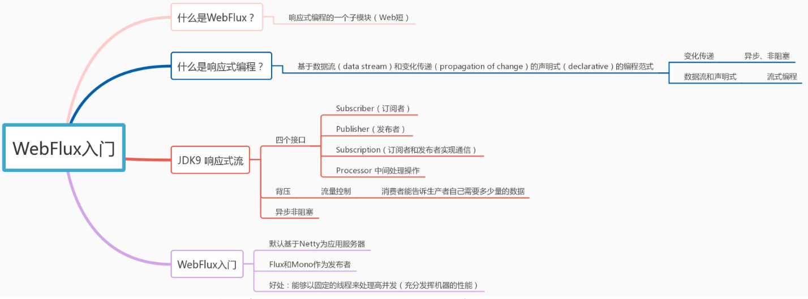

# webflux-请求处理入口-验证码篇

1.webflux

[深入剖析 Spring WebFlux - 腾讯云开发者社区-腾讯云 (tencent.com)](https://cloud.tencent.com/developer/article/1888001)

[Spring WebFlux使用函数式编程之HandlerFunction-51CTO.COM](https://www.51cto.com/article/719597.html)

[WebFlux基本介绍以及应用场景【Spring Reactive Web】_小象子的博客-CSDN博客_webflux应用场景](https://blog.csdn.net/weixin_41805792/article/details/86605549)



SpringMVC 同步阻塞

webflux 异步非阻塞

WebFlux 默认情况下使用 Netty 作为服务器;

设计目标

* 适用高并发
* 高吞吐量
* 可伸缩性

> 有两个重点类，一个是HandlerFunction接口，类似于响应处理者，接收ServerRequest，返回ServerResponse；一个是RouterFunction会把请求url和HandlerFunction对应起来；
> 其中还有一个Mono类，HandlerFunction接口的handle()返回的类型就是Mono；

**整个开发过程有几步：**

+ 1.创建HandlerFunction，实现输入ServerRequest，输出ServerResponse；

+ 2.创建RouterFunction，把请求url和HandlerFunction对应起来；

+ 3.把RouterFunction交给容器Server处理。

```java
 //1.创建HandlerFunction
//方式一：通过实现接口创建HandlerFunction
@Component
public class ImageCodeHandler implements HandlerFunction<ServerResponse> {
 
    //返回图片类型
    @SneakyThrows
    @Override
    public Mono<ServerResponse> handle(ServerRequest request) {
 
        FileInputStream input = new FileInputStream("C:\\Users\\Administrator\\Desktop\\1.jpg");
 
        // 转换流信息写出
        FastByteArrayOutputStream os = new FastByteArrayOutputStream();
        int ch;
        while((ch = input.read()) != -1){
            os.write(ch);
        }
 
        // 统一服务器接口调用的响应
        return ServerResponse.status(HttpStatus.OK)
                .contentType(MediaType.IMAGE_JPEG)
                .body(BodyInserters.fromResource(new ByteArrayResource(os.toByteArray())));
    }
}
 
 
//方式二：通过创建Mono来使用HandlerFunction
 
@Component
public class TestHandler {
 
    // 返回包含时间字符串的ServerResponse
    public Mono<ServerResponse> getTime(ServerRequest serverRequest) {
        MultiValueMap<String, String> query =  serverRequest.queryParams();
 
        return ServerResponse.ok()
                .contentType(MediaType.TEXT_PLAIN)
                .body(Mono.just("Now is " + new SimpleDateFormat("HH:mm:ss").format(new Date())), String.class);
    }
    // 返回包含日期字符串的ServerResponse
     public Mono<ServerResponse> getDate(ServerRequest serverRequest) {
        return ServerResponse.ok()
                .contentType(MediaType.TEXT_PLAIN)
                .body(Mono.just("Today is " + new SimpleDateFormat("yyyy-MM-dd").format(new Date())), String.class);
    }
}
```
```java
//2.创建RouterFunction;3.并生成bean
@Configuration(proxyBeanMethods = false)
@RequiredArgsConstructor
public class RouterFunctionConfiguration {
 
    private final ImageCodeHandler imageCodeHandler;
 
    private final TestHandler testHandler;
 
    @Bean
    public RouterFunction<ServerResponse> routerFunction() {
        return RouterFunctions
                .route(RequestPredicates.path("/code").and(RequestPredicates.accept(MediaType.TEXT_PLAIN)), imageCodeHandler)
                .andRoute(GET("/time"), testHandler::getTime)      //此处是按照 Lambda 简化格式写的 ，由于只有一行代码，所以可以直接写代码
                .andRoute(GET("/date"), (serverRequest) -> testHandler.getDate(serverRequest));     //此处是按照 Lambda 格式写的
    }
 
 
}
```

* 成功调用 127.0.0.1:9998/time?date=123：

1.自定义

```java
public class ImageCodeHandler implements HandlerFunction<ServerResponse> {
    private final Producer producer;
    private final RedisTemplate redisTemplate;

    @Override
    public Mono<ServerResponse> handle(ServerRequest serverRequest) {
//生成验证码
        String text = producer.createText();
        BufferedImage image = producer.createImage(text);

//保存验证码信息
        String randomStr = serverRequest.queryParam("randomStr").get();
        redisTemplate.opsForValue().set(CommonConstants.DEFAULT_CODE_KEY + randomStr, text, 60, TimeUnit.SECONDS);

// 转换流信息写出
        FastByteArrayOutputStream os = new FastByteArrayOutputStream();
        try {
            ImageIO.write(image, "jpeg", os);
        } catch (IOException e) {
            log.error("ImageIO write err", e);
            return Mono.error(e);
        }

        return ServerResponse
                .status(HttpStatus.OK)
                .contentType(MediaType.IMAGE_JPEG)
                .body(BodyInserters.fromResource(new ByteArrayResource(os.toByteArray())));
    }
}
```