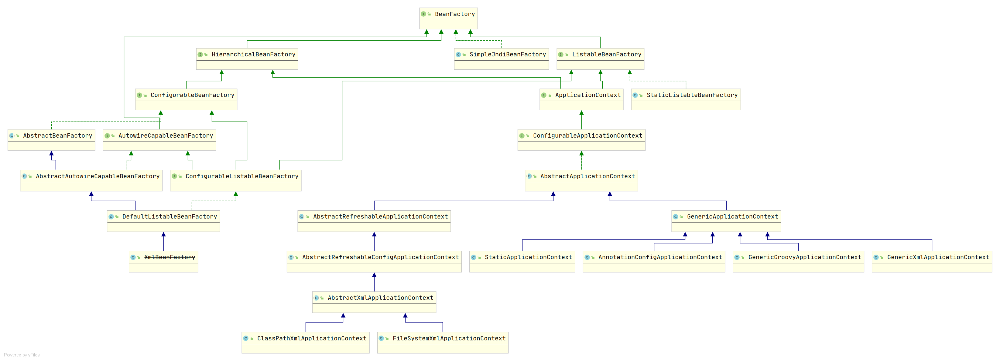

## Spring继承体系



## Bean

```
Bean加载优先级，值越低，优先级越高
@Order(Ordered.HIGHEST_PRECEDENCE)
```

- Bean的默认作用域就是单例的 scope="singleton"

### 1.实际开发中选择bean的作用域问题？

**非必须，选择单例；**

单例好处：占用内存少，避免了对象被反复的创建与回收，性能开销下；

多例模式的应用场景：

Bean对象内存在**临界资源**，且对象内的方法都对这个临界资源进行操作，这样会导致每个方法结果不确定，我们把这种不确定性称为线程安全问题；

```java
public class UserServiceImpl implements UserService {
    //临界资源
    private Integer ticketCount;

    //多线程下，若干线程调用不同的方法操纵临界资源
    public void add() {
        ticketCount++;
    }

    public void add2() {
        ticketCount--;
    }
}
```

实际开发中多例慎用，严重的会造成OOM（内存溢出问题）；

### 2.单例模式设置延迟加载

```xml
<!--配置bea的定义信息
       bean标签：定义bean的定义信息的标签
            属性：
                id:定义bean的名称
                class:定义bena的类的全限定名称
                lazy-init:
                    true:开启懒加载
                    false:默认值，积极加载
    -->
<bean id="userService" lazy-init="true" class="com.service.impl.UserServiceImpl"/>
```

## RestTemplate+Ribbon

```xml
<dependency>
    <groupId>org.springframework.cloud</groupId>
    <artifactId>spring-cloud-starter-ribbon</artifactId>
    <version>1.4.7.RELEASE</version>
</dependency>
```

#### 负载均衡策略

+ 轮询RoundRobinRule，这也是默认的策略；
+ 随机RandomRule
+ 响应时间权重ResponseTimeWeightedRule，为每个服务设置权重，响应时间越短，权重越大，下次越有可能被选中；
+ 最少并发数策略BestAvailableRule
+ 重试策略RetryRule
+ 可用性敏感策略AvailabilityFilteringRule
+ 区域性敏感策略ZoneAvoidanceRule
