## SpringBoot 核心技术

## SpringBoot课程安排与学习目标

### 【1】课程安排

本课程参考官网，包含以下模块：

- **核心技术（Core Features）:** [SpringApplication](https:/docs.spring.io/spring-boot/docs/2.3.10.RELEASE/reference/html/spring-boot-features.html#boot-features-spring-application) | [External Configuration](https:/docs.spring.io/spring-boot/docs/2.3.10.RELEASE/reference/html/spring-boot-features.html#boot-features-external-config) | [Profiles](https:/docs.spring.io/spring-boot/docs/2.3.10.RELEASE/reference/html/spring-boot-features.html#boot-features-profiles) | [Logging](https:/docs.spring.io/spring-boot/docs/2.3.10.RELEASE/reference/html/spring-boot-features.html#boot-features-logging)（第一天）
- **web开发（Web Applications）:** [MVC](https:/docs.spring.io/spring-boot/docs/2.3.10.RELEASE/reference/html/spring-boot-features.html#boot-features-spring-mvc) | [Embedded Containers](https:/docs.spring.io/spring-boot/docs/2.3.10.RELEASE/reference/html/spring-boot-features.html#boot-features-embedded-container)（第一天）
- **数据访问（Working with data）:** [SQL](https:/docs.spring.io/spring-boot/docs/2.3.10.RELEASE/reference/html/spring-boot-features.html#boot-features-sql) | [NO-SQL](https:/docs.spring.io/spring-boot/docs/2.3.10.RELEASE/reference/html/spring-boot-features.html#boot-features-nosql)（第一天）
- 消息集成（Messaging）: [Overview](https:/docs.spring.io/spring-boot/docs/2.3.10.RELEASE/reference/html/spring-boot-features.html#boot-features-messaging) | [JMS](https:/docs.spring.io/spring-boot/docs/2.3.10.RELEASE/reference/html/spring-boot-features.html#boot-features-jms)
- **单元测试（Testing）:** [Overview](https:/docs.spring.io/spring-boot/docs/2.3.10.RELEASE/reference/html/spring-boot-features.html#boot-features-testing) | [Boot Applications](https:/docs.spring.io/spring-boot/docs/2.3.10.RELEASE/reference/html/spring-boot-features.html#boot-features-testing-spring-boot-applications) | [Utils](https:/docs.spring.io/spring-boot/docs/2.3.10.RELEASE/reference/html/spring-boot-features.html#boot-features-test-utilities)（第一天）
- **高级扩展（Extending）:** [Auto-configuration](https:/docs.spring.io/spring-boot/docs/2.3.10.RELEASE/reference/html/spring-boot-features.html#boot-features-developing-auto-configuration) | [@Conditions](https:/docs.spring.io/spring-boot/docs/2.3.10.RELEASE/reference/html/spring-boot-features.html#boot-features-condition-annotations)（第二天）

### 【2】今日学习目标

- 理解SpringBoot存在的意义
- 掌握SpringBoot快速入门
- 掌握SpringBoot文件配置方式
- 掌握SpringBoot web开发
- 理解SpringBoot Junit单元测试
- 理解SpringBoot数据源访问集成

## 一、 SpringBoot 快速入门

### 01-SpringBoot概述

目的：理解SpringBoot存在的意义是什么;

#### 【1】什么是约定优于配置？

约定优于配置(convention over configuration)，也称按约定编程，是一种软件设计范式，旨在减少软件开发人员需做决定的数量，简化开发流程，说白了就是按照开发人员的通用习惯(约定)进行开发，尽量减少程序员做决策带来的时间成本的开销；

日常开发中有哪些基于约定的配置习惯？

| 配置                    | 说明                                                         |
| ----------------------- | ------------------------------------------------------------ |
| 系统环境变量：JAVA_HOME | 基于约定，方便维护                                           |
| maven工程结构           | main包下：            java包存放项目源码            resource包存放项目配置等公用资环test包：            存放项目测试源码target包：             存放编译后文件、打包后文件等默认打包方式：jar |
| Tomcat配置              | 默认开启端口8080                                             |
| SpringBoot配置文件      | 默认application.properties 或 application.yml文件;           |
| Redis                   | 默认端口6379，默认可以不使用密码登录，默认配置文件名称为redis.conf等 |

#### 【2】SpringBoot是什么？

官网参考：https:/spring.io/projects/spring-boot

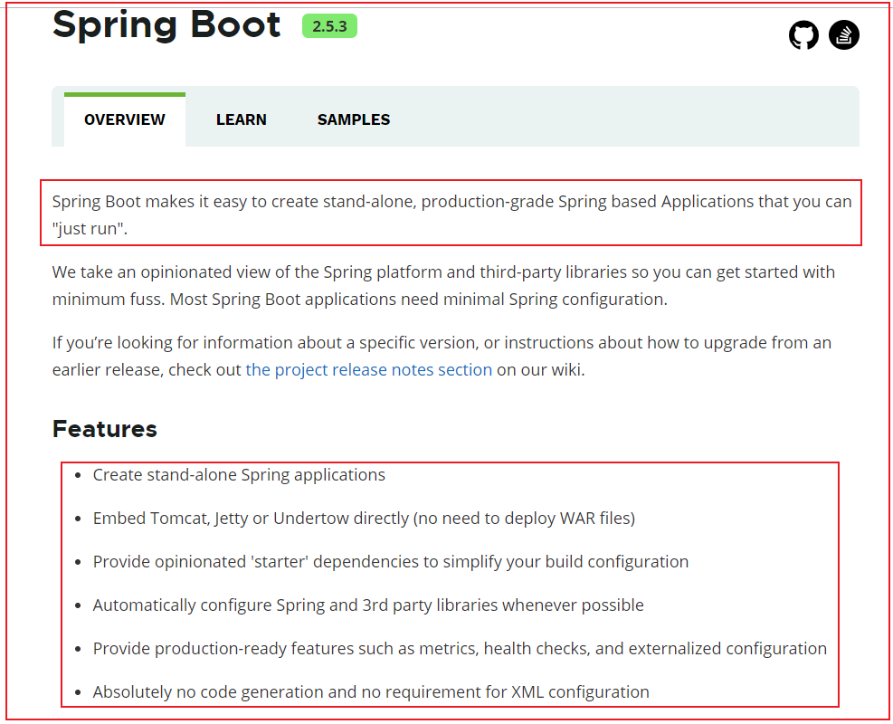

 SpringBoot可以非常简单的快速构建独立的、基于Spring应用的生产级应用程序；

SpringBoot基于约定优于配置的思想，可以让开发人员不必在配置与逻辑业务之间进行思维的切换，使我们可以全身心的投入到业务代码开发中，从而大大提高了开发的效率;

SpringBoot主要特点：

- SpringBoot可以快速创建独立的Spring应用程序;
- SpringBoot直接嵌入Tomcat、Jetty或Undertow(不需要部署WAR文件)
- SpringBoot提供了大量可供选择的场景依赖starter，大大简化工程配置的工作量；
- SpringBoot提供了Spring应用的自动化配置和常见第三方库的自动化配置;
- SpringBoot提供了大量生产级的特性，比如健康检查、外部化配置等（第二天学习的内容）;
- SpringBoot在简化配置的过程中不会生成代码，也不需要XML繁杂的配置；

<font color="red">小结：</font> 

SpringBoot是对Spring功能上的增强么？

<details>
    <summary>提示</summary>
    Spring Boot 并不是Spring功能上的增强，而是提供了一种快速使用Spring的方式
</details>

### 02-SpringBoot快速入门

<font color="red">目的：</font> 能基于SpringBoot快速开发一个Spring应用

**需求：** 搭建SpringBoot工程，定义HelloController.hello()方法，返回”Hello SpringBoot!”。

<font color="red">步骤：</font> 

1. 创建Maven项目
2. 导入SpringBoot起步依赖
3. 编写引导类
4. 定义HelloController类编写请求方法
5. 启动测试

<font color="red">实现：</font> 

1、创建空Maven项目

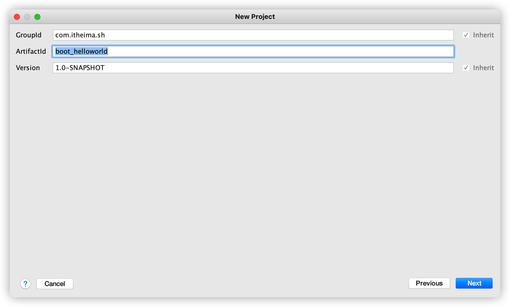

2、导入SpringBoot起步依赖

```xml
<!--springboot工程需要继承的父工程-->
<parent>
  <groupId>org.springframework.boot</groupId>
  <artifactId>spring-boot-starter-parent</artifactId>
  <version>2.3.10.RELEASE</version>
</parent>

<dependencies>
  <!--web开发的起步依赖：场景启动器依赖-->
  <dependency>
    <groupId>org.springframework.boot</groupId>
    <artifactId>spring-boot-starter-web</artifactId>
  </dependency>
</dependencies>
```

3、编写引导类

```java
package com.pp.sh;

import org.springframework.boot.SpringApplication;
import org.springframework.boot.autoconfigure.SpringBootApplication;
/**
 * 引导类。 SpringBoot项目的入口
 */
@SpringBootApplication
public class HelloApplication {
    public static void main(String[] args) {
        SpringApplication.run(HelloApplication.class, args);
    }
}
```

4、定义HelloController

```java
package com.pp.sh.controller;

import org.springframework.web.bind.annotation.RequestMapping;
import org.springframework.web.bind.annotation.RestController;

@RestController
public class HelloController {

    @RequestMapping("/hello")
    public String hello(){
        return " hello Spring Boot !";
    }
}
```

5、启动测试，访问浏览器: http:/localhost:8080/hello

<font color="red">小结：</font> 

三步构建一个SpringBoot?

<details>
    <summary>提示</summary>
    1. 添加依赖（场景依赖）
	2. 编写配置文件和启动类
	3. 编写业务代码
</details>

### 03-SpringBoot依赖原理分析及优势

<font color="red">目的：</font>

1. 理解SpringBoot项目的pom依赖关系;
2. 理解SpringBoot对依赖的版本控制（版本锁定）;
3. 掌握starter作用（场景依赖作用）;

<font color="red">讲解：</font>

#### 【1】SpringBoot工程pom依赖关系

点击父工程 `spring-boot-starter-parent` 配置参数如下：

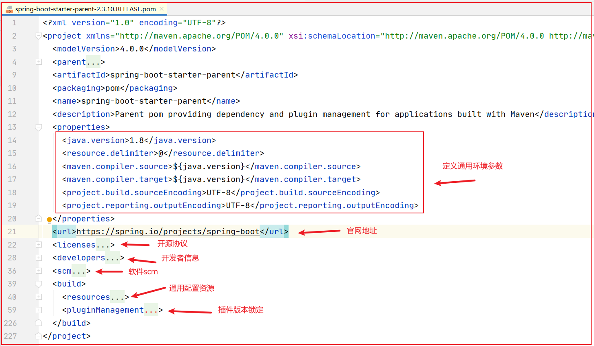

整体来看，spring-boot-starter-parent父工程仅仅**定义了工程相关的描述信息**，至于依赖资源配置方面，没有做过多参与，不过我们发现spring-boot-starter-parent工程也有自己的父工程：

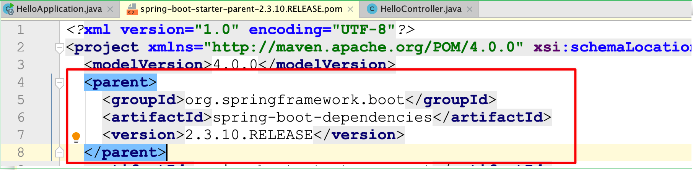

进入到 `spring-boot-dependencies` 工程中我们发现：

**工程中声明了几乎所有开发中常用的依赖版本号并通过dependencyManagement进行版本控制：**

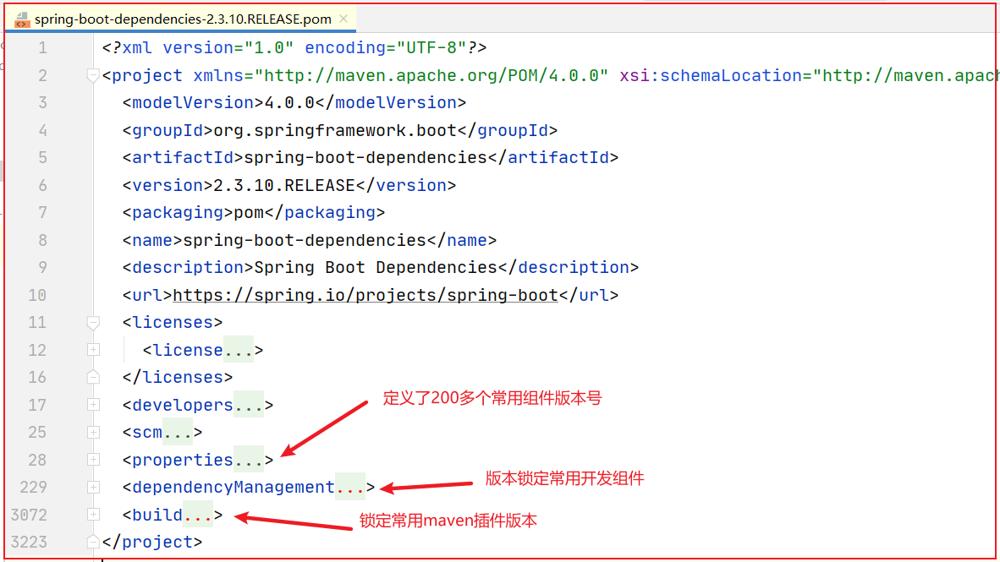

#### 【2】SpringBoot场景依赖starter介绍

在spring-boot-dependencies父工程中，我们发现大量以 `spring-boot-starter-*`开头的依赖： 

这是SpringBoot为我们封装好的场景启动器：

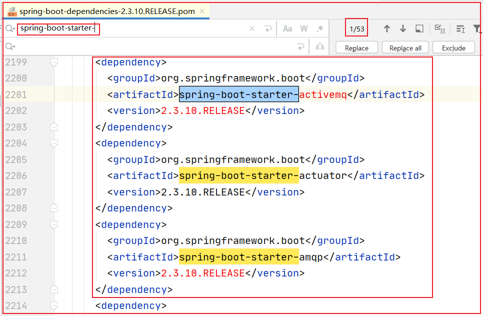

#### 【3】spring-boot-starter-web场景依赖说明

		我们从工程中点击 `spring-boot-starter-web` 进入依赖管理，会发现场景启动器的核心依赖：

```xml
<dependency>
    <groupId>org.springframework.boot</groupId>
    <artifactId>spring-boot-starter</artifactId>
    <version>2.3.10.RELEASE</version>
    <scope>compile</scope>
</dependency>
```

	  说明：`spring-boot-starter`是 **为场景启动器提供所依赖的spring环境；**

	  分析`spring-boot-starter-web`依赖发现：内部把关于web MVC开发所有的依赖都已经导入并且版本控制完成了，	       我们只需引入 `spring-boot-starter-web` 这个依赖就可以实现我们的 Web MVC的功能，是不是很强大！

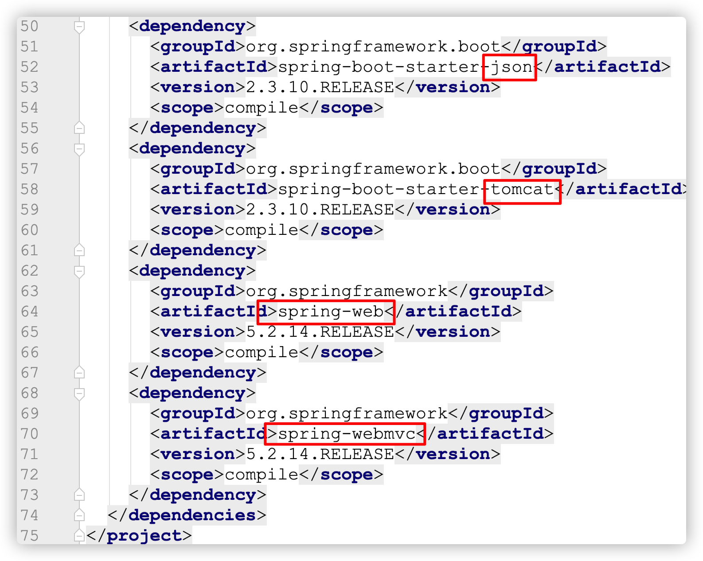

#### 【4】小结

1.在Springboot环境中<font color='orange'>引入通用依赖</font>，是否需要自己维护依赖的版本？

<details>
    <summary>提示</summary>
SpringBoot父工程对通用的依赖进行了版本锁定，开发人员引入依赖时则无需关注依赖冲突和版本兼容问题；
</details>
2.Springboot提供的场景启动器有什么好处？

<details>
    <summary>提示</summary>
		场景启动器可以快速引入指定场景下所依赖的资源（不必做资源冲突处理）；
        场景启动器简化资环配置，让开发人员将重点放在业务逻辑上；
</details>


## 二、SpringBoot 配置文件

### 04-SpringBoot2核心技术-配置入门

<font color="red">目的：</font>

1. 掌握SpringBoot配置文件作用
2. 掌握配置文件的两大分类，如果同时存在会怎么处理？

<font color="red">讲解：</font>

#### 【1】SpringBoot配置分类

	通过`spring-boot-starter-parent`依赖发现：

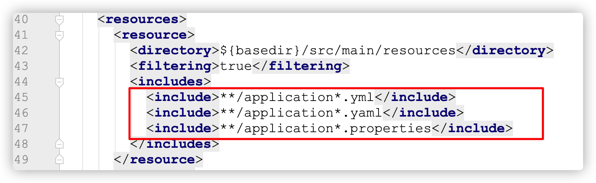

配置文件是两大类：**yml和properties** 配置文件；

#### 【2】SpringBoot配置文件入门

			以端口号修改为例：

1. 在resources目录下新建 application.properties 配置文件，添加端口号：

   ```properties
   server.port=8081   # 修改tomcat端口
   ```

   启动项目发现端口修改为 8081

2. 注释application.properties目录下端口设置，添加 application.yml配置文件

   ```yaml
   server:
     port: 8082
   ```

   启动项目发现端口修改为 8082

3. 如果把application.properties中的注释取消，即两种配置文件同时存在，启动项目发现项目的端口是 **8081**，**说明是application.properties配置文件生效**;

4. 分别在application.properties和application.yml 里添加

   * company1=pp、company2: itcast

     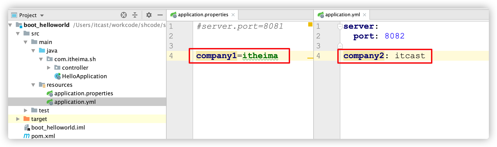

5. 通过 @value注解注入读取配置

   ```java
   @RestController
   public class HelloController {
   	/注入配置文件中属性值
       @Value("${company1}")
       private String company1;
   
       @Value("${company2}")
       private String company2;
   
       @RequestMapping("/hello")
       public String hello(){
           return " hello Spring Boot !" + company1 +"  " + company2;
       }
   }
   ```

访问浏览器：


【3】小结

在同级路径下，SpringBoot两种类型的配置文件同时存在时，配置优先级如何处理？

<details>
    <summary>提示</summary>
		两类配置文件如果同时存在，若 key 相同则 properties 优先级高，若key不同则合并加载；
</details>

### 05-SpringBoot2核心技术-YAML基本使用

<font color="red">目的：</font>了解yml是什么，掌握Yaml语法的基本数据类型的配置

#### 【1】YAML是什么？

```xml
YAML是 "YAML Ain't Markup Language"（YAML不是一种标记语言）的递归缩写;
YAML在开发中又有另外一层意思："Yet Another Markup Language"（仍是一种标记语言）;
YAML非常适合用来做以数据为中心的配置文件;
eg:
YML配置示例（层次感好，便于阅读）：
person:  
     name: zhangsan
     age: 18
   
properties配置示例：
person.name=zhangsan
person.age=18
```

#### 【2】YAML基本语法

- 大小写敏感。
- 数据值前边必须有空格，作为分隔符。
- 使用缩进表示层级关系。
- 缩进时不允许使用Tab键，只允许使用空格（各个系统 Tab对应的 空格数目可能不同，导致层次混乱）。
- 缩进的空格数目不重要，只要相同层级的元素<font color='red'>左侧</font>对齐即可。
- ''#" 表示注释，从这个字符一直到行尾，都会被解析器忽略。
- 字符串无需加引号，如果要加，`""`与`''`表示字符串内容会被转义/不转义。

#### 【3】代码演示

**1、配置文件：**

**对象(map)**：键值对的集合。

```sh
person:  
   name: zhangsan
```

**数组**：一组按次序排列的值

```yaml
address:
  - beijing
  - shanghai
```

**纯量**：单个的、不可再分的值（常量值）

```yaml
msg1: 'hello \n world'  # 单引忽略转义字符
msg2: "hello \n world"  # 双引识别转义字符
```

**参数引用**

```yaml
name: lisi 
person:
  name: ${name} # 引用上边定义的name值
```

**2、使用 @value 读取配置：**

```java
//获取普通配置
@Value("${company1}")
private String company1;
//获取对象属性
@Value("${person.name}")
private String name;
//获取数组
@Value("${address[0]}")
private String address1;
//获取纯量
@Value("${msg1}")
private String msg1;
//获取纯量
@Value("${msg2}")
private String msg2;
```

### 06-SpringBoot2核心技术-YAML高级配置

<font color="red">目的：</font>掌握YML配置参数映射对象属性功能；

<font color="red">步骤：</font>

1. 定义实体类 Man和Woman
2. 添加配置文件
3. 依赖注入测试

<font color="red">实现：</font>

#### 【1】单值数据映射对象属性

1）配置文件添加：

```yaml
man:
  userName: laowang
  boss: true
  birth: 1980/09/09 01:01:01
  age: 41
```

2）定义实体类Man:

```java
package com.pp.sh.pojo;
import lombok.Data;
import org.springframework.boot.context.properties.ConfigurationProperties;
import java.util.Date;

@Data
@ConfigurationProperties(prefix = "man")
public class Man {
   private String userName;
   private Boolean boss;
   private Date birth;
   private Integer age;
}    
```

3）依赖注入测试：

```java
两种注入属性方式：
方式1：在实体类Man上添加@ConfigurationProperties(prefix = "man”)
	  然后在启动类上添加@EnableConfigurationProperties(Man.class)
方式2：在实体类Man上添加@ConfigurationProperties(prefix = "man”)
      在实体类Man上添加@Component                                       
```

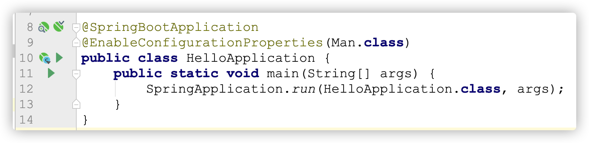

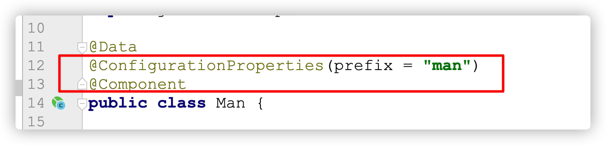

4）测试

		Controller编写代码测试：http:/localhost:8082/getman

```java
@Autowired
private Man man;

@GetMapping("getman")
public Man man() {
	return man;
}
```

#### 【2】复杂数据映射对象属性

说明：配置数据可以映射数组、集合、Map、`List<VO>`类型进行映射获取配置参数；

1、定义实体类 Man和Woman

```java
package com.pp.sh.pojo;

import lombok.Data;
import org.springframework.boot.context.properties.ConfigurationProperties;

import java.util.Date;
import java.util.List;
import java.util.Map;

@Data
@ConfigurationProperties(prefix = "man")
public class Man {
   private String userName;
   private Boolean boss;
   private Date birth;
   private Integer age;
   private String[] address;
   private List<String> addressList;
   private Map<String, Object> hobbies;  / 爱好
   private Woman woman;
   private List<Woman> wifes;
}
```

```java
package com.pp.sh.pojo;

import lombok.Data;

import java.util.List;
@Data
public class Woman {
    private String userName;
    private Integer age;
    private List<String> addresses;
}
```

2、添加配置文件

```yaml
server:
  port: 8082

company2: itcast
company1: pp


man:
  userName: laowang
  boss: true
  birth: 1980/09/09 01:01:01
  age: 41
  address: [beijing, shanghai]
  addressList:
    - 北京
    - 上海
    - 深圳
  hobbies:
    sports:
      - badminton
      - basketball
    musics:
      - dj
      - 23
  woman:
    userName: xiaohua
    age: 20
    addresses:
      - 北京
      - 上海
  wifes:
     - userName: xiaosan1
       age: 25
       addresses:
         - 北京

     - userName: xiaosan2
       age: 20
       addresses:
         - 上海
```

#### 【3】小结

SpringBoot配置参数封装实体对象的核心注解？

<details>
    <summary>提示</summary>
    两种注入属性注入实体对象的方式：
	方式1：在实体类Man上添加@ConfigurationProperties(prefix = "man”)
	      然后在启动类上添加@EnableConfigurationProperties(Man.class)
    方式2：在实体类Man上添加@ConfigurationProperties(prefix = "man”)
      在实体类Man上添加@Component
</details>

### 07-SpringBoot2核心技术-实现配置文件自动提示

<font color="red">目的：</font>解决实体类配置文件 出现以下现象：
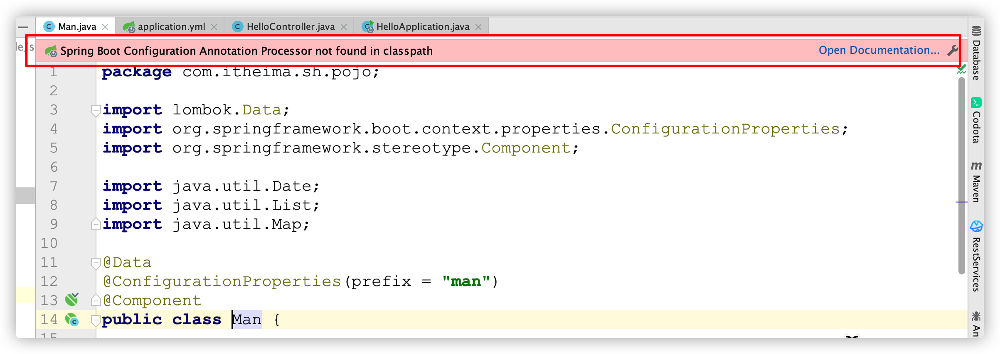

自定义的类和配置文件绑定一般没有提示。

<font color="red">步骤：</font>

1. 打开[官网](https:/docs.spring.io/spring-boot/docs/2.3.10.RELEASE/reference/html/spring-boot-features.html#boot-features-custom-starter-module-autoconfigure)查看步骤

2. 添加依赖实现自动提示

<font color="red">实现：</font>

在pom文件中添加：

```xml
<!--解决SpringBoot自定义配置提示问题-->
<dependency>
  <groupId>org.springframework.boot</groupId>
  <artifactId>spring-boot-configuration-processor</artifactId>
  <optional>true</optional>
</dependency>

<build>
  <plugins>
    <plugin>
      <groupId>org.springframework.boot</groupId>
      <artifactId>spring-boot-maven-plugin</artifactId>
      <configuration>
        <excludes>
          <!--插件运行时排除依赖-->  
          <exclude>
            <groupId>org.springframework.boot</groupId>
            <artifactId>spring-boot-configuration-processor</artifactId>
          </exclude>
        </excludes>
      </configuration>
    </plugin>
  </plugins>
</build>
```

### 08-SpringBoot2核心技术-多环境切换

<font color="red">背景：</font> 在软件应用部署的时候，我们往往遇到需要发布到不同环境的情况，而每个环境的数据库信息、服务器端口、密钥信息等可能会存在差异，这时开发人员需要频繁修改配置来切换不同的环境，维护性相当差！

SpringBoot多环境配置方案可以解决上述出现的问题；			

<font color="red">实现：</font>

#### 【1】多profile文件实现环境配置切换（推荐）

profile配置方式：	

	多profile文件方式：提供多个配置文件，每个代表一种环境。

		application-dev.properties/yml 开发环境

		application-test.properties/yml 测试环境

		application-pro.properties/yml 生产环境

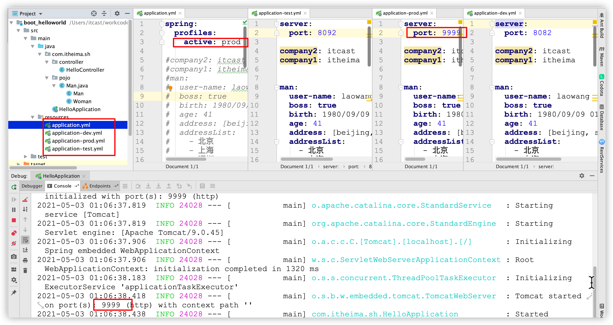

好处：

	不同的环境使用不同的文件，这样修改时，仅仅修改对应配置文件的数据，无需修改其他环境的配置文件（解耦）

#### 【2】单个profile文件实现环境配置切换(了解)  

   在yml中使用  --- 分隔不同配置

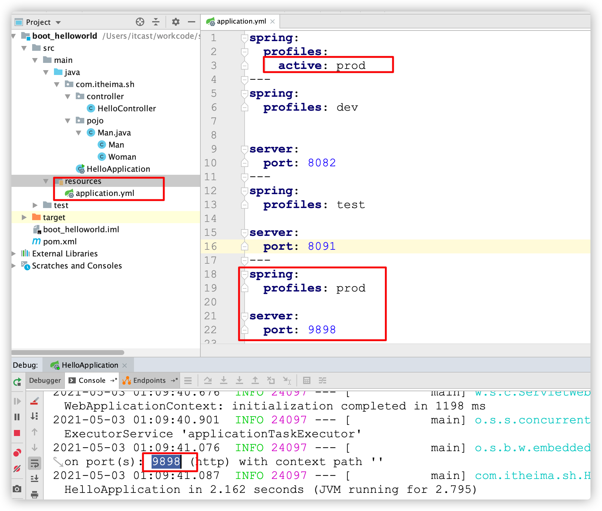

#### 【3】profile激活方式

- 配置文件： 在配置文件中配置：spring.profiles.active=dev    ★★

- 虚拟机参数：在VM options 指定：-Dspring.profiles.active=dev

- 命令行参数：java -jar XXX.jar --spring.profiles.active=dev    ★★

  说明：启动后报没有主清单属性问题：

  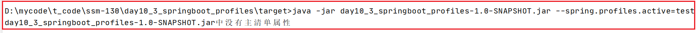

  解决方案：

  ```xml
  <build>
      <plugins>
          <plugin>
              <groupId>org.springframework.boot</groupId>
              <artifactId>spring-boot-maven-plugin</artifactId>
          </plugin>
      </plugins>
  </build>
  ```

方案2：补充

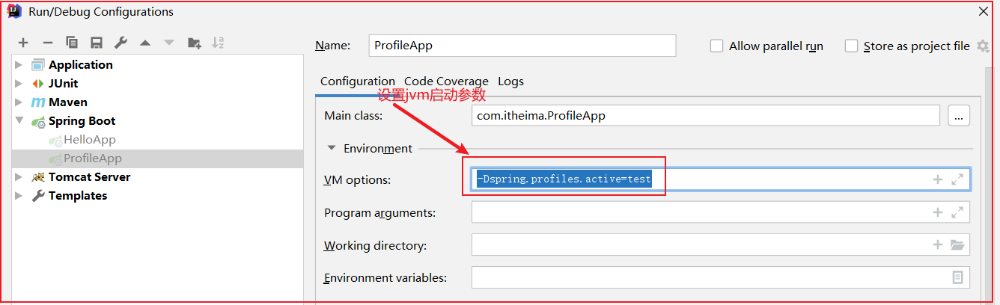

<font color="red">小结：</font>

* 实际开发中使用==多profile形式==居多，主要用于**切换不同的环境**，便于项目维护；

### 09-SpringBoot2核心技术-项目内部配置文件加载顺序

<font color="red">目的：</font>掌握配置文件加载顺序问题

<font color="red">优先级说明：</font>

**配置优先级：由高到底**

- file:./config/：当前项目下的/config目录下
- file:./           ：当前项目的根目录
- classpath:/config/：classpath的/config目录
- classpath:/  ：classpath的根目录 ★★


### 10-SpringBoot2核心技术-项目外部配置文件加载顺序

<font color="red">目的：</font>可以在jar包外修改配置文件

<font color="red">实现：</font>

	    外部配置文件的使用是为了对内部文件的配合；

1. 命令行 ★

```properties
java -jar app.jar --name="Spring“ --server.port=9000
```

2. 指定配置文件位置

```properties
 java -jar myproject.jar --spring.config.location=e:/application.properties
```

3. 外部不带profile的properties文件 ★

```java
classpath:/config/application.properties
classpath:/application.properties
```

<font color="red">小结：</font>

* **整体加载优先级： jar包外  到  jar包内；**

* 如果jar和配置文件在同一级，配置文件也会被自动加载；

  ```tex
  注意：
  打包的时候 只会去打包classpath(src|main/resources)的配置文件，项目的根目录下的配置文件不会被打包到jar包中。
  ```

### 11-SpringBoot配置小结

#### 【1】SpringBoot配置文件有哪些配置方式？

<details>
    <summary>说明</summary>
    常见2种:properties文件和yml文件，实际开发中yml使用居多；
</details>		

#### 【2】获取配置文件中数据方式？

<details>
    <summary>说明</summary>
    方式1：直接过去数据
    &emsp;&emsp;直接获取数据：@Value("${key}")
    方式2：通过映射对象获取
 &emsp;&emsp;2种方式：
&emsp;&emsp; &emsp;&emsp;2.1 @ConfigurationProperties(prefix="前缀")+@Component
 &emsp;&emsp; &emsp;&emsp;2.2 @ConfigurationProperties(prefix="前缀")+ 在配置类之上加@EnableConfigurationProperties(实体类.classs)★★</details>

#### 【3】springboot多环境配置方式？

<details>
    <summary>说明</summary>
2种方案：
&emsp;方案1：配置多个yml环境文件
&emsp;&emsp;使用：spring.profiles.active="环境标识"(eg:标识来自于yml文件dev中：application-dev.yml) ★★
&emsp;方案2：单个yml配置多环境
&emsp;&emsp;说明：所有环境的参数都写在一个yml下，维护性差）
多个环境配置参数之间以---间隔 eg: spring.frofiles="环境标识"
&emsp;&emsp;切换环境:spring.profiles.active="环境标识"
</details>

#### 【4】springboot配置文件的加载顺序？

		整体看：由外到内

			内：由低到高: classpath下的配置文件 <  classpath:/config    <  工程同级目录下的配置文件< 工程同级目录下config包的配置文件;

			外：与jar包同级的配置文件 < 与jar包同级的config包下的配置文件

## 三、SpringBoot Web MVC集成

本小节目标：

- 了解web场景依赖的作用(帮助自动配置了哪些组件)；
- 静态资源支持；
- 集成拦截器；
- 对servlet3大组件支持；

### 12-SpringBoot2核心技术-SpringMVC自动配置概述

<font color="red">目的：</font>掌握SpringBoot对Web MVC的自动化配置支持

<font color="red">讲解：</font> 

参考[官网-7.1.1. Spring MVC Auto-configuration](https:/docs.spring.io/spring-boot/docs/2.3.10.RELEASE/reference/html/spring-boot-features.html#boot-features-developing-web-applications)；介绍如下：

Spring Boot为Spring MVC提供了自动配置，可与大多数应用程序一起很好地工作。

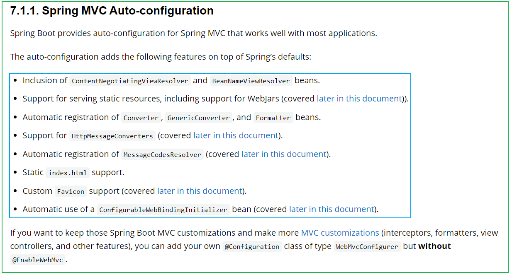

自动配置在Spring的默认值之上添加了以下功能：

- 包含`ContentNegotiatingViewResolver`和`BeanNameViewResolver`视图解析器。
- 支持服务静态资源，包括对WebJars的支持。
- 自动注册`Converter`，`GenericConverter`和`Formatter`。
- 支持`HttpMessageConverters`。
- 自动注册`MessageCodesResolver`国际化。
- 静态`index.html`欢迎页支持。
- 定制`Favicon`网站icon图片支持。
- 自动使用`ConfigurableWebBindingInitializer`bean。

如果要保留这些Spring Boot MVC定制并进行更多的[MVC定制](https:/docs.spring.io/spring/docs/5.2.14.RELEASE/spring-framework-reference/web.html#mvc)（拦截器，格式化程序，视图控制器和其他功能），**不用@EnableWebMvc注解。使用** **`@Configuration`** **+** **`WebMvcConfigurer`** **自定义规则**

详情查看：


<font color="red">小结：</font>

	SpringBoot为SpirngMVC组件(web组件)做了大量的基于约定的自动化配置，让让开发web应用更加的简单。


### 13-SpringBoot2核心技术-静态资源支持

<font color="red">目的：</font>

1. 了解 SpringBoot对静态资源（js/css/image等）支持
2. 能修改原属性配置

<font color="red">讲解：</font>

#### 【1】SpringBoot静态资环默认配置

**默认情况下：**

Spring Boot从类路径中名为`/static`（`/public`或`/resources`或`/META-INF/resources`）的目录中或从的根中提供静态内容。

新建一个Maven项目，将`图片` 下的图片分别放在对应的目录下：


> 注意：`/META-INF/resources`是两级文件夹

浏览器访问：http:/localhost:8080/4.jpg

#### 【2】修改SpringBoot默认静态资源配置

**修改默认配置：**

```yaml
spring:
  mvc:
    # 匹配访问路径，如果以imgs开头，则去默认静态资源包下找对应的资源
    # http:/localhost:8080/3.jpg，配置完毕后访问url：
    # http:/localhost:8080/imgs/3.jpg
    static-path-pattern: /imgs/**
  resources:
    # 配置静态资源的路径，那么默认的静态资源路径失效
    static-locations: [classpath:/myweb/]
```

对应属性配置源码：

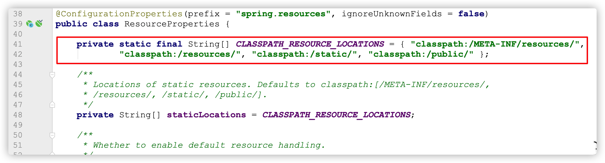

<font color="red">小结：</font>

* 一般实际开发中使用默认配置即可;


### 14-SpringBoot2核心技术-拦截器支持

<font color="red">目的：</font>理解SpringBoot对拦截器支持，并且能够独立配置拦截器

<font color="red">步骤：</font>

1. 编写MyInterceptor类实现HandlerInterceptor接口；
2. 拦截器注册到IOC容器中【实现WebMvcConfigurer的addInterceptors】
3. 配置不拦截静态资源；

<font color="red">实现：</font>

		**【1】自定义拦截器：**

		定义MyInterceptor类实现HandlerInterceptor方法，重写 接口相关的方法：

```java
package com.pp.interceptor;

import org.springframework.web.servlet.HandlerInterceptor;
import org.springframework.web.servlet.ModelAndView;

import javax.servlet.http.HttpServletRequest;
import javax.servlet.http.HttpServletResponse;

/**
 * 定义啦拦截器对象
 */
public class MyInterceptor implements HandlerInterceptor {
    /**
     * 方法执行之前执行
     *
     * @param request
     * @param response
     * @param handler
     * @return
     * @throws Exception
     */
    @Override
    public boolean preHandle(HttpServletRequest request, HttpServletResponse response, Object handler) throws Exception {
        System.out.println("MyInterceptor preHandle.......");
        return true;
    }

    /**
     * 方法执行完成之后, 返回值返回给前端之前执行
     * @param request
     * @param response
     * @param handler
     * @param modelAndView
     * @throws Exception
     */
    @Override
    public void postHandle(HttpServletRequest request, HttpServletResponse response, Object handler, ModelAndView modelAndView) throws Exception {
        System.out.println("MyInterceptor postHandle.......");
    }

    /**
     * 页面渲染之后执行
     * @param request
     * @param response
     * @param handler
     * @param ex
     * @throws Exception
     */
    @Override
    public void afterCompletion(HttpServletRequest request, HttpServletResponse response, Object handler, Exception ex) throws Exception {
        System.out.println("MyInterceptor afterCompletion.......");
    }
}
```

	【2】回顾之前学习SpringMVC基于XML配置格式如下：

```xml
<mvc:interceptors>
    <mvc:interceptor>
        <!--配置拦截规则
                /**表示拦截所有请求
        -->
        <mvc:mapping path="/**"/>
        <!--排除被拦截的路径-->
        <mvc:exclude-mapping path="/**/*.css"/>
        <mvc:exclude-mapping path="/**/*.js"/>
        <mvc:exclude-mapping path="/**/*.jpg"/>
        <!--配置拦截器对应的bean-->
        <bean class="com.pp.sh.intercepter.MyInterceptor"/>
    </mvc:interceptor>
</mvc:interceptors>
```

	 **【3】基于配置类注册拦截器**

		配置类实现WebMvcConfigurer接口并重写注册方法：addInterceptors:

```java
package com.pp.config;

import com.pp.interceptor.MyInterceptor;
import org.springframework.context.annotation.Configuration;
import org.springframework.web.servlet.config.annotation.InterceptorRegistry;
import org.springframework.web.servlet.config.annotation.WebMvcConfigurer;
import java.util.Arrays;

@Configuration
public class SpringMvcConfig implements WebMvcConfigurer {
    /**
     * 注册拦截器
     * @param registry
     */
    @Override
    public void addInterceptors(InterceptorRegistry registry) {
        registry.addInterceptor(new MyInterceptor())
                /添加拦截路径 拦截所有
                .addPathPatterns("/**")
                /排除被拦截的资源
                .excludePathPatterns(Arrays.asList("/**/*.css","/**/*.jpg","/**/*.js"));
    }
}
```

<font color="red">小结：</font>

基于注解实现拦截器注册流程？

		1、定义拦截类，实现HandlerInterceptor接口；

		2、配置拦截规则：

				2.1 定义配置类@Configuration,实现WebMvcConfigurer接口下的addInterceptors方法；

           	 2.2 配置拦截规则；

### 15-SpringBoot2核心技术-Servlet、Filter、Listener支持

<font color="red">目的：</font>理解SpringBoot对SpringMVC原生组件的支持

<font color="red">步骤：</font>

1、@ServletComponentScan(basePackages = **"com.pp.sh"**) :指定原生Servlet组件都放在那里

2、编写对应的组件

@WebServlet(name=“”, urlPatterns = **"/my"**)：效果：直接响应

@WebFilter(urlPatterns={**"/css/\*"**,**"/images/\*"**})

@WebListener

<font color="red">实现：</font>

1、添加注解支持

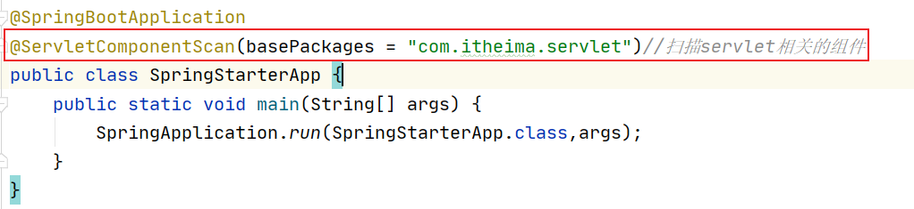

2、新建 servlet包，将 `资料/web`文件夹下代码复制到当前工程

3、启动测试

## 四、SpringBoot 单元测试集成

### 16-SpringBoot2核心技术-整合Junit4

<font color="red">目的：</font>掌握SpringBoot整合 Junit4 单元测试

<font color="red">步骤：</font>

1. 引入场景（test）依赖
2. 编写测试类，添加注解

<font color="red">实现：</font>

pom依赖：

```xml
<dependency>
    <groupId>org.springframework.boot</groupId>
    <artifactId>spring-boot-starter-test</artifactId>
</dependency>
```

	  编写测试类，添加注解``@SpringBootTest和@RunWith(SpringRunner.class)` 

```java
package com.pp;

import com.pp.SpringJunitApp;
import com.pp.service.UserServiceImpl;
import org.junit.*;
import org.junit.runner.RunWith;
import org.omg.CORBA.PUBLIC_MEMBER;
import org.springframework.beans.factory.annotation.Autowired;
import org.springframework.boot.test.context.SpringBootTest;
import org.springframework.test.context.ContextConfiguration;
import org.springframework.test.context.junit4.SpringRunner;

/**
 * 定义单元测试4的测试类
 */
@SpringBootTest/指定当前类为springboot环境下的测试类，当前类如果与springboot启动类同级或者自目录下，那么容器中的bean自动加载
@RunWith(SpringRunner.class)/指定加载容器上下文的加载类
/ 如果当前测试类与启动类不在同级或其子目录下，那么需要显式指定启动配置类
/@ContextConfiguration(classes = SpringJunitApp.class)
public class SpringJunit4Test {
    @Autowired
    private UserServiceImpl userService;

    @BeforeClass
    public static void beforeClasRun(){
        System.out.println("beforeClasRun ...");
    }

    /**
     * 测试方法运行几次，就执行几次
     */
    @Before
    public void before01(){
        System.out.println("before01 run....");
    }

    @Test
    public void test1(){
        userService.addUser();
    }

    @After
    public void after01(){
        System.out.println("after01 run....");
    }

    @AfterClass
    public static void afterClasRun(){
        System.out.println("afterClasRun ...");
    }
}
```

```tex
注意事项：
如果测试类不在启动类同级或者子目录下，则需要通过@ContextConfiguration(classes=xxx.class）注解指定启动类的位置；
```


### 17-SpringBoot2核心技术-整合Junit5

<font color="red">目的：</font>掌握SpringBoot整合 Junit5单元测试及新特性

#### 【1】Junit5介绍

**Spring Boot 2.2.0 版本开始引入 JUnit 5 作为单元测试默认版本，2.3.X版本还保留了Junit4版本测试，但是在2.4.X则不再支持Junit4（[参考官方](https:/github.com/spring-projects/spring-boot/wiki/Spring-Boot-2.4-Release-Notes)）**

作为最新版本的JUnit框架，[JUnit5](https:/junit.org/junit5/)与之前版本的Junit框架有很大的不同。由三个不同子项目的几个不同模块组成。

JUnit 5 = JUnit Platform + JUnit Jupiter + JUnit Vintage

**JUnit Platform**: Junit Platform是在JVM上启动测试框架的基础，不仅支持Junit自制的测试引擎，其他测试引擎也都可以接入。

**JUnit Jupiter**: JUnit Jupiter提供了JUnit5的新的编程模型，是JUnit5新特性的核心。内部 包含了一个**测试引擎**，用于在Junit Platform上运行。

**JUnit Vintage**: 由于JUint已经发展多年，为了照顾老的项目，JUnit Vintage提供了兼容JUnit4.x,Junit3.x的测试引擎。

#### 【2】代码示例

依赖不变：

```xml
<dependency>
    <groupId>org.springframework.boot</groupId>
    <artifactId>spring-boot-starter-test</artifactId>
</dependency>
```

测试类中移除 `@RunWith(SpringRunner.class) `注解，直接添加`@SpringBootTest`注解即可。

```java
package com.pp;

import com.pp.service.MyService;
import org.junit.jupiter.api.*;
import org.springframework.beans.factory.annotation.Autowired;
import org.springframework.boot.test.context.SpringBootTest;
import static org.junit.jupiter.api.Assertions.*;
/**
 * @Description 测试单元测试5
 * @Created by pp
 */
@SpringBootTest
public class TestJunit5 {
    /**
     * @Description 注入测试服务
     */
    @Autowired
    private MyService myService;
    
    @BeforeAll/等价于junit4:@BeforeClass
    public static void beforeAll(){
        System.out.println("beforeAll run...");
    }

    @BeforeEach/等价于junit4:@Before
    public void before(){
        System.out.println("BeforeEach run....");
    }

    /**
     * @Description 测试单元测试5
     */
    @Test
    public void test1(){
        myService.add();
    }

    /**
     * @Description  boolen断言
     */
    @Test
    public void test2(){
        /如果结果为true，则测试通过，否则，测试失败
        assertTrue(1<2,"测试失败");
    }

    /**
     * @Description 等值断言
     */
    @Test
    public void test3(){
        /**
         * 参数1：期望值
         * 参数2：实际值
         * 参数3：如果期望值与实际值不相等，那么会被打印
         */
        assertEquals(100,100,"与期望不符");
    }

    /**
     * @Description 测试自行判断处理测试结果通过方法fail方法
     * 如果满足条件，测试失败
     */
    @Test
    public void test4(){
        if (2>1){
            fail("测试失败");
        }
    }

    @AfterAll/等价于junit4:@AfterClass
    public static void afterAll(){
        System.out.println("afterAll run...");
    }
    
    @AfterEach/等价于junit4:@After
    public void afterEach(){
        System.out.println("afterEach run....");
    }
}
```

#### 【3】小结

* @BeforeAll和@AfterAll 只会运行一次
* @BeforeEach和@AfterEach 每个测试类的测试方法都会运行
* 测试类与main启动类如果在同级或者子目录下，那么直接使用@SpringBootTest即可；

## 五、SpringBoot 数据访问集成

### 18-SpringBoot2核心技术-数据源自动配置-HikariDataSource

<font color="red">目的：</font>能够使用SpringBoot操作MySQL实现 CRUD 操作

<font color="red">步骤：</font>

1. 引入jdbc场景依赖
2. 修改配置文件 application.yml
3. 创建数据库表
4. 创建对应的实体类
5. 单元测试

<font color="red">实现：</font>

1、新建工程，引入jdbc场景依赖

```xml
<!--springboot工程需要继承的父工程-->
<parent>
  <groupId>org.springframework.boot</groupId>
  <artifactId>spring-boot-starter-parent</artifactId>
  <version>2.3.10.RELEASE</version>
</parent>

<dependencies>
  <!--web开发的起步依赖场景启动器依赖-->
  <dependency>
    <groupId>org.springframework.boot</groupId>
    <artifactId>spring-boot-starter-web</artifactId>
  </dependency>
  <dependency>
    <groupId>org.projectlombok</groupId>
    <artifactId>lombok</artifactId>
  </dependency>
  <dependency>
    <groupId>org.springframework.boot</groupId>
    <artifactId>spring-boot-starter-test</artifactId>
  </dependency>
  <!--JDBC-->
  <dependency>
    <groupId>org.springframework.boot</groupId>
    <artifactId>spring-boot-starter-data-jdbc</artifactId>
  </dependency>
   <!--mysql驱动-->
  <dependency>
    <groupId>mysql</groupId>
    <artifactId>mysql-connector-java</artifactId>
  </dependency>
</dependencies>
```

2、创建引导类和配置文件 application.yml

```yaml
server:
  port: 80

# datasource
spring:
  datasource:
    url: jdbc:mysql:/192.168.200.150:3306/springboot?serverTimezone=UTC
    username: root
    password: root
    driver-class-name: com.mysql.jdbc.Driver
```

3、创建数据库表

```sql
drop table if exists tb_user;
create table tb_user
(
    id bigint primary key auto_increment,
    user_name varchar(8) not null,
    sex      tinyint,
    birthday datetime,
    created  datetime,
    modified datetime
);
insert into tb_user
values (1, '赵一伤', 0, '2000-1-1', now(), now()),
       (2, '钱二败', 0, '2000-1-1', now(), now()),
       (3, '孙三毁', 0, '2000-1-1', now(), now()),
       (4, '李四摧', 0, '2000-1-1', now(), now()),
       (5, '周五输', 0, '2000-1-1', now(), now()),
       (6, '吴六破', 0, '2000-1-1', now(), now()),
       (7, '郑七灭', 0, '2000-1-1', now(), now()),
       (8, '王八衰', 0, '2000-1-1', now(), now()),
       (9, '张无忌', 0, '2010-3-1', now(), now()),
       (10, '赵敏', 1, '2010-4-1', now(), now());
```

4、创建对应的实体类

```java
package com.pp.sh.pojo;

import lombok.Data;

import java.time.LocalDate;
import java.util.Date;

@Data
public class User {
    private Long id;
    private String userName;
    private Integer sex;
    private LocalDate birthday;
    private Date created;
    private Date modified;
}
```

5、单元测试

```java
package com.pp.sh;

import org.junit.jupiter.api.Test;
import org.springframework.beans.factory.annotation.Autowired;
import org.springframework.boot.test.context.SpringBootTest;
import org.springframework.jdbc.core.JdbcTemplate;

import javax.sql.DataSource;
import java.util.List;
import java.util.Map;

@SpringBootTest
public class JdbcTest {

    @Autowired
    JdbcTemplate jdbcTemplate;

    @Autowired
    DataSource dataSource;


    @Test
    public void testFindAll() throws Exception{

        / HikariDataSource (HikariPool-1)
        System.out.println(dataSource);

        List<Map<String, Object>> maps = jdbcTemplate.queryForList("select * from tb_user");
        for (Map<String, Object> map : maps) {
            System.out.println(map);
        }
    }
}
```

<font color="red">小结：</font>

【1】jdbc开发流程？

	1.导入jar：spring-boot-starter-data-jdbc;

	2.配置数据源环境;

	3.测试;

【2】工程引入spring-boot-starter-data-jdbc场景依赖后，springboot为我们做了哪些事？

	1.配置数据源连接池对象，默认使用HikariDataSource；

	2.在spring ioc容器中自动维护JdbcTempalte模板对象；

### 19-SpringBoot2核心技术-数据源切换为Druid

<font color="red">目的：</font>能够切换数据库连接池为[Druid](https:/github.com/alibaba/druid)，并完成相关高级配置

<font color="red">步骤：</font>

1. 依赖添加第三方Druid starter
2. 修改配置文件 application.yml

<font color="red">实现：</font>

HicariDataSource与DruidDataSoruce区别？

		性能角度看：HicariDataSource要更好；

		功能角度看：DruidDataSoruce，提供了性能监控层面的实现；

1、依赖

```xml
<dependency>
    <groupId>com.alibaba</groupId>
    <artifactId>druid-spring-boot-starter</artifactId>
    <version>1.1.24</version>
</dependency>
```

2、配置文件

```yml
server:
  port: 80

# datasource
spring:
  datasource:
    url: jdbc:mysql:/192.168.200.150:3306/springboot?serverTimezone=UTC
    username: root
    password: root
    driver-class-name: com.mysql.jdbc.Driver
	# druid高级配置
    druid:
      aop-patterns: com.pp.sh.*  #监控SpringBean
      filters: stat,wall,slf4j   # 配置扩展插件,底层开启功能，stat（sql监控），wall（防火墙）
      stat-view-servlet:   # 配置监控页功能
        enabled: true
        login-username: admin
        login-password: admin
        resetEnable: false
      web-stat-filter:  # 监控web
        enabled: true
        urlPattern: /*
        exclusions: '*.js,*.gif,*.jpg,*.png,*.css,*.ico,/druid/*'
      filter:
        stat:    # 对上面filters里面的stat的详细配置
          slow-sql-millis: 1000
          logSlowSql: true
          enabled: true
        wall:
          enabled: true
          config:
            drop-table-allow: false
```

参考[官网](https:/github.com/alibaba/druid/wiki/DruidDataSource%E9%85%8D%E7%BD%AE%E5%B1%9E%E6%80%A7%E5%88%97%E8%A1%A8)

3、测试上面的测试类

4。访问localhost:8080/druid登录即可；

```html
http:/localhost:8081/druid/login.html
```

**其他配置：**

参考官网介绍：https:/github.com/alibaba/druid/wiki/%E5%B8%B8%E8%A7%81%E9%97%AE%E9%A2%98

Druid starter介绍：https:/github.com/alibaba/druid/tree/master/druid-spring-boot-starter

### 20-SpringBoot2核心技术-整合MyBatis

<font color="red">目的：能独立完成SpringBoot整合Mybatis【重要】</font>

<font color="red">步骤：</font>

1. 添加依赖;
2. 配置数据源；
3. 编写Mapper接口;
4. 在resources下创建 `com/pp/mapper` 文件夹;
5. 编写单元测试类;

<font color="red">实现：</font>

1、添加依赖，[官网参考](https:/github.com/mybatis/spring-boot-starter)

```xml
<dependency>
  <groupId>org.mybatis.spring.boot</groupId>
  <artifactId>mybatis-spring-boot-starter</artifactId>
  <version>2.1.4</version>
</dependency>
```

2、配置数据源

```yaml
# 配置数据源
spring:
  datasource:
    username: root
    password: 123456
    url: jdbc:mysql://springboot?serverTimezone=UTC
    driver-class-name: com.mysql.jdbc.Driver
```

3、编写Mapper接口

```java
package com.pp.mapper;

import com.pp.pojo.User;
import org.apache.ibatis.annotations.Mapper;
import org.apache.ibatis.annotations.Select;

import java.util.List;

@Mapper/表示当前接口为mybatis需要被代理的接口，可以被springboot扫描加载IOC
public interface UserMapper {
    List<User> findAll();
}
```

4、在resources下创建 `com/pp/mapper/mapper` 文件夹

```xml
<?xml version="1.0" encoding="UTF-8" ?>
<!DOCTYPE mapper
        PUBLIC "-/mybatis.org/DTD Mapper 3.0/EN"
        "http:/mybatis.org/dtd/mybatis-3-mapper.dtd">
<mapper namespace="com.pp.mapper.UserMapper">
    
    <select id="findAll" resultType="com.pp.pojo.User">
        select * from tb_user
    </select>
</mapper>
```

5、编写单元测试类

```java
package com.pp;
import com.pp.mapper.UserMapper;
import com.pp.pojo.User;
import org.junit.jupiter.api.Assertions;
import org.junit.jupiter.api.Test;
import org.springframework.beans.factory.annotation.Autowired;
import org.springframework.boot.test.context.SpringBootTest;

import java.util.List;

@SpringBootTest
public class TestMybatis {
    @Autowired
    private UserMapper userMapper;

    @Test
    public void findAll(){
        List<User> all = userMapper.findAll();
        System.out.println(all);
        Assertions.assertTrue(all!=null && all.size()==10,"查询失败");
    }
}    
```

6、如果我们改变了默认的配置会怎么样呢？

1、改变Mapper配置文件存放的位置：

		在 `resources` 路径下创建 mapper 文件夹，并且将UserMapper.xml放在mapper文件夹下，我们发现xml文件也会被自动加载，也就是说基于约定，xml映射文件存放到mapper文件夹也也会被自动加载;

		当然我们也可以通过配置显式指定：

```yaml
mybatis:
  mapper-locations: classpath:mapper/**Mapper.xml  
  # mapper 映射文件位置
```

说明：

	springboot整合mybatis时，基于约定，如果xml映射文件与接口同名同路径，默认加载；

	如果xml映射文件放到类路径下的mapper包下，默认也被加载；

<font color="blue">2、驼峰命名规范：</font> 

数据库表结构：

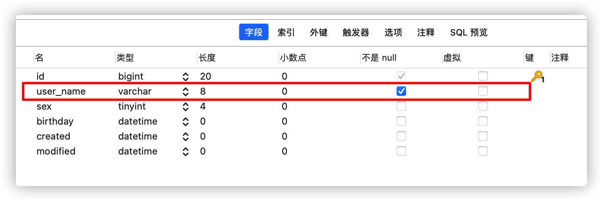
实体类：    private String userName;

发现userName属性值为null，没有映射成功。

解决方案：在 application.yml 配置文件添加：

```yaml
mybatis:
  configuration:
    map-underscore-to-camel-case: true
```

<font color="blue">3、省略@Mapper注解：</font>


如果省略@Mapper注解，那么启动项目后出现异常错误；

解决方案：在引导类上添加 `@MapperScan` 注解：

```java
@SpringBootApplication
@MapperScan("com.pp.mapper")/推荐 批量加载mapper接口
public class SpringWebApp {
    public static void main(String[] args) {
        SpringApplication.run(SpringWebApp.class,args);
    }
}
```

<font color="red">小结：</font>

* 以上是项目中常用的内容，其他配置可以参考官网查看；

### 21-SpringBoot2核心技术-整合Mybatis实现分页

<font color="red">目的：能够实现SpringBoot整合Mybatis完成分页功能</font>

<font color="red">步骤：</font>

1、依赖

```xml
<dependency>
    <groupId>com.github.pagehelper</groupId>
    <artifactId>pagehelper-spring-boot-starter</artifactId>
    <version>1.3.0</version>
</dependency>
```

2、核心配置

```yaml
pagehelper:
  helperDialect: mysql
  reasonable: true
```

<font color="red">实现：作业实现分页查询+CRUD</font>

```java
/示例代码
package com.pp;

import com.github.pagehelper.PageHelper;
import com.github.pagehelper.PageInfo;
import com.pp.mapper.UserMapper;
import com.pp.pojo.User;
import org.junit.jupiter.api.Assertions;
import org.junit.jupiter.api.Test;
import org.springframework.beans.factory.annotation.Autowired;
import org.springframework.boot.test.context.SpringBootTest;

import java.util.List;

@SpringBootTest
public class TestMybatis {
    @Autowired
    private UserMapper userMapper;

    @Test
    public void findAllByPage(){
        /设置分页信息
        PageHelper.startPage(2,3);
        List<User> all = userMapper.findAll();
        PageInfo<User> pageInfo = new PageInfo<>(all);
        /获取总记录熟
        long total = pageInfo.getTotal();
        /获取总页数
        int pages = pageInfo.getPages();
        /获取当前页
        int pageNum = pageInfo.getPageNum();
        System.out.println(all);
    }
}
```

### 22-SpringBoot2核心技术-整合Redis

<font color="red">目的：</font>能够独立使用SpringBoot整合Redis

#### 22-1-SpringBoot2核心技术-Redis场景快速入门

Redis常用数据类型有5种，快速入门以实现存储和查看String类型数据为例说明；

##### 【1】步骤

1. 场景（redis）依赖

2. 配置文件
5. 编写测试类

##### 【2】代码实现

1、依赖

```xml
<dependency>
    <groupId>org.springframework.boot</groupId>
    <artifactId>spring-boot-starter-data-redis</artifactId>
</dependency>
```

2、配置文件

```yaml
spring:
  redis:
  	host: 192.168.200.150  # 默认localhost
  	port: 6379   # 默认6379
  	database: 1 # 默认0
```

3、测试

```java
package com.pp;

import com.pp.pojo.User;
import org.junit.jupiter.api.Test;
import org.springframework.beans.factory.annotation.Autowired;
import org.springframework.boot.test.context.SpringBootTest;
import org.springframework.data.redis.core.RedisTemplate;

import java.util.HashMap;
import java.util.List;
import java.util.Map;
import java.util.Set;

@SpringBootTest
public class TestRedis {
    @Autowired
    private RedisTemplate redisTemplate;

    /**
     * string
     */
    @Test
    public void test1(){
        /引入key value
        redisTemplate.opsForValue().set("userName","zhangsan");
        /获取key对应value值
        Object userName = redisTemplate.opsForValue().get("userName");
        System.out.println(userName);
    }
}
```

#### 22-2-SpringBoot2核心技术-Redis场景核心API使用

其它数据类型操纵如下：

```java
package com.pp;

import com.pp.pojo.User;
import org.junit.jupiter.api.Test;
import org.springframework.beans.factory.annotation.Autowired;
import org.springframework.boot.test.context.SpringBootTest;
import org.springframework.data.redis.core.RedisTemplate;

import java.util.HashMap;
import java.util.List;
import java.util.Map;
import java.util.Set;

@SpringBootTest
public class TestRedis {
    @Autowired
    private RedisTemplate redisTemplate;

    /**
     * string
     */
    @Test
    public void test1(){
        /引入key value
        redisTemplate.opsForValue().set("userName","zhangsan");
        /获取key对应value值
        Object userName = redisTemplate.opsForValue().get("userName");
        System.out.println(userName);
    }

    /**
     * 测试list
     */
    @Test
    public void test2(){
        redisTemplate.opsForList().leftPushAll("userList","lisi","wangwu");
        List userList = redisTemplate.opsForList().range("userList", 0, -1);
        System.out.println(userList);
    }

    /**
     * 测试set
     */
    @Test
    public void test3(){
        redisTemplate.opsForSet().add("userSet","lisi","wangwu");
        Set userSet = redisTemplate.opsForSet().members("userSet");
        System.out.println(userSet);
    }

    /**
     * 测试zset
     */
    @Test
    public void test4(){
        redisTemplate.opsForZSet().add("zset","zhangsan",100);
        redisTemplate.opsForZSet().add("zset","zhangsan2",20);
        redisTemplate.opsForZSet().add("zset","zhangsan3",50);
        /查询分数在40到100
        Set zset = redisTemplate.opsForZSet().rangeByScore("zset", 40, 100);
        System.out.println(zset);
    }

    /**
     * 测试hash
     */
    @Test
    public void test5(){
        HashMap map = new HashMap<>();
        map.put("age",18);
        map.put("address","上海");
        redisTemplate.opsForHash().putAll("userMap",map);
        /获取
        Map userMap = redisTemplate.opsForHash().entries("userMap");
        System.out.println(userMap);
    }

    /**
     * 测试对象存储
     * 注意：默认底层使用jdk序列化方式，User类实现Serializable接口
     */
    @Test
    public void test6(){
        redisTemplate.afterPropertiesSet();
        User user = User.builder().id(1l).sex(0).userName("李四").build();
        redisTemplate.opsForValue().set("userInfo",user);
        Object userInfo = redisTemplate.opsForValue().get("userInfo");
        System.out.println(userInfo);
    }
}
```
