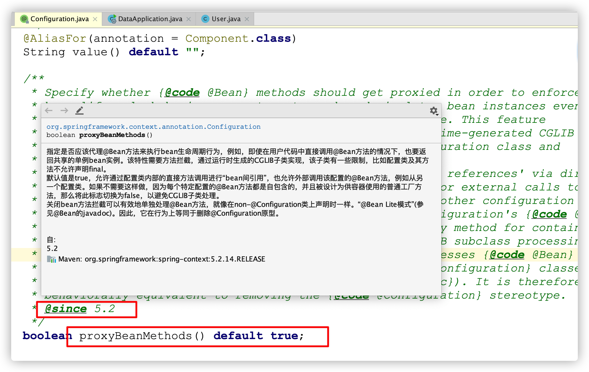
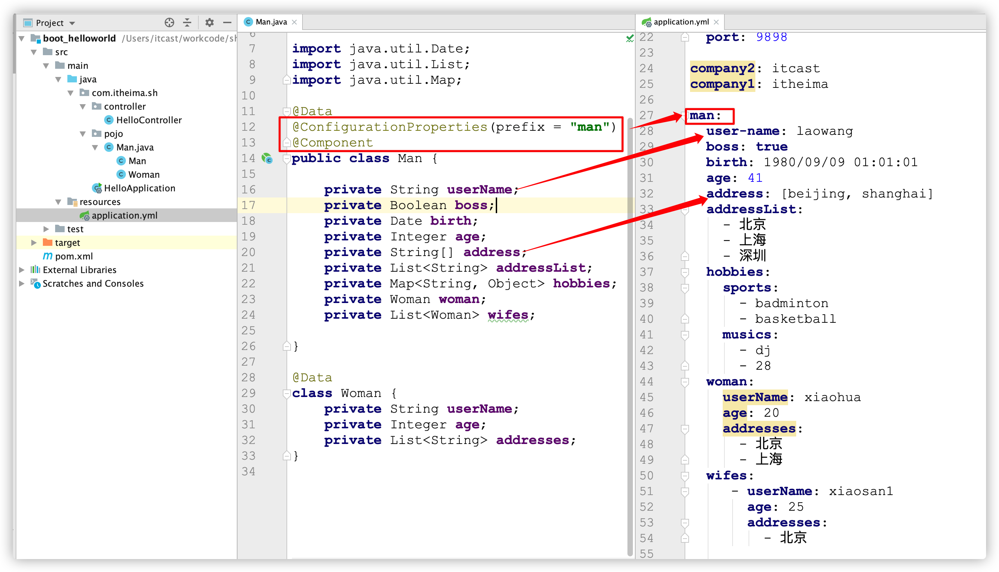
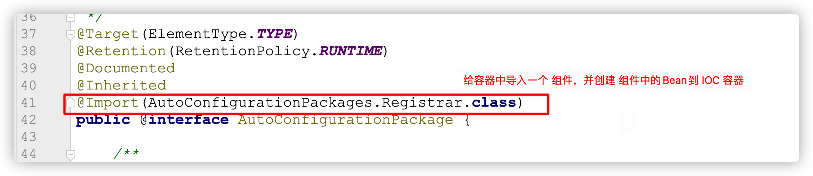
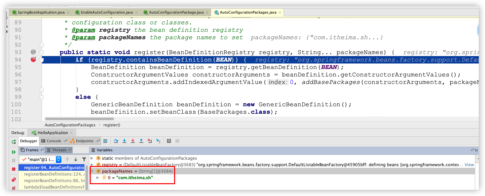
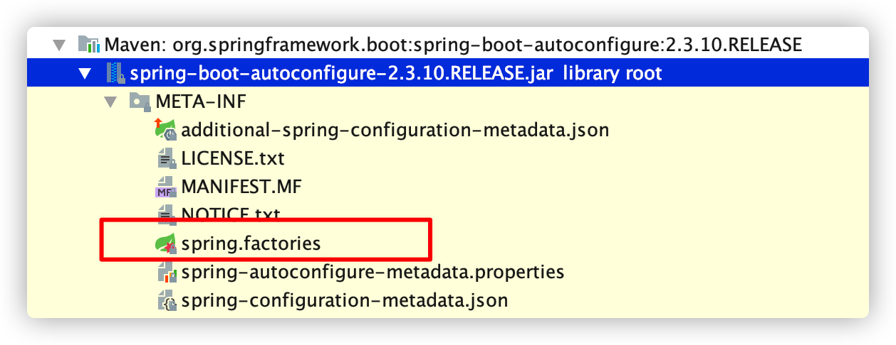

# SpringBoot高级原理

## SpringBoot高级原理前置知识

### 00-1-SpringBoot高级原理预览

#### 【1】今日学习目标

* 理解SpringBoot自动化配置原理
  * 理解@Configuration注解（部分已学）
  * 理解@Import注解作用（部分已学）
  * 理解@Conditional条件装配相关注解
* 能够自定义starter并使用
* 理解SpringBoot健康监控
* 掌握SpringBoot部署方式

#### 【2】SpringBoot自动装配预览

SpringBoot自动化装配课程安排讲解

    

### 00-2-SpringBoot高级原理前置知识(了解)

#### 【1】Java SPI介绍

SPI全称Service Provider Interface，是Java提供的一套用来被第三方实现或者扩展的API，它可以用来启用框架扩展和替换组件。

说白了，Java的SPI机制就是将一些**类信息写在约定的文件中**，然后由特定的类加载器加载解析文件获取资源;

#### 【2】SPI使用场景

| 场景                        | 说明                                                         |
| --------------------------- | ------------------------------------------------------------ |
| 数据库驱动                  | 数据库驱动加载接口实现类的加载 JDBC加载不同类型数据库的驱动  |
| 日志门面SLF4J接口实现类加载 | SLF4J加载不同提供商的日志实现类                              |
| Spring                      | Spring中大量使用了SPI,比如：对servlet3.0规范对ServletContainerInitializer的实现、自动类型转换Type Conversion SPI(Converter SPI、Formatter SPI)等 |
| Dubbo                       | Dubbo中也大量使用SPI的方式实现框架的扩展, 不过它对Java提供的原生SPI做了封装，允许用户扩展实现Filter接口 |
| SpringBoot                  | SpringBoot基于SPI思想实现自动装配                            |


#### 【3】代码测试

导入SPI测试代码：\day02-资料\扩展\SPI扩展\代码\java_spi

Java SPI 实际上是“**基于接口编程＋策略模式＋配置文件**”组合实现的动态加载机制；

## 一、SpringBoot自动化配置原理

### 01-SpringBoot2高级-场景依赖starter介绍(回顾)

<font color="red">目的：</font>通过依赖能了解SpringBoot管理了哪些starter

<font color="red">讲解：</font>

1. 通过依赖 `spring-boot-dependencies` 搜索 `starter-` 发现非常多的官方starter，并且已经帮助我们管理好了版本。【提供了53个场景依赖】

2. 项目中使用直接引入对应的 `starter` 即可，这个场景下需要的依赖就会自动导入到项目中，简化了繁琐的依赖。

3. 引入 `starter` 不仅仅是帮助我们管理了依赖，还帮我做了很多的默认的配置信息，简化了大量的配置，使用更加的简单。

4. 大多数场景启动器的底层都依赖 `spring-boot-starter`【为场景依赖提供spring的核心环境】

   ```xml
   <dependency>
     <groupId>org.springframework.boot</groupId>
     <artifactId>spring-boot-starter</artifactId>
     <version>2.3.10.RELEASE</version>
     <scope>compile</scope>
   </dependency>
   ```

<font color="red">小结：</font> 

1.为什么引入SpringBoot默认场景依赖，无需书写版本号？

<details><summary>说明</summary>父工程通过dependentManager标签进行了版本的锁定与声明；</details>

2.在配置满足当前开发需要的前提，为什么建议使用默认配置？

<details><summary>说明</summary>1.基于约定优于配置思想，减少开发中繁杂的配置;2.SpringBoot帮助我们解决了资源依赖间版本兼容和冲突等问题；</details>

### 02-SpringBoot2高级-自动化配置初体验

<font color="red">目的：</font>以spring-boot-starter-web场景依赖中自动化配置原理为例讲解，能够理解web MVC自动化配置加入了哪些依赖，做了哪些默认配置。

<font color="red">讲解：</font>

#### 【1】回顾SpringMVC配置流程

		【1.1】首先添加SpringMVC相关的依赖资源（spring-webmvc.jar、jackson相关、servlet相关等）；
	
		【1.2】定义springmvc.xml 配置文件，进行如下配置：

1. 扫描controller 所在包；
2. 配置annotation-driven支持mvc扩展功能；
3. 视图解析器；
4. 静态资源；
5. 拦截器；
6. …...

         【1.3】配置web.xml ：

1. 初始化spring容器
2. 初始化springmvc DispatcherServlet核心调度器
3. 请求乱码过滤器

          【1.4】配置tomcat，部署项目；

也就是说在我们开发业务代码前，就必须要准备好这些环境，否则业务功能无法实现。

#### 【2】Web场景依赖原理分析

当我们基于SpringBoot使用web场景依赖时，我们发现要搭建一个标准的mvc工程工程，只需引入spring-boot-starter-web场景依赖即可，几乎无需做其它配置（零配置），在这个过程中SpringBoot为我们做了大量的自动化配置工作；

接下来，我们就探索一下SpringBoot是如何帮助我们完成强大而又简单自动化配置的。

引入 web 开发场景启动器依赖：

```xml
<!--web开发的起步依赖   场景启动器依赖-->
<dependency>
    <groupId>org.springframework.boot</groupId>
    <artifactId>spring-boot-starter-web</artifactId>
</dependency>
```

我们发现spring-boot-starter-web场景依赖帮我们做了很多事：

【2.1】引入webmvc工程相关的依赖资源


【2.1】工程自动加载依赖资源

通过断点测试SpringIOC容器，我们发现SpringBoot几乎把mvc相关的所有资源都自动加载到容器中了：


1）自动装配SpringMVC核心组件（包括核心3大组件和文件上传等组件）

```tex
引入SpringMVC全套组件;
自动配好SpringMVC常用组件（三大组件，文件上传等）;
```

2)自动配好Web常见功能，如：字符编码问题，静态资源管理,错误页面处理组件等；

3）SpringBoot默认自动扫描启动类同级以及所有子目录下资源；

```tex
1.引导类所在包及其下面的所有子包里面的组件都会被默认扫描,无需像以前一样，对包开启注解扫描；
2.如果想要改变扫描路径@SpringBootApplication(scanBasePackages="com.pp")或者@ComponentScan 指定扫描路径
```

4）基于约定优于配置思想自动配置Tomcat常规参数

```tex
端口号：8080
字符键：UTF-8
参考：org.springframework.boot.autoconfigure.web.ServerProperties配置类
```

#### 【3】核心源码分析

在spring-boot-autoconfigure.jar资源包下META-INF/spring.factories文件下配置：


以org.springframework.boot.autoconfigure.web.servlet.DispatcherServletAutoConfiguration类为例，通过翻阅源码：

```java
@Configuration(proxyBeanMethods = false)//定义配置类
@Conditional(DefaultDispatcherServletCondition.class)//满足指定条件则装配
@ConditionalOnClass(ServletRegistration.class)//满足指定类存在则装配
@EnableConfigurationProperties(WebMvcProperties.class)//加载配置对象
protected static class DispatcherServletConfiguration {
//自动装配springMVC核心调度器
@Bean(name = DEFAULT_DISPATCHER_SERVLET_BEAN_NAME)
public DispatcherServlet dispatcherServlet(WebMvcProperties webMvcProperties) {
    DispatcherServlet dispatcherServlet = new DispatcherServlet();
    dispatcherServlet.setDispatchOptionsRequest(webMvcProperties.isDispatchOptionsRequest());
    dispatcherServlet.setDispatchTraceRequest(webMvcProperties.isDispatchTraceRequest());
    dispatcherServlet.setThrowExceptionIfNoHandlerFound(webMvcProperties.isThrowExceptionIfNoHandlerFound());
    dispatcherServlet.setPublishEvents(webMvcProperties.isPublishRequestHandledEvents());
    dispatcherServlet.setEnableLoggingRequestDetails(webMvcProperties.isLogRequestDetails());
    return dispatcherServlet;
}
//.....
}    
```

<font color="red">小结：</font> 

SpringBoot引入web场景依赖后，有什么好处

		1.大量依赖资源自动装配，避免繁杂的XML配置；
	
		2.可以使开发人员的中心聚焦于业务开发，提高开发效率；

### 03-SpringBoot2高级-底层原理-@Configuration配置注解

<font color="red">目的：</font>掌握@Configuration注解的作用及新特性

<font color="red">讲解：</font>

#### 【1】@Configuration注解使用

注解的作用是替代原始 spring XML配置文件功能

思考：

		配置类中被@Bean修饰的方法被配置类bean对象多次调用时，返回的bean是否是同一个bean？

演示：

1）编写配置类

```java
package com.pp.config;

import com.pp.pojo.User;
import org.springframework.context.annotation.Bean;
import org.springframework.context.annotation.Configuration;
import java.util.Date;

//proxyBeanMethods = false:方法不会被代理 LITE模式 【多例模式】
@Configuration(proxyBeanMethods = false)
public class MyConfig {

    @Bean//方法默认被代理 FULL，实现单例模式
    public User myUser(){
        User user = new User().setId(1l).setBirthday(new Date()).setUserName("张三");
        return user;
    }
}
```

2）在引导类编写代码测试：

```java
package com.pp;
import com.pp.config.MyConfig;
import com.pp.pojo.User;
import org.apache.tomcat.util.net.jsse.JSSEUtil;
import org.springframework.boot.SpringApplication;
import org.springframework.boot.autoconfigure.SpringBootApplication;
import org.springframework.context.ConfigurableApplicationContext;

import java.util.Map;

/**
 * 编写引动类/启动类
 * @SpringBootApplication注解定义当前类为springboot的引导类
 */
@SpringBootApplication
public class SpringConfigurationApp {
    /**
     * main方法是springboot
     * 启动的入口
     * @param args
     */
    public static void main(String[] args) {
        //获取ioc容器
        ConfigurableApplicationContext ctx = SpringApplication.run(SpringConfigurationApp.class, args);
        //key:bean名称  value：bean对象
        // 发现MyConfig被cglib动态代理了:从ioc容器检查指定的bena是否存在，如果存在，直接返回ioc容器中的bean FULL
        Map<String, MyConfig> beanInfo = ctx.getBeansOfType(MyConfig.class);
        System.out.println(beanInfo);
        Map<String, User> userInfo = ctx.getBeansOfType(User.class);
        System.out.println(userInfo);
        //获取myconfig对象
        MyConfig myConfig = ctx.getBean(MyConfig.class);
        User user1 = ctx.getBean(User.class);
        User user2 = myConfig.myUser();
        System.out.println(user1==user2);
    }
}
```

#### 【2】proxyBeanMethods属性说明

	@Configuration注解下proxyBeanMethods属性表示代理bean的方法属性【since spring 5.2以后】



功能：

* proxyBeanMethods = true：Full模式（默认），保证每个@Bean方法被调用多少次返回的组件都是单实例的;

* proxyBeanMethods = false：Lite模式，每个@Bean方法被调用多少次返回的组件都是新创建的;

演示：

1. 默认 proxyBeanMethods=true，springBoot会检查这个组件是否在容器中有,有则直接引用

```java
// 默认 proxyBeanMethods=true springBoot会检查这个组件是否在容器中有,有则直接引用
User user3 = myConfig1.getUser();
System.out.println(user1 == user3);  // true
```

2. 修改 proxyBeanMethods=false，则每调用一次Spring就会创建一个新的Bean对象


在执行结果则为 false， 证明两次获取的bean不是同一个bean。

#### 【3】小结

【1】在注解@Configuration修饰的配置类下，调用构建bean的方法时，如何实现单例或者多例模式？

<details>
    <summary>说明</summary>
    通过proxyBeanMethods属性指定：
			【1】proxyBeanMethods=true ：full模式，也就是单例模式，每次方法被调用时不会立即创建，会先从IOC容器检查是否有指定类型的bean，如果有，则直接返回，如果没有，调用方法创建；
			【2】proxyBeanMethods=false:lite模式，也就是多例模式，每次方法被调用，直接创建对象；
</details>

【2】在初次构建bean对象时FULL模式与LITE模式哪个执行效率相对较高？

<details>
    <summary>说明</summary>
	LITE模式，因为构建对象时无需从IOC容器检查对象是否存在，相对效率高一些；
    这也是自动化装配类选择使用LITE模式的核心原因所在（项目启动快）
</details>


### 04-SpringBoot2高级-底层原理-@Import注解使用1

<font color="red">目的：</font>

        @Import注解学习是为接下来源码阅读做准备的；
    
    	理解@Import注解作用及4种使用方式；

<font color="red">讲解：</font>

作用：使用@Import导入的类会被Spring加载到IOC容器中

@Import提供4中用法：

1. 直接导入一个类，实例化后作为一个Bean被ioc容器管理
2. 导入配置类  ★
3. **导入 ImportSelector 实现类。一般用于加载配置文件中的类**   ★★
4. 导入 ImportBeanDefinitionRegistrar 实现类

<font color="red">实现：</font>

【1】导入Bean

```java
package com.pp.sh;

import com.pp.sh.pojo.User;
import org.mybatis.spring.annotation.MapperScan;
import org.springframework.boot.SpringApplication;
import org.springframework.boot.autoconfigure.SpringBootApplication;
import org.springframework.context.ConfigurableApplicationContext;
import org.springframework.context.annotation.Import;

import java.util.Map;

@SpringBootApplication
@Import(User.class)  
//会自动执行当前类的构造方法创建对象，存到IOC容器, bean名称为：类的全路径
public class SpringConfigurationApp {
  public static void main(String[] args) {
    ConfigurableApplicationContext applicationContext = SpringApplication.run(DataApplication.class, args);
	//获取bean的名称与对象对应的键值对对象
    Map<String, User> map = applicationContext.getBeansOfType(User.class);
    System.out.println(map);
    User user1 = applicationContext.getBean("com.pp.sh.pojo.User", User.class);
    System.out.println(user1);
  }
}
```

【2】导入配置类

		定义配置类：

```java
package com.pp.config;

import com.pp.pojo.User;
import org.springframework.context.annotation.Bean;
import org.springframework.context.annotation.Configuration;
import java.util.Date;

@Configuration
public class MyConfig {
    @Bean//方法默认被代理 FULL，实现单例模式
    public User myUser(){
        User user = new User().setId(1l).setBirthday(new Date()).setUserName("张三");
        return user;
    }
}
```

导入配置类：

```java
package com.pp;
import com.pp.config.MyConfig;
import com.pp.config.MyImportBeanDefinitionRegistrar;
import com.pp.config.MyImportSelector;
import com.pp.pojo.User;
import org.apache.tomcat.util.net.jsse.JSSEUtil;
import org.springframework.boot.SpringApplication;
import org.springframework.boot.autoconfigure.SpringBootApplication;
import org.springframework.context.ConfigurableApplicationContext;
import org.springframework.context.annotation.Import;

import java.util.Map;

/**
 * 编写引动类/启动类
 * @SpringBootApplication注解定义当前类为springboot的引导类
 */
@SpringBootApplication
//方式1：导入类最终实例化成bena为ioc容器维护 bean名称：类的全限定名称
//@Import(User.class)
//方式2：导入配置类 ,配置类下的@Configuration可以省略
@Import(MyConfig.class)
public class SpringConfigurationApp {
    public static void main(String[] args) {
        //获取ioc容器
        ConfigurableApplicationContext ctx = SpringApplication.run(SpringConfigurationApp.class, args);
        //@Import(User.class) bean名称：类的全限定名称
        Map<String, User> userBean = ctx.getBeansOfType(User.class);
        System.out.println(userBean);
        User user = ctx.getBean("com.pp.pojo.User", User.class);
        System.out.println(user);
    }
}
```

### 05-SpringBoot2高级-底层原理-@Import注解使用2

<font color="red">目的：</font>讲解@Import注解使用另外两种使用方式

<font color="red">步骤：</font>

1. **导入 ImportSelector 实现类。一般用于加载配置文件中的类**
2. 导入 ImportBeanDefinitionRegistrar 实现类

<font color="red">实现：</font>

#### 【1】导入 ImportSelector 实现类

**场景：一般用于批量导入第三方资源bean**

1、编写ImportSelector接口的实现类MyImportSelector

```java
package com.pp.config;

import org.springframework.context.annotation.ImportSelector;
import org.springframework.core.type.AnnotationMetadata;
import java.util.Set;

public class MyImportSelector implements ImportSelector {
    /**
     * @Import注解打到哪个类下，那么类下的注解元数据信息通过AnnotationMetadata注入到selectImports方法下
     * 实现批量导入
     * @param annotationMetadata
     * @return
     */
    @Override
    public String[] selectImports(AnnotationMetadata annotationMetadata) {
        Set<String> sets = annotationMetadata.getAnnotationTypes();
        return new String[]{"com.pp.pojo.User"};
    }
}
```

2、引导类导入

```java
package com.pp;
import com.pp.config.MyConfig;
import com.pp.config.MyImportBeanDefinitionRegistrar;
import com.pp.config.MyImportSelector;
import com.pp.pojo.User;
import org.apache.tomcat.util.net.jsse.JSSEUtil;
import org.springframework.boot.SpringApplication;
import org.springframework.boot.autoconfigure.SpringBootApplication;
import org.springframework.context.ConfigurableApplicationContext;
import org.springframework.context.annotation.Import;

import java.util.Map;

/**
 * 编写引动类/启动类
 * @SpringBootApplication注解定义当前类为springboot的引导类
 */
@SpringBootApplication
//方式1：导入类最终实例化成bena为ioc容器维护 bean名称：类的全限定名称
//@Import(User.class)
//方式2：导入配置类 ,配置类下的@Configuration可以省略
//@Import(MyConfig.class)
//方式3：实现批量导入组件
@Import(MyImportSelector.class)
public class SpringConfigurationApp {
    /**
     * main方法是springboot
     * 启动的入口
     * @param args
     */
    public static void main(String[] args) {
        //获取ioc容器
        ConfigurableApplicationContext ctx = SpringApplication.run(SpringConfigurationApp.class, args);
        //@Import(User.class) bean名称：类的全限定名称
          Map<String, User> userBean = ctx.getBeansOfType(User.class);
//        System.out.println(userBean);
//        User user = ctx.getBean("com.pp.pojo.User", User.class);
//        System.out.println(user);
    }
}
```

#### 【2】导入ImportBeanDefinitionRegistrar 接口实现类

1、编写 ImportBeanDefinitionRegistrar接口实现类：MyImportBeanDefinitionRegistrar

```java
package com.pp.config;

import com.pp.pojo.User;
import org.springframework.beans.factory.support.AbstractBeanDefinition;
import org.springframework.beans.factory.support.BeanDefinitionBuilder;
import org.springframework.beans.factory.support.BeanDefinitionRegistry;
import org.springframework.context.annotation.ImportBeanDefinitionRegistrar;
import org.springframework.core.type.AnnotationMetadata;

public class MyImportBeanDefinitionRegistrar implements ImportBeanDefinitionRegistrar {
    /**
     *
     * @param importingClassMetadata @Import注解作用的类下的元数据信息封装
     * @param registry 注册bean信息的注册对象
     */
    @Override
    public void registerBeanDefinitions(AnnotationMetadata importingClassMetadata, BeanDefinitionRegistry registry) {
        //1.创建bena的定义信息
        AbstractBeanDefinition userDefinition = BeanDefinitionBuilder.rootBeanDefinition(User.class).getBeanDefinition();
        /**
         * 参数1：bean的名称
         * 参数2：bean的定义对象
         */
        registry.registerBeanDefinition("user",userDefinition);
    }
}
```

2、引导类测试

```java
package com.pp;
import com.pp.config.MyConfig;
import com.pp.config.MyImportBeanDefinitionRegistrar;
import com.pp.config.MyImportSelector;
import com.pp.pojo.User;
import org.apache.tomcat.util.net.jsse.JSSEUtil;
import org.springframework.boot.SpringApplication;
import org.springframework.boot.autoconfigure.SpringBootApplication;
import org.springframework.context.ConfigurableApplicationContext;
import org.springframework.context.annotation.Import;

import java.util.Map;

/**
 * 编写引动类/启动类
 * @SpringBootApplication注解定义当前类为springboot的引导类
 */
@SpringBootApplication
//方式1：导入类最终实例化成bena为ioc容器维护 bean名称：类的全限定名称
//@Import(User.class)
//方式2：导入配置类 ,配置类下的@Configuration可以省略
//@Import(MyConfig.class)
//方式3：实现批量导入
//@Import(MyImportSelector.class)
//方式4：通过ImportBeanDefinitionRegistrar实现类完成导入,也能完成bena的批量导入
@Import(MyImportBeanDefinitionRegistrar.class)
public class SpringConfigurationApp {
    public static void main(String[] args) {
        //获取ioc容器
        ConfigurableApplicationContext ctx = SpringApplication.run(SpringConfigurationApp.class, args);
        //@Import(User.class) bean名称：类的全限定名称
//        Map<String, User> userBean = ctx.getBeansOfType(User.class);
//        System.out.println(userBean);
//        User user = ctx.getBean("com.pp.pojo.User", User.class);
//        System.out.println(user);
        //@Import(MyConfig.class)
        User user2 = ctx.getBean("user",User.class);
        System.out.println(user2);
    }
}
```

#### 【3】小结

使用@Import注解的4种方式？

<details>
    <summary>说明</summary>
1. 直接导入Bean
2. 导入配置类★
3. 导入ImportSelector 实现类。一般用于加载配置文件中的类   ★★
4. 导入ImportBeanDefinitionRegistrar实现类
</details>

### 06-SpringBoot2高级-底层原理-@Conditional衍生条件装配

<font color="red">目的：</font>理解@Conditional衍生条件装配的作用

<font color="red">讲解：</font>

作用：条件装配，满足Conditional指定的条件，则进行组件注入，初始化Bean对象到IOC容器


#### 【1】SpringBoot常用条件注解

```tex
ConditionalOnClass：工程环境中必须存在指定的字节码文件才初始化Bean
ConditionalOnMissingBean：IOC容器中没有对应Bean才初始化Bean
ConditionalOnProperty：判断配置文件中是否有对应属性和值才初始化Bean
```

#### 【2】代码演示

```java
package com.pp.config;

import com.pp.pojo.User;
import org.springframework.boot.autoconfigure.condition.ConditionalOnClass;
import org.springframework.boot.autoconfigure.condition.ConditionalOnMissingBean;
import org.springframework.boot.autoconfigure.condition.ConditionalOnMissingClass;
import org.springframework.boot.autoconfigure.condition.ConditionalOnProperty;
import org.springframework.context.annotation.Bean;
import org.springframework.context.annotation.Configuration;

import java.util.Date;

@Configuration
//【1】User类存在，那么当前的配置bean就会被加载到ioc容器下
//@ConditionalOnClass(name = {"com.pp.pojo.User"})
//【2】与@ConditionalOnClass功能相反
//@ConditionalOnMissingClass(value = {"com.pp.pojo.User"})
//【3】当指定类型的bean在ioc容器中不存在，那么生效
//@ConditionalOnMissingBean(type = {"com.pp.pojo.User"})
//【4】属性：prefix指定配置文件前缀  name:指定后缀之后的key 如果存在则满足条件，注解作用的bean加载
//配合文件必须配置myredis.enable=true才能被创建
@ConditionalOnProperty(prefix = "myredis",name = "enable",havingValue = "true")
public class MyConfig {

    @Bean
    public User myUser(){
        User user = new User().setId(1l).setBirthday(new Date()).setUserName("张三");
        return user;
    }
}
```

	  测试：

```java
package com.pp;
import com.pp.config.MyConfig;
import com.pp.pojo.User;
import org.springframework.boot.SpringApplication;
import org.springframework.boot.autoconfigure.SpringBootApplication;
import org.springframework.context.ConfigurableApplicationContext;

@SpringBootApplication
public class SpringConfigurationApp {

    public static void main(String[] args) {
        //获取ioc容器
        ConfigurableApplicationContext ctx = SpringApplication.run(SpringConfigurationApp.class, args);
        User bean = ctx.getBean(User.class);
        System.out.println(bean);
    }
}
```

		**注意：条件注解不仅可以添加到 类上,也可以作用在方法之上；**

#### 【3】小结 

1.Spring提供的条件注解有什么作用？

<details>
    <summary>说明</summary>
Spring提供的@ConditionalOnXXX注解作用：满足条件当前类或者Bean才有效，按需导入;
</details>

2.Spring常用条件注解有哪些，各有什么作用？

<details>
    <summary>说明</summary>
@ConditionalOnClass：项目环境中存在指定的字节码文件才初始化Bean对象
@ConditionalOnMissingBean：IOC容器中没有指定的Bean对象才初始化注解作用的Bean   
@ConditionalOnProperty：判断配置文件中是否有对应属性和值才初始化Bean
</details>


### 07-SpringBoot2高级-底层原理-@ConfigurationProperties配置绑定

<font color="red">目的：</font>

回顾 @ConfigurationProperties配置绑定 存在的目的是：

获取配置属性或者是配置文件指定前缀的属性信息，并且初始化Bean对象到 IOC 容器。

由此我们可以想：将来的配置我们可以放在配置文件中，通过这个注解来读取并封装成对象，这样避免了配置属性需要逐个注入获取的问题；




### 08-SpringBoot2高级-自动化配置原理-@SpringBootApplication入口分析

<font color="red">目的：</font>能够理解SpringBoot自动化配置流程中@SpringBootApplication是一个组合注解，及每一个注解的作用能够知道作用。

<font color="red">讲解：</font>

<font color="blue">1、SpringBoot是一个组合注解</font> 


<font color="blue">2、@SpringBootConfiguration注解作用</font> 

* @SpringBootConfiguration是对@Configuration注解的包装，proxyBeanMethods 默认配置 true， full模式（单例Bean）

* 标识是一个配置类，所以 <font color="red">引导类也是配置类</font> ;

<font color="blue">3、@ComponentScan注解作用</font> 

* 组件扫描，默认扫描的规则 <font color="red">引导类所在的包及其子包所有带Spring注解的类</font> 

<font color="red">问题：</font> 

1. 在SpringBoot引导类中可以使用@Bean 注解可以吗？

   <details>
       <summary>说明</summary>
       可以，因为@SpringBootApplication注解中@SpringBootConfiguration注解对@Configuration做了层包装，本质也是一个配置注解
   </details>

2. 为什么启动类路径下的Controller、service类添加Spring bean注解后，不需要添加注解扫描，就可以被加载？

   <details>
       <summary>说明</summary>
       SpringBooot通过@ComponentScan默认加载主类路径及其子包路径；
   </details>

### 09-SpringBoot2高级-自动化配置原理-@EnableAutoConfiguration自动配置注解

<font color="red">目的：理解@EnableAutoConfiguration自动化配置核心实现注解</font>

<font color="red">讲解：</font>

本章节我们将通过注解源码阐述SpringBoot加载【工程内部资源】和【第三方starter资源】的加载机制；

#### 【1】@EnableAutoConfiguration浅析

	通过查看源码，我们发现@EnableAutoConfiguration也是一个组合注解。


#### 【2】@AutoConfigurationPackage注解作用

作用：利用Registrar给容器中导入一系列组件



点击 `Registrar` 进入到源码的 `register` 方法，添加 断点，测试



通过 debug 程序，我们发现@AutoConfigurationPackage注解底层会将SpringBoot启动类所在路径封装到BasePackage 类，并注册到IOC容器中，这样配合@ComponentScan注解完成加载启动类同级以及所有子目录下的资源被加载；

总之，@AutoConfigurationPackage核心作用是确定@ComponentScan注解扫描包的范围；


#### 【3】@Import(AutoConfigurationImportSelector.class)注解作用

作用：是利用`selectImports`方法中的 `getAutoConfigurationEntry` 方法给容器中批量导入相关组件;

调用流程分析：

1. 调用`AutoConfigurationImportSelector`类中的`selectImports`方法;

2. `selectImports`方法底层调用`getAutoConfigurationEntry()`方法获取可自动装配的配置类信息集合；

3. `getAutoConfigurationEntry()`方法调用` getCandidateConfigurations(annotationMetadata, attributes)`方法获取所有基于META-INF/spring.factories文件下的自动配置类的集合；【127个自动装配的信息】

4. 底层利用Spring工厂加载器调用 `loadSpringFactories()`方法扫描当前系统中所有META-INF/spring.factories文件，并加载获取自动配置类信息；

   

   默认扫描我们当前系统里面所有META-INF/spring.factories位置的文件

    

   当然，spring-boot-autoconfigure-2.3.4.RELEASE.jar包里面也有META-INF/spring.factories

   

通过这个配置文件加载的自动配置：当前版本（2.3.10）是有127个默认的自动化配置


5.获取所有META-INF/spring.factories下的自动装配的配置类后，然后根据是否满足装配条件进行过滤：

```java
configurations = removeDuplicates(configurations);
Set<String> exclusions = getExclusions(annotationMetadata, attributes);
checkExcludedClasses(configurations, exclusions);
configurations.removeAll(exclusions);
//根据本工程的配置，过滤不满足@ConditionlOnxxx
configurations = getConfigurationClassFilter().filter(configurations);
```

<font color="red">小结：</font> 

【1】SpringBoot默认自动加载的配置文件路径是哪里？

<details>
    <summary>说明</summary>
    当前项目系统路径下的所有META-INF/spring.factories文件
</details>

【2】简述SpringBoot自动装配流程？

<details>
    <summary>说明</summary>
1. 通过@Import注解调用AutoConfigurationImportSelector类中的selectImports方法;
2. selectImports方法底层调用getAutoConfigurationEntry()方法获取可自动装配的配置类信息集合；
3. getAutoConfigurationEntry()方法调用getCandidateConfigurations(annotationMetadata, attributes)方法获取所有基于META-INF/spring.factories文件下的自动配置类的集合；
4. 底层利用Spring工厂加载器调用 loadSpringFactories()方法扫描当前系统中所有META-INF/spring.factories文件，并加载获取自动配置类信息；
5.根据@Conditional条件过滤，获取最终自动装配类，最后被IOC容器加载；
</details>

### 10-SpringBoot2高级-自动化配置原理-条件装配过滤示例

<font color="red">目的：</font>

* 能够理解所有的自动化配置虽然会全部加载，底层有大量的@ConditionalOnXXX，有很多自动配置类并不能完全开启。
* 如果配置生效了，则会加载默认的属性配置类，实现默认的对应场景的自动化配置

<font color="red">讲解：</font>

1、以上通过 `META-INF/spring.factories` 配置文件找到所有的自动化配置类，但 是不是全部的生效的呢？很显然是不可能全部都生效的。

2、以 `RedisAutoConfiguration` 为例讲解， 进入到  `RedisAutoConfiguration`  自动化配置类。

```java
//定义当前注解作用类是配置类 proxyBeanMethods = false使用后lite模式，项目启动快
@Configuration(proxyBeanMethods = false)
//RedisOperations这个类存在，则满足加载条件 也就是说工程需要引入spring-data-redis-2.3.9.RELEASE.jar
@ConditionalOnClass(RedisOperations.class)
//开启配置属性类的加载，RedisProperties类被加载到IOC容器下
@EnableConfigurationProperties(RedisProperties.class)//配置属性bean通过构造器方式注入到工厂bean下
//导入满足条件的工厂配置类，sringboot推荐使用 Lettuce， 性能最好
@Import({ LettuceConnectionConfiguration.class, JedisConnectionConfiguration.class })
public class RedisAutoConfiguration {

	@Bean
    //如果IOC容器中不存在名称为redisTemplate的bean，那么该方法就满足条件
    //好处：为客户端充足的扩展，如果我们自定义了redisTempalte，那么springboot就不会自动装配
	@ConditionalOnMissingBean(name = "redisTemplate")
	public RedisTemplate<Object, Object> redisTemplate(RedisConnectionFactory redisConnectionFactory)
			throws UnknownHostException {
		RedisTemplate<Object, Object> template = new RedisTemplate<>();
		template.setConnectionFactory(redisConnectionFactory);
		return template;
	}

    //StringRedisTemplate仅操纵数据类型是string的场景
	@Bean
	@ConditionalOnMissingBean
	public StringRedisTemplate stringRedisTemplate(RedisConnectionFactory redisConnectionFactory)
			throws UnknownHostException {
		StringRedisTemplate template = new StringRedisTemplate();
		template.setConnectionFactory(redisConnectionFactory);
		return template;
	}
}
```

3、`RedisProperties` 属性对象，用于加载默认的配置，如果配置文件配置了该属性，则配置文件就生效。


4、`LettuceConnectionConfiguration` 是当前版本默认使用的Redis的连接池（性能较好）


<font color="red">问题：</font> 

SpringBoot工程中没有引入的starter，是否能被加载到工程内？为什么？

<details>
    <summary>说明</summary>
    自动装配配置类中只有满足conditional条件的配置类，才会被加载到IOC容器中； 
</details>


### 11-SpringBoot2高级-自动化配置原理-总结

<font color="red">SpringBoot自动化配置流程总结：</font> 

- SpringBoot启动找到自动化配置包下 `META-INF/spring.factories` 内的`EnableAutoConfiguration`配置列表；
- 每个自动配置类按照**条件**进行生效，默认都会绑定配置文件指定的值；
- 生效的配置类就会给容器中装配很多组件；
- 只要容器中有这些组件，相当于这些功能就有了

总之SpringBoot加载所有META-INF/spring.factories文件下的自动装配类，然后通过条件过滤获取可被装配的配置类，然后配置类被spring加载到IOC容器下；

## 二、SpringBoot自定义starter

### 12-SpringBoot2高级-自定义starter-步骤分析

**需求：**自定义heima-redis-spring-boot-starter场景启动依赖，并成功集成到新项目下；

**技术要求：**基于Spring环境使用Jedis和RedisTemplate构建redis场景依赖工程；

**步骤：**

【1】创建 heima-redis-spring-boot-starter 工程模块，打包方式为jar，添加相关依赖；

| 依赖清单                            | 说明                                                |
| ----------------------------------- | --------------------------------------------------- |
| spring-boot-starter                 | 为自定义redis场景依赖提供spring核心环境             |
| spring-boot-configuration-processor | 辅助配置文件时提示说明                              |
| spring-data-redis                   | spring整合redis的中间包，提供RedisTemplate等核心API |
| jedis                               | java底层连接redis服务的客户端技术                   |
| lombok                              | 方便配置属性类setter方法生成                        |

【2】添加配置属性类；

		  作用:将工程中关于redis的配置信息封装到一个配置类下，方便获取配置参数；

【3】添加自动配置类；

			作用：加入条件装配信息，动态构建操纵redis的RedisTemplate对象；

【4】在工程resources下定义META-INF/spring.factories 文件，让SpringBoot自动识别并加载；

			操作：将自定义的配置类定义在该文件中，使得SpringBoot识别加载；

【5】在测试模块中引入自定义的 heima-redis-spring-boot-starter  依赖，测试；

### 13-SpringBoot2高级-自定义starter-实现

#### 【1】构建starter工程

```xml
<parent>
    <groupId>org.springframework.boot</groupId>
    <artifactId>spring-boot-starter-parent</artifactId>
    <version>2.3.10.RELEASE</version>
    <relativePath/> <!-- lookup parent from repository -->
</parent>
<properties>
    <java.version>1.8</java.version>
    <redis.version>2.3.9.RELEASE</redis.version>
</properties>
<packaging>jar</packaging>
<dependencies>
    <!--为场景依赖提供spring的基础环境-->
    <dependency>
        <groupId>org.springframework.boot</groupId>
        <artifactId>spring-boot-starter</artifactId>
    </dependency>
    <!--开发配置提醒-->
    <dependency>
        <groupId>org.springframework.boot</groupId>
        <artifactId>spring-boot-configuration-processor</artifactId>
        <optional>true</optional>
    </dependency>
    <!--spring整合redis的整合包-->
    <dependency>
        <groupId>org.springframework.data</groupId>
        <artifactId>spring-data-redis</artifactId>
        <scope>compile</scope>
    </dependency>
    <!--引入jedis客户端依赖-->
    <dependency>
        <groupId>redis.clients</groupId>
        <artifactId>jedis</artifactId>
    </dependency>

    <dependency>
        <groupId>org.projectlombok</groupId>
        <artifactId>lombok</artifactId>
    </dependency>
</dependencies>
```

#### 【2】添加配置属性类

```java
package com.pp.pros;

import lombok.Data;
import org.springframework.boot.context.properties.ConfigurationProperties;

/**
 * 自动化默认属性配置类：读取配置文件下的数据映射配置对象
 */
@Data
@ConfigurationProperties(prefix = "myredis.config")
public class MyRedisProps {
    //定义redis host主机地址
    private String host="localhost";
    //端口号
    private Integer port=6379;
    //定义数据库 0~15
    private Integer db=0;
}
```

#### 【3】添加条件配置类

```java
package com.pp.redis;

import com.pp.pros.MyRedisProps;
import org.springframework.boot.autoconfigure.condition.ConditionalOnBean;
import org.springframework.boot.autoconfigure.condition.ConditionalOnClass;
import org.springframework.boot.autoconfigure.condition.ConditionalOnMissingBean;
import org.springframework.boot.context.properties.EnableConfigurationProperties;
import org.springframework.context.annotation.Bean;
import org.springframework.context.annotation.Configuration;
import org.springframework.data.redis.connection.jedis.JedisConnectionFactory;
import org.springframework.data.redis.core.RedisTemplate;

/**
 * 定义redis自动装配类
 */
@Configuration(proxyBeanMethods = false)
//必须使用jedis，且必须引入spring-data-redis.jar,完成对redis的操作
@ConditionalOnClass(name = {"redis.clients.jedis.Jedis","org.springframework.data.redis.core.RedisOperations"})
@EnableConfigurationProperties(MyRedisProps.class)
public class MyRedisAutoConfiguration {

    private MyRedisProps myRedisProps;

    /**
     * 构造器注入MyRedisProps类型的bean
     * @param myRedisProps
     */
    public MyRedisAutoConfiguration(MyRedisProps myRedisProps) {
        this.myRedisProps = myRedisProps;
    }

    @Bean
    //容器中不存在名称为redisTemplate的bean则创建
    @ConditionalOnMissingBean(name = "redisTemplate")
    public RedisTemplate redisTemplate(){
        //1.创建连接工程
        JedisConnectionFactory connectionFactory = new JedisConnectionFactory();
        connectionFactory.setHostName(myRedisProps.getHost());
        connectionFactory.setPort(myRedisProps.getPort());
        connectionFactory.setDatabase(myRedisProps.getDb());
        //1.创建RedisTemplate对象
        RedisTemplate<Object, Object> redisTemplate = new RedisTemplate<>();
        redisTemplate.setConnectionFactory(connectionFactory);
        //2.设置对象序列化支持
        redisTemplate.afterPropertiesSet();
        return redisTemplate;
    }
}
```

#### 【4】定义spring.factories

		在resources下定义META-INF/spring.factories 文件，并配置自动装配信息，让SpringBoot自动加载：

```properties
org.springframework.boot.autoconfigure.EnableAutoConfiguration=\
com.pp.redis.MyRedisAutoConfiguration
```

#### 【5】安装自定starter

	maven安装到本地仓库，方便其它工程引用：


### 14-SpringBoot2高级-自定义starter-集成到新项目

<font color="red">目的：</font>验证自定义starter是否可以使用

<font color="red">实现：</font>

【1】新建 `boot_heimaredis` 项目中引入依赖

```xml
<!--1、引入SpringBoot父工程-->
<parent>
  <groupId>org.springframework.boot</groupId>
  <artifactId>spring-boot-starter-parent</artifactId>
  <version>2.3.10.RELEASE</version>
</parent>


<dependencies>
  <!--web 启动器  SpringBoot对web的支持-->
  <dependency>
    <groupId>org.springframework.boot</groupId>
    <artifactId>spring-boot-starter-web</artifactId>
  </dependency>

  <dependency>
    <groupId>org.springframework.boot</groupId>
    <artifactId>spring-boot-starter-test</artifactId>
  </dependency>

  <dependency>
    <groupId>com.pp.sh</groupId>
    <artifactId>heima-redis-spring-boot-starter</artifactId>
    <version>1.0-SNAPSHOT</version>
  </dependency>

</dependencies>
```

【2】定义yml配置

```yaml
myredis:
  config:
    host: 127.0.0.1
    port: 6379
    db: 1
```

【2】测试

```java
package com.pp;

import org.junit.jupiter.api.Test;
import org.springframework.beans.factory.annotation.Autowired;
import org.springframework.boot.test.context.SpringBootTest;
import org.springframework.data.redis.core.RedisTemplate;

@SpringBootTest
public class TestMyStarter {
    @Autowired
    private RedisTemplate redisTemplate;

    @Test
    public void test1(){
        redisTemplate.opsForValue().set("name","lisi");
        Object name = redisTemplate.opsForValue().get("name");
        System.out.println(name);
    }
}
```

## 三、SpringBoot健康监控

### 15-SpringBoot2高级-监控-健康监控服务

<font color="red">目的：</font>能够理解健康监控`actuator`的作用

<font color="red">背景：</font>

在一些大型的业务应用中，工程会根据业务模块做微服务拆分，后期每一个微服务在云上部署以后，都需要对其进行监控、追踪、审计、控制等操纵，这会给维护人员带来很大的运维压力。

SpringBoot对此就抽取了Actuator场景，使得我们每个微服务快速引用即可获得生产级别的应用监控、审计等功能。

<font color="red">实现：</font>

1、被监控工程中引入Actuator依赖

```xml
<dependency>
    <groupId>org.springframework.boot</groupId>
    <artifactId>spring-boot-starter-actuator</artifactId>
</dependency>
```

2、启动项目，访问 `http://localhost:80/actuator/**`


3、暴露所有监控信息为HTTP

```yaml
management:
  endpoints:
    enabled-by-default: true #暴露所有端点信息
    web:
      exposure:
        include: '*'  #以web方式暴露

  endpoint:
    health:
      enabled: true   # 开启健康检查详细信息
      show-details: always
```

访问 `http://localhost:80/actuator` 会发现内容多了，里面的地址分别都可以访问，记录的是对应的健康监测的信息。

### 16-SpringBoot2高级-监控-Admin可视化

<font color="red">目的：</font>能够搭建 可视化监控平台

<font color="red">讲解：</font>

#### 【1】Admin可视化介绍

SpringBoot Admin 有两个角色，客户端(Client)和服务端(Server)。


Spring Boot Admin为注册的应用程序提供以下功能：

- 显示健康状况
- 显示详细信息，例如
  - JVM和内存指标
  - micrometer.io指标
  - 数据源指标
  - 缓存指标
- 显示内部信息
- 关注并下载日志文件
- 查看JVM系统和环境属性
- 查看Spring Boot配置属性
- 支持Spring Cloud的可发布/ env-和// refresh-endpoint
- 轻松的日志级别管理
- 与JMX-beans交互
- 查看线程转储
- 查看http-traces
- 查看审核事件
- 查看http端点
- 查看预定的任务
- 查看和删除活动会话（使用spring-session）
- 查看Flyway / Liquibase数据库迁移
- 下载heapdump
- 状态更改通知（通过电子邮件，Slack，Hipchat等）
- 状态更改的事件日志（非持久性）

 快速入门：https://codecentric.github.io/spring-boot-admin/2.3.1/#getting-started

<font color="red">实现：</font>

以下为创建服务端和客户端工程步骤：

#### 【1】搭建Server端

1、创建 admin_server 模块，引入依赖

```xml
<parent>
    <groupId>org.springframework.boot</groupId>
    <artifactId>spring-boot-starter-parent</artifactId>
    <version>2.3.10.RELEASE</version>
    <relativePath/> <!-- lookup parent from repository -->
</parent>

<dependencies>
    <dependency>
        <groupId>de.codecentric</groupId>
        <artifactId>spring-boot-admin-starter-server</artifactId>
        <version>2.3.1</version>
    </dependency>
    <dependency>
        <groupId>org.springframework.boot</groupId>
        <artifactId>spring-boot-starter-web</artifactId>
    </dependency>
</dependencies>
```

2、开启注解支持

```java
package com.pp.sh;

import de.codecentric.boot.admin.server.config.EnableAdminServer;
import org.springframework.boot.SpringApplication;
import org.springframework.boot.autoconfigure.SpringBootApplication;

@SpringBootApplication
@EnableAdminServer
public class AdminApplication {
    public static void main(String[] args) {
        SpringApplication.run(AdminApplication.class, args);
    }
}
```

注意端口修改为：9999

#### 【3】搭建Client端

1、在任意服务里面引入依赖

```xml
<dependency>
    <groupId>de.codecentric</groupId>
    <artifactId>spring-boot-admin-starter-client</artifactId>
    <version>2.3.1</version>
</dependency>
```

2、配置文件

```yaml
# 执行admin.server地址
spring:   
  boot:
    admin:
      client:
        url: http://localhost:9999  # admin 服务地址
        instance:
          prefer-ip: true   # 显示IP
  application:
    name: boot_data  # 项目名称
    
management:
  endpoints:
    enabled-by-default: true #暴露所有端点信息
    web:
      exposure:
        include: '*'  #以web方式暴露

  endpoint:
    health:
      enabled: true   # 开启健康检查详细信息
      show-details: always
```

#### 【4】启动服务端和客户端测试

  启动服务，访问admin Server http://localhost:9999/


## 四、SpringBoot项目部署

 SpringBoot 项目开发完毕后，支持两种方式部署到服务器

- jar包部署
- war包部署

### 17-SpringBoot2高级-服务部署-jar包部署

<font color="red">目的：</font>能够使用Jar包方式部署SpringBoot项目

<font color="red">实现：</font> 	

1、引入打包插件依赖

```xml
<build>
  <!--声明jar包名称-->
  <finalName>boot_data</finalName>
  <plugins>
    <plugin>
      <groupId>org.springframework.boot</groupId>
      <artifactId>spring-boot-maven-plugin</artifactId>
    </plugin>
  </plugins>
</build>
```

2、打包，复制出Jar使用，`java -jar ` 运行程序

复制到任意Linux目录：


正常访问;

注意事项：

	1.项目运行必须依赖 JDK 环境；
	
	2.启动springboot项目时，默认占用一个终端，如果终端窗口关闭，服务进程结束，如何解决？

```shell
nohup java -jar boot_data.jar &
nohub java -jar boot-data.jar > 1.log
# 加了nohup后，即使关掉命令窗口，后台程序boot-data.jar也会一直执行
```

### 18-SpringBoot2高级-服务部署-war包部署

<font color="red">目的：</font>能够使用war包方式部署SpringBoot项目

<font color="red">步骤：</font>

1、更改打包方式为 war


2、配置打包插件

```xml
<!-- 注意：需要将web依赖中的tomcat移除 -->
<dependency>
  <groupId>org.springframework.boot</groupId>
  <artifactId>spring-boot-starter-web</artifactId>
  <exclusions>
    <exclusion>
      <groupId>org.springframework.boot</groupId>
      <artifactId>spring-boot-starter-tomcat</artifactId>
    </exclusion>
  </exclusions>
</dependency>
<!--如果保存：Error:(13,8) java: 无法访问javax.servlet.ServletException-->
<dependency>
    <groupId>javax.servlet</groupId>
    <artifactId>servlet-api</artifactId>
    <version>2.5</version>
    <scope>provided</scope>
</dependency>

<build>
  <!--jar 包名称-->
  <finalName>boot_data</finalName>
  <plugins>
    <plugin>
      <groupId>org.springframework.boot</groupId>
      <artifactId>spring-boot-maven-plugin</artifactId>
    </plugin>
      <!-- 声明打包时，不需要web.xml -->
      <plugin>
          <groupId>org.apache.maven.plugins</groupId>
          <artifactId>maven-war-plugin</artifactId>
          <configuration>
              <failOnMissingWebXml>false</failOnMissingWebXml>
          </configuration>
      </plugin>
  </plugins>
</build>
```

3、修改引导类 继承 SpringBootServletInitializer

```java
package com.pp;

import de.codecentric.boot.admin.server.config.EnableAdminServer;
import org.springframework.boot.SpringApplication;
import org.springframework.boot.autoconfigure.SpringBootApplication;
import org.springframework.boot.builder.SpringApplicationBuilder;
import org.springframework.boot.web.servlet.support.SpringBootServletInitializer;

/**
 * 编写引动类/启动类
 * @SpringBootApplication注解定义当前类为springboot的引导类
 */
@SpringBootApplication
@EnableAdminServer//开启服务端的健康检查的功能
public class SpringAdminApp  extends SpringBootServletInitializer {
    /**
     * main方法是springboot
     * 启动的入口
     * @param args
     */
    public static void main(String[] args) {
        SpringApplication.run(SpringAdminApp.class, args);
    }

    @Override
    protected SpringApplicationBuilder configure(SpringApplicationBuilder builder) {
      return builder.sources(SpringAdminApp.class);
    }
}
```

4、配置tomcat，war复制到 webapps 目录下：


5、进入到 tomcat/bin 路径下， 赋予可执行的权限

```sh
 chmod u+x *.sh
```

6、启动tomcat

```sh
./startup.sh
```

7、浏览器访问：http://192.168.200.150:8080/boot_data

实际开发中用哪一种？

		如果你的工程用户访问量少（不会面临3高问题：高可用 高并发 高性能），那么推荐使用jar包部署方式，因为部署简单；
	
		如果工程面临3高问题，那么推荐使用war包部署，因为使用外部的tomcat，可以做到最大程度的参数自定义（方便tomcat的优化==》运维人员介入）

## 总结

【1】如何实现被@Configuration修饰的类中的方法产生的bean是单例还是多例？

```tex
proxyBeanMethods=true: Full模式，单例模式，底层被 cglib代理，先从IOC容器中检查当前的bean是否存在，如何存在，则直接返回bean对象，否则创建；
proxyBeanMethods=false:LITE模式，多例模式
```

【2】Import注解导入bean的4种方式

```tex
1.直接导入某个类，作为换一个bean被ioc容器管理
2.导入配置类（配置类可以不写@Configuration注解）
3.导入实现ImportSelector接口的实现类（批量导入）
4.导入实现ImportBeanDefinitionRegistrar接口的实现类（批量注册bean信息，完成导入）
```

【3】常用的条件装配注解有哪些？

```tex
@ConditionalOnBean: 容器中存在bean则创建
@ConditionalOnMissingBean: 容器中不存在bean则创建
@ConditionalOnClass:判断某个类必须存在，才创建
@ConditionalOnMissingClass:判断某个类不必须存在，才创建
@ConditionalOnProperty(prefix="前缀",name="名称",havingvalue="必须是指定的值")配置文件中必须存在指定的key和value值则创建
```

【4】自定装配的原理：

```tex
1）SpringBoot基于SPI思想约定工程以启动加载工程系统环境下META-INF/spring.factories文件获取可自动装配的配置类信息；
2）SringBoot引入了条件装配的概念，这些自动装配类只加载满足条件的配置类；
3）通过自动装配的配置类，将相关的资源加入IOC容器，容器中有了这些bean资源，就有了指定的功能；
```

【5】自定义starter流程

```tex
1.定义一个maven工程，打包方式jar，然后引入spring-boot-starter.jar提供spring核心环境依赖；
2.定义属性配置类，一般使用@ConfigurationProperties注解映射yml中的配置信息；
3.定义自动装配的配置类，主要注解：
	类上：
		@Configuration(proxyBeanMethods=false):加载快
		@ConditionalOnxxx:条件装配条件
		@EnableConfigurationProperties:将属性配置类加载到IOC容器下
	方法上：
    	@Bean
    	@ConditionalOnxxx:满足条件，则方法被执行，构建对应的bean对象
4.在resources包下定义META-INF/spring.factories文件
		eg:
		org.springframework.boot.autoconfigure.EnableAutoConfiguration=\
		com.myredis.config.MyRedisAutoConfiguration
5.打包		
```
