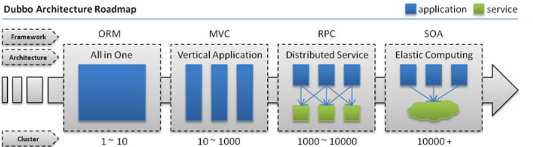
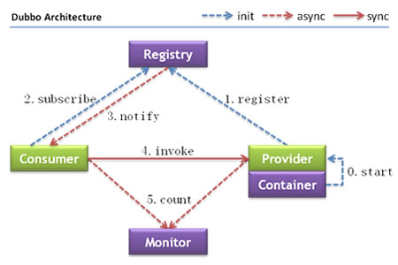
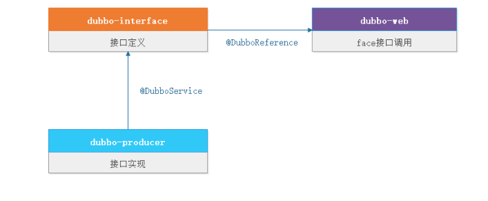
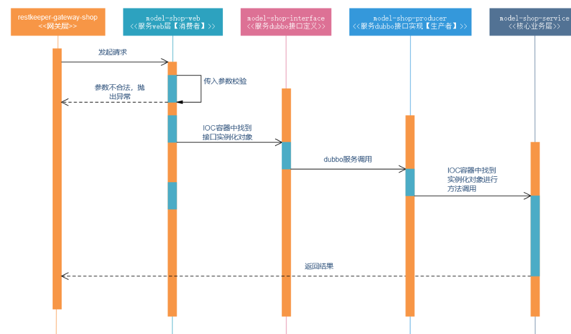
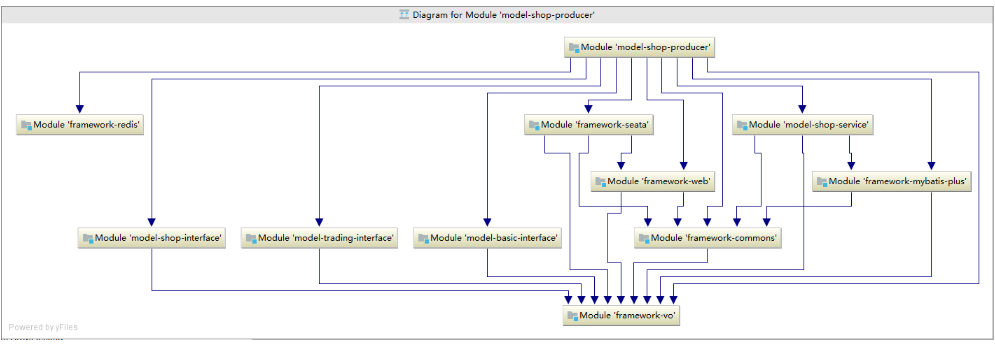
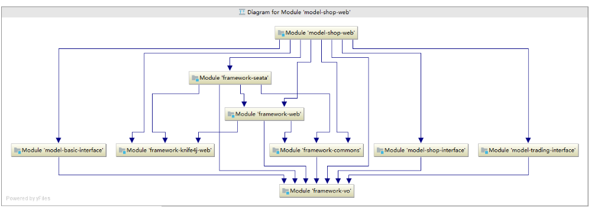
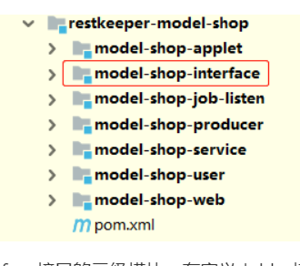

## **1、dubbo简介**

**协议方式**： ==dubbo ==>长连接、单一链接

		随着互联网的发展，网站应用的规模不断扩大，常规的垂直应用架构已无法应对，分布式服务架构以及流动计算架构势在必行，亟需一个治理系统确保架构有条不紊的演进。



**单一应用架构**

		当网站流量很小时，只需一个应用，将所有功能都部署在一起，以减少部署节点和成本。此时，用于简化增删改查工作量的数据访问框架(ORM)是关键。

**垂直应用架构**

		当访问量逐渐增大，单一应用增加机器带来的加速度越来越小，提升效率的方法之一是将应用拆成互不相干的几个应用，以提升效率。此时，用于加速前端页面开发的Web框架(MVC)是关键。

**分布式服务架构**

		当垂直应用越来越多，应用之间交互不可避免，将核心业务抽取出来，作为独立的服务，逐渐形成稳定的服务中心，使前端应用能更快速的响应多变的市场需求。此时，用于提高业务复用及整合的分布式服务框架(RPC)是关键。

**流动计算架构**

		当服务越来越多，容量的评估，小服务资源的浪费等问题逐渐显现，此时需增加一个调度中心基于访问压力实时管理集群容量，提高集群利用率。此时，用于提高机器利用率的资源调度和治理中心(SOA)是关键。

**下面我们看下dubbo架构**



**名词解释**

| 节点        | 角色说明                               |
|-----------|------------------------------------|
| Provider  | 暴露服务的服务提供方【生产者】                    |
| Consumer  | 调用远程服务的服务消费方【消费者】                  |
| Registry  | 服务注册与发现的注册中心【nacos】                |
| Monitor   | 统计服务的调用次数和调用时间的监控中心【监控出现问题不影响服务调用】 |
| Container | 服务运行容器                             |

**调用关系说明**

- 服务容器负责启动，加载，运行服务提供者。
- 服务提供者在启动时，向添加中心添加自己提供的服务。
- 服务消费者在启动时，向添加中心订阅自己所需的服务。
- 添加中心返回服务提供者地址列表给消费者，如果有变更，添加中心将基于长连接推送变更数据给消费者。
- 服务消费者，从提供者地址列表中，基于软负载均衡算法，选一台提供者进行调用，如果调用失败，再选另一台调用。
- 服务消费者和提供者，在内存中累计调用次数和调用时间，定时每分钟发送一次统计数据到监控中心

## **2、dubbo快速入门**

上面我们介绍了dubbo的架构，下面我们来使用dubbo来进行开发，在开发之前，我们先看下面的图解：



从上图我们可用看出在一个标准的dubbo服务调用中，他分为3个部分

**dubbo-interface**：

		负责接口的定义，这里我们通常定义***Face结构的接口类，例如：UserFace

**dubbo-producer**：

		【生产者】负责接口的实现，这里我们通常用==@DubboService==定义***FaceImpl结构的接口类,例如：UserFaceImpl

**dubbo-web**：

		【消费者】负责调用接口，通常我们在web层使用==@DubboReference==调用接口

下面我们来构建第一个dubbo服务，我们需要在dubbo-parent中pom.xml引入下列依赖：

```xml

<dependencies>
    <!--接口定义层-->
    <dependency>
        <groupId>com.pp.dubbo</groupId>
        <artifactId>dubbo-interface</artifactId>
        <version>${interFace.version}</version>
    </dependency>
    <!---spring-cloud-alibaba主配置-->
    <dependency>
        <groupId>com.alibaba.cloud</groupId>
        <artifactId>spring-cloud-alibaba-dependencies</artifactId>
        <version>${spring-cloud-alibaba.version}</version>
        <type>pom</type>
        <scope>import</scope>
    </dependency>
    <!---springboot主配置-->
    <dependency>
        <groupId>org.springframework.boot</groupId>
        <artifactId>spring-boot-dependencies</artifactId>
        <version>${spring.boot.version}</version>
        <type>pom</type>
        <scope>import</scope>
    </dependency>
</dependencies>
```

在dubbo-producer【生产者】和dubbo-web【消费者】中pom.xml导入：

```xml

<dependencies>
    <!--接口定义层-->
    <dependency>
        <groupId>com.pp.dubbo</groupId>
        <artifactId>dubbo-interface</artifactId>
    </dependency>
    <!--web支持-->
    <dependency>
        <groupId>org.springframework.boot</groupId>
        <artifactId>spring-boot-starter-web</artifactId>
    </dependency>
    <!--nacos支持-->
    <dependency>
        <groupId>com.alibaba.cloud</groupId>
        <artifactId>spring-cloud-starter-alibaba-nacos-discovery</artifactId>
    </dependency>
    <!--dubbo支持-->
    <dependency>
        <groupId>com.alibaba.cloud</groupId>
        <artifactId>spring-cloud-starter-dubbo</artifactId>
    </dependency>
</dependencies>
```

### **2.1、生产者配置**

生产者：dubbo-producer负责服务的提供，我们需要把他添加到nacos添加中心中，在application.yml添加：

```yaml
#服务配置
server:
  #端口
  port: 8080
  #服务编码
  tomcat:
  uri-encoding: UTF-8
#spring相关配置
spring:
  #应用配置
  application:
  #应用名称
  name: dubbo-producer
  main:
  allow-bean-definition-overriding: true
  cloud:
  #nacos添加中心
  nacos:
  discovery:
  server-addr: 192.168.112.77:8848
  namespace: public
  group: SEATA_GROUP
dubbo:
  #dubbo服务版本
  application:
  version: 1.0.0
  logger: slf4j
  #dubbo接口扫描路径
  scan:
  base-packages: com.pp.dubbo
  #dubbo服务添加
  registry:
  address: spring-cloud://192.168.112.77
  #dubbo服务协议类型及端口，线程数【这里是默认配置】
  protocol:
  name: dubbo
  port: 28080
  threads: 200
  accesslog: D:/logs/dubbo-producer-01.log
  
```

这里我们实现dubbo-interface的Userface接口：

```java
package com.pp.dubbo;


import org.apache.dubbo.config.annotation.DubboService;


/**
 * @ClassName UserFaceImpl.java
 * @Description 用户接口实现
 */
@DubboService(version = "${dubbo.application.version}", timeout = 5000)
public class UserFaceImpl implements UserFace {


    @Override
    public String helloUser(String userName) {
        return "Hello!" + userName;
    }
}
```

### **2.2、消费者配置**

消费者：dubbo-web负责服务的接口消费，我们需要把他添加到nacos添加中心中，在application.yml添加：

```yaml
#服务配置
server:
  #端口
  port: 8081
  #服务编码
  tomcat:
  uri-encoding: UTF-8
#spring相关配置
spring:
  #应用配置
  application:
  #应用名称
  name: dubbo-web
  main:
  allow-bean-definition-overriding: true
  #nacos添加中心
  cloud:
  nacos:
  discovery:
  server-addr: 192.168.112.77:8848
  namespace: public
  group: SEATA_GROUP
#dubbo消费端配置
dubbo:
  application:
  version: 1.0.0
  logger: slf4j
  cloud:
  #表示要订阅服务的服务名，可以配置'*'，代表订阅所有服务，不推荐使用。若需订阅多应用，使用 "," 分割。
  subscribed-services: dubbo-producer
  scan:
  #扫描路径
  base-packages: com.pp.dubbo.web
  registry:
  address: spring-cloud://192.168.112.77
  #dubbo服务协议类型及端口，线程数【这里是默认配置】
  protocol:
  name: dubbo
  port: 28081
  threads: 200
  accesslog: D:/logs/dubbo-web-01.log
```

这里我们调用dubbo-interface的Userface接口：

```java
package com.pp.dubbo.web;

import com.pp.dubbo.UserFace;
import org.apache.dubbo.config.annotation.DubboReference;
import org.springframework.web.bind.annotation.GetMapping;
import org.springframework.web.bind.annotation.PathVariable;
import org.springframework.web.bind.annotation.RestController;

/**
 * @ClassName UserController.java
 * @Description 用户controller
 */
@RestController
public class UserController {

  @DubboReference(version = "${dubbo.application.version}",check = false)
  UserFace userFace;

  @GetMapping("{userName}")
  public String helloUser(@PathVariable("userName") String userName){
    return userFace.helloUser(userName);
   }

}
```

启动dubbo-producer和dubbo-web模块，访问http://127.0.0.1:8081/pp


## **3、业务模块开发**

### **3.1、业务调用链路**

在开始业务开发之前，我们首先看一下系统的调用链路，以restkeeper-model-shop模块为例，其调用的时序图如下所示：



以restkeeper-model-shop模块为例，一个标准的模块其模块结构如下
|——restkeeper-model-shop	商家服务平台
|
|———— model-shop-applet			 ==H5点餐业务dubbo接口实现【生产者】==
|
|———— model-shop-interface  	   ==商家平台所有dubbo接口定义==
|
|———— model-shop-job-listen	    ==商家服务平台定时任务及监听模块【监听消费、定义任务】==
|
|———— model-shop-producer        ==后端业务dubbo接口实现【生产者】==
|
|———— model-shop-service            ==核心业务层【被所有生产者、消费者、监听、定时任务依赖】==
|
|———— model-shop-user                ==用户业务依赖于model-security-service的业务实现【生产者】==
|
|———— model-shop-web                ==对外商家服务平台web层，被restkeeper-gateway-shop系统调用【消费者者】==

### **3.2、dubbo服务提供者**

		**在restkeeper-model-shop模块中有3个【生产者】模块：model-shop-applet、model-shop-producer、model-shop-user ，这里以model-shop-producer为例，首先查看模块依赖关系：**



**其中model-shop-producer模块他有以下职能：**

- dubbo微服务实现层【生产者】对象转换：从POJO对象转换为VO对象调用server【核心业务层】实现dubbo服务接口的业务逻辑

- 注意：当产生跨服务接口调用，例如一个dubbo接口需要多个dubbo接口来支持，我们会放到face层进行服务调用然后业务组装，如果牵涉分布式事务问题，我们会采用seata方式来解决

下面我们对model-shop-producer进行dubbo的集成，首先在model-shop-producer的pom.xml导入下列依赖：

```xml
<!-- Dubbo Spring Cloud Starter -->
<dependency>
  <groupId>com.alibaba.cloud</groupId>
  <artifactId>spring-cloud-starter-dubbo</artifactId>
</dependency>
```

再在model-shop-producer的application.yml添加定义如下：

```yaml
dubbo:
 #dubbo应用服务定义
  application:
  #版本
   version: 1.0.0
  #日志
   logger: slf4j
  scan:
  #扫描路径
   base-packages: com.pp.restkeeper
  cloud:
  #表示要订阅服务的服务名，可以配置'*'，代表订阅所有服务，不推荐使用。若需订阅多应用，使用 "," 分割。
   subscribed-services: model-basic-producer,model-trading-producer
  registry:
  #注册中心
   address: spring-cloud://192.168.112.77
 #服务协议定义
  protocol:
  #服务协议名称
   name: dubbo
  #协议端口
   port: 27077
  #线程数
   threads: 200
  #dubbo调用日志
   accesslog: D:/logs/model-shop-producer-01.log
```

### **3.3、dubbo服务消费者**

在restkeeper-model-shop模块中有1个【消费者】模块：model-shop-web,这里以model-shop-web为例，首先查看模块依赖关系：



**其中model-shop-web模块他有以下职能：**

- 传入参数的接收及校验工作调用对应业务的dubbo服务，本身不负责业务逻辑的处理【消费者】返回参数的封装，以及当下层发生异常，则抛出指定的自定义异常定义swagger2的接口暴露，方便测试

下面我们对model-shop-web进行dubbo的集成，首先在model-shop-producer的pom.xml导入下列依赖：

```xml
<!-- Dubbo Spring Cloud Starter -->
<dependency>
  <groupId>com.alibaba.cloud</groupId>
  <artifactId>spring-cloud-starter-dubbo</artifactId>
</dependency>
```

再在model-shop-web的application.yml添加定义如下：

```yaml
dubbo:
 #dubbo应用服务定义
  application:
  #版本
   version: 1.0.0
  #日志
   logger: slf4j
  cloud:
  #表示要订阅服务的服务名，可以配置'*'，代表订阅所有服务，不推荐使用。若需订阅多应用，使用 "," 分割。
   subscribed-services: model-shop-producer,model-basic-producer,model-shop-applet,model-shop-user,model-trading-producer
  scan:
  #扫描路径
   base-packages: com.pp.restkeeper.web
  registry:
  #添加中心
   address: spring-cloud://192.168.112.77
 #服务协议定义
  protocol:
  #服务协议名称
   name: dubbo
  #协议端口
   port: 27078
  #线程数
   threads: 200
  #dubbo调用日志
   accesslog: D:/logs/model-shop-web-01.log
```

==subscribed-services属性配置，此属性为订阅服务的服务名==

### **3.4、dubbo接口定义**

		可能在以往的开发中我们只是知道三层架构【mapper、service、web】,那这里的face层是什么意思呢？大家都知道dubbo服务的调用逻辑，【消费者】调用【生成者】，那他们直接能调用的集成也就是声明统一的接口定义，在餐掌柜系统中dubbo层接口就起到此作用：

定义dubbo服务接口被生产者依赖，按照face层的dubbo接口定义实现业务被消费者依赖，从face层的dubbo中选择自己的业务接口

首先我们需要定义一个dubbo接口，那我们在哪里写能？从餐掌柜maven分层构建中我们可用发现，每个以==restkeeper-model-*
*==开头的项目都是一个二级模块，并且模块中都有一个model-**-interface的模块，例如：


没有错，这里就是我们定义face接口的三级模块，在定义dubbo接口的时，都需要找到类似：model-***-interface的模块去书写