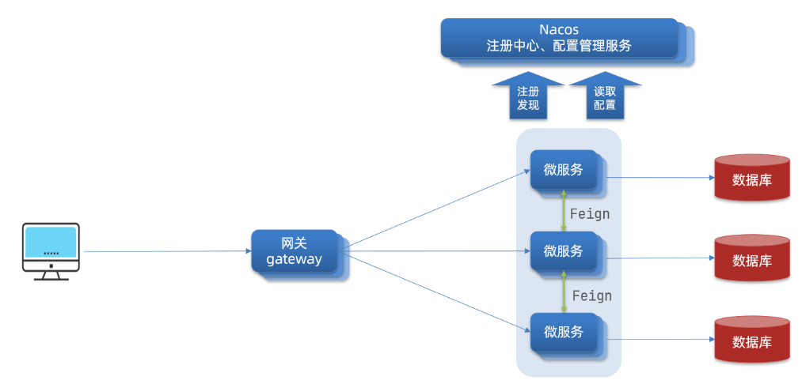
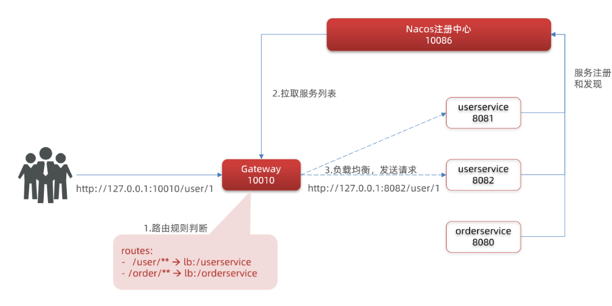

## **在SpringCloud中网关的实现包括两种：**

- **gateway**

- **zuul**

Zuul是基于Servlet的实现，属于阻塞式编程。而SpringCloudGateway则是基于Spring5中提供的WebFlux，属于响应式编程的实现，具备更好的性能。

网关的作用：

**权限控制**：网关作为微服务入口，需要校验用户是是否有请求资格，如果没有则进行拦截。

**路由和负载均衡**：一切请求都必须先经过gateway，但网关不处理业务，而是根据某种规则，把请求转发到某个微服务，这个过程叫做路由。当然路由的目标服务有多个时，还需要做负载均衡。

**限流**：当请求流量过高时，在网关中按照下流的微服务能够接受的速度来放行请求，避免服务压力过大。

架构图：



**网关路由的流程图**

整个访问的流程如下：



1.导入依赖

```xml
<!--网关依赖-->
<dependency>
 <groupId>org.springframework.cloud</groupId>
 <artifactId>spring-cloud-starter-gateway</artifactId>
</dependency>
<!--nacos服务发现依赖-->
<dependency>
 <groupId>com.alibaba.cloud</groupId>
 <artifactId>spring-cloud-starter-alibaba-nacos-discovery</artifactId> 
</dependency>
```

​

2.创建application.yml文件，内容如下：

```yaml
server:
  port: 10010 # 网关端口
spring:
  application:
   name: gateway # 服务名称
  cloud:
   nacos:
    server-addr: localhost:8848 # nacos地址
   gateway:
    routes: # 网关路由配置
     - id: user-service # 路由id，自定义，只要唯一即可
     # uri: http://127.0.0.1:8081 # 路由的目标地址 http就是固定地址
      uri: lb://userservice # 路由的目标地址 lb就是负载均衡，后面跟服务名称
      predicates: # 路由断言，也就是判断请求是否符合路由规则的条件
       - Path=/user/** # 这个是按照路径匹配，只要以/user/开头就符合要求
```

​

**解决跨域问题**

在gateway服务的application.yml文件中，添加下面的配置：

```yaml
spring:
  cloud:
   gateway:
   # 。。。
    globalcors: # 全局的跨域处理
     add-to-simple-url-handler-mapping: true # 解决options请求被拦截问题
     corsConfigurations:
      '[/**]':
       allowedOrigins: # 允许哪些网站的跨域请求 
        - "http://localhost:8090"
       allowedMethods: # 允许的跨域ajax的请求方式
        - "GET"
        - "POST"
        - "DELETE"
        - "PUT"
        - "OPTIONS"
       allowedHeaders: "*" # 允许在请求中携带的头信息
       allowCredentials: true # 是否允许携带cookie
       maxAge: 360000 # 这次跨域检测的有效期
```

## 实现限流

```yml
# 应用服务 WEB 访问端口
server:
  port: 9999

spring:
  cloud:
    gateway:
      # 跨域
      globalcors:
        corsConfigurations:
          '[/**]':
            # 允许携带认证信息(开启时，头部的Access-Control-Allow-Credentials字段的值必须为单个true，而不能是多个值，下面就要进行去重)
            allowCredentials: true
            # 允许跨域的源(网站域名/ip)，设置*为全部
            allowedOrigins: "*"
            # 允许跨域的method， 默认为GET和OPTIONS，设置*为全部
            allowedMethods: "*"
            # 允许跨域请求里的head字段，设置*为全部
            allowedHeaders: "*"
      # Gateway的默认过滤器链
      default-filters:
        # 用于配置响应头部的处理
        # RETAIN_FIRST(先保留)， RETAIN_LAST(最后保留)， RETAIN_UNIQUE(保留唯一性)
        # 指定需要对Vary头部进行处理，实现去重。
        # 指定需要对Access-Control-Allow-Origin头部进行处理，实现去重。
        # 指定需要对Access-Control-Allow-Credentials头部进行处理，实现去重。
#        - DedupeResponseHeader=Vary, RETAIN_UNIQUE
        - DedupeResponseHeader=Access-Control-Allow-Origin, RETAIN_UNIQUE
        - DedupeResponseHeader=Access-Control-Allow-Credentials, RETAIN_UNIQUE
        # 自定义的header 注明我们这个经过了此网关
        #- AddRequestHeader=gateway-env, springcloud-gateway
      routes:
        - id: "server"
          uri: "http://127.0.0.1:8080"
          predicates:
            - Path=/** # 将把所有/** 的请求路由到http://localhost:8080
          filters:
            - PreserveHostHeader # 防止host被修改为localhost
            - name: RequestRateLimiter
              args:
                # 指定限流标识
                key-resolver: '#{@ipKeyResolver}'
                # 速率限流  每秒钟的速率限制是 5 个请求，并且能够容纳的并发请求总数是 1
                redis-rate-limiter.replenishRate: 5
                # 能容纳的并发流量总数
                redis-rate-limiter.burstCapacity: 1
  codec:
    max-in-memory-size: 5MB # 修复拦截POST请求后内存超出缓冲区
  redis:
    cluster:
      nodes:
        - 127.0.0.1:6379
        - 127.0.0.1:6380

logging:
  level:
    org.springframework.cloud.gateway: DEBUG
    reactor.netty.http.client: DEBUG

```

```xml
        <!--基于Redis实现限流-->
        <!--响应式编程模型基于 Reactor 库，可以处理高并发的异步操作，适用于对性能和响应性要求较高的应用-->
        <dependency>
            <groupId>org.springframework.boot</groupId>
            <artifactId>spring-boot-starter-data-redis-reactive</artifactId>
        </dependency>
```


```java
@Configuration
public class IpKeyResolverConfig {

    /**
     * 指定限流方式
     *
     * @return
     */
    @Bean(name = "ipKeyResolver")
    public KeyResolver userIpKeyResolver() {
        return new IpKeyResolver();
    }

    public static class IpKeyResolver implements KeyResolver {

        /**
         * 根据IP限流
         * @param exchange
         * @return
         */
        @Override
        public Mono<String> resolve(ServerWebExchange exchange) {
            return Mono.just(exchange.getRequest().getRemoteAddress().getAddress().getHostAddress());
        }
    }
}
```

## 公共模块


```xml
    <dependencies>
        <dependency>
            <groupId>io.jsonwebtoken</groupId>
            <artifactId>jjwt</artifactId>
            <version>0.9.0</version>
        </dependency>
        <dependency>
            <groupId>org.projectlombok</groupId>
            <artifactId>lombok</artifactId>
            <version>1.18.16</version>
        </dependency>
    </dependencies>
```

```java
import io.jsonwebtoken.Claims;
import io.jsonwebtoken.JwtBuilder;
import io.jsonwebtoken.Jwts;
import io.jsonwebtoken.SignatureAlgorithm;
import javax.crypto.SecretKey;
import javax.crypto.spec.SecretKeySpec;
import java.util.Base64;
import java.util.Date;
/**
 * JWT工具类
 * @author lixiaotao
 */
public class JwtUtil {

    /**
     * 有效期为 60 * 60 *1000  一个小时
     */
    public static final Long JWT_TTL = 3600000L;
    /**
     * 设置秘钥明文
     */
    public static final String JWT_KEY = "cattle";

    /**
     * 创建token
     */
    public static String createJWT(String id, String subject, Long ttlMillis) {

        SignatureAlgorithm signatureAlgorithm = SignatureAlgorithm.HS256;
        long nowMillis = System.currentTimeMillis();
        Date now = new Date(nowMillis);
        if (ttlMillis == null) {
            ttlMillis = JwtUtil.JWT_TTL;
        }
        long expMillis = nowMillis + ttlMillis;
        Date expDate = new Date(expMillis);
        SecretKey secretKey = generalKey();

        JwtBuilder builder = Jwts.builder()
                .setId(id)              //唯一的ID
                .setSubject(subject)   // 主题  可以是JSON数据
                .setIssuer("admin")     // 签发者
                .setIssuedAt(now)      // 签发时间
                .signWith(signatureAlgorithm, secretKey) //使用HS256对称加密算法签名, 第二个参数为秘钥
                .setExpiration(expDate);// 设置过期时间
        return builder.compact();
    }

    /**
     * 解析
     */
    public static Claims parseJWT(String jwt) {
        SecretKey secretKey = generalKey();
        return Jwts.parser()
                .setSigningKey(secretKey)
                .parseClaimsJws(jwt)
                .getBody();
    }

    /**
     * 生成加密后的秘钥 secretKey
     *
     * @return
     */
    public static SecretKey generalKey() {
        byte[] encodedKey = Base64.getDecoder().decode(JwtUtil.JWT_KEY);
        return new SecretKeySpec(encodedKey, 0, encodedKey.length, "AES");
    }
}
```

```java
@Data
public class Result<T> implements Serializable {

    private static final long serialVersionUID = 4893280118017319089L;
    public static final String SUCCESS_CODE = "0";
    public static final String SUCCESS_MESSAGE = "操作成功";
    public static final String ERROR_CODE = "9";
    public static final String ERROR_MESSAGE = "系统异常";


    private String code;
    private String msg;
    private T data;

    public Result() {
        this("0", "操作成功");
    }

    public Result(String code, String msg) {
        this(code, msg, (T) null);
    }

    public Result(String code, String msg, T data) {
        this.code(code).msg(msg).result(data);
    }

    private Result<T> code(String code) {
        this.setCode(code);
        return this;
    }

    private Result<T> msg(String msg) {
        this.setMsg(msg);
        return this;
    }

    public Result<T> result(T data) {
        this.setData(data);
        return this;
    }

    public static <T> Result<T> ok() {
        return new Result<>("200", "操作成功", null);
    }

    public static <T> Result<T> ok(T t) {
        return new Result<>("200", "操作成功", t);
    }

    public static <T> Result<T> ok(String msg,T t) {
        return new Result<>("200", msg, t);
    }

    public static <E> Result<E> error(String code, String msg) {
        return new Result<>(code, msg);
    }

    public static <T> Result<T> error() {
        return new Result<>("9", "系统异常");
    }

    public static <T> Result<T> error(String msg) {
        return new Result<>("9", msg);
    }
}

```

## 鉴权

- application.yml

```yml
        - id: "auth"
          uri: "http://127.0.0.1:9000"
          predicates:
            - Path=/auth/** # 将把所有/** 的请求路由到http://localhost:8080
          filters:
            # - StripPrefix=1 #在转发请求时去除路径中的前缀，比如`- Path=/user/**` 中的`/user/`。
            # - RewritePath=/example/(?<segment>.*), /$\{segment} #将请求路径中的/example/替换为空，即去除/example前缀
            # - Auth # 添加权限控制过滤器
            - PreserveHostHeader # 防止host被修改为localhost
            - name: RequestRateLimiter
              args:
                # 指定限流标识
                key-resolver: '#{@ipKeyResolver}'
                # 速率限流  每秒钟的速率限制是 5 个请求，并且能够容纳的并发请求总数是 1
                redis-rate-limiter.replenishRate: 5
                # 能容纳的并发流量总数
                redis-rate-limiter.burstCapacity: 1
```

```java
import com.cattle.common.utils.JwtUtil;
import org.springframework.cloud.gateway.filter.GatewayFilterChain;
import org.springframework.cloud.gateway.filter.GlobalFilter;
import org.springframework.core.Ordered;
import org.springframework.http.HttpHeaders;
import org.springframework.http.HttpStatus;
import org.springframework.http.server.reactive.ServerHttpRequest;
import org.springframework.http.server.reactive.ServerHttpResponse;
import org.springframework.stereotype.Component;
import org.springframework.util.StringUtils;
import org.springframework.web.server.ServerWebExchange;
import reactor.core.publisher.Mono;

/**
 * 鉴权过滤器 验证token
 * @author lixiaotao
 */
@Component
public class AuthorizeFilter implements GlobalFilter, Ordered {
    private static final String AUTHORIZE_TOKEN = "token";

    @Override
    public Mono<Void> filter(ServerWebExchange exchange, GatewayFilterChain chain) {
        //1. 获取请求
        ServerHttpRequest request = exchange.getRequest();
        //2. 则获取响应
        ServerHttpResponse response = exchange.getResponse();
        //3. 如果是登录请求则放行
        if (request.getURI().getPath().contains("/auth/hello")) {
            return chain.filter(exchange);
        }
        //4. 获取请求头
        HttpHeaders headers = request.getHeaders();
        //5. 请求头中获取令牌
        String token = headers.getFirst(AUTHORIZE_TOKEN);

        //6. 判断请求头中是否有令牌
        if (StringUtils.isEmpty(token)) {
            //7. 响应中放入返回的状态吗, 没有权限访问
            response.setStatusCode(HttpStatus.UNAUTHORIZED);
            //8. 返回
            return response.setComplete();
        }

        //9. 如果请求头中有令牌则解析令牌
        try {
            JwtUtil.parseJWT(token);
        } catch (Exception e) {
            e.printStackTrace();
            //10. 解析jwt令牌出错, 说明令牌过期或者伪造等不合法情况出现
            response.setStatusCode(HttpStatus.UNAUTHORIZED);
            //11. 返回
            return response.setComplete();
        }
        //12. 放行
        return chain.filter(exchange);
    }

    @Override
    public int getOrder() {
        return 0;
    }
}
```

```java
@RestController
@RequestMapping("/auth")
public class BasicController {

    @PostMapping("/hello")
    public String hello(@RequestParam(name = "name", defaultValue = "unknown user") String name) {
        return "Hello " + name;
    }

    /**
     * 登录
     * @param user
     * @return
     */
    @PostMapping("/login")
    public Result<Map<String, String>> login(@RequestBody User user) {
        Map<String, String> info = new HashMap<>(2);
        info.put("username", user.getName());
        String token = JwtUtil.createJWT(UUID.randomUUID().toString(), user.getName(), null);
        info.put("token", token);

        return Result.ok("登录成功", info);
    }
}
```