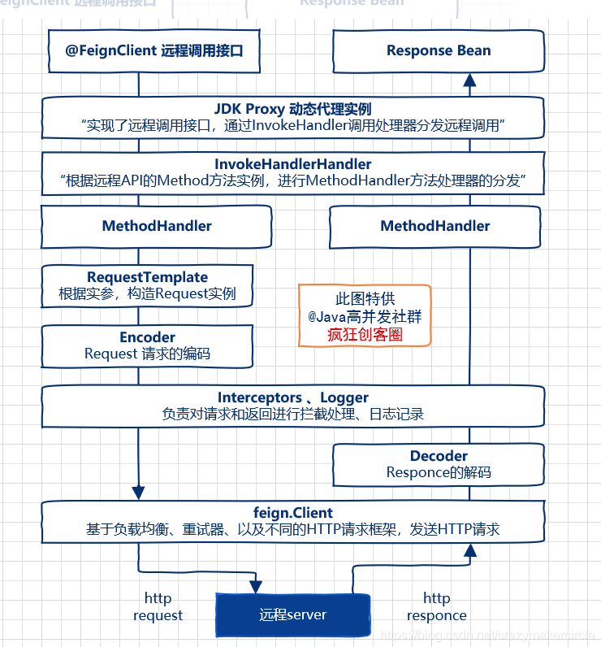
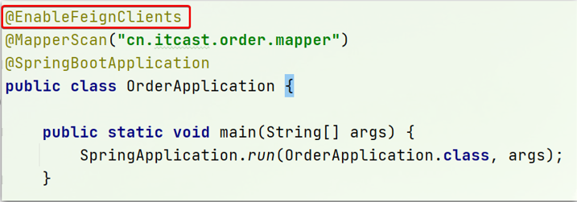
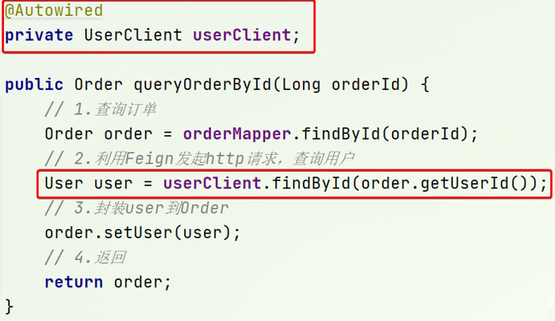
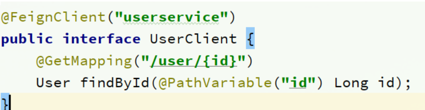
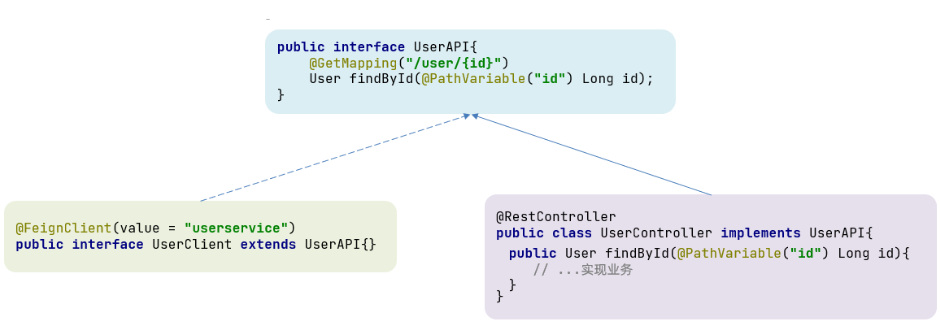

**核心就是通过一系列的封装和处理，将以JAVA注解的方式定义的远程调用API接口，最终转换成HTTP的请求形式，然后将HTTP的请求的响应结果，解码成JAVA Bean，放回给调用者。Feign远程调用的基本流程，大致如下图所示。**



## 1.引入依赖：

```xml
//父模块导入spring-cloud
<dependency>
    <groupId>org.springframework.cloud</groupId>
    <artifactId>spring-cloud-dependencies</artifactId>
    <version>2020.0.0</version>
    <type>pom</type>
    <scope>import</scope>
</dependency>

//子模块
<!--OpenFeign远程调用-->
<dependency>
    <groupId>org.springframework.cloud</groupId>
    <artifactId>spring-cloud-starter-openfeign</artifactId>
</dependency>
```

            

## 2.在order-service的启动类添加注解开启Feign的功能：

- @EnableFeignClients



## 3.编写Feign客户端：

 ```java
 @FeignClient(userservice)
 
 public interface UserClient{
     @GetMapping(/user/{id})         
 
     User findById(@PathVariable(id) Long id);             
 
  }
 ```

  

## 4.用Feign客户端代替RestTemplate



## 5.Feign使用优化

Feign底层发起http请求，依赖于其它的框架。其底层客户端实现包括：

- URLConnection：默认实现，不支持连接池

- Apache HttpClient ：支持连接池

- OKHttp：支持连接池

因此提高Feign的性能主要手段就是使用**连接池**代替默认的URLConnection。

这里我们用Apache的HttpClient来演示。

### 1）引入依赖

在order-service的pom文件中引入Apache的HttpClient依赖：

```xml
<!--httpClient的依赖 -->
<dependency>
  <groupId>io.github.openfeign</groupId>
  <artifactId>feign-httpclient</artifactId>
</dependency>
```

           

### 2）配置连接池

在order-service的application.yml中添加配置：

```yaml
feign:
  client:
    config:
      default: # default全局的配置
       loggerLevel: BASIC # 日志级别，BASIC就是基本的请求和响应信息
  httpclient:
    enabled: true # 开启feign对HttpClient的支持
    max-connections: 200 # 最大的连接数
    max-connections-per-route: 50 # 每个路径的最大连接数
```

           

**总结，Feign的优化：**

1. 日志级别尽量用basic

2.使用HttpClient或OKHttp代替URLConnection

①  引入feign-httpClient依赖

②  配置文件开启httpClient功能，设置连接池参数

## 6.最佳实践

所谓最近实践，就是使用过程中总结的经验，最好的一种使用方式。

自习观察可以发现，Feign的客户端与服务提供者的controller代码非常相似：

feign客户端：



- UserController：


**有没有一种办法简化这种重复的代码编写呢？**

一样的代码可以通过继承来共享：

 - 1）定义一个API接口，利用定义方法，并基于SpringMVC注解做声明。

 - 2）Feign客户端和Controller都集成改接口

