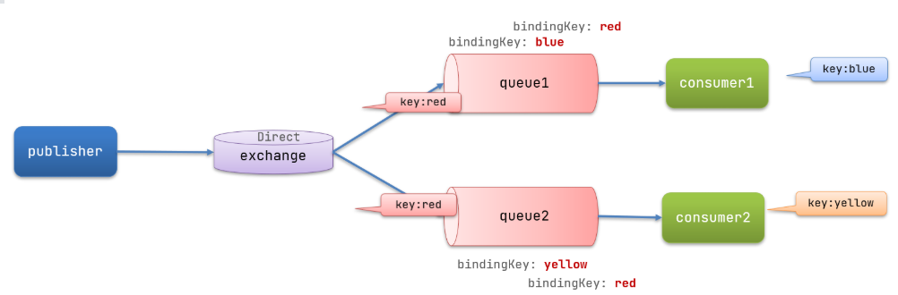
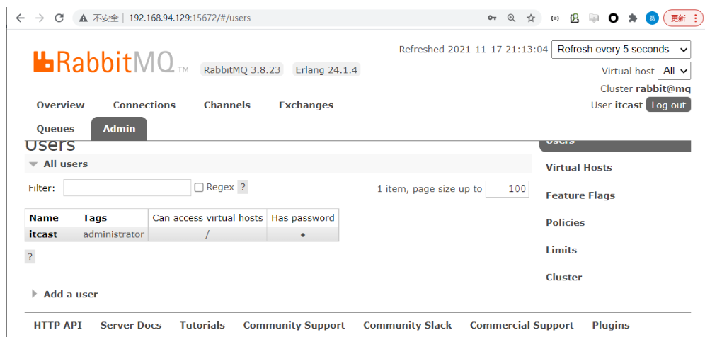
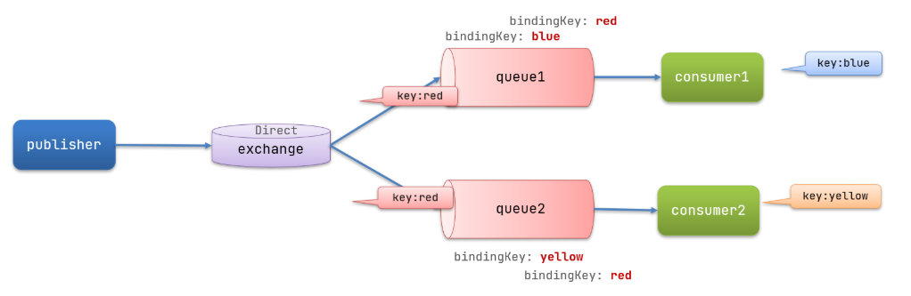
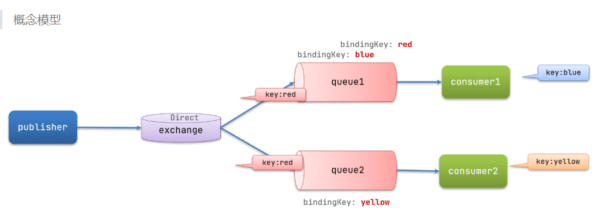

## **RabbitMQ**

	在课程发布时，需要通过消息队列 MQ 来完成复杂业务解耦操作，下面我们来讲 MQ 的环境搭建，并集成到项目中。

对于市面中，MQ 服务有很多如下列：（面试）

几种常见MQ的对比：

|            | **RabbitMQ**            | **ActiveMQ**                   | **RocketMQ** | **Kafka**  |
| ---------- | ----------------------- | ------------------------------ | ------------ | ---------- |
| 公司/社区  | Rabbit                  | Apache                         | 阿里         | Apache     |
| 开发语言   | Erlang                  | Java                           | Java         | Scala&Java |
| 协议支持   | AMQP，XMPP，SMTP，STOMP | OpenWire,STOMP，REST,XMPP,AMQP | 自定义协议   | 自定义协议 |
| 可用性     | 高                      | 一般                           | 高           | 高         |
| 单机吞吐量 | 一般                    | 差                             | 高           | 非常高     |
| 消息延迟   | 微秒级                  | 毫秒级                         | 毫秒级       | 毫秒以内   |
| 消息可靠性 | 高                      | 一般                           | 高           | 一般       |

- 追求可用性：Kafka、 RocketMQ 、RabbitMQ

- 追求可靠性：RabbitMQ、RocketMQ

- 追求吞吐能力：RocketMQ、Kafka

- 追求消息低延迟：RabbitMQ、Kafka

综合上面的应用场景，学成在线项目中采用 RabbitMQ 作为消息队列服务(消息中间件)，下面我们来 **开始环境的搭建** 和 **项目的集成**。

对于 RabbitMQ 来说，可以在 Linux 或 Windows 环境下运行，为考虑到电脑内存开销，项目中会在 Windows 下来运行 RabbitMQ 服务。环境的运行会根据 RabbitMQ 架构结构图来进行启动。

PS：由于 RabbitMQ   已经有前置课程，对此直接使用，详细信息不会在阐述。



RabbitMQ中的一些角色：

- publisher：生产者
- consumer：消费者
- exchange个：交换机，负责消息路由
- queue：队列，存储消息
- virtualHost：虚拟主机，隔离不同租户的exchange、queue、消息的隔离

- **Linux环境部署**

在 Linux 的 Docker 环境下部署 RabbitMQ，并启动 服务。

拉取镜像

```docker
docker pull rabbitmq:3.8-management              
```

执行下面的命令来运行MQ容器：

```docker
docker run \
 -e RABBITMQ_DEFAULT_USER=itcast \
 -e RABBITMQ_DEFAULT_PASS=123321 \
 -v mq-plugins:/plugins \
 --name mq \
 --hostname mq \
 -p 15672:15672 \
 -p 5672:5672 \
 -d \
 rabbitmq:3.8-management
```

访问RabbitMQ控制台界面：

http://ip:15672



##  **Spring Boot 集成** 

项目中，我们将使用 Spring Boot 集成 RabbitMQ 提供的 Api 来编写业务代码。

xc-content-service 工程将 SpringBoot 集成 RabbitMQ 依赖引入

```xml
<!--AMQP依赖，包含RabbitMQ-->
<dependency>
<groupId>org.springframework.boot</groupId>
<artifactId>spring-boot-starter-amqp</artifactId>
</dependency>
```

###  **1.消息生成方工程测试代码编写**

消息生成方编写代码会根据下面的概念模型来编写。


 在Direct模型下：

- 队列与交换机的绑定，不能是任意绑定了，而是要指定一个RoutingKey（路由key）
- 消息的发送方在 向 Exchange发送消息时，也必须指定消息的 RoutingKey。
- Exchange不再把消息交给每一个绑定的队列，而是根据消息的Routing Key进行判断，只有队列的Routingkey与消息的 Routing key完全一致，才会接收到消息

在生产者声明下面内容

1. 声明DirectExchange、Queue、RoutingKey
2. 将交互级和队列继续绑定
3. 在publisher中编写测试方法，向direct发送消息

对于两项信息我们通过 xc-content-service 配置文件 bootstrap.yml 来完成，如下：

```yaml
spring:
  rabbitmq:
  host: 192.168.94.129 # 主机名
  port: 5672 # 端口,如果用dockr部署，别用访问端口15672，用程序端口5672
  virtual-host: / # 虚拟主机
  username: itcast # 用户名
  password: 123321 # 密码
```

对于后两项的信息我们通过 RocketMQ-spring-boot-starter 所提供的 RocketMQTemplate 来设置，对此在 test-rocketmq-producer 工程中编写测试代码如下：

```java
package com.xuecheng.content.config.rabbitmq;

import org.springframework.amqp.core.*;
import org.springframework.beans.factory.annotation.Value;
import org.springframework.context.annotation.Bean;
import org.springframework.context.annotation.Configuration;

/**
 * <p></p>
 *
 * @Description:
 */
@Configuration
public class RabbitMQConfig {

    //交换机
@Bean("coursePubEx")
public DirectExchange simpleExchange(){
// 三个参数：交换机名称、是否持久化、当没有queue与其绑定时是否自动删除
return new DirectExchange("test.direct", true, false);
  }
    //队列
@Bean("coursePubQueue")
public Queue simpleQueue(){
// 使用QueueBuilder构建队列，durable就是持久化的
return QueueBuilder.durable("test.queue").build();
  }
    //路由绑定
@Bean
public Binding errorBinding(Queue coursePubQueue, DirectExchange coursePubEx){
return BindingBuilder.bind(coursePubQueue).to(coursePubEx).with("test");
  }

}
```

编写测试用例，发送方测试代码

```java
@SpringBootTest
public class RabbitMQTest {

@Autowired
private RabbitTemplate rabbitTemplate;

@Test
public void sendTest() {
        //参数一：交换机 参数二：路由KEY 参数三：发送的消息
rabbitTemplate.convertAndSend("test.direct","test","hello msg");
  }

}
```

### **2.消息消费方工程测试代码编写**

消息消费方编写代码会根据下面的概念模型来编写。



消息生成方需要完成的事项:

1. 声明监听器，指定DirectExchange、Queue、RoutingKey（生产端如果声明，无需声明）

Rabbitmq 测试监听器代码

```java
@Component
public class RabbitMQConsumer {

/* 简单形式：只去指定队列名称（此队列必须要提前声明出来）*/
//@RabbitListener(queues = "test.queue")
//public void publishPage(String msg) {
//  System.out.println("收到消息："+msg);
//}


/* 绑定交互级和队列形式：推荐使用此方式 */
@RabbitListener(bindings = @QueueBinding(
value = @Queue(value="test.queue"),
exchange = @Exchange(value ="test.direct",type = ExchangeTypes.DIRECT),
key = {"test"}
  ))
public void publishPage(String msg) {
System.out.println("收到消息："+msg);
  }

}
```


## 调度，消息重发


**消息重发**

在异常情况下，生产方发送消息给MQ，MQ返回NACK。在失败的情况下，我们需要重新让系统重新发送消息。

这里就用到了定时器。

对于定时器，Spring框架中已经对其进行整合。可以在项目中直接使用，其功能为 Spring-Task。

开启定时任务功能，在SpringBooot启动类上添加下面注解

**@EnableScheduling**

课程发布重新发送消息业务实现

```JAVA
package com.xuecheng.content.task;

import com.baomidou.mybatisplus.core.conditions.query.LambdaQueryWrapper;
import com.xuecheng.content.entity.CoursePubMsg;
import com.xuecheng.content.service.CoursePubMsgService;
import com.xuecheng.content.service.CoursePubService;
import lombok.extern.slf4j.Slf4j;
import org.springframework.beans.factory.annotation.Autowired;
import org.springframework.scheduling.annotation.Scheduled;
import org.springframework.stereotype.Component;

import java.util.List;

/**
 * <p></p>
 *
 * @Description:
 */
@Slf4j
@Component
public class CoursePublishTask {

  @Autowired
  private CoursePubMsgService coursePubMsgService;

  @Autowired
  private CoursePubService coursePubService;

  /* 执行时间频率：时间（毫秒） */
  // @Scheduled(fixedRate = 3000l)

  /*
  * cron
  *  Spring-task一共是6位
  *    3 * * * * ?  每一天的每一小时的每一分钟的第三秒会执行
  *    3 * 12 * * ? 每一天的12点的每一分钟的第三秒会执行
  *    3,12,20,28 * 12 * * ? 每一天的12点的每一分钟的第三秒、第十二秒....会执行
  *    3-28 * 12 * * ? 每一天的12点的每一分钟的第三秒、第十二秒....会执行
  *    10/5 * 12 ? * 3 每一天的12点的每一分钟
  *    冲突：
  *      第四位和第六位是冲突的
  *    当前场景下服务为了同步课程发布数据内容
  *      每隔5-10秒执行
  * */
  @Scheduled(cron = "0/10 * * * * ?")
  public void testTask() {

    log.info("定时任务执行操作-重新发送消息");

    // 1.查询发布消息表中pubStatus为0的数据
    LambdaQueryWrapper<CoursePubMsg> msgLambdaQueryWrapper = new LambdaQueryWrapper<>();
    msgLambdaQueryWrapper.eq(CoursePubMsg::getPubStatus, CoursePubMsg.UNSENT);
    List<CoursePubMsg> list = coursePubMsgService.list(msgLambdaQueryWrapper);

    // 2.将数据重新发送到mq中
    for (CoursePubMsg coursePubMsg : list) {
      Long courseId = new Long(coursePubMsg.getCourseId());
      Long companyId = new Long(coursePubMsg.getCompanyId());
      coursePubService.pulishCoursePub(courseId, companyId,true);
     }
   }
}
```