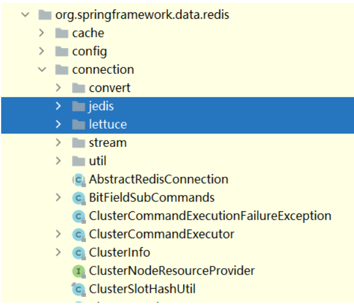

# Redis应用知识

- Redis 是目前使用的非常广泛的免费开源内存数据库，是一个高性能的 key-value 数据库。 

- Redis 与其他 key-value 缓存（如 Memcached ）相比有以下三个特点: 

    - 1.Redis 支持数据的持久化，它可以将内存中的数据保存在磁盘中，重启的时候可以再次加载进行使用。 

    - 2.Redis 不仅仅支持简单的 key-value 类型的数据，同时还提供 list，set，zset，hash 等数据结构的存储。 

    - 3.Redis 支持数据的备份，即 master-slave 模式的数据备份。 

- Redis 优势如下： 

	- 1.**性能极高**。Redis 能读的速度是 110000 次/s，写的速度是 81000 次/s。 

	- 2.**丰富的数据类型**。Redis 支持二进制案例的 Strings，Lists，Sets 及 Ordered Sets 数据类型操作。 

	- 3.**原子性**。Redis 所有的操作都是原子性的，意思是要么成功执行要么失败完全不执行。单个操作是原子性的，多个操作也是，通过 MULTI 和 EXEC 指令包起来。

	- 4.**丰富的特性**。Redis 还支持 publish/subscribe，通知，key 过期等特性。  

## 1. Redis 实际中的问题

### 1.1 缓存穿透

- 使用Redis作为缓存服务来使用，编写代码有一下的逻辑：

  - 1.对于获得数据首先从缓存中获得内容

  - 2.如果缓存中没有数据，将从数据库取出数据

  - 3.将数据库读取的数据存到缓存Redis中

  - 4.将获得数据返回给用户

- 穿透现象：

  - 1.数据：

    ```
    - 缓存是没有查询的数据
    - 数据库是没有查询的数据
    ```
  
  - 2.获得数据的方：
  
    ```
      用户(黑客或者恶意攻击者来传入一个数据库不存在的参数)
    ```
  
  - 3.体现：
  
    ```
    -   用户传入一个缓存和数据库都不存在的数据
    -  从缓存中获得不到时会查询数据库，数据库由于接收到大量的请求会导致卡死或down机。
    ```
  
  - 4.利用的条件
  
    ```
     数据库没有做任何优化或集群方案时，不能处理大量的请求。
    ```
  
    

问题： 

    缓存穿透是指缓存和数据库中都没有的数据，而用户不断发起请求，如发起为id为“-1”的数据或id为特别大不存在的数据。这时的用户很可能是攻击者，攻击会导致数据库压力过大。如下面这段代码就存在缓存穿透的问题。

```java
  public Integer findPrice(int id) {
    //从缓存中查询
    Integer price = (Integer)jedis.get(id);
    
    if(price ==null){
      //缓存中没有，从数据库查询
      Product pro = productMapper.selectByPrimaryKey(id);
      if(pro!=null){ //如果数据库有此对象
        price = pro.getPrice();
        jedis.set("price",price);
       }     
     }
    return price;
   }
```

​         

解决方案：

    1.接口层增加校验，如用户鉴权校验； 2.从缓存取不到的数据，在数据库中也没有取到，这时也可以将key-value对写为key-0。这样可以防止攻击用户反复用同一个id暴力攻击。代码举例：

1.从缓存中获得数据，如果没有数据查询数据库中的数据

2.从数据库中查询的数据如果也没有的话，会在缓存中存储一个空值

```java
  public Integer findPrice(Integer id) {
    //从缓存中查询
    Integer price = (Integer)jedis.get(id);
    
    if(price ==null){
      //缓存中没有，从数据库查询
      Product pro = productMapper.selectByPrimaryKey(id);
      if(pro!=null){ //如果数据库有此对象
        price = pro.getPrice();
        jedis.set(id,price)
       }else{
        jedis.set(id,0);
       }       
     }
    return price;
   }
```

​            

### 1.2 缓存击穿

击穿现象：

    1.数据：
    
        数据有查询数据
    
        缓存中的查询数据正好过期，没有查询数据了
    
    2.获得数据的方：
    
        用户(当前页面的用户访问量剧增，后端的请求剧增)
    
    3.体现：       
    
        用户发送大量的请求获得请求数据，由于请求的数据在缓存中正好过期，此时就会将大量的请求从数据库中年获得所要的数据，数据库由于是接收到了大量的请求，对导致卡死或宕机(没有做优化并且没有集群)
    
    4.利用的条件
    
        数据库没有做任何优化或集群方案时，不能处理大量的请求。

问题：

    缓存击穿是指缓存中没有但数据库中有的数据。这时由于并发用户特别多，同时读缓存没读到数据，又同时去数据库去取数据，引起数据库压力瞬间增大，造成过大压力。

以下代码可能会产生缓存击穿：

```
  public List<Map> findCategoryTree() {
    //从缓存中查询
    List<Map> categoryTree=(List<Map>)jedis.get("categoryTree");
    if(categoryTree==null){
      List<Category> categories = categoryMapper.selectCategoryTree(example);
      
      jedis.set("categoryTree",categoryTree);
      //过期时间设置  ......
     }
    return categoryTree;
   }
```

​            

解决方案：

    1.设置热点数据永远不过期。
    
    2.数据进行热加载
    
        在服务器启动的时候对热门数据进行读取，并存放到缓存中。

### 1.3 缓存雪崩

雪崩现象：

    1.数据：
    
        数据库有数据
    
        缓存正好数据过期，没有查询的数据
    
    2.获得数据的方：
    
        一个服务端请求数据，由于缓存中没有查询内容，会走数据库。
    
    3.体现：       
    
        由于服务端在缓存中存储大量的数据，大量的缓存数据有效期都一致。
    
        大量的缓存数据同时失效，一个服务端从缓存中获得不到数据。
    
        一个服务端将会从数据库请求大量的数据，数据库接收大量的请求和响应大量的数据
    
        数据库服务由于响应的数据量太大，导致数据库卡死或宕机。
    
    4.利用的条件
    
        数据库在没有优化或集群的情况下，无法接收或响应大量请求或数据。


​    

    缓存雪崩是指缓存数据大批量到过期时间，而查询数据量巨大，引起数据库压力过大甚至down机。和缓存击穿不同的是，缓存击穿指并发查同一条数据，缓存雪崩是不同数据都过期了，很多数据都查不到从而查数据库。
    
    解决方案：
    
    1.缓存数据的过期时间设置不同，防止同一时间大量数据过期现象发生。
    
    2.设置热点数据永远不过期。

## 2 Redis的集成

在微服务 spring boot 中，官方已经提供了对其集成，如下：

```xml
<dependency>
    <groupId>org.springframework.boot</groupId>
    <artifactId>spring-boot-starter-data-redis</artifactId>
</dependency>

<dependency>
   <groupId>org.apache.commons</groupId>
   <artifactId>commons-pool2</artifactId>
</dependency>
```

​      

查看 jar 包时发现，Spring Data Redis 下 org.springframework.data.redis.connection 包路径下面默认有两个包 jedis 和 lettuce，这说明 Spring Boot 已经默认包装适配了这两个 Redis 客户端。



在 springboot 1.5.x版本的默认的Redis客户端是 Jedis实现的，springboot 2.x版本中默认客户端是用 lettuce实现的。


### 2.1 Lettuce 与 Jedis 比较

Lettuce 和 Jedis 的都是连接 Redis Server的客户端。

**Jedis** 在实现上是直连 redis server，多线程环境下非线程安全，除非使用连接池，为每个 redis实例增加物理连接。 BIO

**Lettuce** 是 一种可伸缩，线程安全，完全非阻塞的Redis客户端，多个线程可以共享一个RedisConnection,它利用Netty NIO 框架来高效地管理多个连接，从而提供了异步和同步数据访问方式，用于构建非阻塞的反应性应用程序。

### 2.2 Lettuce 集成 Redis 服务

#### 1.配置 Lettuce

由于 Spring Boot 2.X 默认集成了 Lettuce ，所以无需导入。

```properties
################ Redis 基础配置 ##############
# Redis数据库索引（默认为0）
spring.redis.database=0 
# Redis服务器地址
spring.redis.host=127.0.0.1
# Redis服务器连接端口
spring.redis.port=6379 
# Redis服务器连接密码（默认为空）
spring.redis.password=zwqh
# 链接超时时间 单位 ms（毫秒）
spring.redis.timeout=3000
################ Redis 线程池设置 ##############
# 连接池最大连接数（使用负值表示没有限制） 默认 8
spring.redis.lettuce.pool.max-active=8
# 连接池最大阻塞等待时间（使用负值表示没有限制） 默认 -1
spring.redis.lettuce.pool.max-wait=-1
# 连接池中的最大空闲连接 默认 8
spring.redis.lettuce.pool.max-idle=8
# 连接池中的最小空闲连接 默认 0
spring.redis.lettuce.pool.min-idle=0
```


#### 2.自定义 RedisTemplate

默认情况下的模板只能支持 RedisTemplate，只能存入字符串，很多时候，我们需要自定义 RedisTemplate ，设置序列化器，这样我们可以很方便的操作实例对象。如下所示：

```java
@Configuration
public class LettuceRedisConfig {

    @Bean
    public RedisTemplate<String, Serializable> redisTemplate(LettuceConnectionFactory connectionFactory) {
        RedisTemplate<String, Serializable> redisTemplate = new RedisTemplate<>();
        redisTemplate.setKeySerializer(new StringRedisSerializer());
        redisTemplate.setValueSerializer(new GenericJackson2JsonRedisSerializer());
        redisTemplate.setConnectionFactory(connectionFactory);
        return redisTemplate;
    }
}
```


#### 3.测试代码

序列化实体类

```java
public class UserEntity implements Serializable {

    private Long id;
    private String userName;
    private String userSex;
    public Long getId() {
        return id;
    }
    public void setId(Long id) {
        this.id = id;
    }
    public String getUserName() {
        return userName;
    }
    public void setUserName(String userName) {
        this.userName = userName;
    }
    public String getUserSex() {
        return userSex;
    }
    public void setUserSex(String userSex) {
        this.userSex = userSex;
    }
    
}
```


单元测试

```java
@RunWith(SpringRunner.class)
@SpringBootTest
public class SpringBootRedisApplicationTests {

    @Autowired
    private RedisTemplate<String, String> strRedisTemplate;
    @Autowired
    private RedisTemplate<String, Serializable> serializableRedisTemplate;
    
    @Test
    public void testString() {
        strRedisTemplate.opsForValue().set("strKey", "zwqh");
        System.out.println(strRedisTemplate.opsForValue().get("strKey"));
    }
    
    @Test
    public void testSerializable() {
        UserEntity user=new UserEntity();
        user.setId(1L);
        user.setUserName("朝雾轻寒");
        user.setUserSex("男");       
        serializableRedisTemplate.opsForValue().set("user", user);      
        UserEntity user2 = (UserEntity) serializableRedisTemplate.opsForValue().get("user");
        System.out.println("user:"+user2.getId()+","+user2.getUserName()+","+user2.getUserSex());
    }

}
```

#### 4.刷新节点拓扑视图

- 场景，redis集群不断插入数据引起的`连接超时`

```sh
for (int i = 0; i < Integer.MAX_VALUE; i++) {
   stringRedisTemplate.opsForValue().set((i + ""), i + "", 1, TimeUnit.HOURS);
    System.out.println(i);
}
```

- Spring Boot 应用依然在线服务，当我们再尝试操作缓存时，会报错

  > Redis Cluster 集群已经完成了切换。
  >
  > 但是 Spring Boot 客户端`没有动态感知到` Redis Cluster 的最新集群信息
  >
  > 当Redis 集群节点发生变化后，Letture默认是不会刷新节点拓扑

- Lettuce 官方描述：

  > https://github.com/lettuce-io/lettuce-core/wiki/Redis-Cluster#user-content-refreshing-the-cluster-topology-view
  >
  > Lettuce 处理 Moved 和 Ask 永久重定向，由于命令重定向，必须刷新节点拓扑视图。而自适应拓扑刷新（Adaptive updates）与定时拓扑刷新（Periodic updates）默认关闭

- 解决方案

```java

@Bean(destroyMethod = "destroy")
public LettuceConnectionFactory lettuceConnectionFactory() {

    //开启 自适应集群拓扑刷新和周期拓扑刷新
    ClusterTopologyRefreshOptions clusterTopologyRefreshOptions =  ClusterTopologyRefreshOptions.builder()
            // 开启自适应刷新。否则，Redis集群变更后将会导致连接异常
            .enableAllAdaptiveRefreshTriggers() 
            // 自适应刷新超时时间(默认30秒)
            .adaptiveRefreshTriggersTimeout(Duration.ofSeconds(30)) 
            // 开周期刷新
            .enablePeriodicRefresh(Duration.ofSeconds(20))  
            .build();

    ClientOptions clientOptions = ClusterClientOptions.builder()
            .topologyRefreshOptions(clusterTopologyRefreshOptions)
            .build();

    LettuceClientConfiguration clientConfig = LettucePoolingClientConfiguration.builder()
            .poolConfig(genericObjectPoolConfig(redisProperties.getJedis().getPool()))
            .clientOptions(clientOptions)
            .commandTimeout(redisProperties.getTimeout()) //默认RedisURI.DEFAULT_TIMEOUT 60
            .build();

    List<String> clusterNodes = redisProperties.getCluster().getNodes();
    Set<RedisNode> nodes = new HashSet<RedisNode>();
    clusterNodes.forEach(address -> nodes.add(new RedisNode(address.split(":")[0].trim(), Integer.valueOf(address.split(":")[1]))));

    RedisClusterConfiguration clusterConfiguration = new RedisClusterConfiguration();
    clusterConfiguration.setClusterNodes(nodes);
    clusterConfiguration.setPassword(RedisPassword.of(redisProperties.getPassword()));
    clusterConfiguration.setMaxRedirects(redisProperties.getCluster().getMaxRedirects());

    LettuceConnectionFactory lettuceConnectionFactory = new LettuceConnectionFactory(clusterConfiguration, clientConfig);
    // 是否允许多个线程操作同一个缓存连接，默认true，false 每个操作都将创建新的连接
    // lettuceConnectionFactory.setShareNativeConnection(false); 
    // 重置底层共享连接, 在接下来的访问时初始化
    // lettuceConnectionFactory.resetConnection(); 
    return lettuceConnectionFactory;
}


```


### 2.3 Jedis 集成 Redis 服务

#### 1.依赖jar文件

```xml
<!-- Redis -->
<dependency>
    <groupId>org.springframework.boot</groupId>
    <artifactId>spring-boot-starter-data-redis</artifactId>
    <exclusions>
        <!-- 排除lettuce包 -->
        <exclusion>
            <groupId>io.lettuce</groupId>
            <artifactId>lettuce-core</artifactId>
        </exclusion>
    </exclusions>
</dependency>


<!-- 添加jedis客户端 -->
<dependency>
    <groupId>redis.clients</groupId>
    <artifactId>jedis</artifactId>
</dependency>
```


#### 2.配置Jedis

```properties
################ Redis 基础配置 ##############
# Redis数据库索引（默认为0）
spring.redis.database=0 
# Redis服务器地址
spring.redis.host=127.0.0.1
# Redis服务器连接端口
spring.redis.port=6379 
# Redis服务器连接密码（默认为空）
spring.redis.password=zwqh
# 链接超时时间 单位 ms（毫秒）
spring.redis.timeout=3000
################ Redis 线程池设置 ##############
# 连接池最大连接数（使用负值表示没有限制） 默认 8
spring.redis.jedis.pool.max-active=8
# 连接池最大阻塞等待时间（使用负值表示没有限制） 默认 -1
spring.redis.jedis.pool.max-wait=-1
# 连接池中的最大空闲连接 默认 8
spring.redis.jedis.pool.max-idle=8
# 连接池中的最小空闲连接 默认 0
spring.redis.jedis.pool.min-idle=0
```


#### 3.自定义 JedisConfig

```java
@Configuration
public class JedisRedisConfig {

    @Value("${spring.redis.database}")
    private int database;
    @Value("${spring.redis.host}")
    private String host;
    @Value("${spring.redis.port}")
    private int port;
    @Value("${spring.redis.password}")
    private String password;
    @Value("${spring.redis.timeout}")
    private int timeout;
    @Value("${spring.redis.jedis.pool.max-active}")
    private int maxActive;
    @Value("${spring.redis.jedis.pool.max-wait}")
    private long maxWaitMillis;
    @Value("${spring.redis.jedis.pool.max-idle}")
    private int maxIdle;
    @Value("${spring.redis.jedis.pool.min-idle}")
    private int minIdle;

    /**
     * 连接池配置信息
     */

    @Bean
    public JedisPoolConfig jedisPoolConfig() {
        JedisPoolConfig jedisPoolConfig = new JedisPoolConfig();
        // 最大连接数
        jedisPoolConfig.setMaxTotal(maxActive);
        // 当池内没有可用连接时，最大等待时间
        jedisPoolConfig.setMaxWaitMillis(maxWaitMillis);
        // 最大空闲连接数
        jedisPoolConfig.setMinIdle(maxIdle);
        // 最小空闲连接数
        jedisPoolConfig.setMinIdle(minIdle);
        // 其他属性可以自行添加
        return jedisPoolConfig;
    }

    /**
     * Jedis 连接
     * 
     * @param jedisPoolConfig
     * @return
     */
    @Bean
    public JedisConnectionFactory jedisConnectionFactory(JedisPoolConfig jedisPoolConfig) {
        JedisClientConfiguration jedisClientConfiguration = JedisClientConfiguration.builder().usePooling()
                .poolConfig(jedisPoolConfig).and().readTimeout(Duration.ofMillis(timeout)).build();
        RedisStandaloneConfiguration redisStandaloneConfiguration = new RedisStandaloneConfiguration();
        redisStandaloneConfiguration.setHostName(host);
        redisStandaloneConfiguration.setPort(port);
        redisStandaloneConfiguration.setPassword(RedisPassword.of(password));
        return new JedisConnectionFactory(redisStandaloneConfiguration, jedisClientConfiguration);
    }

    /**
     * 缓存管理器
     * 
     * @param connectionFactory
     * @return
     */
    @Bean
    public RedisCacheManager cacheManager(RedisConnectionFactory connectionFactory) {
        return RedisCacheManager.create(connectionFactory);
    }

    @Bean
    public RedisTemplate<String, Serializable> redisTemplate(JedisConnectionFactory connectionFactory) {
        RedisTemplate<String, Serializable> redisTemplate = new RedisTemplate<>();
        redisTemplate.setKeySerializer(new StringRedisSerializer());
        redisTemplate.setValueSerializer(new GenericJackson2JsonRedisSerializer());
        redisTemplate.setConnectionFactory(jedisConnectionFactory(jedisPoolConfig()));
        return redisTemplate;
    }

}
```


#### 4.测试代码

序列化实体类

```java
public class UserEntity implements Serializable {

    private Long id;
    private String userName;
    private String userSex;
    public Long getId() {
        return id;
    }
    public void setId(Long id) {
        this.id = id;
    }
    public String getUserName() {
        return userName;
    }
    public void setUserName(String userName) {
        this.userName = userName;
    }
    public String getUserSex() {
        return userSex;
    }
    public void setUserSex(String userSex) {
        this.userSex = userSex;
    }
    
}
```


单元测试

```java
@RunWith(SpringRunner.class)
@SpringBootTest
public class SpringBootRedisApplicationTests {

    @Autowired
    private RedisTemplate<String, String> strRedisTemplate;
    @Autowired
    private RedisTemplate<String, Serializable> serializableRedisTemplate;
    
    @Test
    public void testString() {
        strRedisTemplate.opsForValue().set("strKey", "zwqh");
        System.out.println(strRedisTemplate.opsForValue().get("strKey"));
    }
    
    @Test
    public void testSerializable() {
        UserEntity user=new UserEntity();
        user.setId(1L);
        user.setUserName("朝雾轻寒");
        user.setUserSex("男");       
        serializableRedisTemplate.opsForValue().set("user", user);      
        UserEntity user2 = (UserEntity) serializableRedisTemplate.opsForValue().get("user");
    System.out.println("user:"+user2.getId()+","+user2.getUserName()+","+user2.getUserSex());
    }

}
```
