# 回顾

```java
问答题:
	1.动态代理的作用是什么?
        在目标对象的源码的基础上，实现方法的增强【低耦合】
    2.动态代理实现方式有哪些?有什么区别?
        2.1 jdk   	jdk提供    原理：proxy、InvocationHandler     注意事项：代理基于接口
        2.2 cglib	来自第三方	    Enhancer、MethodInterceptor 	动态为目标类实现一个子类 目标类不能被final修饰		
    3.AOP是什么?
        面向切面编程（把共性的代码抽取出来，哪里需要，插入哪里） 好处：降低代码冗余、提高代码的可维护性、低耦合
	4.AOP相关名词?
        目标对象：被代理的对象 可以是接口或者类
        代理对象：代理目标对象的对象，在SPring是动态生成的；
        连接点：目标对象下所有的方法（目标对象下所有可被再增强的方法）
        切入点：目标对象下所有需要被增强的方法
        通知：
        	5种通知类型，通知2个维度的含义：1.在方法的什么位置插入什么样的代码；
        	4.1 前置通知
        	4.2 后置通知
        	4.3 异常通知
        	4.4 最终通知
        	4.5 环绕通知
    5.切面？
        切面是通知和切入点的结合；
        说白了在切入点指定的目标对象的方法下【切入点】什么位置【通知类型】插入什么样的代码【增强代码】
    5.声明式事务管理器的API有哪些?
        Spring抽取对事务管理的根接口：PlatformTransactionManager 内部定义：对事务提交、回滚等操作；
        重点关注的实现：DatasourceTransactionManger
        	
    6.事务定义信息对象中都能定义哪些内容?
        定义事务的接口：TransactionDefination
        	信息：1.事务的传播行为（7大） 2.隔离级别（4大） 3.是否只读（写操作：false,查询：true） 4.超时时间设置(单位秒，默认值-1)
    7.简述事务传播行为和常用的配置?
        7大传播行为：
        	Required:特点：有事务，则加入当前事务，无，则新建一个事务，并加入；
                一般应用于增删改操作下，配合readOnly=false(非只读事务)；	
			Supports:特点：有事务，则加入当前事务，无，则以非事务状态运行；
                一般应用于查询业务场景，配合readOnly=true(只读事务)；
        
```

### 学习要求:

```java
1.按照流程实现功能 ★★★
2.描述执行流程  ★★★
3.描述实现原理
    服务器启动时,加载原理(能说出)
    浏览器访问时,执行原理(能说出)
```

# 00-SpringMVC前言

## **【1】回顾三层架构**    

- **表现层**：负责数据展示

- **业务层**：负责业务处理
- **数据层**：负责数据操作


## 【2】回顾Servlet

```java
Servlet:
	运行在服务器上的java小程序，本质上就是java代码,这个java代码可以被web服务器调用
【1】生命周期:
		实例化,创建一个对象放内存
        默认第一次请求Servlet时,会创建Servlet对象,并调用init方法进行初始化操作
        load-on-startup: 设置servlet的初始化时机
        取值: 正整数,值越小优先级越高
        初始化,创建完对象后,调用对象的方法进行初始化 
      init(ServletConfig sc)   初始化方法 
        	当对象实例化完毕后,立即调用init方法完成初始化工作, 1次；
            通过ServletConfig对象可以获取<init-param>标签配置的参数信息；
      service(): 提供服务
        	每次请求来的时候,tomcat都会调用service方法提供服务, 请求一次执行一次
      destory(): 销毁方法
        	当对象从内存中移除前调用destory方法进行销毁工作, 1次
【2】ServletConfig
         作用：为每个Servlet都提供初始化参数（设置servlet私有配置参数）；
         eg:
         【2.1】web.xml配置
                 <servlet>
                    <servlet-name>servletDemo</servlet-name>
                    <servlet-class>com.pp.web.servlet.ServletDemo</servlet-class>
                    <!--配置初始化参数，当前servlet私有的配置数据-->
                    <init-param>
                        <!--用于获取初始化参数的key-->
                        <param-name>key</param-name>
                        <!--初始化参数的值-->
                        <param-value>value</param-value>
                    </init-param>
                 </servlet>	
          【2.2】java代码
                @Override
                public void init(ServletConfig config) throws ServletException {
                    //get config and do something
                     //config.getInitParameter("key");
                }  
```

## 【3】Servlet开发中有哪些问题？

```tex
1）对于servlet的每个不同请求路径，都要去web.xml中配置一个servlet，且每个Servlet也仅仅完成了doGet、doPost方法，这是一种大型的资源浪费；
2）既然配置多个Servlet会造成内存的浪费，那么如何才能实现工程只配置一个Servlet，且这个Servlet可以处理各种不同路径的请求呢？
	实现思路：
	 通过Servlet对象获取请求的路径，然后根据不同的请求路径，去获取不同的处理方法，完成逻辑调用，所以这里的核心是如何建立请求路径与处理方法之间的映射关系?
```

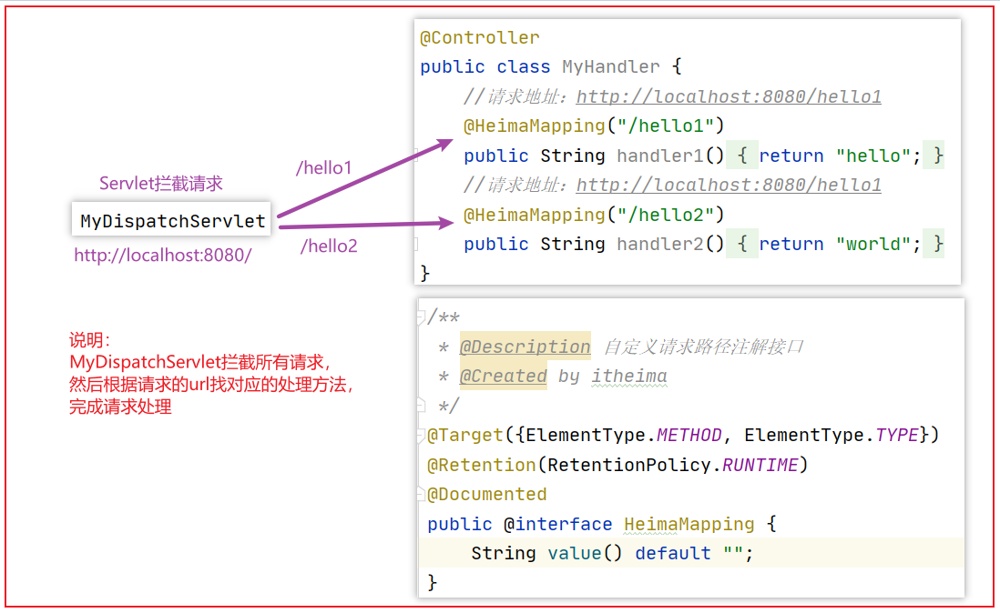

参考代码：资料/servlet_review工程

# 一、SpringMVC概述

## 01-MVC架构介绍

### 【1】MVC架构概述

```java
MVC(Model View Controller) 是一种软件设计范式。主要作用是将视图展示和业务控制代码分离开来。 
```

- Model（模型）
  - 数据模型，用于封装数据
- View（视图）
  - 页面视图，用于展示数据

  - jsp  ，html，json,xml等

- Controller（控制器）
  - 处理用户交互的调度器，用于根据用户需求处理程序逻辑
  - Servlet 、SpringMVC等

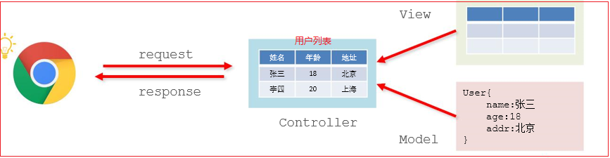

### 【2】MVC架构与三层架构存在什么关系？

我们可以这样理解：

	1.MVC把三层架构中的**web层再度进行了分化**，分成了控制器、视图、模型。 

	2.三层架构的目的是【解耦】，mvc的目的是实现web层系统的【职责划分】。 

MVC架构在三层架构中的位置图示：

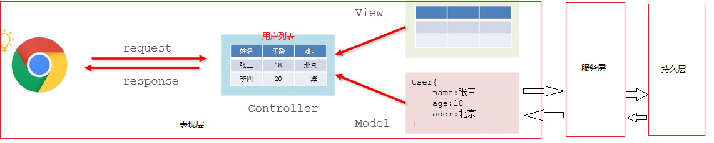

## 02-SpringMVC介绍

<span id="t1">Spring MVC</span>是构建在**Servlet**之，是基于**MVC设计理念**的优秀的Web框架，也是目前最主流的MVC框架之一；

开发人员可通过一个简单的**注解**就可以让一个普通的Java类成为控制器，这种**低侵入性的设计**使得他备受业界欢迎 ；

SpringMVC中实现MVC职责划分：

```java
M（模型）: 
	Model可以叫做数据模型层，说白了就是用来封装数据的
    例如：
    1.用户发送注册请求，那么请求的信息会被SpingMMVC封装到User实体类中，这个实体类就属于Model层；
    2.用户发送查询个人信息的请求，那么后台也会将个人信息封装到一个User类型，数据同样也属于Model层；

V（视图）: 
	View说白了就是SpringMVC响应请求的一种数据展示（最终的执行结果）：
    例如：SpringMVC响应的数据方式：JSP、json、xml、html等;

C（控制）: 
	控制层就用来处理交互的部分，接收用户请求，然后执行业务等流程，最终反馈结果；
    SpringMVC控制器,本质上就是一个Servlet,一切请求都访问这个Servlet,在这个Servlet中进行调度;
```

		总之，在SpringMVC中存在一个【核心的控制器】，这个servlet核心控制器会【根据请求url匹配基于注解的方法】，完成请求处理；

# 二、SpringMVC 入门【重点】

## 03-SpringMVC快速入门

### 【1】开发流程说明

实现的功能: 通过浏览器访问SpringMVC工程返回一个jsp页面;

开发核心步骤如下：

```tex
1)工程引入依赖，包含spring-webmvc.jar核心包,打包方式war；
2)在web.xml配置前端控制器DispatcherServlet；
	2.1）加载springmvc.xml配置文件（配置web相关的bean资源）；
	2.2）配置DispatcherServlet核心控制器拦截请求路径规则（一般是拦截所有请路径）；
3)配置springmvc.xml，加载web相关的bean资源；
	3.1）在springmvc.xml中开启注解扫描；
	3.2）在springmvc.xml中配置视图解析器；
4)定义处理类；
	4.1）编写处理器类，使用@Controller注解；
	4.2）在处理器方法之上使用@RequestMapping注解；
6)启动tomcat，访问资源；	
```

### 【2】代码实现

#### 【2.1】创建工程，引入坐标

**创建web项目，pom引入相关依赖，指定打包方式为war：**

```xml
<?xml version="1.0" encoding="UTF-8"?>
<project xmlns="http://maven.apache.org/POM/4.0.0"
         xmlns:xsi="http://www.w3.org/2001/XMLSchema-instance"
         xsi:schemaLocation="http://maven.apache.org/POM/4.0.0 http://maven.apache.org/xsd/maven-4.0.0.xsd">
    <modelVersion>4.0.0</modelVersion>

    <groupId>com.pp</groupId>
    <artifactId>day04_1_springmvc</artifactId>
    <version>1.0-SNAPSHOT</version>
    <packaging>war</packaging>
    <!-- 导入jar包依赖 -->
    <dependencies>
        <dependency>
            <groupId>org.springframework</groupId>
            <artifactId>spring-webmvc</artifactId>
            <version>5.0.2.RELEASE</version>
        </dependency>
        <dependency>
            <groupId>javax.servlet</groupId>
            <artifactId>javax.servlet-api</artifactId>
            <version>3.0.1</version>
            <!--容器域-->
            <scope>provided</scope>
        </dependency>
        <dependency>
            <groupId>javax.servlet</groupId>
            <artifactId>jsp-api</artifactId>
            <version>2.0</version>
            <scope>provided</scope>
        </dependency>
    </dependencies>
</project>
```

#### 【2.2】 配置核心调度器-DispatcherServlet

编写web.xml文件，并在web.xml文件中配置核心控制器：

```xml
<?xml version="1.0" encoding="UTF-8"?>
<web-app xmlns="http://java.sun.com/xml/ns/javaee"
           xmlns:xsi="http://www.w3.org/2001/XMLSchema-instance"
           xsi:schemaLocation="http://java.sun.com/xml/ns/javaee
		  http://java.sun.com/xml/ns/javaee/web-app_3_0.xsd"
           version="3.0">

    <!--配置SpringMvc核心控制器-->
    <servlet>
        <servlet-name>dispatcherServlet</servlet-name>
        <servlet-class>org.springframework.web.servlet.DispatcherServlet</servlet-class>
        <!--配置init初始化参数-->
        <init-param>
            <!--基于约定key必须叫contextConfigLocation-->
            <param-name>contextConfigLocation</param-name>
            <!--指定springmvc配置文件的路径-->
            <param-value>classpath:springmvc.xml</param-value>
        </init-param>
        <!--设置servlet加载优先级
            大于0的前提下，数值越小，优先级越高
        -->
        <load-on-startup>1</load-on-startup>
    </servlet>
    <!--配置映射规则-->
    <servlet-mapping>
        <servlet-name>dispatcherServlet</servlet-name>
        <!--拦截所有请求，但是不包含jsp结尾的请求url===》被内置JspServlet-->
        <url-pattern>/</url-pattern>
    </servlet-mapping>
</web-app>
```

#### 【2.3】 编写SpringMVC配置文件

springmvc.xml:

```xml
<?xml version="1.0" encoding="UTF-8"?>
<beans xmlns="http://www.springframework.org/schema/beans"
       xmlns:xsi="http://www.w3.org/2001/XMLSchema-instance"
       xmlns:context="http://www.springframework.org/schema/context" xmlns:tx="http://www.springframework.org/schema/tx"
       xmlns:aop="http://www.springframework.org/schema/aop"
       xsi:schemaLocation="http://www.springframework.org/schema/beans
        http://www.springframework.org/schema/beans/spring-beans.xsd
        http://www.springframework.org/schema/context
        http://www.springframework.org/schema/context/spring-context.xsd http://www.springframework.org/schema/tx http://www.springframework.org/schema/tx/spring-tx.xsd http://www.springframework.org/schema/aop http://www.springframework.org/schema/aop/spring-aop.xsd">

    <!--开启注解扫描-->
    <context:component-scan base-package="com.pp"/>
    <!--配置视图解析器:解析视图将逻辑视图转换成物理视图 hello==>/WEB-INF/pages/+hello+.jsp-->
    <bean class="org.springframework.web.servlet.view.InternalResourceViewResolver">
        <!--视图的前缀-->
        <property name="prefix" value="/WEB-INF/pages/"/>
        <!--视图资源的后缀-->
        <property name="suffix" value=".jsp"/>
    </bean>

</beans>
```

#### 【2.4】 编写业务处理器

```java
package com.pp.controller;

import org.springframework.stereotype.Controller;
import org.springframework.web.bind.annotation.RequestMapping;

/**
 * 编写处理器类
 */
@Controller
public class HelloController {
    /**
     * http:localhost:8080/hello===>直接访问当前注解作用的方法===》hello==》
     * 视图解析器解析 /WEB-INF/pages+hello+.jsp
     * @return
     */
    @RequestMapping("/hello")
    public String hi(){
        return "hello";
    }
}
```

#### 【2.5】 编写响应页面

在Webapp/pages/ 下定义hello.jsp 

**success.jsp响应页面**

```html
<%@ page contentType="text/html;charset=UTF-8" language="java" %>
<html>
    <head>
        <title>Title</title>
    </head>
    <body>
        <h1>hello springMvc</h1>
    </body>
</html>
```

### 【3】 Tomcat集成Maven插件

开发中直接使用tomcat会有繁琐的配置，我们可以使用maven支持的tomcat插件，提高开发效率；

直接在pom文件中添加tomcat插件：

```xml
<build>
    <plugins>
        <!-- tomcat7插件,运行命令： mvn tomcat7:run -DskipTests -->
        <!-- 配置Tomcat插件 -->
        <plugin>
            <groupId>org.apache.tomcat.maven</groupId>
            <artifactId>tomcat7-maven-plugin</artifactId>
            <version>2.2</version>
            <configuration>
                <uriEncoding>UTF-8</uriEncoding>
                <port>8080</port>
                <path>/</path>
            </configuration>
        </plugin>
    </plugins>
</build>
```

**运行方式1：**

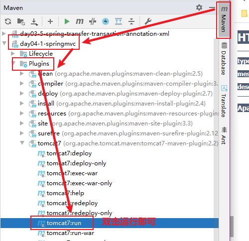

**运行方式2：**

直接配置成maven命令运行：

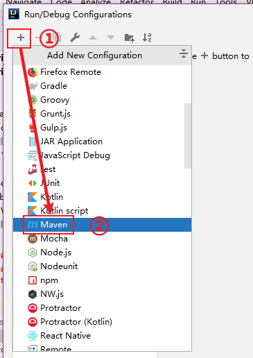

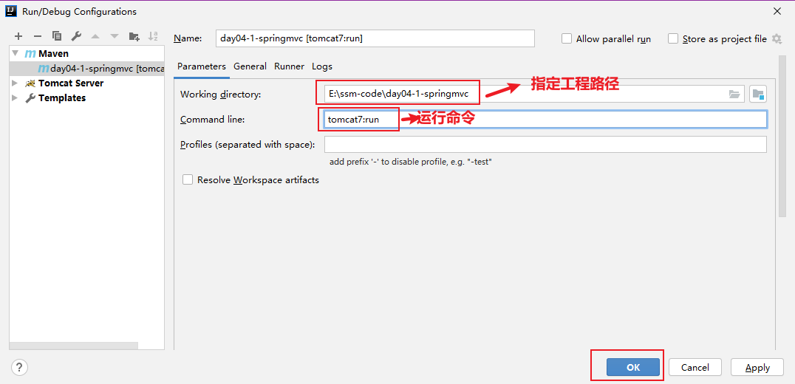

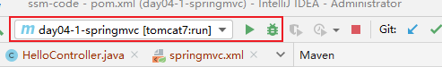

## 04-Spring开发流程总结

<span id="t2">步骤</span>如下：

```java
1)工程引入依赖，包含spring-webmvc.jar核心包,打包方式war；
2)在web.xml配置前端控制器DispatcherServlet；
	核心2件事：
	2.1）加载springmvc.xml配置文件（配置web相关bean的资源）；
	2.2）配置DispatcherServlet拦截请求路径规则（一般是拦截所有请路径）；
3)配置springmvc.xml，加载web相关的bean资源；
	核心2件事：
	3.1）在springmvc.xml中配置视图解析；
	3.2）在springmvc.xml中开启注解扫描；
    
4)编写处理器类
	4.1）编写处理器类，使用@Controller注解；
	4.2）在处理器方法之上使用@RequestMapping注解；
	举例：
	   @Controller
       public class HelloController{
           @RequestMapping("/hello")
           public String hi(){
               return "逻辑视图";
           }
       }  
6)启动tomcat，访问资源；
```

# 三、核心原理分析【能说】

## 05-SpringMVC启动与处理请求流程分析

### 【1】SpringMVC启动流程分析

		资源准备阶段：

		（1）工程打war包，部署到Tomcat中;

		（2）Tomcat启动，加载web.xml文件；

		（3）初始化前端控制器：dispatcherServlet；

		（4）前端控制器dispatcherServlet根据**contextConfigLocation**获取springmvc.xml配置资源；

		（5）前端控制器根据spring-mvc.xml配置完成Spring IOC容器的初始化；

			时序图：

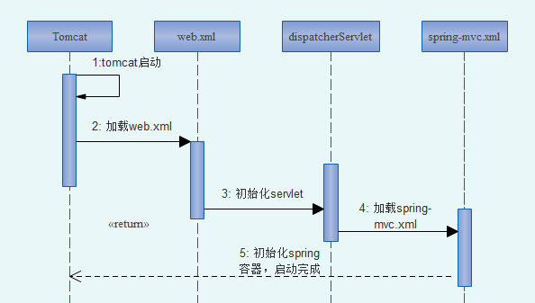

### 【2】SpringMVC处理请求流程

（1）浏览器发起 http://localhost:8080/hello 请求

（2）Tomcat调用DispatcherServlet拦截/hello

（3）DispatcherServlet调用一个<font color='red'>处理器</font>，根据请求路径[/hello]找到对应的<font color='red'>处理方法</font>		

```properties
说明：
1）标红部分的处理方法是指被@RequestMapping注释过的方法；
2）标红的处理器称为：【处理器映射器】，处理浏览器请求，根据路径映射到指定方法下；
eg:/hello----->com.heima.controller.HelloController#hello()
```

（4）DispatcherServlet找到方法后，会调用另外一种<font color='red'>处理器</font>，执行HelloController中的hello()方法

```properties
标红的处理器称为：【处理器适配器】，作用如下：
	1.适配处理器handler类型（在这里对应的处理器是hello()方法）；
	2.处理入参，把对应的参数直接封装为一个实体；
```

（5）HelloController中的hello()方法返回【view视图信息】；

```properties
视图可以是由字符串组成的逻辑视图，也可以封装到View或者ModelAndView对象，甚至是异步响应的VO对象；
```

（6）dispatcherServlet调用【视图解析器】，组装视图响应对象，然后把页面返回给浏览器；

```properties
视图解析器：将逻辑视图转换成物理视图，返回给核心调度器DispatcherServlet；
```

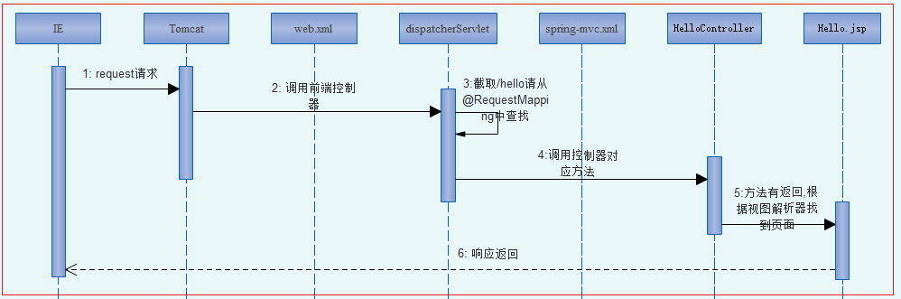

小结：

```tex
启动流程：
1）工程打war包，部署到tomcat下；
2）tomcat一启动，加载工程下的web.xml文件；
3）实例化核心调度器dispatcherServlet，然后tomcat会回调servlet的init方法，获取Spirngmvc.xml文件资源路径；
4）根据springmvc.xml文件资源路径，初始化IOC容器；
访问阶段：
1）浏览器发起请求：htttp://localhost:8080/hello;
2)tomcat接收请求，并调用核心调度器dispatcherServlet处理请求
3）核心调度器dispatcherServlet截取/hello请求路径url，然后根据路径找对应的@RequestMapping("/hello")注解下的方法【有个对象专门根据url找对应的处理器方法===》处理器映射器】，结果返回给核心调度器dispatcherServlet；
4）核心调度器dispatcherServlet在调用另外一种处理器，指定步骤3返回的方法，获取结果【处理器适配器】，返回给核心调度器dispatcherServlet；
4）核心调度器dispatcherServlet根据返回的逻辑视图调用视图解析器，将逻辑视图转换成物理事务，然后将视图结果返回给核心调度器dispatcherServlet；
5）核心调度器dispatcherServlet根据物理视图路径找视图资源，渲染返回给浏览器；
```

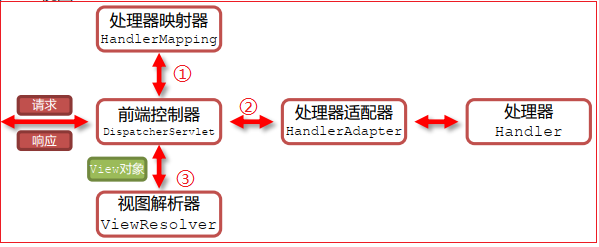

## 06-SpringMVC核心组件执行流程

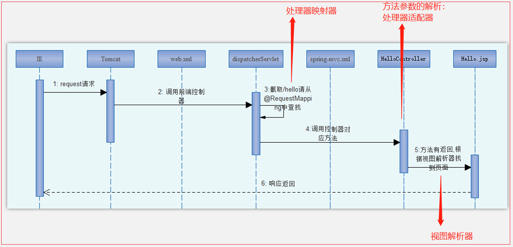

【1】SpringMVC相关名词解释

- 前端控制器：DispatcherServlet 是整体流程控制的中心，由其调用其它组件处理用户的请求， 有
  效的降低了组件间的耦合性；【前端控制器、核心控制器、核心调度器、中心调度器】

- 处理器：handler,业务处理的核心类，通常由我们自己编写,比如：HelloController类等；

- **处理器映射器**：负责根据URL请求找到对应的Handler处理器(就是根据请求URL与Controller下方法的关系)
- **处理器适配器**：将请求参数解析转换成处理器的入参，并调用处理器执行的组件； 
- **视图解析器**：将处理器执行的结果生成View视图（将逻辑视图转换成物理视图）；
- 视图：View，最终产出结果， 常用视图如：jsp、 html  、json等；


【2】<span id="t5">服务器启动流程</span>

```java
1.当服务器启动时,加载web.xml文件
2.初始化核心控制器：DispatcherServlet 
  底层执行init(ServletConfig sc)-->getServletConfig()-->contextConfigLocation-->初始化IOC容器
3.在核心控制器初始化方法中(initStrategies:初始化策略),完成组件的加载 9
    处理器映射器:HandlerMapping 2
    	建立绑定路径与方法全限定名的对应关系
    处理器适配器:HandlerAdapter 3
    	适配处理器的实现方式,调用指定的类反射执行处理器方法
    视图解析器:ViewResolver 1
        根据逻辑视图生成对应的物理视图,并将物理视图返回
```

【3】<span id="t6">执行请求流程</span>

```java
1.浏览器发起请求给服务器；
2.DispatcherServlet拦截来自浏览器的请求;
3.DispatcherServlet调用【处理器映射器】,根据请求路径找到对应的【方法全限定名】,并返回给核心控制器;
4.DispatcherServlet核心控制器调用【处理器适配器】，通过反射执行方法，将执行结果(逻辑视图)返还给核心控制器;
5.DispatcherServlet核心控制器调用【视图解析器】,根据逻辑视图找到对应的物理视图,并返回给核心控制器;
6.DispatcherServlet核心控制器获取视图资源，响应浏览器;
```

## 07-SpringMVC核心组件介绍

在SpringMVC的运行流程中我们可以发现DispatcherServlet负责整体调度工作，而实际工作的是三大组件: 

### 【1】HandlerMapping 【处理器映射器】

```java
作用: 根据请求路径找到对应的方法(处理器)
	在服务器启动,SpringMVC的配置文件加载时,会扫描指定的包,当扫描到@RequestMapping注解时,会建立请求路径与当前方法(处理器)的对应关系 2
    
处理器: Handler
    指的就是我们自己编写的java代码(web层的Controller)
```

### 【2】HandlerAdapter【处理器适配器】


	**①在SpringMVC中定义handler处理器的方式有3种：**

```tex
方式1: 自定义一个类,实现Controller接口,重写handleRequest方法【了解】
	对应适配器：SimpleControllerHandlerAdapter
方式2: 自定义一个类,实现HttpRequestHandler接口,重写handleRequest方法【了解】
	对应适配器：HttpRequestHandlerAdapter
方式3: 自定义一个类,在方法上添加@RequestMapping注解【掌握】
	对应适配器:RequestMappingHandlerAdapter
```

		说明：SpringMVC底层会根据处理器实现方式来匹配各自的适配器，伪代码如下：

```java
if(处理器实现了 Controller接口){
    // 调用处理接口类的处理器适配器执行-SimpleControllerHandlerAdapter
}else if(处理器实现了 HttpRequestHandler接口){
    // 调用处理接口类的处理器适配器执行-HttpRequestHandlerAdapter
}else if(处理器类上面有注解){
    // 调用处理注解的处理器适配器执行-RequestMappingHandlerAdapter
}
```

		**②实现Handler处理器的方式有3中，在这以实现Controller接口为实现处理器：**

```java
package com.pp.controller;

import org.springframework.web.servlet.ModelAndView;
import org.springframework.web.servlet.mvc.Controller;
import javax.servlet.http.HttpServletRequest;
import javax.servlet.http.HttpServletResponse;

/**
 * 定义其他类型实现的handler
 *   1.实现Controller接口
 *   2.实现HttpRequestHandler接口
 */
public class OtherTypeController  implements Controller {
    @Override
    public ModelAndView handleRequest(HttpServletRequest request, HttpServletResponse response) throws Exception {
        ModelAndView mv = new ModelAndView();
        mv.setViewName("/hello");
        return mv;
    }
}
```

	springmvc.xml配置：

```xml
    <!--
       [了解即可]
       bean的名称就是对应的访问的url地址
       eg:访问：http://localhost:8080/hello2
    -->
    <bean id="/hello2" class="com.pp.controller.OtherTypeController"/>
```

### 【3】ViewResolver(视图解析器)

```java
作用: 根据逻辑视图匹配到物理的视图,并将物理视图返回给总控制器(核心控制)(根据返回的视图名称,找到具体的视图位置);
```

      视图解析器核心配置如下：

```xml
<!-- 配置视图的前后缀 -->
<bean id="viewResolver" class="org.springframework.web.servlet.view.InternalResourceViewResolver"> 
    <!--前缀--> 
    <property name="prefix" value="/pages/" /> 
    <!--后缀--> 
    <property name="suffix" value=".jsp" /> 
</bean>
```

```java
@RequestMapping("/hello") 
public String hello(){ 
    System.out.println("Hello world"); 
    return "success"; 
}
```

在InteralResourceViewResourcer类下buildView方法打断点，发现传入的物理视图转换成逻辑视图，响应给核心控制器：

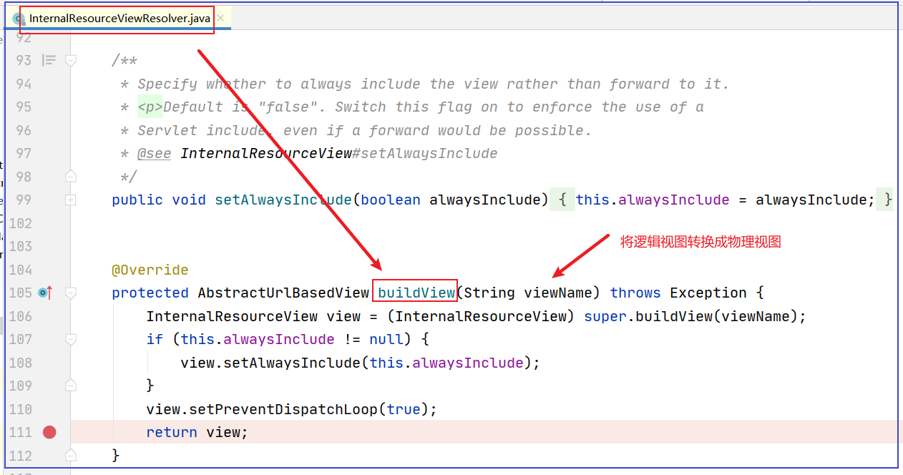

### 【4】核心调度器注册3大组件源码分析

DispatcherServlet提供了SpringMVC 三大组件的初始化策略：

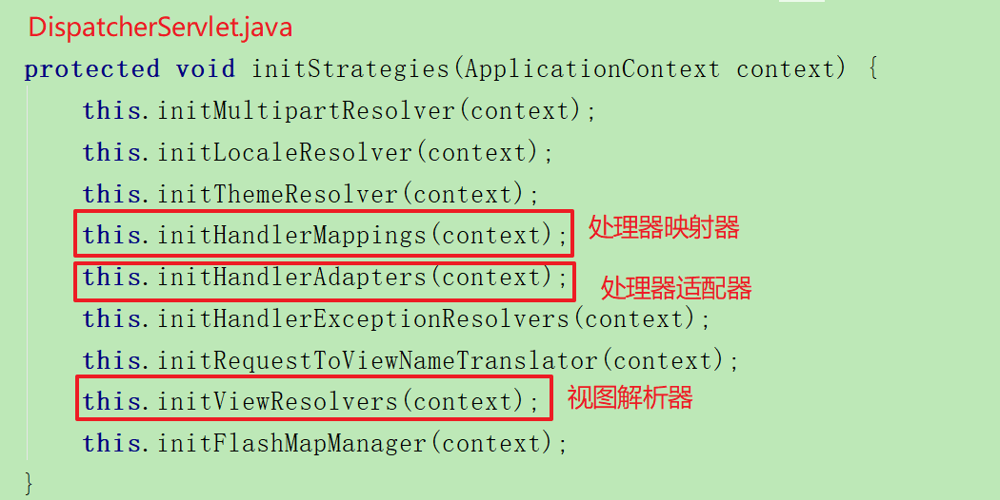

## 回顾上午知识点

【1】SpringMVC启动流程分析？

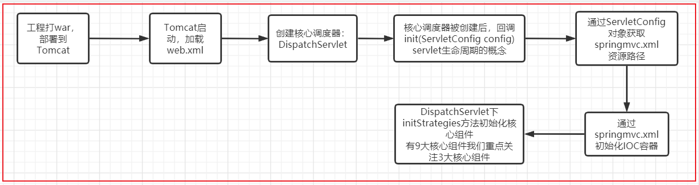

【2】SpringMVC工程访问流程？

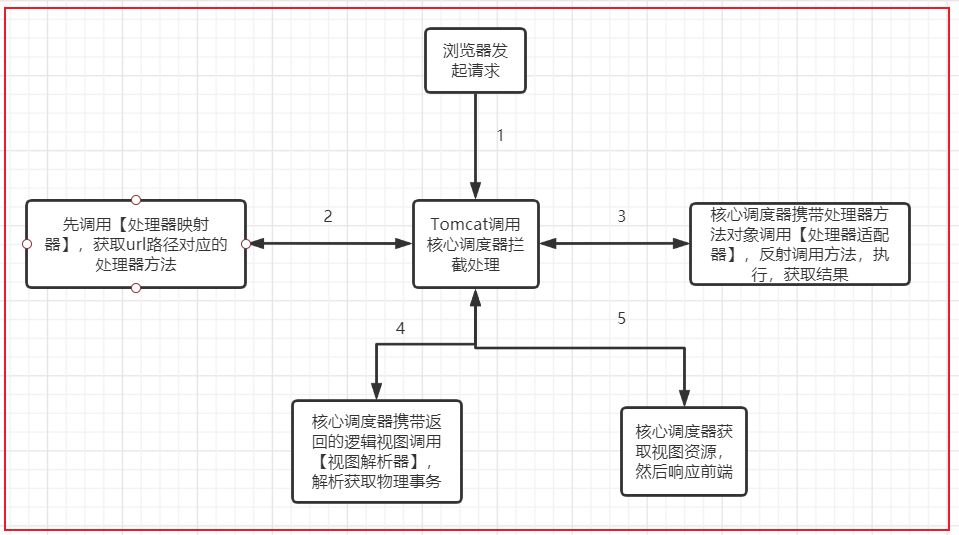

【3】为什么SpringMVC在 执行方法时，引入适配器的概念？

			因为处理器的**实现有3种方式**，不能的实现方式，被执行时的方式是不一样的，所以引入适配器；

# 四、注解@RequestMapping详解

```java
结合Http请求方式的组合注解：
@GetMapping()  : 只能处理get请求
@PostMapping() : 只能处理post请求
@PutMapping() : 只能处理put请求
@DeleteMapping() :只能处理delete请求
```

## 08-SpringMVC请求路径的编写方式

SpringMVC常用路径编写方式如下：

```tex
1)方式1：完全路径方式  举例：/user/add 【主流写法】
2)方式2：目录匹配方式  举例：/user/*
3)方式3：后缀匹配方式  举例：/user/*.do
```

<div>示例代码:</div>

```java
package com.pp.controller;

import org.springframework.stereotype.Controller;
import org.springframework.web.bind.annotation.RequestMapping;

/**
 * 测试不同路径的书写方式
 */
@Controller
@RequestMapping("/user")//请求路径写在类之上，起到窄化路径的作用
public class PathTypeController {

    /**
     * 路径越精准，优先级越高【开发主流】
     * 说明：
     * 请求路径：http://localhost:8080/user/path1
     * 或者路径以http://localhost:8080/user/path1.* 开头的，都可以访问
     * @return
     */
	//@RequestMapping("/user/path1")
    @RequestMapping("/path1")
    public String path1(){
        return "path1";
    }

    /**
     * http://localhost:8080/user/aa
     * @return
     */
	//@RequestMapping("/user/*")
    @RequestMapping("/*")
    public String path2(){
        return "path2";
    }

    /**
     * http://localhost:8080/user/aa.do
     * @return
     */
	//@RequestMapping("/user/*.do")
    @RequestMapping("/*.do")
    public String path3(){
        return "path3";
    }
}
```

## 09-注解@RequestMapping常用属性

### 【1】注解作用 

@RequestMapping 注解用于建立请求路径与方法的对应关系;

```java
编写位置:
	类上:
		窄化类,访问此类中的方法时,必须加上类上的路径
	方法:
		建立绑定路径与方法的对应关系
```

```java
/**
 * 测试不同路径的书写方式
 */
@Controller
@RequestMapping("/user")//请求路径写在类之上，起到窄化路径的作用
public class PathTypeController {

    /**
     * 路径越精准，优先级越高【开发主流】
     * 说明：路径以http://localhost:8080/user/path1.* 开头的，都被访问
     * @return
     */
	//@RequestMapping("/user/path1")
    @RequestMapping("/path1")
    public String path1(){
        return "path1";
    }
    //......
}       
```

### 【2】注解@RequestMapping <span id="t8">常用属性 </span>

| 属性名称   | 作用                                                  |
| ---------- | ----------------------------------------------------- |
| value/path | 限定访问当前接口的url路径，可指定单个或者多个请求路径 |
| method     | 限定http的请求方式，可指定单个或者多个请求方式        |
| params     | 限定请求必须携带参数，可指定单个或者多个请求参数      |
| headers    | 限定请求头必须携带参数，可指定单个或者多个请求头信息  |

说明：

```java
以上属性都是数组类型，可以指定单个或者多个参数；
以上的属性可以单独使用，也可以组合使用，组合使用时，必须同时满足才行。
```

### 【3】示例代码:

```java
package com.pp.controller;

import org.springframework.stereotype.Controller;
import org.springframework.web.bind.annotation.RequestMapping;
import org.springframework.web.bind.annotation.RequestMethod;

/**
 * 测试@RequestMapping注解属性
 */
@Controller
public class RequestMappingAttributeController {

    /**
     * 定义多路径访问相同的handler方法
     * http:localhost:8080/attri1
     * http:localhost:8080/attri2
     * path等价于value，可以指定一个或者多个请求路径url
     * @return
     */
    @RequestMapping(value={"/attri1","/attri2"})
    public String path4(){
        return "path1";
    }

    /**
     * method属性指定当前的方法只能被get或者delte请求方式访问，其他报错：
     * Request method 'POST' not supported
     * @return
     */
    @RequestMapping(value = "/method",method = {RequestMethod.GET,RequestMethod.DELETE})
    public String path5(){
        return "path1";
    }

    /**
     * 实现需求：请求中必须携带name和age属性，否则访问拒绝
     * 错误示例：
     * http://localhost:8080/params?name=laofang
     * 错误信息：Parameter conditions "name, age" not met for actual request parameters: name={laofang}
     * params属性特点：
     *  必须请求参数包含指定的参数名称；
     * @return
     */
    @RequestMapping(value = "/params",params = {"name","age"})
    public String path6(){
        return "path2";
    }

    /**
     * headers属性指定当前请求头中必须携带指定的参数，否则报错
     * @return
     */
    @RequestMapping(value = "/headers",headers ={"token","name"} )
    public String path7(){
        return "path2";
    }
}
```

		可使用IDEA自带的HttpClient测试Http 请求POST、PUT、DELETE方式：

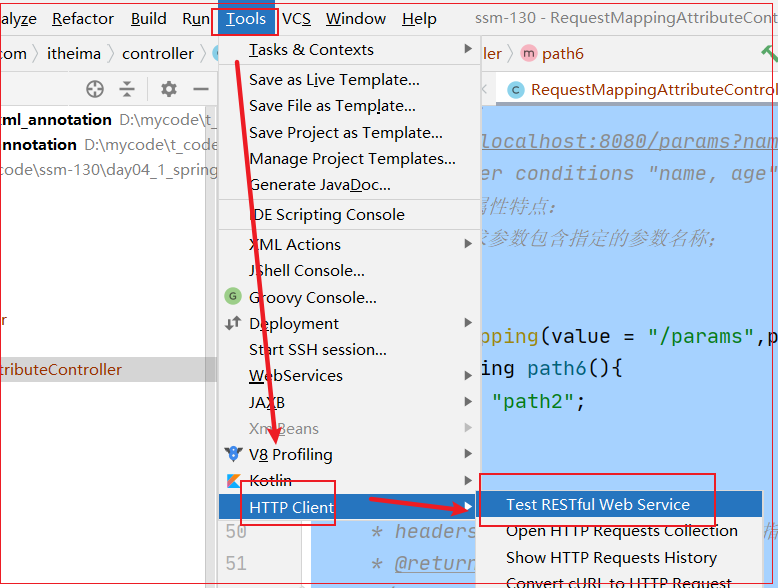

举例：

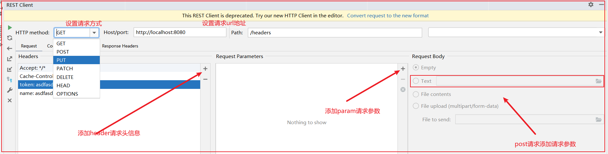

# 五、获取请求参数

SpringMVC支持的参数类型有：

```java
1.基本数据类型和string
2.vo类型(View object,浏览器携带的所有数据封装成的对象叫做vo) 
3.复杂类型：    
	3.数组类型 
	4.集合类型 
说明：如果请求中携带这些类型的数据,SpringMVC会自动帮我们接收,并传递给方法进行使用【方法上的形参名称要和请求参数名称保持一致】；
```

## 10-SpringMVC获取基本类型和String请求参数

约定：只需要保证前端传递的参数名称跟方法的形参名称一致即可；

SpringMVC接收的参数**默认都是String类型**的，它内部会进行一个自动转型。

```java
package com.pp.web;

import org.springframework.stereotype.Controller;
import org.springframework.web.bind.annotation.RequestMapping;
import javax.servlet.http.HttpServletRequest;
import javax.servlet.http.HttpSession;

@Controller
@RequestMapping("params")
public class Demo4Controller {
    /**
     * SpringMVC获取请求携带的参数
     */
    /**
     * 原生API: 使用Servlet提供的Request对象
     * 该对象直接在方法中传入即可
     */
    @RequestMapping("test01")
    public String test01(HttpServletRequest request){
        // 获取请求参数
        String username = request.getParameter("username");
        String age = request.getParameter("age");
        System.out.println(username+" : "+age);
        return "success";
    }

    /**
     * 获取基本类型或String类型数据
     *      方法上形参名称必须和请求携带的参数名称保持一致
     * @return
     */
    @RequestMapping("test02")
    public String test02(String username,Integer age){
        System.out.println(username+" : "+age);
        return "success";
    }
}
```

对应测试页面（也可使用测试工具PostMan或者HttpClient）：

```html
<form action="/params/test01" method="get">
        用户名: <input type="text" name="username" value="大幂幂"> <br>
        年龄: <input type="text" name="age" value="18"> <br>
        <input type="submit" value="携带基本类型和String类型的数据">
</form>
<form action="/params/test02" method="get">
    用户名: <input type="text" name="username" value="大幂幂"> <br>
    年龄: <input type="text" name="age" value="18"> <br>
    <input type="submit" value="携带基本类型和String类型的数据">
</form>
```

## 11-SpringMVC获取VO类型参数

VO(View Object) 简单的java对象,用于封装请求携带的数据；

只需要保证前端传递的参数名称跟VO中的属性名称（set方法）一致即可；

```java
 /**
     * 获取请求携带的参数,将请求携带的参数封装到vo对象中
     *      vo对象: value object
     *          一个普通的java类对象
     *      规则:
     *          请求参数的名称必须和对象中的属性名保持一致
     * @return
     */
    @RequestMapping("test03")
    public String test03(UserVo userVo){
        System.out.println(userVo);
        return "success";
    }
```

```java
package com.pp.vo;

public class UserVo {
    private String username;
    private Integer age;
    //getter and setter and toString
}
```

```html
<form action="/params/test03" method="get">
        用户名: <input type="text" name="username" value="大幂幂"> <br>
        年龄: <input type="text" name="age" value="18"> <br>
        <input type="submit" value="请求参数封装到VO对象中">
</form>
```

## 12-SpringMVC获取复杂类型数据

### 12-1-SpringMVC获取数组类型入参

	  只需要保证前端传递的参数名称跟方法中的数组形参名称一致就好。 

```html
 <form action="/params/test04" method="get">
        用户名: <input type="text" name="username" value="大幂幂"> <br>
        年龄: <input type="text" name="age" value="18"> <br>
        爱好: <input type="checkbox" name="hobbys" value="smoke"> 抽烟
        <input type="checkbox" name="hobbys" value="drink"> 喝酒
        <input type="checkbox" name="hobbys" value="makehair"> 烫头 <br>
        <input type="submit" value="请求参数封装到数组中">
 </form>
```

		后端代码实现：

```java
 	/**
     * 获取请求携带的多个值,封装到数组中
     * @param hobbys
     * @return
     */
    @RequestMapping("test04")
    public String test03(String[] hobbys,String username,Integer age){
        System.out.println(username+" : "+age);
        System.out.println(Arrays.toString(hobbys));
        return "success";
    }
```

### 12-2-SpringMVC获取集合类型入参

获取集合参数时，要将集合参数包装到一个Vo中才可以；

VO解释: value Object 或 view Object 封装来自浏览器携带的数据

【1】定义VO类

```java
package com.pp.vo;

import java.util.List;
import java.util.Map;

public class Vo {
    private List<String> names;
    private List<UserVo> userList;
    private Map<String,String> maps;
    //getter and setter and toString
}
```

【2】定义访问接口处理方法

```java
 /**
     * 将请求携带的参数封装到对象的集合中
     * @param vo
     * @return
     */
    @RequestMapping("test05")
    public String test05(Vo vo){
        System.out.println(vo);
        return "success";
    }
```

【3】定义前端测试代码

```html
<form action="/params/test05" method="get">
    用户名:
    <input type="text" name="names[0]" value="tom"><br>
    <input type="text" name="names[1]" value="肉丝"><br>
    <input type="text" name="names[2]" value="jack"><br>
    <hr>
    用户:
    <input type="text" name="userList[0].username" value="tom">
    <input type="text" name="userList[0].age" value="18"><br>
    <input type="text" name="userList[1].username" value="肉丝">
    <input type="text" name="userList[1].age" value="21"><br>
    <hr>
    <input type="text" name="maps['name']" value="汤姆"> <br>
    <input type="text" name="maps['age']" value="18"> <br>
    <input type="submit" value="请求参数封装到数组中">
</form>
```

### 课堂核心测试代码：

```java
package com.pp.web;

import com.pp.vo.UserVo;
import com.pp.vo.Vo;
import org.springframework.stereotype.Controller;
import org.springframework.web.bind.annotation.RequestMapping;
import javax.servlet.http.HttpServletRequest;
import javax.servlet.http.HttpSession;
import java.util.Arrays;

@Controller
@RequestMapping("params")
public class Demo4Controller {
    /**
     * SpringMVC获取请求携带的参数
     */
    /**
     * 原生API: 使用Servlet提供的Request对象
     * 该对象直接在方法中传入即可
     */
    @RequestMapping("test01")
    public String test01(HttpServletRequest request){
        // 获取请求参数
        String username = request.getParameter("username");
        String age = request.getParameter("age");
        System.out.println(username+" : "+age);
        return "success";
    }

    /**
     * 获取基本类型或String类型数据
     *      方法上形参名称必须和请求携带的参数名称保持一致
     * @return
     */
    @RequestMapping("test02")
    public String test02(String username,Integer age){
        System.out.println(username+" : "+age);
        return "success";
    }

    /**
     * 获取请求携带的参数,将请求携带的参数封装到vo对象中
     *      vo对象: value object
     *          一个普通的java类对象
     *      规则:
     *          请求参数的名称必须和对象中的属性名保持一致
     * @return
     */
    @RequestMapping("test03")
    public String test03(UserVo userVo){
        System.out.println(userVo);
        return "success";
    }

    /**
     * 获取请求携带的多个值,封装到数组中
     * @param hobbys
     * @return
     */
    @RequestMapping("test04")
    public String test04(String[] hobbys,String username,Integer age){
        System.out.println(username+" : "+age);
        System.out.println(Arrays.toString(hobbys));
        return "success";
    }

    /**
     * 将请求携带的参数封装到对象的集合中
     * @param vo
     * @return
     */
    @RequestMapping("test05")
    public String test05(Vo vo){
        System.out.println(vo);
        return "success";
    }
}
```

页面:

```html
<%@ page contentType="text/html;charset=UTF-8" language="java" %>
<html>
<head>
    <title>Title</title>
</head>
<body>
    <h2>请求参数</h2>
    <form action="/params/test01" method="get">
        用户名: <input type="text" name="username" value="大幂幂"> <br>
        年龄: <input type="text" name="age" value="18"> <br>
        <input type="submit" value="携带基本类型和String类型的数据">
    </form>
    <form action="/params/test02" method="get">
        用户名: <input type="text" name="username" value="大幂幂"> <br>
        年龄: <input type="text" name="age" value="18"> <br>
        <input type="submit" value="携带基本类型和String类型的数据">
    </form>
    <form action="/params/test03" method="get">
        用户名: <input type="text" name="username" value="大幂幂"> <br>
        年龄: <input type="text" name="age" value="18"> <br>
        <input type="submit" value="请求参数封装到VO对象中">
    </form>
    <form action="/params/test04" method="get">
        用户名: <input type="text" name="username" value="大幂幂"> <br>
        年龄: <input type="text" name="age" value="18"> <br>
        爱好: <input type="checkbox" name="hobbys" value="smoke"> 抽烟
        <input type="checkbox" name="hobbys" value="drink"> 喝酒
        <input type="checkbox" name="hobbys" value="makehair"> 烫头 <br>
        <input type="submit" value="请求参数封装到数组中">
    </form>

    <form action="/params/test05" method="get">
        用户名:
        <input type="text" name="names[0]" value="tom"><br>
        <input type="text" name="names[1]" value="肉丝"><br>
        <input type="text" name="names[2]" value="jack"><br>
        <hr>
        用户:
        <input type="text" name="userList[0].username" value="tom">
        <input type="text" name="userList[0].age" value="18"><br>
        <input type="text" name="userList[1].username" value="肉丝">
        <input type="text" name="userList[1].age" value="21"><br>
        <hr>
        <input type="text" name="maps['name']" value="汤姆"> <br>
        <input type="text" name="maps['age']" value="18"> <br>
        <input type="submit" value="请求参数封装到数组中">
    </form>
</body>
</html>
```

##  13-SpringMVC特殊情况处理

### 13-1-SpirngMVC处理日期数据

	如果请求携带的参数为日期类型,SpringMVC没有提供相关的转换器,哪该如何处理呢?

```java
1.我们可以使用SpringMVC提供的注解进行日期格式化操作.@DateTimeFormat(pattern = "yyyy-MM-dd")；
2.该注解可以作用在方法的入参上，也可写在类的成员属性上；
```

	说明：要使用@DateTimeFormat注解，那么springmvc.xml中必须要开启springmvc注解驱动： 

```xml
<!--SpringMVC扩展功能：
        1.日期类型转换
        2.自定义类型转换
        3.@RequestBody + @ResponseBody
        4.格式校验等；
    -->
<mvc:annotation-driven/> 
```

实现代码：

#### 【1】注解@DateTimeFormat作用在处理器方法入参之上

```java
/**
 * 处理日期问题
 */
@Controller
public class SpecialController {

    /**
     * url:http://localhost:8080/date?birthday=2021-07-01
     * 错误信息：
     * HTTP Status 500 - Failed to convert value of type 'java.lang.String' to
     * required type 'java.util.Date';
     * 使用@DateTimeFormat注解作用在入参上，实现String转Date类型转换；
     * springMVC内置了很多基本类型转换的转换器，但是未给Date提供相关的转换类
     * @param birthday
     * @return
     */
    @RequestMapping("/date")
    public String getBirthday(@DateTimeFormat(pattern = "yyyy-MM-dd") Date birthday){
        System.out.println(birthday);
        return "path2";
    }
}    
```

#### 【2】注解@DateTimeFormat注解作用在VO类型器入参上

vo注解示例：

```java
public class User {
    private Integer id;
    private String name;
    private String address;
    @DateTimeFormat(pattern = "yyyy-MM-dd")
    private Date birthday;
    //setter getter toString
}    
```

处理器示例：

```java
    /**
     * 如果接收日期格式字符串转Date并封装到VO下，那么vo下的对象属性上添加@DateTimeFormat即可
     * @param user
     * @return
     */
    @RequestMapping("/voDate")
    public String getUser(User user){
        System.out.println(user);
        return "path2";
    }
```

### 13-2-SpringMVC编码过滤器

		如果请求携带了中文有乱码该怎么办呢?
    	我们在web阶段自己编写过编码过滤器,在SpringMVC中已经提供好了编码过滤器,我们直接使用即可;

```xml
<!-- 在web.xml中配置springMVC编码过滤器 -->  
<filter>  
    <filter-name>CharacterEncodingFilter</filter-name>  
    <filter-class>
        org.springframework.web.filter.CharacterEncodingFilter
    </filter-class>  
    <!-- 设置过滤器中的属性值 -->  
    <init-param>  
        <param-name>encoding</param-name>  
        <param-value>UTF-8</param-value>  
    </init-param>
    <!--强制响应数据utf-8编码处理-->
    <init-param>
        <param-name>forceResponseEncoding</param-name>
        <param-value>true</param-value>
    </init-param>
</filter>  
<!-- 过滤所有请求 -->  
<filter-mapping>  
    <filter-name>CharacterEncodingFilter</filter-name>  
    <url-pattern>/*</url-pattern>  
</filter-mapping>
```

### 13-3-SpirngMVC请求参数与形参不一致的处理

		开发中如果前端传入的请求参数名称与处理器方法的形参名称不一致，则可以使用**@RequestParam**注解实现映射：

```java
它支持三个属性: 
	value：默认属性，用于指定前端传入的参数名称；
	required：用于指定此参数是否必传，如果为true，则必须传递，否则抛异常； 
	defaultValue：当参数为非必传参数且前端没有传入参数时，指定一个默认值【配置required=false使用】；
```

处理器测试方法：

```java
    /**
     * 测试请求参数与方法形参不一致的情况
     * http://localhost:8080/diff?userName=zhangsan&userAge=20
     * 需求：将上述请求参数正常注入方法
     * 解决方式：
     *  @RequestParam指定请求参数名称
     *      内部属性：
     *          value/name:指定请求参数名称
     *          required：默认值是true,表示必须传入值，否则报错：Required String parameter 'userAge' is not present
     *                   设置为false，不传入，不报错,
     *          defaultValue：设置默认值，开发一般配合required=false一块使用，如果不传入值，则使用默认值         
     *
     * @param name
     * @param age
     * @return
     */
    @RequestMapping("/diff")
    public String diff(
         @RequestParam("userName") String   name,
         @RequestParam(value = "userAge",required = false,defaultValue = "20")   String age{
        System.out.println(name+"---"+age);
        return "path3";
}
```

### 13-4-SpringMVC获取请求头和cookie下的数据

#### 【1】获取请求头信息

使用注解@RequestHeader指定请求头中对应的key信息；

**作用:** 主要用于从请求头中获取参数。它支持的属性跟@RequestParam一样。

```java
    /**
     * 获取请求头的信息
     * 代码说明：
     * 获取请求头中名称为token的key对应的value，然后赋值给token方法的入参
     * @param token
     * @return
     */
    @RequestMapping("/getHeaderData")
    public String getHeaderData(@RequestHeader("token") String token){
        System.out.println(token);
        return "path1";
    }
```

#### 【2】获取cookie信息

@CookieValue

**作用:** 用于从cookie中取值。

```java
    /**
     * 获取cookie中key对应的value值，并赋值给方法的入参
     * @param sessionId
     * @return
     */
    @RequestMapping("/getCookieData")
    public String getCookieData(@CookieValue("JSESSIONID") String sessionId){
        System.out.println(sessionId);
        return "path2";
    }
```

### 13-5-SpringMVC特殊情况处理小结

| 特殊情况                     | 解决方式                                                     |
| ---------------------------- | ------------------------------------------------------------ |
| 日期格式字符串转日期对象     | 使用@DateTimeFormat(pattern="yyyy-MM-dd")<br>可作用于方法的入参或者VO对象的属性之上；<br>前提：开启Springmvc扩展功能：\<mvc:annotation-driven/> |
| 乱码处理                     | 配置乱码过滤器：Springmvc提供的==>CharacterEncodingFilter    |
| 请求参数与方法入参不一致情况 | 使用@RequestParam注解指定请求参数的名称，注解作用在那个入参上，那么对应的请求参数值就给那个形参赋值；<br>value：指定请求参数的名称<br>required:<br>         true:默认值，必须传入，否则报错<br>          false:不传入，不操作<br> defaultValue:指定默认值，如果不传入，则使用默认值，如果传入，则不使用默认值； |
| 如何获取请求头或者cookie中值 | 获取请求头中数据：@RequestHeader("key")<br> 获取请求中cookie值：@CookieValue("key") |


# 六、自定义类型转换器(了解)

## 14-自定义类型转换器(了解)

【1】SpringMVC类型转换器介绍

	类型转换器，顾名思义就是做类型转换的，因为SpringMVC接收到的请求参数都是【字符串】， 而在参数封装的时候什么类型都有，所以需要类型转换。 

	SpringMVC已经内置了常用的类型转换器，比如String转int的类型转换器。但是对于一些格式不明确的字符串就不好实现，比如时间类型，这就需要我们自定义类型转换器。 

【2】代码实现SpringMVC类型转换器

	以时间为例，自定义类型转换器的步骤: 

**1）.自定义一个转换器类实现Converter< 源类型, 目标类型>接口，并实现它的T convert(S s)方法，实现转换功能。 **

```java
package com.pp.convert;

import org.springframework.core.convert.converter.Converter;
import java.text.ParseException;
import java.text.SimpleDateFormat;
import java.util.Date;

/**
 * 功能：将日期格式的字符串转日期对象
 * 说明：
 * Converter<String, Date>
 *      泛型中第一个表示源数据类型
 *      泛型中第二个类型：要转换成什么类型
 */
public class MyDateConvert implements Converter<String, Date> {
    @Override
    public Date convert(String strDate) {
        SimpleDateFormat dateFormat = new SimpleDateFormat("yyyy-MM-dd");
        Date date = null;
        try {
            date = dateFormat.parse(strDate);
        } catch (ParseException e) {
            e.printStackTrace();
        }
        return date;
    }
}
```

**2）.在配置文件中将自定义的的转换器交给ConversionServiceFactoryBean来管理 **

```xml
<!--配置格式转换工厂-->
<bean id="conversionServiceFactoryBean" class="org.springframework.context.support.ConversionServiceFactoryBean">
    <property name="converters">
        <set>
            <bean class="com.pp.convert.MyDateConvert"/>
        </set>
    </property>
</bean>
```

**3）.将ConversionServiceFactoryBean托管给注解启动annotation-driven**

```xml 
    <!--SpringMVC扩展功能：
        1.日期类型转换
        2.自定义类型转换
        3.@RequestBody + @ResponseBody
        4.格式校验
        开启mvc扩展功能
    -->
    <mvc:annotation-driven conversion-service="conversionServiceFactoryBean"/>
```

**4）.测试**

```java
    /**
     * 使用自定义的格式转换器将日期类型的字符串转日期对象
     * 如果有String==>Date，spring底层自动找该格式的转换器，如果有，则调用convert方法进行转换，无，则报错
     * @param birthday
     * @return
     */
    @RequestMapping("/autoConvertDate")
    public String autoConvertDate(Date birthday){
        System.out.println(birthday);
        return "path3";
    }
```

# 总结

【1】SpringMVC是什么？

			[提示](#t1)

【2】SpringMVC开发流程？

			 [提示](#t2)

【3】描述SpringMVC启动加载流程？

			[提示](#t5)

【4】描述SpringMVC执行流程？

			[提示](#t6)

【5】注解@RequestMapping常用属性有哪些？什么作用？

			[提示](#t8)

【6】SpringMVC其他注解

| 注解名称                             | 属性说明                                                     |
| ------------------------------------ | ------------------------------------------------------------ |
| @ReqeustParam                        | value:指定参数名称<br>required:设置参数是否必须<br>           true：默认值，必须携带，否则报错<br>           false:表示请求可不携带指定参数<br>defaultValue: 设置请求默认值与required=false配合使用 |
| @RequestHeader                       | 获取http请求头的数据                                         |
| @CookieValue                         | 获取cookie的值                                               |
| @DateTimeFormat(parttern="日期格式") | 设置请求参数为日期格式的字符串转化为日期对象<br>前提：开启Springmvc扩展功能：\<mvc:annotation-driven/> |

# 作业

```java
问答题:
	SpringMVC是什么?
    SpringMVC的总控制器是什么?有哪些作用?
    SpringMVC中的三大组件是什么?作用是什么?
    口述SpringMVC框架的加载流程? ★
    口述SpringMVC执行流程? ★
    @RequestMapping注解的作用?有哪些参数?参数什么意思?
    SpringMVC可以接收哪些类型的参数?接收规则是什么?
编程题:
	SpringMVC入门案例
    使用@RequestMapping注解中的所有参数
    获取请求携带的所有数据
```
