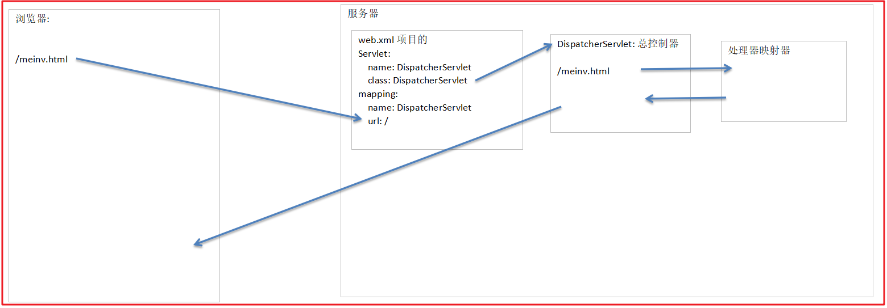
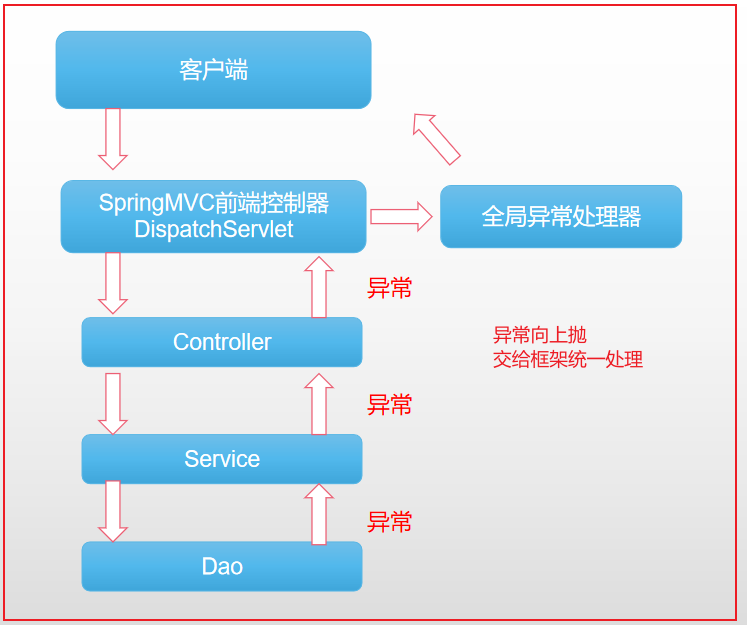

# 回顾

```java
问答题:
        SpringMVC是什么?
        SpringMVC构建在Servlet之上的，基于MVC架构实现的Web框架；
        开发者可以使用一个简单注解，就使得一个普通的java类作为SpringMVC的一个处理器类（地侵入式设计）；
        SpringMVC的总控制器是什么?有哪些作用?
        DispatchServlet
        1.本质也是servlet，对象创建后，会回调init(ServletConfig config)加载IOC容器，并完成核心组件的祖册；
        2.可以调用3大组件，处理前端请求；
        SpringMVC中的三大组件是什么?作用是什么?
        1.处理器映射器 作用：根据请求的URL映射对应的处理器方法（不执行处理器方法），返回给核心调度器；
        2.处理器适配器 作用：调用处理器方法，然后返回视图（逻辑视图），返回给核心调度器；
        3.视图解析器 作用：将逻辑视图解析成物理视图，返回给核心调度器；
        口述SpringMVC框架的加载流程? ★
        1.工程打war包，部署tomcat下；
        2.Tomcat启动，加载web.xml文件；
        3.实例化核心调度器DispatchServlet，然后调用init(ServletConfig config)方法，获取springmvc相关的配置资源；
        4.核心调度器根据springmvc相关配置资源初始化IOC容器，然后再注册SpringMVC核心组件（9=》3）
        口述SpringMVC执行流程? ★
        1.浏览器发送请求
        2.Tomcat调用核心调度器拦截请求；
        3.核心调度器根据请求url使用处理器映射器获取处理器方法；
        4.核心调度器调用处理器适配器执行方法，然后获取逻辑视图资源；
        5.核心调度器调用视图解析器，将逻辑视图转化成物理视图；
        6.核心调度器获取物理视图路径，响应给前端；
        5.@RequestMapping注解的作用?有哪些属性?属性能完成什么功能？
@RequestMapping建立请求url与处理器方法之间的映射；
        属性：
        value={path1,path2,....}可以限定单个或者多个请求路径访问相同的方法
        method={RequestMethod.GET,...}限定注解作用的接口只能被指定的单个或者多个请求方式访问
        params={"参数名称1","参数名称2",....}限定当前请求必须携带指定的参数，否则报错
        headers={"请求头参数1",.....}限定当前的请求中请求头必须携带指定的key，否则报错
        SpringMVC可以接收哪些类型的参数?接收规则是什么?
        3大分类：
        1）接收基本类型和String 规则：请求的参数名称与处理器方法的形参名称一致即可；
        2）接收VO类型（view object） 规则：请求参数名称与VO中成员属性名称一致即可；
        3）复杂类型
        数组 要求：请求的参数名称与处理器方法的形参名称一致即可；
        集合：集合封装到VO下
        List： 要求：前端要制定List集合的小标 list[0]=value
        List<VO>  list[0].name=xxx list[0].age=xxx
        Map map[key]=xxxx
```

# 一、SpringMVC响应和封装返回值

## 01-SpringMVC数据响应须知

### 【1】回顾:请求转发与重定向区别

| 比较              | 请求转发                   | 请求重定向                  |
|-----------------|------------------------|------------------------|
| 请求次数：           | 一次请求的延续                | 多次请求(客户端改变请求方向，发送多次请求) |
| Request域数据是否共享： | 是                      | 否                      |
| 是否可跨服务器请求：      | 否(服务器内部的行为)            | 是（可以跨服务请求）             |
| 实现对象：           | Request对象的行为           | Response对象的行为          |
| 浏览器地址显示：        | 请求转发地址栏地址不变，显示第一次请求URL | 请求重定向显示最后一次请求的路径       |
|                 |                        |                        |

### 【2】SpringMVC数据响应分类

	SpringMVC按返回值的方式可分为两大类: 

```tex
1.同步请求的响应:
	请求转发和请求重定向；
2.异步请求的响应:
	前端发起ajax异步请求；
	后端响应字符串结果（常用格式：application/json）
```

### 【3】回顾:http请求常见的content-type类型

```xml
application/json    ： JSON数据格式 ★
        application/xml     ： XML数据格式
        application/pdf     ： pdf格式
        application/msword  ： Word文档格式
        application/octet-stream ： 二进制流数据（如文件下载）★
        -----------------------
        application/x-www-form-urlencoded ：
        form表单中默认的数据提交类型，表单数据被编码为key/value格式发送到服务器；★
        multipart/form-data:表单上传文件 ★
        -----------------------
        text/html  ：HTML格式  ★
        text/plain ：纯文本格式 ★
        text/xml   ：XML格式
        -----------------------
        image/gif  ：gif图片格式
        image/jpeg ：jpg图片格式
        image/png  ：png图片格式
```

## 02-SpringMVC中响应的多种方式

按前端的请求方法大致分两类：

```java
同步请求：
        转发和重定向；
        异步请求：
        ajax异步请求，获取请求字符串；
```

#### 02-1-SpringMVC实现请求转发

SpringMVC请求转发大致分<span id="t1">3种实现方式</span>：

| 实现方式                 | 核心API                                                            |
|----------------------|------------------------------------------------------------------|
| Servlet原生API实现       | request.getRequestDispatcher("/转发路径").forward(request,response); |
| SpringMVC+forward关键字 | 处理方法返回： return "forward:/转发路径";                                  |
| SpringMVC+视图解析器      | 处理器方法返回：return  "视图逻辑路径";                                        |

实现代码：

```java
package com.pp.controller;

import org.springframework.stereotype.Controller;
import org.springframework.web.bind.annotation.RequestMapping;

import javax.servlet.ServletException;
import javax.servlet.http.HttpServletRequest;
import javax.servlet.http.HttpServletResponse;
import java.io.IOException;

/**
 * 测试原生API和SpringMVC分别实现请求的转发
 * springmvc中请求转发：
 *      1.可以直接转发到某个视图资源下；
 *      2.可以转发到某个处理器方法下；
 */
@Controller
public class ForwardController {

    /**
     * 方式1：
     * 使用原生API完成请求的转发 【了解】
     * @param request
     * @param response
     * @throws ServletException
     * @throws IOException
     */
    @RequestMapping("/nativeForward")
    public void nativeForward(HttpServletRequest request, HttpServletResponse response) throws ServletException, IOException {
        System.out.println("nativeForward run....");
        //请求转发 + 物理路径
//        request.getRequestDispatcher("/WEB-INF/pages/hello.jsp").forward(request,response);
        //转发到其他的处理器方法下
        request.getRequestDispatcher("/springMVCType2").forward(request, response);
    }

    /**
     * 方式2：
     * 使用springmvc提供的转发关键字：forward完成请求的转发
     * @return
     */
    @RequestMapping("/springMVCType1")
    public String springMVCType1() {
        System.out.println("springMVCType1:forward....");
//        return "forward:/WEB-INF/pages/hello.jsp";
        return "forward:/springMVCType2";
    }

    /**
     * 方式3：【推荐】
     * springmvc默认请求就是转发的方式
     *  使用视图解析器获取资源
     * @return
     */
    @RequestMapping("/springMVCType2")
    public String springMVCType2() {
        System.out.println("springMVCType2 run....");
        return "hello";
    }
}
```

#### 02-2-SpringMVC实现请求重定向

SpringMVC请求重定向大致分<span id="t2">2种实现方式</span>：

| 实现方式                  | 核心API                                                       |
|-----------------------|-------------------------------------------------------------|
| Servlet原生API实现        | response.sendRedirect("http://www.baidu.com");              |
| SpringMVC+redirect关键字 | 处理方法返回：return "redirect:/重定向地址";<br>重定向可以是服务器内部跳转，也可以跨服务器跳转 |

实现代码：

```java
package com.pp.controller;

import org.springframework.stereotype.Controller;
import org.springframework.web.bind.annotation.RequestMapping;

import javax.servlet.http.HttpServletResponse;
import java.io.IOException;

/**
 * 测试使用原生API和Springmvc实现请求的重定向操作
 */
@Controller
public class RedirectController {

    /**
     * 使用原生API完成重定向操作
     * 测试url:http://localhost:8080/nativeRedirect
     * 最终地址栏显示的地址：http://localhost:8080/getView
     * @param response
     * @throws IOException
     */
    @RequestMapping("/nativeRedirect")
    public void nativeRedirect(HttpServletResponse response) throws IOException {
        System.out.println("nativeRedirect run.....");
        //response.sendRedirect("/getView");
        //跨服务器的资源跳转
        response.sendRedirect("http://www.baidu.com");
    }

    /**
     * 使用springmvc提供的请求重定向的关键字：redirect完成重定向操作
     * 使用springmvc提供的实现，与servlet解耦
     * @return
     */
    @RequestMapping("/springMvcRedirect")
    public String springMvcRedirect() {
        //服务器内部资源的重定向
//        return "redirect:/getView";
        //夸服务器资源重定向
        return "redirect:http://www.baidu.com";
    }


    /**
     * 方式3：【推荐】
     * springmvc默认请求就是转发的方式
     *  使用视图解析器获取资源
     * @return
     */
    @RequestMapping("/getView")
    public String getView() {
        System.out.println("getView run....");
        return "hello";
    }
}
```

#### 02-3-SpringMVC响应字符串结果

SpringMVC响应字符串的<span id="t3">方式：</span>

| 实现方式           | 核心API                                                                                                                                                  |
|----------------|--------------------------------------------------------------------------------------------------------------------------------------------------------|
| Servlet原生API实现 | response.setContentType("设置响应数据格式");<br/>response.getWriter().write("响应数据");                                                                           |
| SpringMVC      | @ResponseBody<br/>public String springResponseStr(){<br/>      return "响应字符串结果";<br/>}<br>使用@ResposeBody注解前提：开启SpringMVC扩展功能：\<mvc:annotation-driven/> |

实现代码：

```java
package com.pp.controller;

import org.springframework.stereotype.Controller;
import org.springframework.web.bind.annotation.RequestMapping;
import org.springframework.web.bind.annotation.ResponseBody;

import javax.servlet.http.HttpServletResponse;
import java.io.IOException;

/**
 * 测试使用原生API和SpringMvc实现响应字符串
 */
@Controller
public class ResponseStringController {

    /**
     * 测试使用原生的api完成字符串的响应
     * @param response
     * @throws IOException
     */
    @RequestMapping("/nativeResponseStr")
    public void nativeResponseStr(HttpServletResponse response) throws IOException {
        System.out.println("nativeResponseStr run.....");
        //设置响应的字符串的数据格式，告诉浏览器按照指定的格式解析
//        response.setContentType("text/plain;charset=utf-8");
        //告诉浏览器，响应数据以html格式解析
        response.setContentType("text/html;charset=utf-8");
        response.getWriter().write("<h1>hello springMVC......</h1>");
    }

    /**
     * 使用@ResponseBody将处理器方法返回的值，不做视图解析处理，直接响应给浏览器
     * produces = "text/plain;charset=utf-8"等价于： response.setContentType("text/plain;charset=utf-8");
     * @return
     */
    @RequestMapping(value = "/springResponseStr", produces = "text/plain;charset=utf-8")
    @ResponseBody
    public String springResponseStr() {
        System.out.println("springResponseStr rum...");
        return "<h1>hello springMVC......</h1>";
    }
}
```

#### 02-3-SpringMVC响应方式小结

| 响应方式  | 核心API                                                                                                                                                   | 说明 |
|-------|---------------------------------------------------------------------------------------------------------------------------------------------------------|----|
| 转发    | 原生API:request.getReqeustDispach("/转发路径").forward(request,response);<br>SpringMVC+关键字：forward ===>return "forward:/转发路径"<br>SpingMVC+视图解析： return "字符串"; |    |
| 重定向   | 原生API:response.sendRedirect("重定向路径");<br>SpringMVC+关键字：redirect  ====> return "redirect:重定向路径"                                                          |    |
| 响应字符串 | 原生API:response.setContentType("浏览器解析格式")；response.getWrite.write("xxxx");<br>SpringMVC方式：在处理器方法之上打@ResponseBody注解，做到对处理器方法返回的字符串不做视图解析处理；               |    |

## 03-SpringMVC响应时数据共享问题

```java
请求转发:数据都会存放到Request域中；
        重定向:将共享的数据拼接在请求路径的后面；
```

### 03-1-SpringMVC请求转发实现数据共享

说明：

1).从http请求到服务器处理结束的整个过程中，多次请求转发过程中<span style="background-color:yellow;">
request域下的变量共享；</span>

2).工程引入servlet相关依赖：

```xml

<dependency>
    <groupId>javax.servlet</groupId>
    <artifactId>javax.servlet-api</artifactId>
    <version>3.0.1</version>
</dependency>
```

#### 【1】基于Request域实现数据共享

实现代码：

```java
/**
 * 测试请求转发时，数据共享
 */
@Controller
public class ForwardShareDataController {

    /**
     * 测试使用原生APi实现请求转发的数据共享
     * @param request
     * @return 跳转到/forwardData请求路径
     */
    @RequestMapping("/nativeForwardShare")
    public String nativeShare(HttpServletRequest request) {
        request.setAttribute("name", "zhangsan");
        request.setAttribute("age", "18");
        return "forward:/forwardData";
    }

    /**
     * 获取请求转发的数据
     * @param request
     * @return
     */
    @RequestMapping("/forwardData")
    public String forwardData(HttpServletRequest request) {
        Object name = request.getAttribute("name");
        Object age = request.getAttribute("age");
        System.out.println("name:" + name + "---age:" + age);
        return "hello";
    }
}
```

#### 【2】使用SpringMVC Model封装共享数据

	说明：SringMVC提供的Model对象可封装共享数据，当进行请求转发时，数据自动存入reqeust域对象下；

```java
/**
 * @param request
 * @return 跳转到/forwardData请求路径
 */
@RequestMapping("/forwardModelShare")
public String forwardModelShare(Model model){
        //封装到Model对象下的数据，在进行请求转发时，自动封装到HttpServletRequest对象下
        model.addAttribute("name","罗佳龙");
        model.addAttribute("age","18");
        return"forward:/forwardData";
        }
```

#### 【3】SpringMVC ModelAndView封装共享数据

	 说明：SringMVC提供的ModelAndView对象可封装共享数据，当进行请求转发时，数据自动存入reqeust域对象下；

```java
/**
 * 使用ModelAndView封装数据和视图
 * 在进行请求转发时，ModelAndView内部自动将主句封装到HttpServletRequest
 * @return
 */
@RequestMapping("/forwardModelAndViewShare")
public ModelAndView forwardModelAndViewShare(){
        ModelAndView mv=new ModelAndView();
        mv.addObject("name","zhangsan");
        mv.addObject("age","18");
        mv.setViewName("forward:/forwardData");
        return mv;
        }
```

总之，ModelAndView和Model是SpringMVC框架我们提供的,我们直接拿过来使用即可,我们称这些对象为**隐式对象**；

#### 【4】代码示例

通过Request域，Model或者ModelAndView都可实现；

```java
package com.pp.controller;

import org.springframework.stereotype.Controller;
import org.springframework.ui.Model;
import org.springframework.web.bind.annotation.RequestMapping;
import org.springframework.web.servlet.ModelAndView;

import javax.servlet.http.HttpServletRequest;
import javax.servlet.http.HttpServletResponse;

/**
 * 测试请求转发时，数据共享
 */
@Controller
public class ForwardShareDataController {

    /**
     * 测试使用原生APi实现请求转发的数据共享
     * @param request
     * @return
     */
    @RequestMapping("/nativeForwardShare")
    public String nativeShare(HttpServletRequest request) {
        request.setAttribute("name", "罗佳龙");
        request.setAttribute("age", "18");
        return "forward:/forwardData";
    }


    @RequestMapping("/forwardModelShare")
    public String forwardModelShare(Model model) {
        //封装到Model对象下的数据，在进行请求转发时，自动封装到HttpServletRequest对象下
        model.addAttribute("name", "罗佳龙");
        model.addAttribute("age", "18");
        return "forward:/forwardData";
    }

    /**
     * 使用ModelAndView封装数据和视图
     * 在进行请求转发时，ModelAndView内部自动将主句封装到HttpServletRequest
     * @return
     */
    @RequestMapping("/forwardModelAndViewShare")
    public ModelAndView forwardModelAndViewShare() {
        ModelAndView mv = new ModelAndView();
        mv.addObject("name", "罗佳龙");
        mv.addObject("age", "18");
        mv.setViewName("forward:/forwardData");
        return mv;
    }


    @RequestMapping("/forwardData")
    public String forwardData(HttpServletRequest request) {
        Object name = request.getAttribute("name");
        Object age = request.getAttribute("age");
        System.out.println("name:" + name + "---age:" + age);
        return "hello";
    }
}
```

### 03-2-SpringMVC重定向时实现共享数据

说明：

	请求重定向时数据存放到session域下，会占用服务器内存空间,且跨服务器的重定向session不共享；【<font color='red'>不可取</font>】

	请求重定向时request域下的数据不能共享,但是使用<span style="background-color:green;">Model或者ModelAndView可以自动将数据以参数的方式拼接到请求路径中；</span>

实现代码：

```java
package com.pp.controller;

import org.springframework.stereotype.Controller;
import org.springframework.ui.Model;
import org.springframework.web.bind.annotation.RequestMapping;
import org.springframework.web.servlet.ModelAndView;

import javax.servlet.http.HttpServletRequest;

/**
 * 测试请求重定向时数据共享方案：将参数动态拼接重定向的地址下
 */
@Controller
public class RedirectShareDataController {
    /**
     * 使用model在重定向时，数据以请求参数的方式自动拼接到url地址下
     * url:http://localhost:8080/redirectModelShare
     * 地址栏：http://localhost:8080/redirectData?name=罗佳龙&age=18
     * @param model
     * @return
     */
    @RequestMapping("/redirectModelShare")
    public String modelShare(Model model) {
        model.addAttribute("name", "罗佳龙");
        model.addAttribute("age", "18");
        return "redirect:/redirectData";
    }

    /**
     * 使用ModelAndView在重定向时，数据以请求参数的方式自动拼接到url地址下
     * url:http://localhost:8080/redirectModelAndViewShare
     * 地址栏：http://localhost:8080/redirectData?name=罗佳龙&age=18
     * @return
     */
    @RequestMapping("/redirectModelAndViewShare")
    public ModelAndView modelShare() {
        ModelAndView mv = new ModelAndView();
        mv.addObject("name", "罗佳龙");
        mv.addObject("age", "18");
        mv.setViewName("redirect:/redirectData");
        return mv;
    }

    /**
     * url:http://localhost:8080/redirectData?name=xxx&age=xxx
     * @return
     */
    @RequestMapping("/redirectData")
    public String redirectData(String name, Integer age) {
        System.out.println(name + "---" + age);
        return "hello";
    }
}
```

### 03-3-SpringMVC请求转发与重定向数据<span id="t4">共享小结</span>

【1】SpringMVC请求转发数据如何共享？

有3种实现方式：

| 实现方式                   | 说明                                          |
|------------------------|---------------------------------------------|
| 基于原生HttpServletRequest | request域对象的数据在请求转发时，可共享                     |
| 基于Model对象              | SpringMVC提供，在请求转发时，自动存入request域下作为请求转发的共享变量 |
| 基于ModelAndView对象       | SpringMVC提供，在请求转发时，自动存入request域下作为请求转发的共享变量 |

【2】SpringMVC重定向时，数据如何共享？

| 实现方式             | 说明                                              |
|------------------|-------------------------------------------------|
| 手动实现             | 自己手动拼接参数到重定向URL下实现                              |
| 基于Model对象        | SpringMVC提供，在请求重定向时，自动将Model下参数拼接到重定向路径下        |
| 基于ModelAndView对象 | SpringMVC提供，在请求重定向时，自动将ModelAndView下参数拼接到重定向路径下 |

## 04-SpringMVC异步请求响应

	测试环境说明：

		（1）可基于：Vue+SpringMVC

	    （2）在springmvc.xml中配置放行静态资源：

```xml

<mvc:default-servlet-handler/>
```

### 04-1-Servlet原生API响应字符串和对象json数据

#### 【1】原生Servlet API响应普通字符串类型

	   【1.1】后端代码实现：

```java
/**
 * 响应ajax请求的处理器
 */
@Controller
public class AjaxController {

    /**
     * 原生API响应ajax请求
     * url:http://localhsot:8080/nativeAjax?userName=xxx&age=xxxx
     * @param userName
     * @param age
     * @param response
     * @throws IOException
     */
    @RequestMapping("/nativeAjax")
    public void nativeAjax(String userName, String age, HttpServletResponse response) throws IOException {
        System.out.println(userName + "---" + age);
        //设置响应数据类型，浏览器根据指定类型解析数据
        response.setContentType("application/json;charset=utf-8");
        //响应前端字符串
        response.getWriter().write(userName + ":" + age);
    }
}    
```

	【1.2】前端准备：

```html
<!DOCTYPE html>
<html lang="en">
<head>
    <meta charset="UTF-8">
    <title>Title</title>
    <script src="../js/vue.js"></script>
    <script src="../js/axios.min.js"></script>
</head>
<body>
<div id="myApp">
    姓名：<input type="text" v-model="user.userName"><br>
    年龄：<input type="text" v-model="user.age"><br>
    <input type="button" value="nativeAjax-get" @click="method1()">
    <h1>执行结果：{{msg}}</h1>
</div>
<script>
    new Vue({
        el: "#myApp",
        data: {
            user: {
                userName: "",
                age: 0
            },
            msg: ""
        },
        methods: {
            method1() {
                let url = "/nativeAjax";
                axios.get(url, {params: this.user}).then(res => {
                    console.log(res);
                    this.msg = res.data;
                })
            }
        }
    });
</script>
</body>
</html>
```

#### 【2】原生Servlet API响应VO对象Json字符串

【2.1】导入jackson相关工具包

若想响应VO对象，需要将对象序列化处理，最常见的是将对象转json格式字符串处理，所以需要引入对象转json的工具包,这里优先选择使用jackson相关的依赖，因为SpringMVC默认支持jackson相关API：

```xml

<dependency>
    <groupId>com.fasterxml.jackson.core</groupId>
    <artifactId>jackson-core</artifactId>
    <version>2.9.8</version>
</dependency>
<dependency>
<groupId>com.fasterxml.jackson.core</groupId>
<artifactId>jackson-databind</artifactId>
<version>2.9.8</version>
</dependency>
<dependency>
<groupId>com.fasterxml.jackson.core</groupId>
<artifactId>jackson-annotations</artifactId>
<version>2.9.8</version>
</dependency>
```

核心API:

```java
1.对象转json字符串
        ObjectMapper mapper=new ObjectMapper();
        String jsonString=mapper.writeValueAsString(student);
        2.json字符串转对象
        ObjectMapper mapper=new ObjectMapper();
        Student student=mapper.readValue(jsonString,Student.class);  
```

【2.2】实现代码

后台代码：

```java
    /**
 * 原生API响应ajax请求，返回VO json字符串
 * url:http://localhsot:8080/nativeAjax2?userName=xxx&age=xxxx
 * @param response
 * @throws IOException
 */
@RequestMapping("/nativeAjax2")
public void nativeAjax2(User user,HttpServletResponse response)throws IOException{
        //设置响应数据类型
        response.setContentType("application/json;charset=utf-8");
        //将对象序列化成json格式字符串
        ObjectMapper mapper=new ObjectMapper();
        String json=mapper.writeValueAsString(user);
        response.getWriter().write(json);
        }
```

前端代码：

```html
<!--添加按钮-->
<input type="button" value="nativeAjax-get2" @click="method11()">
<!--添加触发方法-->
method11(){
let url="/nativeAjax2";
axios.get(url,{params:this.user}).then(res=>{
console.log(res);
this.msg=res.data;
})
},
```

### 04-2-SpringMVC响应字符串和VO对象Json

实现步骤：

【1】ajax GET请求响应字符串或者VO对象类型；

【2】响应普通字符串，则直接在处理器方法之上打@ResponseBody，即可避免SpringMVC对返回字符串视图解析处理,直接返回字符串本身；

【3】接口响应VO对象，则需要引入jackson相关依赖（上一小结已经引入）且处理器方法进入@ResponseBody，则直接返回VO对象即可；

说明：要是使用@ResponseBody注解，需要开启SpringMVC注解驱动：

```xml

<mvc:annotation-driven/>
```

示例代码：

后端代码：

```java
    /**
 * 使用@ResponseBody直接以流的形式返回数据
 * @param userName
 * @param age
 * @return
 */
@RequestMapping(value = "/springmvcGetAjax", produces = MediaType.APPLICATION_JSON_UTF8_VALUE)
@ResponseBody
public String springmvcGetAjax(String userName,String age){
        System.out.println(userName+"---"+age);
        return userName+":"+age;
        }
/**
 * 使用@ResponseBody直接以流的形式返回数据
 * 如果响应的数据是vo类型，springmvc底层自动调用jackson相关的api将对象转化成json格式字符串
 * @return
 */
@RequestMapping(value = "/springmvcGetAjax4VO", produces = MediaType.APPLICATION_JSON_UTF8_VALUE)
@ResponseBody
public User springmvcGetAjax4VO(User user){
        System.out.println(user);
        return user;
        }
```

前端代码：

```html
<!--添加触发button-->
<input type="button" value="springmvcAjax-get" @click="method2()">
<input type="button" value="springmvcAjax-get4VO" @click="method3()">
<!---添加函数-->
method2(){
let url="/springmvcGetAjax";
axios.get(url,{params:this.user}).then(res=>{
console.log(res);
this.msg=res.data;
})
},
method3(){
let url="/springmvcGetAjax4VO";
axios.get(url,{params:this.user}).then(res=>{
console.log(res);
this.msg=res.data;
})
},
```

### 04-3-SpringMVC接收Json字符串转换VO对象

说明：前端ajax POST请求发送json字符串到后台，SpringMVC接收json字符串自动转化成VO对象；

实现步骤：

【1】工程引入jackson相关依赖（上一小结已经引入）;

【2】在处理器方法入参上打**@RequestBody**，底层会自动将json格式字符串转VO对象；

	作用：@RequestBody是从http请求体中获取json字符串，转化成指定的VO对象；

实现代码：

后台代码：

```java
    /**
 * 使用@ResponseBody直接以流的形式返回数据
 * 如果响应的数据是vo类型，springmvc底层自动调用jackson相关的api将对象转化成json格式
 * 如果前端传入的json格式字符串，则需要转User对象
 * 使用注解@RequestBody
 * 作用：前端传入的json格式字符串转User对象
 * @return
 */
@RequestMapping(value = "/springmvcPostAjax4VO")
@ResponseBody
public User springmvcPostAjax4VO(@RequestBody User user){
        System.out.println(user);
        return user;
        }
```

前端代码：

```html
<!--添加触发button-->
<input type="button" value="springmvcAjax-post4VO" @click="method4()">
<!--添加函数-->
method4(){
let url="/springmvcPostAjax4VO";
//this.user数据以json格式存入http请求体中，请求参数一个json字符串
axios.post(url,this.user).then(res=>{
console.log(res);
this.msg=res.data;
})
},
```

#### 课上的完整代码:

##### 前端代码

```html
<!DOCTYPE html>
<html lang="en">
<head>
    <meta charset="UTF-8">
    <title>Title</title>
    <script src="../js/vue.js"></script>
    <script src="../js/axios.min.js"></script>
</head>
<body>
<div id="myApp">

    姓名：<input type="text" v-model="user.userName"><br>
    年龄：<input type="text" v-model="user.age"><br>
    <input type="button" value="nativeAjax-get" @click="method1()">
    <input type="button" value="nativeAjax-get2" @click="method11()">
    <input type="button" value="springmvcAjax-get" @click="method2()">
    <input type="button" value="springmvcAjax-get4VO" @click="method3()">
    <input type="button" value="springmvcAjax-post4VO" @click="method4()">
    <h1>执行结果：{{msg}}</h1>
</div>
<script>
    new Vue({
        el: "#myApp",
        data: {
            user: {
                userName: "",
                age: 0
            },
            msg: ""
        },
        methods: {
            method1() {
                let url = "/nativeAjax";
                axios.get(url, {params: this.user}).then(res => {
                    console.log(res);
                    this.msg = res.data;
                })
            },
            method11() {
                let url = "/nativeAjax2";
                axios.get(url, {params: this.user}).then(res => {
                    console.log(res);
                    this.msg = res.data;
                })
            },
            method2() {
                let url = "/springmvcGetAjax";
                axios.get(url, {params: this.user}).then(res => {
                    console.log(res);
                    this.msg = res.data;
                })
            },
            method3() {
                let url = "/springmvcGetAjax4VO";
                axios.get(url, {params: this.user}).then(res => {
                    console.log(res);
                    this.msg = res.data;
                })
            },
            method4() {
                let url = "/springmvcPostAjax4VO";
                //this.user数据以json格式存入http请求体重，请求参数一个json字符串
                axios.post(url, this.user).then(res => {
                    console.log(res);
                    this.msg = res.data;
                })
            },
        }
    });
</script>
</body>
</html>
```html

##### 后台代码

[//]: # (```java)

[//]: # (package com.pp.controller;)

[//]: # ()
[//]: # (import com.fasterxml.jackson.databind.ObjectMapper;)

[//]: # (import com.pp.vo.User;)

[//]: # (import org.springframework.http.MediaType;)

[//]: # (import org.springframework.stereotype.Controller;)

[//]: # (import org.springframework.web.bind.annotation.RequestBody;)

[//]: # (import org.springframework.web.bind.annotation.RequestMapping;)

[//]: # (import org.springframework.web.bind.annotation.ResponseBody;)

[//]: # ()
[//]: # (import javax.servlet.http.HttpServletResponse;)

[//]: # (import java.io.IOException;)

[//]: # ()
[//]: # (/**)

[//]: # ( * 响应ajax请求的处理器)

[//]: # ( */)

[//]: # (@Controller)

[//]: # (public class AjaxController {)

[//]: # ()
[//]: # (    /**)

[//]: # (     * 原生API响应ajax请求)

[//]: # (     * url:http://localhsot:8080/nativeAjax?userName=xxx&age=xxxx)

[//]: # (     * @param userName)

[//]: # (     * @param age)

[//]: # (     * @param response)

[//]: # (     * @throws IOException)

[//]: # (     */)

[//]: # (    @RequestMapping&#40;"/nativeAjax"&#41;)

[//]: # (    public void nativeAjax&#40;String userName, String age, HttpServletResponse response&#41; throws IOException {)

[//]: # (        System.out.println&#40;userName + "---" + age&#41;;)

[//]: # (        response.setContentType&#40;"application/json;charset=utf-8"&#41;;)

[//]: # (        response.getWriter&#40;&#41;.write&#40;userName + ":" + age&#41;;)

[//]: # (    })

[//]: # ()
[//]: # (    /**)

[//]: # (     * 原生API响应ajax请求，返回VO json字符串)

[//]: # (     * url:http://localhsot:8080/nativeAjax2?userName=xxx&age=xxxx)

[//]: # (     * @param response)

[//]: # (     * @throws IOException)

[//]: # (     */)

[//]: # (    @RequestMapping&#40;"/nativeAjax2"&#41;)

[//]: # (    public void nativeAjax2&#40;User user, HttpServletResponse response&#41; throws IOException {)

[//]: # (        //设置响应数据类型)

[//]: # (        response.setContentType&#40;"application/json;charset=utf-8"&#41;;)

[//]: # (        //将对象序列化成json格式字符串)

[//]: # (        ObjectMapper mapper = new ObjectMapper&#40;&#41;;)

[//]: # (        String json = mapper.writeValueAsString&#40;user&#41;;)

[//]: # (        response.getWriter&#40;&#41;.write&#40;json&#41;;)

[//]: # (    })

[//]: # ()
[//]: # (    /**)

[//]: # (     * 使用@ResponseBody直接以流的形式返回数据)

[//]: # (     * @param userName)

[//]: # (     * @param age)

[//]: # (     * @return)

[//]: # (     */)

[//]: # (    //@RequestMapping&#40;value = "/springmvcGetAjax",produces = "application/json;charset=utf-8"&#41;)

[//]: # (    @RequestMapping&#40;value = "/springmvcGetAjax", produces = MediaType.APPLICATION_JSON_UTF8_VALUE&#41;)

[//]: # (    @ResponseBody)

[//]: # (    public String springmvcGetAjax&#40;String userName, String age&#41; {)

[//]: # (        System.out.println&#40;userName + "---" + age&#41;;)

[//]: # (        return userName + ":" + age;)

[//]: # (    })

[//]: # ()
[//]: # (    /**)

[//]: # (     * 使用@ResponseBody直接以流的形式返回数据)

[//]: # (     * 如果响应的数据是vo类型，springmvc底层自动调用jackson相关的api将对象转化成json格式)

[//]: # (     * 字符串)

[//]: # (     * @return)

[//]: # (     */)

[//]: # (    @RequestMapping&#40;value = "/springmvcGetAjax4VO", produces = MediaType.APPLICATION_JSON_UTF8_VALUE&#41;)

[//]: # (    @ResponseBody)

[//]: # (    public User springmvcGetAjax4VO&#40;User user&#41; {)

[//]: # (        System.out.println&#40;user&#41;;)

[//]: # (        return user;)

[//]: # (    })

[//]: # (    @ResponseBody)

[//]: # (    @RequestMapping&#40;value = "/springmvcPostAjax4VO"&#41;)

[//]: # (    public User springmvcPostAjax4VO&#40;@RequestBody User user&#41; {)

[//]: # (        System.out.println&#40;user&#41;;)

[//]: # (        return user;)

[//]: # (    })

[//]: # (})

[//]: # (```)

### 04-4-注解@RequestBody和@ResponseBody区别

面试题：<span id="t5">描述@RequestBody和@ResponseBody区别？</span>

<table border="1">
<tr>
    <th width=10%>比较</th>
    <th width=40%>@RequestBody</th>
    <th width="50%">@ResponseBody</th>
  </tr>
  <tr>
    <td>使用位置</td>
    <td>使用在处理器方法入参之上</td>
    <td>使用在处理器方法之上或者方法返回值上</td>
  </tr>
  <tr>
    <td>处理请求方式</td>
    <td>获取Ajax POST请求体中参数</td>
    <td>响应GET/POST请求</td>
  </tr>
  <tr>
    <td>序列化方式</td>
    <td>将Json字符串转VO对象，对象反序列化</td>
    <td>将VO对象转Json字符串，对象序列化</td>
  <tr>
    <td>请求与响应</td>
    <td>用于接口请求，处理参数</td>
    <td>用于响应请求(字符串)，避免视图解析器解析</td>
  </tr>
</table>

# 二、RESTFul风格的路径

## 05-1-REST概念介绍

### 【1】Rest概述

Rest（ Representational State Transfer 即表述性状态传递） 一种<font color='red'>网络资源的访问风格</font>，定义了网络资源的访问方式;

核心点：<span style="background-color:yellow;">1.路径即资源（名词） 2.使用请求方式来表达对资源的操纵行为</span>

* 传统风格访问路径
   http://localhost/user/getUser?id=1
   http://localhost/deleteUser?id=1

* Rest风格访问路径
   http://localhost/user/1        请求方式：get 查询

   http://localhost/user/1        请求方式：delete 删除

* Restful是按照Rest风格访问网络资源

* 优点
   <font color='red'>隐藏资源的访问行为</font>，通过地址无法得知做的是何种操作
   书写简化

### 【2】Rest行为约定方式

 GET（查询） http://localhost/user/1 GET
 POST（保存） http://localhost/user POST
 PUT（更新） http://localhost/user PUT
 DELETE（删除） http://localhost/user DELETE
**注意：**

```tex
1.上述行为是约定方式，约定不是规范，可以打破，所以称Rest风格，而不是Rest规范 ；
2.RESTFul就是路径编写的另一种格式,这种格式面向的是资源(核心思想：资源即路径),而非具体的功能；
3.在springmvc中使用@PathVariable注解就可以从Rest风格的URL中获取参数的值；
```

## 05-2-SpringMVC实现RestFull开发

常用注解：

【1】请求路径映射注解：

```tex
@GetMapping()    : 只处理get请求,表示查询资源操作
@PostMapping()   : 只处理post请求，表示添加资源操作
@PutMapping()    : 只处理put请求，表示修改资源操作
@DeleteMapping() :只处理delete请求，表示删除资源操作
```

【2】获取路径资源注解

		eg:

```java
@RequestMapping(value = "/user/{id}", method = RequestMethod.GET)
@ResponseBody
public User findById(@PathVariable("id") Integer id){
        //......
        }    
```

【3】示例代码

```java
package com.pp.controller;

import com.pp.vo.User;
import org.springframework.stereotype.Controller;
import org.springframework.web.bind.annotation.*;

import java.util.Arrays;
import java.util.List;

/**
 * 测试rest风格controller
 */
//@Controller
//@ResponseBody//作用于类上，表示当前类下的所有方法都返回字符串，且字符串不进行视图解析处理；
@RestController //等价于   @Controller+@ResponseBody
@RequestMapping("/user")
public class RestFullController {

    /**
     * 使用restfull风格查询
     * get表示对资源查询行为
     * GET http://localhost:8080/user/1
     * @param id
     * @return
     */
//    @RequestMapping(value = "/user/{id}",method = RequestMethod.GET)
    //@RequestMapping(value = "/{id}",method = RequestMethod.GET)
    @GetMapping("/{id}")//等价于@RequestMapping+method = RequestMethod.GET
//    @ResponseBody
    public User findUserById(@PathVariable("id") Integer id) {
        System.out.println(id);
        User user = new User();
        user.setAge(18);
        user.setUserName("name" + id);
        return user;
    }

    /**
     * 模拟分页查询
     * GET http://localhost:8080/user/2/30
     * @param curPage
     * @param pageSize
     * @return
     */
//    @RequestMapping(value = "/user/{curPage}/{pageSize}",method = RequestMethod.GET)
//    @RequestMapping(value = "/{curPage}/{pageSize}",method = RequestMethod.GET)
    @GetMapping("/{curPage}/{pageSize}")
//    @ResponseBody
    public List<User> findUsers(@PathVariable("curPage") Integer curPage, @PathVariable("pageSize") Integer pageSize) {
        System.out.println(curPage);
        System.out.println(pageSize);
        User user = new User();
        user.setAge(20);
        user.setUserName("jiangxu");
        return Arrays.asList(user);
    }

    /**
     * 测试rest 添加操作
     * 请求方式：post
     * @param name
     * @param age
     * @return
     */
//    @RequestMapping(value = "/user/{userName}/{age}",method = RequestMethod.POST)
//    @RequestMapping(value = "/{userName}/{age}",method = RequestMethod.POST)
    @PostMapping("/{userName}/{age}")
//    @ResponseBody
    public User addUser(@PathVariable("userName") String name, @PathVariable("age") Integer age) {
        System.out.println(name + "---" + age);
        User user = new User();
        user.setUserName(name);
        user.setAge(age);
        return user;
    }

    /**
     * 测试rest 添加操作
     * 请求方式：put
     * PUT http://localhost:8080/user/luchao/23/100
     * @param name
     * @param age
     * @return
     */
//    @RequestMapping(value = "/user/{userName}/{age}/{id}",method = RequestMethod.PUT)
    //@RequestMapping(value = "/{userName}/{age}/{id}",method = RequestMethod.PUT)
    @PutMapping("/{userName}/{age}/{id}")
//    @ResponseBody
    public User updateUser(
            @PathVariable("userName") String name,
            @PathVariable("age") Integer age,
            @PathVariable("id") Integer id) {
        System.out.println(name + "---" + age + "---" + id);
        User user = new User();
        user.setUserName(name);
        user.setAge(age);
        return user;
    }


    /**
     * 删除操作
     * 请求方式：delete
     * DELETE http://localhost:8080/user/300
     * @param id
     * @return
     */
    //@RequestMapping(value = "/user/{id}",method = RequestMethod.DELETE)
    @DeleteMapping("/user/{id}")
//    @ResponseBody
    public User deleteUserById(@PathVariable("id") Integer id) {
        System.out.println(id);
        User user = new User();
        user.setAge(18);
        user.setUserName("name" + id);
        return user;
    }
}
```

## 05-3-Rest开发小结

<span id="t6">小结</span>

【1】Rest核心思想是什么？

```tex
1.restFull核心思想：
    1.1.路径即资源（路径url一般为名词）；
    1.2.使用http请求方式来表达对资源的操纵行为； 
```

【2】SpringMVC实现rest常用注解有哪些？

```tex
2.常用注解  
	2.1 映射注解
	    查询：get--->@GetMapping
        添加：post--->@PostMapping
        修改：put--->@PutMapping
        删除：delete -->@DeleteMapping
    2.2 获取路径参数注解
        @PathVariable("路径变量")
```

# 三、静态资源映射

## 06-SpringMVC静态资源配置

静态资源访问不到的原因：



总之，通过资源URL根据处理器映射器找不到对应的Handler处理器；

### 【1】解决方式1(了解即可)：

方案一：激活Tomcat的defaultServlet来处理静态文件

用原生servlet方式在web.xml中配置：

```xml
<!-- 配置静态资源处理 -->
<servlet-mapping>
    <servlet-name>default</servlet-name>
    <url-pattern>*.html</url-pattern>
    <url-pattern>*.css</url-pattern>
    <url-pattern>*.js</url-pattern>
    <url-pattern>*.png</url-pattern>
</servlet-mapping>
```

### 【2】解决方式2：

在springmvc.xml文件中配置：

< mvc:resources mapping="匹配请求路径" location="真实路径">

```xml
<!-- 设置静态资源不过滤 -->
<mvc:resources mapping="/css/**" location="/css/"/>  <!-- 样式 -->
<mvc:resources mapping="/images/**" location="/images/"/>  <!-- 图片 -->
<mvc:resources mapping="/js/**" location="/js/"/>  <!-- javascript -->
<mvc:resources mapping="/html/**" location="/html/"/>  <!-- html资源 -->
```

### 【3】解决方式3：

在springmvc.xml文件中配置：

```xml
<!-- 统一配置 ★ -->
<!-- 代替以上所有的配置 -->
<mvc:default-servlet-handler/>
```

# 四、SpringMVC异常处理机制

## 07-SpringMVC异常处理机制介绍

#### 【1】开发中异常处理的一些思考

     实现项目开发中会存在大量的共性异常，比如自定义的一些业务异常等，如何处理？

```tex
方式1：在方法内直接捕获解决；
	  好处：简单粗暴，一目了然；
	  弊端：异常处理代码与业务代码耦合到一块，维护性差(一旦异常解决方案做调整，则面临大量的修改工作)
方式2：抛给调用方处理；
	  好处：使当前开发者更加专注于业务逻辑处理；
	  弊端：增大调用方的编码量,调用方的体验较差；
```

#### 【2】SpringMVC是如何解决项目中的共性异常的？

		显然，上述两种处理方式，都存在各自的问题，那SpringMVC是如何解决的呢？

```xml
1.SpringMVC最终采用了【方式2】解决异常的方式；
        2.SpringMVC基于AOP思想实现异常的全局统一处理；
        说白了，就是我们写的代码最后都是由Spring框架来调用，所以我们可以直接将异常抛给框架，然后由框架统一处理； 
```



#### 【3】SpringMVC实现全局异常处理的2种方式

			方式1：基于HandlerExceptionResolver接口实现【了解】；

			方式2：基于注解实现异常分类管理器【推荐】；

## 08-SpringMVC基于接口实现异常统一处理

### 【1】实现步骤

```java
【1】自定义异常处理器
        a）编写一个类,实现HandlerExceptionResolver接口；
        b）重写接口中resolveException方法，完成异常处理；
        核心实现思路：
        返回：ModelAndView
        1.跳转到公共的错误页面；
        2.携带错误信息；
        【2】配置异常处理器（交给spring容器管理）
<!--基于xml配置-->
<bean id="exceptionResolver"class="com.pp.exception.MyHandlerExceptionResolver"/><!--或者基于注解加入spring的ioc容器中-->
```

### 【2】代码实现

#### 【2.1】自定义异常处理类

```java
package com.pp.exhandler;

import org.springframework.context.annotation.ComponentScan;
import org.springframework.stereotype.Component;
import org.springframework.web.servlet.HandlerExceptionResolver;
import org.springframework.web.servlet.ModelAndView;

import javax.servlet.http.HttpServletRequest;
import javax.servlet.http.HttpServletResponse;

@Component
public class MyHandlerExceptionResolver implements HandlerExceptionResolver {
    /**
     * 当web层的handler处理器出现异常时，自动跳转到error.jsp页面下
     * @param request
     * @param response
     * @param handler 出现异常的处理器方法对象
     * @param ex 方法执行出现的异常对象
     * @return
     */
    @Override
    public ModelAndView resolveException(HttpServletRequest request,
                                         HttpServletResponse response,
                                         Object handler,
                                         Exception ex) {
        /**
         * 对不同的异常逐次做判断，维护性差==》将来有新的异常需要处理，那么继续条件if条件
         */
        if (ex instanceof NullPointerException) {
            // do something.....
        } else if (ex instanceof IndexOutOfBoundsException) {
            //do something....
        } else {
            //......
        }
        System.out.println(ex.getMessage());
        //request.setAttribute("msg",ex.getMessage());
        ModelAndView mv = new ModelAndView();
        mv.addObject("msg", ex.getMessage());
        mv.setViewName("error");
        return mv;
    }
}
```

#### 【2.2】错误页面

```html
<%@ page contentType="text/html;charset=UTF-8" language="java" %>
<html>
<head>
    <title>Title</title>
</head>
<body>
<h1>error:${msg}</h1>
</body>
</html>
```

#### 【2.3】测试

```java
@RequestMapping("/springMVCType1")
public String springMVCType1(){
        int i=1/0;//模拟web层异常
        System.out.println("springMVCType1:forward....");
        return"forward:/springMVCType2";
        }
```

## 09-注解开发异常分类处理器【推荐】

### 【1】异常分类处理器相关注解介绍

* 使用注解实现异常分类管理
   名称： @ControllerAdvice
   类型： 类注解
   位置：异常处理器类上方
   作用：设置当前类为异常处理器类
   范例：

```java

@ControllerAdvice
public class ExceptionAdvice {
}  
```

* 使用注解实现异常分类管理
   名称： @ExceptionHandler
   类型： 方法注解
   位置：<font color='red'>异常处理器类中针对指定异常进行处理的方法上方</font>
   作用：设置指定异常的处理方式
   范例：
   说明：处理器方法可以设定多个

 ```java

@ControllerAdvice
public class ExceptionAdvice {
    @ExceptionHandler(Exception.class)
    @ResponseBody
    public String doOtherException(Exception ex) {
        return "出错啦，请联系管理员！ ";
    }
}    
 ```

### 【2】代码实现

	1.定义异常分类管理器：

```java
package com.pp.exhandler;

import org.springframework.web.bind.annotation.ControllerAdvice;
import org.springframework.web.bind.annotation.ExceptionHandler;
import org.springframework.web.bind.annotation.ResponseBody;
import org.springframework.web.servlet.ModelAndView;

/**
 * 定义全局的异常分类管理器
 */
@ControllerAdvice
public class MyControllerAdvice {
    /**
     * 定义Exception的处理器方法
     * 需求:如果出现异常，就跳转到error.jsp页面下
     * 说明：
     * @ExceptionHandler(Exception.class)
     * 如果web层出现Exception异常，就被@ExceptionHandler注释的方法处理
     */
    @ExceptionHandler(Exception.class)
    public ModelAndView handlerException(Exception ex) {
        System.out.println(ex.getMessage());
        ModelAndView mv = new ModelAndView();
        mv.addObject("msg", ex.getMessage());
        mv.setViewName("error");
        return mv;
    }

    /**
     * 开闭原则：向扩展开发，向修改封闭	
     * 处理异常，并响应字符串结果
     * @param ex
     * @return
     */
    @ExceptionHandler(NullPointerException.class)
    @ResponseBody
    public String nullPointerException(NullPointerException ex) {
        System.out.println(ex.getMessage());
        return "空指针异常";
    }
}
```

2.测试代码

```java
@RequestMapping("/springMVCType1")
public String springMVCType1(){
        int i=1/0;//模拟web层异常
        Object target=null;
        target.toString();//模拟空指针异常
        System.out.println("springMVCType1:forward....");
        return"forward:/springMVCType2";
        }
```

## 10-SpringMVC全局异常处理小结

【1】SpringMVC全局异常处理的好处？

```tex
1.业务代码与异常处理代码解耦，方便维护；
2.异常处理方案可实现快速统一变更，开发灵活，维护性好；
```

【2】SpringMVC两种异常处理方式<span id="t8">区别</span>？

| 区别    | 基于接口实现                                                     | 基于注解实现                                                                |
|-------|------------------------------------------------------------|-----------------------------------------------------------------------|
| 相关API | 处理器要实现HandlerExceptionResolver接口；<br>重写resolveException方法； | 处理器类上要使用@ControllerAdvice注解；<br>处理方法上使用@ExceptionHandler注解指定要处理的异常类型； |
| 耦合度   | 与处理器接口强耦合                                                  | 基于注解，耦合度低                                                             |
| 维护性   | 所有异常在一个方法中集中处理，维护性差                                        | 不同的方法处理不同的异常，符合软件开闭原则,可维护性好                                           |

# 五、文件上传

实现功能描述：

用户通过浏览器将用户本地文件传递到服务器上,并在服务器上将上传的文件保存处理；

## 11-SpringMVC实现文件上传流程分析

### 【1】前端准备工作

		**①form表单提交且请求方式必须是POST** 

```tex
get请求携带的数据量受限
```

       **②form表单的enctype(编码类型)取值必须是multipart/form-data**

```tex
form表单提交数据时，默认编码类型是:application/x-www-form-urlencoded
如果在from表单中上传文件，则编码类型改为：multipart/form-data（多部分表单项）
    作用：
     1.将普通表单项与文件上传项分离,普通表单项可以直接被解析；
     2.上传文件项需要对上传的文件进行解析,并保存文件，处理方式不同；
```

      ③上传文件的input控件必须为file类型

		eg:

```html

<form method="post" enctype="multipart/form-data">
    用户名: <input type="text" name="username"/> 【普通表单项】
    密码: <input type="text" name="password"/> 【普通表单项】
    头像: <input type="file" name="filename"/> 【上传文件项】
    <input type="submit" value="提交表单"/>
</form>
```

### 【2】SpringMVC后端准备工作

		①因为SpringMVC没有提供文件上传的相关实现，所以导入commons-fileupload.jar依赖(第三方依赖)

```xml
<!--普通文件上传-->
<dependency>
    <groupId>commons-fileupload</groupId>
    <artifactId>commons-fileupload</artifactId>
    <version>1.3.1</version>
</dependency>
```

      ②配置文件解析器-CommonsMultipartResolver

	  配置到springmvc.xml文件中：

```xml
    <!-- 配置文件上传解析器 id为固定值,不能变-->
<bean id="multipartResolver" class="org.springframework.web.multipart.commons.CommonsMultipartResolver">
    <!--最大文件大小，单位字节 5m= 1024*1024*5-->
    <property name="maxUploadSize" value="5000000"/>
    <!--指定默认编码格式-->
    <property name="defaultEncoding" value="UTF-8"/>
</bean>
```

      ③后台代码示例

```java

@Controller
public class UploadController {
    @RequestMapping("/uploadOne")
    public String uploadOneFile(String userName, MultipartFile filename) throws IOException {
        //使用MultipartFile接收文件对象，方法形参名称要入form表单控件项名称一致！
        //文件转存本地
        filename.transferTo(file - obj);
    }
}    
```

## 12-SpringMVC实现单文件上传

     【1】编写前端页面(发送上传文件的请求)

```html
<%@ page contentType="text/html;charset=UTF-8" language="java" %>
<html>
<head>
    <title>Title</title>
</head>
<body>
<form action="/uploadOne" method="post" enctype="multipart/form-data">
    姓名：<input type="text" name="userName"><br>
    头像：<input type="file" name="headImg"><br>
    <input type="submit" value="提交">
</form>
</body>
</html>
```

     【2】编写上传的方法(单文件)

```java
package com.pp.controller;

import org.springframework.stereotype.Controller;
import org.springframework.web.bind.annotation.RequestMapping;
import org.springframework.web.bind.annotation.ResponseBody;
import org.springframework.web.multipart.MultipartFile;

import java.io.File;
import java.io.IOException;
import java.util.UUID;

/**
 * 定义文件上传的控制器
 */
@Controller
public class UploadController {
    /**
     * 接收单个文件
     * @param userName
     * @param headImg
     * @return
     * @throws IOException
     */
    @RequestMapping("/uploadOne")
    @ResponseBody
    public String uploadOneFile(String userName, MultipartFile headImg) throws IOException {
        System.out.println(userName);
        //获取form表单中文件控件的name==》headImg
        String inputName = headImg.getName();
        System.out.println(inputName);
        //获取文件的原始的名称
        String oName = headImg.getOriginalFilename();
        System.out.println(oName);
        //获取文件的后缀
        String suffixName = oName.substring(oName.lastIndexOf("."), oName.length());
        System.out.println(suffixName);
        //生成新的名称
        UUID uuid = UUID.randomUUID();
        String newName = uuid + suffixName;
        //保存上传的文件
        File file = new File("C:\\Users\\46035\\Desktop\\imgs\\", newName);
        headImg.transferTo(file);
        return "true";
    }
}
```

## 13-SpringMVC实现多文件上传功能

	 【1】前端实现

      说明：定义多个控项名称相同的文件

```html

<form action="/uploadMany" method="post" enctype="multipart/form-data">
    姓名：<input type="text" name="userName"><br>
    简历：简历1：<input type="file" name="resumes">简历2：<input type="file" name="resumes"><br>
    <input type="submit" value="提交">
</form>
```

	【2】后端实现

```java
    /**
 * 接收多个文件
 * @param userName
 * @return
 * @throws IOException
 */
@RequestMapping("/uploadMany")
@ResponseBody
public String uploadOneFile(String userName,MultipartFile[]resumes)throws IOException{
        System.out.println(userName);
        for(MultipartFile resumeFile:resumes){
        //获取form表单中文件控件的name==》headImg
        String inputName=resumeFile.getName();
        System.out.println(inputName);
        //获取文件的原始的名称
        String oName=resumeFile.getOriginalFilename();
        System.out.println(oName);
        //获取文件的后缀
        String suffixName=oName.substring(oName.lastIndexOf("."),oName.length());
        System.out.println(suffixName);
        //生成新的名称
        UUID uuid=UUID.randomUUID();
        String newName=uuid+suffixName;
        //保存上传的文件
        File file=new File("C:\\Users\\46035\\Desktop\\imgs\\",newName);
        resumeFile.transferTo(file);
        }
        return"true";
        }
```

# 总结

【1】SpringMVC实现请求转发的方式有哪些？

			[提示](#t1)

【2】SpringMVC实现重定向的方式？

			[提示](#t2)

【3】SpringMVC异步响应字符串的方式？

			[提示](#t3)

【4】SpringMVC请求转发和重定向时如何实现数据的共享？

			[提示](#t4)

【5】@RequestBody注解与@ResponseBody注解区别？

		     [提示](#t5)

【6】RestFull思想是什么，SpringMVC实现rest常用注解有哪些？

			[提示](#t6)

【7】SpringMVC异常统一处理的实现方式？

			[提示](#t8)

# 作业

```java
问答题:
        请求携带日期类型的数据如何接收?
        请求参数名与形参名不一致时如何接收参数?
        如何获取请求携带的cookie的值?
        如何处理post请求的乱码问题?
        SpringMVC生成响应的方式有哪些?
        SpringMVC生成响应时如何共享数据?
@RequestBody和 @ResponseBody的区别?
        静态资源过滤的三种方式?
        什么是SpringMVC的统一异常处理机制?如何实现?
        文件上传前端三要素是什么?

        编程:
        响应的多种方式实现
        响应的多种方式返回值实现
        ajax请求与响应实现
        文件上传
        RestFul风格的路径实现

```