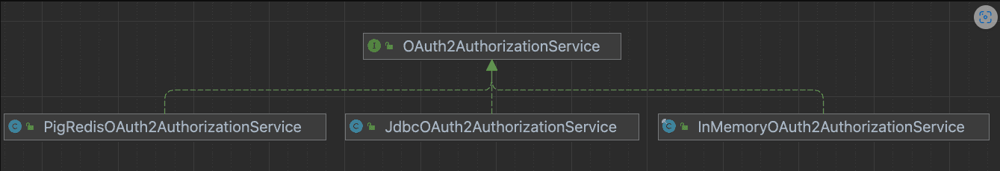

# [spring-authorization-server](https://blog.csdn.net/vaevaevae233/article/details/127027316)

* Java 1.8 支持

```xml
  <dependency>
      <groupId>io.springboot.security</groupId>
      <artifactId>spring-security-oauth2-authorization-server</artifactId>
      <version>0.3.0</version>
  </dependency>
```

* 授权模式扩展
  
    - 扩展支持短信登录

* Redis 令牌存储

- 官方目前没有提供基于 Redis 令牌持久化方案
- PIG 扩展 PigRedisOAuth2AuthorizationService 支持