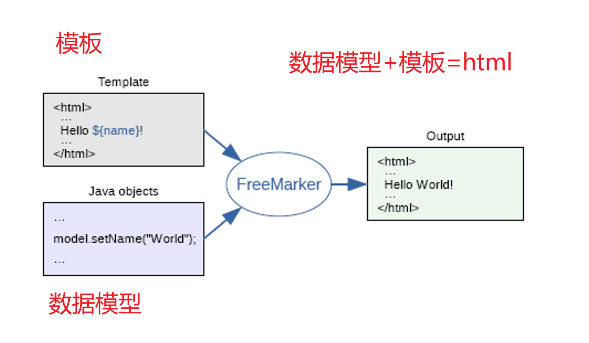
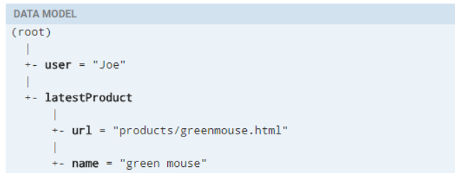
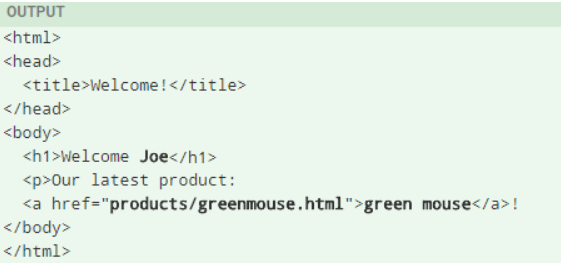
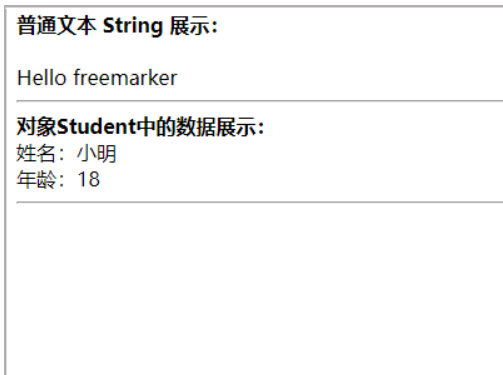

# Freemarker

## 1 freemarker 介绍

> Freemarker是一种流行的模板引擎，它能够将数据与模板相结合，生成动态的文本输出。
> 下面将简单介绍Freemarker的基本概念和使用方法。



常用的java模板引擎还有哪些？

Jsp、Freemarker、Thymeleaf 、Velocity 等。

| 模板引擎       | 特点                                | 优点                       | 缺点             |
|------------|-----------------------------------|--------------------------|----------------|
| FreeMarker | 基于模板和数据生成输出文本                     | 灵活、高性能、支持多种数据源、易于学习      | 语法繁琐           |
| Velocity   | 允许使用简单但功能强大的模板语言来引用Java代码中定义的对象   | 缓存机制好、语法简洁、易于理解          | 功能相对较少、文档较少    |
| Thymeleaf  | 主要渲染xml、HTML、HTML5而且与springboot整合 | 支持多种模板继承、易于扩展            | 性能不如FreeMarker |
| Beetl      | 功能强大、简洁易用                         | 性能高、支持多种数据源、多种标签、IDE插件丰富 | 学习成本较高、文档相对较少  |

1.Jsp 为 Servlet 专用，不能单独进行使用。

2.Thymeleaf 为新技术，功能较为强大，但是执行的效率比较低。

3.Velocity从2010年更新完 2.0 版本后，便没有在更新。Spring Boot 官方在 1.4 版本后对此也不在支持，虽然 Velocity 在 2017
年版本得到迭代，但为时已晚。

## 2  模板+数据模型=输出

- freemarker并不关心数据的来源，只是根据模板的内容，将数据模型在模板中显示并输出文件（通常为html，也可以生成其它格式的文本文件）

### 1、数据模型

数据模型在java中可以是基本类型也可以List、Map、Pojo等复杂类型。

### 2、来自官方的例子：（http://freemarker.foofun.cn/dgui_quickstart_basics.html）

数据模型：



模板：


输出：


## 3 环境搭建&&快速入门

freemarker作为springmvc一种视图格式，默认情况下SpringMVC支持freemarker视图格式。

需要创建Spring Boot+Freemarker工程用于测试模板。

### 1 创建测试工程

创建一个freemarker 的测试工程专门用于freemarker的功能测试与模板的测试。

pom.xml如下

```
<?xml version="1.0" encoding="UTF-8"?>
<project xmlns="http://maven.apache.org/POM/4.0.0"
         xmlns:xsi="http://www.w3.org/2001/XMLSchema-instance"
         xsi:schemaLocation="http://maven.apache.org/POM/4.0.0 http://maven.apache.org/xsd/maven-4.0.0.xsd">
    <modelVersion>4.0.0</modelVersion>

    <artifactId>test-freemarker</artifactId>
    <version>1.0-SNAPSHOT</version>
    <packaging>war</packaging>

    <!-- 添加springboot 父类依赖 -->
    <parent>
        <groupId>org.springframework.boot</groupId>
        <artifactId>spring-boot-starter-parent</artifactId>
        <version>2.3.2.RELEASE</version>
    </parent>

    <properties>
        <maven.compiler.source>8</maven.compiler.source>
        <maven.compiler.target>8</maven.compiler.target>
    </properties>

    <dependencies>

        <!--添加 spring boot web 依赖-->
        <dependency>
            <groupId>org.springframework.boot</groupId>
            <artifactId>spring-boot-starter-web</artifactId>
        </dependency>
        <dependency>
            <groupId>org.springframework.boot</groupId>
            <artifactId>spring-boot-starter-validation</artifactId>
        </dependency>

        <dependency>
            <groupId>org.springframework.boot</groupId>
            <artifactId>spring-boot-starter-freemarker</artifactId>
        </dependency>

        <dependency>
            <groupId>org.springframework.boot</groupId>
            <artifactId>spring-boot-starter-test</artifactId>
        </dependency>


        <!-- lombok使用 -->
        <dependency>
            <groupId>org.projectlombok</groupId>
            <artifactId>lombok</artifactId>
            <version>1.18.8</version>
            <scope>provided</scope>
        </dependency>

        <!-- apache 对 java io 的封装工具库 -->
        <dependency>
            <groupId>org.apache.commons</groupId>
            <artifactId>commons-io</artifactId>
            <version>1.3.2</version>
        </dependency>

    </dependencies>

</project>
```

### 2 配置文件

配置application.yml和 logback-spring.xml，从cms工程拷贝这两个文件，进行更改， logback-spring.xml无需更改，application.yml内容如下：

```
#spring boot 启动参数
server:
  port: 8881
  servlet:
    context-path: /freemarker

spring:
  application:
    name: test-freemarker #指定服务名
  freemarker:
    cache: false  #关闭模板缓存，方便测试
    settings:
      template_update_delay: 0 #检查模板更新延迟时间，设置为0表示立即检查，如果时间大于0会有缓存不方便进行模板测试
    suffix: .ftl               #指定Freemarker模板文件的后缀名
```

### 3 创建模型类

在freemarker的测试工程下创建模型类型用于测试

```
package com.xuecheng.freemarker.entity;

import lombok.Data;
import lombok.ToString;

import java.util.Date;
import java.util.List;

@Data
@ToString
public class Student {
    private String name;//姓名
    private int age;//年龄
    private Date birthday;//生日
    private Float money;//钱包
}
```

### 4 创建模板

在resources下创建templates，此目录为freemarker的默认模板存放目录。

在templates下创建模板文件 01-basic.ftl ，模板中的插值表达式最终会被freemarker替换成具体的数据。

```
<!DOCTYPE html>
<html>
<head>
    <meta charset="utf-8">
    <title>Hello World!</title>
</head>
<body>
<b>普通文本 String 展示：</b><br><br>
Hello  <br>

<hr>

<b>对象Student中的数据展示：</b><br/>
姓名：<br/>
年龄：
<hr>

</body>
</html>
```

### 5 创建controller

创建Controller类，向Map中添加name，最后返回模板文件。

```
package com.xuecheng.test.freemarker.controller;

import org.springframework.beans.factory.annotation.Autowired;
import org.springframework.stereotype.Controller;
import org.springframework.web.bind.annotation.RequestMapping;
import org.springframework.web.client.RestTemplate;

import java.util.Map;

@Controller
public class HelloController {

    @GetMapping("basic")
    public String test(Model model) {


        //1.纯文本形式的参数
        model.addAttribute("name", "freemarker");
        //2.实体类相关的参数
        
        Student student = new Student();
        student.setName("小明");
        student.setAge(18);
        model.addAttribute("stu", student);

        return "01-basic";
    }
}
```

### 6 创建启动类

```
@SpringBootApplication
public class FreemarkerTestApplication {
    public static void main(String[] args) {
        SpringApplication.run(FreemarkerTestApplication.class,args);
    }
}
```

### 7 测试

请求：http://localhost:8881/test/01-basic



## 4 freemarker基础

### 1 基础语法种类

1、注释，即<#-- -->，介于其之间的内容会被freemarker忽略

```
<#--我是一个freemarker注释-->
```

2、插值（Interpolation）：即 **${..}** 部分,freemarker会用真实的值代替**${..}**

```
Hello ${name}
```

3、FTL指令：和HTML标记类似，名字前加#予以区分，Freemarker会解析标签中的表达式或逻辑。

```
<# >FTL指令</#> 
```

4、文本，仅文本信息，这些不是freemarker的注释、插值、FTL指令的内容会被freemarker忽略解析，直接输出内容。

```
<#--freemarker中的普通文本-->
我是一个普通的文本
```

### 2 集合指令（List和Map）

#### 1、数据模型：

```
/**
 * 向Freemarker模型数据对象Map存放数据
 *    1.存放普通字符串 String
 *    2.存放对象数据 Student对象
 *    3.存放List集合 List<Student>
 *    4.存放Map集合  Map<String,Student>
 *
 * @param map  Map<String, Object> FreeMarker需要的Map模型对象
 * @return
 */
@GetMapping("list")
public String test(Model model) {
  
    
    Student student = new Student();
    student.setName("小明");
    student.setAge(18);

    //1.纯文本形式的参数
    model.addAttribute("name", "freemarker");
    //2.实体类相关的参数
    model.addAttribute("stu1", student);
    
    //2.1 小强对象模型数据
    Student stu1 = new Student();
    stu1.setName("小强");
    stu1.setAge(18);
    stu1.setMoney(1000.86f);
    stu1.setBirthday(new Date());

    //2.2 小红对象模型数据
    Student stu2 = new Student();
    stu2.setName("小红");
    stu2.setMoney(200.1f);
    stu2.setAge(19);

    //2.3 将两个对象模型数据存放到List集合中
    List<Student> stus = new ArrayList<>();
    stus.add(stu1);
    stus.add(stu2);

    //2.4 向model中存放List集合数据
    model.addAttribute("stus",stus);
    
   
    
    //3. 创建Map数据
    HashMap<String,Student> stuMap = new HashMap<>();
    stuMap.put("stu1",stu1);
    stuMap.put("stu2",stu2);
    // 3.1 向model中存放Map数据
    model.addAttribute("stuMap", stuMap);
    
    
    
    
   //返回模板文件名称
   return "02-list";
}
```

#### 2、模板：

```
<!DOCTYPE html>
<html>
<head>
    <meta charset="utf-8">
    <title>Hello World!</title>
</head>
<body>
    
<#-- list 数据的展示 -->
<b>展示list中的stu数据:</b>
<br>
<br>
<table>
    <tr>
        <td>序号</td>
        <td>姓名</td>
        <td>年龄</td>
        <td>钱包</td>
    </tr>
</table>
<hr>
    
<#-- Map 数据的展示 -->
<b>map数据的展示：</b>
<br/><br/>
<a href="###">方式一：通过map['keyname'].property</a><br/>
输出stu1的学生信息：<br/>
姓名：<br/>
年龄：<br/>
<br/>
<a href="###">方式二：通过map.keyname.property</a><br/>
输出stu2的学生信息：<br/>
姓名：<br/>
年龄：<br/>

<br/>
<a href="###">遍历map中两个学生信息：</a><br/>
<table>
    <tr>
        <td>序号</td>
        <td>姓名</td>
        <td>年龄</td>
        <td>钱包</td>
    </tr>
</table>
<hr>
 
</body>
</html>
```

实例代码：

```
<!DOCTYPE html>
<html>
<head>
    <meta charset="utf-8">
    <title>Hello World!</title>
</head>
<body>
    
<#-- list 数据的展示 -->
<b>展示list中的stu数据:</b>
<br>
<br>
<table>
    <tr>
        <td>序号</td>
        <td>姓名</td>
        <td>年龄</td>
        <td>钱包</td>
    </tr>
    <#list stus as stu>
        <tr>
            <td>${stu_index+1}</td>
            <td>${stu.name}</td>
            <td>${stu.age}</td>
            <td>${stu.money}</td>
        </tr>
    </#list>

</table>
<hr>
    
<#-- Map 数据的展示 -->
<b>map数据的展示：</b>
<br/><br/>
<a href="###">方式一：通过map['keyname'].property</a><br/>
输出stu1的学生信息：<br/>
姓名：${stuMap['stu1'].name}<br/>
年龄：${stuMap['stu1'].age}<br/>
<br/>
<a href="###">方式二：通过map.keyname.property</a><br/>
输出stu2的学生信息：<br/>
姓名：${stuMap.stu2.name}<br/>
年龄：${stuMap.stu2.age}<br/>

<br/>
<a href="###">遍历map中两个学生信息：</a><br/>
<table>
    <tr>
        <td>序号</td>
        <td>姓名</td>
        <td>年龄</td>
        <td>钱包</td>
    </tr>
    <#list stuMap?keys as key >
        <tr>
            <td>${key_index}</td>
            <td>${stuMap[key].name}</td>
            <td>${stuMap[key].age}</td>
            <td>${stuMap[key].money}</td>
        </tr>

    </#list>
</table>
<hr>
 
</body>
</html>
```

👆上面代码解释：

${k_index}： index：得到循环的下标，使用方法是在stu后边加"_index"，它的值是从0开始

### 3、if指令:

 	 if 指令即判断指令，是常用的FTL指令，freemarker在解析时遇到if会进行判断，条件为真则输出if中间的内容，否则跳过内容不再输出。

- 指令格式

```
<#if condition>
      ...
    <#elseif condition2>
      ...
    <#elseif condition3>
      ...
    ...
    <#else>
      ...
</#if>
```

#### 1、数据模型：

使用list指令中测试数据模型，判断名称为小强的数据字体显示为红色。

#### 2、模板：

```
<table>
    <tr>
        <td>姓名</td>
        <td>年龄</td>
        <td>钱包</td>
    </tr>

    <tr>
        <td ></td>
        <td></td>
        <td ></td>
    </tr>


</table>
```

实例代码：

```
<table>
    <tr>
        <td>姓名</td>
        <td>年龄</td>
        <td>钱包</td>
    </tr>
    <#list stus as stu >
        <#if stu.name='小红'>
            <tr style="color: red">
                <td>${stu_index}</td>
                <td>${stu.name}</td>
                <td>${stu.age}</td>
                <td>${stu.money}</td>
            </tr>
            <#else >
            <tr>
                <td>${stu_index}</td>
                <td>${stu.name}</td>
                <td>${stu.age}</td>
                <td>${stu.money}</td>
            </tr>
        </#if>
    </#list>
</table>
```

#### 3、输出：

姓名为“小强”则字体颜色显示为红色。


### 4 、 运算符:

#### 1、算数运算符

FreeMarker表达式中完全支持算术运算,FreeMarker支持的算术运算符包括:

- 加法： +

- 减法： -

- 乘法： *

- 除法： /

- 求模 (求余)： %

模板代码

```
<b>算数运算符</b>
<br/><br/>
    100+5 运算：  ${100 + 5 }<br/>
    100 - 5 * 5运算：${100 - 5 * 5}<br/>
    5 / 2运算：${5 / 2}<br/>
    12 % 10运算：${12 % 10}<br/>
<hr>
```

除了 + 运算以外，其他的运算只能和 number 数字类型的计算。

#### 2、比较运算符

- **=**或者**==**:判断两个值是否相等.

- **!=**:判断两个值是否不等.

- **>**或者**gt**:判断左边值是否大于右边值

- **>=**或者**gte**:判断左边值是否大于等于右边值

- **<**或者**lt**:判断左边值是否小于右边值

- **<=**或者**lte**:判断左边值是否小于等于右边值

= 和 == 模板代码

```
<!DOCTYPE html>
<html>
<head>
    <meta charset="utf-8">
    <title>Hello World!</title>
</head>
<body>

    <b>比较运算符</b>
    <br/>
    <br/>

    <dl>
        <dt> =/== 和 != 比较：</dt>
        <dd>
            <#if "xiaoming" == "xiaoming">
                字符串的比较 "xiaoming" == "xiaoming"
            </#if>
        </dd>
        <dd>
            <#if 10 != 100>
                数值的比较 10 != 100
            </#if>
        </dd>
    </dl>


    <dl>
        <dt>其他比较</dt>
        <dd>
            <#if 10 gt 5 >
                形式一：使用特殊字符比较数值 10 gt 5
            </#if>
        </dd>
        <dd>
            <#-- 日期的比较需要通过?date将属性转为data类型才能进行比较 -->
            <#if (date1?date >= date2?date)>
                形式二：使用括号形式比较时间 date1?date >= date2?date
            </#if>
        </dd>
    </dl>

    <br/>
<hr>
</body>
</html>
```

Controller 的 数据模型代码

```
@GetMapping("operation")
public String testOperation(Model model) {
    //构建 Date 数据
    Date now = new Date();
    model.addAttribute("date1", now);
    model.addAttribute("date2", now);
    
    return "03-operation";
}
```

**比较运算符注意**

- **=**和**!=**可以用于字符串、数值和日期来比较是否相等

- **=**和**!=**两边必须是相同类型的值,否则会产生错误

- 字符串 **"x"** 、**"x "** 、**"X"**比较是不等的.因为FreeMarker是精确比较

- 其它的运行符可以作用于数字和日期,但不能作用于字符串

- 使用**gt**等字母运算符代替**>**会有更好的效果,因为 FreeMarker会把**>**解释成FTL标签的结束字符

- 可以使用括号来避免这种情况,如:**<#if (x>y)>**

#### 3、逻辑运算符

- 逻辑与:&&

- 逻辑或:||

- 逻辑非:!

逻辑运算符只能作用于布尔值,否则将产生错误 。

模板代码

```
<b>逻辑运算符</b>
    <br/>
    <br/>
    <#if (10 lt 12 )&&( 10  gt  5 )  >
        (10 lt 12 )&&( 10  gt  5 )  显示为 true
    </#if>
    <br/>
    <br/>
    <#if !false>
        false 取反为true
    </#if>
<hr>
```

### 5、 空值处理

Freemarker 在显示数据时，如果遇到了null或空，Freemarker就会在显示页面中报出错误信息：null or missing，

Freemarker中需要对空值间判断，判断后的数据就不会显示错误信息。

#### 1、判断某变量是否存在使用 “??”

用法为:variable??,如果该变量存在,返回true,否则返回false

例：为防止stus为空报错可以加上判断如下：

```
    <#if stus??>
    <#list stus as stu>
        ......
    </#list>
    </#if>
```

#### 2、缺失变量默认值使用 “!”

- 使用!要以指定一个默认值，当变量为空时显示默认值

- 例： ${name!''}表示如果name为空显示空字符串。

- 如果是嵌套对象则建议使用（）括起来

- 例： ${(stu.bestFriend.name)!''}表示，如果stu或bestFriend或name为空默认显示空字符串。

### 6、 内建函数

内建函数语法格式： **变量+?+函数名称**

#### 1、和到某个集合的大小

**${集合名?size}**

#### 2、日期格式化

显示年月日: **${today?date}**  显示时分秒：**${today?time}**    显示日期+时间：**${today?datetime}**    自定义格式化：  *
*${today?string("yyyy年MM月")}**

只支持Java中的java.util.Date生效

#### 3、内建函数**c**

model.addAttribute("point", 102920122);

point是数字型，使用${point}会显示这个数字的值，每三位使用逗号分隔。

如果不想显示为每三位分隔的数字，可以使用c函数将数字型转成字符串输出

**${point?c}**

#### 4、将json字符串转成对象

一个例子：

其中用到了 assign标签，assign的作用是定义一个变量。

```
<#assign text="{'bank':'工商银行','account':'10101920201920212'}" />
<#assign data=text?eval />
开户行：${data.bank}  账号：${data.account}
```

模板代码：

```
<!DOCTYPE html>
<html>
<head>
    <meta charset="utf-8">
    <title>inner Function</title>
</head>
<body>

    <b>获得集合大小</b><br>

    集合大小：
    <hr>


    <b>获得日期</b><br>

    显示年月日:      <br>

    显示时分秒：<br>

    显示日期+时间：<br>

    自定义格式化：  <br>

    <hr>

    <b>内建函数C</b><br>
    没有C函数显示的数值： <br>

    有C函数显示的数值：

    <hr>

    <b>声明变量assign</b><br>


<hr>
</body>
</html>
```

内建函数模板页面：

```
<!DOCTYPE html>
<html>
<head>
    <meta charset="utf-8">
    <title>inner Function</title>
</head>
<body>

    <b>获得集合大小</b><br>

    集合大小：${stus?size}
    <hr>


    <b>获得日期</b><br>

    显示年月日: ${today?date}       <br>

    显示时分秒：${today?time}<br>

    显示日期+时间：${today?datetime}<br>

    自定义格式化：  ${today?string("yyyy年MM月")}<br>

    <hr>

    <b>内建函数C</b><br>
    没有C函数显示的数值：${point} <br>

    有C函数显示的数值：${point?c}

    <hr>

    <b>声明变量assign</b><br>
    <#assign text="{'bank':'工商银行','account':'10101920201920212'}" />
    <#assign data=text?eval />
    开户行：${data.bank}  账号：${data.account}

<hr>
</body>
</html>
```

内建函数Controller数据模型：

```
@GetMapping("innerFunc")
public String testInnerFunc(Model model) {
    //1.1 小强对象模型数据
    Student stu1 = new Student();
    stu1.setName("小强");
    stu1.setAge(18);
    stu1.setMoney(1000.86f);
    stu1.setBirthday(new Date());
    //1.2 小红对象模型数据
    Student stu2 = new Student();
    stu2.setName("小红");
    stu2.setMoney(200.1f);
    stu2.setAge(19);
    //1.3 将两个对象模型数据存放到List集合中
    List<Student> stus = new ArrayList<>();
    stus.add(stu1);
    stus.add(stu2);
    model.addAttribute("stus", stus);
    // 2.1 添加日期
    Date date = new Date();
    model.addAttribute("today", date);
    // 3.1 添加数值
    model.addAttribute("point", 102920122);
    return "04-innerFunc";
}
```

## 5、 静态化测试

之前的测试都是SpringMVC将Freemarker作为视图解析器（ViewReporter）来集成到项目中，工作中，有的时候需要使用Freemarker原生Api来生成静态内容并使用文件来存储静态化后的内容，下面一起来学习下原生Api生成文本文件。

### 1需求分析

使用freemarker原生Api将页面生成html文件，本节测试html文件生成的方法：

#### 1、根据模板文件生成html文件

 	模板文件 + 数据模型 = 静态文件 

#### 2、根据模板字符串生成html文件

        模板字符串 + 数据模型 = 静态文件 

### 2 静态化测试

#### 1、根据模板文件生成html文件

在test下创建测试类，并且将main下的resource/templates拷贝到test下，本次测试使用之前我们在main下创建的模板文件。

```
@Test
public void testHtml01() throws IOException, TemplateException {
    // 1.创建配置类信息
    Configuration configuration = new Configuration(Configuration.getVersion());
    
    // 2.对配置类进行配置
    String path = this.getClass().getResource("/templates/").getPath();
    configuration.setDirectoryForTemplateLoading(new File(path));
    configuration.setDefaultEncoding("utf-8");
    
    // 3.获得模板文件对象
    Template template = configuration.getTemplate("index.ftl");
    
    // 4.获得数据模型
    Map data = getData();
    // 5.静态化操作
    String content = FreeMarkerTemplateUtils.processTemplateIntoString(template, data);
    
    
   
    InputStream inputStream = IOUtils.toInputStream(content);
    FileOutputStream outputStream = new FileOutputStream(new File("d:/index.html"));
    IOUtils.copy(inputStream, outputStream);
}
```

getMap()方法是获取数据模型的方法：

```
private Map getData() {
        Map<String, Object> map = new HashMap<>();
        Student student = new Student();
        student.setName("小明");
        student.setAge(18);

        //1.纯文本形式的参数
        map.put("name", "freemarker");
        //2.实体类相关的参数
        map.put("stu1", student);

        //2.1 小强对象模型数据
        Student stu1 = new Student();
        // stu1.setName("小强");
        stu1.setAge(18);
        stu1.setMoney(1000.86f);
        stu1.setBirthday(new Date());

        //2.2 小红对象模型数据
        Student stu2 = new Student();
        stu2.setName("小红");
        stu2.setMoney(200.1f);
        stu2.setAge(19);

        //2.3 将两个对象模型数据存放到List集合中
        List<Student> stus = new ArrayList<>();
        stus.add(stu1);
        stus.add(stu2);

        //2.4 向map中存放List集合数据
        map.put("stus", stus);


        //3. 创建Map数据
        HashMap<String, Student> stuMap = new HashMap<>();
        stuMap.put("stu1", stu1);
        stuMap.put("stu2", stu2);
        // 3.1 向map中存放Map数据
        map.put("stuMap", stuMap);

        HashMap<String, Student> stuMapTest = new HashMap<>();
        stuMapTest.put("stu.name", stu1);
        map.put("stuMapTest", stuMapTest);

        //返回Map
        return map;
    }
```

#### 2、根据模板字符串生成html文件

```
@Test
public void testHtml02() throws IOException, TemplateException {
    // 1.创建配置类信息
    Configuration configuration = new Configuration(Configuration.getVersion());
    
    
    // 2.对配置类进行配置
    //2.1 获得字符串模板内容
    String template = "" +
            "<html>\n" +
            "    <head></head>\n" +
            "    <body>\n" +
            "    名称：${name}\n" +
            "    </body>\n" +
            "</html>";
    //2.2 创建出字符串模板加载器
    StringTemplateLoader stringTemplateLoader = new StringTemplateLoader();
    stringTemplateLoader.putTemplate("template", template);
    configuration.setTemplateLoader(stringTemplateLoader);
    
    // 3.获得模板文件对象
    Template configurationTemplate = configuration.getTemplate("template","utf-8");
    // 4.获得数据模型
    Map data = getData();
   
    // 5.静态化操作
    String content = FreeMarkerTemplateUtils.processTemplateIntoString(configurationTemplate, data);
    InputStream inputStream = IOUtils.toInputStream(content);
    FileOutputStream outputStream = new FileOutputStream(new File("d:/index.html"));
    IOUtils.copy(inputStream, outputStream);
}
```

## 6 Freemaker 小节

Freemaker 生成静态化的方式：

 	1.SpringMVC+Freemarker
 	
 		SpringMVC将Freemarker作为视图解析器
 	
 		生成的文件位置：在内存中
 	
 		项目中使用的场景：课程预览
 	
 	2.Freemarker的原生API
 	
 		生成的文件位置：制定文件生成的位置
 	
 		API生成的文件形式：
 	
 			1.模板文件+数据模型
 	
 			2.模板字符串+数据模型
 	
 		项目中使用的场景：课程发布