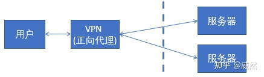
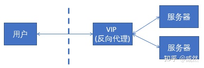
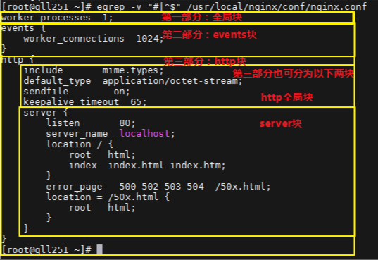

# Nginx使用说明

## 正反代理


**Nginx** **(engine x)** 是一款轻量级的Web 服务器 、反向代理服务器及电子邮件（IMAP/POP3）代理服务器。


**反向代理：**

反向代理（Reverse Proxy）方式是指以代理服务器来接受internet上的连接请求，然后将请求转发给内部网络上的服务器，并将从服务器上得到的结果返回给internet上请求连接的客户端，此时代理服务器对外就表现为一个反向代理服务器。

**正向代理:**

是一个位于客户端和原始服务器(origin server)之间的服务器，为了从原始服务器取得内容，客户端向代理发送一个请求并指定目标(原始服务器)，然后代理向原始服务器转交请求并将获得的内容返回给客户端。客户端才能使用正向代理。


### 正向代理和反向代理区别？

**正向代理**，**是在客户端的。**比如需要访问某些国外网站，我们可能需要购买vpn。并且**vpn是在我们的用户浏览器端设置的**(并不是在远端的服务器设置)。浏览器先访问vpn地址，vpn地址转发请求，并最后将请求结果原路返回来。





**反向代理是作用在服务器端的，是一个虚拟ip(VIP)**。对于用户的一个请求，会转发到多个后端处理器中的一台来处理该具体请求。




## 目录结构

```
├── conf                                这是nginx所有配置文件的目录
│   ├── fastcgi.conf                    fastcgi 相关参数的配置文件
│   ├── fastcgi.conf.default         	fastcgi.conf 的原始备份
│   ├── fastcgi_params               	fastcgi的参数文件
│   ├── fastcgi_params.default
│   ├── koi-utf
│   ├── koi-win
│   ├── mime.types                   	媒体类型
│   ├── mime.types.default
│   ├── nginx.conf                   	nginx默认的主配置文件
│   ├── nginx.conf.default
│   ├── scgi_params                  	scgi 相关参数文件
│   ├── scgi_params.default
│   ├── uwsgi_params                 	uwsgi相关参数文件
│   ├── uwsgi_params.default
│   └── win-utf
├── fastcgi_temp                        fastcgi临时数据目录
├── html                                这是编译安装时nginx的默认站点目录，类似Apache的默认站点htdocs  
│   ├── 50x.html                        错误页面优雅替代显示文件，例如：出现502错误时会调用此页面error_page 500 502 503 504 /50x.html
│   └── index.html                      默认的首页文件，index.html\index.asp\index.jsp来做网站的首页文件
├── logs                                nginx默认的日志路径，包括错误日志及访问日志
│   ├── access.log                      nginx的默认访问日志文件，使用tail -f access.log,可以实时观看网站的用户访问情况信息
│   ├── error.log                       nginx的错误日志文件，如果nginx出现启动故障可以查看此文件
│   └── nginx.pid                       nginx的pid文件，nginx进程启动后，会把所有进程的ID号写到此文件
├── nginx-1.6.3 -> /application/nginx-1.6.3
├── proxy_temp                          临时目录
├── sbin                                这是nginx命令的目录，如nginx的启动命令nginx
│   ├── nginx                           Nginx的启动命令nginx
│   └── nginx.old
├── scgi_temp                           临时目录
└── uwsgi_temp                          临时目录

```
## 安装
```
yum install nginx -y

# 更新
yum update nginx

#启动
systemctl start nginx

#重启
systemctl restart nginx

#测试配置文件语法是否正确
nginx -t

#重载配置文件
systemctl reload nginx

#关闭
systemctl stop nginx

#开机自启
systemctl enable nginx

#禁止开机自启
systemctl diasble nginx
```

## 卸载
```
# 查找所有目录
find / -name nginx

# 删除数据
rm -rf /etc/nginx /usr/share/nginx /usr/lib64/nginx /var/lib/nginx

# 删除数据
yum remove nginx
```
## 常用命令

windows下 需要带上exe `./nginx.exe -s stop`

```
start nginx   启动nginx
nginx -c /etc/nginx/nginx.conf 重新加载配置文件
nginx -s stop 快速关闭Nginx，可能不保存相关信息，并迅速终止web服务。 
nginx -s quit 平稳关闭Nginx，保存相关信息，有安排的结束web服务。 
nginx -s reload 因改变了Nginx相关配置，需要重新加载配置而重载。 
nginx -s reopen 重新打开日志文件。
nginx -c filename 为 Nginx 指定一个配置文件，来代替缺省的。 
nginx -t 不运行，而仅仅测试配置文件。nginx 将检查配置文件的语法的正确性，并尝试打开配置文件中所引用到的文件。 
nginx -v 显示 nginx 的版本。 
nginx -V 显示 nginx 的版本，编译器版本和配置参数
```


## nginx.conf主配制文件说明


### 全局块配置

```
## 全局块配置：配置影响nginx全局的指令。一般有运行nginx服务器的用户组，nginx进程pid存放路径，日志存放路径，配置文件引入，允许生成worker process数等。
#运行用户
#user  nobody;
#启动进程,通常设置成和cpu的数量相等
worker_processes  1;

#全局错误日志 级别以此为:debug|info|notice|warn|error|crit|alert|emerg
#error_log  logs/error.log;
#error_log  logs/error.log  notice;
#error_log  logs/error.log  info;

#指定nginx进程运行文件存放地址
#pid        logs/nginx.pid;
```

### events(事件)块配置

```
## events(事件)块配置：配置影响nginx服务器或与用户的网络连接。有每个进程的最大连接数，选取哪种事件驱动模型处理连接请求，是否允许同时接受多个网路连接，开启多个网络连接序列化等。
#工作模式及连接数上限
events {
	accept_mutex on;   #设置网路连接序列化，防止惊群现象发生，默认为on
	multi_accept on;  #设置一个进程是否同时接受多个网络连接，默认为off
    #epoll是多路复用IO(I/O Multiplexing)中的一种方式,但是仅用于linux2.6以上内核,可以大大提高nginx的性能
    use   epoll;#事件驱动模型，select|poll|kqueue|epoll|resig|/dev/poll|eventport
    #单个后台worker process进程的最大并发链接数(早期是512)
    worker_connections  1024;
}
```

### http块配置

`可以嵌套多个server，配置代理，缓存，日志定义等绝大多数功能和第三方模块的配置。`

```
## http块配置: 可以嵌套多个server，配置代理，缓存，日志定义等绝大多数功能和第三方模块的配置。如文件引入，mime-type定义，日志自定义，是否使用sendfile传输文件，连接超时时间，单连接请求数等。
#设定http服务器，利用它的反向代理功能提供负载均衡支持
http {
	#设定mime类型,类型由mime.type文件定义
    include       mime.types;
    #默认文件类型(流)类型，支持很多文件、图片、js/css等
    default_type  application/octet-stream;

	#自定义格式
    #log_format  main  '$remote_addr - $remote_user [$time_local] "$request" '
    #                  '$status $body_bytes_sent "$http_referer" '
    #                  '"$http_user_agent" "$http_x_forwarded_for"';

	#设定日志格式
    #access_log  logs/access.log  main;

    #优化参数 允许sendfile方式传输文件，开启高校效传输模式
    sendfile        on;

    #防止网络阻塞
    #tcp_nopush     on;

	#连接超时时间(秒)
    #keepalive_timeout  0;
    keepalive_timeout  65;
	# keepalive_requests 8192; --每个连接最大请求数

	#开启gzip压缩
    #gzip  on;

	#设定负载均衡的服务器列表
     upstream mysvr {
        #weigth参数表示权值，权值越高被分配到的几率越大
        #本机上的Squid开启3128端口
        server 127.0.0.1:3128 weight=5;
        server 127.0.0.1:80  weight=1;
        server 127.0.0.1:80  weight=6;
    }

    ## server块配置：配置虚拟主机的相关参数，一个http中可以有多个server。
    #配置虚拟主机
    server {
            listen       80;  #配置监听端口
            server_name  localhost;  #配置服务器名

            #charset koi8-r;  #编码格式

            #access_log  logs/host.access.log  main; //主机的访问日志（如没有，全局为准）
    		#默认的匹配/请求，当访问路径中有/，会被该location匹配处理
            location / {
                root   html; #root是配置服务器的默认网站根目录位置，在nginx目录下html
                index  index.html index.htm;
            }

            #error_page  404              /404.html; #配置404页面

            # redirect server error pages to the static page /50x.html
            #
            error_page   500 502 503 504  /50x.html; #配置50x页面
            location = /50x.html {  #精确匹配
                root   html;
            }


    		#禁止(外网）访问 .htaccess文件
            # deny access to .htaccess files, if Apache's document root
            # concurs with nginx's one
            #
            #location ~ /\.ht {
            #    deny  all;
            #}
    }


    ## server2块配置: 和上方很类似，主要是配置另一个虚拟机信息
    #
    #server {
    #    listen       8000;
    #    listen       somename:8080;
    #    server_name  somename  alias  another.alias;

    #    location / {
    #        root   html;
    #        index  index.html index.htm;
    #    }
    #}


    # 配置https服务
    #
    #server {
    #    listen       443 ssl;
    #    server_name  localhost;

    #    ssl_certificate      cert.pem;
    #    ssl_certificate_key  cert.key;

    #    ssl_session_cache    shared:SSL:1m;
    #    ssl_session_timeout  5m;

    #    ssl_ciphers  HIGH:!aNULL:!MD5;
    #    ssl_prefer_server_ciphers  on;

    #    location / {
    #        root   html;
    #        index  index.html index.htm;
    #    }
    #}

}

```

## server配置详情

```
#配置虚拟主机
    server {
            listen       80 ssl;  #配置监听端口
            server_name  study-tao.top 127.0.0.1;  #配置服务器名,域名或IP
            # 证书实际位置
            ssl_certificate /usr/local/nginx/cert/1_folio.codingce.com.cn_bundle.crt;
            ssl_certificate_key /usr/local/nginx/cert/2_folio.codingce.com.cn.key;
            ssl_session_timeout 5m;
            ssl_protocols TLSv1 TLSv1.1 TLSv1.2; 
            #请按照以下套件配置，配置加密套件，写法遵循 openssl 标准。
            ssl_ciphers ECDHE-RSA-AES128-GCM-SHA256:HIGH:!aNULL:!MD5:!RC4:!DHE; 
            ssl_prefer_server_ciphers on;
            
            charset utf-8;  #编码格式

            #access_log  logs/host.access.log  main; //主机的访问日志（如没有，全局为准）
    		#默认的匹配/请求，当访问路径中有/，会被该location匹配处理
            location / {
                root   html; #root是配置服务器的默认网站根目录位置，在nginx目录下html
                index  index.html index.htm;
            }
            
            location / {
                proxy_pass http://127.0.0.1:81/;
            }
            location /xxl-job-admin {
                proxy_pass http://127.0.0.1:8001/xxl-job-admin;
            }
            location /nacos {
                proxy_pass http://127.0.0.1:8848/nacos;
            }
            location /frp {
                proxy_pass http://127.0.0.1:7500;
            }
            location /docker {
                proxy_pass http://127.0.0.1:9000;
            }
            location /?token=admin {
                proxy_pass http://127.0.0.1:8887/?token=admin;
            }

    }
```

## 配置完成后，检查一下nginx配置文件是否可用，有successful表示可用。

```
nginx -t // 检查nginx配置文件
```
location / {
proxy_pass http://127.0.0.1:5580/;
}


## 问题一

`nginx   404 page not found`

### 解决思路

把错误定位为：找不到动态接口，但是不知道是项目中出现了问题，还是经[nginx](https://so.csdn.net/so/search?q=nginx&spm=1001.2101.3001.7020)代理后出现了问题。
因此要分别测试 项目本身的接口 和 nginx代理后的接口。

配置动态访问api的时候，记得在路径和链接最后加上斜杠

```
location /docker/ {
        proxy_pass http://127.0.0.1:9000/;
 }
```


## 完整配置
```
## 全局块配置：配置影响nginx全局的指令。一般有运行nginx服务器的用户组，nginx进程pid存放路径，日志存放路径，配置文件引入，允许生成worker process数等。
#运行用户
#user  nobody;
#启动进程,通常设置成和cpu的数量相等
worker_processes  1;

#全局错误日志 级别以此为:debug|info|notice|warn|error|crit|alert|emerg
#error_log  logs/error.log;
#error_log  logs/error.log  notice;
#error_log  logs/error.log  info;

#指定nginx进程运行文件存放地址
#pid        logs/nginx.pid;


## events(事件)块配置：配置影响nginx服务器或与用户的网络连接。有每个进程的最大连接数，选取哪种事件驱动模型处理连接请求，是否允许同时接受多个网路连接，开启多个网络连接序列化等。
#工作模式及连接数上限
events {
	accept_mutex on;   #设置网路连接序列化，防止惊群现象发生，默认为on
	multi_accept on;  #设置一个进程是否同时接受多个网络连接，默认为off
    #epoll是多路复用IO(I/O Multiplexing)中的一种方式,但是仅用于linux2.6以上内核,可以大大提高nginx的性能
    use   epoll;#事件驱动模型，select|poll|kqueue|epoll|resig|/dev/poll|eventport
    #单个后台worker process进程的最大并发链接数(早期是512)
    worker_connections  1024;
}


## http块配置: 可以嵌套多个server，配置代理，缓存，日志定义等绝大多数功能和第三方模块的配置。
#设定http服务器，利用它的反向代理功能提供负载均衡支持
http {
	#设定mime类型,类型由mime.type文件定义
    include       mime.types;
    #默认文件类型(流)类型，支持很多文件、图片、js/css等
    default_type  application/octet-stream;

	#自定义格式
    #log_format  main  '$remote_addr - $remote_user [$time_local] "$request" '
    #                  '$status $body_bytes_sent "$http_referer" '
    #                  '"$http_user_agent" "$http_x_forwarded_for"';

	#设定日志格式
    #access_log  logs/access.log  main;

    #优化参数 允许sendfile方式传输文件，开启高校效传输模式
    sendfile        on;

    #防止网络阻塞
    #tcp_nopush     on;

	#连接超时时间(秒)
    #keepalive_timeout  0;
    keepalive_timeout  65;
	# keepalive_requests 8192; --每个连接最大请求数

	#开启gzip压缩
    #gzip  on;

	#设定负载均衡的服务器列表
     upstream mysvr {
        #weigth参数表示权值，权值越高被分配到的几率越大
        #本机上的Squid开启3128端口
        server 127.0.0.1:3128 weight=5;
        server 127.0.0.1:80  weight=1;
        server 127.0.0.1:80  weight=6;
    }

    ## server块配置：配置虚拟主机的相关参数，一个http中可以有多个server。
    #配置虚拟主机
    server {
            listen       80;  #配置监听端口
            server_name  localhost;  #配置服务器名

            #charset koi8-r;  #编码格式

            #access_log  logs/host.access.log  main; //主机的访问日志（如没有，全局为准）
    		#默认的匹配/请求，当访问路径中有/，会被该location匹配处理
            location / {
                root   html; #root是配置服务器的默认网站根目录位置，在nginx目录下html
                index  index.html index.htm;
            }

            #error_page  404              /404.html; #配置404页面

            # redirect server error pages to the static page /50x.html
            #
            error_page   500 502 503 504  /50x.html; #配置50x页面
            location = /50x.html {  #精确匹配
                root   html;
            }


    		#禁止(外网）访问 .htaccess文件
            # deny access to .htaccess files, if Apache's document root
            # concurs with nginx's one
            #
            #location ~ /\.ht {
            #    deny  all;
            #}
    }


    ## server2块配置: 和上方很类似，主要是配置另一个虚拟机信息
    #
    #server {
    #    listen       8000;
    #    listen       somename:8080;
    #    server_name  somename  alias  another.alias;

    #    location / {
    #        root   html;
    #        index  index.html index.htm;
    #    }
    #}


    # 配置https服务
    #
    #server {
    #    listen       443 ssl;
    #    server_name  localhost;

    #    ssl_certificate      cert.pem;
    #    ssl_certificate_key  cert.key;

    #    ssl_session_cache    shared:SSL:1m;
    #    ssl_session_timeout  5m;

    #    ssl_ciphers  HIGH:!aNULL:!MD5;
    #    ssl_prefer_server_ciphers  on;

    #    location / {
    #        root   html;
    #        index  index.html index.htm;
    #    }
    #}

}

```