# Redis高级

## 画图

### Redis6常用命令


### rediscluster集群原理
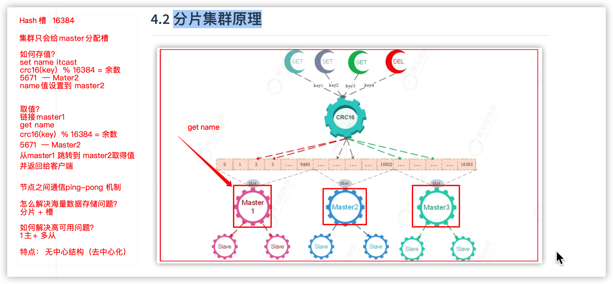


### Redis大纲
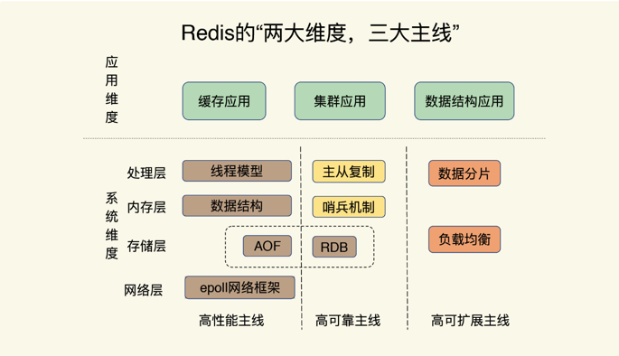


### Redis集群
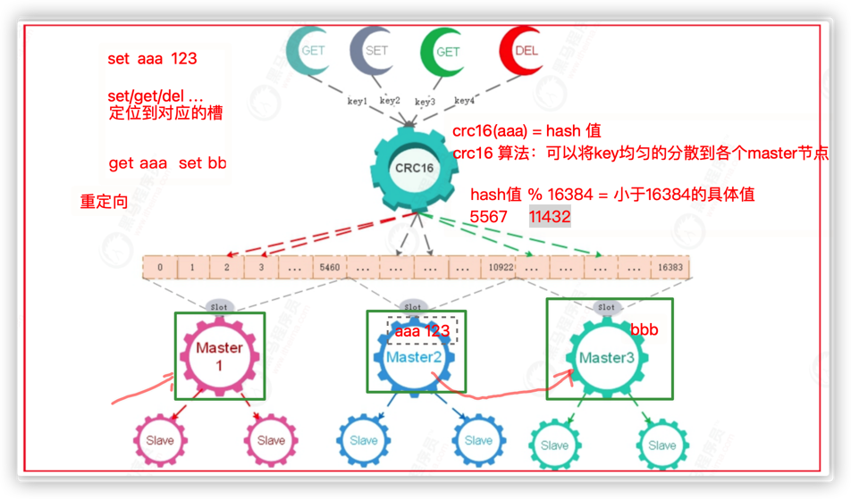

* 理解Redis**事务**机制
* 掌握Redis**持久化**机制
* 理解Redis**高可用** — 主从复制、哨兵模式
* 理解Redis**高可扩** — Redis Cluster数据分片
* 掌握Redis**过期删除**策略
* 掌握Redis**内存淘汰策略**
* 了解Redis6.X新特性

# 1 事务机制

## 1.1 场景分析

以关注为例，在B站上程序员A关注了程序员B，同时程序员B也关注了程序员A，那么两者之间就形成了互相关注，互为粉丝的关系。

如果要通过Redis描述这种关系的话，最好的数据类型就是set， 每个用户定义两个set集合，分别用于描述我的关注和我的粉丝：

```sh
#我的关注 user:用户id:follow 被关注的用户id
#我的粉丝 user:用户id:fans 粉丝用户id

#程序员A用户为1001 ， 程序员B用户id为1002
sadd user:1001:follow 1002
sadd user:1001:fans 1002

sadd user:1002:follow 1001
sadd user:1002:fans 1002
```

	但是假设在执行四条指令的过程中，某一条指令出现错误运行失败，就会有可能出现A关注了B，而B的粉丝里没有A，以及相类似的情况。

## 1.2 事务介绍

Redis是支持事务的， 对于上述问题可以通过事务控制解决。 

举一个事务的经典例子：转账

* A给B汇款，那么A账户会扣钱
* B账户会加钱

这两个步骤一定会存在于一个事务中，要么都成功，要么都失败。

Redis事务是基于队列实现的，创建一个事务队列，然后将事务操作都放入队列中，最后依次执行。

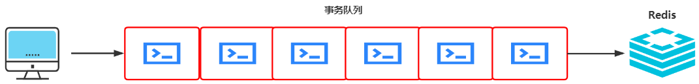


```sh
#开启事务
multi

#添加命令
sadd user:1001:follow 1002
sadd user:1002:follow 1001


sadd user:1001:fans 1002
sadd user:1002:fans 1002

#执行事务
exec
# 取消事务
discard
```

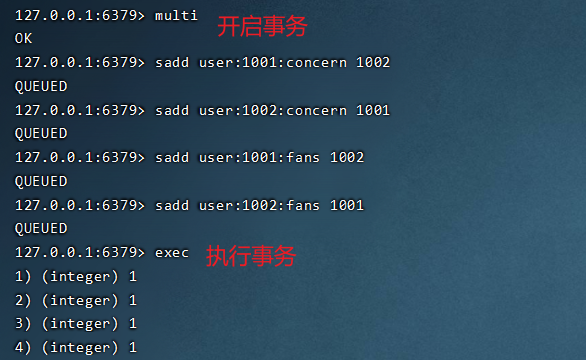

## 1.3 事务处理机制

假设这四条指令在事务执行中，某一条命令执行出错， 此时事务会如何处理呢？ 现在可能很多人会说，刚才不是已经说了嘛，要么都成功，要么都失败， 有一个出错，那就都失败呗。 

这么想不能算错，但是Redis对于命令执行错误处理，有两种解决方式：

* 语法错误（编译）
* 执行错误（运行）

### 1.3.1 语法错误

	语法错误：**执行命令的语法不正确**。

```sh
#开启事务
multi

#命令
set name zhangsan
set age
seterror sex male

#执行事务
exec

#获取正确指令数据
get name
```

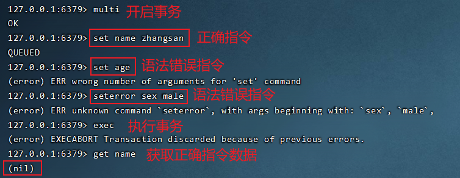

	此时整个事务队列中，存在**一条正确指令，两条语法错误指令**， 当执行exec后，会直接返回错误，正确的命令也不会执行。

### 1.3.2 执行错误

	执行错误：**命令在运行过程中出现错误**。

```sh
#开启事务
multi

#命令
set lesson java
rpush lesson eureka feign nacos
set lesson redis

#执行事务
exec

#获取数据
get lesson
```

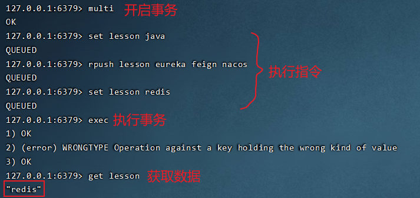

	通过上面事务执行可以看到，语法本身是没有问题的，所以运行之前redis无法发现错误，但是在执行时出现了错误，因此只会错误的命令不执行， 而正确的命令仍然能够正常执行。 

## 1.4 SpringBoot实现事务操作

1）修改RedisConfig配置类，开启事务控制

```java
//开启redis事务控制
redisTemplate.setEnableTransactionSupport(true);
```

2）自定义方法，测试事务效果

```java
@Test
@Transactional(rollbackFor = Exception.class)
public void multiTest(){
    //开启事务
    redisTemplate.multi();
    try{
        redisTemplate.opsForValue().set("lesson","java");
        redisTemplate.opsForSet().add("lesson","eureka","feign","gateway");
        redisTemplate.opsForValue().set("lesson","redis");
        System.out.println(redisTemplate.opsForValue().get("lesson"));
    }catch (Exception e){
        //回滚
        System.out.println("出现异常");
        redisTemplate.discard();
    }finally {
        redisTemplate.exec();
    }
}
```

# 2 持久化机制

## 2.1 场景分析

Redis将数据保存在内存中。一旦服务器宕机重启，内存中的数据就会丢失。当出现这种情况后，为了能够让Redis进行数据恢复，因此Redis提供了持久化机制，将内存中的数据保存到磁盘中，避免数据意外丢失。

Redis提供了两种持久化机制：**RDB**、**AOF**。 根据不同的场景，可以选择只使用其中一种或一起使用。

## 2.2 RDB快照

### 2.2.1 概述

RDB（Redis DataBase）是Redis默认存储方式。其基于快照思想，当符合一定条件（手动或自动触发）时，Redis会将这一刻的内存数据进行快照并保存在磁盘上，产生一个经过压缩的二进制文件，文件后缀名.rdb。

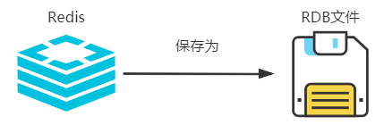

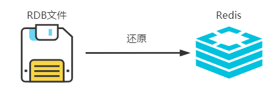

因为RDB文件是保存在磁盘上的，因此即使Redis进程退出，甚至服务器宕机重启。只要RDB文件存在，就可以利用它来还原Redis数据。

### 2.2.2 RDB触发条件

#### 2.2.2.1 符合配置文件中的快照规则

	在redis.conf文件中配置了一些默认触发机制。

```sh
save ""  # 不使用RDB存储  不能主从

# 记忆
save 3600 1     #表示1小时内至少1个键被更改则进行快照。
save 300 100    #表示5分钟（300秒）内至少100个键被更改则进行快照。
save 60 10000  #表示1分钟内至少10000个键被更改则进行快照。
```

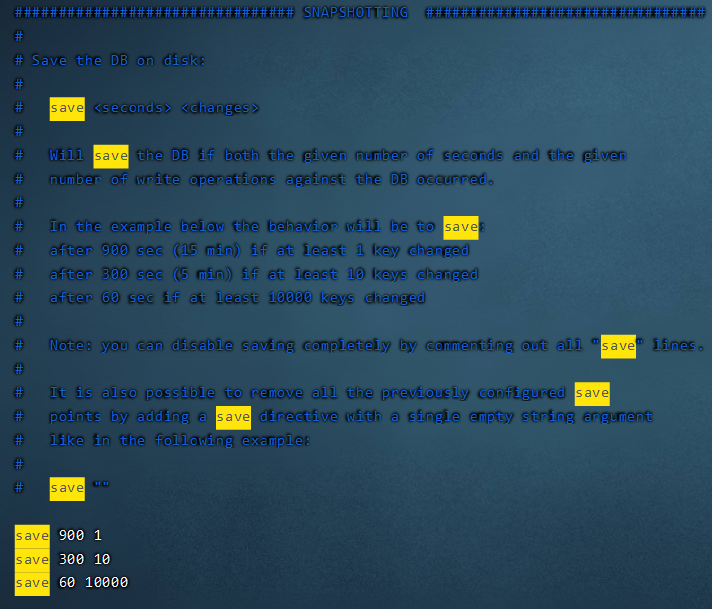

<font color="red">思考：是否会存在数据丢失问题？</font> 

#### 2.2.2.2 手动执行save或bgsave命令

	在redis客户端执行save或bgsave命令，手动触发RDB快照。

```sh
#进入客户端
bin/redis-cli

#执行save命令(同步执行)
save

#执行bgsave命令(异步子线程执行)
bgsave
```

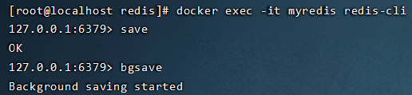

那么这两个命令都会触发快照的话，他们两个又有什么区别呢？

* **save：**同步处理，阻塞Redis服务进程，服务器不会处理任何命令，直到RDB文件保存完毕。
* **bgsave：**会fork一个和主线程一致的子线程负责操作RDB文件，不会阻塞Redis服务进程，操作RDB文件的同时仍然可以处理命令。

<font color="red">Redis默认使用的是 bgsave 来保存快照数据。</font> 


### 2.2.3 执行过程

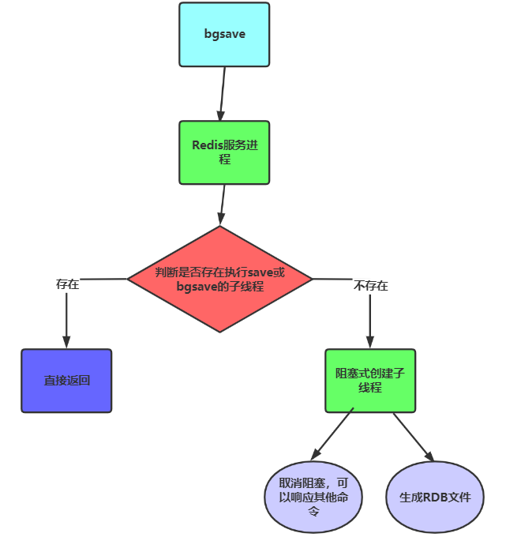

1）Redis服务进程判断，当前是否有子线程在执行save或bgsave。

2）如果有，则直接返回，不做任何处理。

3）如果没有，则以阻塞式创建子线程，在创建子线程期间，Redis不处理任何命令。

4）创建完子线程后，取消阻塞，Redis服务继续响应其他命令。

5）同时基于子线程操作RDB文件，将此刻数据保存到磁盘。

### 2.2.4 优缺点

**优点：**

- 基于二进制文件完成数据备份，占用空间少，便于文件传输。
- 能够自定义规则，根据Redis繁忙状态进行数据备份。

**缺点：**

- 无法保证数据完整性，会丢失最后一次快照后的所有数据。
- bgsave执行每次执行都会阻塞Redis服务进程创建子线程，频繁执行影响系统吞吐率。

## 2.3 AOF

### 2.3.1 概述

	RDB方式会出现数据丢失的问题，对于这个问题，可以通过Redis中另外一种持久化方式解决：**AOF**。

	AOF（append only file）是Redis提供了另外一种持久化机制。与RDB记录数据不同，当开启AOF持久化后，Redis会将客户端发送的所有更改数据的命令，记录到磁盘中的AOF文件。 这样的话，当Redis重启后，通过读取AOF文件，按顺序获取到记录的数据修改命令，即可完成数据恢复。

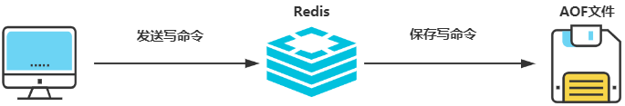

	举个例子，对Redis执行三条写命令：

```sh
set name pp

hset cart shop nike

sadd lesson java python hadoop
```

	RDB会将name、cart、lesson三个键值对数据进行保存，而AOF会将set、hset、sadd三个命令保存到AOF文件中。

### 2.3.2 基础使用

	AOF方式需要手动开启，修改**redis.conf**

```sh
# 是否开启AOF，默认为no
appendonly yes

#设置AOF文件名称
appendfilename  appendonly.aof
```

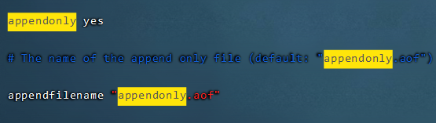

当开启了AOF机制之后，Redis何时会向aof文件中记录内容呢？

对于AOF的触发方式有三种：**always**、**everysec**、**no**。 默认使用everysec。可以通过redis.conf中appendfsync属性进行配置。

那么这三种参数各自都代表什么意思呢？ 为什么默认使用everysec呢？这里我们做一个预留，因为涉及到一些其他知识，后面再给大家详细介绍。

开启AOF后，重启Redis，进入Redis客户端并执行多条写命令，这些命令会被保存到appendonly.aof文件中。

```sh
set name zhangsan
set age 18
set sex male
get name
get age
get sex
```

此时查看**redis/data**目录，会新产生一个appendonly.aof文件。 查看文件内容

```sh
*2
$6
SELECT
$1
0
*3
$3
set
$4
name
$8
zhangsan
*3
$3
set
$3
age
$2
18
*3
$3
set
$3
sex
$4
male
```

	通过文件查看，可以看到，在aof文件中，记录了对redis操作的所有写命令，读命令并不会记录。

### 2.3.3 执行原理

	AOF功能实现的整个执行过程可以分为三个部分：**命令追加**、**文件写入**、**文件同步**。

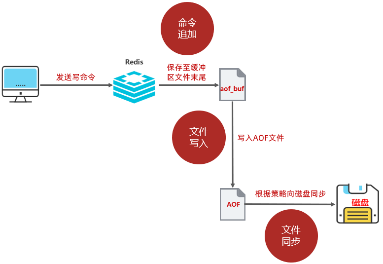

1）客户端向Redis发送写命令。

2）Redis将接收到的写命令保存到缓冲文件**aof_buf的末尾**。 **这个过程是命令追加。**

3）redis将缓冲区文件内容写入到AOF文件，**这个过程是文件写入**。

4）redis根据策略将AOF文件保存到磁盘，**这个过程是文件同步。**

5）何时将AOF文件同步到磁盘的策略依据就是**redis.conf**文件中**appendfsync**属性值：**always**、**everysec**、**no**

- **always**：每次执行写入命令都会将aof_buf缓冲区文件全部内容写入到AOF文件中，并将AOF文件同步到磁盘。该方式效率最低，安全性最高。
- **everysec**：每次执行写入命令都会将aof_buf缓冲区文件全部内容写入到AOF文件中。 并且每隔一秒会由子线程将AOF文件同步到磁盘。该方式兼备了效率与安全，即使出现宕机重启，也只会丢失不超过两秒的数据。
- **no**：每次执行写入命令都会将aof_buf缓冲区文件全部内容写入到AOF文件中，但并不对AOF文件进行同步磁盘。 同步操作交由操作系统完成（每30秒一次），该方式最快，但最不安全。

| 模式     | aof_buf写入到AOF是否阻塞 | AOF文件写入磁盘是否阻塞 | 宕机重启时丢失的数据量              | 效率 | 安全 |
| -------- | ------------------------ | ----------------------- | ----------------------------------- | ---- | ---- |
| always   | 阻塞                     | 阻塞                    | 最多只丢失一个命令的数据            | 低   | 高   |
| everysec | 阻塞                     | 不阻塞                  | 不超过两秒的数据                    | 中   | 中   |
| no       | 阻塞                     | 阻塞                    | 操作系统最后一次对AOF写入磁盘的数据 | 高   | 低   |

### 2.3.4 AOF重写优化

#### 2.3.4.1 概述

AOF会将对Redis操作的所有写命令都记录下来，随着服务器的运行，AOF文件内保存的内容会越来越多。这样就会造成两个比较严重的问题：**占用大量存储空间**、**数据还原花费的时间多**。

	举个例子：

```sh
sadd lessons java
sadd lessons python go
sadd lessons hive
sadd lessons hadoop rocketmq
sadd lessons redis
```

当这些命令执行完，AOF文件中记录5条命令。但是实际生产环境下，写命令会出现非常多，文件的体积也会非常庞大。

	为了解决AOF文件巨大的问题，Redis提供了AOF文件重写功能。 当AOF文件体积超过阈值时，则会触发AOF文件重写，Redis会开启子线程创建一个新的AOF文件替代现有AOF文件。 新的AOF文件不会包含任何浪费空间的冗余命令，只存在恢复当前Redis状态的最小命令集合。

#### 2.3.4.2 触发配置

	那么AOF文件达到多大时，会对其进行重写呢？   对于重写阈值的配置，可以通过修改redis.conf进行配置。

```sh
#当前aof文件大小超过上一次aof文件大小的百分之多少时进行重写。如果之前没有重写过，以
启动时aof文件大小为准
auto-aof-rewrite-percentage 100

#限制允许重写最小aof文件大小，也就是文件大小小于64mb的时候，不需要进行优化
auto-aof-rewrite-min-size 64mb
```

	除了让Redis自动执行重写外，也可以手动让其进行执行：`bgrewriteaof`

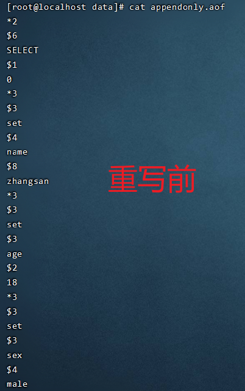

执行`bgrewriteaof`手动进行aof文件重写。重写后内容如下：

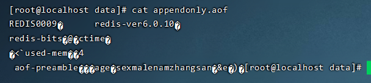

## 2.4 RDB与AOF对比

1. RDB默认开启，AOF需手动开启。
2. RDB性能优于AOF。
3. AOF安全性优于RDB。
4. AOF优先级高于RDB。
5. RDB存储某个时刻的数据快照，AOF存储**写**命令。
6. RDB在配置触发状态会丢失最后一次快照以后更改的所有数据，AOF默认使用everysec，每秒保存一次，最多丢失两秒以内的数据。

## 2.5 生产环境下持久化实践

1. 如当前只追求高性能，不关注数据安全性，则关闭RDB和AOF，如redis宕机重启，直接从数据源恢复数据。
2. 如需较高性能且关注数据安全性，则开启RDB，并定制触发规则。当开启RDB后发现，Redis数据量过多，服务线程被频繁阻塞，造成系统性能严重下降，则开启AOF。
3. 如更关注数据安全性，则开启AOF。

# 3 高可用-主从复制

## 3.1 问题概述

通过持久化机制的学习， 可以发现，不管是RDB还是AOF，都并不能百分百的避免数据丢失。关键是现在只有一台服务器，持久化数据都是保存在这台服务器的磁盘上，假设这台服务器的磁盘损坏，数据仍然会全部丢失。 那这个问题该怎么解决呢？

那我们想一下，现在所有持久化数据只是保存在一台服务器上，能不能让它们同时保存在多台服务器上，这样即使一台服务器出现问题，仍然可以从其他服务器同步数据。

这样就需要当一台服务器中数据更新后，可以自动的将更新的数据同步到其他服务器上， 这就是所谓的复制。

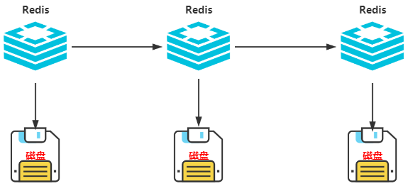

## 3.2 复制搭建&使用

	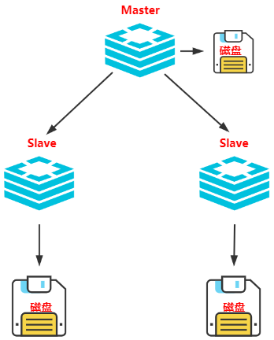

关键步骤：

（1）安装依赖环境及安装Redis

```yaml
#安装gcc
yum install -y gcc-c++ autoconf automake

#centos7 默认的 gcc 默认是4.8.5,版本小于 5.3 无法编译,需要先安装gcc新版才能编译
gcc -v

#升级新版gcc，配置永久生效
yum -y install centos-release-scl
yum -y install devtoolset-9-gcc devtoolset-9-gcc-c++ devtoolset-9-binutils

scl enable devtoolset-9 bash
echo "source /opt/rh/devtoolset-9/enable" >>/etc/profile 

#到Redis的源码包上传并且编译redis
cd redis-6.2.4
make

#安装到指定目录
mkdir -p /usr/local/redis

make PREFIX=/usr/local/redis install

sysctl vm.overcommit_memory=1
```

（2）创建目录

```sh
#日志 /usr/local/redis/log
#数据 /usr/local/redis/data
#配置文件 /usr/local/redis/conf
mkdir /usr/local/redis/logs -p
mkdir /usr/local/redis/data -p
mkdir /usr/local/redis/conf -p
```

将资料中配置文件复制到 `conf` 文件夹下

（3）启动Redis master节点

```sh
# master 节点， 进入到redis目录下
cd /usr/local/redis

# 运行master
bin/redis-server ./conf/master/redis-6379.conf
```

日志：`tail -f ./logs/redis_6379.log `

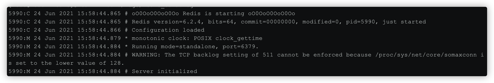

通过 `bin/redis-cli -p 6379 -a 123456` 链接 redis服务

`info replication`

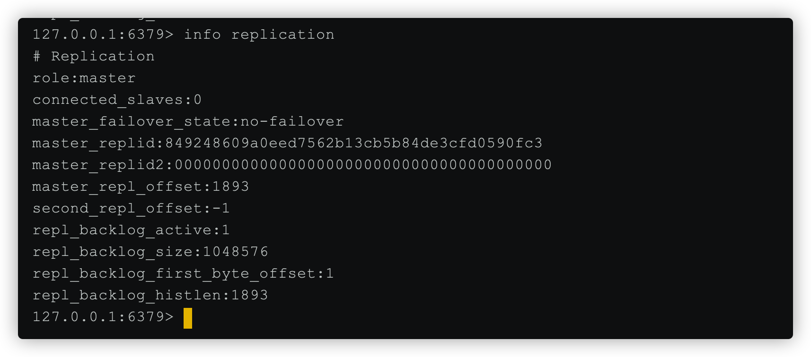

（4）启动Redis slave1和slave2节点

slave1节点:

```sh
# slave1 节点， 进入到redis目录下
cd /usr/local/redis

# 运行slave1
bin/redis-server ./conf/slave1/redis-6380.conf
# 链接redis slave1
bin/redis-cli -p 6380 -a 123456

# info 查看信息
```

slave2节点:

```sh
# slave2 节点， 进入到redis目录下
cd /usr/local/redis

# 运行slave2
bin/redis-server ./conf/slave2/redis-6381.conf

# 链接redis slave2
bin/redis-cli -p 6381 -a 123456

# info 查看信息
```

（5）启动完成后查看Redis集群状态是否成功

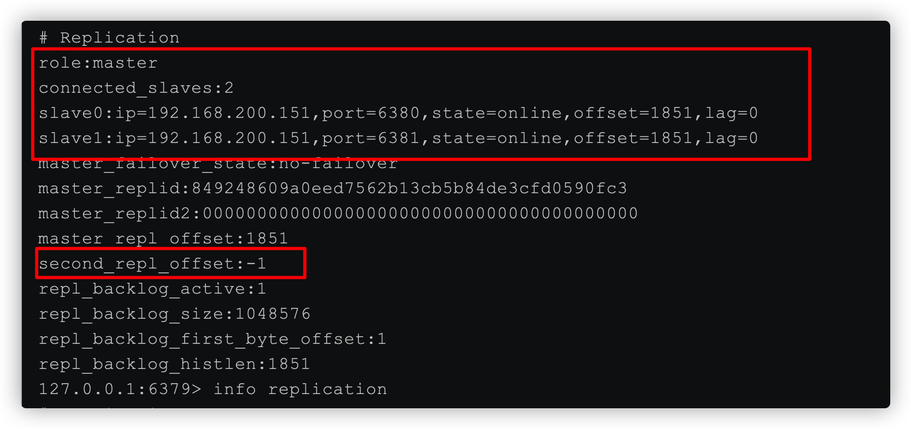

验证读写分离：<font color="red">只能主写从读</font> 

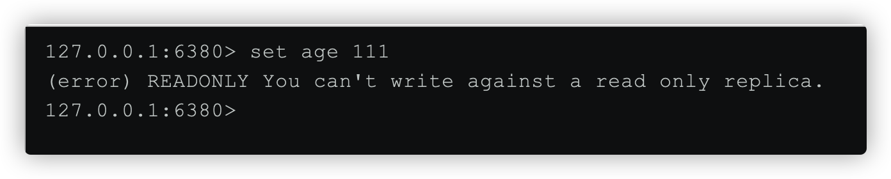

## 3.3 生产环境下主从复制实践

### 3.3.1 读写分离

在生产环境下，读请求会远远多于写请求，大概10:1的比率。 当单机无法应对大量读请求时，可以通过主从复制机制，实现读写分离。主节点只负责写请求，从节点只负责读请求。

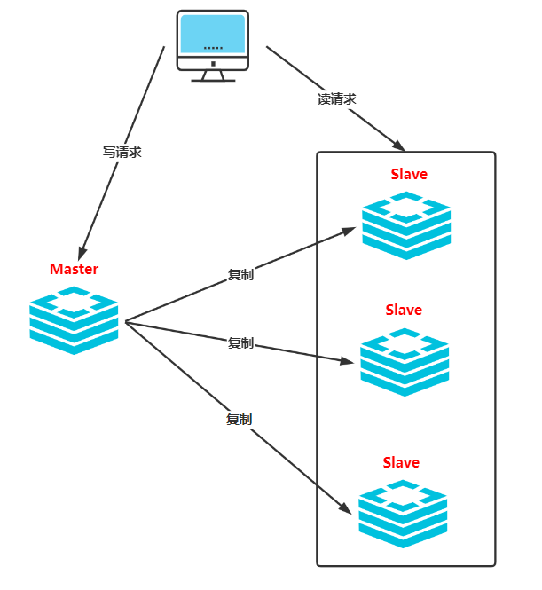

### 3.3.2 持久化优化

现在如果master和所有的slave都开启持久化的话，性能相对来说比较低。该如何优化提升性能呢？

我们可以在**从节点上开启持久化、在主节点关闭持久化**。 但是这样的话，数据不会丢失吗？

在主从复制的结构下，无非要么主节点宕机，要么从节点宕机。

- 当从节点宕机重启后，主节点会自动的将数据同步到从节点上。所以不会出现数据丢失。  
- 当主节点宕机后，可以将从节点提升为主节点(**slaveof no one**)，继续对外提供服务。 并且当原先的主节点重启后，使用slaveof命令将其设置为新主节点的从节点，即可完成数据同步。

```sh
#中断端口为6379的redis服务进程


#将6380从节点提升为新的主节点
slaveof no one

#在6380节点添加数据
sadd lessons java redis rocketmq

#启动6379节点


#将6379节点作为从节点连接到新的主节点6380
slaveof 192.168.200.151 6380

#6379节点获取断开连接期间数据
smembers lessons
```

现在可能有人在想，那要是主节点和从节点同时宕机了呢？ 数据这不还是会丢吗？  首先服务器宕机的问题本身出现的几率就非常低，并且采用合理的部署方式，如异地部署。 主节点和从节点同时宕机的几率更是微乎其微的。

## 3.4 主从复制总结

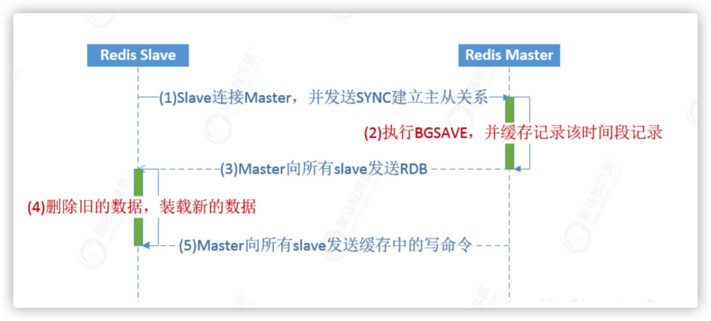

具体步骤：

1、Slave服务启动，主动连接Master，并发送SYNC命令，请求初始化同步； 

2、Master收到SYNC后，执行BGSAVE命令生成RDB文件，并缓存该时间段内的写命令； 

3、Master完成RDB文件后，将其发送给所有Slave服务器； 

4、Slave服务器接收到RDB文件后，删除内存中旧的缓存数据，并装载RDB文件； 

5、Master在发送完RDB后，即刻向所有Slave服务器发送缓存中的写命令；


主从复制的作用：

* 读写分离：**主写从读**，提高服务器的读写负载能力
*  负载均衡：基于主从结构，配合读写分离，由slave分担master负载，并根据需求的变化，改变slave的数量，通过多个从节点分担数据读取负载，大大提高Redis服务器并发量与数据吞吐量

* 故障恢复：当master出现问题时，由slave提供服务，实现快速的故障恢复

* 数据冗余：实现数据热备份，是持久化之外的一种数据冗余方式

* 高可用基石：基于主从复制，构建哨兵模式与集群，实现Redis的高可用方案

## 3.5 哨兵模式

### 3.5.1 问题概述

我们学习了主从库集群模式。在这个模式下，如果从库发生故障了，客户端可以继续向主库或其他从库发送请求，进行相关的操作，但是如果主库发生故障了，那就直接会影响到从库的同步，因为从库没有相应的主库可以进行数据复制操作了。

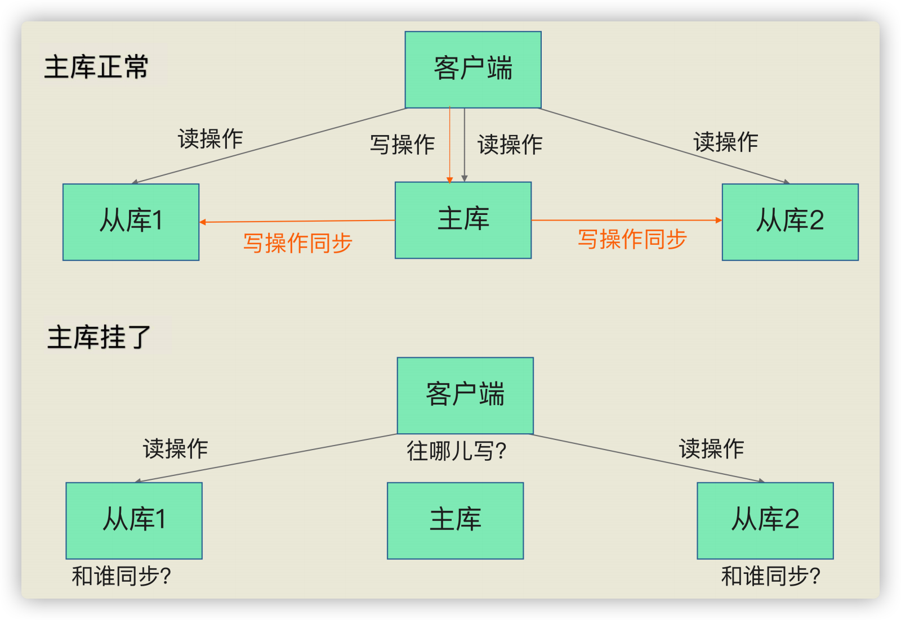

如上图：

* 如果客户端发送的**读请求**，可以由从库继续提供服务

* 如果客户端发送的**写请求，**需要主库提供服务，但是主库挂了

  

  无论是写服务中断，还是从库无法进行数据同步，都是不能接受的。所以，如果主库挂

了，我们就需要运行一个新主库，比如说把一个从库切换为主库，把它当成主库。

这就涉及到三个问题：

1. 主库真的挂了吗？

2. 该选择哪个从库作为主库？

3. 怎么把新主库的相关信息通知给从库和客户端呢？

   

   这就要提到哨兵机制了。在 Redis 主从集群中，哨兵机制是实现主从库自动切换的关键机

制，它有效地解决了主从复制模式下故障转移的这三个问题。

哨兵(sentinel) 是一个分布式系统，用于对主从结构中的每台服务器进行**监控**，当出现故障时通过投票机制**选择**新的master并将所有slave连接到新的master。

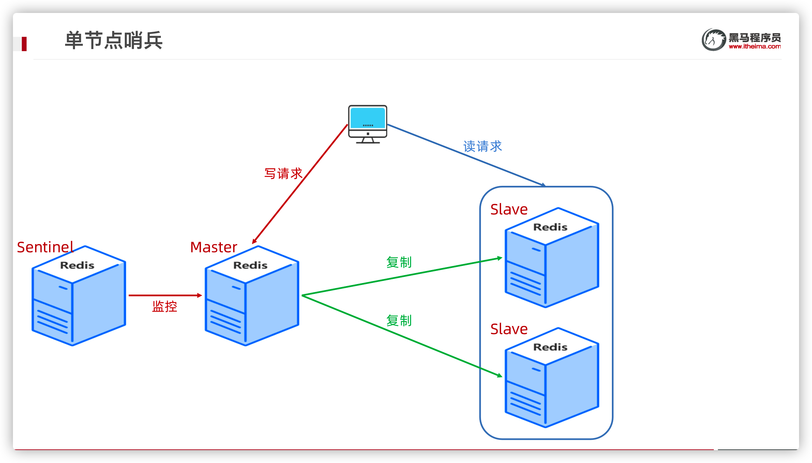

**注意：**

* 哨兵也是一台redis服务器，只是不提供数据服务

* 通常哨兵配置数量为单数

* 如果配置启用单节点哨兵，如果有哨兵实例在运行时发生了故障，主从库无法正常

  切换啦，所以我们需要搭建 **哨兵集群**

  

### 3.5.2 集群节点哨兵模式

#### 3.5.2.1 哨兵模式介绍

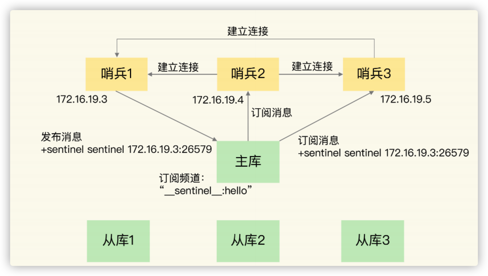

- Redis提供了哨兵的命令，是一个独立的进程

- 原理 哨兵通过发送命令给多个节点，等待Redis服务器响应，从而监控运行的多个Redis实例的运行情况

- 当哨兵监测到master宕机，会自动将slave切换成master，通过通知其他的从服务器，修改配置文件切换主机

  

**Sentinel三大工作任务**

- 监控（Monitoring）
  - Sentinel 会不断地检查你的主服务器和从服务器是否运作正常
- 提醒（Notification）
  - 当被监控的某个 Redis 服务器出现问题时， Sentinel 可以通过 API 向管理员或者其他应用程序发送通知
- 自动故障迁移（Automatic failover）
  - 当一个主服务器不能正常工作时， Sentinel 会开始一次自动故障迁移操作， 它会将失效主服务器的其中一个从服务器升级为新的主服务器， 并让失效主服务器的其他从服务器改为复制新的主服务器
  - 当客户端试图连接失效的主服务器时， 集群也会向客户端返回新主服务器的地址， 使得集群可以使用新主服务器代替失效服务器


#### 3.5.2.2 客观下线和主观下线

- 主观下线（Subjectively Down， 简称 SDOWN）

  - **哨兵进程会使用 PING 命令检测它自己和主、从库的网络连接情况，用来判断实例的状**

    **态**。如果哨兵发现主库或从库对 PING 命令的响应超时了，那么，哨兵就会先把它标记

    为“主观下线”

  - 一个服务器没有在 down-after-milliseconds 选项所指定的时间内， 对向它发送 PING 命令的 Sentinel 返回一个有效回复（valid reply）， 那么 Sentinel 就会将这个服务器标记为主观下线

  - 如果检测的是从库，那么，哨兵简单地把它标记为“主观下线”就行了，因为从库的下线影响一般不太大，集群的对外服务不会间断。

  - 如果检测的是主库，那么，哨兵还不能简单地把它标记为“主观下线”，开启主从

    切换。因为很有可能存在这么一个情况：那就是哨兵**误判**了，其实主库并没有故障。可

    是，一旦启动了主从切换，后续的选主和通知操作都会带来额外的计算和通信开销。

我们要知道啥叫误判。很简单，就是主库实际并没有下线，但是哨兵误以为它下线了。误判一般会发生在集群网络压力较大、网络拥塞，或者是主库本身压力较大的情况下。

- 客观下线（Objectively Down， 简称 ODOWN）

  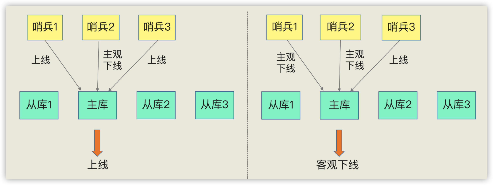

  - 指的是多个 Sentinel 实例在对同一个服务器做出 SDOWN 判断， 并且通过 SENTINEL is-master-down-by-addr 命令互相交流之后， 得出的服务器下线判断
  - 一个 Sentinel 可以通过向另一个 Sentinel 发送 SENTINEL is-master-down-by-addr 命令来询问对方是否认为给定的服务器已下线
  - 客观下线条件只适用于主服务器

- 仲裁 qurum

  - Sentinel 在给定的时间范围内， 从其他 Sentinel 那里接收到了【足够数量】的主服务器下线报告， 那么 Sentinel 就会将主服务器的状态从主观下线改变为客观下线
  - 这个【足够数量】就是配置文件里面的值，一般是Sentinel个数的一半加1，比如3个Sentinel则就设置为2
  - down-after-milliseconds 是一个哨兵在超过规定时间依旧没有得到响应后，会自己认为主机不可用
  - 当拥有认为主观下线的哨兵达到sentinel monitor所配置的数量时，就会发起一次投票，进行failover

 

#### 3.5.2.3 一主二从三哨兵搭建

关键步骤：

- 基于搭建成功的一主二从Redis集群

- 配置3个哨兵，每个哨兵的配置都是一样的

- 启动顺序 先启动主再启动从，最后启动3个哨兵

- 哨兵端口是 【26379】

  

（1）配置文件

```sh
#不限制ip
bind 0.0.0.0

# 让sentinel服务后台运行
daemonize yes

# 配置监听的主服务器，mymaster代表服务器的名称，自定义，192.168.200.151 代表监控的主服务器，6379代表端口，
#2代表只有两个或两个以上的哨兵认为主服务器不可用的时候，才会进行failover操作。
# 计算规则：哨兵个数/2 +1
sentinel monitor mymaster 192.168.200.151 6379 2

# sentinel auth-pass定义服务的密码，mymaster是服务名称，123456是Redis服务器密码
sentinel auth-pass mymaster 123456

#超过5秒master还没有连接上，则认为master已经停止
sentinel down-after-milliseconds mymaster 5000

#如果该时间内没完成failover操作，则认为本次failover失败
sentinel failover-timeout mymaster 30000
```

在`redis/conf/sentinel`目录下创建3个文件 sentinel-1.conf、sentinel-2.conf、sentinel-3.conf


（2）启动哨兵集群

```sh
#  进入到redis目录下
cd /usr/local/redis

# sentinel1
bin/redis-server ./conf/sentinel/sentinel1.conf --sentinel

# sentinel2
bin/redis-server ./conf/sentinel/sentinel2.conf --sentinel

# sentinel3
bin/redis-server ./conf/sentinel/sentinel3.conf --sentinel
```

（3）查看日志

```sh
tail -f ./logs/sentinel_26379.log
```

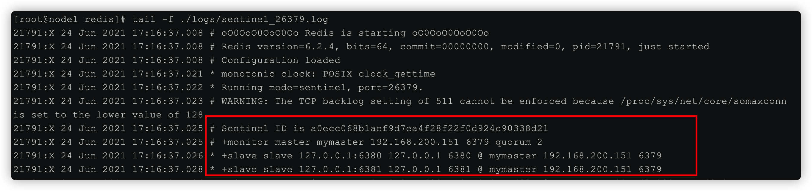

```sh
tail -f ./logs/sentinel_26380.log
```

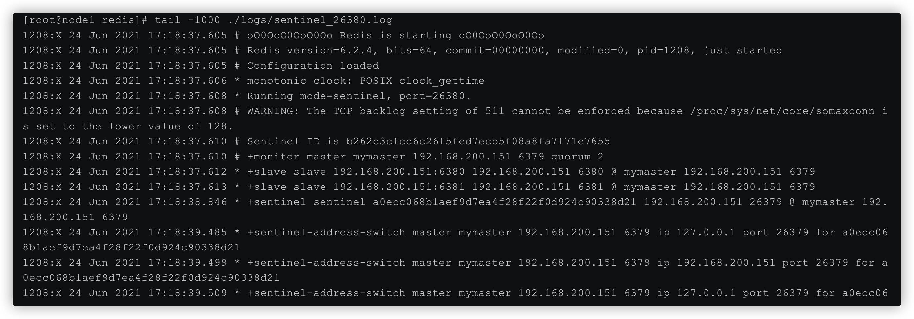

```sh
tail -f ./logs/sentinel_26381.log
```


查看Sentinel1 日志发现，其它两个Sentinel加入到集群中

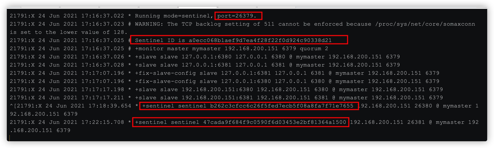

#### 3.5.2.4 哨兵模式测试

（1）关闭Redis master服务 `SHUTDOWN`

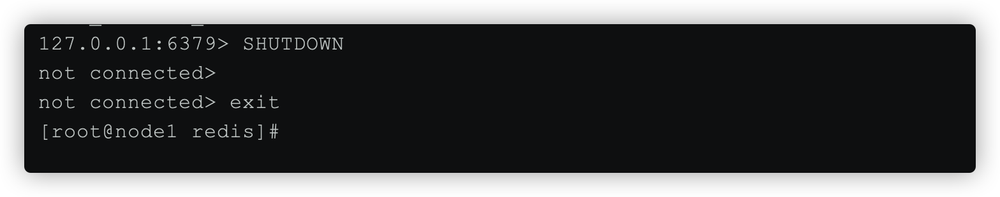

（2）观察哨兵模式日志

哨兵日志：

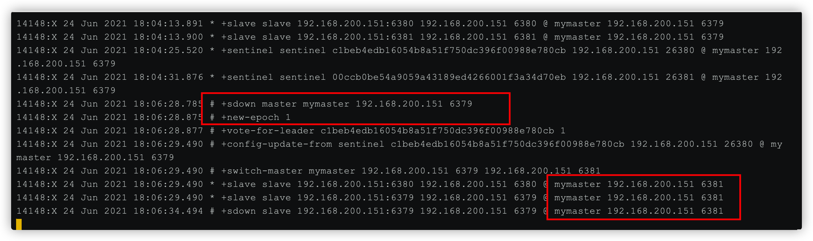

名称解释：

基于pub/sub的客户端事件通知
- 主库下线事件：
    - +sdown：实例进入主观下线状态
    - -sdown：实例退出主观下线状态
    - +odown：实例进入客观下线状态
    - -odown：实例退出客观下线状态
- 从库重新配置事件
    - +slave-reconf-sent：哨兵发送SLAVEOF命令重新配置从库
    - +slave-reconf-inpprog：从库配置了新主库，但尚未进行同步
    - +slave-reconf-done：从库配置了新主库，且和新主库完成同步
- 新主库切换：
  
    - +swith-master：主库地址发送变化
    
      

redis 6381 日志：

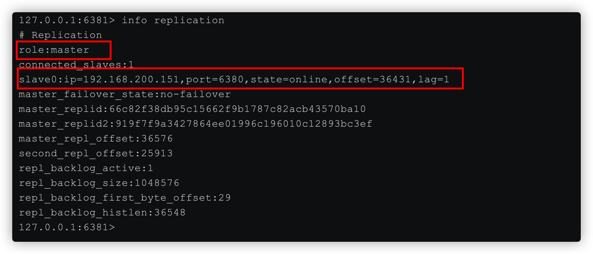

redis 6380 日志：

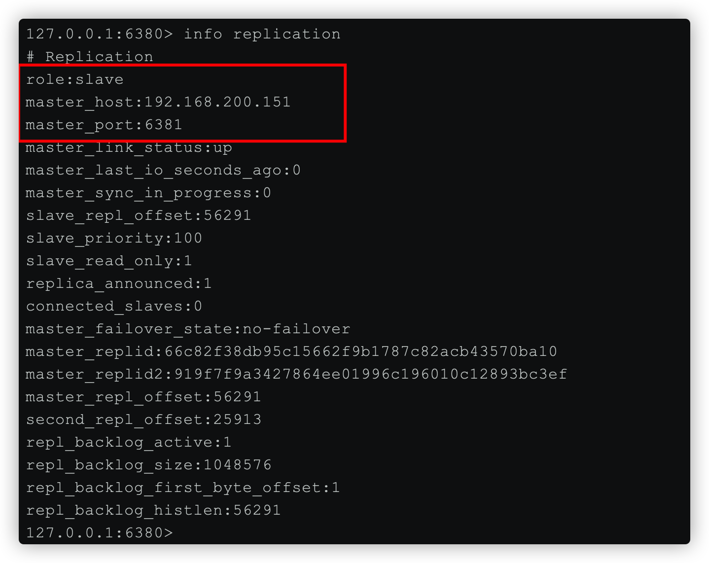

redis 6379 重启查看日志：

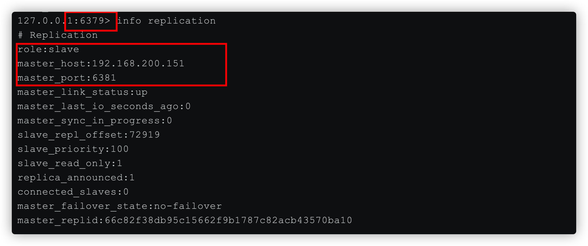

### 3.5.3 集群节点哨兵模式工作原理

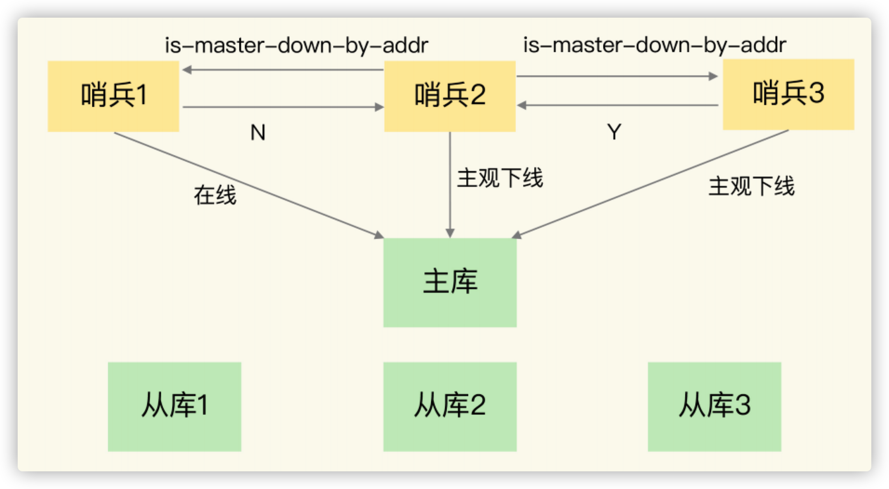

  * 哨兵集群中的多个实例共同判断，可以降低对**主库下线**的**误判率**
    * 哨兵集群组成: 基于 **pub/sub** 机制
        * 哨兵间发现：
            * 主库频道“\__sentinel__:hello”，不同哨兵通过它相互发现，实现互相通信
        * 哨兵发现从库
            * 向主库发送 INFO 命令
        
    * 基于 pub/sub 机制的客户端事件通知
        * 事件：主库下线事件
            * +sdown : 实例进入“主观下线”状态
            * -sdown : 实例退出“主观下线”状态
            * +odown : 实例进入“客观下线”状态
            * -odown : 实例退出“客观下线”状态
        * 事件：从库重新配置事件
            * +slave-reconf-sent : 哨兵发送 SLAVEOF 命令重新配置从库
            * +slave-reconf-inprog : 从库配置了新主库，但尚未进行同步
            * +slave-reconf-done : 从库配置了新主库，且完成同步
        * 事件：新主库切换
            * +switch-master : 主库地址发生变化
        
    * 由哪个哨兵执行主从切换？
        * 一个哨兵获得了仲裁**所需的赞成票数**后，就可以标记主库为“客观下线”
            * 所需的赞成票数 &lt;= quorum 配置项
        
        > 例如，现在有 5 个哨兵，quorum 配置的是 3，那么，一个哨兵需要 3 张赞成票，就可以标记主库为“客观下线”了。这 3 张赞成票包括哨兵自己的一张赞成票和另外两个哨兵的赞成票。
        
        * “Leader 选举”
            * 两个条件：
                * 拿到半数以上的赞成票
                * 拿到的票数&gt;= quorum
            * 如果未选出，则集群会等待一段时间（哨兵故障转移超时时间的 2 倍），再重新选举
        
    * 经验：要保证所有哨兵实例的**配置是一致**的
      
        * 尤其是主观下线的判断值 down-after-milliseconds

### 3.5.4 总结

目前解决了什么问题：

* 主从集群间可以实现自动切换，可用性更高
* 数据更大限度的防止丢失
* 解决哨兵的集群高可用问题，减少误判率

目前还存在什么问题：

* 主节点的写能力和存储能力受限

# 4 高扩展-Redis Cluster分片集群

## 4.1 问题概述

提出问题：要用 Redis 保存 5000 万个键值对，每个键值对大约是 512B，为了能快速部署并对外提供服务，我们采用云主机来运行 Redis 实例，那么，该如何选择云主机的内存容量呢？

思路分析：

* 所有的key占用内存预估是：5000 万 *512B = 25GB，所以redis的服务器申请 32G以上可以解决海量数据存储问题
* 为防止单点故障，必须还需要主从+哨兵实现故障自动转移和恢复数据
* 过程会发现一旦主节点宕机，会出现数据恢复时间会很长（秒级以上）

得出结论：如果只是单纯按照内存来申请redis服务器，这个方案是行不通的

那么如果想解决这个问题，就必须需要 Redis Cluster 分片集群，在Redis 3.0 之后开始支持。

## 4.2 分片集群原理

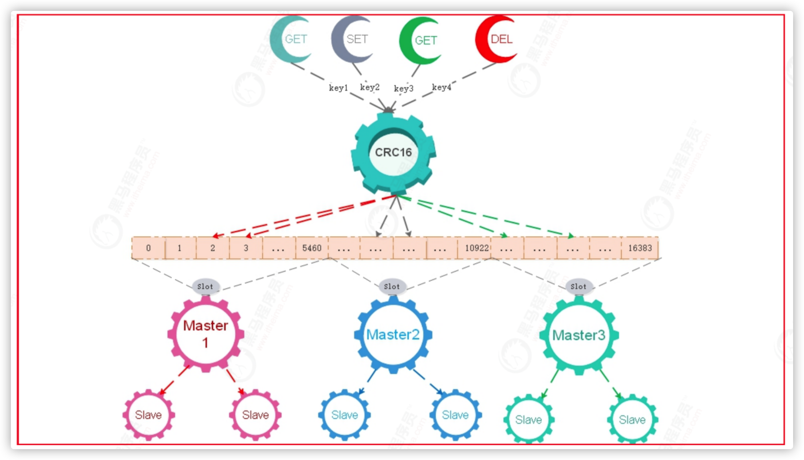

Redis原理：

* 数据切片和实例的对应分布关系
    * Redis Cluster 方案：无中心化
        * 采用哈希槽（Hash Slot）来处理数据和实例之间的映射关系
        * 一个切片集群共有 16384 个哈希槽，**只给Master分配**

        * 具体的映射过程
            1. 根据键值对的 key，按照CRC16 算法计算一个 16 bit 的值；
            2. 再用这个 16bit 值对 16384 取模，得到 0~16383 范围内的模数，每个模数代表一个相应编号的哈希槽

    * 哈希槽映射到具体的 Redis 实例上
        * 用 cluster create 命令创建集群，Redis 会自动把这些槽平均分布在集群实例上
        * 也可以使用 cluster meet 命令手动建立实例间的连接，形成集群，再使用 cluster addslots 命令，指定每个实例上的哈希槽个数

          注意：需要把 16384 个槽都分配完，否则 Redis 集群无法正常工作

* 客户端如何定位数据
    * Redis 实例会把自己的哈希槽信息发给和它相连接的其它实例，来完成哈希槽分配信息的扩散
    * 客户端和集群实例建立连接后，实例就会把哈希槽的分配信息发给客户端
    * 客户端会把哈希槽信息缓存在本地。当请求键值对时，会先计算键所对应的哈希槽
    * 但集群中，实例和哈希槽的对应关系并不是一成不变的
        * 实例新增或删除
        * 负载均衡
    * 实例之间可以通过相互传递消息，获得最新的哈希槽分配信息，但客户端是无法主动感知这些变化
    
* **重定向机制**
  
    * 如果实例上没有该键值对映射的哈希槽，就会返回 MOVED 命令
      * 客户端会更新本地缓存
    * 在**迁移部分完成**情况下，返回ASK
      * 表明 Slot 数据还在迁移中
      * ASK 命令把客户端所请求数据的最新实例地址返回给客户端
      * 并不会更新客户端缓存的哈希槽分配信息


## 4.3 Redis Cluster分片集群搭建

官方建议：至少需要6个redis搭建，三主三从

注意：一定要把<font color="red">data和logs文件夹</font> 下的数据删除，否则会搭建失败

端口：7001-7006 

参考配置：

```sh
bind 0.0.0.0
protected-mode no
port 7001
daemonize yes
requirepass "123456"
logfile "/usr/local/redis/logs/redis_7001.log"
dbfilename "redis_7001.rdb"
dir "/usr/local/redis/data"
appendonly yes
appendfilename "appendonly_7001.aof"
masterauth "123456"

#是否开启集群
cluster-enabled yes

# 生成的node文件，记录集群节点信息，默认为nodes.conf，防止冲突，改为nodes-7001.conf
cluster-config-file nodes-7001.conf

#节点连接超时时间
cluster-node-timeout 20000

#集群节点的ip，当前节点的ip, 如果是阿里云是可以写内网ip
cluster-announce-ip 192.168.200.151

#集群节点映射端口
cluster-announce-port 7001

#集群节点总线端口,节点之间互相通信，常规端口+1万
cluster-announce-bus-port 17001
```

（1）创建redis1-6.conf 配置文件，参考资料文件夹

（2）启动6个Redis实例

```sh
# 进入redis文件夹
cd /usr/local/redis

# 启动6个redis实例
bin/redis-server ./conf/cluster/redis1.conf
bin/redis-server ./conf/cluster/redis2.conf 
bin/redis-server ./conf/cluster/redis3.conf 
bin/redis-server ./conf/cluster/redis4.conf 
bin/redis-server ./conf/cluster/redis5.conf 
bin/redis-server ./conf/cluster/redis6.conf 
```

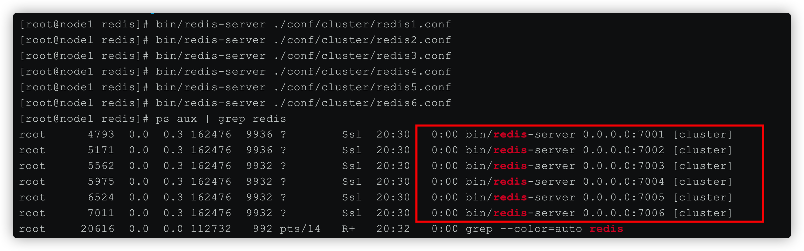

（3）加入Redis集群（任意一个Redis实例即可）

```sh
bin/redis-cli -a 123456 --cluster create 192.168.200.151:7001 192.168.200.151:7002 192.168.200.151:7003 192.168.200.151:7004 192.168.200.151:7005 192.168.200.151:7006 --cluster-replicas 1
```

命令解释：

- --cluster 构建集群全部节点信息
- --cluster-replicas 1 主从节点的比例，1表示1主1从的方式

结果显示：

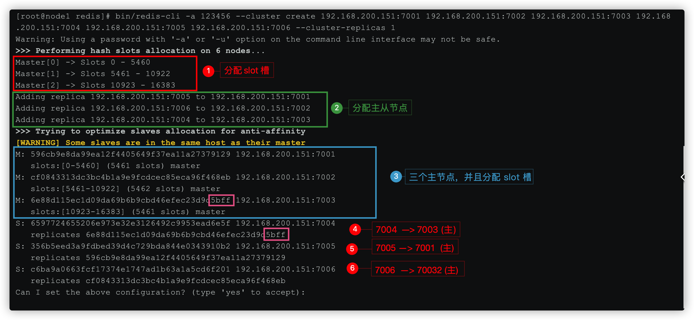

输入：yes

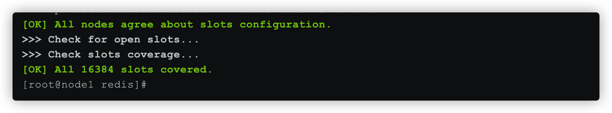

（4）查看集群状态信息

```sh
bin/redis-cli -a 123456 --cluster check 192.168.200.151:7001
```


## 4.4 测试

### 4.4.1 正常测试

连接集群：

```sh
bin/redis-cli -a 123456 -p 7001 -c
# 注意必须在参数后添加 -c 标识集群连接
```

查看集群信息：`cluster info`

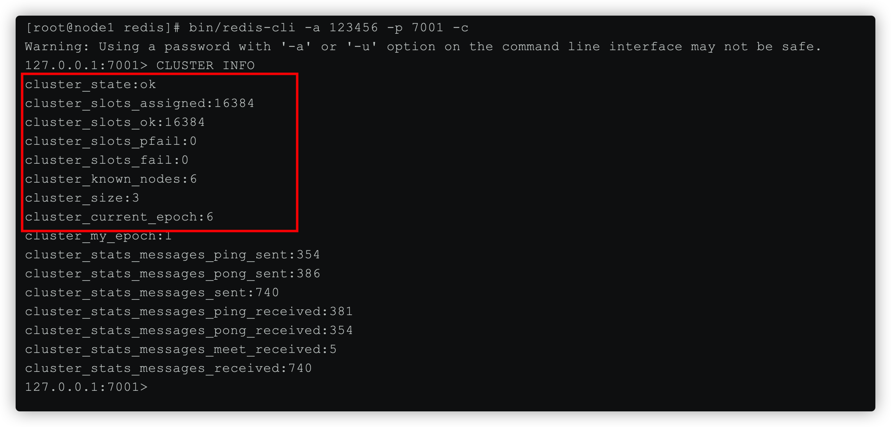

查看集群节点信息：`cluster nodes`

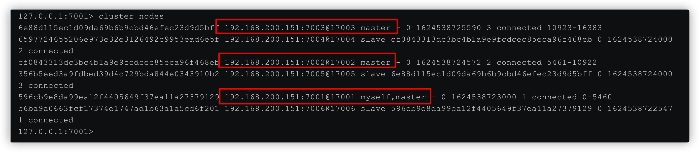

无中心结构测试：

```sh
127.0.0.1:7001> set a1 111
-> Redirected to slot [7785] located at 192.168.200.151:7002
OK
192.168.200.151:7002> set a2 222
-> Redirected to slot [11786] located at 192.168.200.151:7003
OK
192.168.200.151:7003> set a3 333
OK
192.168.200.151:7003> set a4 444
-> Redirected to slot [3788] located at 192.168.200.151:7001
OK
192.168.200.151:7001> get a2
-> Redirected to slot [11786] located at 192.168.200.151:7003
"222"
192.168.200.151:7003> get a3
"333"
192.168.200.151:7003> 
```

- 测试集群读写命令set/get
  - key哈希运算计算槽位置
  - 槽在当前节点的话直接插入/读取，否则自动转向到对应的节点
- 操作都是主节点操作，从节点只是备份

### 4.4.2 异常测试

* 异常关闭主节点，查看集群节点变化和日志
  * 结论：对应的从节点升级为主节点
* 恢复主节点，查看集群节点变化
  * 结论：会添加到最新的主机点上，成为从节点
* 异常关闭从节点，查看集群状态
  * 结论：不影响集群使用，但是可能会存在单点故障问题
* 同时关闭节点的主和从，本案例中的7001（主） —— 7006（从），get取值，观察
  * 结论：导致整个Redis集群不可用

### 4.4.3 集群动态扩缩容

我们安装 7007 、 7008 两个Redis节点，然后将 7007 作为主节点，添加到集群中， 7008 作为从节点添加到集群中。

复制配置文件为  redis7.conf和redis8.conf 修改端口即可启动redis

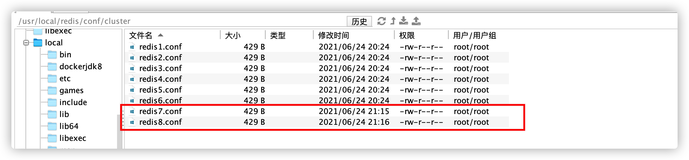

启动redis

```sh
[root@node1 redis]# bin/redis-server ./conf/cluster/redis7.conf 
[root@node1 redis]# bin/redis-server ./conf/cluster/redis8.conf 
```

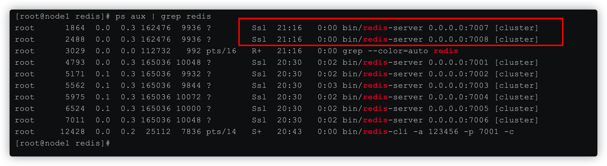

#### 4.4.3.1 扩容-添加主节点

我们需要给集群节点添加一个主节点，我们需要将 192.168.200.151:7007 节点添加到 192.168.200.151:7001 节点所在的集群中，并且添加后作为主节点，添加命令行如下：

**添加节点：**

```sh
bin/redis-cli -a 123456 --cluster add-node 192.168.200.151:7007 192.168.200.151:7001
```

命令说明：

* 将 192.168.200.151:7007节点添加到 192.168.200.151:7001节点所在的集群中

结果：

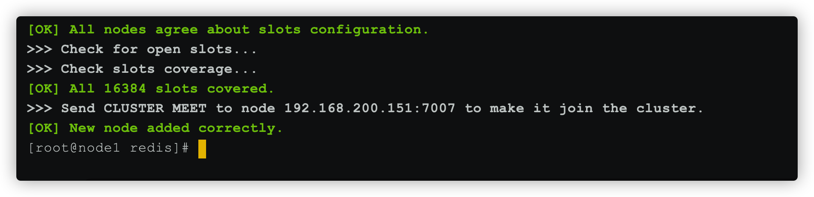

节点发现没有给 7001 分配 槽节点

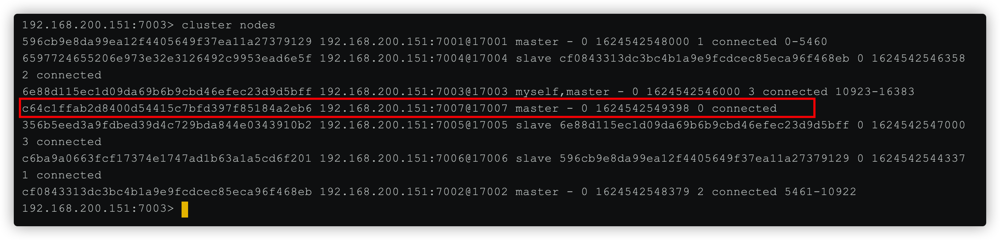


**重新分配哈希槽：**

我们将 7001,7002,7003 中的 100 个哈希槽挪给 7007。

**命令如下：**

```sh
bin/redis-cli -a 123456 --cluster reshard 192.168.200.151:7001 --cluster-from 596cb9e8da99ea12f4405649f37ea11a27379129,cf0843313dc3bc4b1a9e9fcdcec85eca96f468eb,6e88d115ec1d09da69b6b9cbd46efec23d9d5bff --cluster-to c64c1ffab2d8400d54415c7bfd397f85184a2eb6 --cluster-slots 100
```

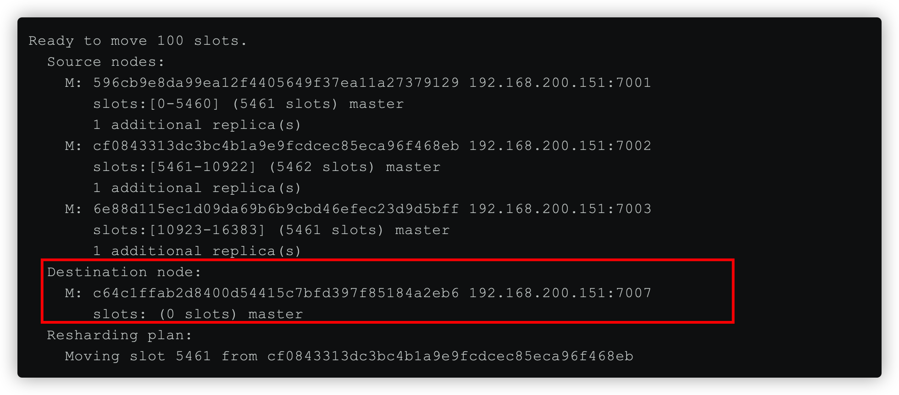

**命令说明：**

将节点

596cb9e8da99ea12f4405649f37ea11a27379129 

cf0843313dc3bc4b1a9e9fcdcec85eca96f468eb 

6e88d115ec1d09da69b6b9cbd46efec23d9d5bff 

中的100个哈希槽移动到 443096af2ff8c1e89f1160faed4f6a02235822a7 中


**参数说明：**

* --cluster-from：表示slot目前所在的节点的node ID，多个ID用逗号分隔 

* --cluster-to：表示需要新分配节点的node ID 

* --cluster-slots：分配的slot数量


结果发现master节点已分配槽：

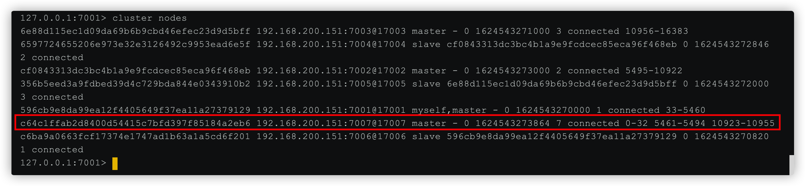

#### 4.4.3.2 扩容-添加从节点

我们需要往集群中给 7007 节点添加一个从节点 7008 ，添加从节点的主要目的是提高高可用，防止主节点宕机后该节点无法提供服务。

添加从节点命令如下：

```sh
bin/redis-cli -a 123456 --cluster add-node 192.168.200.151:7008 192.168.200.151:7007 --cluster-slave --cluster-master-id c64c1ffab2d8400d54415c7bfd397f85184a2eb6
```


命令说明：

* 将192.168.200.151:7008节点添加到192.168.200.151:7007对应的集群中，并且加入的节点为从节点，对应的主节点 
* id是c64c1ffab2d8400d54415c7bfd397f85184a2eb6

参数说明：

* add-node: 后面的分别跟着新加入的slave和slave对应的master 

* cluster-slave：表示加入的是slave节点 

* --cluster-master-id：表示slave对应的master的node ID

结果：

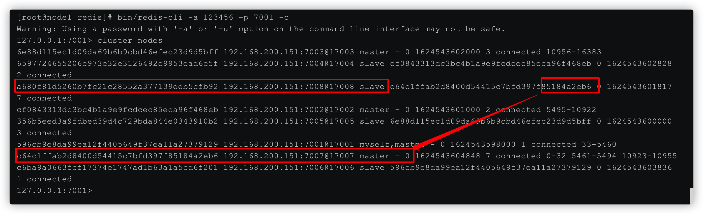

#### 4.4.3.3 缩容-删除从节点

数据迁移、哈希槽迁移、从节点删除、主节点删除

在真实生产环境中，我们也会跟着我们的业务和环境执行缩容处理，比如双十一过后，流量没有那么大了，我们往往会缩容处理，服务器开销。

Redis实现缩容，需要哈希槽重新分配，将需要移除的节点所分配的所有哈希槽值分配给其他需要运行工作的节点，

还需要移除该节点的从节点，然后再删除该节点。


**需求：移除 7007 的从节点 7008** 

命令如下：

```sh
bin/redis-cli -a 123456 --cluster del-node 192.168.200.151:7008 a680f81d5260b7fc21c28552a377139eeb5cfb92
```

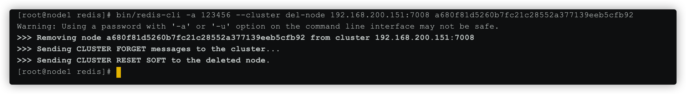

参数说明：

* del-node:删除节点，后面跟着slave节点的 ip:port 和node ID

删除后，我们再来查看集群节点，此时再无7008节点：

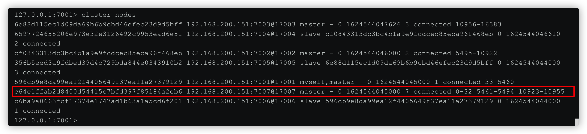

#### 4.4.3.4 缩容-删除主节点

我们需要将 7007 节点的哈希槽迁移到 7001,7002,7003 节点上，仍然用上面用过的 redis-cli --cluster reshard语法。

操作步骤如下：

第1次迁移：

```sh
bin/redis-cli -a 123456 --cluster reshard 192.168.200.151:7007 --cluster-from c64c1ffab2d8400d54415c7bfd397f85184a2eb6 --cluster-to 596cb9e8da99ea12f4405649f37ea11a27379129 --cluster-slots 33 --cluster-yes
```


**命令说明：**

* 将192.168.211.141:7007节点所在集群中c64c1ffab2d8400d54415c7bfd397f85184a2eb6节点的33个哈希槽迁移给 596cb9e8da99ea12f4405649f37ea11a27379129 节点，不回显需要迁移的slot，直接迁移。

效果如下：

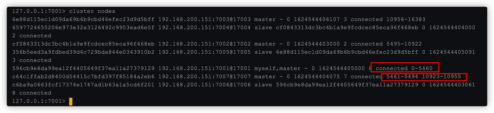

我们再次迁移其他哈希槽到其他节点，将剩余的哈希槽迁移到7002和7003去

```sh
# 7007 ----> 7002
bin/redis-cli -a 123456 --cluster reshard 192.168.200.151:7007 --cluster-from c64c1ffab2d8400d54415c7bfd397f85184a2eb6 --cluster-to cf0843313dc3bc4b1a9e9fcdcec85eca96f468eb --cluster-slots 34 --cluster-yes


# 7007 ----> 7003
bin/redis-cli -a 123456 --cluster reshard 192.168.200.151:7007 --cluster-from c64c1ffab2d8400d54415c7bfd397f85184a2eb6 --cluster-to 6e88d115ec1d09da69b6b9cbd46efec23d9d5bff --cluster-slots 33 --cluster-yes
```

删除节点命令如下：

```sh
bin/redis-cli -a 123456 --cluster del-node 192.168.200.151:7007 c64c1ffab2d8400d54415c7bfd397f85184a2eb6
```

查看集群状态发现 7007 已成功从集群中移除。


## 4.5 总结

分片解决了什么问题：

* 海量数据存储
* 高可用
* 高可扩


高可用架构总结

- 主从模式：读写分离，负载均衡，一个Master可以有多个Slaves
- 哨兵sentinel：监控，自动转移，哨兵发现主服务器挂了后，就会从slave中重新选举一个主服务器
- 分片集群： 为了解决单机Redis容量有限的问题，将数据按一定的规则分配到多台机器，内存/QPS不受限于单机，提高并发量。

# 5 key过期删除策略

看到过期删除策略，大家现在脑袋里面可能会想为什么要学这个？ 这有什么好说的，之前不是已经学过EXPIRE命令了， 给key设置过期时间，到期了不就删除了吗？  

大家这个想法是没有任何问题的， 但是，绝对没有大家想象的那么简单。我们现在思考一个问题：**如果一个key过期了，那么它实际是在什么时候被删除的呢？** 

	可能很多同学的答案是： **到期了就直接被删除了**。 但是这里告诉大家，这个答案是错误的。

	这就需要给大家介绍下，Redis中对于过期键的过期删除策略：

- 定时删除
- 惰性删除
- 定期删除

下面我就来逐一学习这三种过期删除策略的工作机制。

## 5.1 定时删除

	它会在设置键的过期时间的同时，创建一个定时器， 当键到了过期时间，定时器会立即对键进行删除。  这个策略能够保证过期键的尽快删除，快速释放内存空间。  


	 但是有得必有失。 Redis的操作频率是非常高的。绝大多数的键都是携带过期时间的，这样就会造成出现大量定时器执行，严重降低系统性能。

	总的来说：**该策略对内存空间足够友好， 但对CPU非常不友好，会拉低系统性能，因此不建议使用。**

## 5.2 惰性删除

	为了解决定时删除会占用大量CPU资源的问题， 因此产生了惰性删除。

	**它不持续关注key的过期时间， 而是在获取key时，才会检查key是否过期，如果过期则删除该key。**简单来说就是：平时我不关注你，我用到你了，我才关注你在不在。 

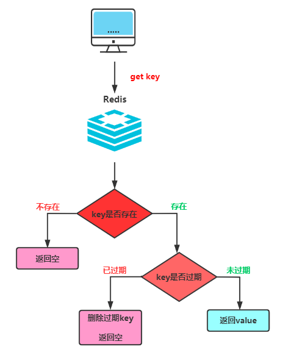

	根据惰性删除来说，大家感觉它存在什么问题呢？

	虽然它解决了定时删除会占用大量CPU资源的问题， 但是它又会造成内存空间的浪费。假设Redis中现在存在大量过期key，而这些过期key如果都不被使用，它们就会保留在redis中，造成内存空间一直被占用。

	总的来说：**惰性删除对CPU足够友好，但是对内存空间非常不友好，会造成大量内存空间的浪费**。

## 5.3 定期删除

	根据刚才的学习大家可以发现，不管是定时删除还是惰性删除优缺点都非常明显：

- 定时删除对内存空间友好，对CPU不友好。
- 惰性删除对CPU友好，对内存空间不友好。

那现在有没有一种策略，能够平衡这两者的优缺点呢？  因此出现了定期删除。

### 5.3.1 工作机制

	定期删除，顾名思义，就是每隔一段时间进行一次删除。 那么大家想一下，应该隔多久删一次？ 一次又删除多少过期key呢？

- 如果删除操作执**行次数过多**、**执行时间过长**，就会导致和定时删除同样的问题：**占用大量CPU资源去进行删除操作**。
- 如果删除操作执**行次数过少**、**执行时间过短**，就会导致和惰性删除同样的问题：**内存资源被持续占用，得不到释放**。

所以定期删除最关键的就在于执行时长和频率的设置。

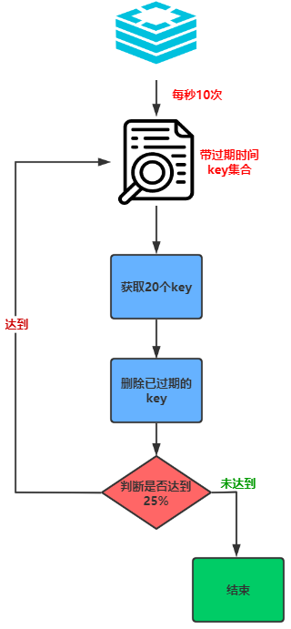

- 默认每秒运行10次会对具有过期时间的key进行一次扫描，但是并不会扫描全部的key，因为这样会大大延长扫描时间。
- 每次默认只会随机扫描20个key，同时删除这20个key中已经过期的key。
- 如果这20个key中过期key的比例达超过25%，则继续扫描。

### 5.3.2 参数配置

	默认每秒扫描10次，对于这个参数能不能手动调整呢？ 

	当然是可以的，只需要修改**redis.conf**中的**hz**参数即可。

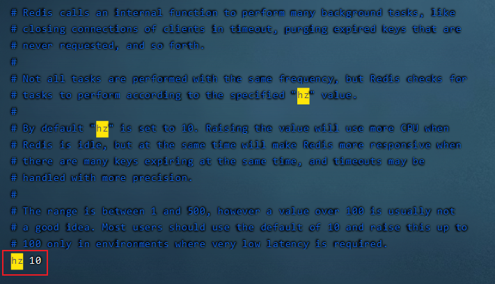

对于hz参数，官方建议不要超过100，否则会对CPU造成比较大的压力。

# 6 内存淘汰策略

## 6.1 为什么需要内存淘汰策略

学习完过期删除策略后， 大家思考两个问题：

- **通过惰性+定期删除，能不能百分百避免过期key没有被删除的情况？**   
- **当大量插入插入到Redis，但内存空间不足时，Redis会如何处理呢？**

举个例子： 

**有一些已经过期的key，定期扫描一直都没有扫描到它，而且这些key也一直没有被使用。 那么它们就会一直在内存中存在。同时继续向Redis不断插入新数据，最终造成内存空间不足的问题。**

	对于这种问题的解决，就用到了**内存淘汰策略**。

## 6.2 最大内存参数配置

那么现在有的同学可能会想，那我把内存空间设置的很大不就可以了。 ok，你可以把它设置的大一些，但是怎么设置呢？

修改**redis.conf**中的`maxmemory <bytes>` 来设置最大内存。

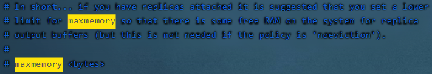

在64位操作系统中，如果未设置或设置0，代表无限制。而在32位系统中，默认内存大小为3GB。但是实际生产环境下，一般会设置**物理内存的四分之三**左右。

## 6.3 策略详解

	**当客户端执行命令，添加数据时，Redis会检查内存空间大小，如超过最大内存，则触发内存淘汰策略**。 

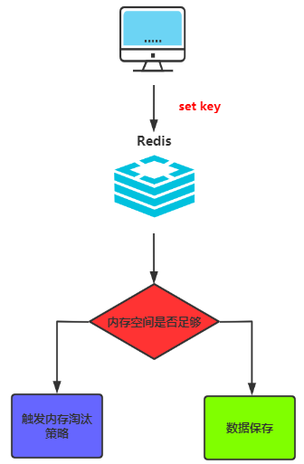

在Redis中默认提供了三类八种淘汰策略。

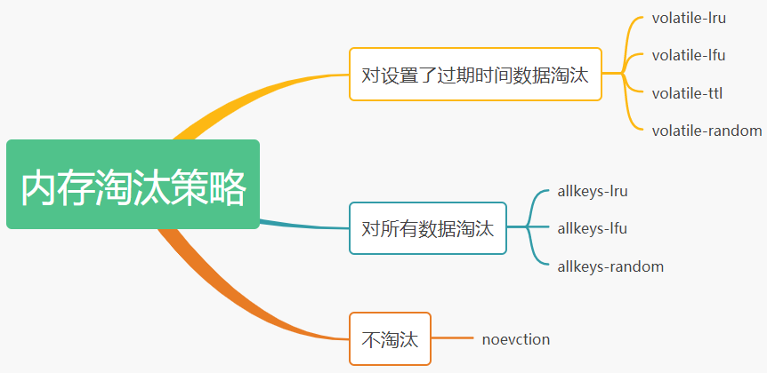

	对于这些策略各自的含义，我们还需要一点前置知识的铺垫，这里我们可以看到两个名称：**lru**、**lfu**，他俩是什么意思呢？

他们的学名叫做：**数据驱逐策略**。 其实所谓的**驱逐就是将数据从内存中删除掉**。

- **lru：**Least Recently Used，它是以**时间**为基准，删除最近**最久**未被使用的key。
- **lfu：**Least Frequently Used，它是以**频次**为基准，删除最近**最少**未被使用的key。

那理解了lru和lfu之后，我们再回来看这三类八种内存淘汰策略各自的机制。

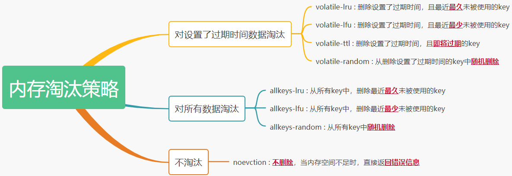

**知识小贴士：**

	对于**LRU**和**TTL**相关策略，每次触发时，redis会默认从5个key中一个key符合条件的key进行删除。如果要修改的话，可以修改**redis.conf**中**maxmemory-samples**属性值

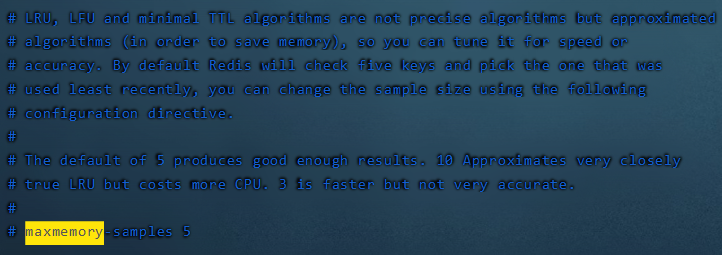

## 6.4 生产环境下的策略设置&选择

刚才已经为大家介绍完了redis中的八种内存淘汰策略，那么此时大家可能在想，这些策略我应该如何设置？何时来选择哪种策略使用？

	对于这两个问题，来给大家做一个一一解答：

### 6.4.1 策略设置

	**redis默认使用noeviction**，我们可以通过修改**redis.conf**中**maxmemory-policy**属性值设置不同的内存淘汰策略。


### 6.4.2 不同策略的使用场景

1、Redis只做缓存，不做DB持久化，使用allkeys。如状态性信息，经常被访问，但数据库不会修改。

2、同时用于缓存和DB持久化，使用volatile。如商品详情页。

3、存在冷热数据区分，则选择LRU或LFU。如热点新闻，热搜话题等。

4、每个key被访问概率基本相同，选择使用random。如企业内部系统，访问量不大，删除谁对数据库也造成太大压力。

5、根据超时时间长久淘汰数据，选择选用ttl。如微信过期好友请求。

# 7 Redis6.X新特性

新版Redis6特性讲解

- **支持多线程**

    - redis6多线程只是用来处理网络数据的读写和协议解析上，底层数据操作还是单线程

    - 执行命令仍然是单线程，之所以这么设计是不想因为多线程而变得复杂，需要去控制 key、lua、事务，LPUSH/LPOP 等等的并发问题

    - 默认不开启

      ```sh
      io-threads-do-reads yes
      io-threads 线程数
      ```

    - 官方建议 ( 线程数小于机器核数 )
        - 4 核的机器建议设置为 2 或 3 个线程
        - 8 核的建议设置为 4或6个线程，
    - 开启多线程后，是否会存在线程并发安全问题？
    - 不会有安全问题，Redis 的多线程部分只是用来处理网络数据的读写和协议解析，执行命令仍然是单线程顺序执行。

- **引入了 ACL（Access Control List)**

    - 之前的redis没有用户的概念，redis6引入了acl

    - 可以给每个用户分配不同的权限来控制权限

    - 通过限制对命令和密钥的访问来提高安全性，以使不受信任的客户端无法访问

    - 提高操作安全性，以防止由于软件错误或人为错误而导致进程或人员访问 Redis，从而损坏数据或配置

    - 文档：https://redis.io/topics/acl

    - 常用命令

        - acl list 当前启用的 ACL 规则
        - acl cat 支持的权限分类列表
        - acl cat hash 返回指定类别中的命令
        - acl setuser 创建和修改用户命令
        - acl deluser 删除用户命令

      ```sh
      +<command> 将命令添加到用户可以调用的命令列表中，如+@hash
      -<command> 将命令从用户可以调用的命令列表中移除
      #切换默认用户
      auth default 123456
      #例子 密码 123 ，全部key，全部权限
      acl setuser jack on >123 ~* +@all
      #例子 密码 123 ，全部key，get权限
      acl setuser jack on >123 ~*
      ```

| 参 数   | 说明                                                         |
| ------- | ------------------------------------------------------------ |
| user    | 用户                                                         |
| default | 表示默认用户名，或则自己定义的用户名                         |
| on      | 表示是否启用该用户，默认为off（禁用）                        |
| #...    | 表示用户密码，nopass表示不需要密码                           |
| ~*      | 表示可以访问的Key（正则匹配）                                |
| +@      | 表示用户的权限，“+”表示授权权限，有权限操作或访问，“-”表示还是没有权限； @为权限分类，可以通过 `ACL CAT` 查询支持的分类。+@all 表示所有权限，nocommands 表示不给与任何命令的操作权限 |

* **client side caching客户端缓存**

    * 类似浏览器缓存一样
        * 在服务器端更新了静态文件（如css、js、图片），能够在客户端得到及时的更新，但又不想让浏览器每次请求都从服务器端获取静态资源
        * 类似前端的-Expires、Last-Modified、Etag缓存控制
    * 文档：https://redis.io/topics/client-side-caching

    * 详细: 分为两种模式

      	    redis在服务端记录访问的连接和相关的key， 当key有变化时通知相应的应用
      应用收到请求后自行处理有变化的key, 进而实现client cache与redis的一致
      这需要客户端实现，目前lettuce对其进行了支持

    * 默认模式

        - Server 端全局唯一的表（**Invalidation Table**）记录每个Client访问的Key，当发生变更时，向client推送数据过期消息。
        - 优缺点
            - 优点：只对Client发送其访问过的被修改的数据
            - 缺点：Server端需要额外存储较大的数据量。
    * 广播模式
        - 客户端订阅key前缀的广播，服务端记录key前缀与client的对应关系。当相匹配的key发生变化时通知client。
        - 优缺点
            - 优点：服务端记录信息比较少
            - 缺点：client会收到自己未访问过的key的失效通知