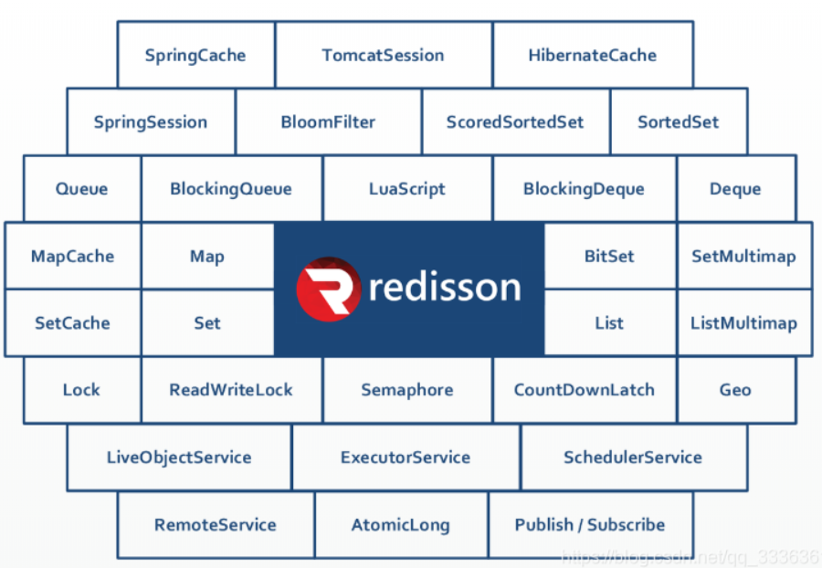
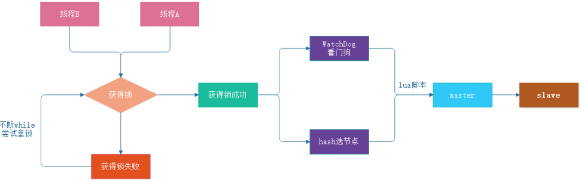

## **第一章 redisson框架**

	**Redisson是一个在Redis的基础上实现的Java驻内存数据网格（In-Memory Data Grid）。它不仅提供了一系列的分布式的Java常用对象，还提供了许多分布式服务**


		



**Redisson提供了使用Redis的最简单和最便捷的方法。Redisson的宗旨是促进使用者对Redis的关注分离（Separation of Concern），从而让使用者能够将精力更集中地放在处理业务逻辑上。**

### **1、redisson快速入门**

- 这里我们使用spring-boot集成redission,首先需要在pom.xml文件中添加依赖

```xml
<properties>
    <redisson-spring-boot>3.11.2</redisson-spring-boot>
</properties>
<!--redis缓存客户端-->
<dependency>
  <groupId>org.redisson</groupId>
  <artifactId>redisson-spring-boot-starter</artifactId>
  <version>${redisson-spring-boot}</version>
</dependency>
```

- 在项目的resources目录中application.yml添加

```yaml
spring:
  redis:
   redisson:
   #配置文件目录
    config: classpath:singleServerConfig.yaml
   #config: classpath:clusterServersConfig.yaml
```

#### **1.1、Single节点配置**

```yaml
---
singleServerConfig:
 #如果当前连接池里的连接数量超过了最小空闲连接数，而同时有连接空闲时间超过了该数值，
 #那么这些连接将会自动被关闭，并从连接池里去掉。时间单位是毫秒。
 #默认值：10000
  idleConnectionTimeout: 10000
  pingTimeout: 1000
 #同任何节点建立连接时的等待超时。时间单位是毫秒。
 #默认值：10000
  connectTimeout: 10000
 #等待节点回复命令的时间。该时间从命令发送成功时开始计时。
 #默认值：3000
  timeout: 3000
 #如果尝试达到 retryAttempts（命令失败重试次数）
 #仍然不能将命令发送至某个指定的节点时，将抛出错误。如果尝试在此限制之内发送成功，
 #则开始启用 timeout（命令等待超时） 计时
 #默认值：3
  retryAttempts: 3
 #在某个节点执行相同或不同命令时，连续失败failedAttempts（执行失败最大次数）时，
 #该节点将被从可用节点列表里清除，直到 reconnectionTimeout（重新连接时间间隔） 超时以后再次尝试。
 #默认值：1500
  retryInterval: 1500
 #重新连接时间间隔
  reconnectionTimeout: 3000
 #执行失败最大次数
  failedAttempts: 3
 #密码
  password: null
 #每个连接的最大订阅数量。
 #默认值：5
  subscriptionsPerConnection: 5
 #在Redis节点里显示的客户端名称。
  clientName: null
 #在Redis节点
  address: "redis://192.168.112.77:6379"
 #从节点发布和订阅连接的最小空闲连接数
 #默认值：1
  subscriptionConnectionMinimumIdleSize: 1
 #用于发布和订阅连接的连接池最大容量。连接池的连接数量自动弹性伸缩。
 #默认值：50
  subscriptionConnectionPoolSize: 50
 #节点最小空闲连接数
 #默认值：32
  connectionMinimumIdleSize: 32
 #节点连接池大小
 #默认值：64
  connectionPoolSize: 64
#这个线程池数量被所有RTopic对象监听器，RRemoteService调用者和RExecutorService任务共同共享。
#默认值: 当前处理核数量 * 2
threads: 8
#这个线程池数量是在一个Redisson实例内，被其创建的所有分布式数据类型和服务，
#以及底层客户端所一同共享的线程池里保存的线程数量。
#默认值: 当前处理核数量 * 2
nettyThreads: 8
#Redisson的对象编码类是用于将对象进行序列化和反序列化，以实现对该对象在Redis里的读取和存储。
#默认值: org.redisson.codec.JsonJacksonCodec
codec: !<org.redisson.codec.JsonJacksonCodec> {}
#传输模式
#默认值：TransportMode.NIO
transportMode: "NIO"
```

#### **1.2、Cluster节点配置**

		配置集群模式可以通过指定一个YAML格式的文件来实现。以下是YAML格式的配置文件样本。文件中的字段名称必须与clusterServersConfig和config对象里的字段名称相符。
```yaml	
	---
	clusterServersConfig:
	 #如果当前连接池里的连接数量超过了最小空闲连接数，而同时有连接空闲时间超过了该数值，
	 #那么这些连接将会自动被关闭，并从连接池里去掉。时间单位是毫秒。
	 #默认值：10000
	  idleConnectionTimeout: 10000
	 #同任何节点建立连接时的等待超时。时间单位是毫秒。
	 #默认值：10000
	  connectTimeout: 10000
	 #等待节点回复命令的时间。该时间从命令发送成功时开始计时。
	 #默认值：3000
	  timeout: 3000
	 #如果尝试达到 retryAttempts（命令失败重试次数）
	 #仍然不能将命令发送至某个指定的节点时，将抛出错误。如果尝试在此限制之内发送成功，
	 #则开始启用 timeout（命令等待超时） 计时。
	 #默认值：3
	  retryAttempts: 3
	 #在某个节点执行相同或不同命令时，连续失败failedAttempts（执行失败最大次数）时，
	 #该节点将被从可用节点列表里清除，直到 reconnectionTimeout（重新连接时间间隔） 超时以后再次尝试。
	 #默认值：1500
	  retryInterval: 1500
	 #密码
	  password: null
	 #每个连接的最大订阅数量。
	 #默认值：5
	  subscriptionsPerConnection: 5
	  clientName: null
	 #负载均衡算法类的选择
	 #默认值： org.redisson.connection.balancer.RoundRobinLoadBalancer
	 #在使用多个Elasticache Redis服务节点的环境里，可以选用以下几种负载均衡方式选择一个节点：
	  #org.redisson.connection.balancer.WeightedRoundRobinBalancer - 权重轮询调度算法
	  #org.redisson.connection.balancer.RoundRobinLoadBalancer - 轮询调度算法
	  #org.redisson.connection.balancer.RandomLoadBalancer - 随机调度算法
	  loadBalancer: !<org.redisson.connection.balancer.RoundRobinLoadBalancer> {}
	  slaveSubscriptionConnectionMinimumIdleSize: 1
	  slaveSubscriptionConnectionPoolSize: 50
	  slaveConnectionMinimumIdleSize: 32
	  slaveConnectionPoolSize: 64
	  masterConnectionMinimumIdleSize: 32
	  masterConnectionPoolSize: 64
	  readMode: "SLAVE"
	  nodeAddresses:
	   - "redis://192.168.112.71:7001"
	   - "redis://192.168.112.72:7001"
	   - "redis://192.168.112.73:7001"
	  scanInterval: 1000
	threads: 8
	nettyThreads: 8
	codec: !<org.redisson.codec.JsonJacksonCodec> {}
	"transportMode":"NIO"
```

### **2、redisson-分布式对象**

- 上面我们集成了redission客户端，下面我们来看下他的基本使用

#### **2.1、key操作相关**

- 所有与Redis key相关的操作都归纳在RKeys,我们可以通过RedissonClient直接对keys进行操作。

```java
package com.redission.service;

import lombok.extern.log4j.Log4j2;
import lombok.extern.slf4j.Slf4j;
import org.redisson.api.RBucket;
import org.redisson.api.RKeys;
import org.redisson.api.RedissonClient;
import org.springframework.beans.factory.annotation.Autowired;
import org.springframework.stereotype.Component;

/**
 * @ClassName KeyOpertions.java
 * @Description 关于key的操作
 */
@Slf4j
@Component
public class KeyOpertions {

  @Autowired
  RedissonClient redissonClient;

  public void foundedKeys(){
    RBucket<Object> bucket = redissonClient.getBucket("security:aa");
    bucket.set("张三");
    //获得所有keys
    RKeys keys = redissonClient.getKeys();
    Iterable<String> keysAll = keys.getKeys();
    for (String key : keysAll) {
      log.info("获得key:"+key);
     }
    //获得所有security开头的key
    Iterable<String> redisKeys = keys.getKeysByPattern("security*");
    for (String key : redisKeys) {
      log.info("获得key:"+key);
     }
   }

  public void deleteKeys(){
    RBucket<String> testA = redissonClient.getBucket("testA");
    RBucket<String> testB = redissonClient.getBucket("testB");
    testA.set("张成成");
    testB.set("张成成女朋友");
    //获得所有keys
    RKeys keys = redissonClient.getKeys();
    long flag = keys.delete("testA","testB");
    log.info("批量删除key:testA,testB:{}",flag);
    testA.set("张成成");
    testB.set("张成成女朋友");
    flag = keys.deleteByPattern("test*");
    log.info("模糊删除key:testA,testB:{}",flag);
   }

}

```

	

#### **2.2、通用对象桶**

- Redisson的分布式RBucket是一种通用对象桶可以用来存放任类型的对象,每个Redisson对象实例都会有一个与之对应的Redis数据实例，可以通过调用get***方法来取得Redis数据实例的名称（key），查看==BucketOpertions==类中的方法BucketOper：

```java
package com.redission.service;

import com.redission.pojo.AnyObject;
import lombok.extern.slf4j.Slf4j;
import org.redisson.api.RBucket;
import org.redisson.api.RBuckets;
import org.redisson.api.RedissonClient;
import org.springframework.beans.factory.annotation.Autowired;
import org.springframework.stereotype.Component;

import java.util.Map;
import java.util.concurrent.TimeUnit;

/**
* @ClassName BucketOpertions.java
* @Description 通用对象桶
*/
@Slf4j
@Component
public class BucketOpertions {

@Autowired
RedissonClient redissonClient;

/***
 * @description Bucket通用对象通
 */
public void bucketOper(){

  //获得Bucket
  RBucket<AnyObject> anyObjectRBucket = redissonClient.getBucket("BucketOpertions");
  //放入一个元素
  AnyObject anyObject = AnyObject.builder()
       .name("张三")
       .age(19)
       .address("中国上海")
       .build();
  //为BucketOperTest添加元素到redis中
  anyObjectRBucket.set(anyObject);
  long timeToLive = anyObjectRBucket.remainTimeToLive();
  log.info("BucketOperTest存活时间：{}",timeToLive);

  //修改BucketOperTest的存活时间为600秒
  anyObjectRBucket.set(anyObject,600, TimeUnit.SECONDS);
  timeToLive = anyObjectRBucket.remainTimeToLive();
  log.info("BucketOperTest存活时间：{}",timeToLive/1000);

  //试着为BucketOperTest添加元素到redis中,并且存活时间为600秒
  boolean trySetFlag = anyObjectRBucket.trySet(anyObject, 600, TimeUnit.SECONDS);
  log.info("试着为BucketOperTest存储元素：{}",trySetFlag);

  //在holder中获取当前元素并将其替换为新值
  AnyObject anyObjectNew = AnyObject.builder()
       .name("李四")
       .age(20)
       .address("中国北京")
       .build();
  AnyObject anyObjectResult = anyObjectRBucket.getAndSet(anyObjectNew);
  log.info("BucketOperTest原始值：{}",anyObjectResult);
  anyObjectResult = anyObjectRBucket.get();
  log.info("BucketOperTest新添值：{}",anyObjectResult);

  //移除BucketOperTest
  boolean deleteFalg = anyObjectRBucket.delete();
  log.info("BucketOperTest删除：{}",deleteFalg);
 }

/***
 * @description Buckets批量通用对象通
 */
public void bucketsOper(){
  //获得Bucket
  RBucket<AnyObject> bucketA = redissonClient.getBucket("BucketOpertionsTestA");
  //放入一个元素
  AnyObject anyObject = AnyObject.builder()
       .name("张三")
       .age(19)
       .address("中国上海")
       .build();
  //为BucketOperTest添加元素到redis中
  bucketA.set(anyObject);
  //获得Bucket
  RBucket<AnyObject> bucketB = redissonClient.getBucket("BucketOpertionsTestB");
  bucketB.set(anyObject);

  //获得Buckets
  RBuckets buckets = redissonClient.getBuckets();
  //这里的兼具map的属性
  Map<String, AnyObject> bucketsOperMap = buckets.get("BucketOpertionsTestA", "BucketOpertionsTestB");
  log.info("map的元素信息：{}",bucketsOperMap);
  //删除所有元素
  buckets.delete("BucketOpertionsTestA", "BucketOpertionsTestB");
 }
}

```

  

还可以通过RBuckets接口实现批量操作多个RBucket对象，查看==BucketOpertions==类中的方法BucketsOper：

```java
/***
   * @description Buckets批量通用对象通
   */
  public void BucketsOper(){
    //获得Bucket
    RBucket<AnyObject> bucketA=redissonClient.getBucket("BucketOperTestA");
    //放入一个元素
    AnyObject anyObject=AnyObject.builder()
         .name("张三")
         .age(19)
         .address("中国上海")
         .build();
    //为BucketOperTest添加元素到redis中
    bucketA.set(anyObject);
    //获得Bucket
    RBucket<AnyObject> bucketB=redissonClient.getBucket("BucketOperTestB");
    bucketB.set(anyObject);
    //获得Buckets
    RBuckets buckets=redissonClient.getBuckets();
    //这里的兼具map的属性
    Map<String, AnyObject> bucketsOperMap=buckets.get("BucketOperTestA", "BucketOperTestB");
    log.info("map的元素信息：{}",bucketsOperMap);
    //删除所有元素
    bucketsOperMap.clear();
   }
```

#### **2.3、原子整长形**

- Redisson的分布式整长形RAtomicLong与java.util.concurrent.atomic.AtomicLong对象类似

```java
package com.redission.service;

import lombok.extern.slf4j.Slf4j;
import org.redisson.api.RAtomicLong;
import org.redisson.api.RedissonClient;
import org.springframework.beans.factory.annotation.Autowired;
import org.springframework.stereotype.Component;

/**
 * @ClassName AtomicLongOpertions.java
 * @Description 原子整长型操作
 */
@Slf4j
@Component
public class AtomicLongOpertions {

  @Autowired
  RedissonClient redissonClient;

  public void atomicLongOper(){
    RAtomicLong atomicLongOper=redissonClient.getAtomicLong("AtomicLongOper");
    //添加一个从0开始的元素
    atomicLongOper.set(0);
    //获得当前元素
    long flag=atomicLongOper.get();
    log.info("获得当前元素:{}",flag);

    //先递增1，然后返回元素
    flag=atomicLongOper.incrementAndGet();
    log.info("先递增1，然后返回元素:{}",flag);

    //先获得元素，再递增1
    flag=atomicLongOper.getAndIncrement();
    log.info("先获得元素，再递增1",flag);

    //获得当前元素
    flag=atomicLongOper.get();
    log.info("获得当前元素:{}",flag);

    //先递减1，然后返回元素
    flag=atomicLongOper.decrementAndGet();
    log.info("先递减1，然后返回元素:{}",flag);

    //先获得元素，再递增1
    flag=atomicLongOper.getAndDecrement();
    log.info("先获得元素，再递减1",flag);

    //获得当前元素
    flag=atomicLongOper.get();
    log.info("获得当前元素:{}",flag);

    //删除元素
    boolean delete=atomicLongOper.delete();
    log.info("删除当前元素:{}",delete);

    //添加并且获得元素,如果想批量递减可以传入负数
    flag=atomicLongOper.addAndGet(2);
    log.info("添加并且获得元素:{}",flag);

    //获得并且删除元素
    flag=atomicLongOper.getAndDelete();
    log.info("获得并且删除元素:{}",flag);

    
   }

}
```

	

#### **2.4、原子双精度浮点**

- Redisson还提供了分布式原子双精度浮点RAtomicDouble弥补了Java自身的不足

```java
package com.redission.service;

import lombok.extern.slf4j.Slf4j;
import org.redisson.api.RAtomicDouble;
import org.redisson.api.RedissonClient;
import org.springframework.beans.factory.annotation.Autowired;
import org.springframework.stereotype.Component;

/**
 * @ClassName AtomicDoubleOpertions.java
 * @Description 原子浮点型操作
 */
@Slf4j
@Component
public class AtomicDoubleOpertions {

  @Autowired
  RedissonClient redissonClient;

  public void atomicDoubleOper(){

    RAtomicDouble atomicDoubleOper=redissonClient.getAtomicDouble("AtomicDoubleOper");
    //添加一个从2.0开始的元素
    atomicDoubleOper.set(2.0D);
    //获得当前元素
    double flag=atomicDoubleOper.get();
    log.info("获得当前元素:{}",flag);

    //先递增1，然后返回元素
    flag=atomicDoubleOper.incrementAndGet();
    log.info("先递增1，然后返回元素:{}",flag);

    //先获得元素，再递增1
    flag=atomicDoubleOper.getAndIncrement();
    log.info("先获得元素，再递增1",flag);

    //获得当前元素
    flag=atomicDoubleOper.get();
    log.info("获得当前元素:{}",flag);

    //先递减1，然后返回元素
    flag=atomicDoubleOper.decrementAndGet();
    log.info("先递减1，然后返回元素:{}",flag);

    //先获得元素，再递增1
    flag=atomicDoubleOper.getAndDecrement();
    log.info("先获得元素，再递减1",flag);

    //获得当前元素
    flag=atomicDoubleOper.get();
    log.info("获得当前元素:{}",flag);

    //删除元素
    boolean delete=atomicDoubleOper.delete();
    log.info("删除当前元素:{}",delete);

    //添加并且获得元素
    flag=atomicDoubleOper.addAndGet(2);
    log.info("添加并且获得元素:{}",flag);

    //获得并且删除元素
    flag=atomicDoubleOper.getAndDelete();
    log.info("获得并且删除元素:{}",flag);

   }
}
```

	

### **3、redisson-分布式集合**

#### **3.1、RMap对象**

- 基于Redis的Redisson的分布式映射结构的==RMap==对象实现了java.util.concurrent.ConcurrentMap接口和java.util.Map接口。与HashMap不同的是RMap保持了元素的插入顺序。该对象的最大容量受Redis限制，最大元素数量是4 294 967 295个

```java
package com.redission.service;

import com.redission.pojo.AnyObject;
import lombok.extern.slf4j.Slf4j;
import org.redisson.api.RMap;
import org.redisson.api.RedissonClient;
import org.springframework.beans.factory.annotation.Autowired;
import org.springframework.stereotype.Component;

import java.util.Collection;
import java.util.HashMap;
import java.util.Map;
import java.util.Set;

/**
 * @ClassName RMapOpertions.java
 * @Description hash表操作
 */
@Slf4j
@Component
public class RMapOpertions {

  @Autowired
  RedissonClient redissonClient;

  public void rMapOper(){

    //获得hash表，这里RMapOpertions为主key
    RMap<String, AnyObject> userInfo=redissonClient.getMap("userInfo");
    AnyObject anyObjectA=AnyObject.builder().id("1").name("嬴政").age(22).address("秦朝").build();
    AnyObject anyObjectB=AnyObject.builder().id("2").name("李斯").age(22).address("秦朝").build();
    AnyObject anyObjectC=AnyObject.builder().id("3").name("孙悟空").age(22).address("唐").build();
    //添加元素，返回的值为之前hash表中的值
    userInfo.put(anyObjectA.getId(),anyObjectA);
    userInfo.put(anyObjectB.getId(),anyObjectB);
    userInfo.put(anyObjectC.getId(),anyObjectC);

    //获得userInfo中所有的key
    Set<String> keySet=userInfo.readAllKeySet();
    log.info("获得userInfo中所有的key:{}",keySet.toString());

    //获得userInfo中所有的values
    Collection<AnyObject> anyObjects=userInfo.readAllValues();
    log.info("获得userInfo中所有的值:{}",anyObjects.toString());

    //获得userInfo中所有的元素对象
    Set<Map.Entry<String, AnyObject>> entries=userInfo.readAllEntrySet();
    log.info("获得userInfo中所有的元素对象:{}",entries.toString());
    userInfo.clear();

    //快速添加元素，与put的不同是不返回值，且添加速度快
    userInfo.fastPut(anyObjectA.getId(),anyObjectA);
    userInfo.fastPut(anyObjectB.getId(),anyObjectB);
    userInfo.fastPut(anyObjectC.getId(),anyObjectC);
    userInfo.clear();
    //批量添加
    Map<String,AnyObject> map=new HashMap<>();
    map.put(anyObjectA.getId(),anyObjectA);
    map.put(anyObjectB.getId(),anyObjectB);
    map.put(anyObjectC.getId(),anyObjectC);
    userInfo.putAll(map);

    //根据辅key获得元素，【和map中获得元素一样】
    AnyObject anyObjectResult=userInfo.get(anyObjectA.getId());
    log.info("根据辅key获得元素对象:{}",anyObjectResult.toString());

    //试着添加元素，如果元素key存在则不做任何修改，,如果元素key不存在则做修改，
    //返回结果为之前值【如果返回null,表明之前每页存储过元素】
    AnyObject anyObjectD=AnyObject.builder()
       .id("4").name("如来佛").age(1000000).address("上古").build();
    AnyObject anyObject=userInfo.putIfAbsent(anyObjectD.getId(), anyObjectD);
    //清除所有元素
    userInfo.clear();


   }
}

```

	

#### **3.2、RMapCache对象**

- 	Redisson的分布式的==RMapCache==象在基于RMap的前提下实现了==针对单个元素的淘汰机制==。同时仍然保留了元素的插入顺序。由于RMapCache是基于RMap实现的，使它同时继承了java.util.concurrent.ConcurrentMap接口和java.util.Map接口。

```java
package com.redission.service;

import com.redission.pojo.AnyObject;
import lombok.extern.slf4j.Slf4j;
import org.redisson.api.RMap;
import org.redisson.api.RMapCache;
import org.redisson.api.RedissonClient;
import org.springframework.beans.factory.annotation.Autowired;
import org.springframework.stereotype.Component;

import java.util.Collection;
import java.util.Map;
import java.util.Set;
import java.util.concurrent.TimeUnit;

/**
 * @ClassName RMapCacheOpertions.java
 * @Description 带淘汰机制的hash表操作
 */
@Slf4j
@Component
public class RMapCacheOpertions {

  @Autowired
  RedissonClient redissonClient;

  public void rMapCache(){

    //获得hash表，这里RMapOpertions为主key
    RMapCache<String, AnyObject> userInfo=redissonClient.getMapCache("userInfo");
    AnyObject anyObjectA=AnyObject.builder().id("1").name("嬴政").age(22).address("秦朝").build();
    AnyObject anyObjectB=AnyObject.builder().id("2").name("李斯").age(22).address("秦朝").build();
    AnyObject anyObjectC=AnyObject.builder().id("3").name("孙悟空").age(22).address("唐").build();
    //添加元素，返回的值为之前hash表中的值，并且为每个子元素添加过期时间
    userInfo.put(anyObjectA.getId(),anyObjectA,20, TimeUnit.SECONDS);
    userInfo.put(anyObjectB.getId(),anyObjectB,20, TimeUnit.SECONDS);
    userInfo.put(anyObjectC.getId(),anyObjectC,20, TimeUnit.SECONDS);

    //获得userInfo中所有的key
    Set<String> keySet=userInfo.readAllKeySet();
    log.info("获得userInfo中所有的key:{}",keySet.toString());

    //获得userInfo中所有的values
    Collection<AnyObject> anyObjects=userInfo.readAllValues();
    log.info("获得userInfo中所有的值:{}",anyObjects.toString());

    //获得userInfo中所有的元素对象
    Set<Map.Entry<String, AnyObject>> entries=userInfo.readAllEntrySet();
    log.info("获得userInfo中所有的元素对象:{}",entries.toString());
    userInfo.clear();

    //其他操作与RMap类似，这里就不再操作

   }
}

```


	
- == 注意：
  - ==目前的Redis自身并不支持散列（Hash）当中的元素淘汰，因此所有过期元素都是通过org.redisson.EvictionScheduler实例来实现定期清理的。为了保证资源的有效利用，每次运行最多清理300个过期元素。任务的启动时间将根据上次实际清理数量自动调整，间隔时间趋于1秒到1小时之间。比如该次清理时删除了300条元素，那么下次执行清理的时间将在1秒以后（最小间隔时间）。一旦该次清理数量少于上次清理数量，时间间隔将增加1.5倍

### **4、redisson-分布式锁**

#### **4.1、原理分析**



- **加锁机制**
- 线程去获取锁，获取成功: 执行lua脚本，保存数据到redis数据库。
- 线程去获取锁，获取失败: 一直通过while循环尝试获取锁，获取成功后，执行lua脚本，保存数据到redis
- **WatchDog自动延期机制**
- 第一种情况：在一个分布式环境下，假如一个线程获得锁后，突然服务器宕机了，那么这个时候在一定时间后这个锁会自动释放，你也可以设置锁的有效时间(不设置默认30秒），这样的目的主要是防止死锁的发生
-  第二种情况：线程A业务还没有执行完，时间就过了，线程A 还想持有锁的话，就会启动一个watch dog后台线程，不断的延长锁key的生存时间
- **lua脚本**
- 主要是如果你的业务逻辑复杂的话，通过封装在lua脚本中发送给redis，而且redis是单线程的，这样就保证这段复杂业务逻辑执行的原子性

#### **4.2、基本使用**

- 	很明显RLock是继承Lock锁，所以他有Lock锁的所有特性，比如lock、unlock、trylock等特性,同时它还有很多新特性：强制锁释放，带有效期的锁,。

```java

public interface RLock {
  
  //----------------------Lock接口方法-----------------------

  /**
   * 加锁 锁的有效期默认30秒
   */
  void lock();
  
   /**
   * 加锁 可以手动设置锁的有效时间
   *
   * @param leaseTime 锁有效时间
   * @param unit    时间单位 小时、分、秒、毫秒等
   */
  void lock(long leaseTime, TimeUnit unit);
  
  /**
   * tryLock()方法是有返回值的，用来尝试获取锁，
   * 如果获取成功，则返回true，如果获取失败（即锁已被其他线程获取），则返回false .
   */
  boolean tryLock();
  
  /**
   * tryLock(long time, TimeUnit unit)方法和tryLock()方法是类似的，
   * 只不过区别在于这个方法在拿不到锁时会等待一定的时间，
   * 在时间期限之内如果还拿不到锁，就返回false。如果如果一开始拿到锁或者在等待期间内拿到了锁，则返回true。
   *
   * @param time 等待时间
   * @param unit 时间单位 小时、分、秒、毫秒等
   */
  boolean tryLock(long time, TimeUnit unit) throws InterruptedException;
  
  /**
   * 比上面多一个参数，多添加一个锁的有效时间
   *
   * @param waitTime  等待时间
   * @param leaseTime 锁有效时间
   * @param unit    时间单位 小时、分、秒、毫秒等
   */
  boolean tryLock(long waitTime, long leaseTime, TimeUnit unit) throws InterruptedException;
  
  /**
   * 解锁
   */
  void unlock();
  
  
}
```


##### **lock()**：

==此方法为加锁，但是锁的有效期采用默认30秒，如果主线程未释放，且当前锁未调用unlock方法，则进入到watchDog机制，如果主线程未释放，且当前锁调用unlock方法，则直接释放锁==

```java
public void lock() throws InterruptedException{
  log.info("线程：{}，进入方法",Thread.currentThread().getName());
  RLock rLock=redissonClient.getLock("lock");
  //加锁：锁的有效期默认30秒
  rLock.lock();
  long timeToLive=rLock.remainTimeToLive();
  log.info("线程：{}，获得锁，锁存活时间：{}S",Thread.currentThread().getName(),timeToLive/1000);
  //休眠一下
  Thread.sleep(2000);
  //如果主线程未释放，且当前锁未调用unlock方法，则进入到watchDog机制
  //如果主线程未释放，且当前锁调用unlock方法，则直接释放锁
  rLock.unlock();
  log.info("线程：{}，释放锁",Thread.currentThread().getName());
}
```

##### **lock(long leaseTime, TimeUnit unit)：**

==可以手动设置锁的有效时间,如果主线程未释放，且当前锁未调用unlock方法，则锁到期后会自动释放,如果主线程未释放，且当前锁调用unlock方法，则直接释放锁==

```java
public void lockLaseTime() throws InterruptedException{
  log.info("线程：{}，进入方法",Thread.currentThread().getName());
  RLock rLock=redissonClient.getLock("lockLaseTime");
  //加锁 上面是默认30秒,
  //这里可以手动设置锁的有效时间，锁到期后会自动释放的
  rLock.lock(10,TimeUnit.SECONDS);
  long timeToLive=rLock.remainTimeToLive();
  log.info("线程：{}，获得锁，锁存活时间：{}S",Thread.currentThread().getName(),timeToLive/1000);
  //休眠一下
  Thread.sleep(2000);
  //如果主线程未释放，且当前锁未调用unlock方法，则锁到期后会自动释放
  //如果主线程未释放，且当前锁调用unlock方法，则直接释放锁
  rLock.unlock();
  log.info("线程：{}，释放锁",Thread.currentThread().getName());
}
```

##### **tryLock():**

==用来尝试获取锁，如果获取成功，则返回true，如果获取失败（即锁已被其他线程获取），则返回false，如果主线程未释放，且当前锁未调用unlock方法，则进入到watchDog机制，如果主线程未释放，且当前锁调用unlock方法，则直接释放锁==

```java
public void tryLock() throws InterruptedException {
  log.info("线程：{}，进入方法",Thread.currentThread().getName());
  RLock rLock=redissonClient.getLock("tryLock");
  //tryLock()方法是有返回值的，它表示用来尝试获取锁，
  //如果获取成功，则返回true，如果获取失败（即锁已被其他线程获取），则返回false .
  boolean flag=rLock.tryLock();
  if (flag){
    long timeToLive=rLock.remainTimeToLive();
    log.info("线程：{}，获得锁，锁存活时间：{}S，加锁状态：{}",Thread.currentThread().getName(),timeToLive/1000,flag);
    //休眠一下
    Thread.sleep(2000);
    //如果主线程未释放，且当前锁未调用unlock方法，则进入到watchDog机制
    //如果主线程未释放，且当前锁调用unlock方法，则直接释放锁
    rLock.unlock();
    log.info("线程：{}，释放锁",Thread.currentThread().getName());
   }else {
    log.info("线程：{}，获得锁失败",Thread.currentThread().getName());
   }
}
```

##### **tryLock(long time, TimeUnit unit)：**

==tryLock(long time, TimeUnit unit)方法和tryLock()方法是类似的，只不过区别在于这个方法在拿不到锁时会等待一定的时间， 在时间期限之内如果还拿不到锁，就返回false。如果如果一开始拿到锁或者在等待期间内拿到了锁，则返回true,如果主线程未释放，且当前锁未调用unlock方法，则进入到watchDog机制如果主线程未释放，且当前锁调用unlock方法，则直接释放锁==

```java
public void tryLockWaitTime() throws InterruptedException {
  log.info("线程：{}，进入方法",Thread.currentThread().getName());
  RLock rLock=redissonClient.getLock("tryLockWaitTime");
  //tryLock(long time, TimeUnit unit)方法和tryLock()方法是类似的，
  //只不过区别在于这个方法在拿不到锁时会等待一定的时间，
  //在时间期限之内如果还拿不到锁，就返回false如果一开始拿到锁或者在等待期间内拿到了锁，则返回true。
  boolean flag=rLock.tryLock(6, TimeUnit.SECONDS);
  if (flag){
    long timeToLive=rLock.remainTimeToLive();
    log.info("线程：{}，获得锁，锁存活时间：{}S，加锁状态：{}",Thread.currentThread().getName(),timeToLive/1000,flag);
    //休眠一下
    Thread.sleep(10000);
    //如果主线程未释放，且当前锁未调用unlock方法，则进入到watchDog机制
    //如果主线程未释放，且当前锁调用unlock方法，则直接释放锁
    rLock.unlock();
    log.info("线程：{}，释放锁",Thread.currentThread().getName());
   }else {
    log.info("线程：{}，获得锁失败",Thread.currentThread().getName());
   }

}
```

##### **tryLock(long waitTime, long leaseTime, TimeUnit unit)：**

比上面多一个参数，多添加一个锁的有效时间

```java
public void tryLockleasTime() throws InterruptedException {
    log.info("线程：{}，进入方法",Thread.currentThread().getName());
    RLock rLock = redissonClient.getLock("tryLockleasTime");
    //比上面多一个参数，多添加一个锁的有效时间
    boolean flag = rLock.tryLock(11,10, TimeUnit.SECONDS);
    if (flag){
      long timeToLive = rLock.remainTimeToLive();
      log.info("线程：{}，获得锁，锁存活时间：{}S，加锁状态：{}",Thread.currentThread().getName(),timeToLive/1000,flag);
      //休眠一下
      Thread.sleep(6000);
      //如果主线程未释放，且当前锁未调用unlock方法，则锁到期后会自动释放的
      //如果主线程未释放，且当前锁调用unlock方法，则直接释放锁
      rLock.unlock();
      log.info("线程：{}，释放锁",Thread.currentThread().getName());
     }else {
      log.info("线程：{}，获得锁失败",Thread.currentThread().getName());
     }
   }
```