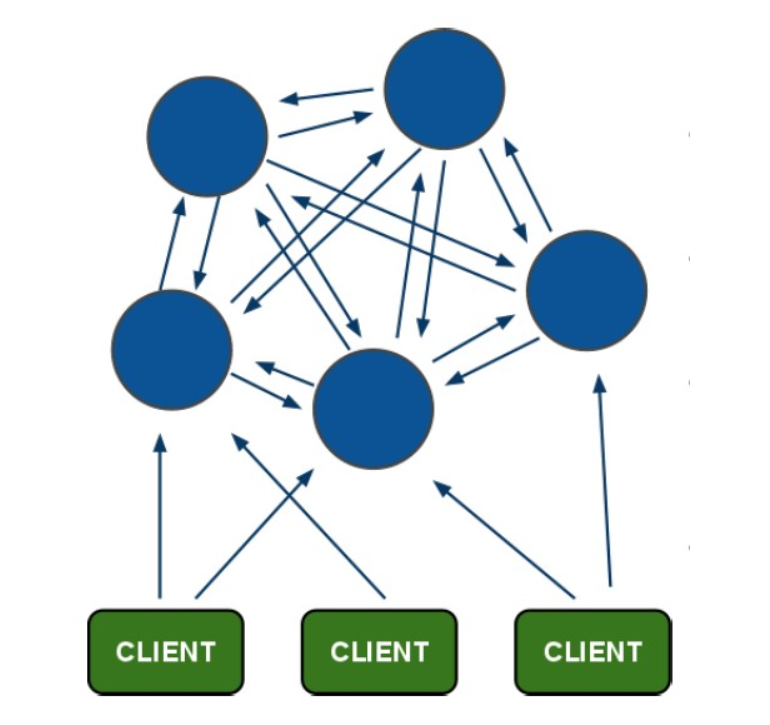

### **一、redis单点【主从】**

 		基本上就是一主一从，我们应用层主要使用的是主节点，从节点的主要工作是从主节点做主从复制。关键时刻，如果主服务器挂掉，可以手动启动从服务器，然后更改应用层的`redis`的`ip`即可。

### **二、redis读写分离**

常见的应用场景下我觉得`redis`没必要进行读写分离。

先来讨论一下为什么要读写分离：

读写分离使用于大量读请求的情况，通过多个slave分摊了读的压力，从而增加了读的性能。

过多的select会阻塞住数据库，使你增删改不能执行，而且到并发量过大时，数据库会拒绝服务。

因而通过读写分离，从而增加性能，避免拒绝服务的发生。

我认为需要读写分离的应用场景是：写请求在可接受范围内，但读请求要远大于写请求的场景。

再来讨论一下`redis`常见的应用场景：

- 1.缓存

- 2.排名型的应用，访问计数型应用

- 3.实时消息系统

首先说一下缓存集群，这也是非常常见的应用场景：

- 1.缓存主要解决的是用户访问时，怎么以更快的速度得到数据。

- 2.单机的内存资源是很有限的，所以缓存集群会通过某种算法将不同的数据放入到不同的机器中。
- 3.不同持久化数据库，一般来说，内存数据库单机可以支持大量的增删查改。
- 4.如果一台机器支持不住，可以用主从复制，进行缓存的方法解决。
- 5.综上，在这个场景下应用redis 进行读写分离，完全就失去了读写分离的意义。

当然，也有可能我考虑不到的地方需要读写分离，毕竟“存在即合理”嘛，那么我们就来介绍一下这个读写分离吧。

**读写分离：**

对于读占比较高的场景，可以通过把一部分流量分摊导出从节点(salve) 来减轻主节点（master）压力，同时需要主要只对主节点执行写操作，如下图：

当使用从节点响应读请求时，业务端可能会遇到以下问题：

复制数据延迟 读到过期数据 从节点故障 

#### **1.数据延迟**

Redis 复制数的延迟由于异步复制特性是无法避免的，延迟取决于网络带宽和命令阻塞情况，对于无法容忍大量延迟场景，可以编写外部监控程序监听主从节点的复制偏移量，当延迟较大时触发报警或者通知客户端避免读取延迟过高的从节点，实现逻辑如下图：

说明如下：

- (1） 监控程序(monitor) 定期检查主从节点的偏移量，主节点偏移量在info replication  的master_repl_offset 指标记录，从节点 偏移量可以查询主节点的slave0  字段的offset指标，它们的差值就是主从节点延迟的字节 量。

- (2）当延迟字节量过高时，比如超过10M。监控程序触发报警并通知客户端从节点延迟过高。可以采用Zookeeper的监听回调机制实现客户端通知。

- (3） 客户端接到具体的从节点高延迟通知后，修改读命令路由到其他从节点或主节点上。当延迟回复后，再次通知客户端，回复从节点的读命令请求。

这种方案成本较高，需要单独修改适配Redis的客户端类库。

#### **2.读到过期数据**

当主节点存储大量设置超时的数据时，如缓存数据，Redis内部需要维护过期数据删除策略，删除策略主要有两种：惰性删除和定时删除。

惰性删除：主节点每次处理读取命令时，都会检查键是否超时，如果超时则执行del命令删除键对象那个，之后del命令也会异步 发送给 从节点

需要注意的是为了保证复制的一致性，从节点自身永远不会主动删除超时数据，如上图。

定时删除：

Redis主节点在内部定时任务会循环采样一定数量的键，当发现采样的键过期就执行del命令，之后再同步给从节点，如下图

如果此时 数据的大量超时，主节点采样速度跟不上过期速度且主节点没有读取过期键的操作，那么从节点将无法收到del命令，这时在从节点  上可以读取到已经超时的数据。Redis在3.2 版本解决了这个问题，从节点  读取数据之前会检查键的过期时间来决定是否返回数据，可以升级到3.2版本来规避这个问题。

### **三、一主多从的哨兵模式**

 

**工作原理:**

- 1.用户链接时先通过哨兵获取主机Master的信息

- 2.获取Master的链接后实现redis的操作(set/get)

- 3.当master出现宕机时,哨兵的心跳检测发现主机长时间没有响应.这时哨兵会进行推选.推选出新的主机完成任务.

- 4.当新的主机出现时,其余的全部机器都充当该主机的从机

 		这就有一个问题，就是添加哨兵以后，所有的请求都会经过哨兵询问当前的主服务器是谁，所以如果哨兵部在主服务器上面的话可能会增加服务器的压力，所以最好是将哨兵单独放在一个服务器上面。以分解压力。然后可能还有人担心哨兵服务器宕机了怎么办啊，首先哨兵服务器宕机的可能性很小，然后是如果哨兵服务器宕机了，使用人工干预重启即可，就会导致主从服务器监控的暂时不可用，不影响主从服务器的正常运行。

### **四、集群模式**

**一、概述**

  Redis3.0版本之后支持Cluster.

#### 1.1、redis cluster的现状

 　目前redis支持的cluster特性：
```
　　(1):节点自动发现

　　(2):slave->master 选举,集群容错

　　(3):Hot resharding:在线分片

　　(4):进群管理:cluster xxx

　　(5):基于配置(nodes-port.conf)的集群管理

　　(6):ASK 转向/MOVED 转向机制.
```


#### 1.2、redis cluster 架构

 - 1.redis-cluster架构图



　　架构细节:
```
	(1)所有的redis节点彼此互联(PING-PONG机制),内部使用二进制协议优化传输速度和带宽.

	(2)节点的fail是通过集群中超过半数的节点检测失效时才生效.

	(3)客户端与redis节点直连,不需要中间proxy层.客户端不需要连接集群所有节点,连接集群中任何一个可用节点即可

	(4)redis-cluster把所有的物理节点映射到[0-16383]slot上,cluster 负责维护node<->slot<->value
```


- 2.redis-cluster选举:容错


```
　　(1)领着选举过程是集群中所有master参与,如果半数以上master节点与master节点通信超过(cluster-node-timeout),认为当前master节点挂掉.

　　(2):什么时候整个集群不可用(cluster_state:fail),当集群不可用时,所有对集群的操作做都不可用，收到((error) CLUSTERDOWN The cluster is down)错误

  　　a:如果集群任意master挂掉,且当前master没有slave.集群进入fail状态,也可以理解成进群的slot映射[0-16383]不完成时进入fail状态.

  　　b:如果进群超过半数以上master挂掉，无论是否有slave集群进入fail状态.
```