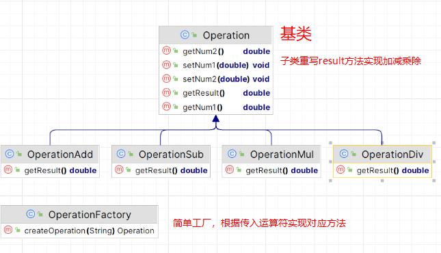
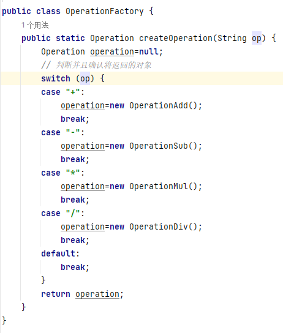
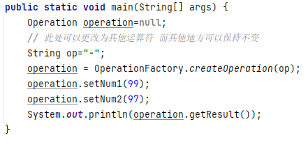
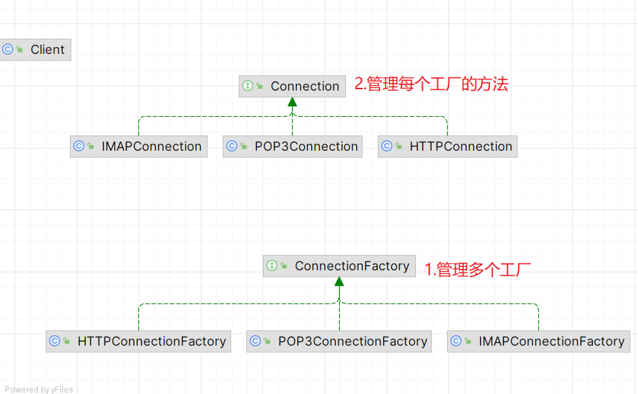
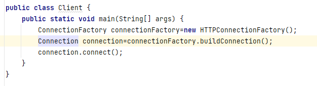

一：简单工厂模式
**优点**
工厂类是整个模式的关键.包含了必要的逻辑判断,根据外界给定的信息,决定究竟应该创建哪个具体类的对象.通过使用工厂类,外界可以从直接创建具体产品对象的尴尬局面摆脱出来,仅仅需要负责“消费”对象就可以了。而不必管这些对象究竟如何创建及如何组织的．明确了各自的职责和权利，有利于整个软件体系结构的优化。
**缺点**
由于工厂类集中了所有实例的创建逻辑，违反了[高内聚](https://baike.baidu.com/item/%E9%AB%98%E5%86%85%E8%81%9A)责任分配原则，将全部创建逻辑集中到了一个工厂类中；它所能创建的类只能是事先考虑到的，如果需要添加新的类，则就需要改变工厂类了。

根据传入运算符匹配

实现

二：工厂模式

**结构图**

**实现**
