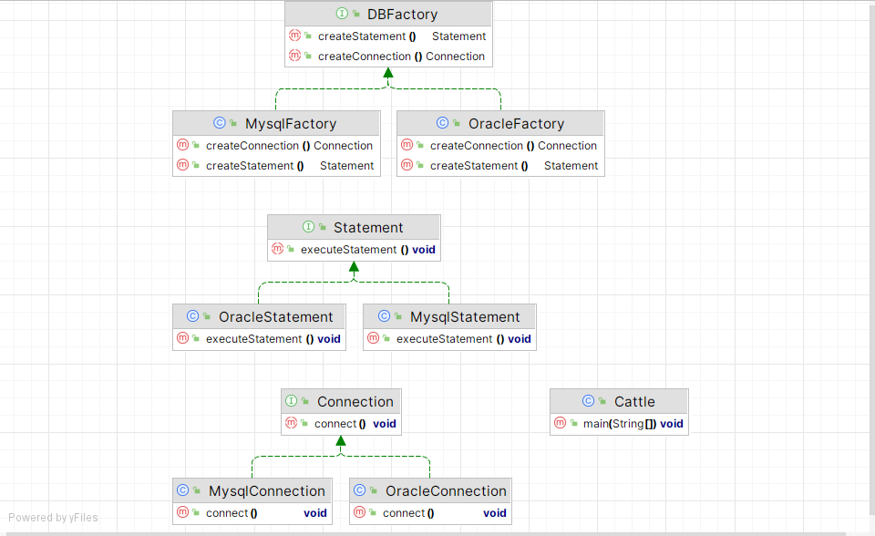
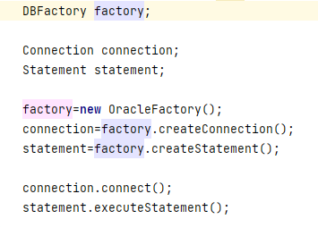

工厂方法模式引入工厂等级结构，解决了简单工厂模式中工厂类职责过重的问题，但由于工厂方法模式中每个工厂只创建一类具体类的对象，这将会导致系统当中的工厂类过多，这势必会增加系统的开销。此时，我们可以考虑将一些相关的具体类组成一个“具体类族”，由同一个工厂来统一生产，这就是我们本文要说的“抽象工厂模式”的基本思想。

**抽象工厂模式包含的角色**

- 抽象工厂：声明一组用于创建一族产品的方法，每个方法对应一种对象；在抽象工厂中声明了多个工厂方法， 用于创建不同类型的对象， 抽象工厂可以是接口， 也可以是抽象类或者具体类，具体实现可参考上例中的ShapeFactory；

- 具体工厂：具体工厂实现了抽象工厂，每个工厂方法返回一个具体对象，一个具体工厂所创建的具体对象构成一个族。具体实现可参考上例中的RedShapeFactory；

- 抽象类接口：提供一组所有类都具有的业务方法。

- 抽象类：用于实现抽象接口所定义的业务方法，但是该角色对于抽象接口定义的方法只做抽象实现，即所有实现都被定义为抽象方法，最终的具体实现全部交给具体类实现。引入该角色主要是为了根据声明不同的抽象类，将类区分为不同的等级结构。

- 具体类：该角色继承抽象类，主要用于实现抽象类中声明的抽象方法，完成不同等级结构，不同族的业务方法的具体实现。

**实现**

