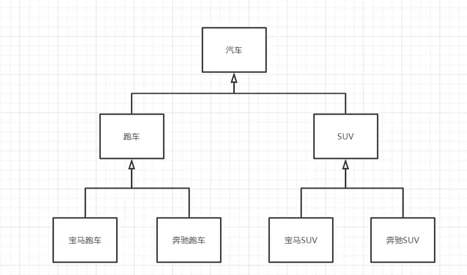
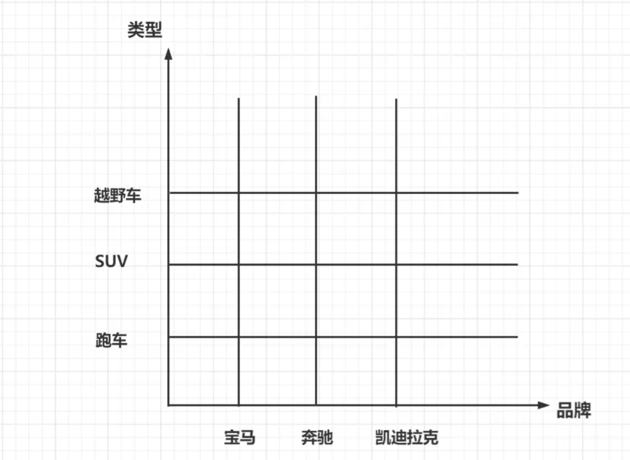
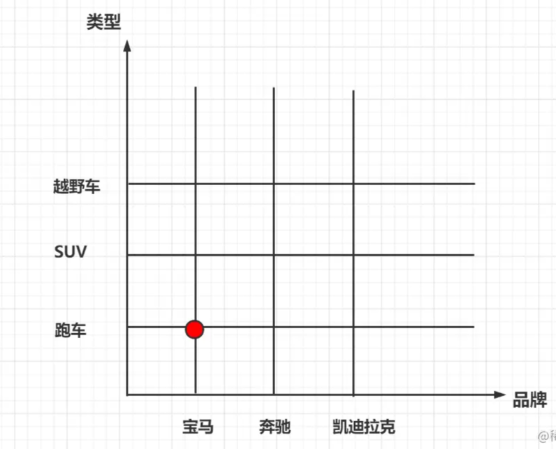
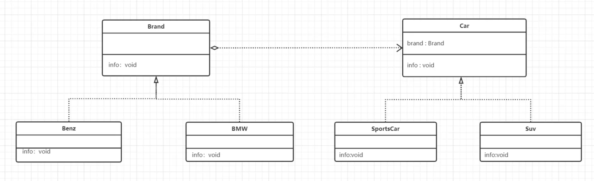

## 1 桥接模式的定义

**桥接模式**（Bridge Pattem）：将**抽象部分**和**实现部分**分离，使它们都可以独立地变化。它是一种**对象结构型模式**，又称**柄体模式**或者**接口模式**。

## 2 为什么引入桥接模式



当用户采用多继承的方式实现代码时，增加一个新的种类非常不方便（**可拓展性差**）。如上图，我想增加一个奥迪类，则需要在跑车中增加奥迪跑车类，在SUV中增加奥迪SUV类，这仅仅是两个，如果是多的话会更加的麻烦。

同时也违反了 **单一职责原则**。

桥接模式可以很好的优化这一问题。



把上面的例子总结一下，可以得到如下的图。



桥接模式的作用就如同中间的点，将类型和品牌联系起来。

## 3.1 代码


**Brand.interface**

```
//品牌接口
public interface Brand {
    public void info();
}


```

**BMW**

```
public class BMW implements Brand{
    @Override
    public void info() {
        System.out.print("宝马");
    }
}


```

**Benz**

```
public class Benz implements Brand{
    @Override
    public void info() {
        System.out.print("奔驰");
    }
}

```

**Car**

```
public abstract class Car {
    protected Brand brand;

    public Car(Brand brand) {
        this.brand = brand;
    }
    public void info()
    {
        brand.info();
    }
}


```

**SportsCar**

```
public class SportsCar extends Car{

    public SportsCar(Brand brand) {
        super(brand);
    }

    @Override
    public void info() {
        super.info();
        System.out.println("跑车");
    }
}


```

**SUV**

```
public class SUV extends Car{
    public SUV(Brand brand) {
        super(brand);
    }

    @Override
    public void info() {
        super.info();
        System.out.println("越野车");
    }
}


```

**Client**

```
public class Client {
    public static void main(String[] args) {
        //宝马跑车
        Car car = new SportsCar(new BMW());
        car.info();
    }
}


```

## 3.2 类图



将多继承转化为桥接模式之后，如果在想增加一个凯利拉克，就只需要在Car里面增加一个凯利拉克，而不需要对其他类进行改动。

## 4 桥接模式的优缺点

## 4.1 优点

*   桥接模式偶尔类似于多继承方案，但是多继承方案违背了类的单一职责原则，复用性比较差，类的个数也非常多，桥接模式是比多继承方案更好的解决方法。极大的减少了子类的个数，从而降低管理和维护的成本。
*   桥接模式提高了系统的可扩充性，在两个变化维度中任意拓展一个维度，都不需要修改原有的系统。符合开闭原则，就像一座桥，可以把两个变化的维度连接起来。

4.2 缺点
----------------------------------------------------------------------------------------------------------------------------------------------------------------------------------------------------------------------------------------------------------------------------------------------------------------------------------------------------------------------------------------------------------------------------------------

*   桥接模式的引入会**增加系统的理解与设计难度**，由于聚合关联关系建立在抽象层，要求开发者针对抽象进行设计与编程。
*   桥接模式要求正确识别出系统中两个独立变化的维度，因此其使用范围具有一定的局限性。

4.3 适用环境
------------------------------------------------------------------------------------------------------------------------------------------------------------------------------------------------------------------------------------------------------------------------------------------------------------------------------------------------------------------------------------------------------------------------------------------

如果一个系统需要在构件的抽象化角色和具体化角色之间增加更多的灵活性，避免在两个层次之间建立静态的继承联系，通过桥接模式可以使它们在抽象层建立一个关联关系。

抽象化角色和实现化角色可以继承的方式独立扩展而不相互影响，在程序运行时可以动态讲一个抽象化子类的对象和一个实现化子类的对象进行组合，即系统需要对抽象化角色和实现化角色进行动态耦合。

一个类存在两个独立变化的维度，且这两个维度都需要进行扩展。虽然在系统中使用继承是没有问题的，但是由于抽象化角色和具体化角色需要独立变化，设计需求需要独立管理这两者。

对于那些不希望使用继承或因为多层次继承导致系统类的个数急剧增加的系统，桥接模式尤为适用。

4.4 场景
----------------------------------------------------------------------------------------------------------------------------------------------------------------------------------------------------------------------------------------------------------------------------------------------------------------------------------------------------------------------------------------------------------------------------------------

*   Java语言通过Java虚拟机实现跨平台性
*   AWT中的Peer架构  
    然在系统中使用继承是没有问题的，但是由于抽象化角色和具体化角色需要独立变化，设计需求需要独立管理这两者。

对于那些不希望使用继承或因为多层次继承导致系统类的个数急剧增加的系统，桥接模式尤为适用。

4.4 场景
----------------------------------------------------------------------------------------------------------------------------------------------------------------------------------------------------------------------------------------------------------------------------------------------------------------------------------------------------------------------------------------------------------------------------------------

*   Java语言通过Java虚拟机实现跨平台性
*   AWT中的Peer架构
*   JDBC驱动程序也是桥接模式的应用之一