# **分布式事务**

**0.学习目标**

## **1.分布式事务问题**

### **1.1.本地事务**

本地事务，也就是传统的**单机事务**。在传统数据库事务中，必须要满足四个原则：

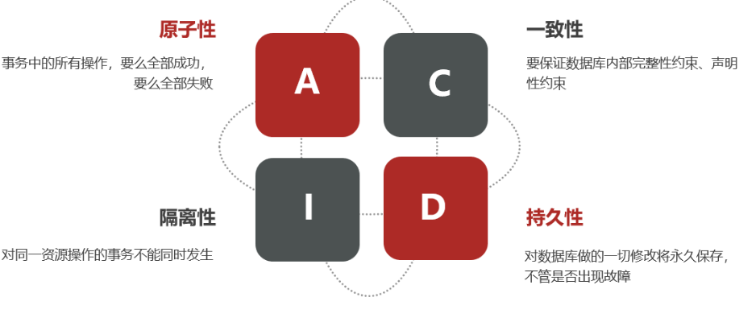

### **1.2.分布式事务**

**分布式事务**，就是指不是在单个服务或单个数据库架构下，产生的事务，例如：

- 跨数据源的分布式事务
- 跨服务的分布式事务
- 综合情况

		在数据库水平拆分、服务垂直拆分之后，一个业务操作通常要跨多个数据库、服务才能完成。例如电商行业中比较常见的下单付款案例，包括下面几个行为：

- 创建新订单
- 扣减商品库存
- 从用户账户余额扣除金额

完成上面的操作需要访问三个不同的微服务和三个不同的数据库。


订单的创建、库存的扣减、账户扣款在每一个服务和数据库内是一个本地事务，可以保证ACID原则。

但是当我们把三件事情看做一个"业务"，要满足保证“业务”的原子性，要么所有操作全部成功，要么全部失败，不允许出现部分成功部分失败的现象，这就是**分布式系统下的事务**了。

此时ACID难以满足，这是分布式事务要解决的问题

## **2.理论基础**

解决分布式事务问题，需要一些分布式系统的基础知识作为理论指导。

### **2.1.CAP定理**

1998年，加州大学的计算机科学家 Eric Brewer 提出，分布式系统有三个指标。

Consistency（一致性）Availability（可用性）Partition tolerance （分区容错性）

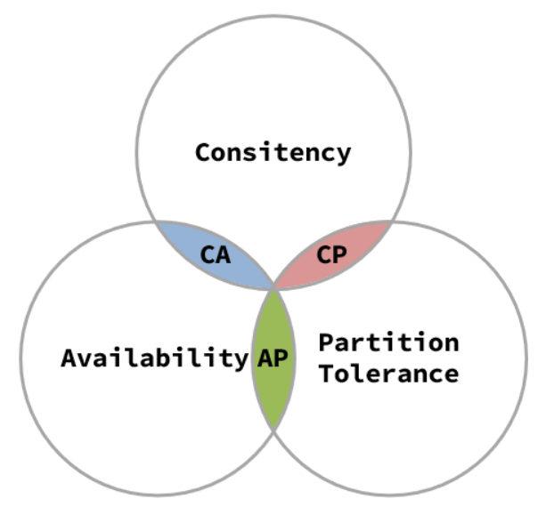

它们的第一个字母分别是 C、A、P。

Eric Brewer 说，这三个指标不可能同时做到。这个结论就叫做 CAP 定理。

#### **2.1.1.一致性**

Consistency（一致性）：用户访问分布式系统中的任意节点，得到的数据必须一致。

比如现在包含两个节点，其中的初始数据是一致的：

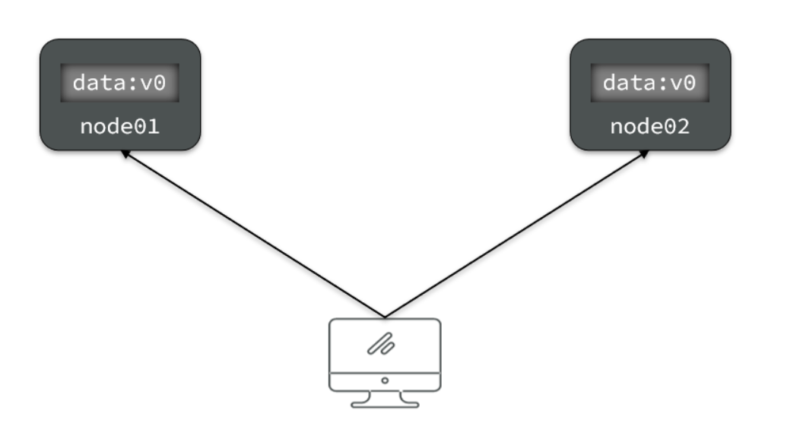

当我们修改其中一个节点的数据时，两者的数据产生了差异：

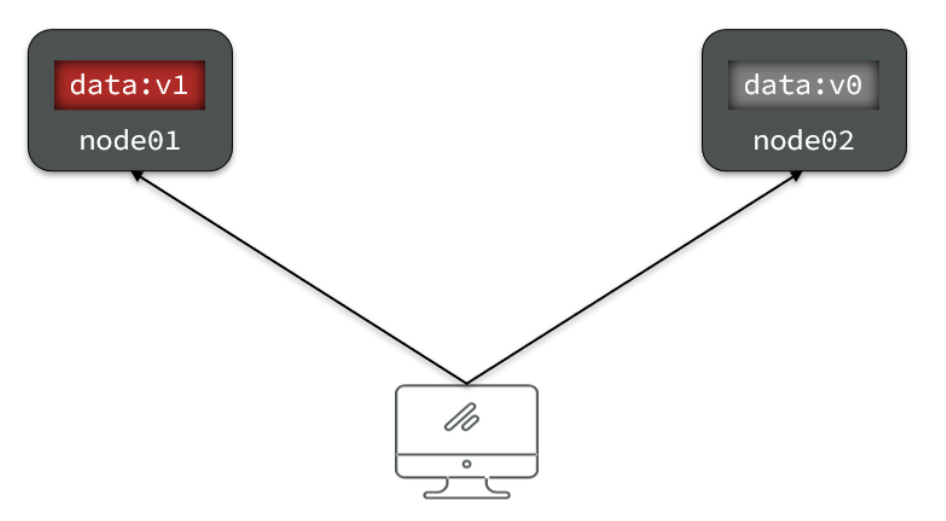

要想保住一致性，就必须实现node01 到 node02的数据 同步：

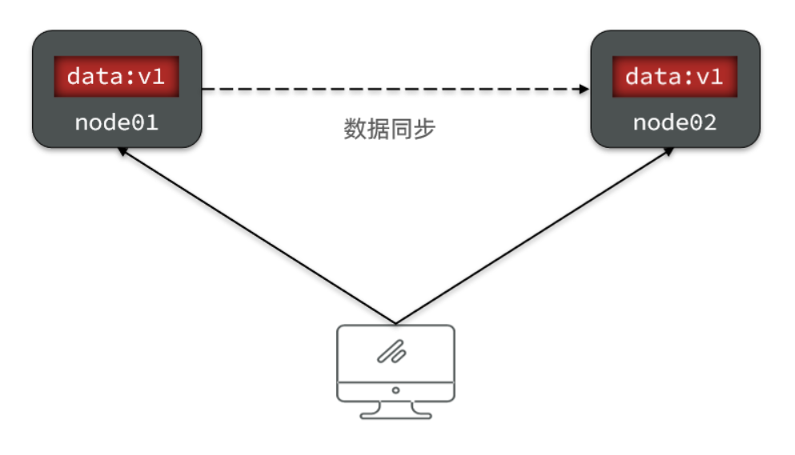

#### **2.1.2.可用性**

Availability （可用性）：用户访问集群中的任意健康节点，必须能得到响应，而不是超时或拒绝。

如图，有三个节点的集群，访问任何一个都可以及时得到响应：

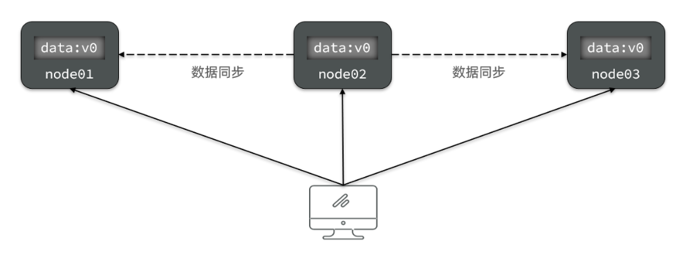

当有部分节点因为网络故障或其它原因无法访问时，代表节点不可用：

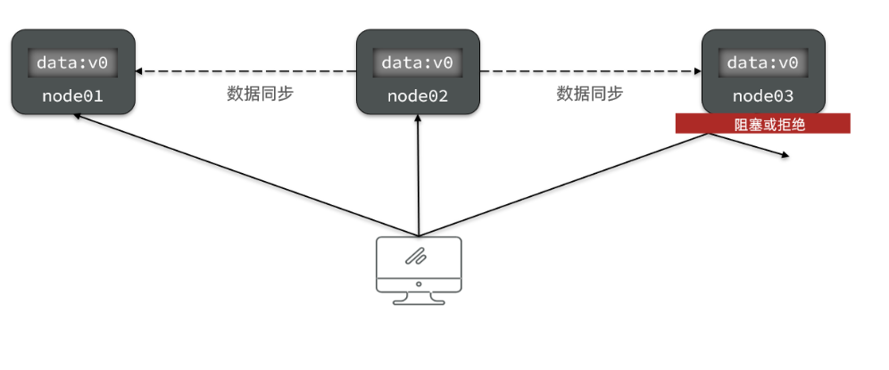

#### **2.1.3.分区容错**

**Partition（分区）**：因为网络故障或其它原因导致分布式系统中的部分节点与其它节点失去连接，形成独立分区。

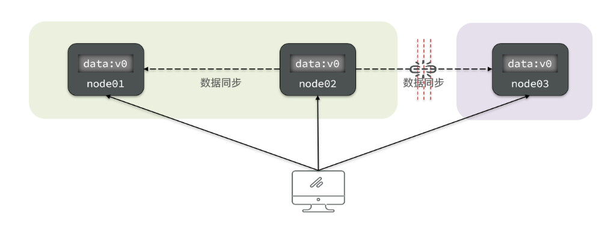

**Tolerance（容错）**：在集群出现分区时，整个系统也要持续对外提供服务

#### **2.1.4.矛盾**

在分布式系统中，系统间的网络不能100%保证健康，一定会有故障的时候，而服务有必须对外保证服务。因此Partition Tolerance不可避免。

当节点接收到新的数据变更时，就会出现问题了：

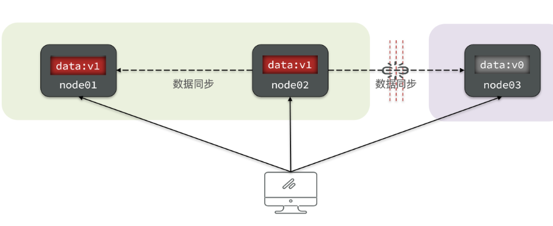

如果此时要保证**一致性**，就必须等待网络恢复，完成数据同步后，整个集群才对外提供服务，服务处于阻塞状态，不可用。

如果此时要保证**可用性**，就不能等待网络恢复，那node01、node02与node03之间就会出现数据不一致。

也就是说，在P一定会出现的情况下，A和C之间只能实现一个。

### **2.2.BASE理论**

BASE理论是对CAP的一种解决思路，包含三个思想：

- **Basically Available** **（基本可用）**：分布式系统在出现故障时，允许损失部分可用性，即保证核心可用。
- **Soft State（软状态）：**在一定时间内，允许出现中间状态，比如临时的不一致状态。
- **Eventually Consistent（最终一致性）**：虽然无法保证强一致性，但是在软状态结束后，最终达到数据一致。

#### **2.3.解决分布式事务的思路**

分布式事务最大的问题是各个子事务的一致性问题，因此可以借鉴CAP定理和BASE理论，有两种解决思路：

- AP模式：各子事务分别执行和提交，允许出现结果不一致，然后采用弥补措施恢复数据即可，实现最终一致。
- CP模式：各个子事务执行后互相等待，同时提交，同时回滚，达成强一致。但事务等待过程中，处于弱可用状态。

但不管是哪一种模式，都需要在子系统事务之间互相通讯，协调事务状态，也就是需要一个**事务协调者(TC)**：

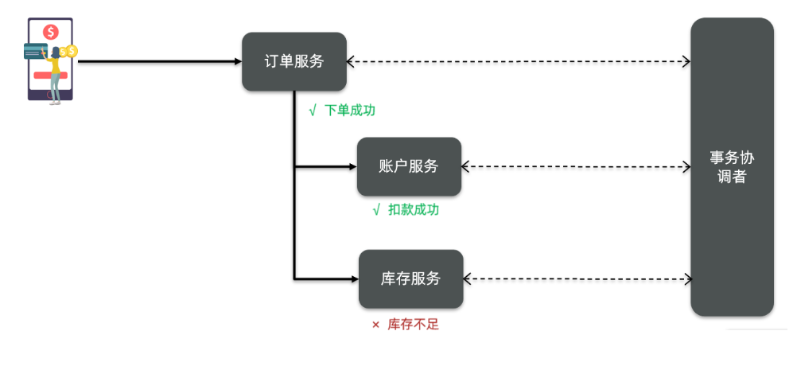

这里的子系统事务，称为**分支事务**；有关联的各个分支事务在一起称为**全局事务**。

## **3.初识Seata**

Seata是 2019 年 1 月份蚂蚁金服和阿里巴巴共同开源的分布式事务解决方案。致力于提供高性能和简单易用的分布式事务服务，为用户打造一站式的分布式解决方案。

官网地址：http://seata.io/，其中的文档、播客中提供了大量的使用说明、源码分析。

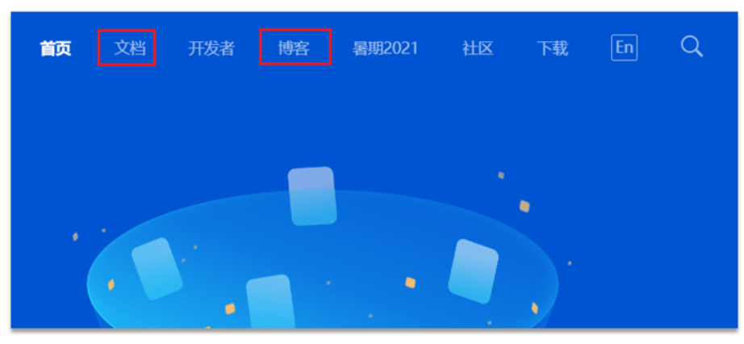

### **3.1.Seata的架构**

Seata事务管理中有三个重要的角色：

- **TC (Transaction Coordinator) -** **事务协调者：**维护全局和分支事务的状态，协调全局事务提交或回滚。
- **TM (Transaction Manager) -** **事务管理器：**定义全局事务的范围、开始全局事务、提交或回滚全局事务。
- **RM (Resource Manager) -** **资源管理器：**管理分支事务处理的资源，与TC交谈以注册分支事务和报告分支事务的状态，并驱动分支事务提交或回滚。

整体的架构如图：

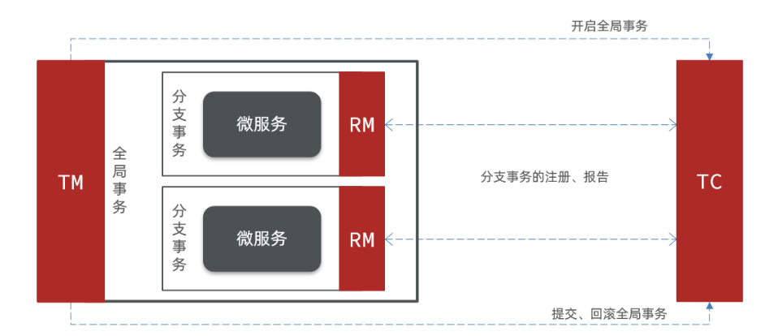

Seata基于上述架构提供了四种不同的分布式事务解决方案：

- XA模式：强一致性分阶段事务模式，牺牲了一定的可用性，无业务侵入
- TCC模式：最终一致的分阶段事务模式，有业务侵入
- AT模式：最终一致的分阶段事务模式，无业务侵入，也是Seata的默认模式
- SAGA模式：长事务模式，有业务侵入

无论哪种方案，都离不开TC，也就是事务的协调者。

### **3.2.部署TC服务**

参考课前资料提供的文档《 seata的部署和集成.md 》：

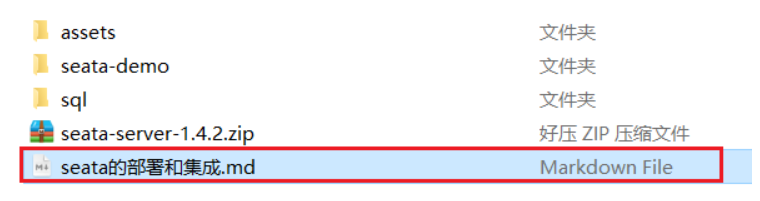

### **3.3.微服务集成Seata**

我们以order-service为例来演示。

#### **3.3.1.引入依赖**

首先，在order-service中引入依赖：

```xml
<!--seata-->
<dependency>
  <groupId>com.alibaba.cloud</groupId>
  <artifactId>spring-cloud-starter-alibaba-seata</artifactId>
  <exclusions>
    <!--版本较低，1.3.0，因此排除--> 
    <exclusion>
      <artifactId>seata-spring-boot-starter</artifactId>
      <groupId>io.seata</groupId>
    </exclusion>
  </exclusions>
</dependency>
<dependency>
  <groupId>io.seata</groupId>
  <artifactId>seata-spring-boot-starter</artifactId>
  <!--seata starter 采用1.4.2版本-->
  <version>${seata.version}</version>
</dependency>
```

#### **3.3.2.配置TC地址**

在order-service中的application.yml中，配置TC服务信息，通过注册中心nacos，结合服务名称获取TC地址：

```yaml
seata:
  registry: # TC服务注册中心的配置，微服务根据这些信息去注册中心获取tc服务地址
   type: nacos # 注册中心类型 nacos
   nacos:
    server-addr: 127.0.0.1:8848 # nacos地址
    namespace: "" # namespace，默认为空
    group: DEFAULT_GROUP # 分组，默认是DEFAULT_GROUP
    application: seata-tc-server # seata服务名称
    username: nacos
    password: nacos
  tx-service-group: seata-demo # 事务组名称
  service:
   vgroup-mapping: # 事务组与cluster的映射关系
    seata-demo: SH
```

微服务如何根据这些配置寻找TC的地址呢？

我们知道注册到Nacos中的微服务，确定一个具体实例需要四个信息：

- namespace：命名空间
- group：分组
- application：服务名
- cluster：集群名

以上四个信息，在刚才的yaml文件中都能找到：

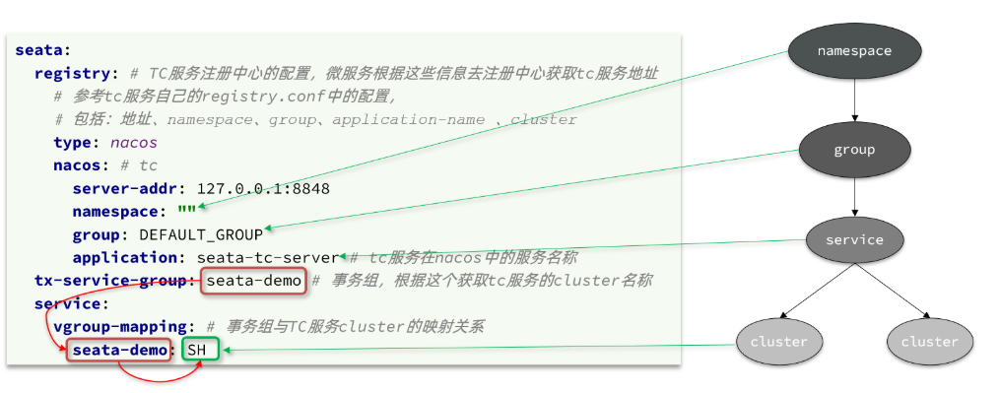

namespace为空，就是默认的public

结合起来，TC服务的信息就是：public@DEFAULT_GROUP@seata-tc-server@SH，这样就能确定TC服务集群了。然后就可以去Nacos拉取对应的实例信息了。

#### **3.3.3.其它服务**

其它两个微服务也都参考order-service的步骤来做，完全一样。

## **4.动手实践**

下面我们就一起学习下Seata中的四种不同的事务模式。

### **4.1.XA模式**

XA 规范 是 X/Open 组织定义的分布式事务处理（DTP，Distributed Transaction Processing）标准，XA 规范 描述了全局的TM与局部的RM之间的接口，几乎所有主流的数据库都对 XA 规范 提供了支持。

#### **4.1.1.两阶段提交**

XA是规范，目前主流数据库都实现了这种规范，实现的原理都是基于两阶段提交。

正常情况：

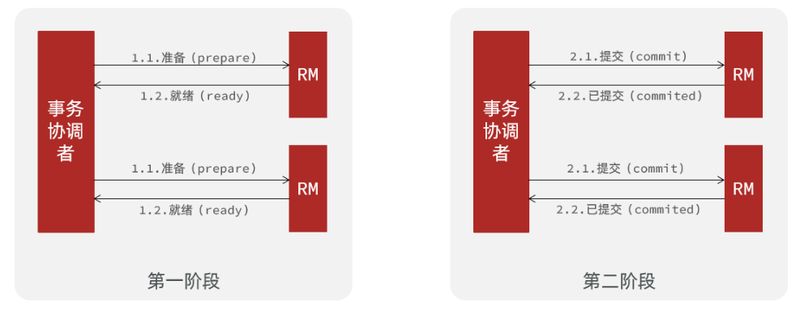

异常情况：

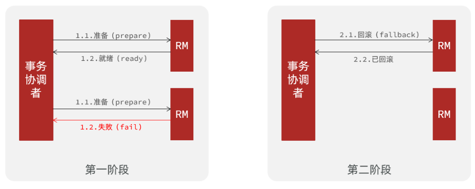

一阶段：

- 事务协调者通知每个事物参与者执行本地事务
- 本地事务执行完成后报告事务执行状态给事务协调者，此时事务不提交，继续持有数据库锁

二阶段：

- 事务协调者基于一阶段的报告来判断下一步操作

- - 如果一阶段都成功，则通知所有事务参与者，提交事务
  - 如果一阶段任意一个参与者失败，则通知所有事务参与者回滚事务

#### **4.1.2.Seata的XA模型**

Seata对原始的XA模式做了简单的封装和改造，以适应自己的事务模型，基本架构如图：

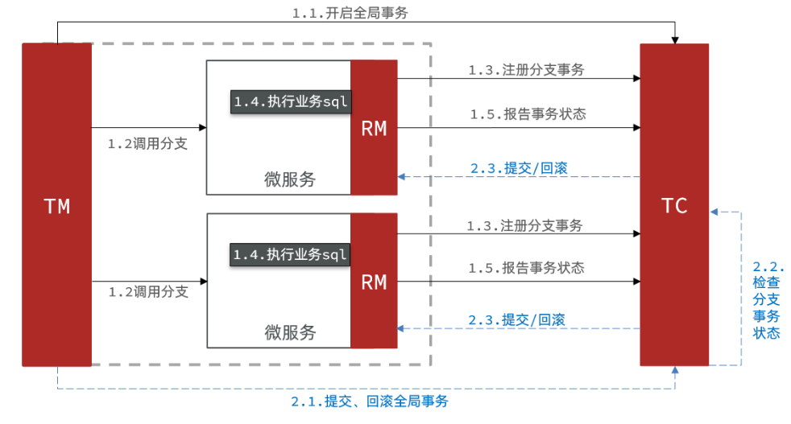

RM一阶段的工作：

	① 注册分支事务到TC
	
	② 执行分支业务sql但不提交
	
	③ 报告执行状态到TC

TC二阶段的工作：

- TC检测各分支事务执行状态
- a.如果都成功，通知所有RM提交事务
- b.如果有失败，通知所有RM回滚事务

RM二阶段的工作：

- 接收TC指令，提交或回滚事务

#### **4.1.3.优缺点**

XA模式的优点是什么？

- 事务的强一致性，满足ACID原则。
- 常用数据库都支持，实现简单，并且没有代码侵入

XA模式的缺点是什么？

- 因为一阶段需要锁定数据库资源，等待二阶段结束才释放，性能较差
- 依赖关系型数据库实现事务

#### **4.1.4.实现XA模式**

Seata的starter已经完成了XA模式的自动装配，实现非常简单，步骤如下：

1）修改application.yml文件（==每个参与事务的微服务==），开启XA模式：

```yaml
seata:  
	data-source-proxy-mode: XA              
```

2）给发起全局事务的入口方法添加@GlobalTransactional注解:

本例中是OrderServiceImpl中的create方法.

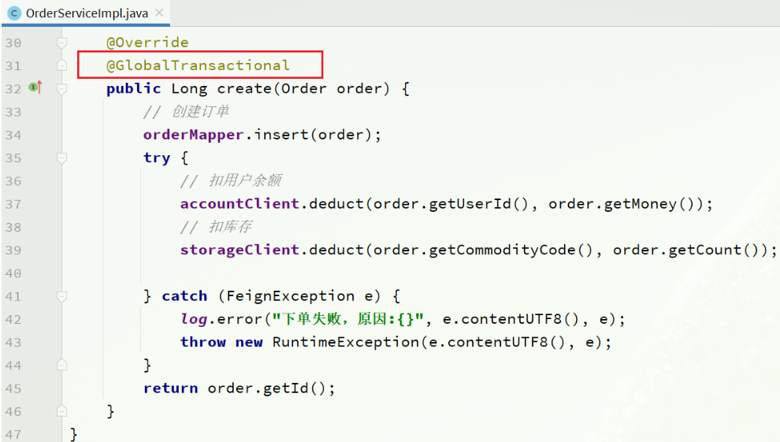

3）重启服务并测试

重启order-service，再次测试，发现无论怎样，三个微服务都能成功回滚。

### **4.2.AT模式**

AT模式同样是分阶段提交的事务模型，不过缺弥补了XA模型中资源锁定周期过长的缺陷。

#### **4.2.1.Seata的AT模型**

基本流程图：

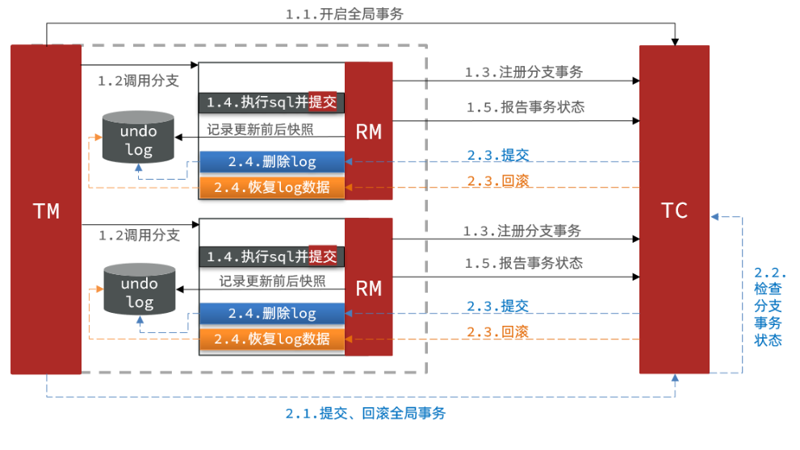

阶段一RM的工作：

- 注册分支事务
- 记录undo-log（数据快照）
- 执行业务sql并提交
- 报告事务状态

阶段二提交时RM的工作：

- 删除undo-log即可

阶段二回滚时RM的工作：

- 根据undo-log恢复数据到更新前

#### **4.2.2.流程梳理**

我们用一个真实的业务来梳理下AT模式的原理。

比如，现在又一个数据库表，记录用户余额：

| **id** | **money** |
| ------ | --------- |
| 1      | 100       |

其中一个分支业务要执行的SQL为：

```sql
update tb_account set money = money - 10 where id = 1          
```

AT模式下，当前分支事务执行流程如下：

一阶段：

1）TM发起并注册全局事务到TC

2）TM调用分支事务

3）分支事务准备执行业务SQL

4）RM拦截业务SQL，根据where条件查询原始数据，形成快照。

```json
{
  "id": 1, "money": 100
}
```

5）RM执行业务SQL，提交本地事务，释放数据库锁。此时 money = 90

6）RM报告本地事务状态给TC

二阶段：

1）TM通知TC事务结束

2）TC检查分支事务状态

	 a）如果都成功，则立即删除快照
	
	 b）如果有分支事务失败，需要回滚。读取快照数据（{"id": 1, "money": 100}），将快照恢复到数据库。此时数据库再次恢复为100

流程图：

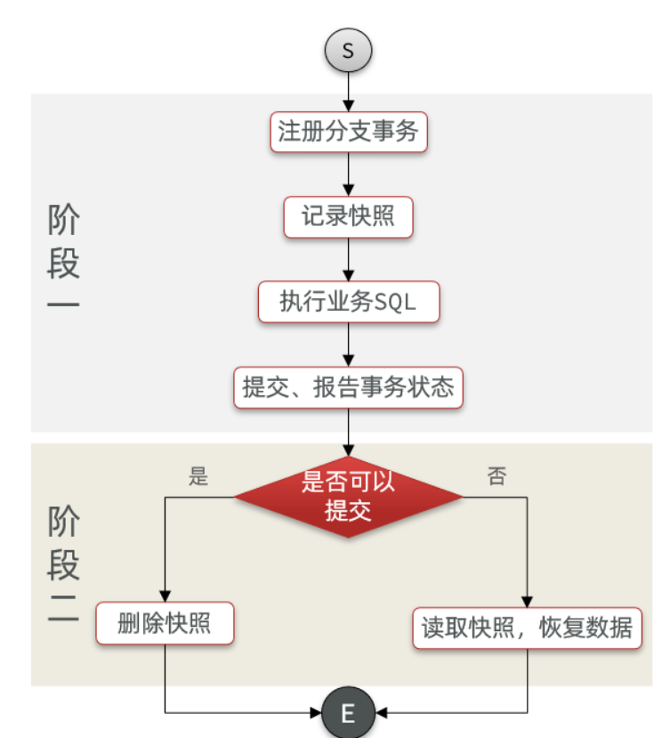

#### **4.2.3.AT与XA的区别**

简述AT模式与XA模式最大的区别是什么？

- XA模式一阶段不提交事务，锁定资源；AT模式一阶段直接提交，不锁定资源。
- XA模式依赖数据库机制实现回滚；AT模式利用数据快照实现数据回滚。
- XA模式强一致；AT模式最终一致

#### **4.2.4.脏写问题**

在多线程并发访问AT模式的分布式事务时，有可能出现脏写问题，如图：

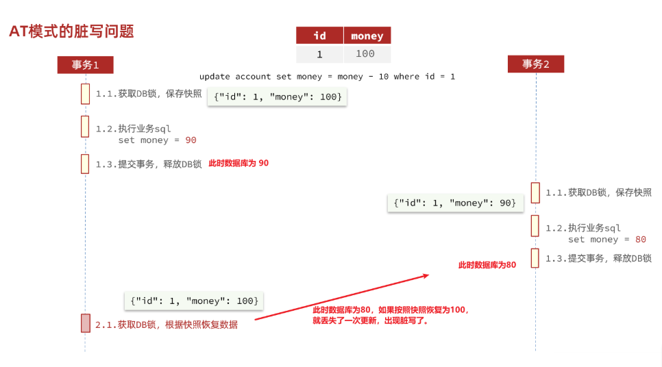

解决思路就是引入了全局锁的概念。在释放DB锁之前，先拿到全局锁。避免同一时刻有另外一个事务来操作当前数据。

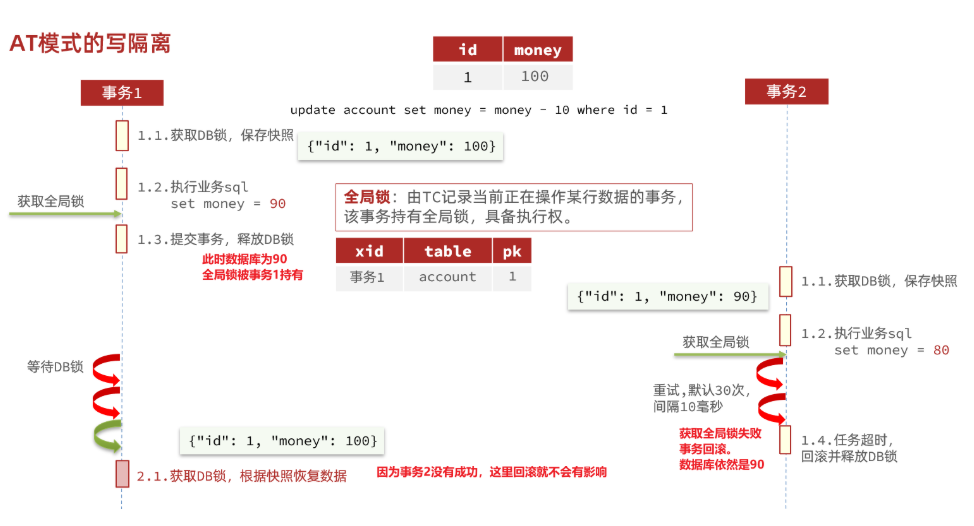

#### **4.2.5.优缺点**

AT模式的优点：

- 一阶段完成直接提交事务，释放数据库资源，性能比较好
- 利用全局锁实现读写隔离
- 没有代码侵入，框架自动完成回滚和提交

AT模式的缺点：

- 两阶段之间属于软状态，属于最终一致
- 框架的快照功能会影响性能，但比XA模式要好很多

#### **4.2.6.实现AT模式**

AT模式中的快照生成、回滚等动作都是由框架自动完成，没有任何代码侵入，因此实现非常简单。

只不过，AT模式需要一个表来记录全局锁、另一张表来记录数据快照undo_log。

1）导入数据库表，记录全局锁

导入课前资料提供的Sql文件：seata-at.sql，其中lock_table导入到TC服务关联的数据库，undo_log表导入到微服务关联的数据库：

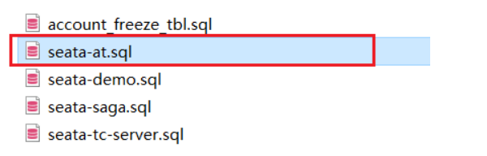

2）修改application.yml文件，将事务模式修改为AT模式即可：

```yaml
seata:
  data-source-proxy-mode: AT # 默认就是AT            
```

3）重启服务并测试

### **4.3.TCC模式**

TCC模式与AT模式非常相似，每阶段都是独立事务，不同的是TCC通过人工编码来实现数据恢复。需要实现三个方法：

- Try：资源的检测和预留； 
- Confirm：完成资源操作业务；要求 Try 成功 Confirm 一定要能成功。
- Cancel：预留资源释放，可以理解为try的反向操作。

#### **4.3.1.流程分析**

举例，一个扣减用户余额的业务。假设账户A原来余额是100，需要余额扣减30元。

- **阶段一（ Try ）**：检查余额是否充足，如果充足则冻结金额增加30元，可用余额扣除30

初识余额：


余额充足，可以冻结：


此时，总金额 = 冻结金额 + 可用金额，数量依然是100不变。事务直接提交无需等待其它事务。

- **阶段二（Confirm)**：假如要提交（Confirm），则冻结金额扣减30

确认可以提交，不过之前可用金额已经扣减过了，这里只要清除冻结金额就好了：


此时，总金额 = 冻结金额 + 可用金额 = 0 + 70  = 70元

- **阶段二(Canncel)**：如果要回滚（Cancel），则冻结金额扣减30，可用余额增加30

需要回滚，那么就要释放冻结金额，恢复可用金额：


#### **4.3.2.Seata的TCC模型**

Seata中的TCC模型依然延续之前的事务架构，如图：

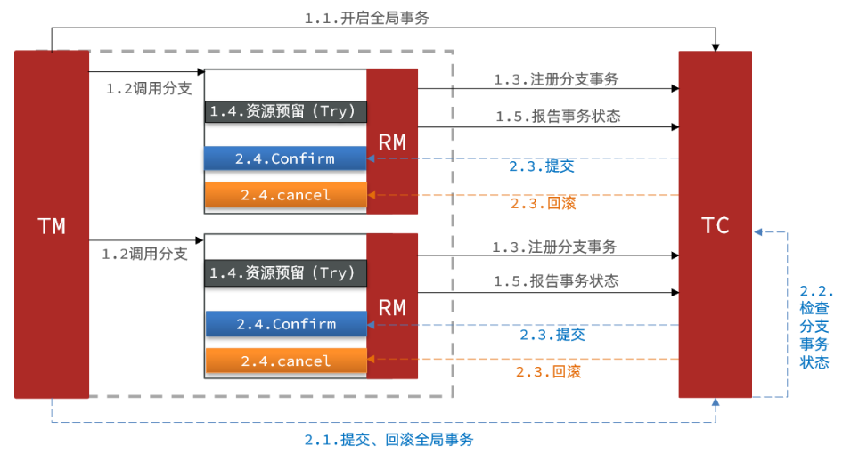

#### **4.3.3.优缺点**

TCC模式的每个阶段是做什么的？

- Try：资源检查和预留
- Confirm：业务执行和提交
- Cancel：预留资源的释放

TCC的优点是什么？

- 一阶段完成直接提交事务，释放数据库资源，性能好
- 相比AT模型，无需生成快照，无需使用全局锁，性能最强
- 不依赖数据库事务，而是依赖补偿操作，可以用于非事务型数据库

TCC的缺点是什么？

- 有代码侵入，需要人为编写try、Confirm和Cancel接口，太麻烦
- 软状态，事务是最终一致
- 需要考虑Confirm和Cancel的失败情况，做好幂等处理

#### **4.3.4.事务悬挂和空回滚**

**1）空回滚**

当某分支事务的try阶段**阻塞**时，可能导致全局事务超时而触发二阶段的cancel操作。在未执行try操作时先执行了cancel操作，这时cancel不能做回滚，就是**空回滚**。

如图：

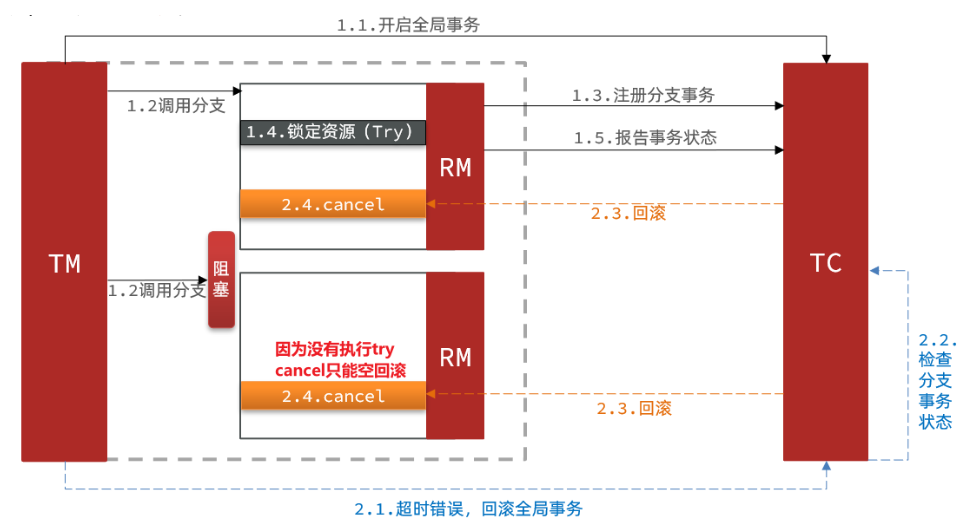

执行cancel操作时，应当判断try是否已经执行，如果尚未执行，则应该空回滚。

**2）业务悬挂**

对于已经空回滚的业务，之前被阻塞的try操作恢复，继续执行try，就永远不可能confirm或cancel ，事务一直处于中间状态，这就是**业务悬挂**。

执行try操作时，应当判断cancel是否已经执行过了，如果已经执行，应当阻止空回滚后的try操作，避免悬挂

#### **4.3.5.实现TCC模式**

解决空回滚和业务悬挂问题，必须要记录当前事务状态，是在try、还是cancel？

**1）思路分析**

这里我们定义一张表：

```sql
CREATE TABLE`account_freeze_tbl`(
`xid`varchar(128) NOTNULL,
`user_id`varchar(255)DEFAULTNULLCOMMENT'用户id',
`freeze_money`int(11)unsignedDEFAULT'0'COMMENT'冻结金额',
`state`int(1)DEFAULTNULLCOMMENT'事务状态，0:try，1:confirm，2:cancel',
PRIMARYKEY(`xid`)USINGBTREE
)ENGINE=InnoDBDEFAULTCHARSET=utf8ROW_FORMAT=COMPACT;

```

其中：

- xid：是全局事务id
- freeze_money：用来记录用户冻结金额
- state：用来记录事务状态

那此时，我们的业务开怎么做呢？

- Try业务：

- - 记录冻结金额和事务状态到account_freeze表
  - 扣减account表可用金额

- Confirm业务

- - 根据xid删除account_freeze表的冻结记录

- Cancel业务

- - 修改account_freeze表，冻结金额为0，state为2
  - 修改account表，恢复可用金额

- 如何判断是否空回滚？

- - cancel业务中，根据xid查询account_freeze，如果为null则说明try还没做，需要空回滚

- 如何避免业务悬挂？

- - try业务中，根据xid查询account_freeze ，如果已经存在则证明Cancel已经执行，拒绝执行try业务

接下来，我们改造account-service，利用TCC实现余额扣减功能。

**2）声明TCC接口**

TCC的Try、Confirm、Cancel方法都需要在接口中基于注解来声明，

我们在account-service项目中的cn.itcast.account.service包中新建一个接口，声明TCC三个接口：

```java
package cn.itcast.account.service;

import io.seata.rm.tcc.api.BusinessActionContext;
import io.seata.rm.tcc.api.BusinessActionContextParameter;
import io.seata.rm.tcc.api.LocalTCC;
import io.seata.rm.tcc.api.TwoPhaseBusinessAction;

@LocalTCC // 设置TCC模式
public interface TCCAccountService {
    /**
     * 从用户账户中扣款
     */
    // 此注解使用在try方法上,方法名称可以自定义
    // 预留冻结
    @TwoPhaseBusinessAction(name = "deduct",commitMethod = "confirm",rollbackMethod = "cancel")
    void deduct(
            @BusinessActionContextParameter(paramName = "userId") String userId,
            @BusinessActionContextParameter(paramName = "money") int money);
    // confirm: 提交
    // BusinessActionContext: 业务上下文对象
    void confirm(BusinessActionContext context);
    // cancel: 事务补偿
    void cancel(BusinessActionContext context);
}

```

**3）编写实现类**

在account-service服务中的cn.itcast.account.service.impl包下新建一个类，实现TCC业务：

```java
package cn.itcast.account.service.impl;

import cn.itcast.account.entity.AccountFreeze;
import cn.itcast.account.mapper.AccountFreezeMapper;
import cn.itcast.account.mapper.AccountMapper;
import cn.itcast.account.service.TCCAccountService;
import io.seata.core.context.RootContext;
import io.seata.rm.tcc.api.BusinessActionContext;
import org.springframework.beans.factory.annotation.Autowired;
import org.springframework.stereotype.Service;
import org.springframework.transaction.annotation.Transactional;

@Service
public class TCCAccountServiceImpl implements TCCAccountService {

    @Autowired
    private AccountMapper accountMapper;
    @Autowired
    private AccountFreezeMapper freezeMapper;

    // try阶段
    @Override
    @Transactional
    public void deduct(String userId, int money) {
        // 0.获取全局事务ID
        String xid = RootContext.getXID();
        // 1.查询account_freeze_tbl表,判断cancel是否执行
        AccountFreeze accountFreeze = freezeMapper.selectById(xid);
        if (accountFreeze!=null){
            // cancel执行过了.不再执行try
            if (accountFreeze.getState()==2){
                freezeMapper.deleteById(xid);
            }
            return;
        }
        // 1.冻结金额 -- 向冻结表中添加一条数据
        AccountFreeze freeze = new AccountFreeze();
        freeze.setUserId(userId);
        freeze.setFreezeMoney(money);
        freeze.setState(AccountFreeze.State.TRY);
        freeze.setXid(xid);
        freezeMapper.insert(freeze);
        // 2.从account表中减去冻结金额
        accountMapper.deduct(userId, money);
    }

    @Override
    @Transactional
    public void confirm(BusinessActionContext context) {
        // 删除冻结数据
        freezeMapper.deleteById(context.getXid());
    }

    @Override
    @Transactional
    public void cancel(BusinessActionContext context) {
        // 查看冻结数据状态,并执行补偿
        // 1.通过业务上下文对象获取
        String userId = context.getActionContext("userId").toString();
        Integer money = (Integer) context.getActionContext("money");
        String xid = context.getXid();
        // 2.判断try是否执行,如果未执行,则进行空回滚
        AccountFreeze accountFreeze = freezeMapper.selectById(xid);
        if (accountFreeze==null){
            // 添加一条记录,标准cancel执行过
            AccountFreeze freeze = new AccountFreeze();
            freeze.setUserId(userId);
            freeze.setFreezeMoney(money);
            freeze.setState(AccountFreeze.State.CANCEL);
            freeze.setXid(xid);
            freezeMapper.insert(freeze);
            return;
        }
        // 3.恢复可用金额
        accountMapper.refund(userId, money);
        // 4.移除冻结金额，修改事务状态
        freezeMapper.deleteById(context.getXid());
    }
}


```

**4）编写实现类**

在account-service服务中的cn.itcast.account.web.AccountController类中修改TCC类的调用:

```java
package cn.itcast.account.web;

import cn.itcast.account.service.AccountService;
import cn.itcast.account.service.TCCAccountService;
import org.springframework.beans.factory.annotation.Autowired;
import org.springframework.http.ResponseEntity;
import org.springframework.web.bind.annotation.PathVariable;
import org.springframework.web.bind.annotation.PutMapping;
import org.springframework.web.bind.annotation.RequestMapping;
import org.springframework.web.bind.annotation.RestController;

/**
 * @author 黑马帅帅
 */
@RestController
@RequestMapping("account")
public class AccountController {

    //@Autowired
    //private AccountService accountService;
    @Autowired
    private TCCAccountService accountService;
    @RequestMapping("/{userId}/{money}")
    public ResponseEntity<Void> deduct(@PathVariable("userId") String userId, @PathVariable("money") Integer money){
        accountService.deduct(userId, money);
        return ResponseEntity.noContent().build();
    }
}


```

### **4.4.SAGA模式**

Saga 模式是 Seata 即将开源的长事务解决方案，将由蚂蚁金服主要贡献。

其理论基础是Hector & Kenneth  在1987年发表的论文Sagas。

Seata官网对于Saga的指南：https://seata.io/zh-cn/docs/user/saga.html

#### **4.4.1.原理**

在 Saga 模式下，分布式事务内有多个参与者，每一个参与者都是一个冲正补偿服务，需要用户根据业务场景实现其正向操作和逆向回滚操作。

分布式事务执行过程中，依次执行各参与者的正向操作，如果所有正向操作均执行成功，那么分布式事务提交。如果任何一个正向操作执行失败，那么分布式事务会去退回去执行前面各参与者的逆向回滚操作，回滚已提交的参与者，使分布式事务回到初始状态。

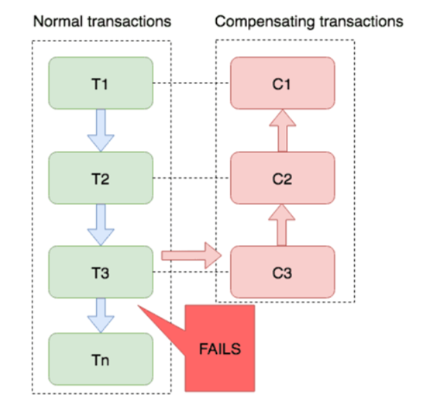

Saga也分为两个阶段：

- 一阶段：直接提交本地事务
- 二阶段：成功则什么都不做；失败则通过编写补偿业务来回滚

#### **4.4.2.优缺点**

优点：

- 事务参与者可以基于事件驱动实现异步调用，吞吐高
- 一阶段直接提交事务，无锁，性能好
- 不用编写TCC中的三个阶段，实现简单

缺点：

- 软状态持续时间不确定，时效性差
- 没有锁，没有事务隔离，会有脏写

#### **4.5.四种模式对比**

我们从以下几个方面来对比四种实现：

- 一致性：能否保证事务的一致性？强一致还是最终一致？
- 隔离性：事务之间的隔离性如何？
- 代码侵入：是否需要对业务代码改造？
- 性能：有无性能损耗？
- 场景：常见的业务场景

如图：

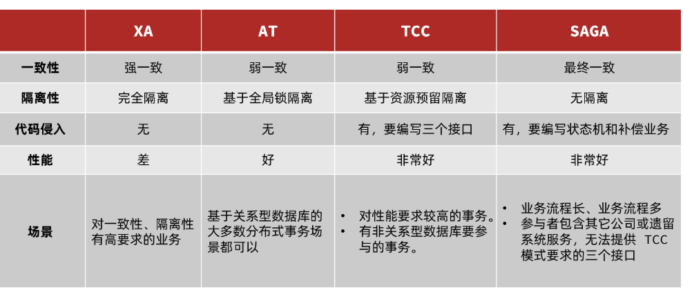

## **5.高可用**

Seata的TC服务作为分布式事务核心，一定要保证集群的高可用性。

### **5.1.高可用架构模型**

搭建TC服务集群非常简单，启动多个TC服务，注册到nacos即可。

但集群并不能确保100%安全，万一集群所在机房故障怎么办？所以如果要求较高，一般都会做异地多机房容灾。

比如一个TC集群在上海，另一个TC集群在杭州：

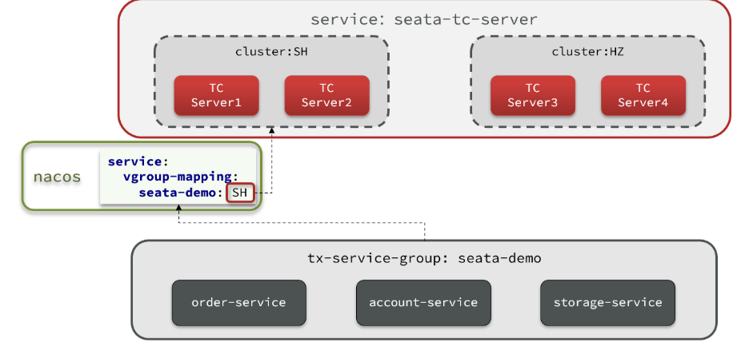

微服务基于事务组（tx-service-group)与TC集群的映射关系，来查找当前应该使用哪个TC集群。当SH集群故障时，只需要将vgroup-mapping中的映射关系改成HZ。则所有微服务就会切换到HZ的TC集群了。

### **5.2.实现高可用**

具体实现请参考课前资料提供的文档《seata的部署和集成.md》：

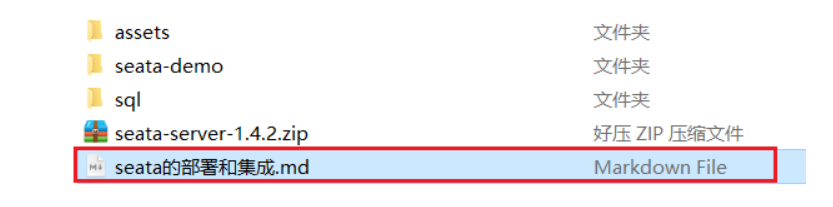

第三章节：

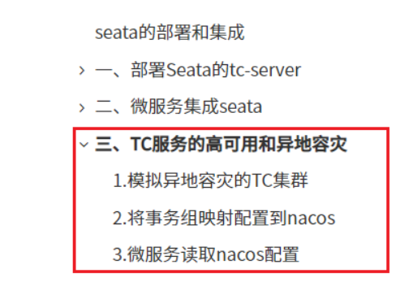

**总结**

    分布式事务:
    	在分布式架构中一个业务需要跨对个微服务,需要这多个微服务执行的状态保持一致.
    分布式事务理论基础:
    	CAP定理:
    		C: 一致性
              在微服务架构中,从任何节点读取到的数据应当是一致的.
            A: 可用性
              在服务不宕机的情况下,必须返回预期的结果
            P: 分区容错
              在微服务架构中是避免不了的.
    	BASE理论:
    		- Basically Available 基本可用
    		- Soft State 软状态
    		- Eventually Consistent 最终一致性
      方案:
    	AP: 可用性
          软状态: 允许不同的分支事务短时间内状态不一致
          但软状态过后需要保证最终一致.
          各个分支执行自己的操作,执行完毕后,直接提交事务即可.
          如果有分支出现失败的请求,事务协调者会通过各个分支,进行补救
    	CP: 强一致性
          在所有的分支事务执行完毕后,等待协调事务发送最终提交或回滚事务的通知
    ===========================Seata======================
    seata-TC: 事务协调者
      连接mysql数据库: 将事务的各种状态信息保存到mysql数据库表中
      记录全局事务
      记录全局事务包含的分支事务
    
    seata-TM: 事务管理器
      开启全局事务
      提交全局事务
    seata-RM: 资源管理器
      分支事务管理
    
    Seata-分布式事务模式:
      XA模式: CP思想
      AT模式: AP思想
        软状态: 每个分支事务都可以独立提交
        TM--->TC: 开启全局事务
        TM--->分支
          获取全局事务锁
          undo_log快照:
    				before-image: 在分支事务对数据库中的数据操作前进行前置快照
            after-image: 在分支事务对数据库中的数据操作后进行后置快照
          如果各个分支都执行成功了---> 删除快照
          如果执行失败--->恢复快照(执行事务的补偿过程)
          释放全局事务锁
      	注意事项: 主要使用在关系型数据库中
      TCC模式: AP思想
        try:
    			判断cancel是否执行,如果未执行,正常执行即可
    				校验,冻结
          如果执行过:
    				不再执行任何逻辑,删除冻结数据
    		confirm: 执行成功
    			删除冻结数据
    		cancel: 执行失败
    			执行补偿过程
          判断try是否执行了,如果执行了
          		恢复冻结数据
          		删除冻结数据
         	如果try没有执行:
    					空回滚: 添加一条冻结数据,并设置状态
      SAGA模式: AP思想


**1.CPA定理是什么?**


**2.Base理论是什么?**


**3.CP和AP指导思想是什么?**


**4.Seata结构?**

                TC TM RM               

**5.Seata搭建过程?**


**6.Seata的四种模式?**


**7.四种模式执行原理?**


**8.三种模式实现方式?**