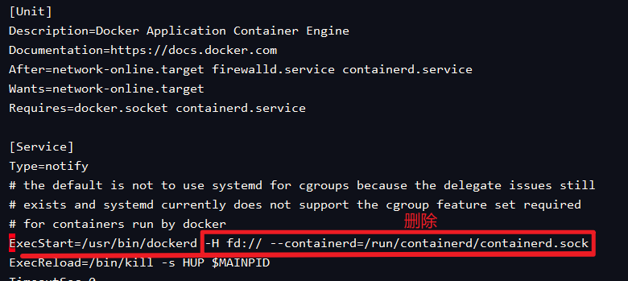

# Docker

- 一条命令安装
- Docker基础命令
- Docker卸载
- Docker安装
- Docker网络创建
- Docker-Compose安装

## 一条命令

- 安装docker
- 安装docker-compose
- 配置阿里云镜像
- 开启docker api 远程
- 开启docker api 2375(替换16359自定义，防止别人通过此端口攻击)端口防火墙 远程

```sh
yum update -y && \
yum install -y yum-utils device-mapper-persistent-data lvm2 && \
yum-config-manager --add-repo https://mirrors.aliyun.com/docker-ce/linux/centos/docker-ce.repo && \
sed -i 's/download.docker.com/mirrors.aliyun.com\/docker-ce/g' /etc/yum.repos.d/docker-ce.repo && \
yum makecache fast && \
yum install docker-ce -y && \
sed -i 's/^ExecStart=\/usr\/bin\/dockerd -H fd:\/\/ --containerd=\/run\/containerd\/containerd\.sock/#&/g' /lib/systemd/system/docker.service && \
sed -i '/^#ExecStart=\/usr\/bin\/dockerd -H fd:\/\/ --containerd=\/run\/containerd\/containerd\.sock/a ExecStart=\/usr\/bin\/dockerd -H tcp:\/\/0.0.0.0:16359 -H unix:\/\/\/var\/run\/docker.sock' /lib/systemd/system/docker.service && \
firewall-cmd --zone=public --add-port=16359/tcp --permanent && \
firewall-cmd --reload && \
mkdir -p /home/docker/docker-compose && \
wget -P /home/docker/docker-compose https://github.com/docker/compose/releases/download/v2.17.3/docker-compose-linux-x86_64 && \
mv /home/docker/docker-compose/docker-compose-linux-x86_64 /home/docker/docker-compose/docker-compose && \
chmod +x /home/docker/docker-compose/docker-compose && \
echo 'export PATH=$PATH:/home/docker/docker-compose' | tee -a /etc/profile && source /etc/profile && \
source /etc/profile && \
yum install -y bash-completion && \
source /etc/profile.d/bash_completion.sh && \
curl -L https://raw.githubusercontent.com/docker/cli/master/contrib/completion/bash/docker -o /etc/bash_completion.d/docker && \
curl -L https://raw.githubusercontent.com/docker/compose/master/contrib/completion/bash/docker-compose -o /etc/bash_completion.d/docker-compose && \
source /etc/profile.d/bash_completion.sh && \
systemctl daemon-reload && \
systemctl restart docker && \
systemctl enable docker && \
docker -v && \
docker-compose -v
```


```sh
# 更新yum源并安装必要的软件包
yum update -y # -y选项用于自动回答yes，无需手动确认
yum install -y yum-utils device-mapper-persistent-data lvm2

# 添加Docker CE官方源
yum-config-manager --add-repo https://mirrors.aliyun.com/docker-ce/linux/centos/docker-ce.repo

# 将Docker CE官方源地址中的download.docker.com替换为mirrors.aliyun.com/docker-ce
sed -i 's/download.docker.com/mirrors.aliyun.com\/docker-ce/g' /etc/yum.repos.d/docker-ce.repo

# 更新yum缓存并安装Docker CE
yum makecache fast # makecache命令用于生成yum缓存
yum install docker-ce -y

# 开启远程访问docker api (自选，不用注释掉)
sudo sed -i 's/^ExecStart=\/usr\/bin\/dockerd -H fd:\/\/ --containerd=\/run\/containerd\/containerd\.sock/#&/g' /lib/systemd/system/docker.service && \
sudo sed -i '/^#ExecStart=\/usr\/bin\/dockerd -H fd:\/\/ --containerd=\/run\/containerd\/containerd\.sock/a ExecStart=\/usr\/bin\/dockerd -H tcp:\/\/0.0.0.0:2375 -H unix:\/\/\/var\/run\/docker.sock' /lib/systemd/system/docker.service
# 开启远程访问docker api 端口2375 (自选，不用注释掉)
sudo firewall-cmd --zone=public --add-port=2375/tcp --permanent # --permanent选项用于将规则永久保存

# 重新加载防火墙规则
sudo firewall-cmd --reload

# 下载Docker Compose二进制文件到/home/docker/docker-compose目录下
mkdir -p /home/docker/docker-compose # -p选项用于创建目录及其所有上级目录
wget -P /home/docker/docker-compose https://github.com/docker/compose/releases/download/v2.17.3/docker-compose-linux-x86_64
mv /home/docker/docker-compose/docker-compose-linux-x86_64 /home/docker/docker-compose/docker-compose
chmod +x /home/docker/docker-compose/docker-compose

# 添加Docker Compose的路径到系统环境变量中
echo 'export PATH=$PATH:/home/docker/docker-compose' | sudo tee -a /etc/profile && source /etc/profile

# 安装Bash自动完成实现docker&docker-compose自动补全
sudo yum install -y bash-completion
source /etc/profile.d/bash_completion.sh
sudo curl -L https://raw.githubusercontent.com/docker/cli/master/contrib/completion/bash/docker -o /etc/bash_completion.d/docker
sudo curl -L https://raw.githubusercontent.com/docker/compose/master/contrib/completion/bash/docker-compose -o /etc/bash_completion.d/docker-compose
source /etc/profile.d/bash_completion.sh

# 重新加载systemd配置
sudo systemctl daemon-reload
# 重启Docker服务
sudo systemctl restart docker
# 开机自启
sudo systemctl enable docker

# 检查Docker和Docker Compose版本
docker -v
docker-compose -v
```


## docker 命令

|命令|说明|
|---|---|
|`docker exec -it 容器名 /bin/bash`|进入容器|
|`docker start 容器名`|启动容器|
|`docker restart 容器名`|重启容器|
|`docker stop 容器名`|停止容器|
|`docker cp 容器id:容器内文件路径 目标路径`|容器内文件拷贝出来|
|`docker cp 目标路径 容器id:容器内文件路径`|宿主机文件拷贝到容器内|
|`docker network create 网络名 --subnet 172.21.0.0/24`|创建网络|
|`apt-get update` `apt-get install vim`|容器内无法使用vi，安装vim|
|`docker stop $(docker ps -a -q)`|关闭所有容器|
|`docker rm $(docker ps -a -q)`|删除所有容器|
|`docker image prune -a`|删除未使用所有镜像|
|`docker update --restart=no 容器名或id`|关闭容器自启|
|`docker update --restart=always 容器名或id`|开启容器自启|
|`docker volume prune`|删除所有未使用的卷|
|`docker network create 网络名称 --subnet=172.18.0.0/16`|创建网络|
|`docker network rm 网络名称`|删除网络|
|`docker network ls`|查看所有网络|


## docker卸载（可选）

- 如果之前安装过旧版本的Docker，可以使用下面命令卸载：

```
sudo yum remove docker*
```

## 安装 Docker

### 第一步：更新yum包

```
yum update -y
```

### 第二部：安装需要的软件包

```
yum install -y yum-utils device-mapper-persistent-data lvm2
```

### 第三步：设置yum源 设置docker镜像源

```
yum-config-manager \
--add-repo \
https://mirrors.aliyun.com/docker-ce/linux/centos/docker-ce.repo

sed -i 's/download.docker.com/mirrors.aliyun.com\/docker-ce/g' /etc/yum.repos.d/docker-ce.repo

yum makecache fast
```

### 第四步：查看远程仓库中所有docker版本（可选）

```
yum list docker-ce --showduplicates | sort -r
```

### 第五步：安装docker

```
yum install docker-ce -y #安装最新版
yum install -y docker-ce --allowerasing #报错试试这个
yum install docker-ce-3:20.10.9-3.el8#安装指定版本(推荐安装此方式)

如需指定版本，则使用如下命令 yum install <FQPN>例如：sudo yum install docker-ce-17.12.0.ce
```

### 第六步：修改Docker远程仓库

Docker的使用过程中，需要从远程仓库下载镜像，但是默认为国外网站，所以在下载时会出现下载连接超时导致下载失败，因此需要将远程仓库修改为国内镜像仓库

> 本次使用阿里云镜像
> 登录阿里云，进入 “容器镜像服务”控制台
> 容器镜像服务：https://www.aliyun.com/product/acr
> 注册后，可以在“镜像工具-镜像加速器” 来获得个人的 docker 加速链接地址，地址找到后，执行下面的命令：


- 创建文件`daemon.json`

```sh
vi /etc/docker/daemon.json
```

- 配置多个镜像加速地址
  - 阿里云加速器：[https://registry.cn-hangzhou.aliyuncs.com](https://registry.cn-hangzhou.aliyuncs.com/)

```
{
  "registry-mirrors": [
    "https://registry.cn-hangzhou.aliyuncs.com"
  ]
}
```

### 第七步：开启远程访问权限（可选）

```
# 修改文件
vim /lib/systemd/system/docker.service
```



 - 将上面删除后，替换下面的内容：


```
-H tcp://0.0.0.0:2375 -H unix:///var/run/docker.sock
```


### 远程连不上的原因.

- 防火墙未放开端口

执行以下命令，将端口 2375 添加到防火墙规则中：

```
sudo firewall-cmd --zone=public --add-port=2375/tcp --permanent
```

- 重新加载防火墙规则

执行以下命令，重新加载防火墙规则：

```
sudo firewall-cmd --reload
```

- 重新加载 systemd 配置

执行以下命令，重新加载 systemd 配置：

```
sudo systemctl daemon-reload
```

- 重启 Docker 服务

执行以下命令，重启 Docker 服务：

```
sudo systemctl restart docker
```

- 现在，Docker 守护进程将在端口 2375 上监听连接。你可以使用 Docker CLI 或任何远程管理工具连接到该端口。注意：在公共网络中开放此端口可能会带来安全风险，请谨慎操作。


### 第八步：重新启动服务

```sh
systemctl daemon-reload
systemctl restart docker
systemctl enable docker #开机自启
```

### 第九步：执行docker info查看基本信息

- Docker版本
- Docker-Compose版本
- Docker镜像加速地址

```sh
docker info
```


## 安装Docker-Compose

- 找到自己需要的版本[Releases · docker/compose (github.com)](https://github.com/docker/compose/releases)
- 方式一难，确是最快的方式
- 方式二难下载下来

:::=tabs
::Docker-Compose安装方法1

### 1. 下载自己需要的版本


```sh
mkdir -p /home/docker/docker-compose
```


```sh
wget -P /home/docker/docker-compose https://github.com/docker/compose/releases/download/v2.17.3/docker-compose-linux-x86_64
```

其中：

- `-P` 选项指定了要将文件下载到哪个目录中。
- `/home/docker/docker-compose` 是你要下载到的目录。
- `https://github.com/docker/compose/releases/download/v2.17.3/docker-compose-linux-x86_64` 是要下载的 `docker-compose` 的 URL

### 2.修改文件名

```sh
mv /home/docker/docker-compose/docker-compose-linux-x86_64 /home/docker/docker-compose/docker-compose
```

### 3.修改权限

```sh
chmod +x /home/docker/docker-compose/docker-compose
```

### 4.配置环境变量

- 修改环境变量

```sh
sudo vi /etc/profile
```


- 添加`DOCKER_COMPOSE`环境变量


```sh
export PATH=$PATH:/home/docker/docker-compose
```


- 重新加载配置

```sh
source /etc/profile
```


### 5. 查看版本

```sh
docker-compose -v
```

### 6.代码补全

```sh
# Base自动补全命令
curl -L https://raw.githubusercontent.com/docker/compose/2.17.2/contrib/completion/bash/docker-compose > /etc/bash_completion.d/docker-compose

# 如果这里出现错误，需要修改自己的hosts文件
echo "199.232.68.133 raw.githubusercontent.com" >> /etc/hosts
```

::Docker-Compose安装方法2

### 1.下载并安装 Docker Compose 的二进制文件：

```sh
sudo curl -L "https://github.com/docker/compose/releases/download/<VERSION>/docker-compose-$(uname -s)-$(uname -m)" -o /usr/local/bin/docker-compose

#指定版本
sudo curl -L "https://github.com/docker/compose/releases/download/v2.17.2/docker-compose-$(uname -s)-$(uname -m)" -o /usr/local/bin/docker-compose
```

### 2.将二进制文件设置为可执行文件：

```sh
sudo chmod +x /usr/local/bin/docker-compose
```

### 3.测试 Docker Compose 是否安装成功：

```sh
docker-compose --version
```
:::


## Docker代码补全

### 1.安装 Bash 完整性检查工具（bash-completion）：

```
sudo yum install -y bash-completion
```

### 2.重新加载 Bash 环境：

```
source /etc/profile.d/bash_completion.sh
```

### 3.安装 Docker 命令补全：

```
sudo curl -L https://raw.githubusercontent.com/docker/cli/master/contrib/completion/bash/docker -o /etc/bash_completion.d/docker
```

### 4.安装 Docker Compose 命令补全：

```
sudo curl -L https://raw.githubusercontent.com/docker/compose/master/contrib/completion/bash/docker-compose -o /etc/bash_completion.d/docker-compose
```

### 5.重新加载 Bash 环境：

```
source /etc/profile.d/bash_completion.sh
```

- 现在，应该可以使用 Tab 键来补全 Docker 和 Docker Compose 命令了。
