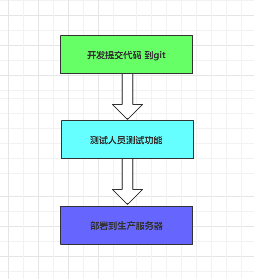
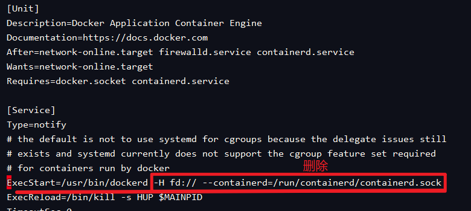

# Docker高级

**学习目标**

- 了解DockerCompose的基本语法
- Docker-Swarm的部署一个应用
- 能够做到项目持续集成持续部署

# 1 容器编排概述

Docker只是一个对项目做打包和运行的小工具，如果止步于此，那么充其量就是一个开发者手里的`小玩具`。

因为真实的项目都是要集群部署的，还要考虑负载均衡、水平扩展、动态伸缩、集群容错等问题，而Docker并不具备这样的功能。

而要想让Docker在集群中的部署如同单机部署一样的方便，那就需要用到**容器编排**技术了。

“编排”（Orchestration）在云计算行业里不算是新词汇，它主要是指用户如何通过某些工具或者配置来完成一组虚拟机以及关联资源的定义、配置、创建、删除等工作，然后由云计算平台按照这些指定的逻辑来完成的过程。

**容器编排是指自动化容器的部署、管理、扩展和联网** 

**容器编排**：不同的环境中部署相同的应用程序，而无需重新开发，容器设计使其能够更好地编排服务，如存储、网络和安全性。 

而容器时代，“编排”显然就是对 Docker 容器的一系列定义、配置和创建动作的管理。目前容器编排技术比较知名的包括：

- Docker公司自己的：docker-compose + swarm组合
- Google牵头的Kubernetes技术，简称为k8s


# 2 Docker Compose

`Docker Compose` 是 Docker 官方编排（Orchestration）项目之一，负责快速的部署分布式应用，官网地址： https://github.com/docker/compose ，其前身是开源项目 Fig。

本节将介绍 `Compose` 项目情况以及安装和使用。

网址：https://docs.docker.com/compose/compose-file/

## 2.1 为什么要用Docker Compose

通过Dockerfile我们可以将一个项目很方便的打包为一个Docker镜像。但是在日常工作中，经常会碰到需要多个容器相互配合来完成某项任务的情况。例如要实现一个 Web 项目，除了 Web 服务容器本身，往往还需要再加上后端的数据库服务容器，甚至还包括负载均衡容器等。

那么如何定义各个容器的依赖关系，这就需要用到docker-compose了。

`Compose` 恰好满足了Docker集群化的需求。它允许用户通过一个单独的 `docker-compose.yml` 模板文件（YAML 格式）来定义一组相关联的应用容器为一个项目（project）。

## 2.2 Docker Compose安装

MAC下或者Windows下的Docker自带Compose功能，无需安装。

Linux下需要通过命令安装：

```sh
# 安装
curl -L https://github.com/docker/compose/releases/download/1.24.1/docker-compose-`uname -s`-`uname -m` > /usr/local/bin/docker-compose
# 修改权限
chmod +x /usr/local/bin/docker-compose
ln -s /usr/local/bin/docker-compose /usr/bin/docker-compose
```

## 2.3 Docker Compose快速入门

假设我们要部署一个SpringBoot项目，并且依赖于Redis。

### 2.3.1 导入微服务工程

工程的基本功能就是统计用户的访问量，代码在`资料`中，直接解压到没有中文的目录下，使用Idea导入即可。

并使用 maven 插件对项目进行打包处理，并获得项目的 打包后的 jar 文件。

### 2.3.2 编写Dockerfile

（1）在任意位置创建一个新目录，将app.jar复制到该目录

（2）在该目录中，新建一个`Dockerfile`文件，并编写下面的内容：

```dockerfile
FROM java:8-alpine
COPY ./app.jar /tmp/app.jar
EXPOSE 9090
ENTRYPOINT ["java","-jar","/tmp/app.jar"]
```

### 2.3.3 编写docker-compose

在刚才的目录中，创建一个`docker-compose.yml`文件并填写内容：

```yaml
version: '3'
services:
  web:
    build: ../../Docker
    ports:
      - "9090:9090"
  redis:
    image: "redis:6.0"
```

此时的结构如下：


命令解读：

- version：compose的版本
- services：服务列表，包括两个服务：
  - web：自己写的Java项目
    - build：这个服务镜像是临时构建的，构建目录是当前目录，会利用当前目录的Dockerfile来完成构建。
    - ports：端口映射，对外开放8080端口
  - redis：redis服务


### 2.3.4 启动测试

将刚刚准备好的文件夹上传到Linux的`/opt/docker-compose`目录：


然后执行命令：

```sh
docker-compose up
```

构建完成后，可以看到项目运行的日志信息：


此时，访问浏览器 http://192.168.94.130:9090/hello，可以看到下面的结果：


如果多次访问，这个次数会累加。

按次`CTRL+C`后可以停止运行程序，并且Docker运行的容器中也会关闭。

通过`docker-compose up -d`命令，可以后台启动，这样就不会显示日志：


通过`docker-compose stop` 关闭容器


通过`docker-compose down`关闭容器并删除


## 2.4 Docker Composer 相关命令

docker-compose的相关命令参数：

通过：`docker-compose —help` 查看

```sh
[root@localhost docker-demo]# docker-compose --help
利用Docker来定义和构建一个多容器的应用

使用方式:
  docker-compose [-f <arg>...] [options] [COMMAND] [ARGS...]
  docker-compose -h|--help

Options:
  -f, --file FILE             指定一个 compose 文件，
                              (默认: docker-compose.yml)
  -p, --project-name NAME     指定project名字
                              (默认: 目录名称)
  --verbose                   显示更多日志
  --log-level LEVEL           日志级别 (DEBUG, INFO, WARNING, ERROR, CRITICAL)
  -v, --version               打印版本并退出
  -H, --host HOST             Daemon socket to connect to
Commands:
  build              构建多个service
  config             校验 Compose 文件，格式是否正确，若正确则显示配置，
  					 若格式错误显示错误原因
  down               停止并删除 容器, 网络, 镜像, 和 数据卷
  exec               进入一个指定的容器
  help               Get help on a command
  images             列出该Compose中包含的各个镜像
  kill               通过发送 SIGKILL 信号来强制停止服务容器
  					 格式为 docker-compose kill [options] [SERVICE...]
  logs               查看服务容器的输出日志
  					 格式为 docker-compose logs [options] [SERVICE...]。
  pause              暂停一个容器
  port               打印某个容器端口所映射的公共端口
  ps                 列出项目中目前的所有容器
  pull               拉取服务依赖的镜像
  push               推送服务依赖的镜像到 Docker 镜像s仓库
  restart            重启项目中的服务
  rm                 删除停止的容器（要先停止容器）
  run                在某个服务上运行指令
  scale              设定某个容器的运行个数
  start              启动多个 services
  stop               停止多个 services
  top                查看各个服务容器内运行的进程。
  unpause            恢复处于暂停状态中的服务。
  up                 创建并启动多个service的容器
  version            Show the Docker-Compose version information
```


## 2.5 Docker Compose常用语法

Compose模板文件是Compose的核心，包括有多种版本的Compose文件格式–：1，2，2.x和3.x。对应的Docker版本也不一样，对照表：

| **Compose file format** | **Docker Engine release** |
| :---------------------- | :------------------------ |
| 3.8                     | 19.03.0+                  |
| 3.7                     | 18.06.0+                  |
| 3.6                     | 18.02.0+                  |
| 3.5                     | 17.12.0+                  |
| 3.4                     | 17.09.0+                  |
| 3.3                     | 17.06.0+                  |
| 3.2                     | 17.04.0+                  |
| 3.1                     | 1.13.1+                   |
| 3.0                     | 1.13.0+                   |
| 2.4                     | 17.12.0+                  |
| 2.3                     | 17.06.0+                  |
| 2.2                     | 1.13.0+                   |
| 2.1                     | 1.12.0+                   |
| 2.0                     | 1.10.0+                   |
| 1.0                     | 1.9.1.+                   |

编写时，需要根据自己的docker版本来选择指定的Compose版本。

详细语法参考文档：https://docs.docker.com/compose/compose-file/

### 概念

`Compose` 中有两个重要的概念：

- **项目** (`project`)：由一组关联的应用容器组成的一个完整业务单元，在 `docker-compose.yml` 文件中定义。
- **服务** (`service`)：一个应用的容器，实际上可以包括若干运行相同镜像的容器实例。

`Compose` 的默认管理对象是项目，通过子命令对项目中的一组容器进行便捷地生命周期管理。

Compose文件是一个YAML文件，定义 一个或多个服务（service），网络（network）和 卷（volume）。撰写文件的默认路径为`./docker-compose.yml`。

> **提示**：您可以为此文件使用a `.yml`或`.yaml`扩展名。他们俩都工作。

简单来说，一个`project`包含多个`service`，每个`service`都是一个组件。例如入门案例中的Java项目和Redis都是`service`。部署时，可能每个service都会有多个容器去运行，形成负载均衡的集群。

因此，我们定义service，就是在定义这个service在容器运行时的规则参数，就像是给`docker run`命令设置参数一样。

我们定义network和volume类似于 `docker network create`和`docker volume create`这两个命令的效果。

只不过，我们定义规则，执行命令则由docker compose来完成。

参考我们之前的Demo，我们来学习下Compose的模板文件语法：

```yaml
version: '3'
services:
  web:
    build: .
    ports:
      - "9090:9090"
  redis:
    image: "redis:6.0"
```

### version

版本信息，详见上面提到的Compose版本与Docker的对应关系。

### build

指定 `Dockerfile` 所在文件夹的路径（可以是绝对路径，或者相对 `docker-compose.yml` 文件的路径）。 `Compose` 将会利用它自动构建这个镜像，然后使用这个镜像。

在入门案例中，因为`Dockerfile`和`docker-compose.yml`是在一个目录，因此build值指定为`.`

```yaml
version: '3'
services:
  web:
    build: .
    ports:
      - "8080:8080"
```

另外，你也可以先制定目录，然后在指定Dockerfile文件，例如：

```yaml
version: '3'
services:
  web:
    build:
      context: . # 指定compose上下文目录，相对路径是相对于
      dockerfile: Dockerfile
      args:
        buildno: 1
    ports:
      - "8080:8080"
```

说明：

- build：Dockerfile配置
  - context：用来指定Compose的工作环境目录，如果不指定或使用了相对路径则默认为`docker-compose.yml`所在目录。
  - dockerfile：指定Dockerfile的文件名称

### command

覆盖容器运行时的默认命令。

```yaml
version: '3'
services:
  web:
    build: .
    ports:
      - "8080:8080"
    command: ["java", "-jar", "-Xmx256m", "/tmp/app.jar"]
```

### depends_on

解决容器的依赖、启动先后的问题。以下例子中会先启动 `redis` `db` 再启动 `web`：

```yaml
version: '3'
services:
  web:
    build: .
    ports:
      - "8080:8080"
    depends_on:
      - db
      - redis
  # redis服务
  redis:
    image: redis
  # mysql服务
  db:
    image: mysql:5.7
```

### ENTRYPOINT

指定服务容器启动后执行的入口文件或者启动命令，例如：

```yaml
entrypoint: /code/entrypoint.sh
```

或者：

```yaml
entrypoint: ["php", "-d", "memory_limit=-1", "vendor/bin/phpunit"]
```

### environment

添加环境变量。您可以使用数组或字典。任何布尔值（true，false，yes，no）都需要用引号引起来，以确保YML解析器不会将其转换为True或False。

仅具有键的环境变量在运行Compose的计算机上解析为它们的值，这对于秘密或特定于主机的值很有用。

```yaml
environment:
  RACK_ENV: development
  SHOW: 'true'
  SESSION_SECRET:
```

或：

```yaml
environment:
  - RACK_ENV=development
  - SHOW=true
  - SESSION_SECRET
```

### expose

指定内部端口，不将其发布到宿主机上，只有链接的其它服务才能访问它们。

```yaml
expose:
  - "3000"
  - "8000"
```

### extra_hosts

类似 Docker 中的 `--add-host` 参数，指定额外的 host 名称映射信息。

```yaml
extra_hosts:
 - "googledns:8.8.8.8"
 - "dockerhub:52.1.157.61"
```

会在启动后的服务容器中 `/etc/hosts` 文件中添加如下两条条目。

```bash
8.8.8.8 googledns
52.1.157.61 dockerhub
```

### image

指定用于启动容器的图像。可以是镜像名称（仓库:tag）或镜像ID，例如：

```yaml
image: redis
```

如果镜像在本地不存在，而且你没有指定[build](https://docs.docker.com/compose/compose-file/#build)参数，那么Compose会尝试`docker pull`来拉取镜像

### logging

配置日志选项。

```yaml
logging:
  driver: syslog
  options:
    syslog-address: "tcp://192.168.0.42:123"
```

目前支持三种日志驱动类型。

```yaml
driver: "json-file" # 记录为json文件
driver: "syslog" # 发送到syslog服务
driver: "none" # 没有日志记录
```

默认采用`json-file`的日志方式，可以通过`options` 配置日志文件的限制参数。

```yaml
options:
  max-size: "200k"
  max-file: "10"
```

### network_mode 

网络模式。使用与`docker network ls`参数相同的值:

```yaml
network_mode: "bridge"
network_mode: "host"
network_mode: "none"
```

### networks

要加入的网络，引用Compose文件中的顶级项目networks下的定义的网络名称 。

```yaml
version: "3.8"

services:
  web:
    image: "nginx:alpine"
    networks:
      - new # 加入名称为new的网络

  worker:
    image: "my-worker-image:latest"
    networks:
      - legacy # 加入名称为legacy的网络

  db:
    image: mysql
    networks:
      new: # 加入名称为new的网络
        aliases: # 在new网络中的别名
          - database
      legacy: # 加入名称为legacy的网络
        aliases: # 在legacy网络中的别名
          - mysql

networks:
  new: # 定义一个网络，名称为new
  legacy: # 定义一个网络，名称为legacy
```

另外，在定义网络时可以指定`ip`网段，而加入网络的容器则需要在网段中选择一个固定ip地址：

```yaml
version: "3.8"

services:
  app:
    image: nginx:alpine
    networks:
      app_net:
        ipv4_address: 172.16.238.10 # 指定一个IPv4子网地址
        ipv6_address: 2001:3984:3989::10 # 指定一个IPv6子网地址

networks:
  app_net:
    ipam:
      driver: default
      config:
        - subnet: "172.16.238.0/24" # 定义IPv4的地址网段   
        - subnet: "2001:3984:3989::/64" # 定义IPv6的地址网段
```

### ports

暴露的端口信息，会映射到宿主机端口，另外为了避免语法出错，所有端口配置都必须使用字符串格式：

```yaml
ports:
  - "3000"
  - "3000-3005"
  - "8000:8000"
  - "9090-9091:8080-8081"
  - "49100:22"
  - "127.0.0.1:8001:8001"
  - "127.0.0.1:5000-5010:5000-5010"
  - "6060:6060/udp"
  - "12400-12500:1240"
```

如果仅指定了容器端口，则会随机选择一个宿主机端口。

### restart

指定容器退出后的重启策略。包括下面的几种选项：

```yaml
restart: "no" # 在任何情况下都不会重新启动容器
restart: always # 容器总是重新启动。
restart: on-failure # 遇到故障后重启
restart: unless-stopped # 总是重新启动容器，除非容器停止
```

生产环境建议配置为：`always`或者`unless-stopped`

### volumes

指定要挂载的数据卷或目录。数据卷可以是某个service的局部数据卷，也可以是提前定义的全局数据卷（通过顶级参数volumes来指定）。

例如：

```yaml
version: "3.8"
services:
  web:
    image: nginx:alpine
    volumes: # 完整的数据卷配置语法
      - type: volume
        source: mydata # 数据卷
        target: /data # 容器内目录
        volume:
          nocopy: true
      - type: bind
        source: ./static # 宿主机目录
        target: /opt/app/static # 容器内目录

  db:
    image: postgres:latest
    volumes: # 简化的数据卷语法
      # 将一个宿主机目录映射到容器内的某个目录
      - "/var/run/postgres.sock:/var/run/postgres/postgres.sock"
      # 将一个全局卷映射到容器内某个目录
      - "dbdata:/var/lib/postgresql/data"

volumes:
  mydata: # 定义全局的数据卷mydata
  dbdata: # 定义全局的数据卷dbdata
```

其他swarm配置，上面只是讲解了Compose的部分模板语法。有关swarm下的一些配置并未说明，在swarm部分继续讲解。

# 3 Docker Swarm

Docker-Compose负责定义Project和Service（服务）。但是服务具体运行在哪个服务节点？需要多少个Docker容器来部署？这就要靠Docker Swarm来管理了。

`Swarm` 是使用 [`SwarmKit`](https://github.com/docker/swarmkit/) 构建的 Docker 引擎内置（原生）的集群管理和编排工具。

网址：https://docs.docker.com/engine/swarm/

## 3.1 Docker Swarm相关概念

Docker Swarm 是 Docker 的集群管理工具。它将 Docker 主机池转变为单个虚拟 Docker 主机。 Docker Swarm 提供了标准的 Docker API，所有任何已经与 Docker 守护程序通信的工具都可以使用 Swarm 轻松地扩展到多个主机。

使用 `Swarm` 集群之前需要了解以下几个概念：

### 3.1.1 Node节点

**什么是节点？**

运行 Docker 的主机可以主动初始化一个 `Swarm` 集群或者加入一个已存在的 `Swarm` 集群，这样这个运行 Docker 的主机就成为一个 `Swarm` 集群的节点 (`node`) 。

**节点的分类：**

节点分为**管理 (`manager`) 节点**和**工作 (`worker`) 节点**。

**管理节点：**用于 `Swarm` 集群的管理，`docker swarm` 命令基本只能在管理节点执行（节点退出集群命令 `docker swarm leave` 可以在工作节点执行）。一个 `Swarm` 集群可以有多个管理节点（高可用），但只有一个管理节点可以成为 `leader`，`leader` 通过 `raft` 协议实现。

**工作节点：**是任务执行节点，管理节点将服务 (`service`) 下发至工作节点执行。管理节点默认也作为工作节点。你也可以通过配置让服务只运行在管理节点。

**Docker-Swarm的官方架构图：**


### 3.1.2 Service服务和Task任务

任务 （`Task`）：是 `Swarm` 中的最小的调度单位，可以理解为一个单一的容器。

服务 （`Services`）： 是指一组任务的集合，服务定义了任务的属性。服务有两种模式：

- `replicated services` 按照一定规则在各个工作节点上运行指定个数的任务。
- `global services` 每个工作节点上运行一个任务

两种模式通过 `docker service create` 的 `--mode` 参数指定。

容器、任务、服务的关系图：


## 3.2 创建Swarm集群

我们知道 `Swarm` 集群由 **管理节点** 和 **工作节点** 组成。本节我们来创建一个包含一个管理节点和两个工作节点的最小 `Swarm` 集群。

我会启动3台虚拟机，计划如下：

| 虚拟机IP       | 节点角色 |
| -------------- | -------- |
| 192.168.94.130 | 管理节点 |
| 192.168.94.131 | 工作节点 |
| 192.168.94.132 | 工作节点 |

**注意**：节点的IP请定义为自己的虚拟机IP。

### 3.2.1 创建管理节点

我们在节点192.168.94.130上运行一个命令：

```sh
docker swarm init --advertise-addr 192.168.94.130
```

因为我们的虚拟机可能有多个IP地址，这里通过`--advertise-addr`指定一个IP地址，这里我选择的是我的NAT网卡的地址。

PS：自己的虚拟机的 ip地址可以通过 ip addr 命令来查看


执行命令效果如下：


### 3.2.2 创建工作节点

通过上面执行的结果可以看到这样的提示：

```
To add a worker to this swarm, run the following command:

docker swarm join --token 自己本机生成的swmtkn值 192.168.94.130:2377
```

所以，我们需要在`另外两台机器`：**192.168.94.131和192.168.94.132**上执行命令：

```sh
docker swarm join --token SWMTKN-1-40jgt6v1n59mb7aaw41yg10coxo2524tdgw2t6g2sorbiuflhj-5rymf91h0w2l9ic3adbkik39y 192.168.94.130:2377
```

效果：


### 3.2.3.查看swarm集群

在管理节点：**192.168.94.130**上执行命令，查看swarm集群信息：

```sh
docker node ls
```

结果：


此时，我们已经创建了一个最小的 `Swarm` 集群，包含一个管理节点和两个工作节点。

> 上面的域名显示的不够明显,可以通过Linux命令修改主机名称：hostnamectl set-hostname 主机名


## 3.3 部署单个服务

通过`docker service create`命令，可以创建一个service，并在swarm集群中运行。

### 3.3.1.创建服务

在管理节点：**192.168.94.130**上运行代码：

```
docker service create --replicas 3 -p 80:80 --name nginx nginx

```

解读：

- `--replicas 3`：代表这个服务要创建3个副本，也就是启动3个容器来运行nginx

如图：


### 3.3.2 查看服务

通过`docker service ls`可以查看服务状态：


通过`docker service ps nginx`命令可以查看nginx服务的运行节点信息：


> 可以通过Linux命令修改主机名称：hostnamectl set-hostname 主机名

此时，我们通过浏览器访问：http://192.168.94.130或者http://192.168.94.131或者http://192.168.94.132都可以看到一样的效果：


其它命令：

我们可以使用 `docker service scale` 对一个服务运行的容器数量进行伸缩。

当业务处于高峰期时，我们需要扩展服务运行的容器数量。

```bash
docker service scale nginx=5
```

当业务平稳时，我们需要减少服务运行的容器数量。

```bash
docker service scale nginx=2
```

使用 `docker service rm` 来从 `Swarm` 集群移除某个服务。

```bash
docker service rm nginx
```


PS：如果要删除 swarm 阶段需要运行下面的命令：

```sh
# 获取 node 信息
docker node ls
ID                            HOSTNAME            STATUS              AVAILABILITY        MANAGER STATUS      ENGINE VERSION
j52o5frhmphiksqz0xq1mkbbh *   node1               Ready               Active              Leader              18.09.7
nq6v8dog0xzgpzx51x7bv59bp     node2               Ready               Active                                  18.09.7
6whtoqrhkzv3ax4xy9ab20gmy     node3               Ready               Active                                  18.09.7

# 让 node3 离开，排空 node3 的容器（在 master 上操作）
docker node update --availability drain 6whtoqrhkzv3ax4xy9ab20gmy

# 让 node3 主动离开集群，让节点处于down状态 （在 node3 上操作）
docker swarm leave

# 删除 node节点（在 master 上操作）
docker node rm 6whtoqrhkzv3ax4xy9ab20gmy
```


# 4 持续集成&持续部署 dev ops

## 4.1 理解什么是持续集成&持续部署

随着软件开发复杂度的不断提高，团队开发成员间如何更好地协同工作以确保软件
开发的质量已经慢慢成为开发过程中不可回避的问题。互联网软件的开发和发布，已经形成了一套标准流程。

如: 在互联网企业中，每时每刻都有需求的变更，bug的修复， 为了将改动及时更新到生产服务器上，下面的图片我们需要每天执行N多次，开发人员完整代码自测后提交到git，然后需要将git中最新的代码生成镜像并部署到测试服务器，如果测试通过了还需要将最新代码部署到生产服务器。如果采用手动方式操作，那将会浪费大量的时间浪费在运维部署方面。



现在的互联网企业，基本都会采用以下方案解决:

**持续集成（Continuous integration，简称 CI）。**

**持续部署（continuous deployment, 简称 CD）**


### 4.1.1 持续集成

持续集成 （Continuous integration，简称 CI） 指的是，频繁地（一天多次）将代码集成到主干。

它的好处主要有两个。

1. 快速发现错误。每完成一点更新，就集成到主干，可以快速发现错误，定位错误也比较容易。

2. 防止分支大幅偏离主干。如果不是经常集成，主干又在不断更新，会导致以后集成的难度变大，甚至难以集成。

持续集成的目的，就是让产品可以快速迭代，同时还能保持高质量。它的核心措施是，代码集成到主干之前，必须通过自动化测试。只要有一个测试用例失败，就不能集成。

Martin Fowler 说过，”持续集成并不能消除 Bug，而是让它们非常容易发现和改正。”

与持续集成相关的，还有两个概念，分别是持续交付和持续部署。


### 4.1.2 持续交付

持续交付（Continuous delivery）指的是，频繁地将软件的新版本，交付给质量团队或者用户，以供评审。如果评审通过，代码就进入生产阶段。

持续交付可以看作持续集成的下一步。它强调的是，不管怎么更新，软件是随时随地可以交付的。


### 4.1.3 持续部署

持续部署（continuous deployment）是持续交付的下一步，指的是代码通过评审以后，**自动部署**到生产环境。

持续部署的目标是，代码在任何时刻都是可部署的，可以进入生产阶段。

持续部署的前提是能自动化完成测试、构建、部署等步骤。


### 4.1.4 演示流程说明

为了保证团队开发人员提交代码的质量，减轻了软件发布时的压力；
持续集成中的任何一个环节都是自动完成的，无需太多的人工干预，有利于减少重复
过程以节省时间、费用和工作量；接下来我们会演示一套基本的自动化持续集成和持续部署方案，来帮助大家理解互联网企业的软件部署方案。


流程如下:


实现流程：

1. 开发人员将代码提交到 git 指定分支   如: dev
2. git仓库触发push事件，发送webhooks通知到持续集成软件
3. 持续集成软件触发构建任务，对dev分支的代码进行构建、编译、单元测试
4. 如果构建失败，发送邮件提醒代码提交人员或管理员
5. 如果构建成功，最新代码将会被构建Docker镜像并上传到注册中心
6. 构建成功触发webhooks通知容器编排软件，进行服务升级
7. 容器编排软件，触发对应的服务升级任务， 将创建对应服务的新容器替换之前的容器
8. 完成最新代码的自动构建与自动部署，全程无工作人员干预

要实现上面流程，我们需要了解两款新的软件   `jenkins` 和 `rancher`


## 4.2 CI&CD jenkins

### 4.2.1 jenkins介绍

Jenkins，原名Hudson，2011年改为现在的名字，它 是一个开源的实现持续集成的
软件工具。官方网站：http://jenkins-ci.org/ 。

 Jenkins 能实施监控集成中存在的错误，提供详细的日志文件和提醒功能，还能用图
表的形式形象地展示项目构建的趋势和稳定性。


  特点：

* **易配置**：提供友好的GUI配置界面；
* **变更支持**：Jenkins能从代码仓库（Subversion/CVS）中获取并产生代码更新列表并
  输出到编译输出信息中；
  支持永久链接：用户是通过web来访问Jenkins的，而这些web页面的链接地址都是
  永久链接地址，因此，你可以在各种文档中直接使用该链接；
* **集成E-Mail/RSS/IM**：当完成一次集成时，可通过这些工具实时告诉你集成结果（据
  我所知，构建一次集成需要花费一定时间，有了这个功能，你就可以在等待结果过程
  中，干别的事情）；
* **JUnit/TestNG**测试报告：也就是用以图表等形式提供详细的测试报表功能；
* **支持分布式构建**：Jenkins可以把集成构建等工作分发到多台计算机中完成；
  文件指纹信息：Jenkins会保存哪次集成构建产生了哪些jars文件，哪一次集成构建使
  用了哪个版本的jars文件等构建记录；
* **支持第三方插件**：使得 Jenkins 变得越来越强大


### 4.2.2 安装配置jenkins

jenkins的官方文档中提供了多种安装方式，本文选择docker的安装方式来学习jenkins

#### 4.2.2.1 安装jenkins

**下载jenkins**

```
docker pull jenkins/jenkins:lts-centos7 
```

**创建jenkins容器**

```
docker run -d --name jenkins -p 8080:8080 \
jenkins/jenkins:lts-centos7
```

**查看jenkins启动日志**

```
docker logs -f myjenkins

```

启动成功后 访问:

http://your_ip:8888


#### 4.2.2.2 解锁jenkins

第一次运行时，需要先解锁jenkins

具体步骤:

1. 去容器中 指定文件查看管理员密码 
2. 将密码拷贝到文本框
3. 点击继续即可


具体解锁的管理员密码，在jenkins的安装目录中，因为我们是采用的容器安装，所以需要进入到容器中查看,命令如下:

```shell
# 进入到jenkins容器
docker exec -it myjenkins bash

# 查看密码
cat /var/jenkins_home/secrets/initialAdminPassword

# 将密码复制到上图管理员密码文本框，然后点击继续 完成解锁
```


#### 4.2.2.3 安装推荐插件

jenkins的各项功能，依赖各种插件，可以手工选择安装也可以按照推荐安装


课程中直接安装推荐插件, 注意如果加速没配置成功，这里将会非常慢,或者下载失败


可能因为网络会安装失败，我们课程主要使用git 和 chinese中文插件，可以直接继续忽略错误插件，或者点击重试尝试重新安装


**创建管理员用户**

插件安装完毕后，会进入到设置管理员用户页面，按自己需求设置就好，后续登录可以使用

设置完毕后点击保存并完成则进入到jenkins欢迎页


接下来，jenkins会让我们确认jenkins服务端的地址，直接下一步就好，


然后点击开始使用jenkins进入到jenkins页面


进入到jenkins页面， 如果这个时候你的页面都是英文的话，重启下就好

(因为上面安装默认插件中已经安装了 中文插件)


#### **4.2.2.4 配置maven环境**

对于git中项目的构建我们要使用到maven命令，那么在jenkins中需要下载对应的maven插件，以及jenkins所在的容器也要有maven环境

**(1) 下载maven插件:**

点击系统管理 --> 点击插件管理 --> 进入到插件管理页面


点击可选插件 --> 输入maven --> 勾选Maven Integration --> 下载待重启安装


等待下载完成后，重启jenkins容器即可


**(2) 安装maven环境**

将资源中的maven安装包，拷贝到容器中解压即可，在配置好阿里云镜像


将maven压缩包拷贝容器解压

```shell
# 目录根据自己实际情况来
docker cp ./apache-maven-3.6.1-bin.tar.gz myjenkins:/var/jenkins_home/
# 进入到容器
docker exec -it -u root jenkins bash
# 将maven解压
tar -zxvf /var/jenkins_home/apache-maven-3.6.1-bin.tar.gz 
```

配置maven镜像

```shell
# 配置阿里云镜像
vi /var/jenkins_home/apache-maven-3.6.1/conf/settings.xml 
# 阿里云镜像
<mirror>
	<id>alimaven</id>
	<mirrorOf>central</mirrorOf>
	<name>aliyun maven</name>  		    <url>http://maven.aliyun.com/nexus/content/repositories/central/</url>
</mirror>
```


设置maven环境变量

```shell
# 设置maven_home环境变量
vi /etc/profile
#点击i进入编辑模式 输入
MAVEN_HOME=/var/jenkins_home/apache-maven-3.6.1
export MAVEN_HOME
export PATH=${PATH}:${MAVEN_HOME}/bin
#保存退出
:wq
# 是资源文件生效（这样就不用重启系统了）
source /etc/profile 
# 查看是否配置成功
mvn -v

# 将maven的路径设置的jenjins中 /var/jenkins_home/apache-maven-3.6.1
```


**(3) jenkins中配置maven环境**

系统管理中点击全局工具配置


1. 新增maven
2. name随意,MAVEN_HOME: /var/jenkins_home/apache-maven-3.6.1
3. 取消勾选自动安装
4. 保存即可


完成后，我们就可以通过jenkins创建构建任务啦```

### 4.2.3 jenkins快速入门

#### 4.2.3.1 准备要部署的工程

准备工作，导入资源中的docker-demo工程, 在pom中添加docker-maven插件配置,

注意将IP部分变成自己虚拟机的IP

```xml
<?xml version="1.0" encoding="UTF-8"?>
<project xmlns="http://maven.apache.org/POM/4.0.0"
         xmlns:xsi="http://www.w3.org/2001/XMLSchema-instance"
         xsi:schemaLocation="http://maven.apache.org/POM/4.0.0 http://maven.apache.org/xsd/maven-4.0.0.xsd">
    <modelVersion>4.0.0</modelVersion>
    <groupId>com.pp.sh</groupId>
    <artifactId>docker_demo</artifactId>
    <version>1.0-SNAPSHOT</version>
    <parent>
        <groupId>org.springframework.boot</groupId>
        <artifactId>spring-boot-starter-parent</artifactId>
        <version>2.1.5.RELEASE</version>
    </parent>
    <dependencies>
        <dependency>
            <groupId>org.springframework.boot</groupId>
            <artifactId>spring-boot-starter-web</artifactId>
        </dependency>
        <dependency>
            <groupId>org.springframework.boot</groupId>
            <artifactId>spring-boot-starter-data-redis</artifactId>
        </dependency>
    </dependencies>
    <build>
        <finalName>app</finalName>
        <plugins>
            <!-- 打jar包时如果不配置该插件，打出来的jar包没有清单文件 -->
            <plugin>
                <groupId>org.springframework.boot</groupId>
                <artifactId>spring-boot-maven-plugin</artifactId>
            </plugin>
            <!-- 插件网址:https://github.com/spotify/docker-maven-plugin -->
            <plugin>
                <groupId>com.spotify</groupId>
                <artifactId>docker-maven-plugin</artifactId>
                <version>1.2.0</version>
                <configuration>
                    <imageName>192.168.94.129:5000/${project.artifactId}:${project.version}</imageName>
                    <baseImage>java:8-alpine </baseImage>
                    <entryPoint>["java","-jar","/${project.build.finalName}.jar"]</entryPoint>
                    <resources>
                        <resource>
                               <targetPath>/</targetPath>
                               <directory>${project.build.directory}</directory>
                            <include>${project.build.finalName}.jar</include>
                        </resource>
                    </resources>
                    <dockerHost>http://192.168.94.129:2375</dockerHost>
                </configuration>
            </plugin>
        </plugins>
    </build>
</project>

```

将项目上传到码云(gitee.com)中


Git中的地址: https://gitee.com/xiaoT_CJ/docker_demo.git（要更改为自己的地址）

PS：创建仓库时，要使用开源仓库。


#### 4.2.3.2 私有仓库搭建和配置

**1.拉取镜像** 

```sh
docker pull registry
```

**2.创建私有仓库容器**

```sh
docker run -di --name=registry -p 5000:5000 registry 
```

**3.打开浏览器查看：http://192.168.94.129:5000/v2/_catalog 查看** 

**4.修改daemon.json** 

```sh
vim /etc/docker/daemon.json
```

	添加下面的内容到文件中，并保存：

```sh
{
  "registry-mirrors": ["自己 aliyun docker 私服地址"],
  "insecure-registries":["192.168.94.129:5000"]
}
```


**5.开启远程访问权限** 

```sh
// 修改文件
vim /lib/systemd/system/docker.service 
```

	配置内容需要替换：



  将上面删除后，替换下面的内容：

```sh
-H tcp://0.0.0.0:2375 -H unix:///var/run/docker.sock
```


**6.修改后重新启动docker环境** 

```sh
sudo systemctl daemon-reload
sudo systemctl restart docker 
```


#### 4.2.3.2 创建maven构建任务

**(1) 新建jenkins任务**

在jenkins的首页的第一个页签就是用于构建任务，点击新建任务:


定义任务名名称，勾选构建模板 保存任务


**(2) 设置任务的构建信息:**

**描述信息设置**


**源码设置 **

 jenkins可以根据配置的源码地址获取源码，来用于构建，配置如下:

1. 选择git仓库

2. 设置git仓库地址

3. 如果是私有仓库需要添加凭证

4. 选择仓库分支


**构建触发器:** 

什么情况可以触发此任务，或者定时触发此任务，暂不设置

**构建设置**

1. Pre Steps 构建的前置任务，可以在构建执行前触发一些通知或脚本的执行
2. build 要执行的构建任务
3. PostSteps 构建的后置任务，可以在完成构建后触发的一些通知或脚本的执行


构建任务配置如下:

`Root POM`:  本次构建要使用的git仓库中的pom文件

`Goals and options`: 要执行的mvn命令  不用写前面的mvn

```shell
# maven命令 
clean package -DskipTests docker:build -DpushImage

# 依次:
# 清除 打包 跳过单元测试 远程构建镜像  上传镜像到注册中心
```


**构建结果通知**

可以将构建结果，通知给配置的管理员或触发此任务的代码上传人员，本文不配置


**保存任务**

点击保存即可

#### 4.2.3.3 执行maven构建任务

**（1）执行构建任务**

当我们保存完毕任务之后，会进入到任务的详情页面， 点击立即构建即可执行该构建任务


或者返回首页面板，也能看到任务列表，列表后面的图标也可以用于构建


**（2） 查看任务执行日志**

点击构建后，在页面左下会出现任务的执行状态，点击进度条进入到任务构建详情中


可以通过控制台输出页面，查看控制台信息，和我们在idea控制中看到的信息类似

第一次执行会下载很多maven依赖


实际上，jenkins是从我们配置的git中拉取了源码信息，在使用maven的命令进行构建

**（3） 查看任务构建结果**

控制台出现  `BUILD SUCCESS` 代表构建成功啦


对应的虚拟机中已经有了这个镜像


对应的注册中心中也上传了此镜像


OK 那么接下来基于这个镜像构建出容器，我们就完成了部署。

## 4.3 容器编排平台 Rancher

### 4.3.1 Rancher介绍

前面我们了解了容器编排的概念，如: docker 的Swarm  google的k8s, 但是这些软件的入门门槛很高，需要我们记住很多命令，那么下面我们介绍一款软件 Rancher，它可以基于上面的容器编排软件，提供可视化的操作页面 实现容器的编排和管理。


Rancher是一个开源的企业级全栈化容器部署及管理平台。Rancher为容器提供一揽
子基础架构服务：CNI兼容的网络服务、存储服务、主机管理、负载均衡、防护墙……
Rancher让上述服务跨越公有云、私有云、虚拟机、物理机环境运行，真正实现一键式应
用部署和管理。
 https://www.cnrancher.com/


### 4.3.2 Rancher快速入门

#### 4.3.2.1 安装Rancher

下载rancher

```
docker pull rancher/server
```

创建rancher容器

```
docker run -d --name=rancher -p 8081:8081 rancher/server
```

查看rancher启动日志

```
docker logs -f myrancher
```

访问Rancher:  http://your_ip:9099/


页面右下角 点击下拉框 选择简体中文


#### 4.3.2.2 配置环境

在互联网项目中，可能会有多套部署环境 如: 测试环境 、 生产环境，不同的环境下会有不同的服务器 Rancher支持多环境多服务器管理

默认 我们处于default的默认环境中，点击环境管理可以创建环境


点击添加环境可以定义一个环境


构建环境时，需要设置环境的名称、环境描述、及环境模板

可以看到 环境模板支持多套，所谓的环境模板就是底层使用哪种编排工具

rancher支持 cattle、swarm、k8s、mesos等,默认使用cattle


入门案例我们使用内置的Cattle模板即可，添加后列表出现刚创建的环境


切换到prod环境中


#### 4.3.2.3 配置主机

在不同的环境中可以会有不同的服务器，要想让我们的rancher能够管理这些服务器，需要在基础架构中添加主机

**（1） 添加主机**

点击基础架构下拉框中的`主机` --> 在点击`添加主机` 


**(2) 复制脚本**

确认站点地址是否正确，然后点击保存（端口9099）


复制脚本:

1. 要管理的主机IP  如: 要管理 192.168.94.133的虚拟机
2. 复制脚本，将脚本复制到192.168.94.133的机器上执行
3. 执行完毕后关闭此页面，等待主机连接


**(3) 到主机中执行脚本**

如: 到我的192.168.94.133的虚拟机中 执行如下命令:


运行完毕后，在rancher的页面上，关闭窗口 可以在主机列表中看到对应服务器信息

（需要等待主机中下载镜像及启动相关容器）

PS ：如果下载完容器后，在主机页面没有信息，需要在重新执行上面的命令构建容器。


显示`active` 代表服务器当前状态可用， 如果报红 或显示`reconnecting`则为重连状态，等待一会即可

#### 4.3.2.4 管理容器

连接成功后，我们可以点击`基础架构`下的`容器` 进行容器的管理


说明:

（1）页面提供了对应主机上的容器管理功能，额外创建的容器都是系统容器，用于rancher的管理，可以通过 取消勾选显示系统容器进行过滤

（2）点击添加容器，可以通过简单配置构建一个容器

	如: 构建一个redis容器

1. 点击添加容器
2. 配置容器名称、描述、镜像、端口映射即可


（3）容器列表结尾提供了容器的 重启、删除、查看日志等功能


### 4.3.3 Rancher中的应用与服务

#### 4.3.3.1 应用与服务的概念

上面的容器管理，仅仅是提供了容器的管理页面，但对于企业级的项目部署 会涉及到集群扩容缩容、服务升级、负载均衡等等高可用的管理。需要在Rancher中通过定义应用与服务的设置来管理。

应用(Project): 代表一个项目     如: 电商项目

服务(Service):代表一个服务     如: 电商项目下的订单微服务


#### 4.3.3.2 创建应用与服务

和我们学习的swarm类似，我们可以创建一个应用`project`  一个应用下可以包含多个服务

`service` , 一个服务下可以运行多个相同的容器`container`

**创建应用**


点击到环境首页，创建应用 ： 应用名称、描述  点击创建


**添加服务**

在刚创建好的myPro应用中添加服务


设置服务信息: 

1. 容器名称(rancher中显示的名称)
2. 描述
3. 构建创建前拉取最新镜像
4. 镜像的名称


点击创建，可以看到容器已经运行


 在docker中也有对应的服务


#### 4.3.3.3 演示服务扩容

点击左侧的 数量加减 会自动对服务进行扩容 缩容

> PS:对于扩容的容器是不能有端口


#### 4.3.3.4 演示服务负载均衡

不过我们当前服务集群 并没有配置端口映射，因此外部无法访问，需要配置负载均衡

回到服务列表，添加负载均衡


配置负载均衡

      1.负载均衡名称 : lbdockerDemo
    
      2.负载均衡描述 : dockerDemo的负载均衡
    
      3.访问端口:   9001
    
      4.目标服务: myPro/dockerDemo
    
      5.映射服务容器端口: 9090


访问测试:  http://192.168.94.133:9001/hello  多次点击


依次查看3个容器的日志


    已经实现了负载均衡效果~~~~

#### 4.3.3.5 演示服务升级

访问当前服务 http://192.168.94.133:9001/hello


变更当前代码


push提交到git


执行jenkins构建任务，将最新的代码打包成新镜像，并上传到注册中心


构建成功后，在rancher中进行服务升级 在详情页面或列表页面都有向上的箭头代表服务升级


填写升级信息， 启动行为勾选：

这样会先根据最新镜像创建容器，创建完毕后，在将之前的容器删除，来完成服务的更新

**点击升级**


最后，点击完成升级 旧的容器将被删除掉···

```
574e767a7a33094d06fd8162db7e1c64
574e767a7a33094d06fd8162db7e1c64
```


刷新页面，可以看到服务已经升级完毕


也就意味着完成服务的一键部署


## 4.4 自动集成及自动部署

上面的演示中，当我们把idea上的代码提交到git中之后， 手动的点击了jenkins中的构建任务，完成镜像的构建和上传注册中心。 然后，在到rancher软件中，根据最新的镜像完成一键升级。 那么自动化的流程就是让这两部也变成自动的，我们只需要将代码上传到指定分支将会自动化的完成构建与升级部署。

### 4.4.1 自动通知jenkins触发任务

主流的git软件都提供了webhooks功能(web钩子), 通俗点说就是git在发生某些事件的时候可以通过POST请求调用我们指定的URL路径，那在这个案例中，我们可以在push事件上指定jenkins的任务通知路径。

#### 4.4.1.1 jenkins配置Gitee插件

**jenkins下载webhooks插件**

gitee插件介绍: https://gitee.com/help/articles/4193#article-header0

jenkins也支持通过url路径来启动任务，具体设置方法: 

jenkins的默认下载中仅下载了github的通知触发,我们需要先下载一个插件

(1) 下载gitee插件

系统管理-->插件管理-->可选插件-->搜索 `Gitee` 下载-->重启jenkins


(2) gitee生成访问令牌

   首先，去下面网址生成gitee访问令牌

   https://gitee.com/profile/personal_access_tokens


 添加令牌描述，提交，弹出框输入密码


复制令牌


（3） jenkins中配置Gitee

系统管理 --> 系统配置 --> Gitee配置

1. 链接名: gitee
2. 域名: https://gitee.com
3. 令牌: Gitee Api 令牌   (需要点击添加按下图配置)
4. 配置好后测试连接
5. 测试成功后保存配置


令牌配置: 

1. 类型选择Gitee API令牌
2. 私人令牌: 将码云中生成的令牌复制过来
3. 点击添加

 

#### 4.4.1.2 修改jenkins构建任务

**修改配置接收webhooks通知**

任务详情中点击配置来修改任务


点击构建触发器页签,勾选`Gitee webhook`


生成Gitee Webhook密码


保存好触发路径和webhook密码，到gitee中配置webhook通知

如: 

触发路径:  http://192.168.94.131:8888/gitee-project/dockerDemo

触发密码: a591baa17f90e094500e0a11b831af9c

#### 4.4.1.3 Gitee添加webhooks通知

**gitee仓库配置webhooks通知**

点击仓库页面的管理


添加webhook

1. 点击webhooks菜单，然后点击添加
2. 配置jenkins通知地址
3. 填写密码
4. 点击添加

   

但在点击添加时，提示失败 gitee中需要配置一个公有IP或域名，这里我们可以通过内网穿透来解决


#### 4.4.1.4 配置内网穿透

内网穿透的小工具很多，这里面我们使用 https://u.tools/ 提供的内网穿透功能

第一次安装后，需要在搜索框搜索内网穿透插件进行安装


安装完毕后，点击内网穿透


配置内网穿透:

节点选择: utools.club(测试)

外网域名: 自定义

内网地址: jenkins的ip

内网端口: jenkins的port


连接成功: 即可使用外网地址访问我们的jenkins


在gitee中将上面的外网地址替换之前的ip和端口部分，再次添加


添加成功


#### 4.4.1.5 测试自动构建

添加完毕后测试一下:

点击webhooks,发送测试请求


点击查看更多结果，200代表请求成功


不过这个时候jenkins中的任务是没被触发的，我们尝试从idea中上传代码，看看任务是否自动构建


上传代码


代码上传到git后，自动触发了jenkins中的构建任务


### 4.4.2 自动通知Rancher触发升级

#### 4.4.2.1 Rancher配置接收器

在rancher中，配置接收器来接收webhooks通知

在api下拉菜单下，点击webhooks添加接收器


1. 名称:自定义即可

2. 类型：支持扩容，缩容，和服务升级 我们演示服务升级

3. 参数格式: Docker Hub即可

4. 镜像标签: 对应镜像的标签

5. 服务选择器: 我们的服务也可以设置标签， 如: 当前标签service=demo

      当这个接收器被触发时，所有服务包含此标签的 service=demo 则会触发服务升级

6. 后面参数的概念:

先启动一个新容器， 启动成功后停止老容器，最后删除老容器完成升级


保存，复制触发url路径


触发路径:

http://192.168.94.131:9099/v1-webhooks/endpoint?key=e4NhUC14Z9kLdXcAC0fwY0i1DHiF3blZ0Dw63O8M&projectId=1a7

#### 4.4.2.2 服务添加标签

最后，给我们的服务设置标签，删除之前的服务，重新添加服务 

注意在下面标签下的内容，一致要和接收器设置的标签和值一致此服务才会触发升级

**标签:  service      docker**


#### 4.4.2.3 测试服务升级

通过POSTMAN进行测试

在触发请求时还需要携带一些必要的参数:

1. 镜像的标签 tag: 这个标签的值要和上面接收器中的标签值一致才可以触发
2. 仓库的名称 repo_name: 镜像的仓库名称

```
{
    "push_data": {
        "tag": "1.0-SNAPSHOT"
    },
    "repository": {
        "repo_name": "192.168.94.129:5000/docker_demo"
    }
}
```


点击完毕后观察rancher中服务列表变化，会发现服务将自动完成升级


#### 4.4.2.4 配置jenkins的后置处理

最后，让jenkins来触发rancher,修改jenkins中的配置

1. 在构建完毕的后置处理步骤中添加 执行Shell脚本
2. 选择Run only if build succeeds 仅在构建成功时运行下面脚本
3. 执行脚本

注意: 调用的路径是我们接收器所生成的路径

tag: 是镜像的tag标签

repo_name: 是对应镜像的仓库名称

要根据自己的实际情况修改哦~~~~~

```
curl "http://192.168.94.129:9099/v1-webhooks/endpoint?key=e4NhUC14Z9kLdXcAC0fwY0i1DHiF3blZ0Dw63O8M&projectId=1a7" \
-H "Content-Type:application/json" \
-d "{\"push_data\": {\"tag\": \"1.0-SNAPSHOT\"},\"repository\": {\"repo_name\": \"192.168.94.129:5000/docker_demo\"}}"
```


### **4.4.3 自动集成&自动部署演示**

操作步骤:

1. 变更代码并上传到git 
2. 注意jenkins任务是否被触发
3. 注意rancher自动升级是否被触发
4. 访问项目查看变更是否生效


OK，如果成功了，说明你只需要提交代码就可以了， 和部署相关 编译，测试，构建，上传镜像，服务升级，扩容缩容全部交给工具吧```
