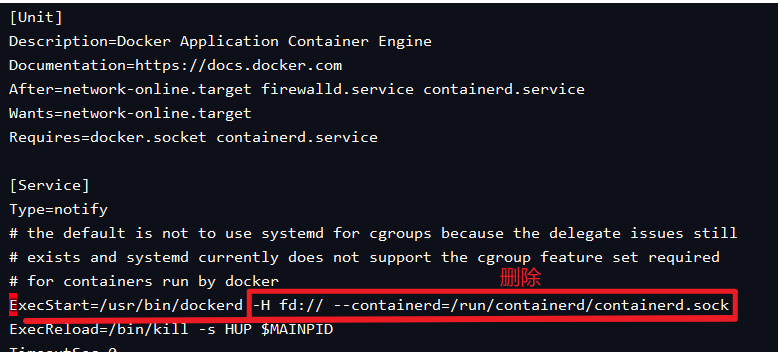
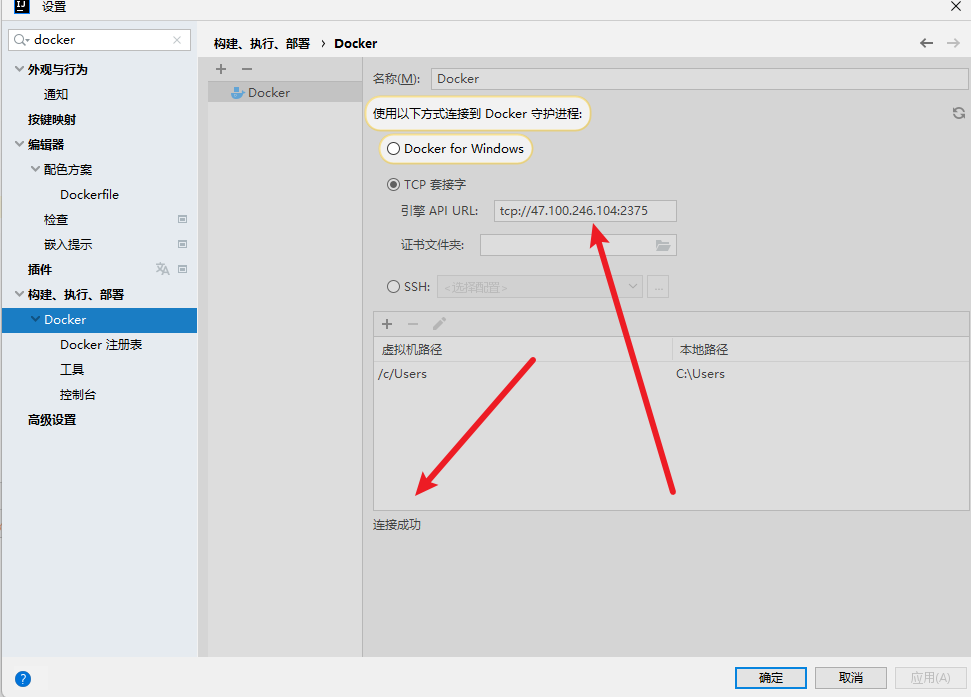
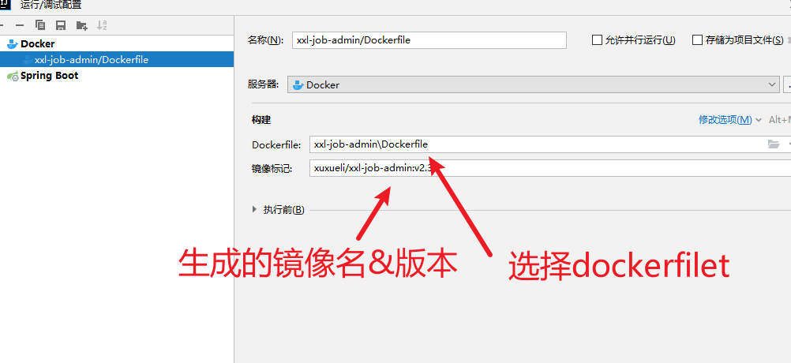

## 一：连接远程docker，开启远程访问，已经开启，可跳过此步

```
// 修改文件 vim /lib/systemd/system/docker.service 
```


配置内容需要替换：


  将上面删除后，替换下面的内容：

```
-H tcp://0.0.0.0:2375 -H unix:///var/run/docker.sock
```


## 二：重启docker环境

```
sudo systemctl daemon-reload 
sudo systemctl restart docker 
```


## 三：IDEA连接docker





## 四：maven-->>package

**编写DockerFile**

```
FROM openjdk:8-jre-slim
MAINTAINER xuxueli

ENV PARAMS=""

ENV TZ=PRC
RUN ln -snf /usr/share/zoneinfo/$TZ /etc/localtime && echo $TZ > /etc/timezone

COPY /target/xxl-job-admin-*.jar /app.jar
COPY /src/main/resources/application.properties /data/application.properties

ENTRYPOINT ["java","-Dspring.config.location=/data/application.properties","-jar","/app.jar"]
```