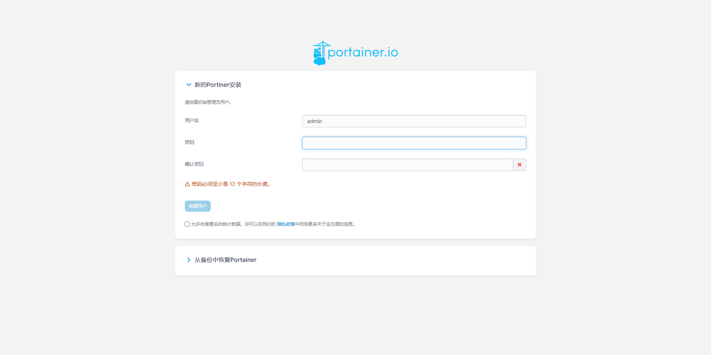
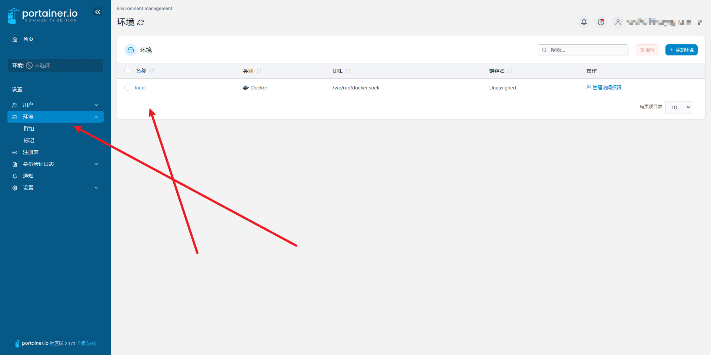
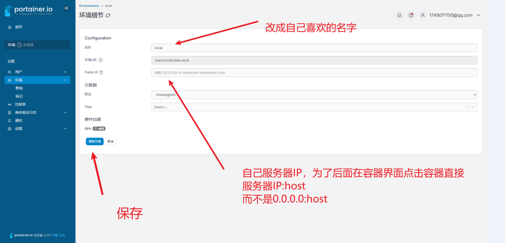
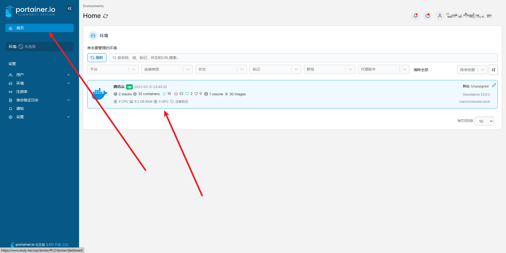
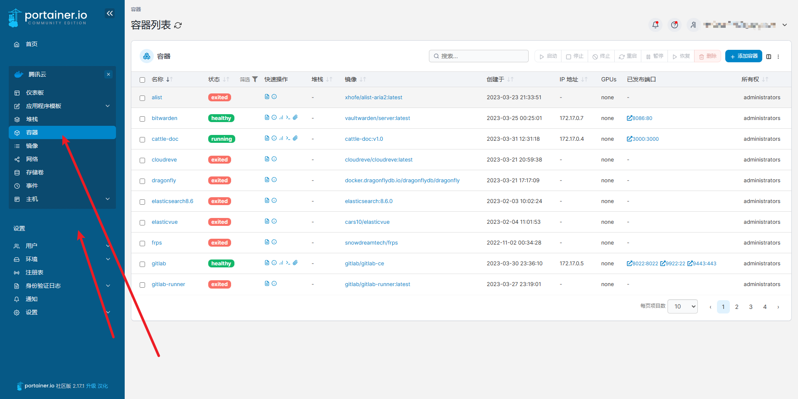

# Docker-可视化之 Portainer

- 汉化文件地址[Docker管理面板Portainer中文汉化 新增CE、EE企业版汉化 - 我不是矿神 (imnks.com)](https://imnks.com/3406.html)


## 1.创建文件夹

```sh
mkdir -vp /home/docker/portainer/{public,data}
```

## 2.下载汉化包

```sh
wget -P /home/docker/portainer/public http://code.imnks.com/zip/portainer-ce-public-cn-20221227.zip
```

## 3.解压

```sh
unzip -u /home/docker/portainer/public/portainer-ce-public-cn-20221227.zip -d /home/docker/portainer/
```

## 4.Docker安装portainer

```sh
docker run -d -p 9000:9000\
 --name portainer \
 -v /home/docker/portainer/public:/public \
 -v /home/docker/portainer/data:/data \
 -v /var/run/docker.sock:/var/run/docker.sock \
 portainer/portainer-ce:linux-amd64-2.18.1-alpine
```

## 5.访问

```sh
ip:9000
```

## 6.注册等基本配置

- 注册



- 修改环境








