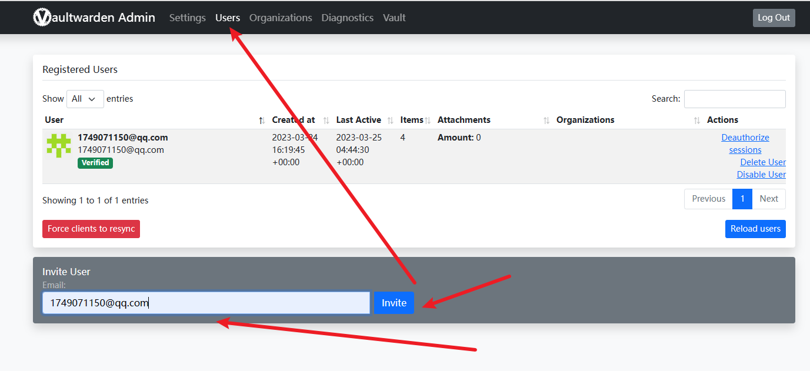

# Docker-密码管理器 `bitwarden`

- 要有自己的域名，用来访问
- 详细地址[Docker应用，我来了：使用Bitwarden来管理你的密码吧。一个基于反向代理的Docker应用安装教程。_哔哩哔哩_bilibili](https://www.bilibili.com/video/BV12i4y1F7YP/?spm_id_from=333.999.0.0&vd_source=89ec2924db7af25af0e0fa8966d64968)

## 1. 创建token

```sh
 openssl rand -base64 48
```

```sh
8aM3EGFzM/nI7b2CK2I/9t7X870803hX9bQQb7QFd//asAJ7F2tiGki3ahaLgthu
```

## 2.创建容器

```sh
docker run  -d \
    --name bitwarden \
    -p 8086:80 \
    -e ADMIN_TOKEN='8aM3EGFzM/nI7b2CK2I/9t7X870803hX9bQQb7QFd//asAJ7F2tiGki3ahaLgthu' \
    -v /home/docker/bitwarden:/data \
    vaultwarden/server:latest
```

### 3.登录后台`http://ip:host/admin`[gitlab.rb]

- 基本配置


- 配置域名


- 配置发送短信邮箱，QQ邮箱示例
- 这个配置不会可以百度


- 保存


- 测试邮箱配置是否成功


- 发送要注册时的账号



- 邮箱链接进去注册

## 4.添加账号密码


## 5.插件使用

- 输入域名、你注册时的邮箱密码即可
- 一定要配置域名


## 6.nginx代理

- 我用的 `Nginx Proxy Manager`

- **Nginx Proxy Manager**[Docker安装及各种容器搭建 (study-tao.top)](https://www.study-tao.top/#/md/Docker/Docker安装及常用容器部署?id=十五【docker系列】一个反向代理神器nginx-proxy-manager)

- ```sh
  location = /identity/accounts/prelogin {
      rewrite ^/identity/accounts/prelogin$ /api/accounts/prelogin;
      proxy_pass http://自己的bitwarden ip: bitwarden端口 8080/;
  }
  ```


