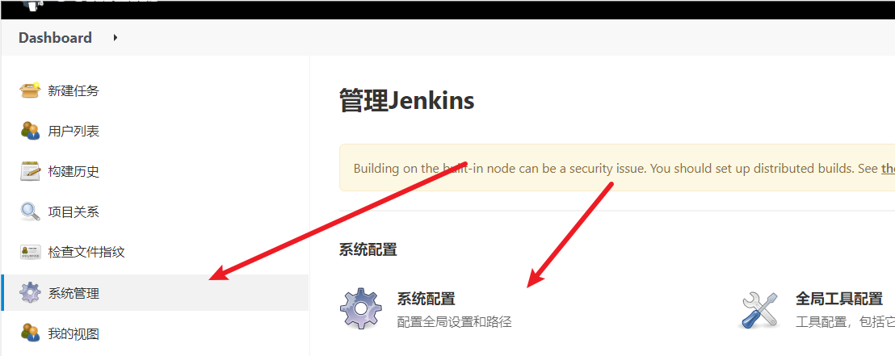

# Docker-GitLab

## 1.容器部署

```sh
docker run -itd \
-p 8022:8022 -p 9922:22 -p 9443:443 \
-v /home/docker/gitlab/etc:/etc/gitlab \
-v /home/docker/gitlab/log:/var/log/gitlab \
-v /home/docker/gitlab/opt:/var/opt/gitlab \
--privileged=true \
--name gitlab \
gitlab/gitlab-ce:latest
```

- 查看`docker gitlab`版本命令`docker exec gitlab gitlab-rake gitlab:env:info`
## 2.修改gitlab.br

```sh
vi /home/docker/gitlab/etc/gitlab.rb
```


+ 添加

```sh
##！添加
external_url 'http://服务器ip:8022'
gitlab_rails['gitlab_ssh_host'] = '服务器ip'
gitlab_rails['time_zone'] = 'Asia/Shanghai'
gitlab_rails['gitlab_shell_ssh_port'] = 9922
##! 限制内存
## 是指在 Puma Web 服务器中，一个 worker 进程最大的接收请求的时长。如果 worker 进程的请求处理时间超过了这个设置的值，则 Puma 将关闭该 worker 进程，并创建一个新的 worker 进程来代替它。

## Puma 是 GitLab 默认使用的 Ruby 应用服务器，用于处理 GitLab 应用程序的 HTTP 请求。在高负载的情况下，worker 进程可能会被卡住或是出现死循环等问题，甚至可能会长时间占用系统资源。为了避免这种情况，您可以通过配置 puma['worker_timeout'] 来控制 worker 进程的最大请求处理时间。

## 通过适当的设置 worker 进程的最大请求处理时间，您可以确保系统在高负载时能够快速响应请求，同时避免资源的浪费和应用程序的挂起。但是要注意，将 puma['worker_timeout'] 设置得太小可能会导致 worker 进程过于频繁地关闭和重新启动，并可能影响应用程序的性能。因此，您应该根据实际情况加以调整。
## 单位 秒s
puma['worker_timeout'] = 30
##  GitLab 运行时使用的 Puma worker 进程数
puma['worker_processes'] = 4
## 用于限制每个 Puma worker 进程的最大内存占用量。该参数的设定可以保证每个 worker 进程所使用的内存量不会超过设定的值，从而避免了内存崩溃等问题。

## 对于个人使用来说，可以将 puma['per_worker_max_memory_mb'] 的值设置为 512 MB，这样可以保证 GitLab 应用程序的正常运行，同时也不会占用过多的服务器资源。但是，具体值还是需要根据实际服务器的资源状况和 GitLab 应用程序的运行情况来进行适量调整。

## 需要注意的是，如果设置得过低，可能会导致 GitLab 的性能受到影响，因此需要在保证系统稳定性的前提下，对该参数进行合适的调整。
puma['per_worker_max_memory_mb'] = 512
## 用于控制 Sidekiq 的最大并发数。Sidekiq 是 GitLab 的后台任务处理引擎，用于处理 GitLab 中各种异步任务，例如发送邮件、执行后台任务、处理 CI/CD jobs 等。

## 这个参数设置的值会直接影响 Sidekiq 的性能和运行速度。值越大，处理任务的速度越快，但也会消耗更多的服务器资源。因此，建议根据实际需要和服务器资源情况来进行设置。

## 对于个人使用来说，可以将 sidekiq['max_concurrency'] 的值设置为 2 或 3，这样就可以保证 GitLab 后台任务的正常运行，同时也不会占用过多的服务器资源。

## 当然，如果您的 GitLab 后台任务较为繁重，或者有大量 CI/CD jobs 需要处理，可以适当增加该参数的值，以提高处理速度和响应能力。
sidekiq['max_concurrency'] = 2
#减少数据库缓存(默认为256MB 我改为64MB了)
postgresql['shared_buffers'] = "64MB"
 #减少数据库并发数(默认为8 我改为1了）
postgresql['max_worker_processes'] = 1
# Prometheus 监控系统的集成 ,不需要
prometheus_monitoring['enable'] = false
```

## 3.使用外部数据库（可选）

- 外部数据库一定要先建个属于`GitLab`的数据库

```sh
#外部数据库postgresql
gitlab_rails['db_adapter'] = 'postgresql'
gitlab_rails['db_encoding'] = 'utf8'
gitlab_rails['db_host'] = '127.0.0.1'
gitlab_rails['db_port'] = 5432
gitlab_rails['db_database'] = 'gitlab'
gitlab_rails['db_username'] = 'postgres'
gitlab_rails['db_password'] = 'root'

## 外部redis
gitlab_rails['redis_host'] = "127.0.0.1"
gitlab_rails['redis_port'] = 6379
#gitlab_rails['redis_password'] = nil
gitlab_rails['redis_database'] = 15
```

## 4.登录

+ 重启 初次创建查看密码，账号是root

```sh
docker exec -it gitlab grep 'Password:' /etc/gitlab/initial_root_password
```

## 5.配合Jenkins实现CICD

[devops jenkins配置gitlab进行触发构建](https://www.cnblogs.com/scajy/p/15567387.html)

```sh
#jenkins 配置gitlab自动构建
在gitlab==>右上角设置==>左侧获取token==>①令牌名称 ②选择API ③创建 ===>m_QvcTh8MpNYjMT6BQN1
```


```
首先下载gitlab插件
在jenkins系统管理==>系统配置==>
```




- 在任务中配置的是账号密码
  
- 配置的token选这个，构建
  
  
- 复制配置构建的连接和token

```sh
http://127.0.0.1:8080/project/demo
057dbec43ff7602f4e8e56bfbc08426f
```

- 配置gitlab自动触发配置
  
- 保存的时候，发现提示错误，URL被阻止：不允许向本地网络请求 报错
  
  
- 重新添加

```sh
http://127.0.0.1:8080/project/demo
057dbec43ff7602f4e8e56bfbc08426f
```

```sh
# maven命令 
clean package -DskipTests docker:build -DpushImage

# 依次:
# 清除 打包 跳过单元测试 远程构建镜像  上传镜像到注册中心
```

```sh
git config --global user.name "174901150"

git config --global user.email "admin@example.com"
ssh-keygen -t rsa -C "admin@example.com"
```
