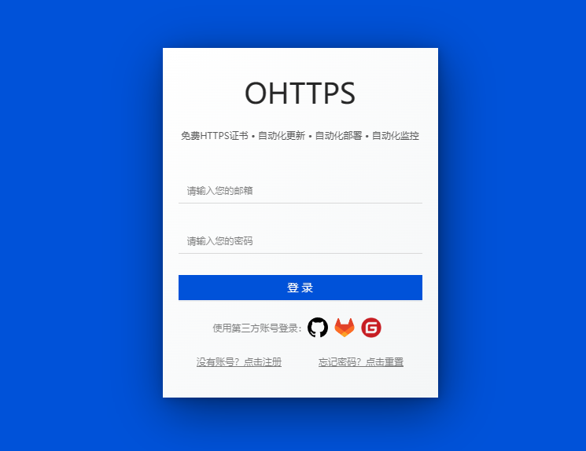
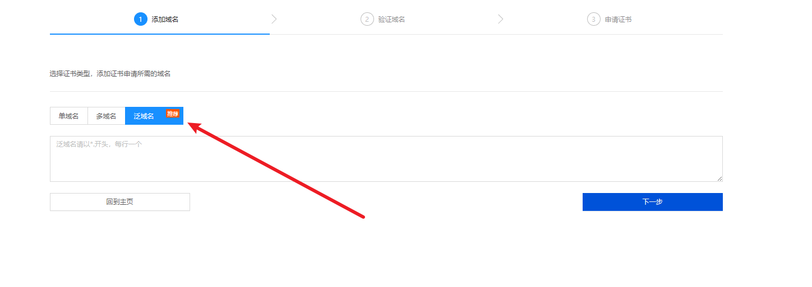
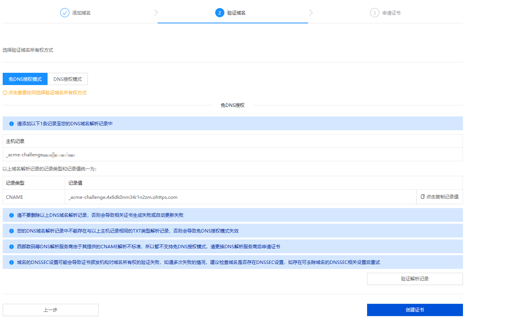
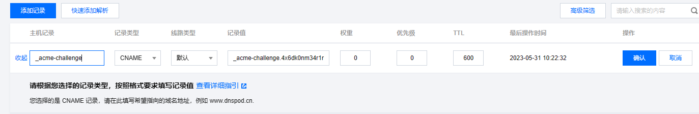
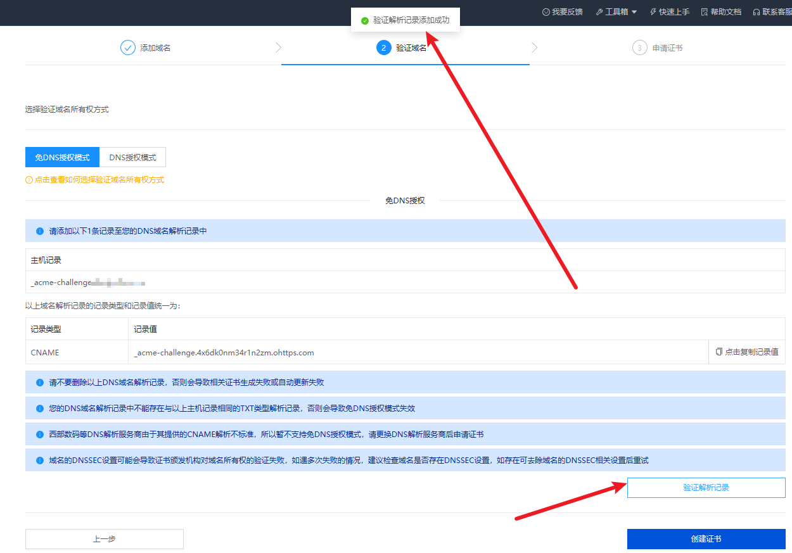
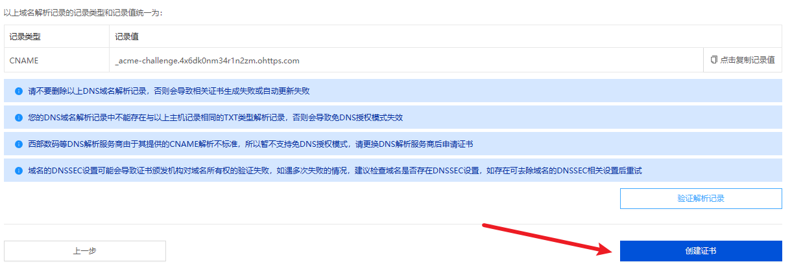
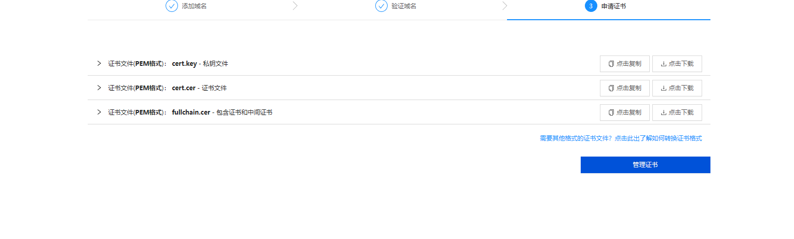
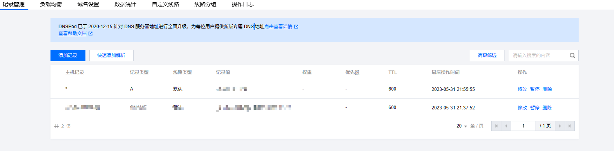

# 通配SSL证书
- 不用每个域名都去创建一次证书

## 免费申请地址
[OHTTPS](https://ohttps.com/)

### 1、需要注册账号

### 2、选择泛域名
- 输入`*.你自己的主域名`,例子：`*.abc.com`

### 3、选择`免DNS授权模式`

### 4、添加到你的域名解析位置

- 这里的主机记录只需要输入前面一节

### 5、验证解析记录

### 6、创建证书

### 7、通配解析二级域名

- 不需要每个二级域名就创建个解析
- 只需要`nginx`配置好就行

